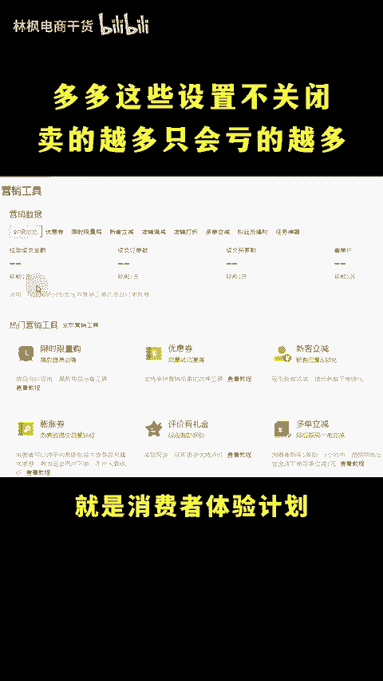
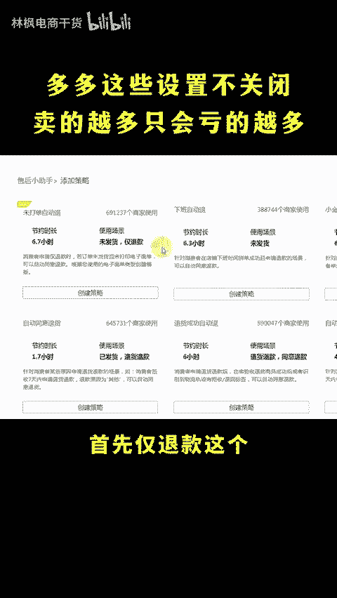
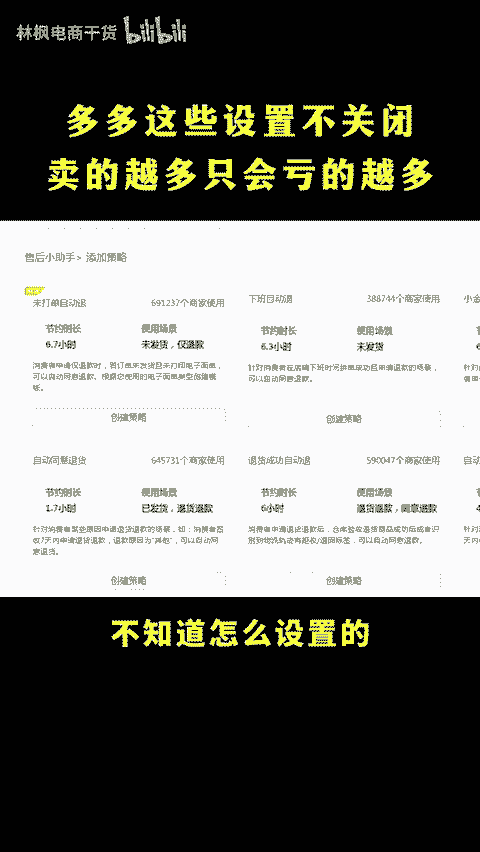
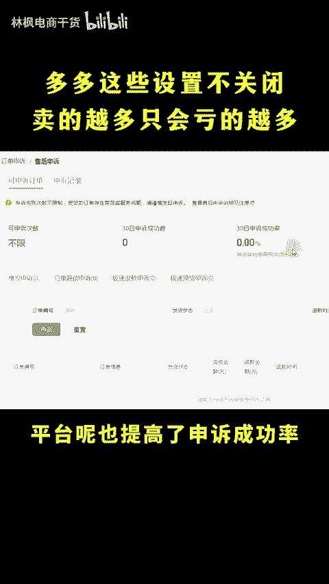
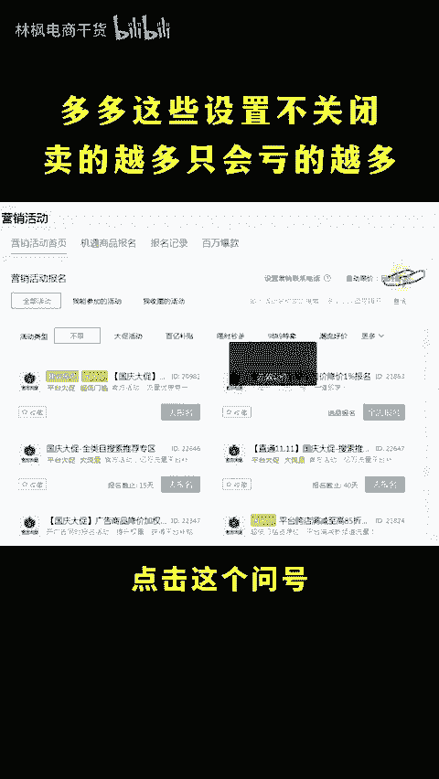
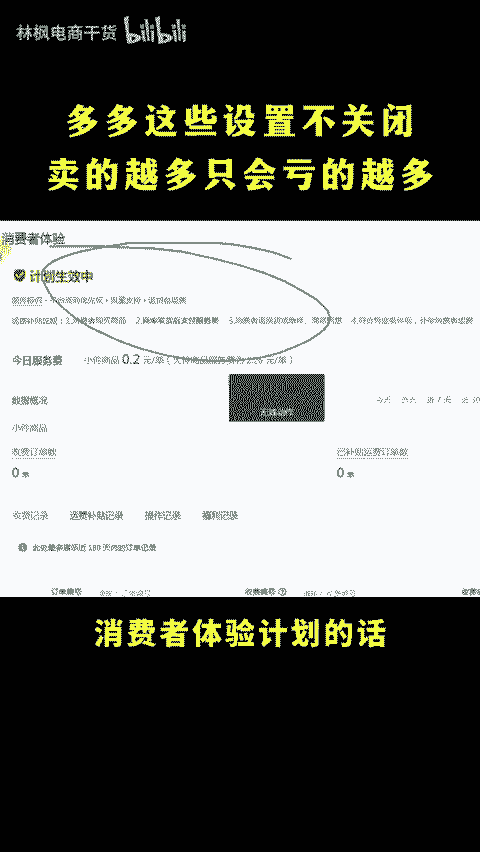
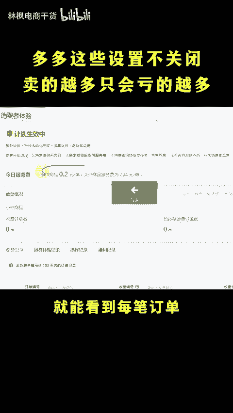
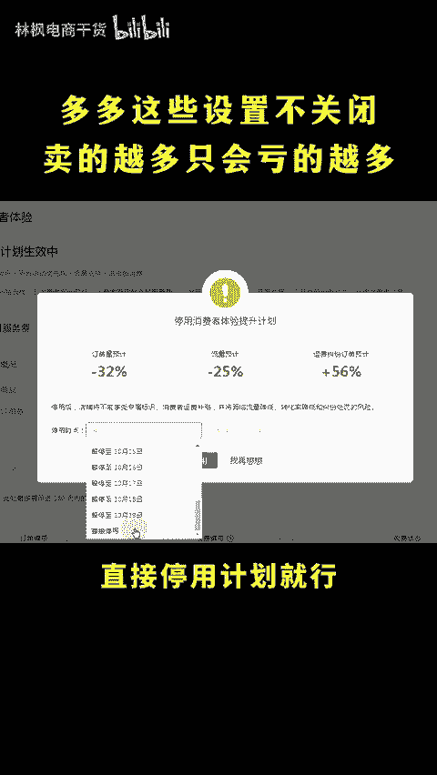

# 拼多多这些设置不关闭卖的越多只会亏的越多！ - P1 - 林枫电商干货 - BV1Fu1dY5EGZ

做多多，我怎么订单越多亏的反而越多了呢？那你一定是做到了全网最低价，订单都是高价开车获取的，亏损很正常。😡，🎼my god但越多亏损越多，怎么回事啊？这种多半是因为你没有关闭后台的几个乱扣费的设置。

扣的多的，一旦能够扣个几十上百块。具体关闭的技巧，可以点个关注点个赞，直接上时兆。首先常见的扣费设置呢就是消费者体验计划。仅退款和自动跟价新练这些是一定要关闭的。首先仅退款这个没有直接关闭的设置。

但是呢这个方法能让你减少80%的仅退款，不知道怎么设置的，看我主页视频。同时呢仅退款订单还可以不限次数申诉了。平台呢也提高申诉成功率，不会的可以看我前面的视频啊，自动跟价的话，先去营销活动。

点击这个问号，在自动跟价说明，后面有关闭按钮，直接关闭即可。消费者体验计划的话，后台找到售后管理，点击消费者体验计划，进来之后呢就能看到每笔订单都会扣个几毛到几块不等。关闭的话，点击右上角的更多。

直接停用计划就行。还没有关闭的，抓紧去关闭吧，希望可以帮助到你。😊。

