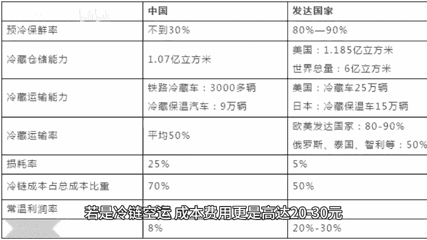

# 拼多多重新定义包邮区 - P1 - 股市机械化生产队 - BV1sgxweNEL2

🎼今天想讲一个特别经典的案例，商业规律是如何被时代发展硬生生改变的？一直以来，新疆西藏地区的电商业务都被认为是一个无法实现的业务。新疆等地的运费普遍要一单几10块起步。对于许多电商品类来说。

这个运费甚至比产品本身还贵。理所当然的如此高的运费，也杜绝了许多商家在新疆地区搞包邮的尝试。而且这个高昂的运费，你也无法用平台政策，行政命令去取消。因为路途遥远，这个客观问题是确确实实存在的。

基于这些现实因素，许多人都认为，新疆地区的电商业务很难发展起来。但这两年开始不一样了。根据国家邮政局公布的数据，2023年，新疆快递业务量不包含邮政包裹，累计完成3。051件。

快递业务收入累计完成62亿元。🎼同比分别增长88。1、77。9%。🎼两项增速均位列全国第一。🎼新疆的电商业务开始以极快的速度在增长，是什么改变了原本被认为无法实现的新疆电商呢？第一个是基础设施建设。

由新疆地方政府牵头。这几年，新疆地区持续完善通道加枢纽加网络现代物流运行体系。到今年5月，新疆电商协会成立。🎼又将13个物流节点城市作为区域物流枢纽承载城市，布局建设了16个区域物流枢纽。

并大力推进了村村通陆路通快递进村，极大加强了物流基础设施，但这还不够，物流的加强固然能降低运费，但距离江浙沪等包邮区依然还有不小的距离。于是第二就是加强新疆本土电商产业，减少来回空单。

一辆大卡如果带货进江但空车出去，成本会非常高。这也是过去新疆电商逃不开的一个痛点。可如果能做到带货进江又带货出去，一来一回都有货搭载物流成本不就大大降低了吗？

新疆各地首先想到的就是当地气候条件下的各种农产品特产，并积极吸取了过去几年内陆地区电商村经验，大力发展村镇农产品电商化。到2023年。🎼新疆地产水产品网络零售额实现3。95亿元。🎼同比增长106。

26%。🎼其中，新疆螃蟹甚至送达了上海、广东等省区客户的餐桌上。🎼如何贩卖水产，如何保证运输过程与虾蟹存活？🎼这些过去的难题。🎼只要用心学，其实都是有现成经验参考的。🎼而第三就是政企合作。

拉大电商盘子来平摊成本。🎼2022年，拼多多首创了中转集运包邮模式。🎼商家可以先将新疆消费者的包裹送至西安中转集运仓。而后，平台再通过第三方物流统一发货至新疆，过去商家自己点对点直发。

物流成本普遍是15元起步。若是冷链空运成本费用更是高达20到30元。集运模式下，物流成本会大幅下降，商家通常只需承担发货的，到集运仓的运费，以及每单额外3到5元的2段运费，在物流成本大幅降低的基础上。

拼多多又大胆启动了免费包邮送货进村服务，及商家在新疆、西藏、甘肃、宁夏、内蒙古等偏远地区配送商品时产生的物流中转费，将全部由平台承担，这是非常冒险的一步棋。因为平台需要贴进去很多运费，但收益也非常明确。

平台下场通过补贴拉平新疆等地运费。商家自然也愿意大胆给新疆等地发货。

🎼新疆等地的用户也就会有更高网购积极性，带动整个地区电商订单增长，而整个地区电商业务增长，又会反过来进一步降低每一单的运费成本。过去订单少，大卡车要等上几天，攒购包裹集中运输，现在订单量大。

大卡车可以天天发货。🎼事实是，商业规律并不是一成不变，它也是会受客观因素影响的。🎼基础设施加强，物流成本下降，集中发货模式建立。🎼物流成本进一步下降，此时，在有电商用户大幅增长。

快递订单大大增加诸多因素的共同作用下，达到某个阈值过去看似无法解决的某个难题。🎼可能就消米在时代的车轮下。

