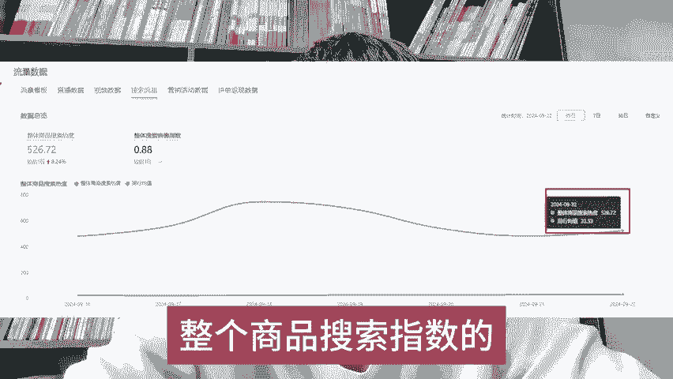
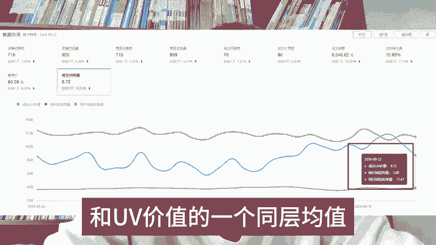

# 拼多多，一周只卖一单 - P1 - en莉莉安 - BV1fKsheiEgf

多多多一周只卖出了一单，99%是你只上架了链接，其他的什么都没有去做链接没有权重，一单不卖都正常。想查看权重就打开店铺的一个流量数据，选择搜索流量。在这里呢你能看到整个商品搜索指数的一个曲线图。

如果说你的曲线低于同行的一个平均水平，或者说直接躺平的状态，那就是权重太低了，需要你赶紧去补指数拉高权重。如果说你不知道怎么去补权重的，就打开你的一个流量看板。

然后把你店铺的访客数和UV价值的一个同层均值也记录下来，把这两个数值相乘，就是我们需要做的一个坑场。然后呢用这个数据除以你的客单价，就是你需要做的一个单量。只是做个一周指数就会出现明显的一个提升。

如果还有什么不懂想做好多多的，我把拼多多的一些方法也整理成了一个文档，需要的呢，直接给我发三个7，分享给你们，希望能够帮助到大家。

