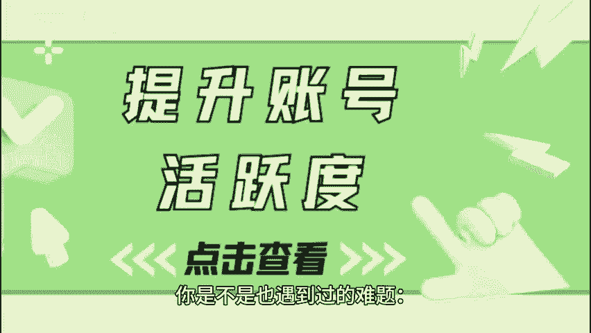
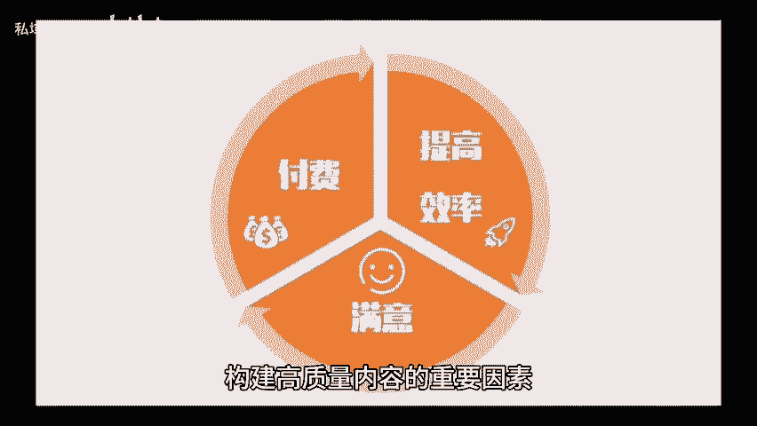
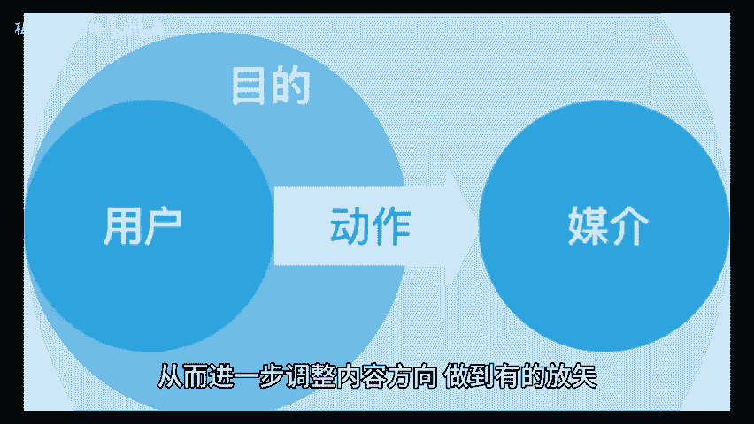

# 提升账号活跃度，这三个运营策略你用对了吗？ - P1 - 私域运营咚咚 - BV1Uh2tYEE3t

🎼你是不是也遇到过的难题，账号在内容发布后，活跃度却不尽如人意，这不仅影响到粉丝的数量，还可能导致用户的流失。事实这三个优化账号策略，提升账号活跃度，并明确目标与定位并注重内容质量。这是内容创作的基础。

也是吸引用户关注的重要因素，明确目标意味着你需要清楚你希望通过这个账号达到什么样的效果，是增加品牌曝光，获取潜在客户还是提供信息服务。这一点直接影响到你内容的方向和质量。

而内容质量决定了你是否能够吸引并留住用户，在创作过程中紧跟热点，结合用户需求，确保信息准确性和专业性都是构建高质量内容的重要因素。2、保持账号的活跃度积极互动。一个长时间不更新的账号。

会让用户渐渐失去兴趣。因此，定期的内容输出和活跃的互动，非常必要。为了避免长期没有新内容引起用户流失。建议每周至少发布2到3篇文章，同时也可以利用现实活动。😊。

🎼加日等机会进行内容推进，吸引更多用户参与，同时还要积极与用户互动。不论是评论区的回复私信的互动，还是在文章末尾提出问题，引导用户讨论，都可以有效提高用户的参与感。3、优化账号管理和分析。

通过平台自带的数据统计功能。你可以了解到文章的阅读量、点赞数、分享数以及用户的性别年龄等信息。这些数据能够帮助你了解目标用户是谁，识别哪些内容受到了欢迎。哪些都不尽人意，从而进一步调整内容方向。

做到有地放矢。在实施这些策略的同时，不要忘记倾听用户的声音，不断调整自己的方向，才能让自己的运营效果更好哦。😊。

