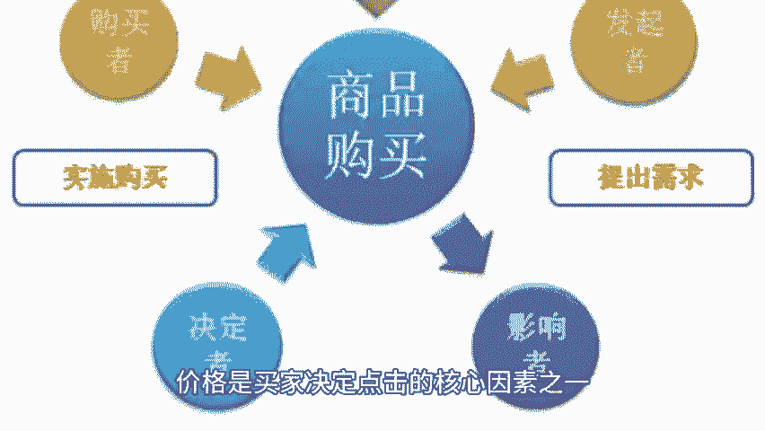
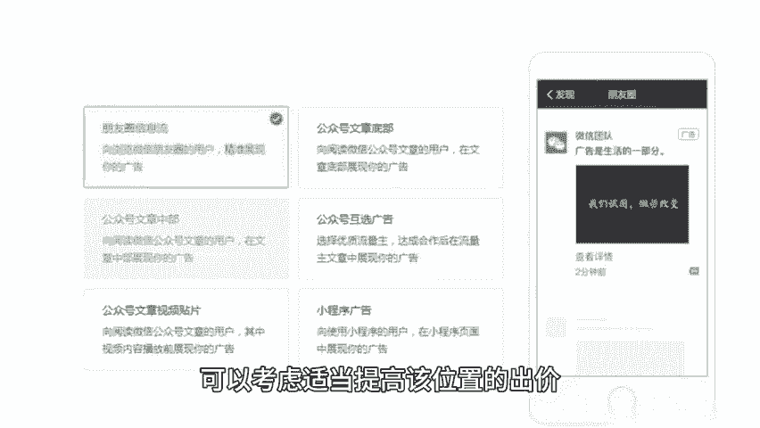
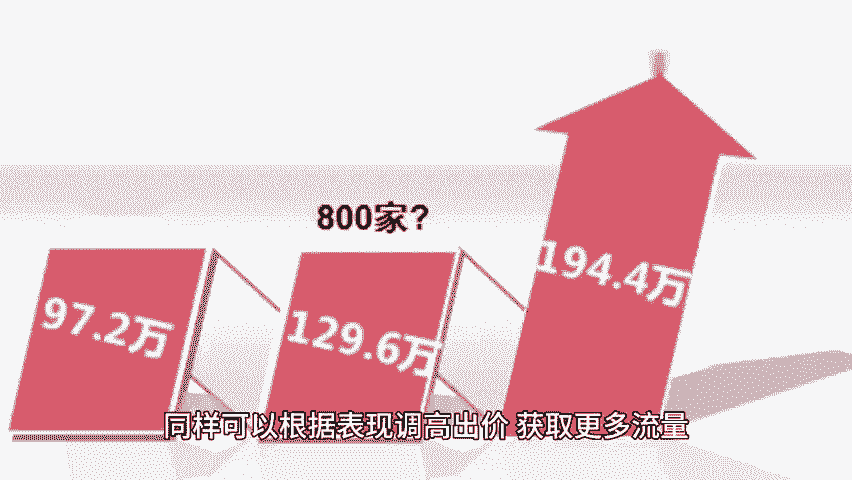
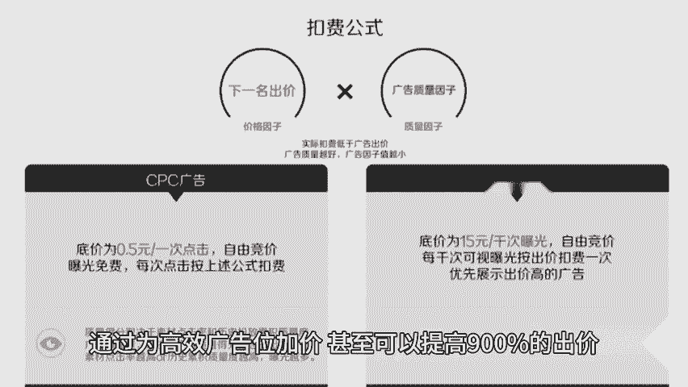
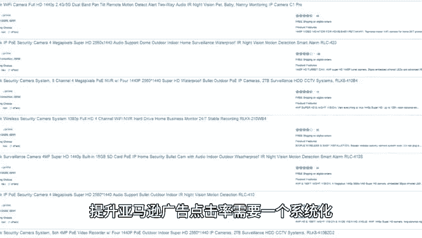

# 提高亚马逊广告点击率的神技，点燃销售引擎！ - P1 - 小猛龙跨境俱乐部 - BV1QAsoeeE5t

🎼在亚马逊平台上，广告点击率CTI直接影响着销售转化率。本期给大家分享提高亚马逊广告点击率的神计，同时为大家准备了2024亚马逊广告打法。老规矩回复亚马逊广告，我来安排。

如果你希望广告被更多潜在买家看到并点击。那么提升点击率是不可或缺的关键环节，精准流量是提升点击率的第一步，吸引到的流量必须是对你的产品真正感兴趣的用户，要做到这一点，你需要优化广告的受众群体。

从而提升广告的点击率，通过优化产品的listing，让亚马逊系统更好的识别和理解你的产品属性，从而把广告展示给更相关的用户。确保标题关键词和描述准确且详细，这样系统就能精确匹配用户的搜索意图。

提升广告展示的精准度，不仅要吸引有价值的流量。

🎼还要剔除无关的流量，这时否定关键词和否定商品功能就能派上用场。否定关键词。🎼将那些不会产生转化的关键词排除在外，避免浪费广告预算，从而把广告展示给那些真正有可能购买你产品的潜在客户，否定商品。

通过否定特定商品。🎼避免广告出现再不相关的产品页面，避免无效点击，进一步优化广告的展示。

🎼广告展示的质量直接影响点击率。在广告竞争激烈的环境中，广告素材的表现力至关重要。以下几个优化技巧可以让你的广告更具吸引力，从而提升点击率，主图是用户对广告的第一印象。

高质量清晰的主图可以瞬间吸引用户的注意力，确保图片专业能突出产品的核心卖点，比如功能性或与竞争对手的差异，广告标题是影响点击率的另一关键因素，通过参考类目中的头部卖家的广告标题，抓住用户需求。

精准传达产品的独特卖点，使潜在买家在一瞬间理解产品的价值，价格是买家决定点击的核心因素之一，确保你的产品定价具有竞争力，时常参与促销活动，添加折扣券等优惠方式，来吸引用户点击，了解广告位的表现。

是优化点击率的关键步骤之一。

🎼亚马逊广告位分布多样，各个位置的广告表现也会有显著差异。因此，你需要通过广告位报告来优化点击率。🎼如果广告在搜索结果首行位置表现突出。🎼可以考虑适当提高该位置的出价，以获得更多曝光和点击。

如果某些商品页面广告效果良好，同样可以根据表现调高出价，获取更多流量，对于其他位置的广告，也可以根据报告数据进行灵活调整，通过为高效广告位加价，甚至可以提高900的出价，确保获得最大化的曝光。

提升亚马逊广告点击率，需要一个系统化，持续优化的过程，你可以从流量精准度，广告展示元素，以及广告位数据分析三方面入手，不断测试并调整策略，最终有效提升点击率，推动销量增长，记住。

每一次点击都是销售的潜在机会，掌握这些技巧，你就不会错过任何一个曝光的机会，天幅有限，获取亚马逊广告打法，以及更多亚马逊运营小技巧，点赞关注评论，带你出海不迷路。

