# 揭秘一个引流方法每天精准导流私域500+ - P1 - 高小飘讲私域ufan68 - BV1R9tKeMEAf

🎼今天还是跟大家聊一个每天三五百个精准流量这样的一个引流方式。能听懂的，你听不懂的朋友，非常抱歉，你可以划走一段视频。因为它的内容是有一定门槛的。

我今天分享的这个方式基本上每天最少3到500个精准流量是非常轻松的。目前用这个模式的人还基本上都是引流圈内的人，很多新手小白可能没有办法上市。但是他所适合的行业基本上全部市就直白的告诉大家。

就是广告投流跳转企业微那个模式，你需要什么样的客户，你就在抖音上开账户聚量引擎开户之后，直接去做广告投流。有的朋友会问了，你广告投流，那岂实是很贵，老成本非常高也是很正常。

因为他之前的模式是要完整的去留下客户的资料，对不对？你再去联系现在这个模式改进了之后，通过我们的广告投流之后直接是跳转到企微的那这个成本就大大的降低了。我举一个例子，我们之前有一个客户是做成人考证的。

他的业务面非常广，很多人都适合他就用传统的方法去投流之后做流客资综合算下来，他的成本合到了七八十块个人。每天广告费太夸张了，他坚持不下去了。但是后来这个玩法改进了之后，直接投流。

直接跳转加企微一瞬间的时间。

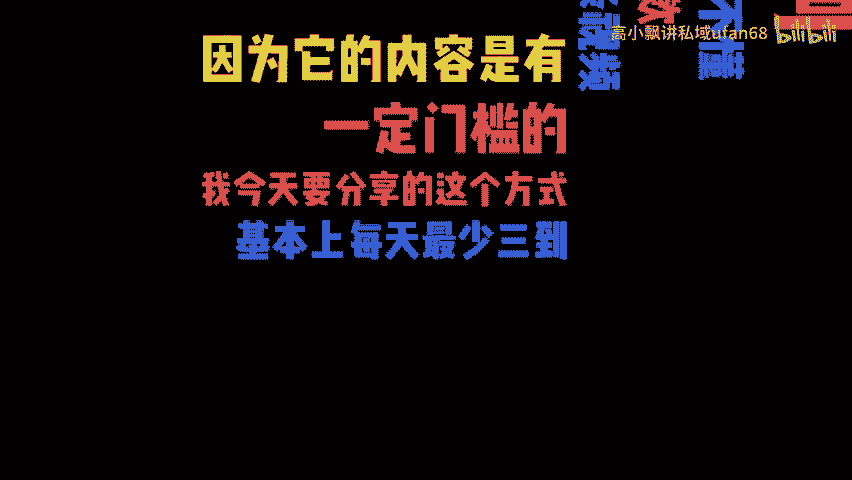

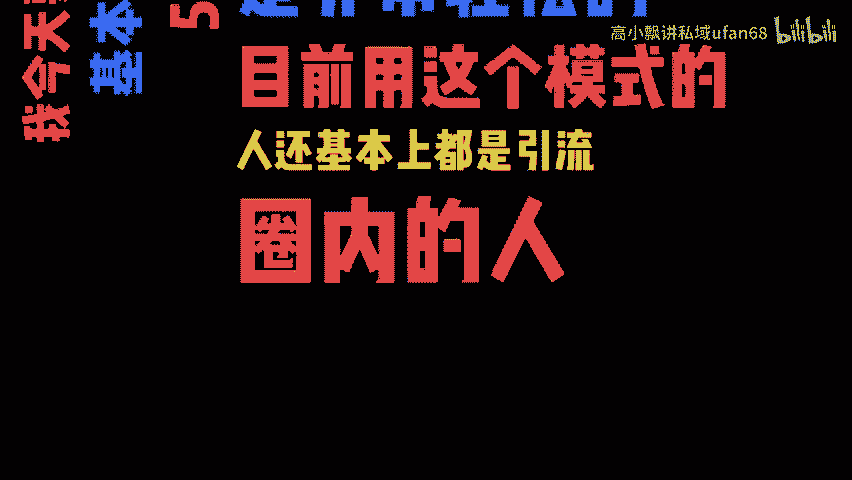

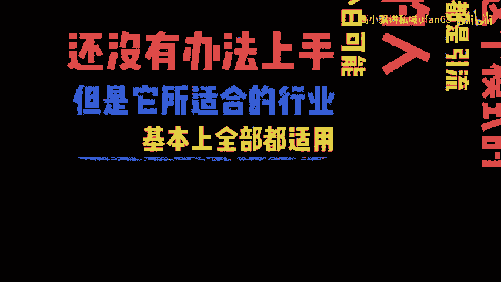

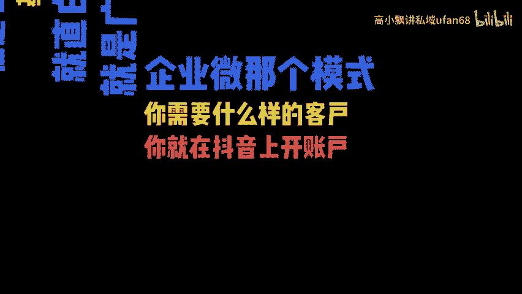

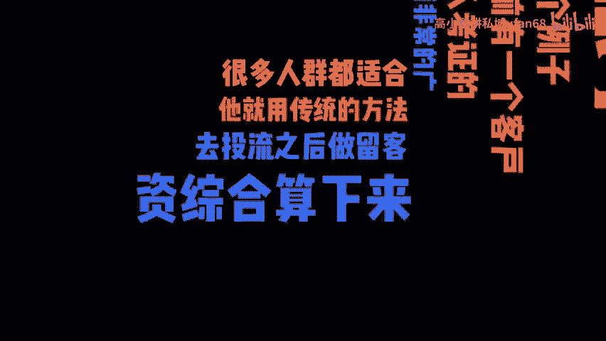

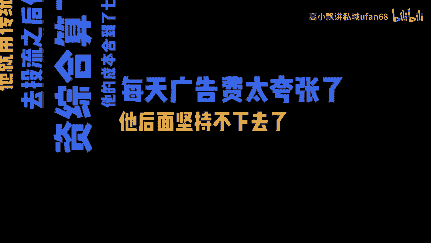

🎼块的一个单价成本，一下子就降到10到20块左右。大家知道这个抖爸爸这个地方它最不缺的是什么？最不缺的是流量。只要你把对接定向落地，这些东西都做好了。

那么你投流回来的用户一定是非常精准的客户这个数量要多少就有多少。那么前提是你在你这个广告账户里面能准备多少子弹。

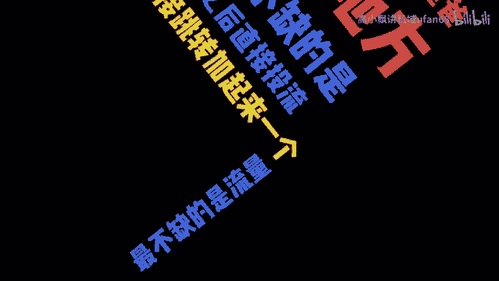

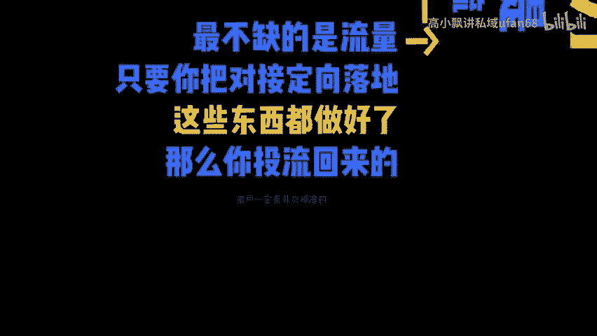

🎼对吧而且这个模式的核心为什么我说小白很难下手呢？它很类似于我们5年前8年前玩那个什么什么度那个竞价的模式，他要持续去做账户优化，要不断的去把账户的这个模型去给它完善，花了多少钱，哪些关键词对吧？

每个词是多少钱等等，不断的要去优化。你优化的越多，数据越多，那么你的客户成本可能会再下降，从实在上去还能降到几块，对吧？这个方式既精准又不缺流量，核心就在于有一定的门槛。那么圈内的朋友大家都可以去试。

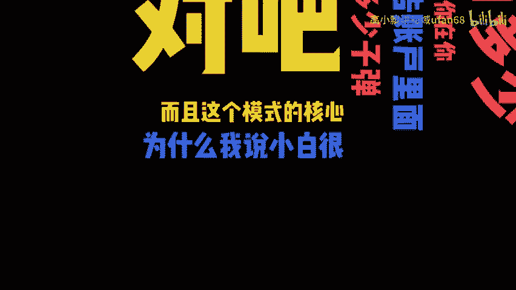

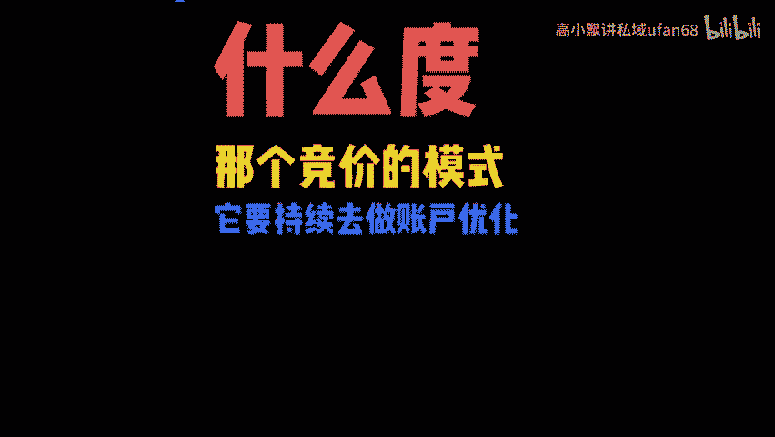

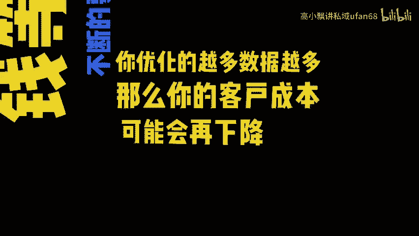

