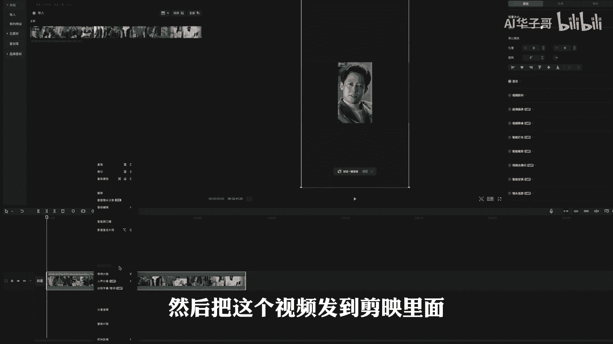
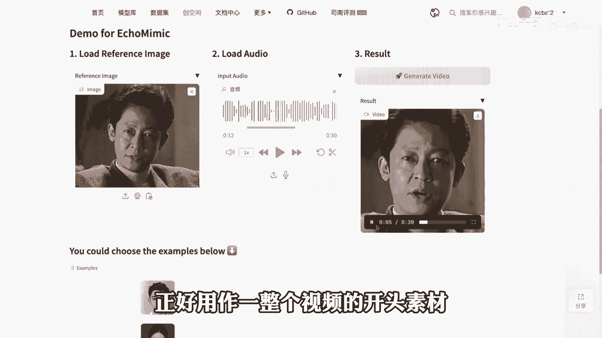
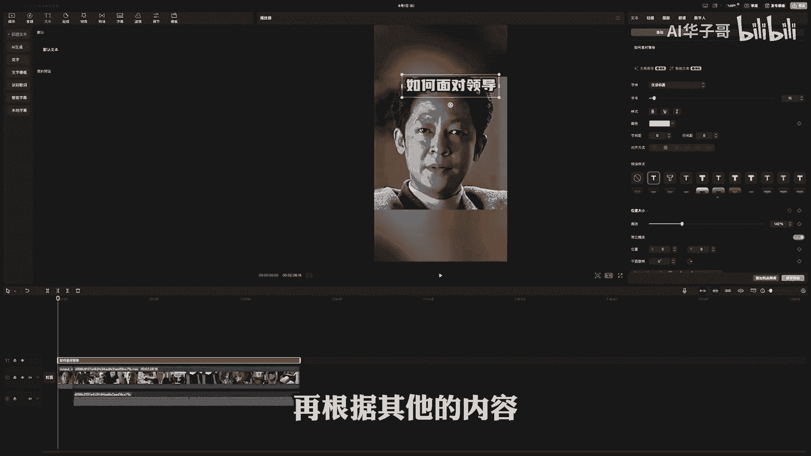

# 揭秘抖音爆火名人语录视频，小白都能轻松起号！ - P1 - AI华子哥 - BV1ZFpUe2EBm

像这样用鸣人的声音生成的认知语录的视频。

到底是怎么制作的，跟大领导打交道啊，你不要太礼貌，你越礼貌，他就越小看你，我给你讲个故事啊，只要你看懂了也行动了，不管你跟什么级别的领导相处，你都能混的是风生水起灵。

其实核心的关键就两个步骤，第一个步骤声音克隆，我们只需要打开这个网页版的克隆工具。

然后点击这个声音构建，上传一段25秒左右的声音样本。

就可以克隆任何人的声音，而声音样本最好的来源，其实就是直接去下载同行的视频，然后把这个视频发到剪映里面。

先把声音和音乐分离出来，只保留声音的部分，然后在导出的时候选择这个。

只导出音频就可以了，声音克隆好之后，我们就可以直接拿它去生成配音文件了。

第二个步骤就是制作一个对口型的视频，我们可以先去百度里面。

搜索一张名人的正面照片，然后打开这个工具，上传名人照片和准备好的音频，接着点击生成，稍等一会儿，他就会制作一个对口型的视频，这个视频大概是十秒钟，正好用作一整个视频的开头素材。

最后把这两部分内容全都导入到剪映里面，再根据其他的内容。

找到一些相关的素材进行混剪，整个的视频就可以导出使用了，以上两个工具都可以在评论区获取无偿分享。

而这样的视频是靠什么去变现的呢。

最常见的方式就是去带书，因为这都是一些认知语录的视频，所以最后植入一些和认知相关的书籍。

