# 教育赛道搜索指数破亿，普通人如何抓住这个机会咸鱼翻身？且看小红书私域引流拆解，轻松日引100+精准粉 - P1 - 乔楠轻创笔记 - BV19z4Ze1E8x

Yeah。

🎼大家好，我是强南。今天要分享一个非常刚需的赛道给大家。长视频制作不易。在开始之前请大家先给个一键三连点个关注，这是我们持续做出更优质的内容。那么在接下来的几个月，这个项目很可能会让你真正的翻升。

我们的团队最近做的英语提分，项目持续爆单，需求量也非常的旺盛。🎼我们先来看两个数据，小学英语的微信指数已经达到了过亿。🎼三年级英语的微信指数也突破了千万。

🎼这些数据大家可以通过微信小程序搜索微信指数就可以看得到了。你也可以试着去查找一下其他类似的指数，也是非常惊人的。🎼这些词的搜索指数其实本来就不低。🎼最近开学了一段时间，数据也是持续的上涨。

大家也应该可以看得出来它的潜力了吧。🎼尽管最近消费环境不太乐观。🎼但中国人的观念是，再穷不能穷教育，再苦不能。🎼所以在教育方面的支出啊。🎼我们团队在词语流量这个领域已经做出了很好的成绩。

今天我会和大家分享如何从引流到成交全流程的一个操作。大家可以放心，这期视频以及所用到的所有工具都是完全免费分享给大家的。🎼希望大家能够给个三连关注，支持一波，有任何问题欢迎在评论区留言。

首先让我们来看一下这个账号，它做了一些适合孩子学习的英文摩耳朵视频，制作方法非常简单。这次我们会用AI教大家如何制作这种视频。🎼我们这次使用的是字节的透包，上手很简单，小南也是第一次使用，可控性不强。

也可能是我不太熟悉。不过胜在免费简单，我们做一些简单的项目已经非常够用了。接下来我们进入实操部分。🎼首先我们打开剪映，然后把素材拖进去。

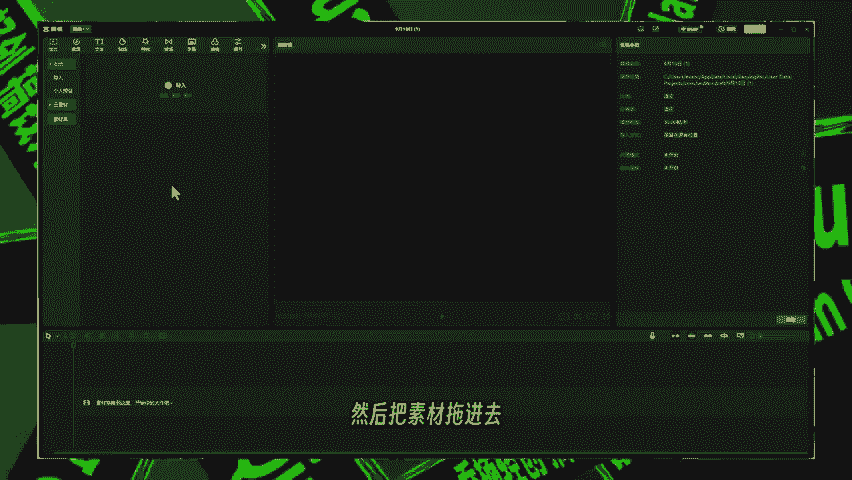

🎼我们需要先把它的歌词提取出来啊。🎼先把这个素材拖到时间轴当中，然后右键。🎼把这个音频分离出来。🎼啊，点这个声音分离。🎼这个声音就被分离出来了。🎼然后点击这个文本。然后再点击这个呃识别歌词。

啊后点开始识别就可以了。

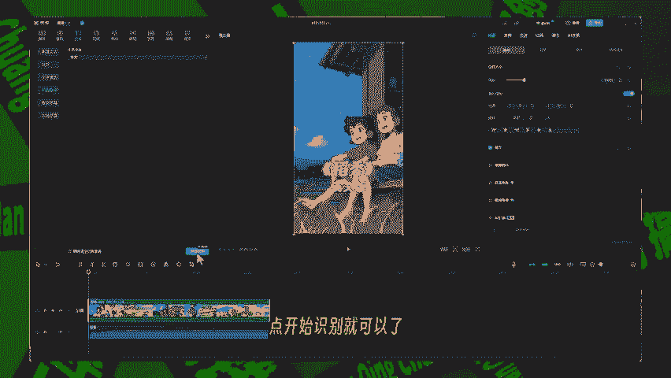

🎼这个新版本它是要开通会员才能识别的，需要老版本剪映，不需要开通会员就可以识别的版本的小伙伴，可以在关注之后，在评论区发一个已关666啊，我会私下发给你。

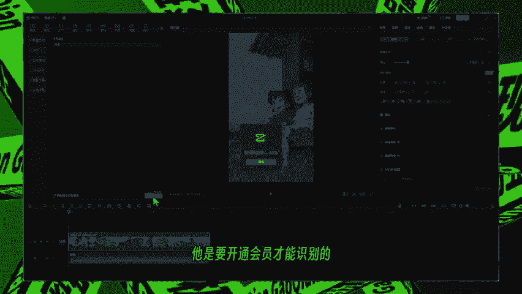

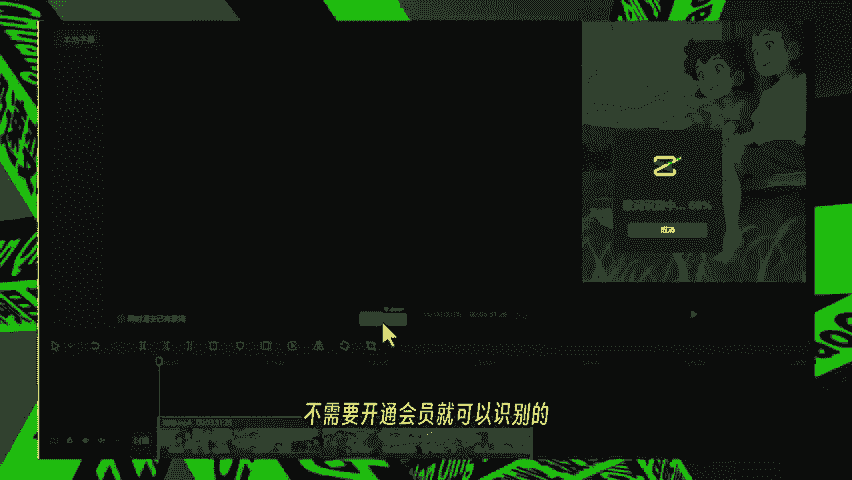

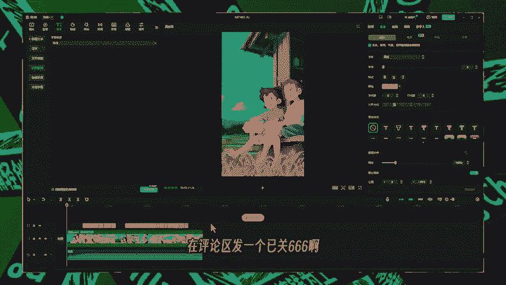

🎼然后点击导出啊，我们。

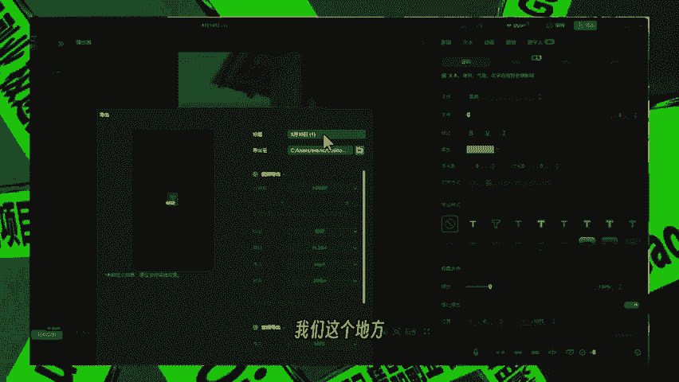

🎼这个地方。🎼需要在下面。🎼点击这个字幕的导出，然后选TXT格式。

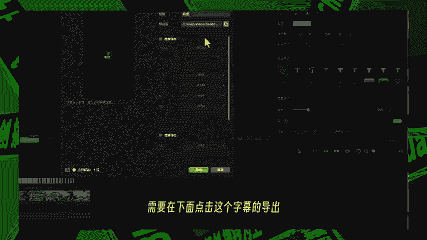

🎼然后歌词就被导出来了，但是它这个歌词比较长啊。🎼呃，我们可以考虑直接用元素材的画面，我们手写提示词其实也挺简单的。🎼呃，如果说歌词相对而言比较简单，而且呃比较有画面感的话。

我们可以直接用它的歌词去生成。

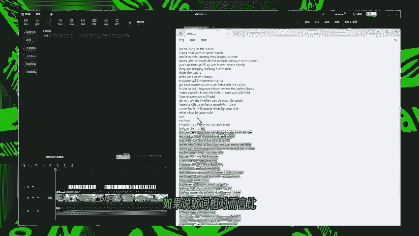

🎼好，我们先看一下它的这个画面啊。🎼啊，都是一些非常简单的画面啊，我们随便找几个画面啊，在这个豆包当中去生成一下。

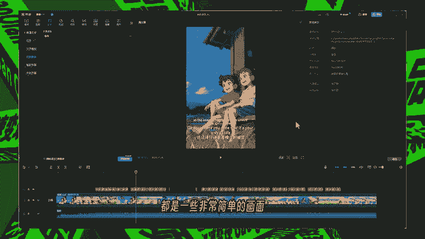

🎼啊，我们可以点击这个图像生成，然后点击这个比例，选择这个9比16。🎼啊，9比16啊，风格的话我们选动漫就可以了。🎼然后我们输入啊两个小孩。🎼坐在。🎼呃，稻田上。🎼那稻田中啊，然后点击发送。

🎼他就会帮我们去生成啊这样的一系列的画面。🎼那我们接着去生成啊，我们可以直接复制刚才我们写的这一段提示词。🎼啊，直接按ctrl加V啊，把这个提示词啊粘贴到这里啊，重复的部分部分我们就不用写了。

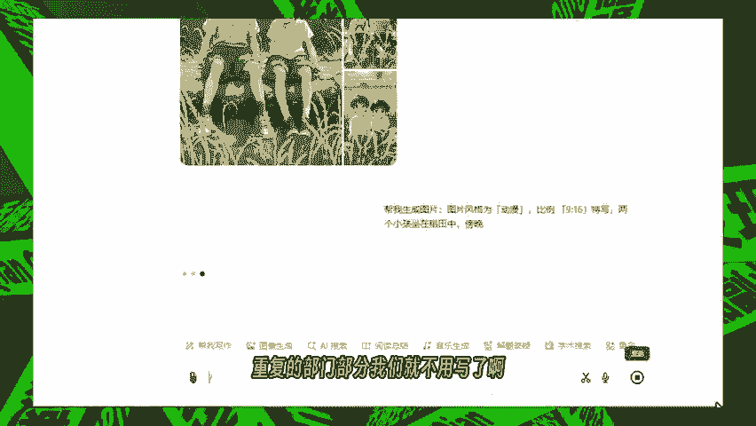

🎼啊，然后我们点这个添加一个傍晚的场景试一下。🎼这样生成的一个画面就更有这个意境了。那我们点击这个下载原图，它就会下载到我们的电脑当中去了。🎼那么返回到原来的页界面当中。好，我们再去继续做下一张图。

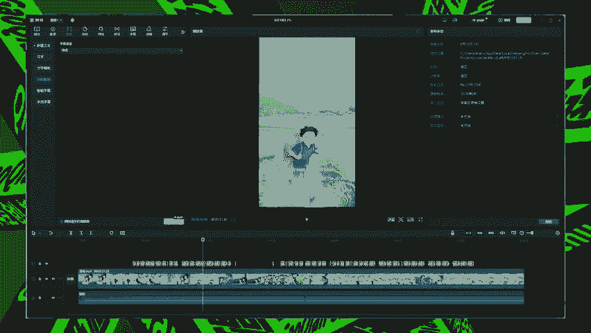

🎼啊，下一张图是一个奔跑的小男孩啊。🎼啊，那我们还是点击图像生成啊，动漫。🎼啊，选择好比例风格。🎼啊，然后我们开始手写啊这个场景。🎼然后主要的这个角色。

🎼你可以把它的这个穿着啊呃配饰啊全部都描述的更加的清楚一点。好。🎼那么呃接下去都是一些重复的过程，我们就加速一下。

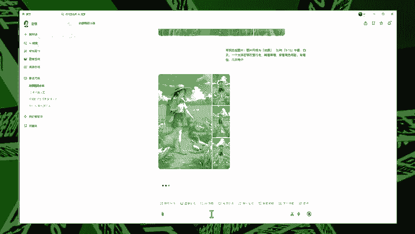

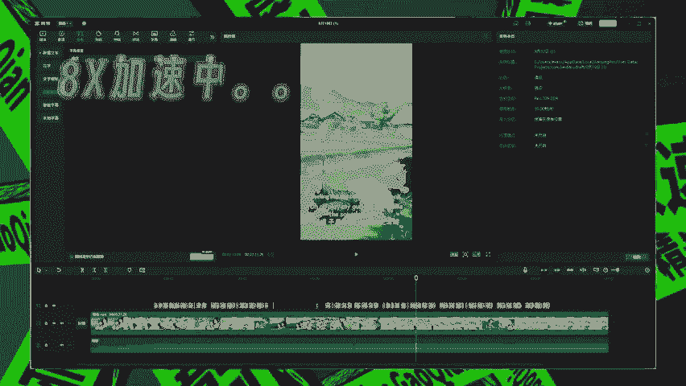

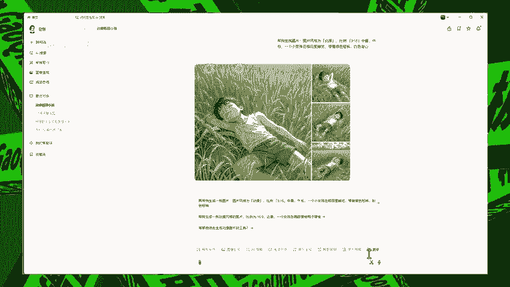

🎼现在我们图片都已经生成好了，我们把它拖到啊拖到这个剪映的这个媒体里面去。

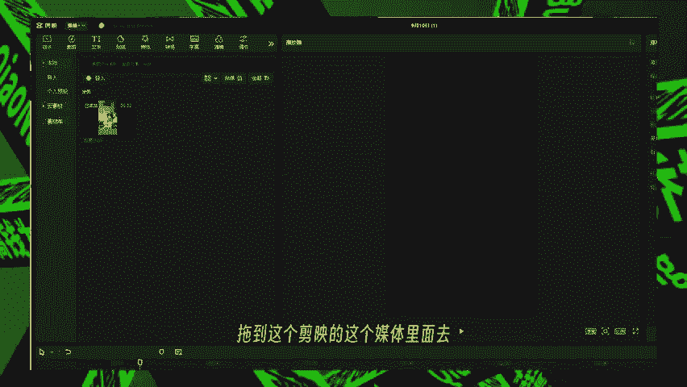

🎼，然后把所有的图选中，我们把它拖到时间轴里面。🎼啊，这个。🎼歌曲太长了，我们把它修剪一下。🎼然后大致我们一边听一下这个音乐，一边简单排下序啊，每张图的切换的过程可以稍微卡一下点。

啊尽量在古典的时候进行一个图片的转换，这样的话看起来会更加的自然一点。🎼那有些图片的画幅啊，我刚才忘记去填写了，那生成的比例可能不对，待会我们稍微调整一下这个大小就可以。🎼让这个画面覆盖覆盖起来。🎼啊。

然后我们刚才修剪了这个歌曲，这个歌词长度也是不对的，我们把它删掉，重新识别一遍。

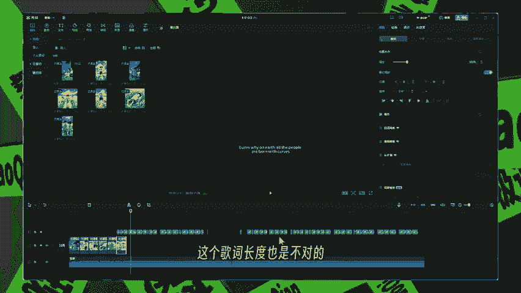

🎼还是点这个文本啊，识别歌词，然后开始识别。🎼这个需要老版本的小伙伴啊，记得评论区已关666啊，然后这边的话啊记得关注一下啊，然后我把这个老版本的剪映一起发给你。

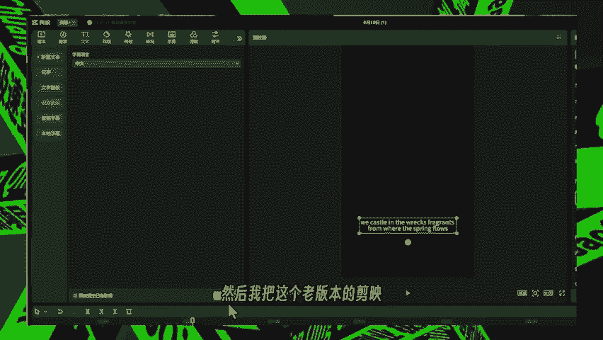

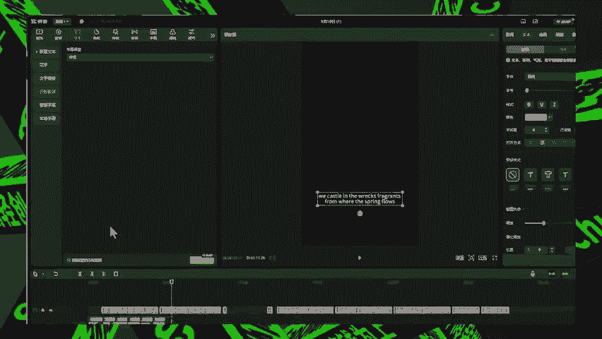

🎼好，那么新的这个歌词啊，它就跟这个序列啊就对上啊对上。🎼简单的检检查一遍。🎼好，然后我们稍微换一个字体啊，换一个得意黑啊，然后啊选一个这个字的这个底色。🎼把它调整一下这个位置。🎼这个字幕的这个位置啊。

🎼大家。🎼之后可以再去。🎼更细节的去调整一下，我这边只是演示一下啊，稍微调节一下样子就行。🎼大家知道怎么去调整。🎼每个人的审美都是不一样的嘛，对不对？🎼我。🎼好，我们再播放一下看歌。

🎼Ma they begin to think birds why and earth， all the people aboard with her。

🎼You can turn on TV to see in the boat。🎼Why are you keeping walking in and the whole。🎼然后把调整一下这个长度。

尽量让它能够是。🎼能够卡一下这个点跟这个歌词的。🎼这个歌曲的主点。🎼the great from weather spring make it not a。🎼Dream is to。🎼好。

🎼那我们就到这儿，我们的这个图生成的也不多啊，我们就到这儿把它截断啊，我们只是演示一下。🎼操作上来说的话，其实都是一样的啊，都是一些重复性的工作。🎼那然后这样子的话，其实一个简单的半成品已经完成了。

但是我们最好给这些图片加点动态，这样看起来的话呢不会那么的单调啊，我们把这个字体啊先调整调整一下。🎼然后怎么去调整它的一个动态呢？我们可以给这个位置和缩放啊进行一些关键帧的一个动画啊。

在这里可以打一些关键帧。🎼这样的话看起来。🎼就这个镜头推动的这样一个感觉。🎼我。🎼然后这一张的话，我们可以给它来一个上下移动的感觉。然后我们可以把这个关键针打在这个位置的上面。🎼我们先把它放大一点。

放大一点，这样的话才能移动。🎼啊，头下往上啊。🎼模拟一个这个镜头由下往上去。🎼去去摇动的一个效果。🎼啊，这里我们应该调整X呃调整Y轴啊，不是调整X轴。

🎼W in the world if the era little grievance and it standing there。

W in the world if they areial little grievance and admires standing they begin to。

🎼Big B white young earth。

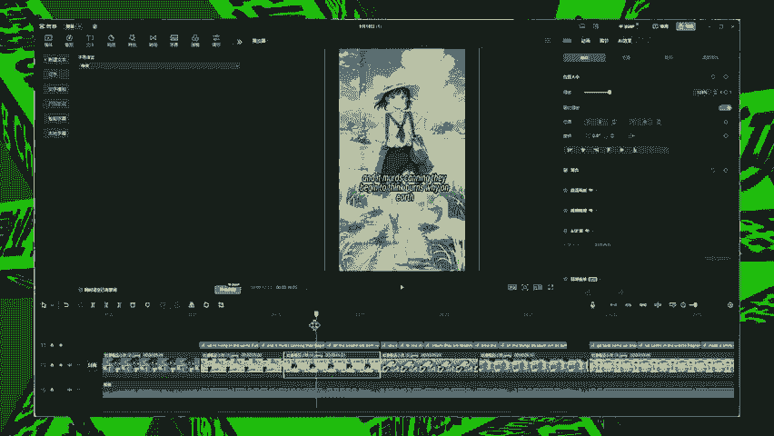

🎼Fs why and earth， lot of people are born winter her。🎼然后我们再给它添加一些转场和特效。🎼这里转场我们推荐使用叠画，叠画这一个类型的会更加自然一点。

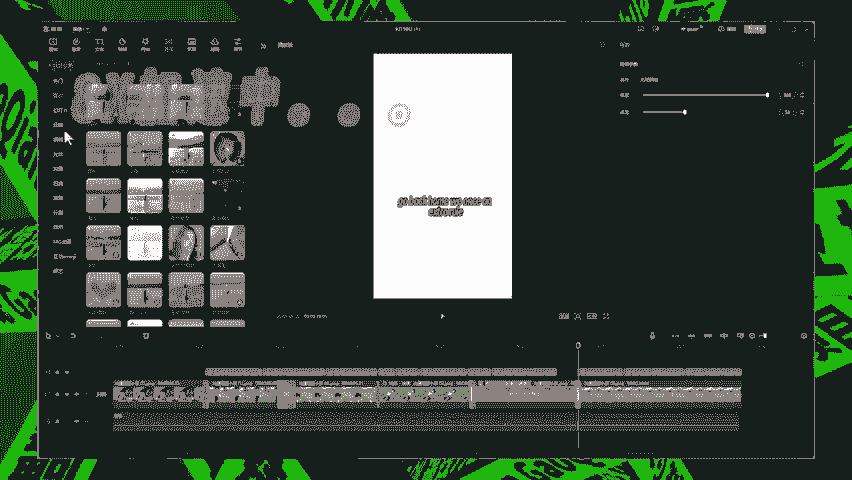

🎼好，然后我们把这个做好的成品导出一下。🎼好，我们之前啊我们之前是用的这个字幕导出啊，我们这个把这个字幕导出取消掉，我们只要导出视频就可以了。

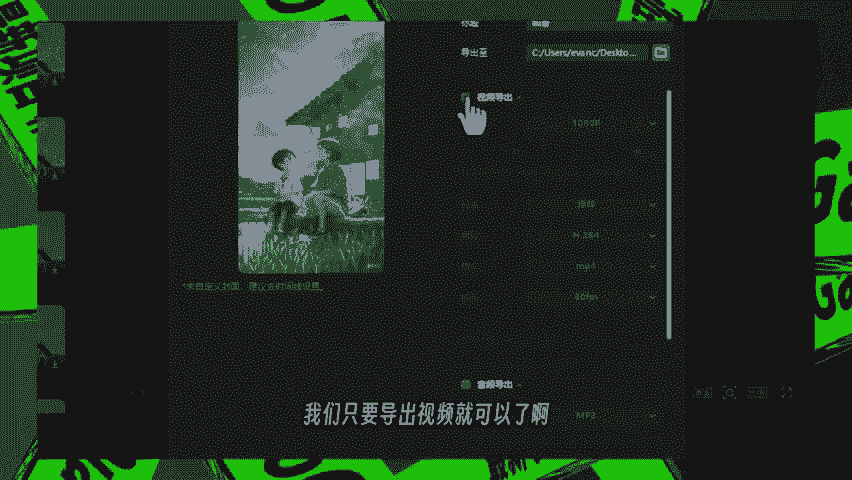

🎼啊，点击这个视频导出，把这个勾打上。🎼然后再点击导出。🎼这样就可以把视频导出来了。What it in the world if they aial little grances and as standing they begin to think burns why on earth all the people aboard with her。

🎼You can turn not TV to see in the slowly that you're keeping walking and the whole drop van your chaseful。

🎼The B stretcher will be turned to go。🎼In the way。🎼Take个さ。🎼Dream is still。🎼视频制作完成之后，如何引流到你的私域？

我已经准备了一份完整的小红书私域教学，想要的可以留言已关666。🎼可分享给。🎼如果你对这个赛道感兴趣，想要做大做强评论区留言求带，我们也提供一条龙的。🎼最后非常感谢大家能够看到这里，期待我们下次再见。

