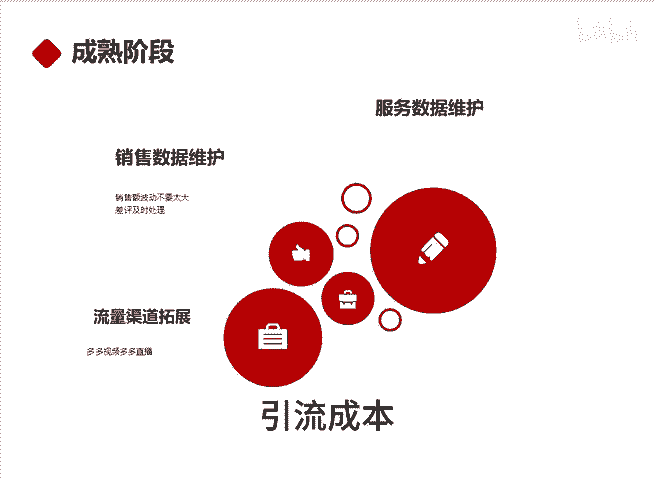

# 新品该如何打造 - P1 - 千优电商教育 - BV12LyAYvEF8

新品新店该如何打造啊？如果你是工厂店，或者说你有非常有优势的货源，或者说你是品牌店铺，那么这套流程非常适合你。因为你们都有优势。那不管是价格优势还是品牌优势，它总之都有优势的。

我们把店铺的运营分为三个阶段，第一阶段新店阶段，第二阶段成长阶段，第三阶段成熟阶段，在第一阶段我们的目标是激活店铺并找出主推款，那怎么找呢？很简单，上架5个链接，那这5个链接怎么上呢？

在榜单上找到你的同行和你同类的商品5个把他们的SKU直接照抄。然后呢，你的图片我建议自己制作像轮波图详情页，这些你就别抄了。然后呢，标题自己写SKU和同行一样，以便完成对标。因为我们的品有优势。好。

上架完这样的5个链接之后，那该怎么做就做新店的激活，那怎么激活呢？首先提高店铺到三层级。然后我们不是上了5个链接吗？我们每天找一个用户进店。😊，把5个链接直接下单，一拖多，每个链接大约300块。

三五1500左右的样子，坚持7天。这7天我们就做这一件事。等到7天做完之后，我们就开始报上活动开上车，至于活动报哪个，对于新品来讲，像21365效果不错，或者说9。9块的新品通道，这个也不错。

然后像后台的各种大促，比如说双十一大促，那报上它也没问题，然后就是开车每一个限额100，然后保本或者利润出价，如果直通车都烧不动，你需要再做50个DSI评分。

这里还有一个问题就是很多朋友问我要不要做销量和评价，这个其实没关系。如果做都做，如果不做这5个链接都不做。因为我们第一步是要测试链接看哪一个链接跑的又快又好。当我们测试出链接就要进入第二阶段。

如果我们店铺里面只有一个链接跑的好，那把这个链接重点的拉升，做销售额递增。如果呢这5个链接都跑的不错，那也很好。😊，我们可以打造小爆款群，不见得重点拉升哪一个，我们拉升店铺的整体销售额。

如果店铺里面有哪一个链接，重点表现不错，到后期我们还需要把这个链接裂变一条链接吗？裂变出5个让他SQ不一样，价格段不一样，这样呢可以获得更多的流量。其实呢到店铺的成熟阶段，我们就做三件事。

哪一个是就是服务数据的维护像DSR评分，店铺的星级，消费者服务体验分，这些评分如果下滑严重，对店铺流量都有影响。然后再就是销售数据的维护，就是销售额每天波动不要太大。比如说昨天我卖1万块。

今天2000块，这会影响到权重，那么我们要人为参与。再一个就是在成熟阶段，我们要考虑流量渠道的拓展。想做的视频，你每天坚持发送几个。如果有条件做直播，那就更靠谱了。

因为视频和直播这两个渠道相对的来说引流成本更便宜。我是讲师大牙，欢迎大家扫码添加我的微。😊。

信不方便扫码的朋友可以添加我的微信号，80221430。在这里给大家准备到了一套新手运营入门的大礼包，希望能够帮助大家。

