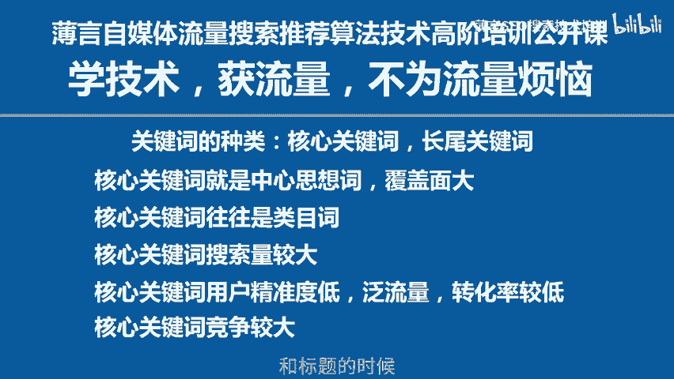

# 新媒体运营和新媒体运营培训课程是新媒体运营工作内容，也是自媒体平台算法推荐和算法技术的体现，因此自媒体学习和新媒体研究决定了自媒体运营的效果和新媒体运营的效率 - P1 - 薄言SEO搜索技术培训 - BV1Atp2eDEGK

新媒体运营中我们离不开关键词。抖音视频号这样的自媒体当中，关键词其实分为两大类，一类叫做核心关键词，一类叫做常尾关键词。这两种关键词在视频号和抖音搜索以及抖音推荐中的作用是不一样的。

今天我们首先来看看核心关键词是什么。所谓核心关键词就是能够准确概括你这个短视频中心思想的关键词啊，它说明你这个短视频到底是关于什么内容的。比如你这个短视频是讲手机的那手机这个词就是你的核心关键词。

核心关键词的特点就是覆盖面很广，手机这个词里面还包含了华为手机、苹果手机、小米手机等等很多不同品牌的手机，核心关键词呢也往往是类目词手机这个词实际上就是手机这个品类的代表词。

第三就是核心关键词的搜索量一般来讲都比较大。比如说手机这个词的搜索量就比在具体品牌型号的，比如华为P70某一款手机，这样的词的搜索量要更大。这是核心关键词的优点。同时呢核心关键词也有其不足的地方。

正是因为核心关键词的覆盖面广，必定导致了核心关键词的客户精准度不高。

属于泛流量，可以试想一下，一个搜索手机的人和一个搜索华为P70的人，他们的意愿哪一个更加精准，这是不言而喻的。因此，核心关键词的流量是比较泛的，客户并不精准。客户的转化率偏低。

此外就是核心关键词的搜索量比较大。那么它的竞争必然就很大。所以我们在进行短视频搜索排名优化的时候，就需要慎重的制定竞争策略。前期以长尾关键词进行布局，拓展搜索广度，提升短视频的搜索权重。

后期再去争取核心关键词的搜索排名。关于长尾词这些相关问题，我后面会有专门的视频为大家讲解核心关键词在我们填写短视频的描述和标题的时候，就应该进行布局了。这样才能为后期的短视频发布以后。

取得比较好的搜索排名打下基础。这是新媒体运营的基本功。本期视频到此结束。那么下一期再见。

