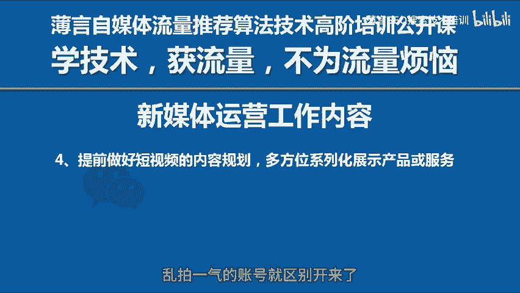

# 新媒体运营工作内容是自媒体平台算法推荐和算法技术的体现，因此自媒体学习和新媒体研究决定了自媒体运营的效果，抖音推荐和抖音搜索是短视频运营的核心视频号运营抖音运营 - P1 - 薄言SEO搜索技术培训 - BV1yA8iekEu7

在新媒体运营的日常工作当中，很多朋友对新媒体运营工作内容还不太清楚。今天想到这个话题就拍这个短视频，明天想到另一个话题就再拍一个短视频。这样漫无目的的堆积内容并不是有效的新媒体运营。

有效的新媒体运营工作内容，一般包括以下五个方面。第一，首先找出你自己最熟悉的或者专长的或者有优势的方面，可以是你擅长的手艺、才艺或者专项技能，或者自己有优势的产品或服务等等。

也就是要找到一个你能深根的项目，把它做深，而不是做宽。这就是你以后实现变现的媒介和载体。

这是新媒体运营工作内容的第一步，也是最核心的要素。第二，当你确定了某一个项目，作为你的变现载体，也就是所谓的行业赛道，你就该静下心来分析一下你的竞争对手了。一定要找出自己独有的优势。

比如独特的产品优势、性价比优势、技术优势等等。一定要建立起属于自己独特的，甚至是对手无法模仿的差异化优势所在，也就是要建立竞争壁垒。现在的竞争异常激烈，任何行业都挤满了人。所以你千万不要随大流。

别人怎么做，我就怎么说。这样的话，你只会被人海淹没，一定要做出独特的不一样的东西，也就是大家常说的IPIP可以是人，也可以是产品或者服务的特性，你才可能脱颖而出。第三，确定自己的受众。

就像很多人发短视频会认为他发的这个短视频的流量应该会无限的增长一样，啊，我的这个项目的客户是所有人，这是一个很大的认知误区。短视频的流量是有上限的。且不说抖音的注册用户是有限的。在短视频被算法推荐的。

后他也是根据更小集群的用户集进行推荐的。因此，任何人的短视频播放量流量都不可能无限制增长。更不要说算法的本质就是限制短视频被更多人播放观看的用户受众也是同样的道理。

任何产品或服务都只能满足一类甚至是一小部分人群的需求。因此，大家不要不切实际的希望所有人都是你的客户，否则你只能徒增烦恼，就像博研的自媒体推荐算法技术培训课程一样。

针对的用户就是那些真正的想要学习自媒体算法技术，通过计算机底层技术解决流量推荐问题的人，绝大部分都是30到40岁的男性，我对受众的用户认知是非常清楚的，让所有人都能对自媒体推荐算法技术感兴趣。

那是绝不可能的。第四，做好规划是新媒体运营工作内容的骨架。你必须要规划好视频内容，最好能形成一个系列循序渐进。比如你是做零食小食频的，那么你就可以规划出来几个系列场景系列、材是系列、生产系列。

场景系列就是这个零食可以是在旅游的时候吃的，也是可以在野餐的时候吃的啊，可以在学习的时候饿了再吃等等。材质系列呢你就可以到原材料的产地去拍摄，或者可以拍某一个材料的养成过程等等。

这样一个系列一个系列的拍出来多方位的展示产品，这就和那些没有规划乱拍仪器的账号就区别开来了。

第五，视频发布获取流量，这是新媒体运营工作内容当中最受大家关注的一个环节，也是难点。我在前面的视频公开课里都有讲过，短视频获取流量唯一的途径就是算法推荐。也就是要让你的视频夹角与用户向量夹角尽量的小。

让夹角的余轩值要尽量大，你的视频才能够获得算法推荐，否则你前面的工作做的再好，这一步你做不好，就前功尽弃。有兴趣的朋友可以到我账号主页去看看以前的视频，关于视频的夹角余宣值推荐算法，我都有很详细的讲解。

这上面5点就是最要紧的新媒体运营工作内容。当然还有诸如数据分析，流量承接转化等等工作，时间有限，就无法再讲解了。但是这5点新媒体运营工作内容，你只要把握住了，你的账号就建立起了很好的基础。

这就为以后的新媒体运营铺好了路。希望今天关于新媒体运营工作内容的讲解，对大家。有所帮助，咱们下一期再见。

