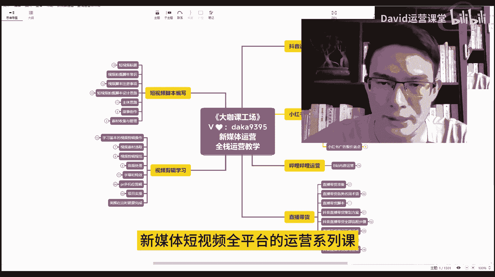
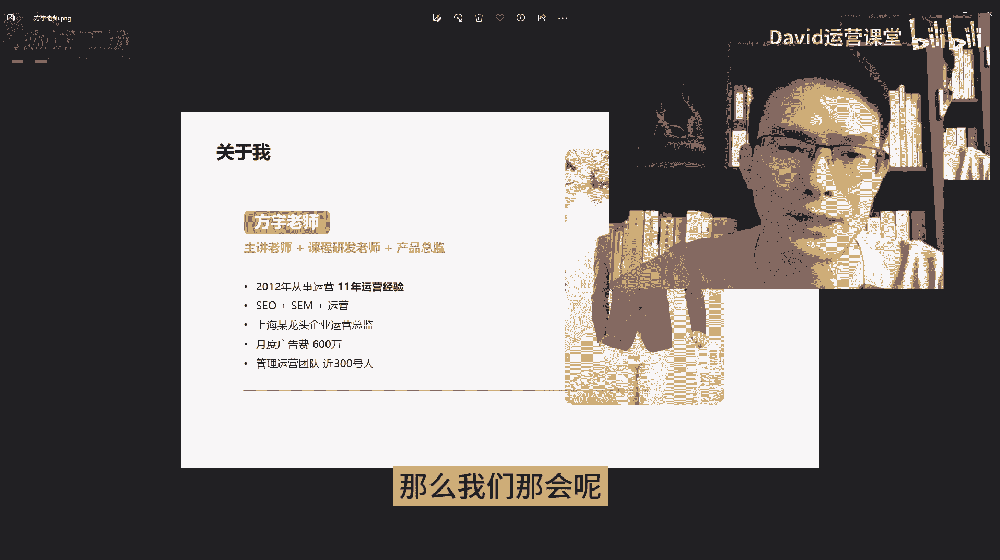

# 新媒体运营干货教程！短视频／小红书运营新手起号必学课／全平台完整运营思路和运营技巧！ - P1 - 方老师运营课堂 - BV1ym421L7E8

哈喽大家好，欢迎同学们来到我们这一行，新媒体短视频全平台的运营系列课。

那么我是方瑜老师啊，我本身呢是12年就开始从事，互联网的一个运营工作，那个时候呢，我们运营的对象主要围绕百度的搜索，引擎的自然优化，还有这个SM的一些竞价广告，呃，当然那会儿呢玩的挺多的。

还有一个淘宝电商的运营，那么接触过的，或者说有从那个时代走过来的人都知道，淘宝那会儿确实给非常非常多的人，他带来了很大的一个机会，也有很多人，确实他依靠的淘宝电商这么一个渠道啊，实现了一个财务自由。

真的非常非常多，也有很多的人才，那么我们那会儿呢大家最热衷的就是一件事啊。

就是做网站，也就是别人口中的这个人站长啊，有自己的博客，然后呢给这个博客呢做点内容，然后做一个这个百度的自然的SU的搜索排名，那么这个呢是非常有意思的一个事情啊，也是大家所有的家长都非常呃。

这是非常热衷的一件事，那么我们那个时候主要操盘的一个对象，就是百度搜索一个关键词自然排名，还有SEM的这个大搜排名啊，也就是竞价，那个时候呢，我在上海一家谱系民营医疗的这个公司上班。

带着200多人的一个运营团队，这个团队里面有100多个人，有100多个人是专门负责SEM的，一个金像头牛的，然后呢有七八十个是呃这个网站自然排名的啊，就是我们一个月当时一个月接近啊。

就是1000万的这个运营的总费用啊，这里边呢这是有基本上全部都fig的百度啊，fire的这个搜索引擎，那么那会儿呢，其实这是连微信都还没有多少人知道啊，像公众号短视频抖音这些其实都没有，大家呢。

那我玩的就是速度一集是吧，所有的企业啊，这个互联网的流量，他95%以上都来自搜索，那么所有企业那会儿呢，他们在互联网上的广告费用开支，80%以上也都扔给了搜索引擎，那么现在的互联网呢它就不一样了。

流量呢确实他不是一家一家垄断，然后大家的运营方向的渠道，还有重心也都各有千秋啊，也都各有千秋，那么这就造成了出现了非常非常多，就是不同领域的网红，草根网红，你像抖音的短视频对吧。

然后呢像这个哔哩哔哩小红书，其实每一个平台，每一个区呢它都有不一样的这种内容啊，那然后内容这些内容的形式，也就造成了不同的网红，还有呢很多就是各种形式的那种，源源不断的新媒体的就业岗位。

那么我们的这一套系列课呢，就是来教大家怎么玩这个新媒体运营好，首先我们来看一下，就是我们这一套视频会教给大家哪些内容，那么像我在这个地方呢，已经练了一个这个思维导图。

那这个思维导图文件真的是非常非常超级大，里边呢呃有接近1万多字的这个节点啊，有时候我的电脑的配置已经算可以了，大概都有点卡，好我们来看一下我们的这套内容呢，会教给大家现在主流的像抖音的短视频的运营。

短视频的直播，短视频养号，还有抖音里面涉及到的一些嗯橱窗啊，直播啊，呃小店啊等等等等，那么这些运营技巧和运营方法都会教给大家，通过我们这样的一个视频的传播的形式，来告诉大家这一块内容怎么做，怎么去运营。

那么像小红书就不用说了，小红书从今年的布局这个电商领域之后呢，确实他有了一个全新的变化，你不得不承认啊，小红书现在它确实你说他位居第二呢，也不是不可以，对不对，因为他确实流量和商业价值现在挺大的。

所以说我们大家都在干嘛，想方设法的去做小红书的账号对吧，我们就聚集粉丝，小红书上面的这个变现能力也确实非常恐怖啊，你像抖音上面，可能你有个几万粉丝，你想变现还有点困难，但是在小红书上，你有个几百的粉丝。

你想去做变现，这个挺容易的啊，当然这个变现呢肯定跟金额挂钩，对不对，但是你想去做个兼职，先去给自己发到中国来搞个边线还是可以的，然后你更别说你去把这个账号做起来了之后，你去做这个带货，做直播带货。

你去开店等等等等很多种玩法，确实小红书上它有这样的一个商业价值，也是很多人愿意往上涌的，当然也有人会聊到小红书，现在它的这个笔记种草，确实有越来越多的人他不太相信了，以前大家都觉得小红书上的比例种草。

确实很值得信任，大家推荐的都是好物，那么现在呢可能很多这个笔记你看着还好，但实际上呢它就是包装过的一个营销广告啊，你买回去之后就跟呃讲的可能有点不太一样了，对吧，这个买家秀和卖家秀的区别。

但确实他的商业价值摆在这里，越来越多的人他也在往小红书里面有好吧，而且呢针对于在抖音上面这种短视频形式，你难以去产生变小或者难以收获的这类人群，那么小红书这种图文类型的可能会比较适合你。

可能会比较适合你，那么还有啊，就是我们回家去策划的这么一套关于B站，就是哔哩哔哩的这么一套运营的体系，其实嗯我相信每一个平台它都有自己的价值，而且每一个平台的用户体系，他们的用户思维，还有这个平台。

最终能给我们带来的价值都是不一样的，你像小红书有它独特的体系，抖音也有他是吧，B站哔哩哔哩，我们这么大一个平台上面有这么多的up主呃，你靠自然的去这个变现对吧，创作激励计划这些东西的可能呃。

B站给的这个不是说特别的丰厚啊，他有，但是说哔哩哔哩不是说除了这些方法之外，他没有其他的变现思路，他也有，然后你想在B站上面把一个账号做起来，你想把这些数据做起来，一样有他的思维和他的思路和技巧。

运营技巧，那么这也是我们独家开放的，这么一套系列的内容，去教大家怎么去运营B站，怎么去把这个我们的账号也做好，OK那么这是关于B代码，还有关于直播带货对吧，这个就不用说了，对不对。

可能说有些人你不感兴趣，但是我相信只要你懂这个商业机会，只要你有这样的一个商业头脑，你都知道直播带货这个东西啊，你确实是可以学，你也需要去学，如果说将来你自己有产品，那就更重要了，你做好直播带货呃。

嗯怎么说呢，就是说如果你不用去找主播啊，你不用去找主播带货的话，你自己会直播带货，那我告诉你是稳赚的，你是稳赚的，但是如果说你需要考虑去做大主大主播的带货，或者说需要去找别人做合作的时候。

那么这个时候你可能就要谨慎要谨慎，懂的人他自然都懂，就是你踩过这个坑的，就是现在抖音上面那个这个直播带货，到底是什么样的一个体系，它到底被玩成了什么样，我相信明白这个东西的人，你都知道他是怎么回事。

不明白的人可能还觉得，这里面还有很多东西可以玩啊，那么嗯这里呢就教给大家的一些方法，我希望就是说我们自己能够把这个事情去做好，OK然后短视频的脚本编写这个东西呢，是单独拿出来讲，因为怎么说呢。

我们想现在啊现在的互联网时代啊，他就是以视频形式来传达我们各种各样的一些，生活技巧知识啊，还有我们的乐趣，对不对，那么你要想做好短视频，我们知道很多他能火起来的短视频，背后都有它的这个设计组合技。

有进口的这个策划对吧，有文案的这种编辑，你像这种大V啊，小杨哥啊等等啊，那些做的好的对吧，这种大V你随便拿出他的一个视频，你掏出来你都能从里面学到很多很多东西，那么我相信嗯做短视频的人。

你想把这一块做好，那么短视频脚本怎么去设计好，怎么去编写好，怎么去把镜头和故事的思路给他设计好，这是你一定要学的好吧，这是一个基本，也就是新时代互联网人的一个基本的技法，OK那么视频剪辑也是一样的。

你如果说你现在不会剪视频，那么说实话真的很low，好吧很low嗯，剪映pr我就不说了，因为现在剪映确实足够强大，那pr呢可能涉及到一些特别复杂的，企业内部的一些创作，用pr会比较方便。

但是如果你是给自己放个视频，那剪映的各种方式，别人拍出来的这种各种带特效，各种抖动的屏幕的啊，把人物聚焦聚焦在最中间的这种方式方法，还有一些新的这种书的功能，你都得要去了解，都得要学习。

OK那这就是我们教的所有的内容，那么讲到这里，如果说屏幕前的各位同学，你们觉得我们的这套内容的设计和规划，真的让你感觉到有价，只有期待，那么请给我的这个视频打一个三连投个币。

甚至说你想给我充个电就可以哈哈我也充个电，充个电就算了，充个电就算了，这是我们的所有视频的内容，OK那么其实我还想跟大家讲一个重要的点，就是我们这样一套内容，不是说我们把以前的重量拿出来做分享。

这是我非常重要非常注重的一点，就是这里边出来的所有的内容，我们这个课程里面出来的所有的教学视频，是以现在当下这个节点来给大家做的更新，来做的设计，也就是说它是2023年。

至少是9月中旬以后的最新的那和视频，那么这个价格我希望大家能够明白好吧，能够明白，那么我们这套课程啊，对比其他的一个课程，我们的重心啊需要跟大家讲，就是就目前大家在市面上能够看到的。

很多新媒体运营的这种教程确实很多，我就告诉大家一句话就太过分了，太过分了，这些内容要么内容不全，要么就是内容的一个年代久远，内容严重过时啊，他讲的内容严重过时，那么内容不全。

它会导致你在学习到半途的时候卡壳，那卡壳就会严重降低你的学习积极性，会导致你学到半途而废，那年代久远的更是过分啊，现在B站的很多新媒体运营的这种套期视频，都是17年一八年一九年的老视频了。

很多视频里面有超过80%的内容，现在都已经用不了了，甚至是错误的，但是你看这些视频啊，他依然还有几10万10几万这样的一个播放量，那有多少跟着这些视频学习的同学啊，你们其实只是想简单的学点运营技巧对吧。

不管是给自己做一个账号也好，还是说转行新媒体这个岗位，还是说嗯马上毕业了，想找个新媒体这个岗位上上班啊，看重它的一个前提，但是这些内容极其老旧的这些所谓的教学视频，他却就是正在残害。

很多就是满怀信心想转行新媒体运营的人群，而且对那些在口罩解封之后，在当下市场经济的一个困难的情况下面，已经快要喘不过气的人，造成了时间和精力上的一个双重的伤害，为什么这么说呢。

因为从认知这样的一个角度出发啊，因为认知的问题，很多人他是根本无法了解自己现在学的啊，现在跟着视频学的这些东西，他已经用不了，他们自己是不知道你学完之后啊，你去面试，人家问你抖音怎么开直播。

你回答说诶开直播需要抖音，官方邀请，开权限，自己搞不了啊，然后人家问你小红书怎么做电商有关，他说诶小红书的电商就是做种草引流的，做种草推广的，小红书没有自己的电商系统啊，我真是醉了。

这种就是这都是几年前的东西了，你推出这些东西，真的不仅仅是误人子弟这么简单，你这是在要人命啊，啊我们啊我理解啊，就是我们大家要学习的这个心态是非常不错的，因为我们所有人确实包括我啊。

大家都在被这个时代逼得不得不进步是吧，我们B站上也有非常非常多良心，非常不错的教学视频，这是我们B站的优良传统，大家来这里可以学到非常不错的内容是啊，但是我们必须要跟着是吧，跟着内容比较新的视频学。

我们千万不能被那些故意内容不放权啊，年代久远，甚至内容严重过时啊，还被反复传到B站来，反复鞭尸的这种垃圾视频所引，OK那么我想请大家持续关注我们这个账号，那么如果讲到这里，你喜欢我们内容的。

也请给我们一个三连支持一下好吧，那么我们会在接下来的时间里，持续更新，你从未见过的各个新媒体平台的一些运营玩法，像抖音短视频，小红书，起号多地多平台的一个电商矩阵的运营等等。

