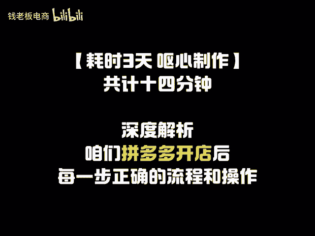
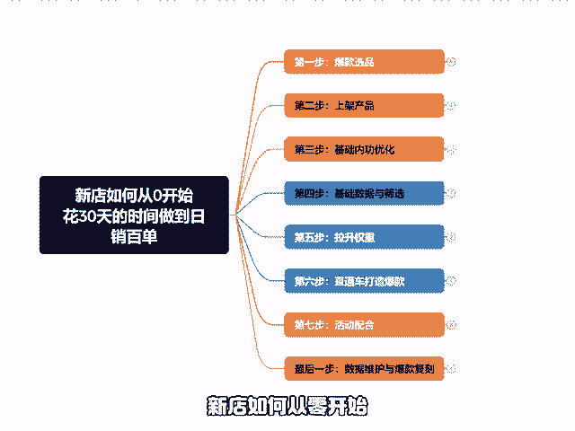
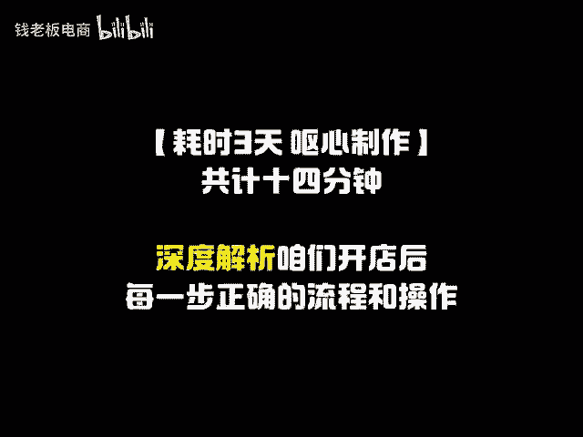
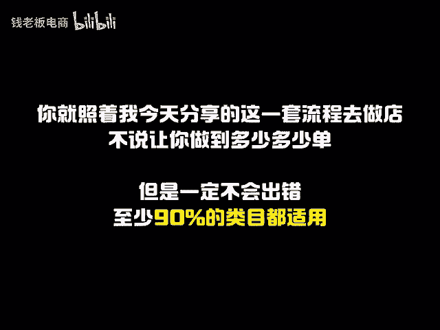
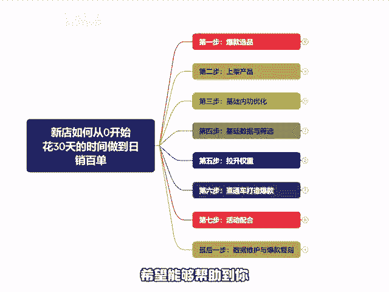

# 新店如何从0开始，花30天的时间就做到日销百单【拼多多新手开店运营干货知识分享】全流程解析！ - P1 - 钱老板电商 - BV12PxFehEu2

🎼拼多多想要一个月的时间就做起来一个新店，光靠运气是没有用的。你得知道如何去合理的运营店铺。在拼多多开店的新手商家有千千万，而真正能够做起来的却少之又少。这不是给大家泼冷水，事实就是这样。

不要太过于理想化，如果你不会运营店铺，想靠运气或者你的一腔热血去做店。那你注定只会成为那大部分的亏钱退店的商家。那今天我就来分享一下新店如何从零开始，花30天的时间就做到日销百单。

本期视频呢耗时3天制作，共计十几分钟，深度解析了咱们开店后每一步正确的流程和操作。你就记住，咱们做拼多多店铺是有一套万能模板的。如果你是新手，就少看一点那些花里胡哨的黑科技玩法。

你就照着我今天分享的这一套流程去做店。不说让你做到多少多少单，但是一定不会出错，至少90%的类目都实用。那为了方便各位更好的理解。我会把每一个步骤都拆开来讲，包括前期的选品思路，产品上家建议。😊。

🎼基础优化、权重提升、推广玩法技巧等等的这几大板块，原创不易，也希望能够帮助到你。我们首先讲开店的第一步爆款选品，做网店的朋友都知道，一个爆款的诞生，七分靠选品，三分靠运营。

可见有一个好的品是多么的重要。像我们平时选品大的方向可以参考以下这几点，绝对出不了错。一、利润要高。2、用户群体的。3、购买需求旺盛。4、如果你不是实力厂家，就最好还是找相对冷文些的类目。那通过这几点。

我们可以确定出一个大的类目方向，然后我们再在大类目里面去细选。其实这个拼多多的官方平台就给我们提供了很方便的工具。我们在拼多多的商家后台，找到店铺营销里面有个爆款竞价，我们点击进去。

然后在商品名称搜索框，输入你想要做的产品品类，展现出来的就都是卖的比较好的。但是不是所有展示的产品都是我们的目标，我们需要多点几个进去，找那些评价相对较少，日期较新的去对标。🎼很简单的道理。

如果评价是10万加的，那基本99%都是老店铺，我们是干不过的，只有这些评价不多的，且评价日期也都是比较近期的。这种情况它都能在热销吧，才说明我们现在去做的也是有很大的机会。

可以用同样的方法去多测几个这样一个爆款的品就选出来了，也不需要你有任何的花费，不用去买软件啥的，点开起来了之后呢，我们第二步就开始上架产品了。上架产品想要获得更多的流量权重。

我们可以从商品列表里面的发布机会，商品去上传。只要打上机会。商品标，上架就可以获得流量扶持。那上架产品的。🎼我们不要上新的太过于频繁，有很多的朋友都会进入到一个误区，认为上架会获得权重。

那就不停的去上架，结果发现自己的店铺数据反而越来越差了。慢慢的最后只能关店收场，这其实也是平台的机制，你一直不停的上架产品，但是每个链接都没有去破零，数量太多了，平台就会认为你这个店有问题，不给你推流。

所以啊我们现在最好是做单爆款，等你有一个评起来之后，我们再去起心的，还有一定要注意的，就是做垂直的店铺，就是说你卖女装就只卖女装，不要去上童装男装袜子这些，因为你产品的种类多了，人群也就乱了。

一向不够精准，我们的转化就会上不去。当然，如果你做的品牌店铺的话，可以不用管这些，你品牌的所有产品都可以上。因为品牌会具有品牌效益。这点上跟个人店比还是会有点区别的。然后我们接着第三步。

需要去把内功基础做好。首先是定价，我们前期的定价一定要给后期的活动操作预留足够。🎼空间初始的定价可以远高于售价，我们后期只需要用限时限量和关注券，把价格打下来就可以了。

切记千万不要一上来就觉得一定要定个很低的价才行。比如说在定价的时候，下面的一些隐形的费用，你也得计算进去的。不然出单也是亏钱一、先用后付1%技术服务费不可关闭。2、店铺满减不可关闭。

3、退货包运费根据退款率调整。4、智能营销莫名其妙多了优惠，大概率就是这个工具。5、活动折扣的这一堆费用加到你的成本里面，轻则利润跳水，重则直接大出去，并且定价过低的话，等到你中期需要进行操作的时候。

比如说增减优惠券，需要用限时限量购，或者是开车等等操作的时候，你就会异常难受。并且如果你定价过低的话，你的毛利率没有一个操作空间，开车就很难实现盈利，那我们要如何的去合理定价。

才能给我们的产品带来一个不错的操作空间呢。一个。🎼比较万能的公式，就是你销售价格加优惠券除以0。7。就比如你要卖10块钱，优惠券定5块钱，那就是10加5除以0。7约等于21。

那我们定价就21或者22也可以，或者你实在是懒得算，那就直接成本的两倍去定价，就比如我20块的成本，准备卖25，我先不管其他的优惠券，定价就直接20乘以2等于40，直接定价40。

再通过其他的优惠工具把价格打到25就行了。然后就是标题了。标题与你曝光量和点击率有关系。其中标题前12个字是最为重要，所以一定要把你的店铺最大的卖点放在标题前面，一般来说，标题的组合方式有以下几种。

第一种营销词加类目词加属性词加核心关键词。第二种下拉框词加核心词加长尾词加冷门词。第三种品牌词加核心词加类目词加属性词，但是也需要注意以下几点。一、60个字符写买2。🎼关键词中间不留空格。

3、不要违禁词，也不要非自身品牌词。4、目标核心词往前放。5、不要重复词组，确保关键词的唯一性。接着是主图详情页，直接决定了我们的点击和转化率。如果你是新手，完全没有经验。

那我建议就直接学习同行卖的好的。这样的图片不算最好的。但是它总不会太差，我们完全可以先模仿后超越，详情页的设计是有帮助用户做出下单的决定，最终获得订单，所以一定要突出细节卖点，还有要设计的涨一点。

这是为了防止用户在看你详情页到最后的时候进入到相似产品推荐页，防止跑单的发生。还有SKU的布局也是很重要。一个方向制作好产品的定位。咱们一般分为引流款，利润款顾名思义，引流款是拿来引流。

带动更多的访客进店的。那引流款的利润一般就不会太高。利润款呢就是拿来赚钱的。还有可以通过SKU来卡限时限量。做外低内高的价格，低价引流玩法。🎼帮助你的店铺带来更大的流量。

内功还有最后一点就是合理的设置好优惠券。我们一般主要使用的有以下5个优惠券。第一个关注券关注券要比立减券的优惠大。定为很多的类目，这两个券都是不能同时使用的，只有关注券的额度要大一些。

买家才会首选关注券，而关注店铺会很大程度上提高我们的复购率。第二个，立减券，我们可以通过立减券的收缩来放到我们的利润。同时提高我们的售价。第三个，满减满返，不过不是很适合低客单价的产品。第四个。

跨店满返，这个流量是最大，第五个，客服优惠券可以很大程度的提升你的询单转化率，也会提高你的店铺权重，优惠券的设置是必然的，不管你是怎么去操作你的店铺都会需要折扣或者是优惠券来促进转化。这些都做好了之后。

我们接着第四步做基础数据与筛选。我们前面讲到选对品可以让你做店事半功倍。这个后面还有一半，那就是平台要认。🎼和你的这个链接，因为我们不能保证你上的这一个产品，这一个链接，最后打造出来的效果就一定会爆。

所以为了更好的低成本出效果，我们就需要先来做一个筛选。我们可以一次性多上几个链接，上8到10个甚至十几个都完全O然后把这些链接全部丢到推广里面去进行一个测试，跑个几天观察哪个链接在车里能跑出曝光来。

找到抢钱最快的链接去作为你的主推款，前面的内功方面，我是没有讲销量和评价的，这个步骤就是要节省大家的初期成本，等我们找到了主推款，然后再去进行针对性的操作，这样就可以最大限度的节省成本。

提升大家做店的成功率。如果说你本身资金少，你可以选择上新后放几天自然测款，在商品数据里干7天的数据，主要看支付转化率和商品收藏用户，我们要知道一点，平台为什么会给我们曝光。

只有平台认可了我们这个链接的定价和内容才会给曝光。那反之就是没有曝光的。有些人为什么投入后血本无归。🎼就是一上来闭着眼睛去推广牡单投资框框往里砸，到后面发现开车开不动。

究其原因就是平台根本就不认可这个链接，所以即便出价拉到顶也不给你流量。但我们找到能跑出曝光或是可以直接成交的链接之后，把它作为我们的主推款，然后再去做基础销量和基础评价。接下来我们第五步。

我们需要进一步的拉升权重，这里主要有两个方向需要去操作。第一个方向就是DSR，也就是店铺评价分，这里我们需要90天内做出50个有效评价。DSR分才会显示出来。然后根据数据去把分拉升到4。7以上。

第二个方向就是把店铺层级破一破。因为店铺层级是会限制你的流量上线。我们直接拍大单，把层级搞到3到4层级。那做完这步之后，我们的链接就基本上有爆款的雏形了。这里一定要记住。

没有DSR光有店铺层级也是没有价值的。第六步就可以直接用直通车来打造爆款。因为直通车是最快捷的一种获客玩法，简单粗暴。你只。🎼需要付费平台就会给你流量。但是你要看清楚，你通过付费得到的是访客。

而不是花钱直接买单。所以说我们的转化一定更要做好。现在我们的直通车都升级成了商品推广，那就没有那些花里胡哨的玩法要去做。我们就直接开商品推广。然后刚开始前几天我们可以用保本投产去跑。

接下来就根据花费的时速，一点点的网上调整到你的盈利投产。这个时候只要是你能每天都稳定盈利了。那你的店铺权重就是比较高的了。这里我再说一个点，商品推广它又分为成交出价和投产比出价，成交出价。

它所对标的是你的单量，就是他不会管你最终成交的金额，它是固定的一个花费值，只要客户能成交就行。它的展现特点就是排名优先，搜索优先，什么意思呢？就是你的出价越高，你的排名就更靠前。

并且成交出价是以搜索流量为主，适合用户有精准需求的产品，流量相对偏少，但是精准，也更适合高客单高利润的产品，SKU价格阶梯相差不大的产品以及定制类的产品。🎼还有就是更适合新品用来拉新。而投产比出价。

它对标的是你的销售额。它的扣费原理是销售额除以投产品。如果说你是多阶梯制的SKU，比如10块、15块、30块。这样那建议你选择投产品出价，这样他每一笔的花费也会随着你最终成交的销售额自然的增长或者减少。

也更推荐具备推荐流量的属性的产品去选择。也就是那种没有明确需求，但是可能用户逛着逛着就下单了的产品，它是以人群为导向推荐展现的。流量相对偏多，但是缺点是流量不够精准，还有就是低利润。

低客单价的产品也更适合去走投产比出价，可以直接对号入座，根据自己产品的特点去选择合适的出价方式推广就可以。接着就是我们的第七步，可以直接去配合上活动。我们上面的步骤都做好以后，如果还想继续去放大。

就一定会要报活动，因为你直接去加直通车付费的话，会把店铺做成一个强付费店铺，最后反而会出不来自然流量，在付费推广不变的情况下，有大促报大促。🎼每大促就报秒杀或者9。9块上活动。

我们的核心就是不要做大幅度的货损。大幅度货损上活动就算能出很多单，因为价格跨度比较大，下来之后的转化很差就接不住流量了。所以尽量靠近成本价上活动就行。活动流量是很大的，只有当回价跨度不大的时候。

去跑量跑完一波下来才能尽可能多的去接住活动流量。并且我们前期一定要做活动预热，这样不但可以提高活动通过率，还可以提高活动建议价，就比如日常售卖价40块，活动当前建议价是5块。那我们千万别急着报。

先把价格压到7。5块，你可以用大促优惠券限时限量，然后开直通车多计划，因为每个计划包含不同的竞品，与其一个日限额300，我还不如三个日限额100不开白不开。三个计划成交出价分三档设置。第一档为最低出价。

第二档为最低出价的1。2倍。第三档为最低出价的1。4倍，都走第一阶段观察降价后，直通车转化是不是比之前高收藏有没有之前多。🎼如果有的话，那这个活动可以报，让大家设置7。

5块是为了测试在活动结束后进行价格承接的时候，转化率会不会垮掉。因为我们总不可能活动结束后，立马恢复原价卖吧。那原价谁买，我们报活动的这样一个操作，就是要把整体的坑产销量权重全部拉上去。下来时。

我们才能够稳住每天有几百单的销量，同时我们也可以去配合一些黑科技玩法来操作。效果会更加的好，比如说原价上活动低价引流，阴阳SKU等等。最后一步就是维护好数据和不断的复刻爆款。

千万不要因为起来了一个链接而得意忘形。数据的维护也是很重要的一环。每天我们都要不断的去检测好我们的后台数据，比如说店铺或者商品的DSR领航员评分。还有产品的访客点击转化评价里面是否多了差评。

售后的物流情况，这些都需要我们时不时的去检查。因为当这些数据下降的时候，会直接影响到链接，所以千万不能让它下滑，一旦发现下滑就要赶紧优化调整。🎼只要这里能够稳得住，流量和订单就能够一直稳得住。

再就是接着可以着手起第二第三第四个链接或者店铺了。因为单爆款的风险过大，如果你的这个链接崩了，那就感觉像是天塌了似的。但是如果你有五六条爆款链接，那就不用慌了。

本期视频完整的讲解了咱们拼多多开店后每一步正确的流程和操作，从开店到起店再到后期的维护，如果你是一个新手，刚做拼多多不久，那你直接照搬着上面的内容去做去套公式就行了。可以说90%的类目产品都是用。

希望能够帮助到你，咱们下期再见。😊。

