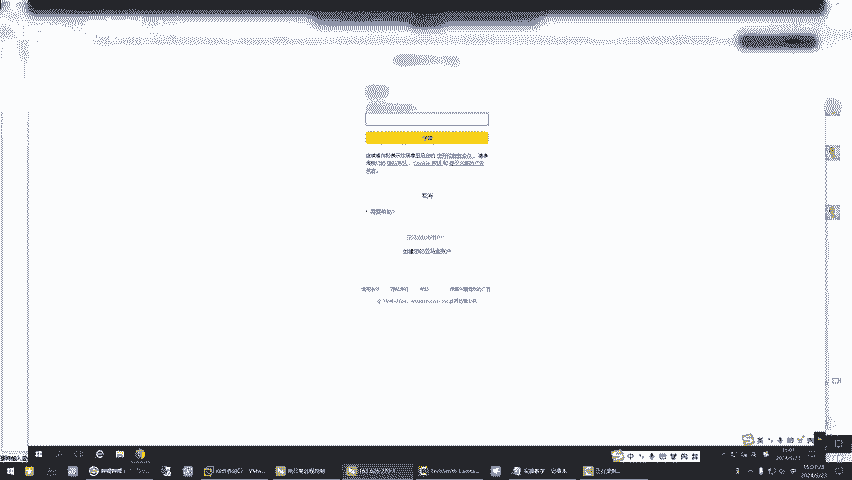
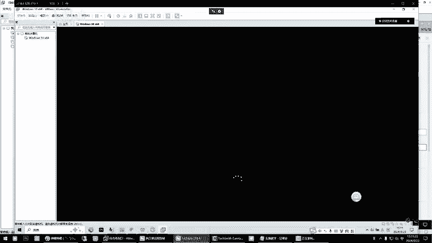
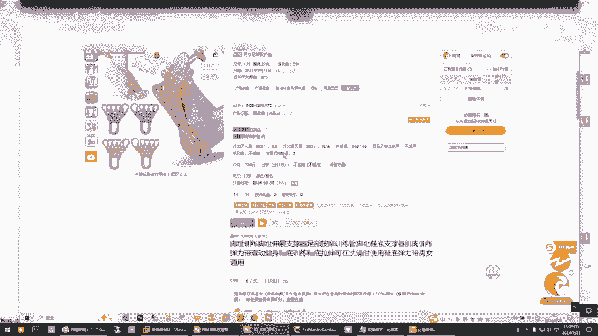
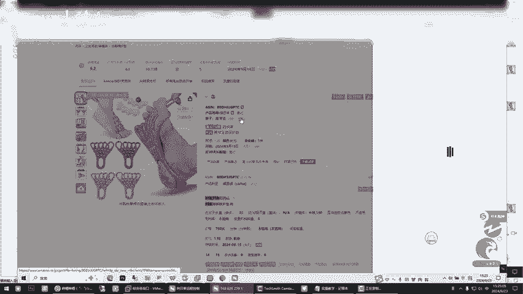
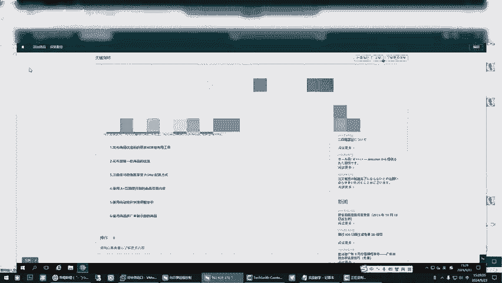
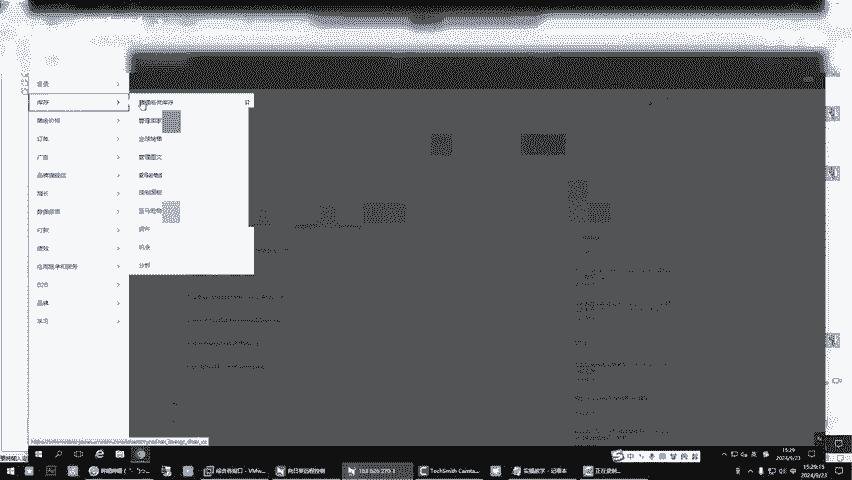
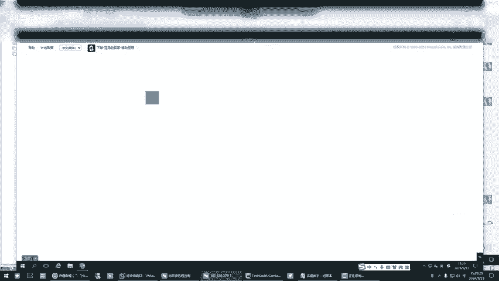
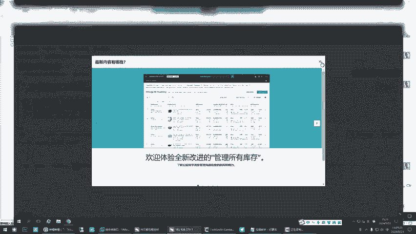
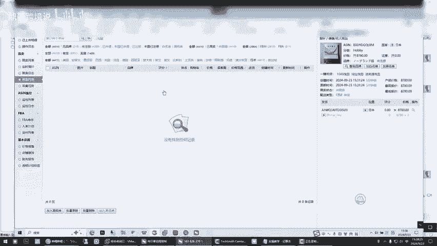

# 新手亚马逊fbm怎么选品？答应我一定要试试这个方法，绝不后悔！ - P1 - 鼎哥跨境说 - BV15es8ebELf

🎼hello，大家好，我是顶哥，很高兴呢又和小伙伴们见面了。那么这一期呢也是。😊，🎼处理学员的账户问题，欧洲的KYC和日本站的开通和日本站如何做跟卖？呃，这个小伙伴呢。

🎼是一个非常有执行力和悟性的小伙伴。🎼那么今天我们还是老样子，先做个简单的自我介绍啊，顶哥跨境说专注亚马逊的新手选品。🎼独创亚马逊新手综合选品法，让你选品不再难。

让你最快速实现新手亚马逊运营出单0到1的突破。低成本的FBM的精铺模式，让你少走弯路，少踩坑。谁的钱也是血汗钱，不学习就要被市场教训，学习的目的就是减少被教训的几率。

本期分享和学员一对一实操直接拿结果处理学员账户问题，欧洲KYC怎么解决，和日本站开通，如何去拿日本站来做更卖。🎼呃，这为什么去拿日本站来跟麦呢？因为特殊情况啊，这个小伙伴原则上说做跟麦是要单独的账户做。

我们不能去混在一起。但是小伙伴的情况特殊，那么我们就把它分开北美做金铺，日本来做跟卖啊，就是顶哥为什么每次要跟你们去跟小伙伴的交流，远程视频去分享出来，就是我们就是一句话，就是说。嗯。😊。

🎼小伙伴们和视频前的小呃朋友们我们永远。🎼我们做的都是真真实实的事情，我们没有说不像别人给你夸什么。顶哥有多大能耐，使多大能耐。还有一些可能你们也能看到很多的什么在我视频底下留言的，做34年了。

咋带人了，免费带，你永远记住一句话，免费的是最贵的，天上不会掉馅饼，等你哪天被割的时候，你去被坑的时候，你今天记住顶哥提醒你的这句话，那么顶哥跨镜说简化流程上手实操是最大的核心啊，真诚，你看有啥。

我说啥，对吧。🎼我们直接拿结果。好，我们马上开始操作啊。要的东西你打开。你这个资料营业执照是一个人的，还是说还有别人？营业执照是个人的那就写你是公司的所有受益人是。你你你提交你你提交东西了。啊。

你没有提交东西吧。我把那个什么提交了呀，你把什么提交了，我把那个银行账户。😡，银行账户啊。昨天不是登那个不是那个乒乓里面，不是注册的那个不是不是英国和欧个，我知道这个里面你递交东西了吗？

🎼这个里边我又把这个改了地址。这个又改了个就是加了个地址，你你不要去乱动啊，现在。哦。这是他要提交的东西，他为什么问你要户口本呢？我不知道。🎼你这个账单你你不要乱动嘛。我我找人去给你做一个这个账单去。

🎼行行，我，这个账单是真的啊，不是假的，这个给你搞的是真账的。哦好，等一下啊。好好，是一个我看一下这个你传了吗？户口本页面这个还没传我拍照。户口本的。🎼呃，户口本我等一下，我看一下。🎼你就是受益人啊。

你不要再写添加了啊。好，现在你现在缺的是一个账单，然后你的户口本页面。这是什么身份证，其他是什么户口本，这个是你提交的什么？这个是。这个是以以前就提交，他原来就有的，就是以前的身份证嘛哦。

不是他从那其他地方，他没问题要营业执照。没有，这所有东西，他都是之前都是从之前的都没有要。这都有。🎼这是我之之前注册的时候，他出来就有了。你你等一下，没事，我先看我那个朋友在不在联通号。

你的这个哪个是你这个就是你的联通手机号吧。对对对。🎼我看他联系上他了。连系上他看能不能给搞一个啊。🎼我把你的号输进去18。186。🎼6955，别别说了，我自己输吧。哦。等一下联系一下地址。

我这个地址是用哪个的？你稍等，我跟他联系了，我看能不能给你搞个账单出来。嗯。我看他要什么地址，他这个账单上账单上是有地址的，我看他是用你这个这个是你户口本地址这个。🎼这个不是户口本，就是住居住地址吗？

上面是有那个你把身份证地址，营业地址、身份证地址、身份证地址。对他要，行，我发给你手机号带身份证地址。那好。🎼你把身份证正面发给我，我先暂停录这个录这个这个这个问题先跳过，我们看日本战吧，这个不看了。

打开日本站，自己打开日本站。日本日本对。咱们一个一个解决问题啊。嗯，好。日本那是没问题了是吧？呃，有你你就看一下那个税务啥的，我我我好像没弄吧，日本不用不用弄那个东西，就是那个不用弄。对。

我现在给你把日本绑一下就行了，身份信息。啥意思？啊，这个是整个线。就是刚才那个欧洲站所有的都这样，收道了收道了知道了，退回去。

日本的搞定了，今天先去跑日本的数据啊。我跟你那那个。🎼你同步进行啊，日本的。

🎼你走更脉的线路，北美站走金铺的线路啊，暂时先这样子。好，因为这个东西急你急也没有用，越是想的快，越是慢。记住这句话，你你真的嗯。🎼日本站也是去找一找，你不要贪，记住啊，鼎哥跟你讲了，他能跟你出单就行。

你不要去贪，知道知道我在跟你说什么了吧。🎼好，你登录登录登录，咱们你把打打开你的那个程序。先测试不不，在虚拟机里，虚拟机里打开。🎼对。日本A全的A试一下。我没听过。🎼啊，没毛病，不用管他。

你让他让他跑的就行，我们上桌面就行啊，不用管他。桌面的时候你不用管它嘛。上桌面桌面的这个软件里的哪？一样，等一下，我今天教你的呢。🎼直接上这里，我昨天给你发的视频看了吗？分驰那个。🎼哦，看了看了。

能弄明白在做能弄明白原理吗？能弄明白okK知道了，他们知道咱们用的东西，别人不这么操作，知道吧？你这样子才能把钱省下来，尤其是头留的时候。一样，我们先带这个。你直接上日本走。哦，知道了吧。

🎼是发货就搞这个。🎼就搞这个知道了吧，中国直服对，销量。100200到500都可以。🎼还是思路是一样的啊。未注册的啊，听懂了吧？你别那个东西能去做跟卖，这个玩意儿也能拿来做跟卖，看你怎么用啊。

🎼明白啥意思吗？🎼哦，你找的稳当点，稳当点，是不是你看。🎼随便你先你先看他啥玩意儿，你你看啊。嗯。🎼哎，你装了那个东西了没有？这个东西需要那个上网，要不然前台打不开？🎼哦，我装了哦在桌面上，我我看一下。

对你先把它打开，你看啊。🎼你首先那个登录前台呃，谷歌浏览器吧，还是EDGE。这个我看他连的。你没连上我这个我上面有两个都有，这个应该是。🎼谷歌的吧，谁个是谷歌的这是谷歌吗？诶。这不对，这是EDGE。

🎼你那个没连上啊。没连上。现在设置了以后，你打开它。你才能进来。嗯，稍等一下啊，他可能是要验证码，我不知道，稍等一下，我暂停一下，你稍等一下啊。嗯，好好。🎼你先你先别管什么品啊，把思路记住。

因为这个视频有可能我去放上去，知道了吧？所以说你不要以这个品为原则啊，你把思路弄清楚，完了下去自己搞懂吗？啊，好好好，所以说有些时候我真给你选一个，完了被别人给给抢了，嗯说是不是？😡，我知道知道好。哎。

那个欧路没出来吗？🎼你像等一下啊，还是还是那个之前我跟你讲的那个方法，就是销量三三三个加起来，三个加起来除以3。🎼再除以30天，你像这个明显的就不求形，你知道吧？看到了吧？嗯，所以说没有题，对。

pass掉。他这个里面的，你看看似这么多，但是很虚啊，咱别管他啥玩意儿，你先进去，你先进去，你先把思路记清楚啊。啊。🎼在这个地方的时候，两边你同时进行，哎，看日本就出来了是吧，对吧？

这个地方一定要选择这个排名越靠前，你可以筛选出销量啊，这个地方。这个。🎼啊，记住啊哦，很多人他们跟麦出了单不赚钱，为什么？因为打价格战呗是吧？嗯。这个。🎼啊，现在再出来一个，你现在都没数据。

知道啥意思吧？你你还要去设置一个价格区间。你像这个玩意儿。你要挣钱了也无所谓，你懂吧？你记住啊，他叫挣钱，他3%40的毛利你也能干。别管他别看它东西小，它量大，知道了吧？你看我知道了，他63。😡。

我我不知道你这浏览器怎么哦录就出不来呢，这啥意思？😡，这是是谷歌吗？🎼刚才不是设置的，应该试不会，你得你得把它启用了，你得把它这个点开嘛。🎼就那个这个这个小光灯看到了吧哦啊。🎼小黄灯把它搞上去。

你稍等一下啊，哎这又要验证码吗？这是我看一下。你店铺后台手机号是不是就是这个手机？对对嗯。所以说他们搞的时候人家都给你搞齐全呢。哦，你这是为什么出不来出不来，我看一下啊。搞一下就好了。😔。

嘿嘿这天没了呀。😊，是不是因为那个那个东西的事哎，不知道，先别管它大概率大概率它你你别管用，你后续你可以用那个EDEDGE去是吧，就是。然后，然后你我就是这个我知道这个意思原。

思路记住完了他上架时间也不长，9天卖这么多是吧？完了你再结结合上，你先结合他这个他应该差不了两个卖家是不是不一样是吧，对吧？然后呢，你不一样的时候，你去干嘛，对不对？你去。嗯。😊，第一步先干这个事儿。

你先别管他，如果他量大，举例说你卖一个，你还能赚个几10块钱，那一天卖三四单也80块钱是吧，就行了啊，是给你我给你举个例子啊，如果还有这个确定这个没毛病的时候，我是不是那天跟你说嘞啊，你要看什么。

知道了吧，我在这不说了啊。你要看什么啊，那个是对，然后这个完了你就找货源，你对比一下货源，对比一下货源，就我给的你我给你一开始的那个表格，你你用那个表格，你就把它的售价变出来，变出来以后。

然后你算它的利润空间，知道了吧？因为你跟卖的时候绝对是跟着它的最低价，跟的是它的最低价，而不是最高价，这啥意思？你看啊。

你看他这里举例说卖这个，他一定是跟着是购物车的这个价格啊，跟着是购物车价格。我们给你举个例子，我给你示范一下啊，怎么把它复制了啊，我们复制了它示范一下啊，我这是盲操，实际实际有些东西啊。

我不可能在视频里说，私底下问我，私底下给你给你说，知道了吧？好好好，你你看。添加添加这个我们这个不是要做这个啊，只是举个例子。你看我知道我知道查询单个的时候，它是单个变体。如果它要全部变体的情况下。

它就这么多变体。这就是说你要把它全根，还是只跟它一个啊，听懂啥意思吧？嗯，我知道，一般建议你就跟一个见好就收就好啊，不要去这个时候是不是我跟你说的这个。是吧时间，那你就用这个默认的这个就行。

一开始你先用先用这个试试哦，你就这个。库存不要多写记住啊，只写这个啊啊这个里面就是你的采购链接，就是你去1688找到这个货源的那个采购链接，我先不给你写啊，我先给你举个例子啊，是吧？创建了个跟卖是。

对不对？创建了跟卖以后，现在是下架状态，这个地方你把那个链接补充上这个调价，完后我不给你在这里讲哪一天我给你细讲，你要真正上架的时候，你要问我我给你细讲，咱俩就不录了，我告诉你它的原理，它是怎么调价的。

他这是给你做个举例视频里告诉你的这个步骤啊，步骤，比例说你现在上架，你看啊。立即上架，他是不是上架中，他咱咱们不能让他上架啊，现在啊你看明白他怎么操作就行了啊。呃，下架是不是下架中是吧，看明白了吧，嗯。

看到了，而且他这个东西后面能干嘛，能给你转移店铺。举例说你还有自己又有个日本铺子，他这里会出来出来，你就把这个商品你不想干了，转移到别的铺子里干。😊，就是后面的玩法，想玩，我后面跟你说怎么。

我先给你简单介绍一下它的功能是吧？这个调价规则你看。你选择了一个商品。你这里就调价规则，默认默认默认我是不是调价规则给你显的是这个。跟麦条件定时跟麦，这就是你设置一个时间。你看我这个地方我设了三个时间。

这个是晚上的，上午的这是3个。就实有些时候如果人家卖的好，你不要去搞人家，你上去就这个点上去跟一下子，那能不出个一单，你下来就跑了，知道吧？就跑了。不要不要被别人抓住，你，这都是我自己设置的短规则。

你到时候我你真上的时候，我会给你点开，告诉你它是咋回事儿啊。这个价格就是你调了价格，这设置价格是什么意思？你看日本价格最低价、最高价百分比调价方式是百分比。同步所有跟卖同步购物车。如果你点了这个的时候。

就谁现在抢的是购物车，就出单的那个刚才我给你看了一下，我给你看了一下，是不是他他抢的购物车，就谁抢了购物车，谁拿的购物车，就是这个人拿的购物车，看见了吗？谁谁拿的购物车的时候，你就同步他的价格。

你就在他的价格上去调价。哎，这是谁抢了购物车，你就跟跟着他跟他去调价，点保存设置就行了哦。明白了吗？你设置完价格以后，这里就可以连个刷新，它就出来了。哎，你看我们是其实是不搞这个，我们要把它删除掉。

要不然账户里面会出问题，知道了，我们把它删除掉。哎，你现在你可以看在日本站的店铺里吗，你去打开看一下。你去看一下有没有个东西，应该是短时间他没有，因为跟恩卖他不需要白名单，但是自发货他是需要的。

你看你看这个地方，所以说我们只是做了个测试。

。

你看现在还好还没有是吧？我是比较喜欢用这个旧版本的。就完本的没有看见他没有这么复杂。就完慢的简单，看起来。我刚才跟你讲的你弄明白了吗？他这是这是这是操作规则。实际上真正跟卖跟卖以后呃。

我那天是不是跟你说这个事了，看见了吗？看了是不是一个日文，一个英文。你你打开打开日本站的那个呃。日本站的那个查商标的。🤧来，你看啊来，我给你举个例子。我们把它复制了。如果你单独的你去搞一下这个。

它应该是没有商标的，看见了吗？没有吧。是不是？🤧看明白啥意思了吗？但你要搞这个就有商标了，看到了吗？看明白了吗？看懂了，有些时候他们下钩子是这个下的哎。啊。日本日本其实也比较卷。你看你无论查这个。

你这个他都没商标，那有些时候搞你他会怎么搞你？🎼他就以以这个名义来去搞你知道了吧？😀は。😊，没事。🎼但是咱们知道怎么搞，咱们知道怎么申诉，知道了吧？这种情况。所以说我是今天跟你讲这个东西是告诉你。

🎼是不是存在这样的现象？🎼对，是吧哎，如果说它是纯日文的也没关系，我们就看我们把这个东西把它删除了。🎼这个地方变成已删除的时候，你要点点住它，点住它点那个移除明细啊啊，这就没了，知道了吧？空了。

你你看啊，我来给你看一下，现在出几个又出来一个。你看他是纯英文的，嗯重英文的是不是你看是不是你看你看看是吧？纯英文的，他也没有这个没毛病，你可以干他。

是不是跟麦的核心不是这个核心的是怎么去别人搞你怎么去处理绩效，知道啥意思了吗？嗯跟麦的核心是怎么去处理别人怎么整你。🎼知道了吧，你跟麦一分钟学会，那你看着他了，你跟就完事了嘛。但你知道别人搞了。

你怎么弄吗？🎼是吧。🎼所以说你像我也不怕，让他们看没看了你你你出了问题，你不知道怎么解决。你看这个啊，这个就纯日文的是吧，你看的品牌，你纯日文的那你那你就自己看一下嘛，纯日文的是不是是吧？

🎼你看他这个没注册商标，对不对？这个也正常。就怕的就是我刚才给你看的那个，他又有英文，又有中文，是不是？当然了。🎼你要会说，他即使亚马逊搞了你，你也不怕，为什么，因为你知道怎么搞他。🎼懂吗？哦懂吗？

你知道怎么搞他。🎼家是一种垃圾，看到了吗？🎼是吧。🎼你去你去查他他肯定没毛病，你肯定没毛病是吧，没毛病啊。🎼你试着，你把他去了。🎼也没毛病。🎼你看啊。是吧。哼。🎼是有些人他又会反驳怎么怎么地。🎼哎。

你这就不对了，反驳，但是我告诉你，因为我们在干的时候就遇到过遇到这些垃圾玩意儿就怎么的干。🎼知道了吧？は。我们不害人，那们防人是不是是吧？🎼但你出了问题，你要知道怎么解决。但是这儿咱不去分享。

不能在这个里面分享，对吧？要真遇到问题，我会带着你去自己写申诉，怎么打电话，怎么处理。难免做跟麦，难免遇到同行搞你记住啊，难免。所以说顶哥跟你讲了，做跟麦的时候一定不要贪多。

🎼有那么一两个品一天能给你出单就行了。记住最可怕的是什么，他投诉你售假，那你提供发票，那你提供授权，这就麻烦了，知道了，一样做跟卖你也不要碰什么球衣类的东西，你不要碰啊。🎼像那些好gu奇的包包，知道吧？

类似于那些什么爱玛神的，你不用看起来你不用去不用去去搞它。你看一会儿公布多少条记录的，是不是你一样。你一样。🎼最高价举例说，1000日元以下的，你可以不碰它，它基本上是不是没多少钱，你也挣不了多少钱。

你干掉它删除掉，对不对？自己自己灵活去掌握啊。🎼私底下不懂的话可以问我，我告诉你们，但是这里。🎼这些指标你都可以随意动，永远记住初一他就是出过单的，他就出过单的这就是出过单的。🎼知道了吧。

然后你要价格区间，你要控制好啊，卖家数量你控制好，听明白了吗？你不要你看不看中国卖家是FBA的，我们把它干掉，我们不做FBA。🎼当然你也可以跟卖他的FB，因为什么中国离日本近，你就跟了他也就跟了他了。

物流也就差个三四天。不一定说他是FB，你就不能跟。不是的。你自己灵活掌握，知道了吧？嗯，哈。🎼所以说你看数据是不是里面跑的，是不是在这抓了97条记录，我给你设置的100条，100条它会停停了以后。

你再启动一下AB龙流来，知道了吗？AB轮流来啊，嗯是吧？🎼两个结合的来这个地方和这个地方，你自己要学会看，你先看它的销量，你先会看你知道了？🎼尽量的去做跟脉，不要去做一些大件，为什么？运费。🎼嗯。

当你的采购成本，当你的运费成本是你采购成本两倍3倍的时候，别碰了，你一旦赔钱，你全折在运费上。嗯，记住这些细节啊记住这些细节我完后我有个文文档，我再发给你的做跟麦注意这些什么啊，我给你发你一下。

因为这里面我不能去给你分享。就两个结合起来用。但是你记住啊。🎼呃，那个上一号的时候，北美，你你北美你选出来的品啊，那个我觉得你那个东西你的你选出来的品呃该干嘛了？利润也好，什么情写不化了。7个。

🎼找到词根以后，下个动作就是弄文案了，我给你分享会给你分开分享，不要不就乱了，搞得我也乱了。给你讲哥麦的时候就讲这个讲金库，咱俩就讲那个对吧？🎼一步一步来，你这个吧你你你同步进行，一般一般顶哥跟你讲了。

我是不建议你是同步进行的。但你你的情况你跟我说，但我为啥说你既然要同步，就要把控好风险安全，见好就收，哪怕咱不做了，咱也不能去惹事儿去，是吧？🎼嗯，好，日本在这里面也有些垃圾人，其实搞你的都是中国人。

第四句话，日本人不会搞你，搞你都是中国人。明白了吗？嗯。你你看啊，我教你个方法，你也不用等他这个地方数据都抓完，它其实已经停了，你去咱们去这里面看一下是不是。是不是停了是吧？好。停了以后，你停了吧。

你把这个清理已完成，你把它都干掉，是不是哎？🎼还有48条记录正在进行，你就搞100条。就我我刚才跟你说的设置。你就在这100条里面找数据。如果这100条里面找不到数据，你就把它批烂全清空。

再让他进行下一波抓再搞知道了吗？因为他无有些时候无效数据都。🎼他有这种功会重复，他不会重复，这个你当不用不用的，它不会重复设置的不可能重复。你添加完这个跑完这个关键词，它不可能重复。

因为我设置的它添加一条自动删一条，它不可能重复。哦，那我知道了，因为日本站的数据很多啊，他有些时候造成你就会抓取到什么到150，不让你抓了，它有限制。其实这个时候这不是无货吗？像这种你直接干掉就行了。

它有一些数据它是无效数据，知道了吧？你把它干掉，有品牌的什么什么这个的时候你看FBA的，你先不用删它，你先进去看一看你能不能跟，能跟能找到货源不侵权，知道吧？你不侵权，哎，你就试试玩它嘛，是不是？

衣服类的你要看你别碰那些带版权的球衣一类的啊，这个很这个很危险。日本人是动漫，知道吧？动漫。对，雷区知道吧？🎼他这个版权，它这这个东西属于版权啊，它不是上庙。哦，自己自己操点心，对吧？你你这边有数据了。

你就去练一练，就我刚才我就不演示，你自己一会儿咱俩下了课，你自己练一练，没找不到，你就全把它干掉。再抓一波，你我要的你不需要数量多，我要的是你精，知道了吧？你你就留下那么一两个精的时候，哎。

价格区间可以利润可以好，你再跟我说一声。我在咱俩再带着你再琢磨琢磨，咱试一试。听懂了吧？试一试听懂啊，所以说你一定要小心啊。当顶哥的，我得处处的跟你替你去，把你想不到的我得跟你说一声。明白了吗？🎼嗯。

明白你先玩觉得数据不合适，把它删掉再来，反正不用你那啥，他在后台自己跑，对不对？是吧行。今天先给你弄这个啊。🎼一般主要是明天明后天我上午比较忙，因为有个同学家嫁闺女，我得去给他帮忙，估计要给你上课。

是下午的事儿，下午或者晚上了。🎼人家是大事，对吧？人家嫁闺女呢，我得给他帮忙修啊。Oh。🎼其实有些东西记住，你看你跟着顶哥学，这些东西拿结果难吗？不难吧。你只要本执行力够强。

🎼对吧这个是这个后面你把那个我给你把北美那个三个，你欧洲过了KYC都给你开了。开了以后，你从北美站金铺做一个产品，你就你日本站别上了，做一个产品，你就把北美和欧洲全上了，他出单的概率就大我们，对吧？

🎼哦嗯。今天先这样，你先搞吧好。嗯，好的好的，咱俩先下课了啊，O。😊，有啥事给我留言就行啊，不懂的，你问我再留言，我来跟你讲。啊，那个KYC等一会儿KYC你先别管他做完联系我是吧？他做完账单。

他就会发给我，发给我以后，我领着你我领我领着你弄，你不要自己去弄，你这个很有可能会出。第二个，就是说当你提交了以后还不过，他会问你要一个章程。那个章程的时候，你就要给人家掏个几10块钱。

因为人家找美工给你屁啊，这个吧，这个账单你不用管了，人家跟我朋友，人家。不会问你要钱给你解决掉了，知道了吧？

