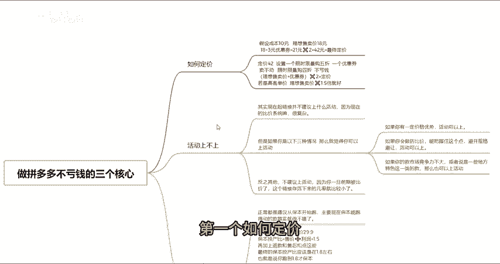
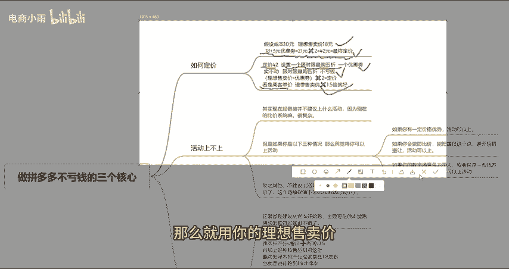
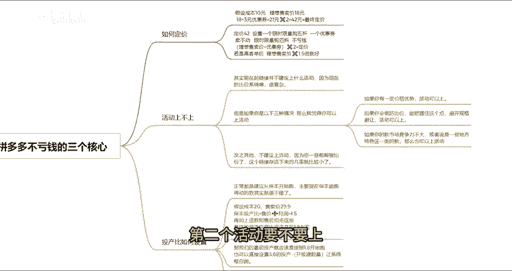
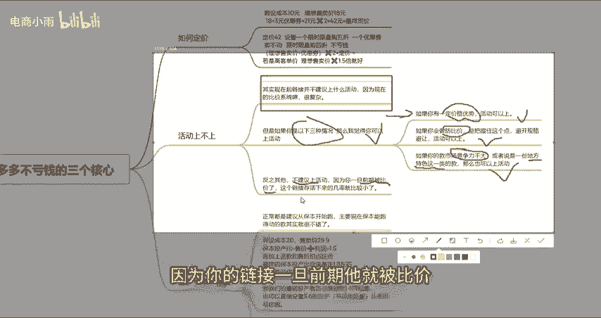
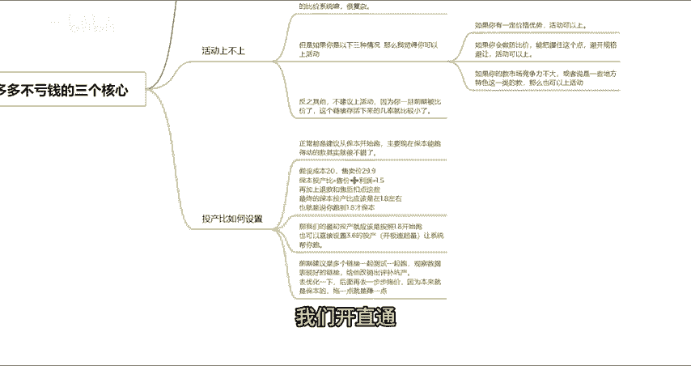
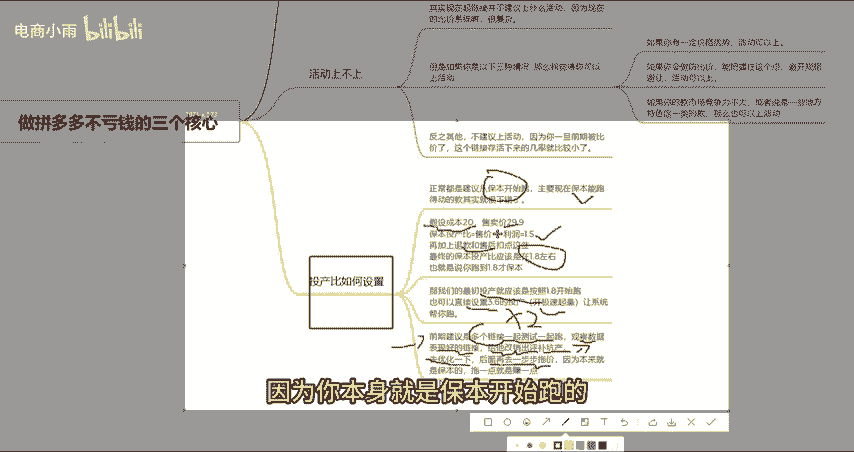

# 新手做拼多多不亏钱的三个核心要素！如何定价！要不要上活动！投产比如何设置！ - P1 - 电商小雨 - BV1WF1yYDEg7

很多新手商家入局拼多多，他们做了一段时间之后，大部分人其实都是亏钱的这是因为他们对整个平台的规则与体系不是特别的了解。今天我就来分享一下，做拼多多三个不亏钱的核心，希望对你有帮助。第一个如何定价？

假设你的成本是10块，你理想售卖价是18块，那么你的定价就应该是18块，加上3块钱的优惠券，再翻一倍，也就是18块的定价定42元，42元再设置一个限时限认购的5折，再去加一个3块钱的优惠券。

那么你的价格就是18。如果说18块钱卖不动的情况下，那么你可以限时限购打4折，再加一个优惠券。那么你照样是不亏本的。但是说如果说你是那种高客单价，比如大几百的那种，那么就用你的理想售卖价翻个1。

5倍去卖就可以了。第二个活动要不要上。其实现在起新链接真的不是特别介意上什么活动。

因为现在的比价系统很猛很复杂。但是说如果你是以下三种情况，那么我觉得你可以上火的。第一个你有一定的价格优势，不是那么的怕比价，那么你可以上。第二个，你会做反比价，能够把握这个点，规避一定程度的比价。

那么你也可以上活动。第三个，如果说你是属于一些。地方特色类的款，这种款竞争没有特别大，那么你也是可以上活动的。反之其他的就不是很介议上活动了。因为你的链接一旦前期它就被比价了。

那么你这个链接存活下来几率就很小很小了。那么第三个，我们开直通车的时候，投餐比该如何设置呢？

其实正常的话，我都是建议大家从保本开始跑。因为就现在这个平台形式来说，你保本能跑得动的款其实就是一个好款了。那假设我们的成本20卖29。9块。那我们的保本投产比就等于我们的售价除以利润，也就是等于1。

5，再加上售后退款这些，那你的最终保本投产比就应该是1。8左右，我们仔细算啊，就是1。8左右。那么我们最初的投产比就是应该按照1。8开始去跑，你也可以直接翻倍设置3。6的投产开极速起量。

因为极速起量现在相当于双倍扣费嘛，让系统去帮你跑。当然前期的话肯定建议是多个链接一起去跑。然后观察那些数据表现比较好的链接，去给它补点销量，搞点评价，补点天产，加一加权重，更容易跑起来，去给它优化一下。

然后后面跑起来了，再想着一步步的去拖价。因为你本身就是保本开始跑的，你拖一点它就壮一点。

