# 新手做拼多多学会这套直通车核心操作，90%想不盈利都难 - P1 - 曲奇All - BV1CgsDevE6N

现在做拼多多，如果想爆单，只需一种打法。很多商家朋友虽然学了很多操作，却仅懂皮毛味的精髓，对自身毫无作用。如果现在店铺已经处于操作阶段，那就采用一个核心操作。无论是什么产品都比那些花里胡哨的操作更有效。

点个关注点个赞，直接上市操。首先，无论市面上有多少种玩法，都遵循一个核心坑产，拼多多所需的销售额，初期卖的好，后期必定更加，你可以补大单坑产，但这只能治标并非长久之机。如果想快速积累真实坑产。

一定是活动配合开车，活动的目的并非出多少单，而是提升直通车的效果，让曝光度更高。那第一阶段呢只需限额100，进入第二阶段才是真正爆发的前提，通常第二阶段会断流。如果只有一条链接就会很局限。

所以一开始就要上很多条链接，通过开车测试出在第二阶段也能跑得动的链接。接着最为重要的是，要做坑产的递增，通过直通车限额递增就可以实现坑产，每日增加，增加。

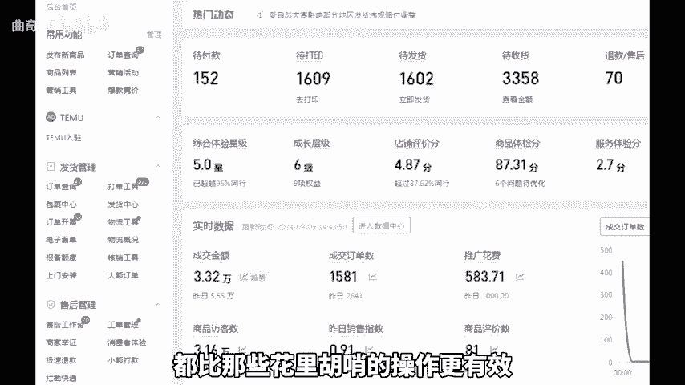

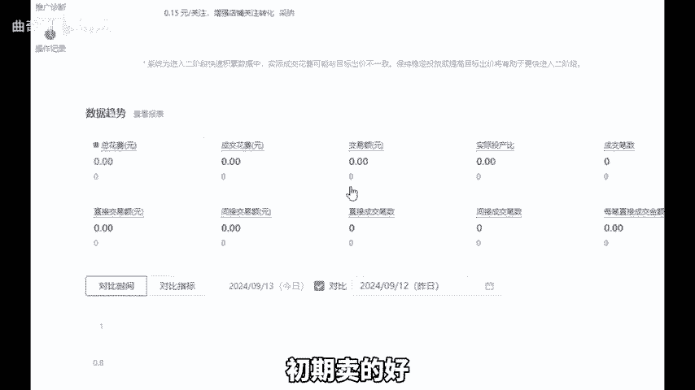

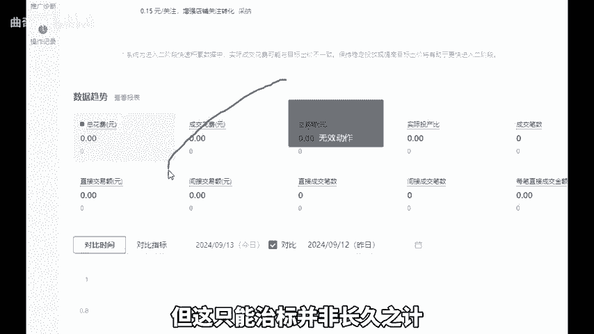

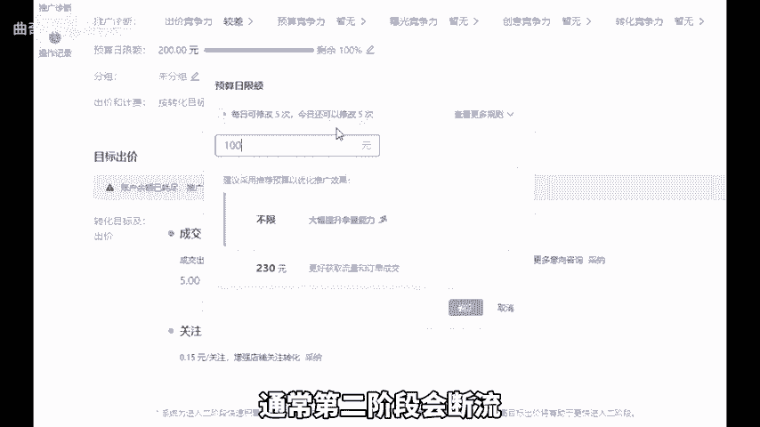

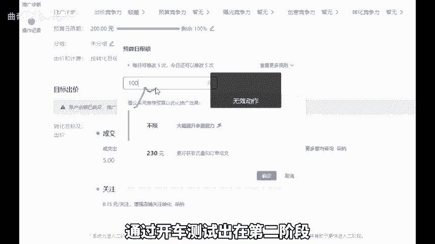

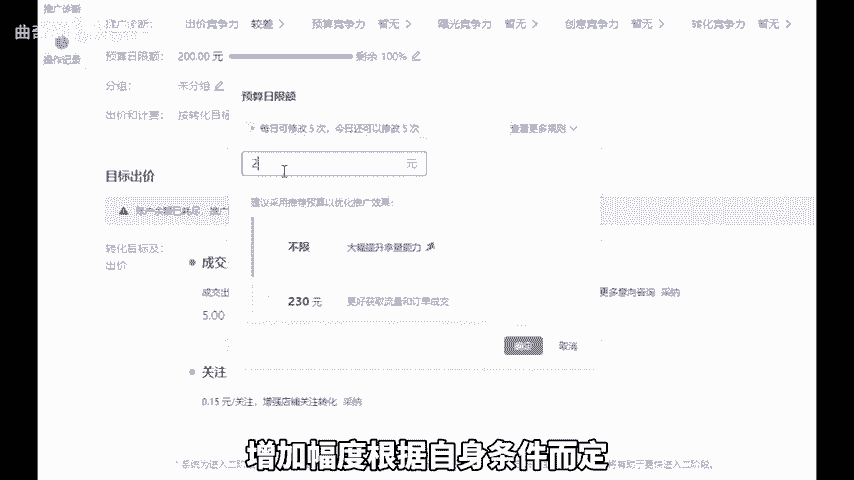

幅度根据自身条件而定，最少每天增加50以上的限额，连续递增一周最佳。只要前期测试除了链接没问题，那一周过后就能实现直通车稳定出单。投产可以按照保本投产去跑，跑不动就下调10%，最多调整3次就停止。

后面就可以进行拖价，以0。2的幅度往上拉，投产，拖价一周左右，你的投产99%就都是盈利状态了。这样实操才能快速实现打爆。好，今天的分享就到这里，还有不懂的，可以后台找我不知为你解答。

还给你分享一份我整理的店铺综合运包。

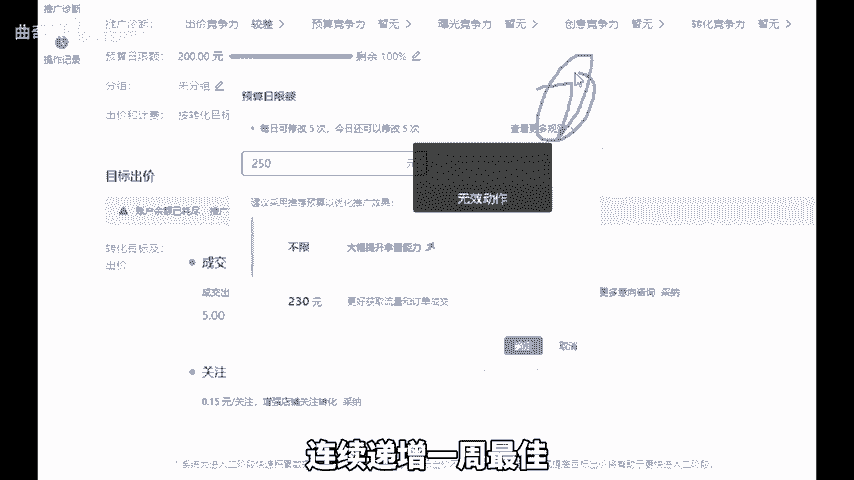

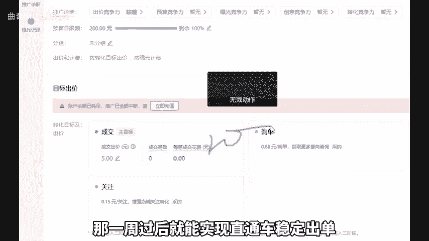

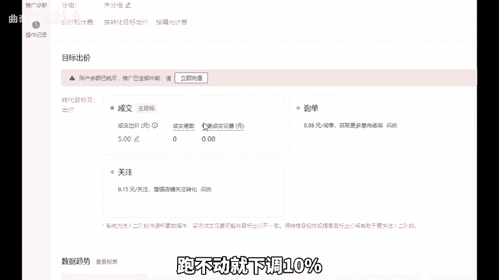

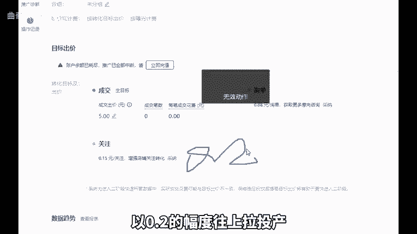

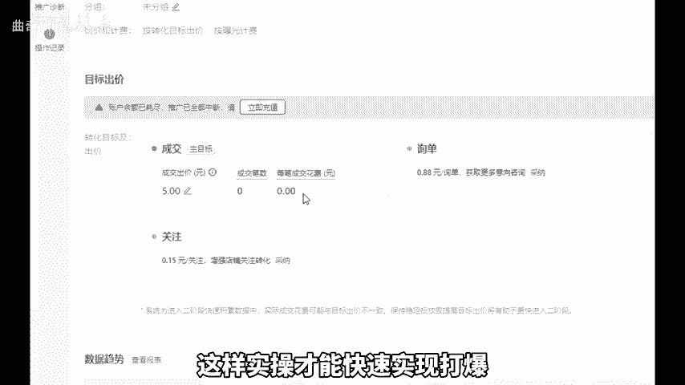