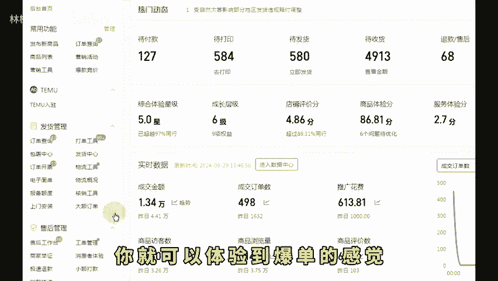
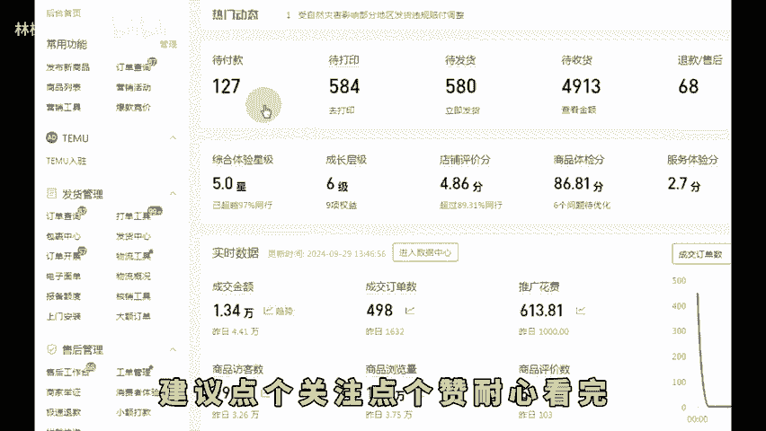
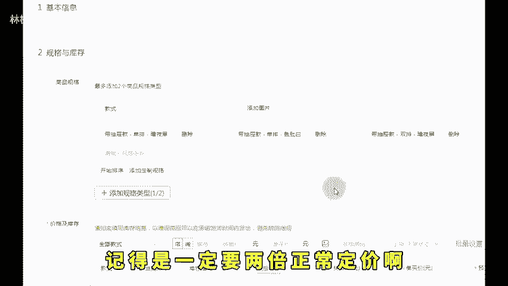
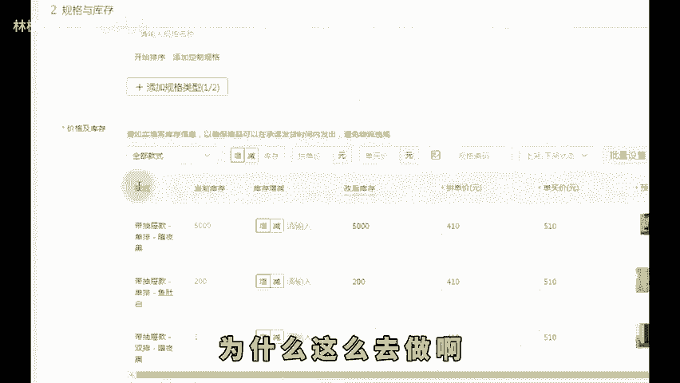
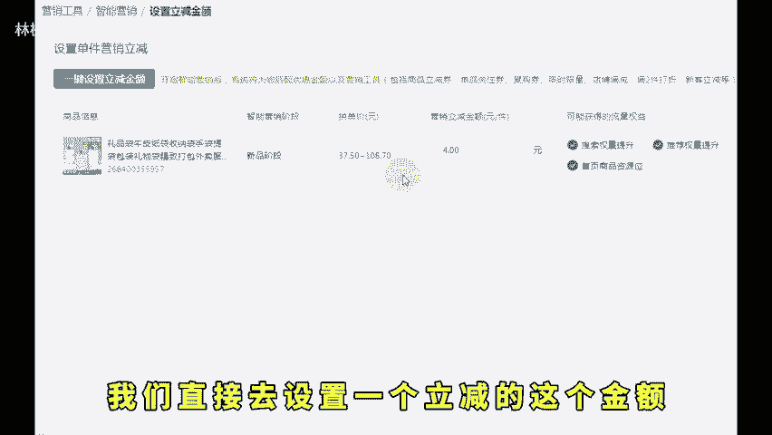
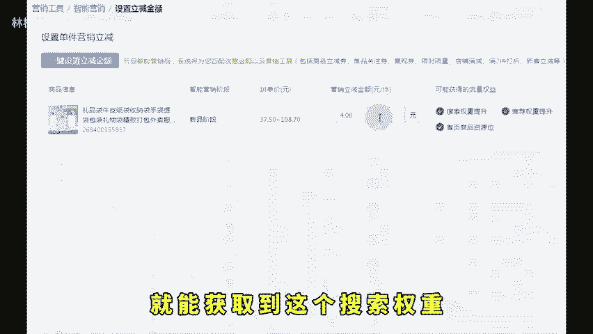
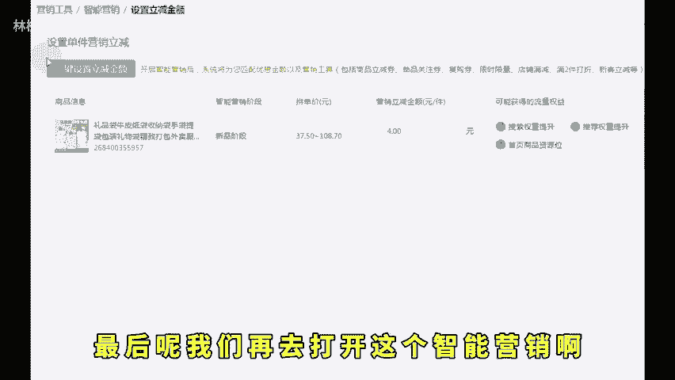
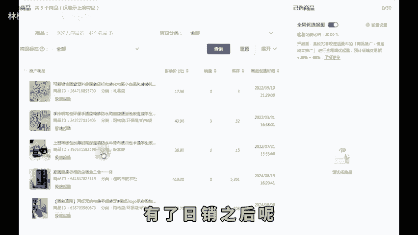

# 新手做拼多多想要一周起店这套玩法不要错过！ - P1 - 林枫电商干货 - BV1D4xredE1A

🎼现在做拼多多新店铺，你只需要做好这三个步骤啊，一周内呢你就可以体验到爆单的感觉。细节呢比较多，视频内容也比较干比较长啊，建议点个关注，点个赞，耐心看完。首先呢第一步我们打开这个我们后台的商品列表啊。

点击这个机会商品啊。我们从这里面消费者正在搜的入口发布同款啊，找到热度高的同款发布，能直接获取到这个新品标和机会商品标的一个流量加权，然后我们发布的时候呢，记得是一定要两倍正常定价啊，然后提交上架。

为啥两倍定价，等会我会再给你们分析为什么这么去做啊。然后我们第二步的时候呢，我们在这个营销工具里面找到这个智能营销的这个工具。这边呢有一个这个新品破销助力这个按钮，然后选择我们要操作这个链接。

然后呢我们直接去设置一个立减的这个金额。那么在这里面呢只需要去设置这张券就能获取到这个搜索权重和推荐流量的一个这个提升，以及这个首页为推荐的一个流量。最后呢我们再去打开这个智能营销啊。

然后这个时候呢我们去配合这个车子，微微进行点这个推广。有了日销之后呢，我们再直接去我们后台提报百万爆款的这个活动啊，这个是有这个独立秒。

🎼价位的虽然秒杀价格很低，但是因为之前我们定价的时候是两倍定价嘛，所以上秒杀就算6折左右也不会虚哈。只要新品上了这个标志之后呢，因为它也是有个推荐流量的。这个时候呢我们几重叠加啊。

直接控制住这个转化率和花费流速，直接进行一个车子拉升，进行这个车子投产的一个托价即可爆单哈。更多运营技巧看左下角。

