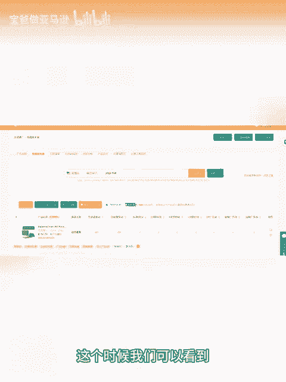
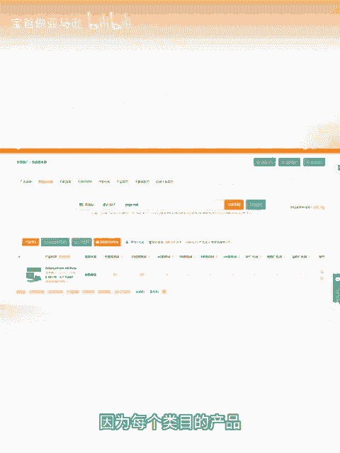
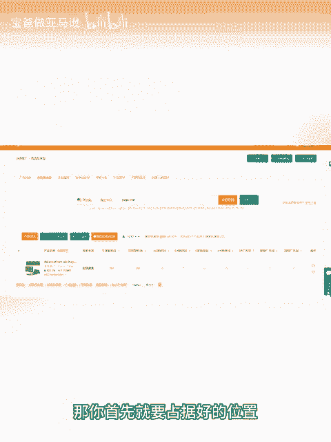
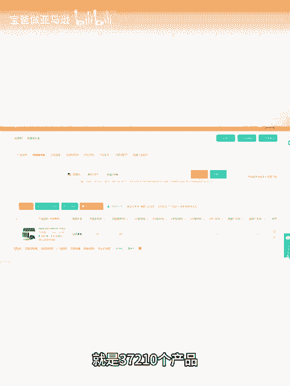
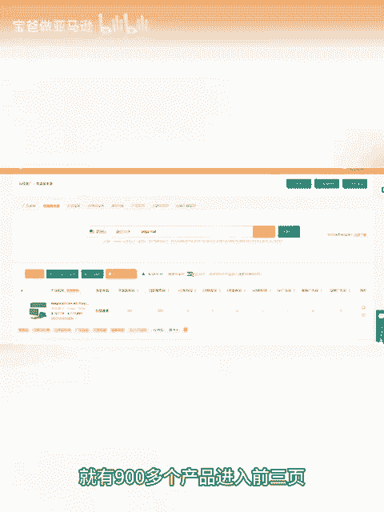
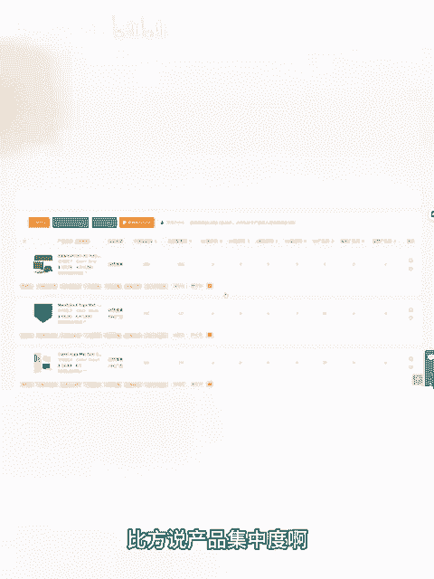
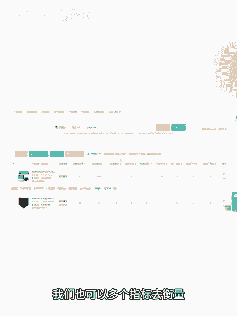

# 新手做跨境电商亚马逊，如何快速判断亚马逊新品好不好推 - P1：新手做跨境电商亚马逊，如何快速判断亚马逊新手好不好推 - 宝爸做亚马逊 - BV1dv24YoEve

我们在做亚马逊选品和运营的时候，怎么去判断这个产品好不好推投入会不会很多呢？今天我们就借用卖家精灵的查流量来源的一个功能，去看一下这个产品的相关的关键词的流量，判断这个产品好不好推，我们要不要去选。

当我们确定要做一款产品的时候，可以复制它的a，然后到卖家经灵的关键词反查，然后反查出来的关键词里面，它的主要流量值，我们把这个流量词复制一下，然后到卖家经灵的查流量来源里面去查询这个词。

这个时候我们可以看到搜索结果数为932，而且是近30天的。因为每个类目的产品它可能每一页数量不一样，有些产品是50个，有些产品是70个，我们就以70个为例。如果你的产品享有销量。

那你首先就要占据好的位置。比如说搜索结果的前三页，按照每一页70个产品来算的话，就是三期210个产品。但是这个关键词下就有900多个产品进入前三页，说明竞争还是比较激烈的。如果你去做类似的产品做。

新品来说可能是不太容易推起来。当然，判断一个产品能不能做。还有很多方面，比方说产品集中度啊，包括新品的占有率啊之类的，我们也可以多个指标去衡量这个产品要不要去做。

