# 新手如何快速搭建能变现的优质账号？ 起号五定法则，教你10倍圈粉 - P1 - 厦九九 - BV1HT421Y7GB

如果你还没有认真开始做账号，或者开始做账号都是乱七八糟，虽然已经有破千的，但就是不涨粉，那么这条视频就是做给你看的，只要按照下面我说的五个步骤做，帮你快速定位并搭建一个优质账号。

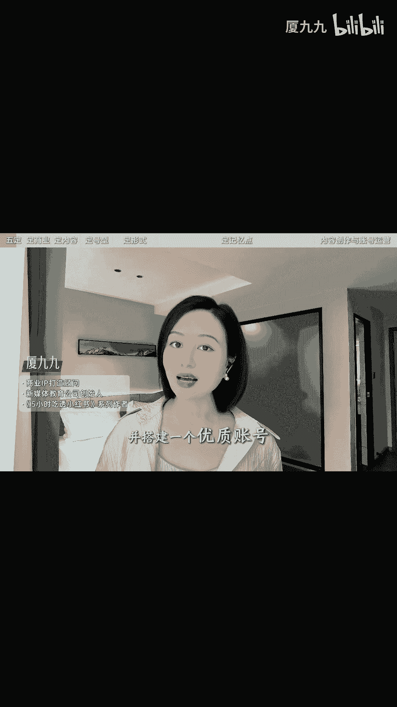

十倍圈粉，这五步呢也可以叫做五定法则，第一定商业路径有成熟业务或产品。

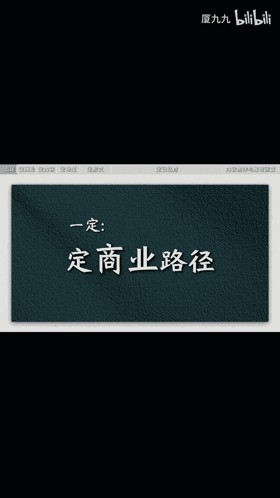

比如买疗愈课程或者是卖鞋子包包，你的业务就是你的商业模，不是还没有成熟业务的，用我这本书里的SPRM模型，梳理你最小化商品模型和变现方式。

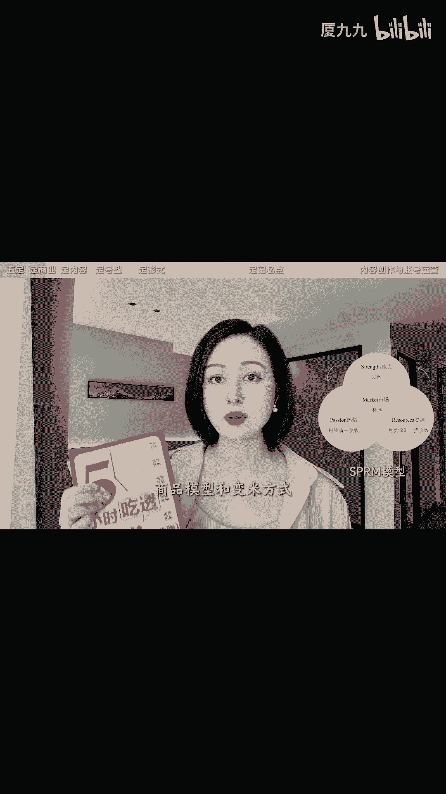

比如你的优势是职场经验，那么是否可以做求职辅导，或者是职业方向的咨询呢。

定内容方向，根据商业模式倒推你的内容方向，或者通过浏览小红书首页频道，小红书身份标签内幕，又或者第三方数据平台的内容内幕，启发自己锁定你账号内容的方向。

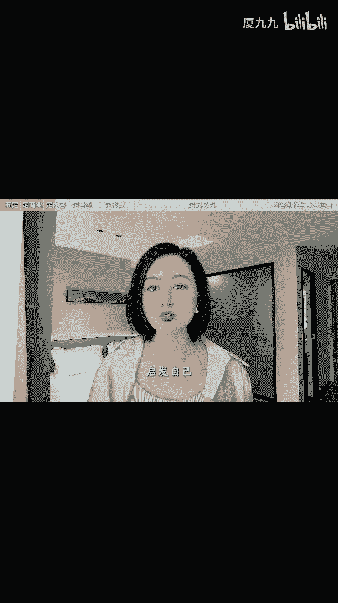

记住一定要根据你的业务倒退，你的目标人群是谁，而你能够给这些人群提供怎样的有价值的内容。

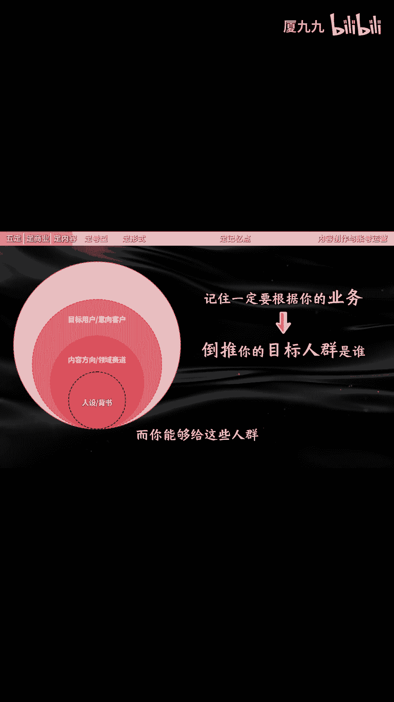

这就是你的内容方向，第三定账号类型。

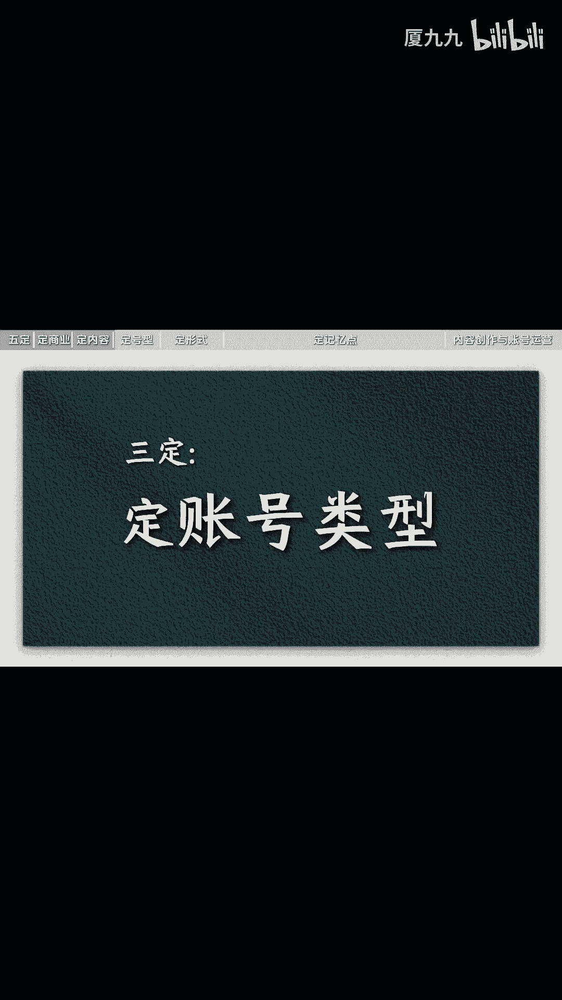

根据认证属性，账号可以分为企业号和个人号，根据内容属性呢又可以分为品牌号和人设号。

不建议做没有人设和品牌的资料号工具号，最终我们得到四个推荐。

大家做的账号类型分别是企业品牌号，企业人设号，个人人设号以及个人品牌号。

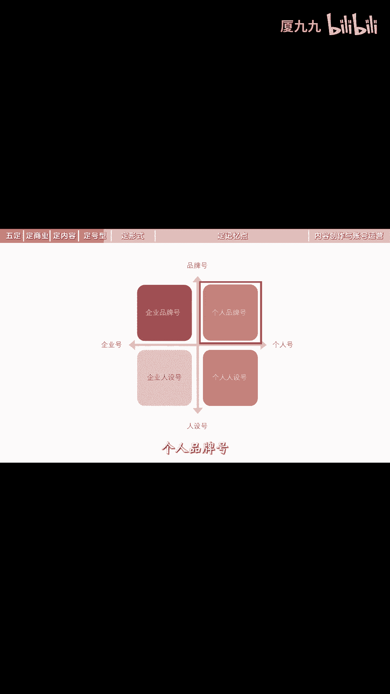

对于大豆还没有创业或者建立自己品牌的人，都建议是做个人人设号，第四就内容形式是图文为主呢。

还是以视频为主，图文有重图片，新文字的，把所有信息和知识点都用精美的图片呈现了，Plog，正文只是简短的概括，也有以文字为主，图片只作为封面或必要配图的，还有图文并茂的视频形式呢，有口播VLOG。

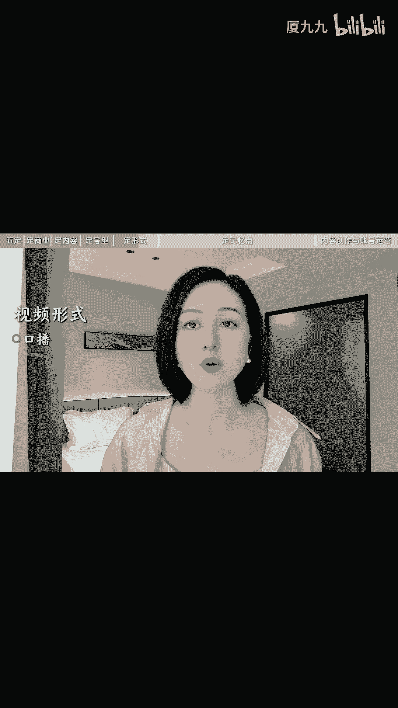

访谈式情景剧以及口播加VLOG或素材混剪，你可以根据自身特色和优势选择的内容形式，根据平台发展趋势啊，建议能做视频就做视频，实在没有条件做视频就做图文，别问我为什么定记忆点，记忆点可以是你的人设标签。

也可以是你的内容呈现的视觉锤，还可以是有穿透力的语言钉，不管是个人品牌还是企业品牌，都可以设计自己独特的品牌符号和记忆点，这样能让用户更快记住你，也更容易被传播，你可以从以下几个方面入手啊。

第一人设标签，所谓人设就是你是个怎样的人，你具有怎样的身份，职业家庭角色，社会角色，特殊背景和经历等等。

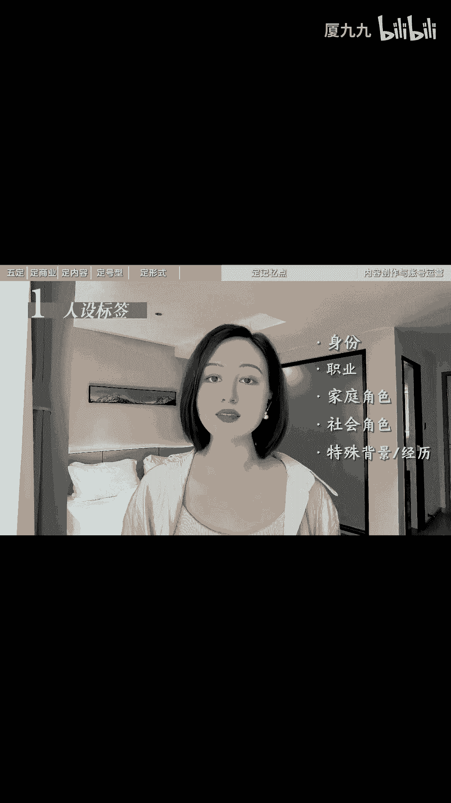

例如九五后生二代搞钱女孩，八五后北漂金融女，三线城市二胎妈妈。

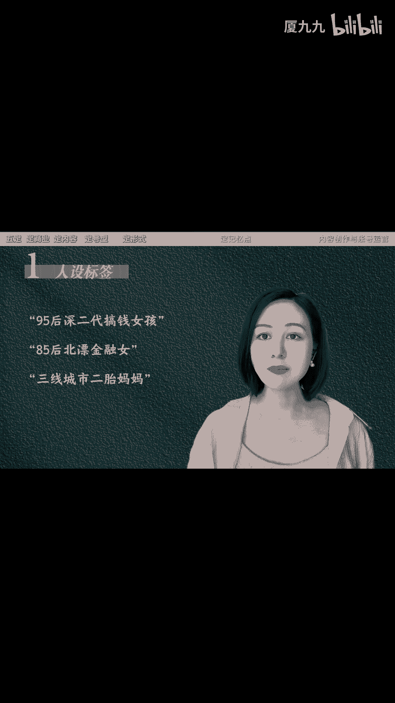

九零后小护士等等，第二视觉锤，视觉锤指的是固定的视觉元素，主要体现在场景，人物形象与复杂化上面，人物形象就包括个人的面部特征，固定的发，有特色的饰品等等，所谓服道化，就是在服装道具和妆容上用心设计。

并保持个人特色和风格，另外还可以是多人出镜，打造特殊记忆点，第三个语言，丁，凡是能以语言或声音的方式，植入用户心智的信息，都可以成为语言园丁，包括语音语调，语言种类，甚至是音乐最直接的语言钉。

就是在开场或结尾的时候设计固定的口号，比如关注夏九九，涨粉变现都长久，除了声音应用，音乐也是打造记忆点的常用方式，有些账号的视频内容每次开场都用相同的音乐，下次当你听到这个音乐的时候，就会想起这个博主。

第四个呢叫内容模式，内容是账号最核心的部分，固定的内容模式可以形成非常强的记忆点，例如张雨绮模仿王七叶，把普通物品拍出大片高级感，有趣又高级，选题内容框架和剪辑节奏几乎都一样，这就是固定的内容模式。

最后第五个叫风格特性，每个账号每个IP给人的感觉都是不同的，例如陈翔06：30是幽默，房企是文艺古典，陈诗远是温暖治愈。

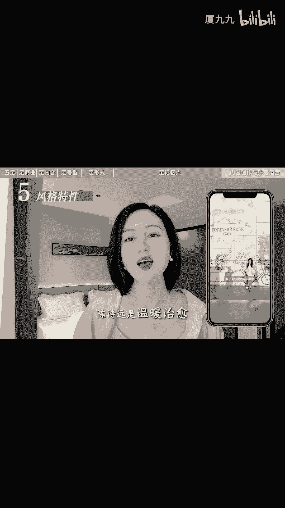

那么你希望传递给他人的风格特性，又是怎样的呢，好了按照这五定梳理下来，并且按照人设IP5件套去设定的账号主页。

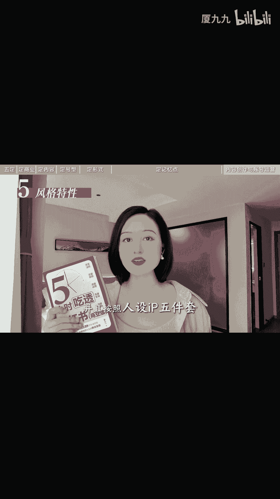

一个优质账号就搭建好了，接下来内容如何创作。

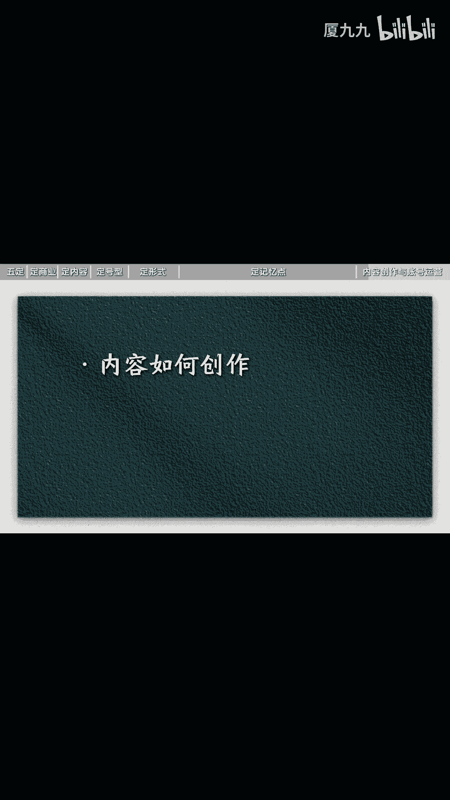

账号如何运营，发布的时候有怎样的要点，在我这本最新出版的五小时吃透小红书。

商业版里有巨干货，巨详实的方法技巧，以流量获取这个章节也就是内容生产为例啊，了解了如何搭建内容生产线，如何搭建爆款选题库，有哪些万能文案结构。

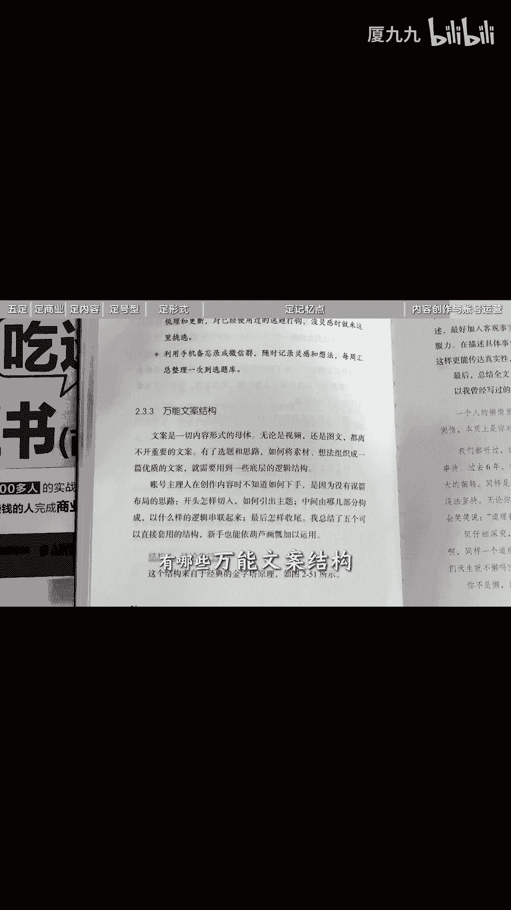

点击文案技巧包括高效拍摄剪辑方法，不同类型账号的内容思维全都有，关于账号运营呢，还有流量倍增的运营技巧，包括如何提升推荐流量，搜索流量如何做取账号。

如何利用AI提高内容创作效率等等，全书聚焦于小数的流量增长的商业变现。

从流量洼地流量获取流量，运营流量变现，流量投放五个方面展开。

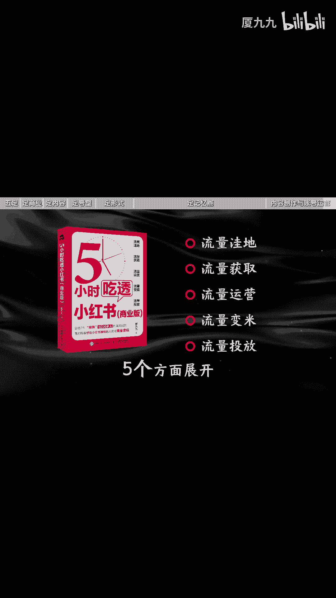

如果你想省时省力的做一个能挣钱的项目账号，这会是一本扎实的百科全书，618限时福利半价包邮。

只要35元，还送三天爆款影，赶紧拍，我是夏九九。

