# 新手小白必看！从新手到高手，跟着这些亚马逊选选品实操步骤来！ - P1 - 鼎哥跨境说 - BV1kitSezEhM

hello，大家好，我是顶哥。很高兴呢今天又和小伙伴们见面了。😊，呃，老样子还是做个简单的自我介绍啊，顶格跨境说专注亚马逊的新手选品，独创亚马逊的新手综合选品法，让你选品不再难。

让你最快速的实现新手亚马逊运营出单，0到1的突破低成本的FBM轻铺翁模式，让你少走弯路少踩坑，谁的钱也是血汗钱，不学习就要被市场教训，学习的目的就是减少被教训的几率。本期分享的呢是和学员一对一实操。

直接拿结果。本期系列都是。因为顶哥这里只注重实操实操实操，咱们没有那么多的废话，直接拿结果啊。底下这个内容我就不说了，它是整个顶哥运营系列实操系列的步骤啊。接下来我们直接开始。哦。啊。

就是那个有有几个问题，就刀影那个我我连我我那个啥连不上，就整那个呃月搜词那块儿连不上，别着急啊，来一下一下来哎。啊，你你没有装虚拟机这个电脑。啊，是不是因为没装啊，就是那个啥，就是那个云服务器吗？

虚拟机。你这个电脑是笔记本。对啊。Brkchi。

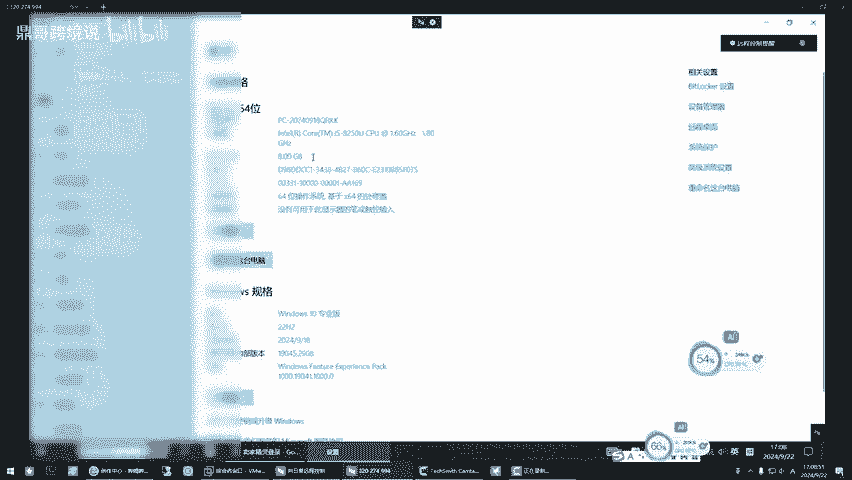

那你跑你不装虚拟机，你跑数据咋跑啊？原来就是没法整的呀，原来从哪跑的？原来就打开这这玩意儿，然后打开这个不就完事了吗？你在电脑上跑的桌面端。啊，对呀，一直都在测试一下，我看我先测试一下啊。

看程序现在啥问题。我都给你录着呢啊，我就怕你忘了。好嘞。Yourさ。还有哥够意思。哎呀，你这每天忙的，你是真忙。别人都出单出的好好的，你这天天忙的。哎，但我发现现在这个智营这块这品现在涨的好像好多了。

是不是啊？我你我以后没事，带你慢慢看啊，你别着急啊，咱们先看我先看一下。

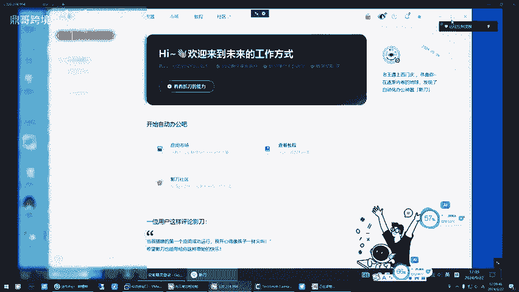

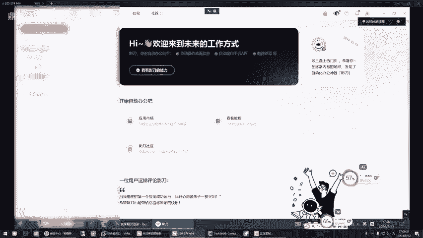

嗯，有没有。能不能用不能用，我就给你更新一下啊，我先看一下。啊，这个问题咱一步一步解决啊。

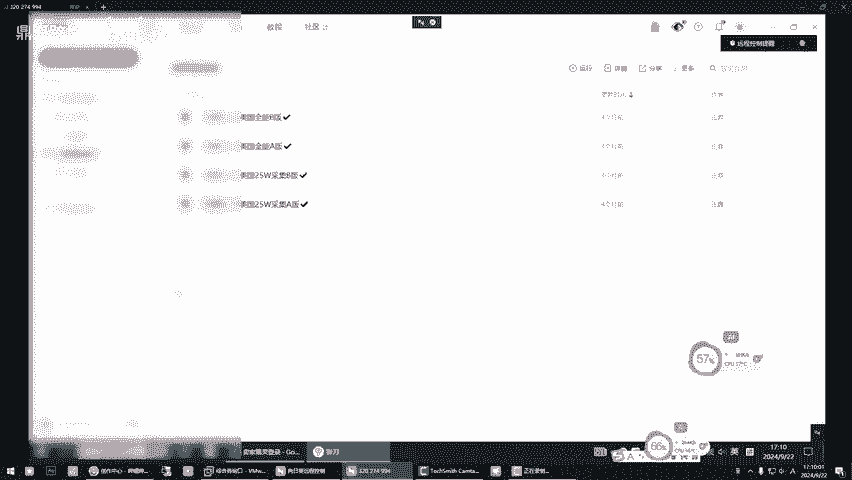

这个是这个是那个。

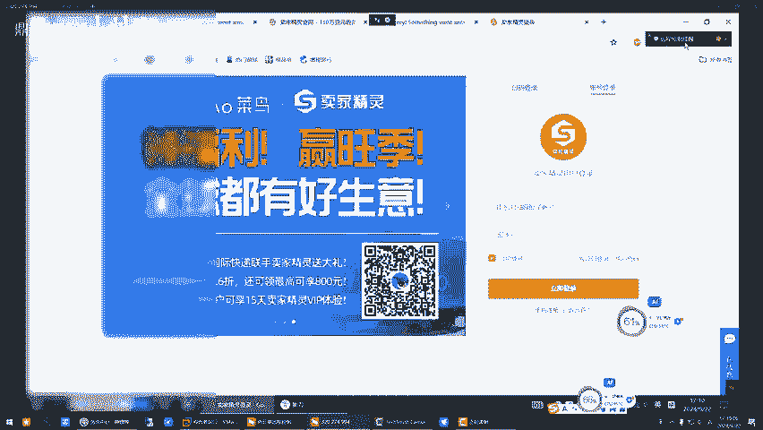

是谷歌吧。啊，对，但是是这样的，这谷歌吧不好使，打啥都打不开呀，你别着急，咱们看一看啊。别着急啊，顶哥给你解决啊，那今天就给你理顺了啊，你别着急。好。我今天再给你讲讲二代选品，现在它不光是一代。

还有二代选品。选完了你就要执行力得跟得上，知道了吧？我然后我之前有有没有给你发过那个视频，怎么找词根的视频？没有没有，我今天给你发一个，不要外传啊，你不懂的不懂的就在那个里面多去琢磨啊。因果后来嘞。

我就老老就给你专门录了一份，就类似于你这样的，就是说每天忙的顾不上的那我就给你录一份看吧，这不这不好了吗？是。

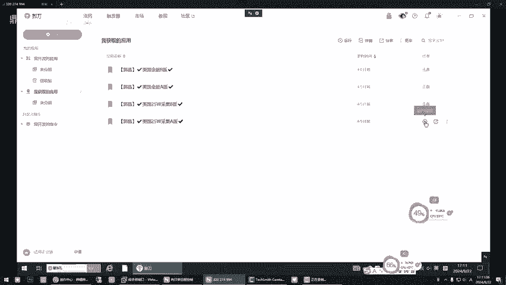

嗯等一下啊，现在就好了，你看咱们先测试测试一下程序啊。嗯嗯，程序没毛病，让他跑先跑下来再说，我再给你测试好。好的，确实好了，我就带你你去我给你讲讲二代选品啊，一代你先让他去，你你你先让他跑数据。

因为你现在里面没数据，知道了吧？我给你讲二代选品怎么搞啊。嗯。🤧嗯。

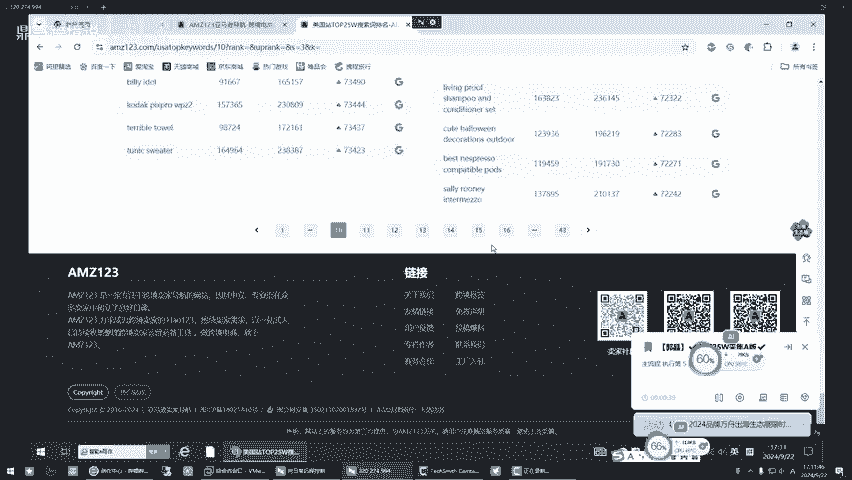

那你没办法，你没装虚拟机嘛，你只能在桌面上搞是吧？

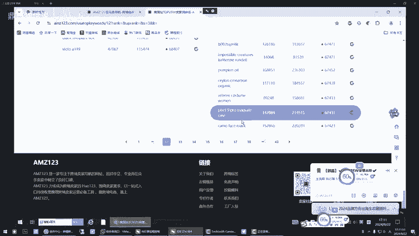

他这个虚拟机得咋整的？我让谁让那个做系统的给我做，是你是不不不不不是他给你装，是我给你发个链接，你主要是原来你那个电脑太慢，你装东西太多。你是装了你也跑不动。现在你重做了系统以后吧，我看看能不能装。

能装就给你弄一个啊。好嘞。嗯。不管干啥，手上都有趁手的工具啊，你才能事半功倍。瑞。你主要你这个工作他特殊，对吧？这个这个这。肯定肯定得先以工作为主是吧？对对对。其实我老想瞅的时间。

跟你聊聊完了给你复盘一下，我安排把你落下。你说你你忙是你忙的事儿，对吧？我。哪个空了，我这得给你复盘一下。忒够有意思呢。哎，你顶哥就这样的人。Yes。嗯。我先给你把程序测试一下，没毛病的情况下。

我这让他一会儿你自己去跑数据啊，我先我给我带着你去把这个二代走一走啊，二代走一走。行啊，你这个变了，又失败，不是失败，它在是你这个路径变了，知道了吧，你不用管你是你这个你看你的路径。

它有你路径和我原来程序的路径不一样，你是ad me了，知道了吧？我一会就改一下啊，这个这个不重要，这个没事啊，这个不用管它，因为它已经已经下载下来了。

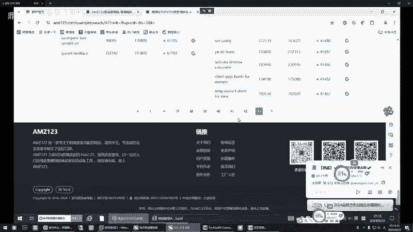

你再把毕业毕业抓一下，一边的下，一边的跟你闲聊呗，这是把该跑的数据跑明白了。

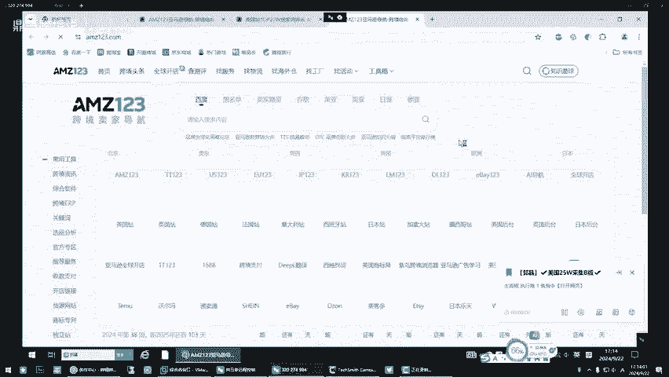

给你讲完了，你就自己跑数据啊，一会儿主要是二代二代的给你把这个思路讲清楚，你有点底子了。你其实我觉得你媳妇做的品比你做的要好一些，我发现。你媳妇真的这不是替你替你给做了几个屏吗？你不是忙的时候不在。

对吧？出差去了。嗯。你就差后面这点东西了，差差做出来投流知道了吧？要投流上了一定的量，投流投了流以后等测试出单。你是差后面这个东西了，我再给你复盘一下，从头开始到这个再走一遍。还有还有一个事儿啊。

就是那个我那个就美元那个卡里边没有钱了，钱不够了，就剩9美元了。然后我今天又存了。对你应该存完了以后嗯，那我存存完了，然后可能是不是还得重新那个重新那个发一下那个卡呀？不是吧。

你充进去钱它就应该能扣得了呀。😡，啊，就等明后天他扣完了就自动就好了，是吧？对。二代的和一代的比，它俩差差在哪块呢？二代的二代的不用你抓数据，但是他数据没有一代的新，二代的是能上手，各有利弊，知道了吧？

一代的是数据多，一代的是数据多，二代的是他是以前抓好的数据。啊嗯。别着急，咱一下一下来啊，别着急。哎，顶啊，那那天我看有一个就是在那个AMZ123里边，有一个好像是什么就自动生成那个图片的那个软件。

AI忘了是啥了，你没听AI吧，是AI吗？是他要钱那玩意儿能行，肯定要钱啊，他要钱的。

先把这个测等一下，再测试一下，这不是A跟B都下来了，对吧？我们在我先把程序给你测试了，程序没毛病的情况下。

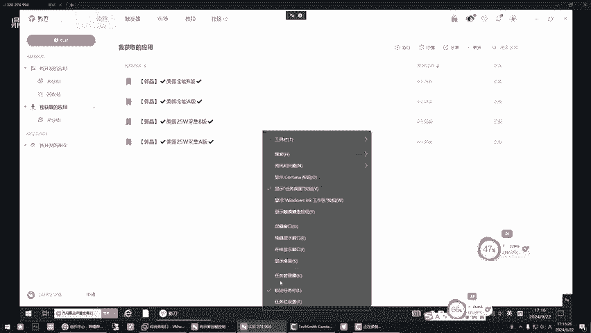

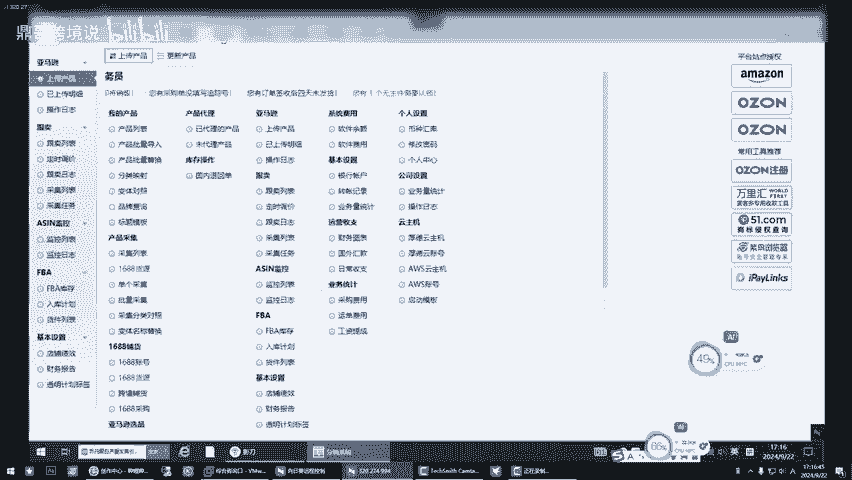

我再跟你讲别的啊，我们再先从A开始测试一下。好，没毛病没毛病。没毛病啊，记住啊，开的时候一定要把这个箭头点到旁边啊，点到旁边露出这个露出这个啊，知道了吧？好嘞啊好嘞，这个咱就先关了，把把把这个关了。

闭不用测试了，肯定没毛病啊。嗯接下来重点来了啊。うん。你这个你看你这里面的，咱们先看你这里面有没有数据。如果有的话，如果有，这是你之前抓的还是老样子啊，咱们把这个FBA的干掉，干掉就没有了。

没有的情况下，我再给你复盘一下啊。咱们是做自发货的，自发货的时候，有些时候这个小类排名一，你到110到100，你先过滤一下，过滤一下数据啊，大概率是这样子的。呃，记住啊，球衣一类的不要碰啊。

球衣一类的不要碰嗯。你像这是什么东？这应该是个季节性商品嘛，可以这，你别管啥，你不用管它啥，就我之前我也教过你啊，我这里不多说了，销量为王的市场找这个是为了找销量为王的市场啊，销量为王的市场。

你可以去前台看，我就不给你点进去看了啊，像像这种小于30的，你有些时候它不准，有些时候它真的是小于30。你看。呃，你这个浏览器是是谷歌吗？呃，应该是谷歌吧啊。YUTR有些我跟你吃，有些时候。

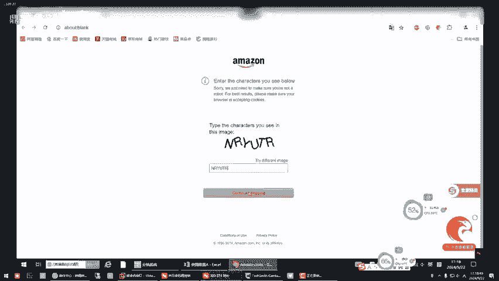

中国大陆。就是今天我再给你复盘一下是什么意思？这个看销量的，你一会儿自己去。呃，就是这个账户你自己搞啊啊，还有这个你自己登录之前都注册过的，还要记住一个算法，这是什么意思呢？举个例子说。

你看这个它不是245嘛，是吧？嗯，245加加这个卖家精灵的销量数据，加欧陆的销量数据，三个合起来，三个总和除以三再除以30天，你大概率能算出它来，30天之内隔几天出一单或者一天能出几单。

听明白啥意思了吧？算出它的平白，先算出它的平均值算出它的平均值以后，你就知道人家人家。

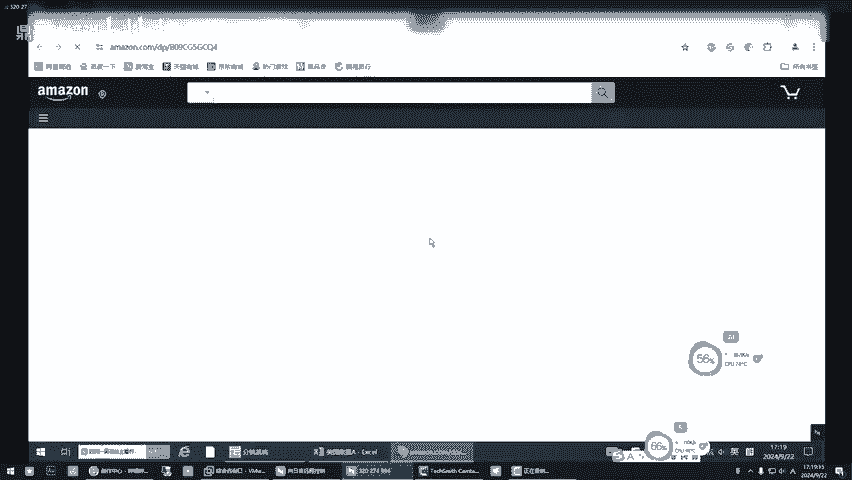

做这个东西几天能出一单，再看他的上架时间。如果人家特别老的话，你要如果你做举例说人家一个月能出90单，是人家能出90单。你就按你就按3分之1算，你一你一个月能出到30单就不错了。第一，因为你是新店铺。

听懂了吗？全都能第二明白了，你比不过人家去知道了吧？所以说计算别人计算别人的销量数据总和除以3除以30天。大概率知道人家一个月能出多少单。这个时候你心里就有，你要控制住自己的谱啊，你如果你做的情况下。

你能出多少单，明白了吗？好，这个方面我交给你啊。第二。那个那个那个插件没装吗？阿里pri那个就找找货源那个东西。

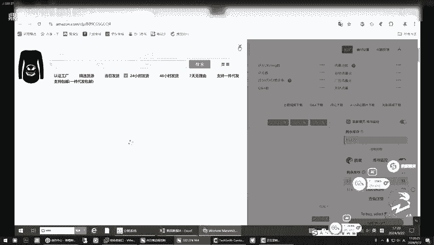

没有阿里就是那个东西啊，这个这个的，你看看啊AL一会儿你自己装一下啊，ALITRICE啊，这个你去装一下1688这个淘购物助手，就是我今天呢再给你再复盘一下就。

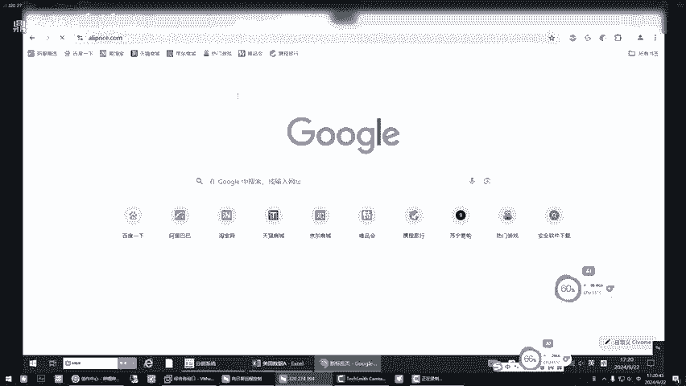

把你容易遗忘的啊容易遗忘的是吧？你。嗯。😊，你要你一会儿下载一下国内用户的，要看他怎么下载的。我这是的浏览器。呃呃，对了，你之前是不是弄过那个那个上网的，快乐上网，就是安全上网，弄过吧。没没弄啊。

就是那个那个那个你懂的，我我不能说太明白，就是那个。是用用安讲那个啊，对对对，是这么个玩意没弄过吗？嗯啊，没没有没有啊，那没有的话，这玩意儿这得国内用户下载，他下载哪去了。我也不知道。

一会你自己下载一下，你的电脑我不清楚把这个下载了好，怎么安装我把这个名拍下来对在这个里头，这不是吗？就在这就记住这个网址就行了吗？啊，我我拍下了拍了，我怕一会找不着。对等一下啊，马上拍下。

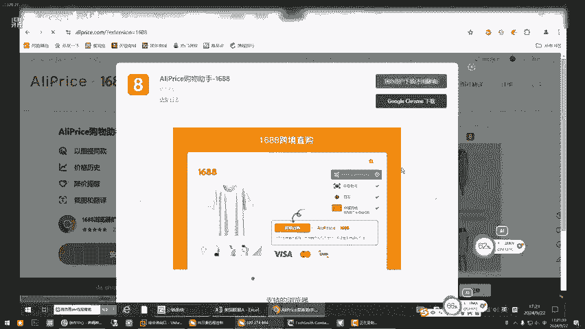

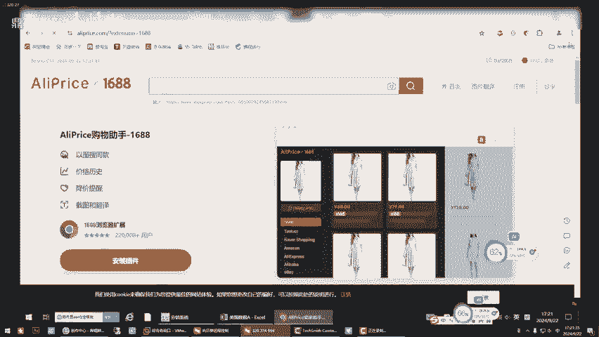

好嘞，继续。然后你在这个扩展程序里面，我跟你说怎么安装它，他不是下载到本地了吗？下载到本地的时候，这不是吗加载这个你就从本地，你在哪下载的，把它解压了，解压了以后把它弄进来，他就安装了啊。

安装了这个时候他不就出来能找货源了。我是不是刚才跟你说了一下。

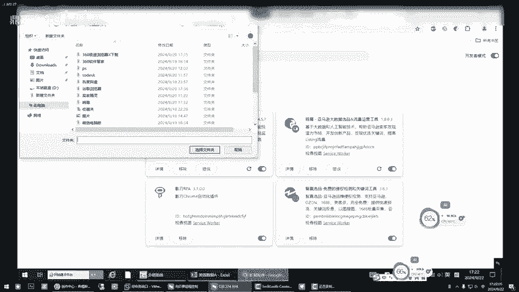

先看对方的销量，大概率算出人家的平均值，算出人家的平均值的时候，你要对模自己，你就按3分之1算谁家的东西，因为你是新店，你按3分之1算，你不用去管别人。如果说。一个品，你做它的3分之1，咱们能做到。

那你10个品是不是一天销量也可以，对吧？你要对你要算的是概率，你不是算某一个点对点的品，知道了？我们不能算那个东西啊，我们不能算，所以说这个方法之前我教过你，你去你像你像这些一会儿你自己把那个欧陆也好。

卖家经灵搞定啊，把这些如果它真的小于30，你直接把它删除掉，你不用看跳过对吧？跳过它，因为你这个数据是有问题的。你是10天前看到没？10天前抓的。

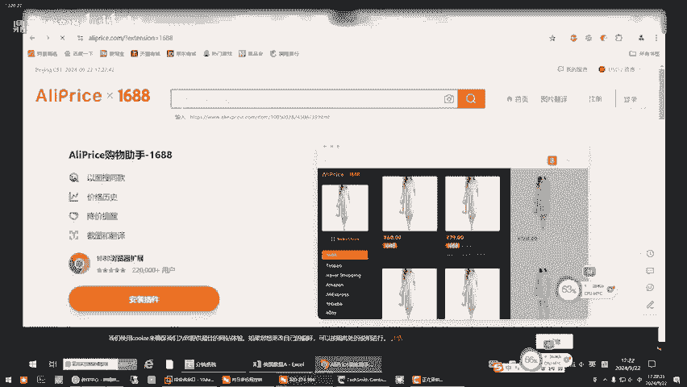

是这个数据的话，我还是跟你清空吧，因为它不太不太新了，知道了吧？行清出了一会儿，你自己重新抓一下哈，就咱们尽可能的搞一些新数据出来，对吧？这老数据没啥用了，没啥用啊。那现在我领着你看看这个二代选品啊。

二代的选品这个位置在这个地方，在在这个地方产品啊，产品这里有个亚马逊选品啊，你看这个选品旺往是这个这个顶哥这里也有外挂也有挂也后面我你如果需要，我就给你弄，不需要的话，你直接用这个直接用这个啊。

如果你这个不需要，你就直接这个这个是怎么选呢。举例说你是自发货，你就点中国自发货，这个你就随意啊变体数越少越好，或者446，对吧？这个不限不限，对吧？你选那个无品牌的是不是对吧？无品牌的。

我给你举个这后面的数据啊，你自己选啊，自己选，但是你看它是不是月销量，这不是有个销量吗？举例说50到100的，然后给你出来，这个对吧？你看这么个玩意儿，它这个是。看这个人有跟麦的。

你别管他别人跟麦不跟麦，你去前台看一下是吧？我还是跟你说过一个话。有些时候你你就是说我们做做这个市场背后的蓝海同类不同款，就是你看为啥，后面我一会儿给你把那个发你一下那个链接啊，就那个找辞根的。

就是举例说你叫郭某某，对吧？全国和你叫一样名字的人多了去了，是不是长得不一样。听明白啥意思了吗？都叫郭某萌明白，但长得不一样，是不是他都叫这么个玩意儿了？你看他的你看他的关键词啊，那我给你举个例子。

你就知道了。我我给你举个例子啊。我们假设啊假设你看我们把它这个复制了，这个我们找到它的主关键词来啊。呃，我们找到它的主关键词。你把我就给你稍微复盘一下就行了，你不需要像一个新手一样给你讲的不需要。

我们我们先把它的主关键词，这个是主关键词，看明白了吗？是吧？是不是啊？OK我们我们先做一个动作啊，你在亚马逊的北美站里面，北美站里面我们干一个动作，你看你搜搜索主关键词。

是不是是不是你看啊啊是不是都用的这一个词，他们都共用的这个主关键词，举例说这个词就叫郭某某，是不是？

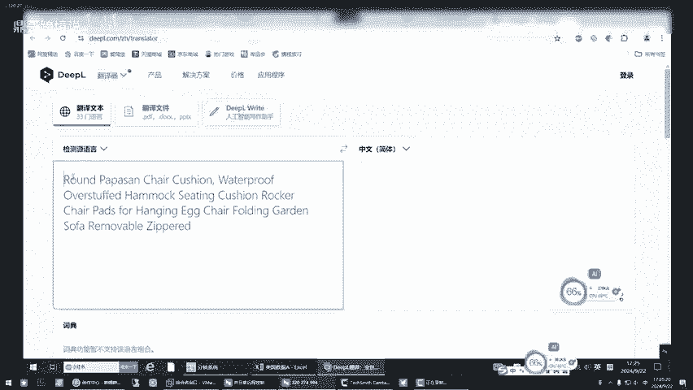

是不是长得不一样，是不是长得不一样，是不是都叫郭某某看明白了吗？好，来，我给你上1688去，我们把它翻译过来，你看圆形这个店是不是我们复制了它，对吧？我们来这里我们来这里。

因为你知道咱们核心的东西啊是金铺里面的头流，咱们知咱们核心的东西啊，因为咱们能做到低成本的去搞这个事情。你这电脑卡了嗯嗯嗯。啊，听到没，你看不动了呗，死了，现在还不动吗？不动你看卡住了。

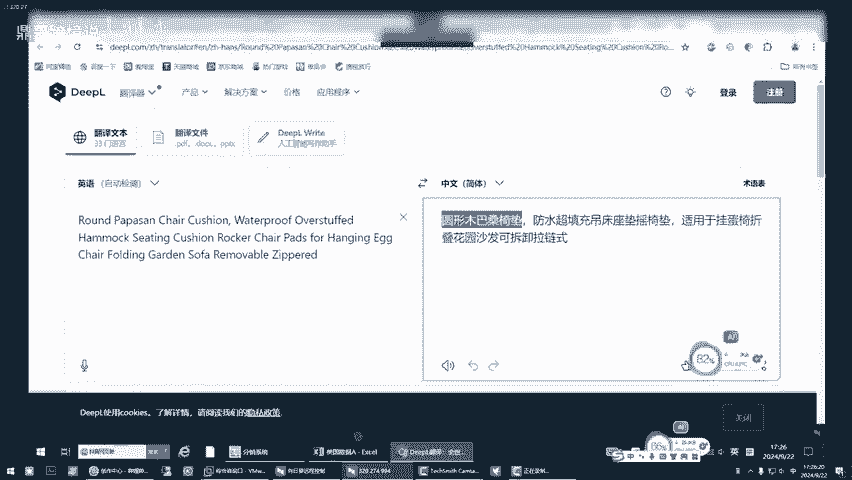

他卡了吗？你点那个AMAMZ123。点那个网站。啊，点开了啊，去1688，这里面有1688。1688出门吧。Well。你看我我因为这个视频里面你就你就记住一句话，你看你看你不咱们把它翻译过来的文字。

你复制了，请问来，我就问你啊。他没有没有上1688主战，1688主战，这个不是主战啊。这个不是不是主战。你就算1688的主战，这个不是主战。这回就行去他的首页主站里头啊。你你你你你你你看。

请问他是不是是不是这么个东西，也叫垫子是吧，是不是对吧？是不是长得不一样？对对对。是不是长得不一样，是不是？对对，是吧？你看有这么个玩意儿吧，它长得不一样。但是你看我们在亚马逊搜索的时候。

是不是它就是这么一个主关键词，一个主关键词都在用这个主关键词是不是也长得不一样。只不过说人家这个东西卖的比较好一些哈，他们也是从没人知道的时候，上了亚马逊，你后来卖起来的，是不是？对对对吧？

你看就是你思维一定要变通一下，是不是这个二代选品你设置了这个筛选。你看举例说一个月内上架了。

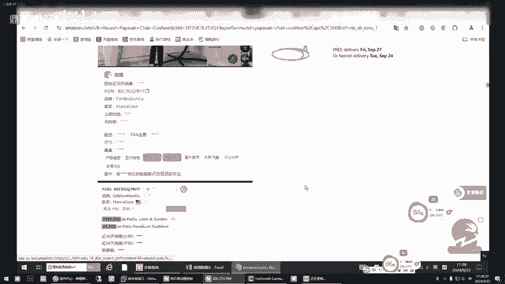

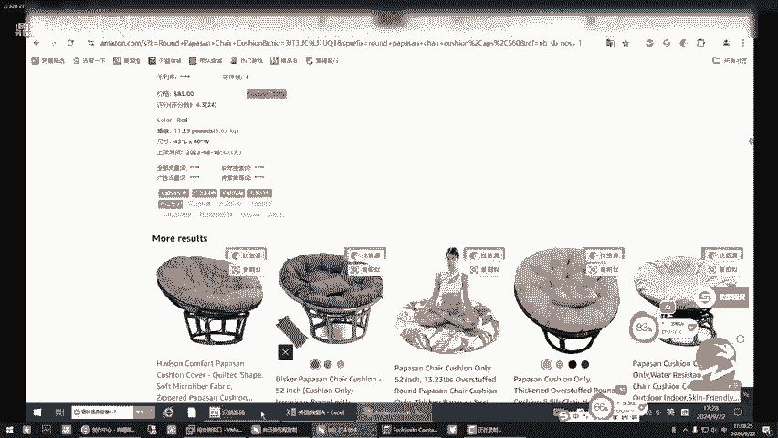

是吧这他这个是一个月内上架的。你是不是很容易就找到一些东西？嗯嗯嗯，他这个是没有这个没有一代，没有一代的这个呃数据芯，但是它比较容易。容易让你看到一些东西。你看人家这上面8天，是不是？你要从这里面看。

销量销销量就不错。那你是不是值得研究一下，是不是这个道理？对对对，是吧，所以说选品也好，啥也好。你第一第一步过关，你要过的是这个，你把这个搞明白了以后，信手捏来的时候，后面的事就简单了。

对吧我给你你把分词学会把头流学的明白点。是不是就坐在那里等出单，把0到1实现了，实现了以后量化就行了嘛，咋有那么难吗？对对，不难，你看我就又跟你从头带你过一遍，你现在缺的是执行力了。

因为你工作这个性质的问题，对吧？你现在缺的是执行力，是不是找个品，这不是这是这类似也也属于那个季节性产品，因为天气凉了嘛，马上就凉了，是不是啊？他才上架8天，你把这个去买也好或者啥也好，把这个登录了。

还有刚才我跟你说的这个把这个数据82三合一加起来除以3除以30，你大概率知道它它能每天均下来出几单了？是吧。这评明白了吗？这个评分这些还不错啊，价格还可以。是不是？对对对，你细细想想复杂吗？对吧呃。

这个不复杂，这个好像给内容也多了，不那个不是不是容易不容易，那个是干啥？那个是到了那个这个列表里面，我们进去筛选。因为它是多功能的，有些时候你记住我们选品，有些时候如果你能耐强，你就可以仿谈。

那你能耐不强的时候，你就要做人家的一个市场，这个市场是，这就是它的市场，你看你点进去是吧？啊榜单，你你看啊你把它复制了是吧？你可以看到整个榜单的数据，你在这个地方，你看选品方法，选那个榜单是不是啊？

你这里新建产品，你就把这个榜单放上去，采集子类目，是不是？你看吧，如果选这个有可能选不到，你知道为什么？因为人家很多都是带品牌的，有可能你一个品都选不到。如果你点了全部它出来的数据，它就有我们是选品。

你不用管他是不是品牌了，是吧？我们不一定要做人家这个品，我们就我刚才我为什么要把你拉到1688上去看去。听懂啥意思了吧？我们可以跟他做叫一个名字不一样的东西哦。知道吧？叫一样的名字，但是不一样的东西。

关键词通用我们在用再用我们自己的头流方法，是不是这个事情就简单多了，我们又没有告诉他事情，我们自己做的自建链接，又没有去跟卖他，又没有去，是不是？对对，你看这些都是这些东西小东西，你看是吧，是不是？对。

哎还有一个问题啊，就是就是1688顶上，就是假如说你在1688顶上选品你买那个选的便宜的那些东西，你问他什么价格包邮啊，什么尺寸啥的，那不愿搭给你，知道没事，要贵点的吧，他我跟你遇到这种事很正常。

你自己估摸着嘛？你看啊他这个产品是不是都有产品图，他产品上面是不是都有尺寸图是吧？你只要知道他的尺寸，哎，我给你举个简单的例子啊，你就是上1688，我告诉你怎么去预估这个玩意儿，它有一个运费预估啊。

在这个地方你记住啊，怎么预估，举例说他那个尺寸图，它是。你你举对说他他那个尺寸图长是55，那你这里就写57，它宽是33，你就写35，高是20，你就写20，为什么让你多两位数？因为你要加外包装尺寸。

外包装其实你这个时候你看他的介绍里面，它应该有一个毛有一个大概量的那个毛重。举例说，它是1000克，你就稍微写1100克是吧？你大概率其实就是这个要这个下来的这个运费，知道吧？他已经差不多了。

他已经差不多。你这个时候只要看一下渠道，他卖的是什么东西，它是带垫的，还是说是吧？你大概率选择个渠道，你就知道它运费多少了，你就已经很清楚，他这个运费上下不会差太多，所以说你你看有些它是衣服它没有。

我们就找那个带垫是吧？特惠带电是吧？不不是你如果做的商品是带店的，你就找带店的渠道如果你做的商品，那不是带店的，你就不用看带店的渠道嘛，是吧？就哪个便宜选哪个对你不是哪个便宜，你要看的是什么？

是它大概率的均值，它的运费的均值。我给你举个例子啊，你看啊，有些时候你问人家说人家不搭理你，对不对，是吧？对啊，你就看他他这个地方，那是大概率有说明的大概率啊。大概率有些时候你也不用看他，没事。

问不出来的时候，我问你啊。他是不是有一个。看见没？嗯嗯嗯上口径这上面的口径高是多少？其实就是一个。口径就是长，就是宽度和长度，它是一样的，高度不一样，知道啥意思了吧？那圆的花盆不就是长和宽是一样的吗？

对它像这个14厘米，你就是101611，你就是13是吧？你大概率知道它的重量，你问他大概率这个东西的毛重是多少，他只要告诉你重量，你也别问他尺寸，你就大概率计算出来它这个运费运费是多少了。明白这意思吧？

二运费咋的，就是就是假如说多退少补呗，就是是吧啊，什么成我，他这是不是假假多退少补啊，假如说我我要还有一种方法大吧。他还有一种方法，就是有些时候啊我跟你说做一个品的时候，绝对说你想做这个了。😡。

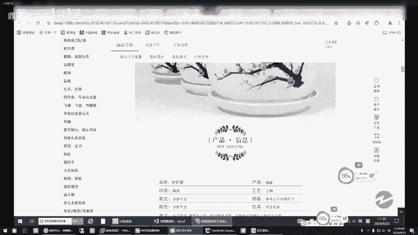

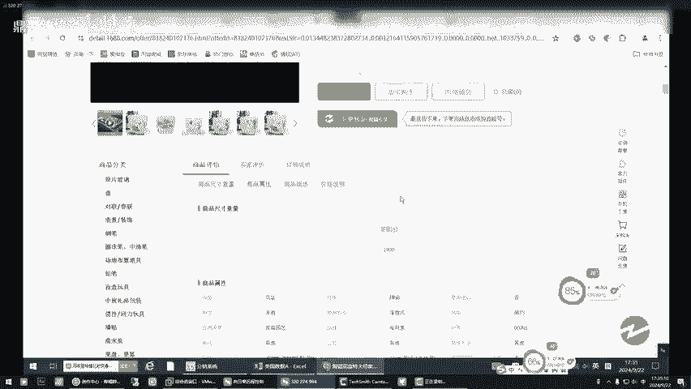

你拿这个图片上手机拍了，上淘宝搜淘宝做的详情页面比他这个要好。你从淘宝上扒拉图片去，你其实东西是一样的，淘宝的那帮人做做的这个详情文案页比1688的要好，你可以把他们图片拿下来，知道吧？

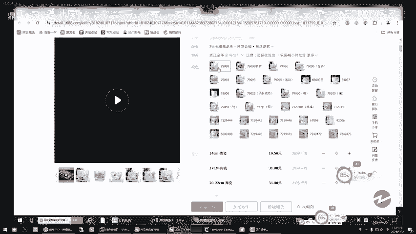

内径这不内径就是长和宽，就这么个玩意儿吗？这是这是高度吗？啊，所以说自己有些时候咱多动脑子嘛，你静下心来多动一动脑子，不就啥事都解决了嘛，是吧？

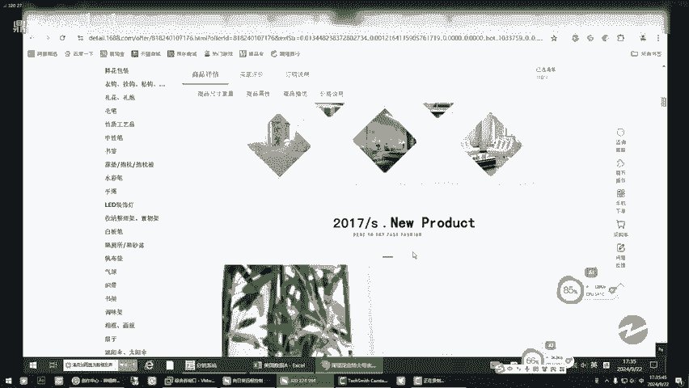

对，是不是，就冷静一下。对，考量一下。哎，这个事情就解决了。你像这个也是他有些时候有些时候你别看它是他有些时候它是能拆装的，知道吧？像这种能组装的东西，你要的就是什么组装的东西。

你要的就是你要看的是它的重量了。你像这个是绝对是组装的，它应该是组装的，你看是吧？你问他这个东西得多重，他是他是组装起来的。是吧。嗯嗯，产品参数你看到了没？看到了吧？

如果它不是组装的这如果它不是组装的整个的这一个，那你就就大件。举例说142146，这就是82，对吧？他这是大的，但但我觉得他应该是组装的，我觉得他应该你看人家是不是告诉你重量了，那这种件只适合走海运。

像这种件它只适合走海运。我是给你举例子来，但不一不一定建议你做这个大件，知道吧？你还不到那个做大件的时候啊。明白了吗？🎼那你别人不搭理你的时候，你要自己学会是怎么去观察啊，大件小件啊。

怎么去观察这个东西啊，是不是说你看这么的，他就稍微来的快一点。你因为你看3个月以内的数据它又出来了，是吧？哎，你可以选100到200的，200到500的的，是不是都有？还是一样，我告诉你。

你不要被眼前的假象所迷惑，你要进去看它这个市场，听懂啥意思，看这个市场，我刚才是不是给你抓了一个市场，抓了一个市场。我们看这个榜单选品库，我们看有没有数据，你看只抓了一个，因为他他没未注册，未注册。

就是说他没有品牌，哎，是吧？月销量这么多，是不是。他未注册。如果说你选的时候，如果说我们抓取的时候，你把这个地方。选择了全部来，我给你看一下啊。你看呢你我们再来一个。你看结果就不一样了，看明白了吗？

你看全部。咱们跳过没出单的，我们再看一下啊，你看一下结果，这个地方数据它就会多了。现在你让子弹飞一会儿，稍微等一等，你看顶哥跟你这么讲，你你今天能能消化的了吧？能明白吧？没事，我给你录着啊。

那差不多啊录着我就放到B站上去了，你也能自己看，知道吧？有些关键信息我就抹掉了，但是大概率帮你回忆啊。啊。看明白事儿了。你得执行力上得去。多实操，选品是第一步，你不管你选到啥品，你最终你要涉及到文案上。

对吧？文案涉及到词根，涉及到给亚马逊A9算法看的，给买家看的两个部分合起来才是一个完美文案。另外，万事俱备的时候只欠多分，这干什么呀？你要投流了吗？你不给流量加持，谁能看见你啊？

对吧别人跟你做一样的东西的时候，他不投流，你投流，你投了流以后，咱们投流能做到很低。投流的时候是不是别人看见你了？如果是同样一个东西，你出单的概率就会比他大一些，是吧？嗯，只要通过这个方法。

我们不断的测试出来。举例说你做了一个一类产品，哪类产品出单多，你这个店铺后面就专门做垂直做这类型产品，别的产品就不要碰了，你就定了目标了。这个时候你就后面琢磨的该申请品牌了，但这对你是个保护，知道吧？

护城河。嗯嗯，他这个流程是这样子的。所以说。这个东西不难，关键你执行力，你看是不是出来了，是不是出来数据了。嗯嗯，对吧？67条记录。这个时候你再他是已注册的我就不用不用管他了吧，我就找那未注册的。

不是你注册，你如果站那悬屏的角，你不是跟麦，你要跟麦，人家的往那搞你。你看我是不是刚才跟你说了，他是不是一个类目热小类，他是不是都是卖这个的，他们是不是用的通用关键词，你你可以不用看他们数据。

你上1688或者淘宝嘛，找找跟他类似的嘛？你上这些品嘛？他只是说这个已注册，只是告诉你，人家在这个国家注册的商标了，你不要跟他做一模一样的对吧？但你可以做这类型产品。

是不是我们选品看的数据是看人家这个市场如何。如果他这个市场都不行，那你去做的干什么，那你看这是看他的销量市场，如果他这个市场不错，说明你进去人家喝大肉，你就喝点小汤也算，记住顶哥跟你说。

就我们做这个东西，我们不要往前面冲冲的前面咱们都是劣势。一个品你不要让他出太多，举例说两天出一单，三天出一单，你一个品能做到3天出一单，一个月是不是十单。举例说这一单能给你带来50到100的利润。

一个月是不是给你创造500到1000的利润？我说的是一个品，你账户里面如果有几十个这样的品呢？交替出单，是不是？对我们现在就是沉下心来养养出来这种品，慢慢的一个店铺养活了，后面做的不错了。

再上第二个店铺或者第三个店铺鸡蛋别放在一个篮子里面，就这样子吧。嗯，有，大概大概好像差不多明白了。对对，没事，我给你录着呢，你慢慢去琢磨啊，慢慢去琢磨，其实没那么难的。你一会儿你一会儿的功夫啊。

你就我不是给你把程序搞好了吗？你把这个这个去跑一跑啊，这个这个是你之前你跟你12号的数据，我都给你清空啊，这个失败的，你也没行行行，失败的删除了就行了，咱不缺数据啊，咱不缺失败的大不了重来嘛？

一会儿你把这个动作做完啊。我今天我就先给你分享到这里，咱录了有33分钟，咱们注重效率，咱们把事讲明白就讲清楚就好了，好不好？好好好，赶紧去实操吧。先这样吧，行，那我我先我先不懂的给我留言就行了啊。

好嘞好嘞好嘞好嘞，我一会儿给你把那个奔驰的那个视频发给你啊嗯。

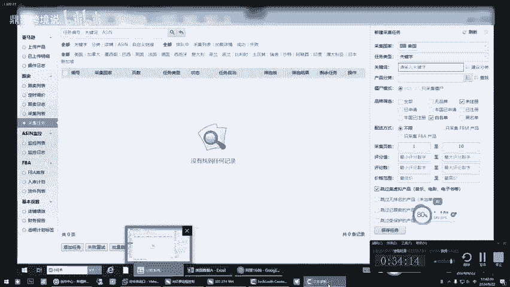