# 无人半无人直播带货绿幕直播带货如何选品起号全流程教学！价值6980的课程！看到就是赚到 - P1 - 互联网持续创业者 - BV13s421G78T

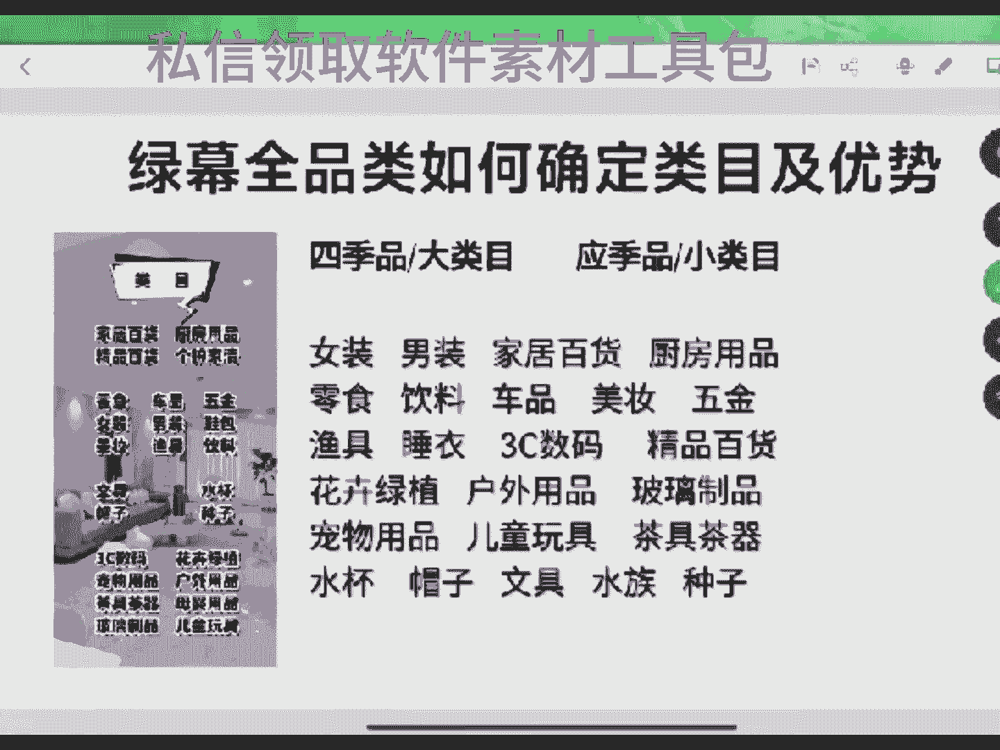

来，家人们刚刚开播。欢迎新进直播间，家人，刚刚开播嗯。来，兄弟们啊。嗯，2024年咱们想做直播带货的，准备开播，没有开过播的啊，可以来试试这种绿幕直播啊。咱们这种绿幕直播边有一个最大的优点是什么？

就是亲主播。我们对主播的要求是比较低的。兄弟们，如果说你们现在是个新手啊，刚打成做直播带货，没有方向没有思路的，你们可以选择这种直播，知少这种直播间对主播的要求比较低。

你一个新人小白上来去做直播带货没有主播能力是不行的啊。这种直播员对主播的要求是比较低的。兄弟们啊，你们可以自己选择一下好吧，新进直播家人们如果说你们现在是个新手啊，可以来试试做这种绿幕啊，绿木多品类。

对主播的要求比较低，单品类对主播的要求比较高好吧。然后呢，就是这种直播他的优势就是新主播，但是他有个缺点是需要去拉时长的。兄弟们，如果说你们现在做这种直播间不知道做什么类目的。

可以把你们想做类幕打在公屏上，我来跟你们说说啊，当下绿木直播间做什么类目比较合适啊。兄弟们啊多品和单品它的有它是有区别的。单品的话，我们吃的是单爆品，单爆品的话。

你只要是这个产品当然有热度去根的话都能跟出来一点结果。多品它不一样。多品的话嗯一般的情况下，很多类目是比较流量是比较平均的。所以说根据我们自己的一个情况去选择，好吧，家们。新人小白上来不知道做什么类幕。

可以把你们想做的类幕打在公屏上啊。家人们啊，可以把你们想做的类目打在公屏上。2023年2024年想做直播带货的，没有方向，没有思路的啊，试试做这种绿幕啊。类幕直播边间最大的优势就是亲主播。

对主播能要求比较低，咱们没有那么重的主播能力，话术节奏比较轻，你道吗？兄弟，我们虽然说是亲主播，但不是说让你们在直播间睡觉啊，这点咱们要清楚啊，好吧。不知道该做什么类目，帮你们选做类目打个公屏上啊。

是新手的啊，没有方向，没有思路的，不知道做什么类目的。家人们看看我上面的类目。新人小白上来做的最多的一个类目，你知道是什么吗？就是女装了。因为女装是所有平台里面流量最大的一个赛道。但是女装这个赛道呢。

它虽然说流量大，但是他在任何平台里面，它都有一个在抖音的个平台吧，它有一个最大的缺点，你知道是什么？就是退货率。抖音的缺嗯这个直边里面女装最大的一个缺点就是退货率了，它的退货率能达到50%到70。

一般打女装我们打的是有分几类的，比如说大龄对不对？就是说50加的这一类的，对不对？比如说30家，主打的是30家，其次是50家，一般就这两类人群。还有那就是大码，一般打女装的话就主打这3个。

像们这边家人们，如果说你现在想做女装的话。一般是以这三个为主去做的，是吧？但是女装它有一个很大的一个缺点，那是什么？就是退货率了，女装退货率能干到50%到70%。如果说我们是做30家的这个服装的话。

多品类的服嗯打的话，然后它可能能干到百分之。最高是能达到70%。目前为止来去说的话，女装如果我们是打了一个嗯。打完个。50加女装的话，退货率是最高能干到60%。但是刚开始去做的话。

大部分是以70%为主的嘛。所以说咱们这边所有兄弟一定要清楚，一定要明白一个点啊，想做服装类赛道，想做女装类赛道的，它是可以让我们新人小白入门的。但是女装它有一个最大的通面商对吧？就是它费号。

女装是比较费号的家人。新人小白上去做直播带货一定要清楚啊，这个赛道他是他是没有办法说是一个账号打的很长久的，对不对？咱们很多人做直播带货，财客都想的是我一个账号能不能播的时间久一点。

我能播个一天播个两天，播个三天，播个10天8天的，对不对？这个财客是我们很多家人们去做这种女装的一个感觉，但是我跟你们说实话啊，兄弟们女装没有办法播长久，因为他的退货率和他的口碑分。

他是没有办法让他播长久的。退货率多的话，也会影响直播间的流量，对吧？抖音的一个商品的流量是息息相关的，它会关联到我们直播间，还会关联到他们的小店。所以说咱们直间所后兄弟一定要清楚啊。

如果说你是一个新手的话，刚打算来做直播带货的家人是个新人的话，你知道吗？嗯女装是适合于新手小白入门的，知道吗？它适合于新小白入门，为什么呢？因为任何的平台女性的流量是最大的他都占比在第一。

服装类的流量本身就是第一，但是就是因为退货率太高，可能导致他不好去做一个长周期的账号，我们自己学员里面去打女装最长的账号也才跑了多长时间，也才跑了有个3个多月的吗？这是很久，这是银算我感觉跑最久的了。

好吧？还有兄弟们，如果说你们是女装去做单品的，等通过那种视频去打单品的那种女装，真没利义，知道吗？为思吧？因为单品的退货率太高，你知道？你打百货类的单品，或者说打应季的单品，它都没有这么高的退货。

一般退货是在3%单品的退货率啊，尤其单帽品的退货率一般是在30%。但是女装的单品的退货率是能干多少，能干到90%的最高。所以说尽量不要去打女装的单品，女装单品是不正义的，它是绝对会让你们贴的，你知道吗？

如果说你是个新手的话，你现在刚准备做。兄弟，我跟你说实话，你打女装单品这没意义。不知道做什么类目的，可以把你们选多类目打在公屏上啊。类目一共分为两种，一种是四级品，一种是应急品。

四季品就是一年四季都能去播，那道吗？这是四级品。然后应急品是应急品是呃它是这一个时间段，它可能有大流量爆发，这叫应急品。如果说你是一个新手的话，我不建议你现在去做四季品，咱们直边家有没有人想去做家居。

想做厨房的这类的家居厨房临时车品这一类的。兄弟们有没有？我说家居也好，厨房也好，临时也好，车品也好，这一类的类目啊，他现在是比较难做的，竞争力比较激激烈。你们没有发现你们有没有发现现在家居没有大账号了。

对不对？家居现在没有大冒号。新人小白上来，我们任何一个新手上来去做直播带货的话，首选的几个类目是什么？就是家居厨房临时测品，包括女装，这是我们选的最多的男装可能要次一点，没有那么选那么多。

但是新人小白上来做最多的就五大类，就是男装女装、家居摆货、厨房用品，包括临时还有测品，4月1料管控一段什么时候能恢复，很难恢复。兄弟，至少本身前段时间稍微松了一点的。但是最近这段天又演了。

就这两天又演了，严的超厉害的，可能就目前他们来说的话，可能要等到618结束了。过好每一天6618结束之前，你能等吗？618结束之后，最好也要过一个星期。那如果这样算的话，就要等到6月底了。嗯，没办法说。

都这两天又超严的，过好每一天能帮我点个红心吗？过好每一天，咱们直播间家人。嗯，你还想去做林人吗？我跟你说，至近这几年你做不了，很难跑的啊，没有给主播点红心，能不能帮我点个红心啊？感谢每一天的红心啊。

分裂。老老实去做，你去做一个正八经的那个吧，做一个正儿八经的赛道，也比那强真吗？做真人吧，感谢欧琳玲帮我点的小红小心啊。没事聊一聊，兄弟们想做什么类目，把你们想做的类目打在公屏上。

至少类目这一块我还是比较熟悉的啊，因为我已经做三年了，相对来说三年的话有很多类目我们自己都跑的，懂吗？跑的还是比较多的。先从小白上来，我给你们说，我给你们分析分析类目好吧，兄弟，你们想做这种直播的会。

一定要学分析类目的。现在准备转到其他平台了。兄弟，我跟你说实话啊，你听我的，你信我的，你知道吧？抖音你都做不了，你别的平台更难做，知道吗？嗯，你知道不？这边你的做不了，别的地方你更难做。

你信我的真的啊不套路力，好吧。因为啥，因为这边的流量最大也最完善。别去做毛手，知道吧？记住啊，为啥你知道吧？他那边现在扣款扣的厉害，你不要听他们说的那边，我跟你说实话，我们都不从那边做了。

那么我们团队里面有人过年的时候玩玩那边前才克是还好，现在那边。无缘无故扣款扣的太厉害很了。所以我不建议你去玩，那么？你信我的就可以了。你要不信你自己去试一试。你要想做林人的话。

大概率你一定选择的是那这个平台。但是我跟你说。他是能让你打出来结果，那你跟品的话，跟树材跟品的话，它容易让你出来结果。但是你后期问题太多了，真的啊。没有给主播点红线，能不能帮我点个回线啊。

有问题的可以在公屏跟主播说啊，把你们想做的类目想做的赛道打出来啊，想做类目想做的赛道打出来啊。老老实实去打抖音吧。互联号可以。不连号的话，兄弟封号封的厉害。点封号啊。没有不能的，怎么？

他至少那边最好的一个点就是它可以马扁，它可以套住用户，知道吧？来，兄弟们接着给大家说啊，新手小白上去去做直播带货，你知道吗？就目前为止我给你们说说类目啊。

女装这个赛道是抖音里面做新手里面人选的最多的一个赛道。因为很多那个交互团队很多做嗯这种直播带货的，他都会选择女装出切入口让你们去做，因为它容易见到结果，女装是比较容易见到结果的一个赛道了。

但是呢女装有一个最大的问题是啥？就是他退货率太高，他的口碑分稳不住，所以说导致了我们的账号可能比较费。然后但是它流量大，他就这点好处，那道吗？尤其是现在打棉麻棉麻当下的流量还是可以的。

你们可以去试试做棉麻嘛，棉麻的流量还是可以的，至少目前为止嗯棉麻正少在前段截间我都刷了过，有2000人在线直播间了，你们要去布局它的话还是可以的，但是棉麻还是那句话没有办法播长久，知道吗？

女装没有办法播长久的原因是有两个，第一个就是他的退货率。嗯，三女装一共有三类打法，一个是年轻人就是30加的人群，对应的就是T恤一类的，一类就是棉麻。它对应的是50加的人群，我们叫他大林。

那么还有那叫大码女装还能去打一类人群叫大码，就是那种胖胖胖的那种胖胖的那种人穿的那嘛？所以说一共就这三类，你们可以根据自己去选择。但是嗯年轻人去打的那一种啊，就是说30加的那种啊。

他的最高退货率是能干到50%。嗯，50加的是能干到30%呃，760%的最最高退货率。那个大码的退货率相对来说会比他们低了一点点，那么会比他们低一点的。这是女装。但是就因为退货率太高，他的口碑说他稳不住。

导致了他账号没有办法播的特别长久吗？他没有办法播的特别长久。这是女装。但女装不管是再怎么说，他也是第一人群，第一流量，所以说做的人很多，有很多人都会推荐你们去做女装，懂吧？男装呢要比女装强。

男装的退货率是在30%左右。那么它上下浮动。但是男装它有一个好处是什么？就是他的账号可以播长久。嗯，一般情况上是春款夏款和那个嗯夏秋款和冬款，它是属于秒内的。你们现在打的话可以能打到夏款，打到秋款。

秋款之后你要转款，转不好的话，账号容易废掉，吗？嗯，你现在播男装的话，其实我感觉当下男装的流量和还是不错的。因为男性嘛男性购买的东购买衣服也多，并且男性没有那么多事儿。他买完之后他没有那么多事儿。

这点是他的一个优势，知道吧？所以如果说你现在是刚准备去做的话，可以去试试男装。嗯，男装就算是你们去打战你打不出来，你打搜索流他也能玩的，只是卖不了太高，对吗？这是一个缺点。男装做的也多，好吧。

但是他排在女装下面了，还有就是像家居和厨房的，家居和厨房兄弟们一定要清楚啊。不管是家居摆货还是床房用品，它都属于什么，它都属于是百货类的川品，那吗？百货类的商品。我们打家居是家居和百货两个商品去卖。

我们打厨房是厨房和百货两个商品去卖，那么？你一定要把你的人群打的极极致，你不能乱。今天上午点下复盘的时候给咱们那里面有的人今天上午中午拉场直播的时候，有人来复盘的时候，当时都看到他们的品。

他们的品打家居的产品不行，品都没有选好，那么？牌品家居的商品啊，你现在要注意人人货上注意的很重，你的牌品是一定要排好的，选品和牌品不行的话，你的直播间拉不起来的。他一个打家居的直播间。

他那种家居的场景图，他拉的品是什么？是以百货是以是以厨房用品为主的图，还有那个三一数码的图，嗯，三一数码的产品和那个厨房用品的场品。

所以说产品是非常重要的那么这是家居家居一般是以家居和百货两类商品去穿的。我们前面十个几个品啊，一般是。小百货为主，但是小百货不是让你去用那个那个去做，是小百货怎么？这是第一。第二是什么？

第二就是以那个呃家居类的小件，比如说凳子啊，像那个万向龙的椅子，兄弟们包括了一个嗯鞋架，全身镜嗯等等这等等这类的这是家居的一类的商品，是吧？这咱们这边说兄你要清楚的啊，感谢兄弟们的点赞啊。

这是家居的一个商品。但是如果说你们是做什么？如果说你们是准备来做家居的那人货场从选品这一块你要扣的细节是非常多的。好吧，因为家具的赛赛道做的人很多，所以说相对来说是有点卷的啊，兄弟们。做的是有点卷的。

好吧，还有就是什么？还有就厨房用品了，厨房用品是属于是什么？是严属于百货里面的一个商品。一般打厨房用品的也是百货和厨房两类商品串在一起的。比如说我是用那一个厨房的小家电和锅碗瓢盆去穿辣子的。

但是厨房这一块，你们要注意，它是有两类人群的，家居是没有节类人群的，厨房是有两类人群的，哪两类？第一个是30家，第二个是50家，懂吗？它30家和50家对应的商品是不同的。

一般50家为主的人群是以消费那个锅碗瓢盆为主，30家的人群可能是以家电类的为主，知道吗？就是说像电饭煲电磁炉、微波炉啊什么这类的为主多一点，50家人群大部分是以罐碗瓢盆和小小百货为主。

所以说你们自己去看。如果说你们前期成交的商品是以什么罐碗瓢盆为主的话，那你后期肯定是要往招商面调的，如果说你是以小家电为主的话，你你后期要往上块调频。咱们直边所有家们一定要明白啊。

多品类的直边后期是要调品的。前期看你的主品能力。后期是看你的调频能力，懂吗？兄弟们啊，这点要清楚啊。临时的这边就不用说了，临时这边面一般就只有两类人，哪两类人呢？第一类是25，第一类第二类是30。

一类是年轻，一类是那个但是都是女性为主。但是去年去打临时的直边，我们自己看过一些后台，临时这边里面有一些有一些人他认是打的什么，他们能拉到50家的人群，那么能拉到50家人群。

但是毕竟是个例临时拉50家的人群是比较少的，就目前为止，咱们这边说过兄弟，我跟你们说啊，这里面所有的赛道里面，我只见过两个赛道，他拉入大龄人群，一个是服装类的，一个是厨房用品类的，他们大龄人群多一点。

服装类的咱就不说了，你又打大龄的对不对？你像棉麻的衣服和那个商务商务polo衫，还有就是老年人的那一类的，他是他有点年龄大的，对不对？然后厨房用品，我们去年我们自己的账号包括学员的账号。

我们看到过有很多这种账号都打的什么都是50家的人群。如果说你是做厨房用品的，你这边面拉入50家人群了，一场直播还能有成交，兄弟不要去。记住不要去改力的人群。有很我记得是啥时候，我记得看到一个学员。

他跟我说的是他说他厨装用品的直边面50家成交一场，直播卖几K，他又把他给调了，他把他给调了。我说你调了干嘛？兄弟，你调不是把自己调坏了吗？你人群是真的，出装品那50家人群真的。

但是临时这个直播间去年也有一些账号个别账号，我自己看到后台啊，兄弟们。个别账号他们达到了50家的人群，但是他是小利，那个例那非常少，咱不能以这个少的为基础去说，对吗？所以说咱们这边说我说你要明白啊。

你看吧？嗯，做零食的话，大部分是25和30家的人群，都是年轻人嘛，一般是以这消费为主。但是呢临时临食这个赛道相对来说是有点卷的。相对来说是有点卷的，他没有那么大的一个那个。嗯，它的竞争也算是比较激烈的。

你做零食的话，你要一定要有一个考虑，综合的考虑啊，兄弟们好吧，是新人的啊，一定要清楚这个点啊。不知道做什么类目，把你们想做类目打到公屏上啊，饮料是属于临时下面的附属赛道了，但是临时打的是以女性为主。

饮料大部分账号是以男性为主。兄弟们，但是现在啊，如果说你们不知道做什么类目，可以去做做饮料去试试。为啥因米饮料现在好起。饮料现在是比较相对来说是比较好奇的，为什么呢？因为饮料当下流量是很爆的。

从5月5月10号左右吧，应该是从就从5月开始了，5五一过后，饮料的流量非常爆。兄弟们，你们可能不信，你们现在我就目前为止就这一个星期之内啊，就这一个星期之内。

我刷到的饮料账号里面有上千人的几千人在线直播间他至少是我刷到了5个到10个之间了，不同的账号的吗？所以咱们这边说兄弟要明白了，饮料当下的流量是很爆很爆的。你要是真的不知道做什么内目，兄弟，你做饮料。

那么？因为为什么说饮料爆呢，是因为饮料已经到应季时间段了，他已经到应季时间段了，现在这个料外面的温度已经达到30多度了，很多人出去转一圈，感觉很热，这时候他都想喝杯冰的凉的。

他自己也喜欢在家里面去囤一点，对不对？我们买的东西都往家里面同一。所以说当下如果说你们不知道打什么赛道，可以去试试做饮料，饮料这个赛道还算是可以的，好吧。你包括什么，你包括车品啊。

嗯车品这个赛到咱们直播间里有没有人做的，有的话可以给主播说一说有没有人做车品的啊，饮料文块栏饮料文块不难饮料它因为它的退货率很低的，它只有百50的退货率，它吻块难什么热心仓。

一般稳号男的赛道一般是根据什么？大部分是跟的吻号稳不住，一般是咱咱就说四点啊4点好吧，啊四点。第一点就是你的你被举报的概率太多了，让你的账号掉层级，然后你稳不住，违规举报太多，这是第一点。

第二点就是你的商品的投诉，然后商品的品质不好，商品的投诉很高，商品的退货率很高，它导致的像服装类的账号为什么稳不住，就因为服装类的账号，它的品退和他的那个中差评，还有就是他退货率而导致的。

你发现女装的账号稳不住不就这么。还有就是第三个就是你的话术中出了问题，你可能不好吻号。最后一点就是你的数据螺旋做不上去。但饮料不会饮料的话，他的退货率只有百5，它只有百5。

所以说饮料的账号相对来说是比较好稳的？你们可以去试着做饮料，但饮料有个很大的缺点。咱们直播边兄弟们想不想知道？饮料有一个很大的确认，你们想不想知道？兄弟们。你那个校长你知道是啥么？佣金有点低啊。

百50左右的用电。有点低了。系啊。但是就目前啊这里面所有的赛道啊，兄弟们这里面所有的赛道。最好起的就是饮料，当前为止最好起的就是饮料，好吧，饮料是属于应级品的赛道，当下流量在爆发，在递增的一个赛道。

它现在流量很大嗯，它每一天的受众人经很高，知道吗？你们现在去刷刷饮料直便，你会发现如果说你们是做类目的，已经做了一段时间了。那你现在刷饮料直边，你会发现一个点那什么吗？

就是当下这段时间饮料直间里面几百人的上千人的几千人的，你能刷到很多，就目前为止我自己去刷对标饮料直间的时候，我都已经刷到了有个5个到10个了饮料我们4月份都打了，我们4月份打，但是那时候我们没打爆。

那时候平台的饮料流量还是一般，我们一场直播只能卖两三个，然后就没有做了，整么免也拉不了拉不了多少人，当时没有拉多少人。所以说最后这个账号咋说呢？嗯，最后当时没补了嗯。没播了，但是前几天有一个学员。

他是播影料，他在原来老学员了可老了，那么？去年上半年的时候，他说报名可早了，前几天在我直播间里面啪一趴，就应该是3天前吧，我这老号重启第三场。他当时说的啥？

他说他饮料的账号呢也他就听到我说饮料他就做了嘛，前天的时候是卖了9万一场直播，然后昨天是卖的是4个W，今天是卖了3个W。所以说饮料的端下是好起了，好吧，可以去试试做饮料。兄弟们啊。

如果说不能道做什么类目，可以去试试做饮料啊。好了。还有就是车品了，车品这个赛道嗯，咋说呢？它也是属于四季品，也是一年四季做的最多的。

也是很多新人小白上面做的最多的一个类目之一的车品车品的佣金率还是可以的，能达到15%到18%左右。现在就说到手的他没有原来高了，原来车品的话，如果说你的品选的佣金费要选高的话，你也能达到20。

但是账账号你推流后期是比较难的。你推流是比较难的对吧？所以说咱们这边所有兄弟一定要明白啊，车品你们也能做啊，车品车品相对来说还是不错的。很多人都会选择去做测评，好吧，然后美妆这个赛道佣还是可以的。

美妆是能力达到20%左右的佣金的，对吧？做美妆的人也是比较多的，明白吗？但是美妆现在好像口味分也不好稳了。美妆比较吃产品的介绍啊，吃主播对产品的介绍。咱们这边如果说有女士的可以去试试做美妆，那么？

男士去做美妆，你对产品不了解，你前期要熟悉商品熟悉的太累了，然后五金这个赛道也可以。五金的赛道流量也大，它是属于4级品的，它的流量也大，你们可以去试试做做5金。那么？

我不知道咱们直播间家里有没有人去做五金的，可以啊，他可以的，你包括渔具啊这一类的都可以。睡衣现在流量有点下降了。睡衣我们播的时间有点早，我们是4月份播的睡衣到现在这现在这段时间流量它已经有点下降了。

那么咱们这边家人们如果说你们现在想做的话，不要做睡衣了啊，睡衣不好起了，那么。因为正经的打事宜的多了，就面临着一个抢调的结果。嗯，所以说瞬银现在有点刺，好吧，是新人的啊，如果不知道做什么类目的。

可以跟我说一说，把你们想做类目打在公屏上，咱们相互聊一聊啊，小得们啊，好吧。个人做什么啊，你个人的话都可以去做呀，会不会红啊，飞呀，你说做真人的不飞什么，做真人的不飞呀。你要是打零人的这几天的话。

你说肯定会的。因为我自己身边都已经看到很多人飞了。那么这两天查了紧啊，你要注意点啊。嗯，有人说是618到期来的那么那你自己注意点就可以好吧？你要做真人的话，我们做真人的话，他就不会飞。

个人做什么你妈阿咪，你是老手还是新手啊，你起不来号。你打你做直播多长时间了？我说说你做几个月了？啊，摩阿米不知道做什么内目，把你们想做类目打在公屏上，好吧，我跟你说啊，摩阿米。如果说你现在起不来号。

你是个新手的话，你去做应急型的商品打饮料吧。你听人券吃饱饭，记住这句话，知道吗？我至少那兄弟，我天天在直播间里面去，我在直播里面去说的时候，那我肯定是觉得这个流量好，我才去说的。

如果说当下这个赛道流量不好，我去说他，那你最后去做的时候，兄弟。去年起来两个，现在打不起来了。去年啥时候打的打的什么赛道，能起来两个，能前两个还算不错啊。那你去研究研究，应该也还能起来啊。实在不行的话。

就去进修一下嘛，去找一个人做一个payal，做个答疑带带你不就可以了吗？嗯，兄弟。找人做个陪保，做个大姨去带带你不就K了。妈阿敏兄弟。女装的哎呀，做女装女做饮料，女装和饮料一样，都是属于应季品。

女装你要是赶着应季品的时候去播的时候，你都能起来。因为你要感觉好比说春款夏款、秋款、冬款，你任何一个点去播的时候，它都能起来，你要现在你去播棉麻里还有概率去起来，你现播饮料你也有概率起来。

但你这种起来是稀里糊涂起来的。因为你这边里面上的商品了，你把你样的品把它上过来之后，你的直边这个商品它是有爆品支撑的，爆品是自在女装，它可以让你的账号直接稀里糊涂拉起来。

可能你自己都不知道自己为什么拿起来，你拉起来了，懂吗？这这。所以说兄弟。毛阿咪，如果说你现在对这个服装类的这个赛道不了解，对不对？你对别的赛道不了解，那你就只能去做印级品啊，真的稀里糊涂。

你肯定是稀里糊涂。你没有任何打法玩法的思路，你怎么做起来，你想想对不？你问阿兄弟，咱们这边说兄弟们，我也不套路你们你们如果说稀里糊涂绿木这种这边，他就是容易让你们稀里糊涂做起来。

但是当你起步之后入门之后啊，你一定要干嘛，一定要干的事是一个就是一定要去增长你们的见识，一定要去学习，那么一定要学习的为啥你要做的就是在这一个在这种直播这个大环境之下，你要做的是研究他的东西。

到最后我能起的概率会多一点，对不对？你刚开始你有你有那个运什么气，然后直接上来起来了，那是那是你自己但是你不可能一直啊你要不了解不学习了，你不知道他懂他的底层逻辑的话，你告诉我你怎么过，对不对？

学一学吧，了解了解底层逻辑，他对你来说还是有帮助的啊美女。敏是男的还是女的？没有给我点红心家，能不能帮我亮我想想一下，有问题可以在公屏上跟主播说，把你们的问题飘在公屏上好吧，是新人的。

今年不知道做什么类目的，把你们想做类目打在公屏上男性吧？可以学吧学吧学直播带货以后会越来越严谨的。兄你在我这边咱不套路你，我不跟你说那些说那些简单容易的事，如果说你想做的长久他就没有简单能力的。

如果说你只是为了一时那你当我没说那么如果说你是想长久的从这上面发展，那你是客期肯定是要学习的你不学习是不行的。因为每一个人都有每一个人的一些玩法和一些对运营的一个见解。你后期要学的就是运营的能力。

你是个人自己在家里起号的话，你就是运营型的一个主播运营型的主播的话，你肯定是要分析直播间的，对不对？你能起为什么能起靠什么你的逻辑是什么，你的流量把握是什么，对不对？你不能起你不能起点在哪里。

你哪个地方做失误了，还是你哪个地方出现问题了，这些都是你要去了解的，你不了解能起吗？所以说想把直播带货做的完善的话，你后期是肯定是要去走长久的，对不对啊，你包括现在你现在就是现在里面所有的类目。

在里面所有的类目，咱说难听点的，对不对？当下做的最当下最适合你们做的就是饮料，饮料相对来说流量大一点。你不想做饮料的话，我就建议你做小类目，拿小类目呢？五金，然后绿植户外玻璃。嗯。

宠物用品、水杯、帽子等等这几个查一查去，下半年在做文具也是下半年在做，懂吗？你自己去看一看，现在所有的类目里面也就只有什么，也就只有这个当下这车所有的类目里面也就只有饮料流量最爆了，没有特别好的类目。

现在。平台越来越严谨了啊，我也想做个特别好的类目，但他哪有那么多好类目了。单品女装兄弟，刚才我说了。谁做那去，我跟你说，单品女装。狗都不做啊。知道吗？除非你是啥，你有你要是有自己的供应链。

你要是自己的工厂，自己的供应链，你能把控质量，你去做它没事。但是你要是走精选的品，你去做这个东西，我跟你说实话啊。你碰他了，你还一点点意义没有，你知道退货率有多高吗？单品的退货率，你知道退货率多高吗？

你多品的女装退货率在50到70，你单品的退货率是要能干到90%的，你知道吗？你知道退货率干90%啥意义吗？唉。我都不知道你咋想的，咋想去做单品女装。我给你举个最简单例子，22年的时候我做的那时候做女装。

做单品，我还做一做。当时那时候流量很好，我们那时候据争取起号，我就记得有一个特别轻的，我就打了个女装单品针织衫。之将近20%的佣金。退货率干了多少？基本上退完了，卖了10个W吧，基本上退完了。

退了是99%。我到时候提现的时候才提的是提多少，才提了是。嗯。연매도对。你自己想想单品打着，你自己做一次，你都知道了。我跟你说，你打的单品女，你单品去打女装，除了数字好看，别的没有任何意义，懂吗？

单品打女装除了数字好看，没有任何的意义，退货率超高。听人劝吃饱饭，你要不信你自己去试单品打女装就靠素材去打的素材和这个产品。如果说你是打的是那种你打连衣裙吗？你单品男女装，现在除了打连衣裙，你还打他。

但连衣裙，你要是自己的品，自己的供应链你控的好了话还可以。如果说你是找那种低价款的话，就是说三五十那种款的话，你打连衣裙，兄弟，你拿回去之后，你知道退货率率有多高吗？那退货率能让你崩溃，我跟你说实话。

T恤是吧？大码的还是还是正常的T恤，你打单品干嘛？T恤打单品不行啊。提恤的话不能打单品啊。泛品的话，你泛品是不能打单品的。单品除了连衣裙，你别的打不了。连衣裙套装什么之类的，你打T恤，你怎么打的那单品。

你给我说说。安全年。短袖啊，哎呦你自己我说打短袖的这类的，你知道打单品的，打上衣的，你知道吧？他必须是啥，卖5个W了。天涯天涯来了，天涯。给你点个赞啊点个赞啊。你昨天卖4个，今天卖5个。系咧。哎呀。

你那弄的我又想去起一个，你你弄得我又想去起一个饮mail号了。那那我不想打饮料，你知道吗？前两天我打饮料了，我不套路你，我打饮料了，你知道吗？兄弟，最好别换，那么？最好别换，因为平台现在差太严了。

现在平台查太远了，知吗？你能弄的我都想就打我也想去打个饮苗，为啥？因为。我前段时间我其实4月份时候，我们都去饮料了。当时我们打饮料的时候，饮料的直播间里面我们是卖的是3个W吧，一场出。

最后感觉佣金有点低，我不动力就我没打了，感觉太累了，你知道吧？太累了，所以说我没打了。我们当时又做了一个别的赛道，好吧。你现在一场直播还可以。百分之你是四点几啊，我那饮料现在是4点几的。

佣金大概率是能干到4点。嗯，我们做个计算，如果说不算退货率的话，应该是能到4。8左右是吧？4。8。去掉退货率的话，应该是到4。5左右。所以说我一算他这个东西太低了，我没法打，但是它比较适合于新手。

它比较适合于新手。为什么呢？因为新人小白上面去做它的话，相对来说还是比较不错的。你没有算是吧？没他稍微有点低啊，我自己去我做个计算了，当时。你现在就看一下就可以了，你把你的佣金一调，你看一下就可以。

我们就没有打他那个这球阵营，但是现在你那爆了，那么？他总比你没有品好打，你这样至少是那那个我给你个建议啊，别去打了，别转屋啊，别自己辛辛苦苦拉了账号就后废掉了，别转屋。咱去拉吧，咱去拉吧。一天播一场。

你的张大爷能播的时间长一些，你还有流速一点。好吗。不知道做什么类目，把你们想到内目打到公屏上。家人们把你们的类目打到公屏上，咱们聊一聊啊。如果说都知道做什么类目的。家人们，等一下给你们讲讲7号啊。

咱们怎样加呢。等一下给你们讲一讲起号，好吧，是新手的，刚来直播间的啊，不知道怎么起号家人有问题的可以在公屏跟主播说啊，没有给主播点红心的家人点点红心啊。点过红心之后，让助理给你安排一套话术啊，话术素材。

然后还有就是擅场起号的一个小方式流程。就是说我们第一场做什么设据的这是然后再给你们安个安排一个随心推的一个投放方式啊，是新人的。刚来直播间的，直接去找我的助理去点头像进粉团啊。可以YYDS啊。M I。

这两天平台查的有点严啊，兄弟。要注意一点啊。你们。要注意一点，别被抬了就可以了，好吧。天天录音。不是，前段时间不严的，前段时间都还能多的，就这两天演了专业这两天平台少的又厉害了，尤其是昨天和今天嗯。

尤其昨天都今天，那就不叫那就不叫那你不拉市场没事，拿市场不行，拿市场话，现在就废不拉市场没事。你不拉时堂，你和你去拉，你和你一天播一场不差不多吗？专业对专业能帮我点个红心吗？专业专业你打的是那个是吧。

功效型的是吧？607060%的佣金还70%佣金是哪一个？好。没帮我点红心的家，能不能帮我亮个小红小心啊，这里点过之后进粉团的助理给你安排套话术啊，有家具的话术，厨儿用品的话术，临时的话术啊。

再给你们安排套素材包，十几个类目，500多张图片素材，包括几十个G的视频素材都给你安排了。家们不要你们一毛米啊，兄弟们做种数据啊，老是冲级啊，按照数据好吧。我朋友哪的，你不搞。啊。好的。帮我点个红心。

好吧，点个小小的亮一下，亮一下，然后帮我做做作举。有问题在公屏上跟我说一说，咱们相互交流一下啊，没事聊一聊。账号流速太低了，只能给你们聊聊嗑拉一拉，感谢兄弟的点点的啊，感谢兄弟点的啊。你是去年的学生。

买的小校都没看过。兄明。你们打什么？我们打作品那个也确你没看过，那去年不是给你拉里也有群吗？天涯那钉钉里面我们那二十大节课，二十大节七十多小节那么多，你都没有看吗？你可以去看一看。嗯。

我课程你估计要下下来就可以了，可以看看还是不错的。我们打我我打的东西比较多，单品多品都团队都打过，但是我还是以多品为主的，打了两三年的多品了，相对来说还是可以的。在这方面我打的内幕有打过女装，打过男装。

打过家居，打过厨房，打过零食、饮料，包括。呃，车品渔具，还有花卉绿植、户外，还有就是那个还个啥，还有。真的还有还反正内幕打的比较多。这是我们自己打的，我没有打过内目，也有很多。你同事在里面，你好像不在。

现在打什么？现在的话，如果说你想起号好一点的话，就打疫苗。这个赛道他们受众人群大，能经得起冲击。如果说你不想打饮料的话，你要么就打男装女装。男装女装不想打的话，你就打打小众小众那种小类目。

像五金啊、渔具啊、户外用品啊、水杯啊等等这一类的类目知道吗？这类目当下他的流量还是可以的，他做的人不多。做的人不多。还有就是。饮料佣间很低的，5%嘛，去掉退货率可能就是4。5%左右。那么？

它的佣金是不高，但是饮料它有一个优点好起号的东西啊，你打别的类目现在不好起啊，饮料比较容易见到结果。你们打的渔就，天涯也打渔句了吗？天涯跟那个一加一熟不熟啊，你进圈子里面有没有跟一加一数过一加一那个货。

你们是不是有自己的渔具渔具的圈子？包括3个A3A1加1他们。嗯。你要是打渔具那，你应该也他是去年也是你的，也是去年的学员，在你后面的一加一那个一加一那个货渔具打起来了。啊，最后出名了，天天嘚瑟。

最后账号又废掉了。嗯。没有给主播点红心啊，能不能帮我点个小红小心啊，帮我把这里亮一亮。好吧，有问题可以在公屏上聊一聊啊，把你的问题打在公屏上啊。我记得前段时间就是我过完年之后，啊，那时候开播了一段时间。

有一个兄弟跟我抬杠，你知道吗？有一个叫什么余文乐的，然后也说是打渔剧的。我说我带着学员里面打渔具，有几个打的都不错的，非不信，然后和我抬了一头半的，我第二天专门聊了聊是谁，我说就我查到了一个叫一加一的。

然后一个叫那子的，然后我跟他说，他不相信他们是我学员？他不相信他是学员，我当场现场的时候，我就给人你发个信息，我说你认不认识这个人。你要说认识都是在这里面的。你们好像自己组了一个打渔具的。

好像自己组了一个圈子是吧？很多人做旗账号的，然后都在里面聊着，是不是？嗯。刚才A1A我还和他联系，刚才还和A一联系。A什么。哎人说老哥，你别再说我打的内幕了，别再说我打的东西了。现在我被举报的太厉害了。

我说兄弟我我说兄弟，我没说。我说我就前段时间一个多月前的时候，我说了说，现在我不敢说。啊，我们自己也被举报。兄弟，我们昨天哎前天有一个账号播了一个多小时，干了50多个举报，我们也受不了知道吗？

所以咱直播间所有兄弟啊。高抬贵手嘛。别老复点了。没给主播点红心，家能不能帮我点个红心啊，有问题的可以在公屏上跟主播说一说，把问题飘出来啊。渔具还是可以的。渔具的话，兄弟。

你们可以去试试播一播渔具能打到什么时候能打到11月份。每一年11月底的时候，渔具的赛道流量会下降，这个赛道流量会降降低了，为啥呢？因为到时候快临近过年了，都忙着过年了，可能打的人都少了。

但是在11月份之前还是不错的。这个赛道流量还是可以的，可以玩一玩小类目嘛，它不算是特别大的类目，嗯属于是能一承接，但是流量不会特别大，能做到几百人都已经算是头部了，你的账号能拉到几百人都已经是头部了？

渔具五金的话相对来说要比渔具更好一点。五金的这个赛道是有上千人在线直播间的。但是渔具的如果说你是打真紧的那种啊，打真锦那种钓鱼的那种那种人会多一点，我看过有上千人的绿木是没有的。

绿木的时里面渔具最多也有几百人拉不上去，好吧。因为真正的钓友啊，钓友们他对渔具他懂的东西比较多。你如果说对渔具不了解的话，你打他的话，你人家问问题你都回答不出来，说实话嗯。你们现在如果想去打的话。

绿植这个赛道还是可以的，绿植的佣金也可以，20%到30%绿植。然后并且呢绿值是越到年底流量越爆，吗？现在打搜索嘛？不是如果说你是打除非就是你的账号不推流，你就打搜索，你的账号如果退流的话，不要去玩搜索。

为啥因为搜索的账号，你我知道你打啥，你要你就打圈川嘛，打全域是吧？如果你要打全域的话，你的账号就不可能再放开自然流了。嗯，但是你想去拉一个长周期的账号搜索全域搜索的流量太小，他没有办法你承接承接那么大。

所以说你还是要以付费微付就推加上自然流为主先去拉，真的这个账号你拉不动拉不起来的时候，你就转成搜索，那是没事。但是如果说你前期上来你就去打搜索的话，这账号账号不可控的原因太高了，知道吗？你们年前打逾具。

一个月干过，我靠。YYDS啊。I。哎呀，我学员里面你们也算是都是藏龙卧斧的，你们也不跟我聊聊，打这么爆，还不跟我聊聊，就跟那个谁乐林一样。乐林说他一个月他打了个厨房用品，他打厨房用品，罐耳瓢盆那东西啊。

都管那个玩具那一块啊，他一个月打了4打了是600多万的GMV嗯他两嗯高峰时候都说一个多月吧，他能打一两千万的GMV。然后呢，反正也可厉害，就这。我还是从别人那听的，你们打起来都不愿意跟我说。

群平台就你们一家人弄死，真的假的。前年是吧哦，前年前年的早了，我说我是什么时候玩的渔具，你知道吧？兄弟，我不知道你是我我跟你说，我是啥时候玩的啊，我是23年，我是23年才打渔具。

22年的时候我们还是不打渔，20年我们在打什么？我们在打家居，我们打家具，打厨门打临时，就这三个类目，那如果这三个类目好起，懂吗？啊，不是我说现在所有的型号上来都搜索高兄弟专业啊专业兄弟。

现在所有的账号上来都搜索高。因为平台已经到了这个时间段了，他的商业它的流量费它的流量是很贵的，你道吗？他不会再把流量无缘无故浪费在放在一个星号上面。所以说基本上你一个星号开播一个小时。

100多个场关到300多的场关之间，它都属于是正常的账号，你现在只有先做数据，把数据模型做出来，那你这里面有流量，你才可能把你的账号拉开自然流，懂吗？但是如果说你上来你的账号搜索高，嗯。

你就不去做那人知道吗？我是23年我是23年3月中旬左右的时候打的渔具，因为23年的时候，当时平台做了一部分调整，他做了调整之后，当时打家居啊，打厨房啊、打临时啊，我们那账号都废掉了，账号都废了。

废了之后，当时我们不知道拨傻了，你知道吗？我们当时又试着去起这账号，包括当时还有基地来的去员，当时就打这号当时不好起，你知道吗？当时不好起，你知吗？当时我都干懵逼了，那时候当时我跟你说，我打渔具为他吧。

我嗯我手里呢有一个团队，那么有一个团队，他是啥吧？他是说他说当时他说花那个绿那个查厨妆用品那东西不好起，23年3月份嘛，不好起的时候，我要不换吧。他说我他说家里面有人去做辣子的，有人做绿花卉的，他不行。

我打了花卉吧，让打呗，所以说我们当时打了第一个类目打的花卉，加23年的时候，花卉当时我们是做起来了。我们当时复刻的5个直播间，那么包括学儿就也带他们去做的花卉。你像23年到时。

然后花卉我们是直接三年的时候当时打的第一类目是花卉。第二个类目打的什么？第二个类目当时打的是那一个就渔具了。然后我们看花卉做起来，当时然后就说打渔具吧，然后有一个学生就说我对钓鱼这块了解的比较多。

要不我打个渔具看吧，我看有没有人做，然后我们就打渔具了。渔具当时我们打的我跟你说渔具我们当时打的可轻，那么我就记了一个屏。当时因为我们起了第一个渔具账号起来了，起来了之后，但是让那个就废掉了。

废的原因我都还记得，现在你知道为啥吗？嗯，那时候有一个那时候平台上有一个品，就是说鱼竿的品叫邓老师推荐那，邓老师推荐拍一送一。那个鱼竿前面写个拍一送一，然后上面写示邓老师推荐，然后有海竿，有辣子，有。

反正最低的是38，高度是那中间是68，包款有100多的，它是这个价钱。然后这个品是我们当中福利品的直边面人是数的。嗯，第三场的时候账号都拉起来了，第三场拉起来。当时一场直播。

我这光这个单鱼竿啊拍一送一这个鱼竿啊，我们卖了是120多的竿，120多单。当时然后账号直接起来了，你那道吗？单场之后拿起来。然后第五场的时候，账号断流了，你知道为啥断了吗？

就是因为这个鱼竿用户在收到之后啊，他不是拍一送一，他不是拍一个鱼竿送你的鱼竿，他是拍一个鱼竿送别的，我们但是我们当时不知道，你那吗？我们当时就看到这个链接之后，直接干当成福利品台，直外面直接炸了。好。

呃，晃的差不多有个200多单吧，最后第五天时候账号让同行让用户举报死了，那直接不开流了，不开流了，最后没办法了。这个链接那那个用户那个商家都下了，链接商家都下了。所以说当时没这个第一个渔具号都废掉了。

然后事后我们又去找渔具的供应链，然后就弄那个钓箱，有一个钓箱的一个饵料的一个狐狸品，一个钓箱的狐利品，然后再加上鱼竿，然后通过这三个品就打的渔具，223年的时候打了一波渔具，当也没做太长，最后感觉渔具。

反正咋说也没播几个月，我就没播了，知吗？然后就打了什么，最后又换了，然后就23连3还打了哦，23年当时打了一个户外，那吗？当时做了个户外，户外这个品还是可以的，兄弟们。目前我那时候我们打户外是可以的。

户外这个品，当时我们打了多少户外这个品当时还是不错。那时候起了几个账号。嗯，如果说你是那时候报名的，应该也知道我晒过一个户外的直播间，对不对？我们当时户外直边啊，目前缺品，兄弟谁都缺，不是你谁都缺好吧。

现在是不是自流很难兄是的，以后都是暂流很难，不是现在你把现在这个词去掉，以后都是暂流很难懂吗？你现在起号的话，平台已经过了那一种啊，就是什么时候啊，你现在去做直播带货平台已经过了什么时候，知道吗？

就说先把流量给你让把数据做出来时代了，平台以后的流量费是非常金贵的，就说我们以后想去做直播带货，你要先把数据转出来数据打出来，平台才会给你放流。

你现在就看一些就说兄你如果说学会观察你刷到过一些类似于我这样的直播间你学会观察你刷了一些类似于我们那直播间的话，你看看有些人如果说晒数据，或者说他晒那个他们打号的现场，你会发现很多新号。

刚开始开播时候他们。没有流量的，它是没有流出，没有流量的，是吗？它只有慢慢慢慢的播着，播到了一般是15分钟到半小时之后，他的主播和他的产品能承接的时候，他才能拉开自然流。刚开始的时候，账号都是一样的。

就你们现在就起个星号，你一个小时没有直播推荐是很正常的。哎呀，兄弟四十的油你都，你现在人家拿三十的油，我都重复费了，坑你40嗯。你孩子有点不狠。好吧，你还是有点不狠。所以说一定要咱们现在要去控啊。

兄弟们不去控屏不行啊，不控屏的那种没给我点红心家，能不能帮我点个红心啊？家人们是新人啊刚来直边的帮我亮个小想象吧，点过红心家人进粉团的助理给你安排套话术啊，有家居的话术，床用品的话术。

临时的话术、车品的话术，五金的话术等等一套的，都给你安排了，再给你安排套素材报啊。呃，十几个类目的场景场景素材啊。十几个类目的穿饮素材，然后。图片和视频的都给你们安排了，不要你们一毛不要你们一毛米啊。

有问题的可以在公屏上跟我说啊，把你们的问题飘在公屏上，咱们聊一聊。마。是。什么品质抖音里面40到佣斤以上的很高很多啊，你去查查就可以了。但是多品类没有40的，多品类一般是穿品。

多品类里面你们是如果说你想打高拥的品，就是这个就是种子总子的佣金是在30%到70%。种子的佣金在3%到70%，它是很高的。你可以去试试打扰它综合佣金也能干到50%。但是现在种子的流量有点下降了。

它有点下降了，知道吗？多品类里面佣金最高的就是这个，你可以去打一打。它一般是在3月份去起，3月份、4月份这两个月去起，到5月份的时候，种子的流量都已经没有多少了，一般是以果蔬、花果蔬菜为主，你知道吗？

果蔬是为主的，就像黄瓜啊、西红柿啊等等这一类的。你现在很多都买过了，它都种过了，知道吗？大部分果蔬只有种子的流量很高，你可以去看看现在打种子的也多了，它不是像原来那没有那么高，种子现在也多了，知吗？啊？

就目前为止啊，多品类的直播间。兄弟们，我跟你说啊，整个平台现在的流量佣金比例啊，大概率都是在10%到20%之间嗯，都是在10%到20%之间，它没有那么高了。因为平台当下控品啊。

就是商家这一块控牛控牛津这时控的也厉害，现在竞争大了，他也没有办法放在别人都降了，他不降不行啊，对不对？不像前两年那时候他们都不降，所以说你还能玩一玩。现在吧大家都降了，你不降也不行。

所以说兄弟们不知道做什么类目的。嗯，那那的多品现在一上来搜索你们也不懂。兄弟，我跟你说，不是多品，所有的账号基本上上来现在都不开流。嗯，所有的账号你去打话，现在刚开始都是没有太大流量的。

一个小时有100到300的场关。一个小时现在有100到300的场关，那是很正常的。好吧，那跟你说一下啊。对，就24年我们就起号，有两个问题，它核心在这里哪两个问题呢？第一个问题就是新号开播。

他没有直播推荐，你上来的话，搜索和其他流量很高，可能搜索的流量能干到百分之四五十，其他流量能干到百分之三四十，然后直播推荐和别的流量占比都在百分之几十几之间，对不对？这是当前你新号开播的一个流量渠道。

不是说多多品，现在很多品都是这样，除非就是你打的商品是应季的商品，都是说那种单爆品或者说应季的商品，要不然你的流量就它就是这样。

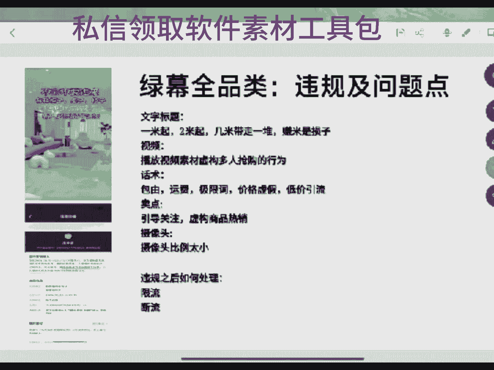

因为平兄弟，你我跟你说啊，咱们这边说过，兄弟，就从现在开始到以后，从现在开到以后，你知道吗？你们想在开播，平台直接把自然流量给你，那是不可能的，不可能的那么？好吧，平台是不会给你的，明白吗？

以后我们说我们去做直播带货，你要明白抖音经历了6年带货的发展，对吧？抖音经历了6年的带货的发展啊。他从才开始，他需要我们去给他洗人群，他需要我们去给他做数据。就刚开始的时候就是说前两年的时候。

那时候他会先把流量给我们，对不对？你21年的时候你做直播带货，那时候你一个小时新号开播一个小时大概是能达到700左右的场关，你22年去做直播带货，你一个小时大概率是能干到500左右的场关。

23年的时候我们那去打的时候，嗯，在除了那两个月的时候，然后大部分的时间段，很多人的账号刚开始开播时候能拿到300左右的一个场关。但是今年你没有自然流，你的一个新号开播100到300之后的场关是很正常。

并且搜索量很大，懂吗？受作量很大。所以说兄弟平台今天现在的一个发展，他的发展阶段到这了之后，他不会再把流量提前放在你身上。你要先展现出你的价值，你要先做出来数据，做出来模型，平台才会给你推流，懂吗？

这也就是现在很多人去纠结了一个问题，到底是先去拉人气，还是先去做那。我跟你说实话啊。你不管是浅层数据还是成交数据，你现在都要先做做完之后，可能平台都会给你退流。如果你不做的话。

你在等你现在还在纠结可能是不是你账号的问题。兄是我跟你说，不是账号的问题。那么你现在他不是账号的人气，没有账号的问题，懂吗？你现在要做的就前期一定要去拉你这边的流速。抖音今年去起号了两个方向啊。

你你懂吗？你要么就是你直播间不开力，要么就付费去带，那最简单的付费去带。你要不付费去带的话，你的主播和你的产品那衔接力度是非常大的。但是我在这里跟你说一个点啊，毛阿你。咱们直边说我兄弟。

你要明白一个点儿，就是如果说你们去答真经的话，你们账号自然流开的可能性要大一点。如果你们是打绿末的话，你们账号开自然流的可能性就小就少一些，好吧，它就少一些。所以说咱们这边家人要明白啊。

没有给我点回心家，能不能帮我亮个小不小心啊，能不能帮能不能帮我亮个小不小心，拉人气，拉人气是对的。你上来线上开播，你肯定是要先去拉人，上来就互会嘛。嗯，只要是你的流速是正常的，一般现在上来就互会了。

因为你自然流你从你重去拉搜索和其他流量，你也拉不动啊，那你拉不动呢，你还不如直接付费，直接付费只要付费转化好的话，你还能带动直播推荐。那么还是打实品好啊，但是实际你没有你推流的可能性少啊。

你食品吃主播能力，吃你的主播能力，吃你的产长那个产品热度，如果说你的主播能力，一般你的产品在没有热度，那你主播就把它打起来是很难的，你你如果说打真经的多品，打真经的多品，兄弟，我跟你说实话。

我不建议你去做，那么？真经的作品我是不建议你去做的，为啥呢？一般打真经的作品都是打过品的，你过品这个东西，我说实话啊，它和憋单的主播还是不一样。那么？他和别单的主播还是不一样，你憋单的主播。

你至少你去造。但是过品的主播是啥？是编故事的主播，他两的不是一种玩法。我原来我们团队去年的时候有一个嗯有一个嗯就是去做这种过品的，就做那种原来做捡捡漏的嘛。私信肯定是要买样品的，不管样品能行吗？

原来叫捡剪豆啊，那么？当时他们打简剪豆的时候，你们可能不清楚那个那个那个那个团队主播也很厉害，单场能打到80万的减MV就打单品，能打到百0万的减V，你响单他单场牛逼不牛逼很厉害的一个主播了。但是就这。

我们学了那一个简简录的打法，然后买了买药品，买了是将近几几K，然后又加上嗯那个亏品的米，然后合在一起发了两三个W，然后到我跟你说打了半个月没打起来，没拉起来，那么？他不是一类的主播形式，他话术不一样。

在这里要跟大家说一下就是啥吧？就说不同的直播形式啊，你的打法玩法和你起号的套路它是不同的，懂吗？不同的，你一个打多品的主播，你去打单品，他可能就打不动，为啥？单品是要憋单的，需要去造的。

需要去拉浅程拉到极致的，你多品是不一样的，懂你懂吗？所以说两方是不同的，你你一个真紧它难起在哪点呢？为什么真紧难讲，因为真锦是主播，你主播能力不行的话，你就打他是很很难打的，除非就是你打热度高的商品。

就让我学儿。我有个学员，他们打什么，他打那个前几天就直播烤烤炒饼，知道吧？直播炒饼，他们前几天打多少，打的是他去那淄博就打的。打的是一一那个账号打的是100多个GMV吧，佣金是26个8吗？还可以。

对不对？这种不错吧。对不对？20%25%的佣金嗯，25%左右的佣金，对不对？所以说你们要是没有这么高的品啊，你很难去做啊。所以24年兄弟，咱们现在去做直播带货就两个问题。哪两个问题了？没有直播推荐。

你怎么去拉？如果说你们我就让人等一下给你讲啊。如果说你们现在是个新手啊，刚打算做直播的话，一个账号星号，你一个新号，你开播。100多的长关到300多的长关。这都是正常的，你的账号没有任何毛病。

它是正常的，只是平台现在不会往你直播，往你的账号里面直接放牛。你要先把数据拉出来。大概率你要是只要是你的产品和你的主播能进性承接，能去弄大概率也就在半小时之内，他会给你开流量，对吗？

半小时之内他会给你开，所以说你现在要你要做的就是去带动你这边的数据转化。一般带动的方式，你要是主播和产品好的话，你可以去不去付费。但是你要主播和产品不好的话啊，他就是啥他就需要付费了多开好不好。

多开不好，多开商的是你的账号全中，兄弟。多开他特别伤账号的权重，你一个星号比开播，你做不出来数据，你去多开你平台里每一场直播平台是有计算的，你知道吗？它会计算到你的总场次里面。你连续开7场。

你连续开6场，你开5场，你做不出来数据，你这开的所有的场次，他只会商你的账号权重，到最后那么你一天播三场，你意义是啥？平台又不是看你一场直播，你一天播的场次说的，如果说平台的推流算法是我一天开个10场。

八场，开个三场五场，平台会给我推的流量多一点。那我跟我跟你啥都不用去比，我从早上做到晚上我就开播下播，开播下播就可以了。那意义不是这样。平台是根据你这边的反馈给你开的是吗？根据你这边的反馈给你退流的。

懂吗？这哪你要清楚啊。所以说抖先兄弟啊，真正兄弟，你去你没有发现一个问题吗？真正那些去拉的长久的账号，那些做的长久的账号你没发现吗？他们一般一天就播一场，对不对？并且他们开播的时间都相对是固定的。

好比说他是早上8点多开播，他就每天早上都是8点多开播，他要吃这个时间段的那个呃吃这个时间段的预分配流量和那个时间段的权重的，他都要去拉的。他没有说一天我就拉不两三场，你知道一般一天播两场是什么？

就我一个账号一定拉了个把月了，我每天都能产出来结果。但是今天我刚播了有个半小时一个小时，我账号出问题了，我下播了，下播了之后我可以去拉二场。但如果说你的账号已经播了三四个小时了四五个小时了。

我都不建议你去拉二场，为啥？明明你这一场数据已经做不足了。你的你的7天的中位数啊，你的复盘数据，通过你的账号去做你的复盘，你的数据已经在往下走了。这一场直播。那你下你就是二开，你就在日开，你日场的话。

你能把你的数据打上去吗？你还是打不上去，你等于说是你本身只做了一场的递减数据，你一下又做了两场的递减数据，他是特别伤你的直边那子的，所以说尽量不要去做二尽量不要去做二开，一天就播兄弟。多开有流量。

我不知道你从哪听的玄学，多开有流量。好吧。是你不是你开播那一播那一段那一段时间有你了。兄弟，你看没看过你的总场关啊，你有没有计算过你的场关啊啊。你一场直播播俩小时，你上午播一场，中午播一场，晚上播一场。

有没有算过你的场关。你上午那一场，如果说是能干到一两千0的场关，三0千0场关，你下午那一场的话，他绝对打他一般情况是最多保持个持频甚至比他低。你晚上那一场的话，它可能还低。

但是你如果说你开播的那一段那一个时间段，你的流量有那刚开播那一会流量多，每一个账号刚开播的时候，平台都会给你推一下流的，懂吧？他都会给你先找点人群的。不管是从搜索进度，还是从其他进度，还是从推荐进度。

他都会给你找点人群的，知道吧？你算这个那就没有意义啊。兄弟们咱们直接说，兄弟，有问题的在公屏上打出来，把你们的问题飘在公屏上啊，没有给主播点红心家的帮我点个红心啊。

点过红心家进粉团的助理给你安排到福利啊啊，各个类目的话术一个类目的素材好吧，十几个类目的话素材给你们安排了。好吧，不要你们一毛米啊，兄弟们是新人刚来直播间的，把你们的问题可以飘在公屏上啊。系嘛。

点过红心家人竞粉团的助理给你安排吧，不要你们一毛米啊。流速太慢了，都没有人都没有互动。所以说兄弟们没有直播推荐账号啊，来跟你们说一说啊，你现在新号开播，账号，直播推荐少是正常的。我们一般都用付费去带。

现在一般都用付费去带，知道为什么要用付费去带吗？兄弟们啊，因为付费和直播推荐是同一入口付费和推荐啊费的，它是同一流量入口啊，都是通过那一个广场和推荐你也进入的？你付费只是先把你一些精准的用户。

把你的直播展现在精准的用户面前，所以说我们付费的目的只是什么？先把人群给拉出来，人群拉出来之后，如果说我的人群做的正常话做的多的话，我自然然能带动直播推荐里面出人群，你的直播推荐可做出来一点数据。

然后就扩开那么？这就付费带动精准人群的一个办法，随心推他买的是曝光？兄随推买的曝光啊。兄所以说付费它是能带动你直播间的啊，但是你要有一个产品去承接。如果说你们是以你不想投付费。

但是你们的账号你拉了三五场七八场啊，账号也是还是这种没有直播推荐的一个。状态兄弟，你就断播吧，断拨之后去做老号重启，断个一个星期到半个月之后再去起，把你的账号重新进置一下，把你的直播场次给禁掉。

然后再去播，在这。要不然到最后的时候，实在不想放弃，就打打搜索流，只是搜索流，很多账号卖不卖不高，最后一步就放弃了，知道吗？最后一步就放弃了。这是当下你没有直播推荐的4条路，想做直播带货。

一定要先把你的流量口子打开，流量口是打不开的话，你的直播带货你做不起来的，你不要去听别人去说你的账号不行，兄弟，你这个账号不行，你下账号还不行吗？你下个账号还不行吗？你都是这样的一个账，一个状况。

你告诉我你咋去弄，对不对？咱们直页面都是这种状况，你告诉我你咋播你播不动啊，是不是。系嘛。所以说有什么问题的，可以在公屏上给你飘出来，有任何问题的可以在公屏上飘出来，把你的问题打在公屏上啊，兄弟们。

这是第一个没有直播推荐，没有直播推荐要拉啊。像今年的话没有直播推荐要拉，等一下跟你们说怎么拉啊。第二个东西是啥？第二个就是呃开播之后40分钟来急速流，这种情况一般是代表着你有直播推荐。

但是你直播推荐一般做不出来数据。如果说你一个星号开播了，第一场，第二场第三场你都有直播推荐。直播推荐占比也能在50%左右，你的流速还可以，直播推荐流速还可以，但是你做不出来数据，你拉不出来人群。

你的直播间里面是犯人群一直洗不动。那么基本上在第三场或第四场的时候，平台可能会给你来极速流，就是40分钟左右给你来过极速流，那么这是很多账号现在普遍出现那个情况，知道吗？如果说出现这种情况。

我们该怎么办？家人们知道吗？出现这种情况，我们该怎么办？他只有一个办法，他没有别的办法。强行去校的模型，像这种账号好在哪一点？就是你直播里面有流量口子，你的直播推荐的流量口子大概率是能干什么少。

干大概是能干到800%到90%左右的。你的直播推荐流量口子开的但是流量口子开了，就你们直播间的人群泛得一批，你是没有办法去转动的那你只能去改你的人群。你一定要记住一个点啊。

强行改你的流量模型是怎么去改的？就是在你的直播饭流量来的时候，不要去动它，饭流量前面也不要管它这一波到饭流量不要去管它。因为你做的任何的数据模型抵不过泛流量的冲击，懂吗？这所有人但凡是来这种泛流量的。

其实点就是一个原因，就是一个原因啊，一定要找原因啊，为什么说你会来这种泛流量，加人们原因就是你的直播间里面，你做不出来数据，你拉不住人群，你直播里面平台把流量给你，你不去珍惜，懂吗？

那么平台就觉得你直播里面意义不大，价值不大，他就会在你直播间给你灌水，懂吗？他利用你的直播里面去洗他的人群，啊，他需要起一些人群包？所以说才会在这，但是他这波流量一般不会跟你太久。

一般也就是十几分钟到半个小时之内。嗯，最长的我见过是有跟一个小时，但那种很少。当这波流量下去之后，你后面的流速它是很低的，后面的流速是很低的。那么后面的流速低的话，兄弟们啊，后面的流速我们低的话。

兄弟们要明白一个点啊。嗯，你可以通过在这个地方，你可以通过付费啊。投付费一定要去投，单独去拉直播推荐是拉不动的。因为你的人群犯的太厉害了，前面的这一波已经把你的人群改得太狠了，通过付费去拉时长去洗它。

一般付费我们是投6个小时，一个小时2个小时不要去投啊，一个小时两个小时的去投，直接把你的账态干废掉了，6个小时之后去投。两个小时之后知道。还有就是兄弟们，你们现在还有一个点儿。

就是如果说你们是新号开播的话，你们通过付你没有直播推荐，通过付位运带的话，可能也会给你开极速流，只是极数流有点小啊。也会给你来一波流量，这都是会给你们展现的东西，懂吗？来极速0不要怕。

来极速流是好事儿啊。对于没有直播推荐来说，来极速流是好事儿。你只有去校灯后面的流量模型，才能把你的账号改过来。后两嗯像你们来完极速流之后，你们直播间的直播进限应该是一分钟进个一个到10个之间的吧。

留存率是很低的，对不对？随便买留人率是很低的，留人率这么低的话，你想做数据的话，这时候才可以啊。你这个时候一分钟给你来几百人上千人到底怎么呢？你做那一个数据是啥？其实说96%正常。

其实率最高都是80%到90%多之间啊。它是正常的，你的起速流最高峰在这儿都干能干到多少？今天最高峰在这儿能干到多少？嗯，都行。一定要去调整嘛？兄弟们不调的话是不行的。所有的你一定要记住啊。

抖音里面啊我们去做账号啊，是根据直播间的流量去做的，好吧，80。八神不算高，八神好改，你兄弟八神这个数据还是好洗的。那么。80人这个数女还是好洗的啊。懂吗？没点红心的，能不能帮我点个红心啊，兄弟们。

感谢7970帮我点的小红小心啊，是新人刚来直播间的帮我亮个红心。好吧，有问题的在公屏上跟主播说说，把你的问题跟到公屏上。你知道原来那时候我们打我们来极速流候，我们来多少吗？原来那时候我们来极速时候。

我们直边来多少，能来一两千来一两千这种账号吗？你都付费都改不了，付费你都改不了懂吗？你说你累不累？你不来极速流，你还好洗，你来极速流之后，我再建建议如果说你是百80人是几百人的话。

他都他洗出来的概率很大兄弟，他洗出来的概率很大，好吧。抖先导了什么内幕给我说一下呗。到什么内容？啊。汽实我走的时候会电。虽说走了之后投付费，但是不要投一个小时，2个小时的家居是吧？

家居去结合一个昆品去打。打家军我也算是恼手了，20年打到现在了。带在学园里面打家居的都很多了。大家具。兄弟，实在不行的话，你报一个陪跑吧，报个陪跑答疑吧。都先下方小下方你找我的助理吧。

499带走一个陪跑答疑。你帮带你一个月，我给你复盘。给你分析嗯。现在账号比原来要精贵多了，你知道吗？有问题的可以在公屏上打出来，把你们的问题配到公屏上，咱们相互交流啊，把你们的问题打出来啊。

亏本咱也咱没没张也兄弟。你看这都是你自己消息闭塞的原因了，这就是你打不起来原因了。知道吗？就因为你没有怎么说呢？你的思想在固化了。唉。可以，你可以去找商家谈嘛，商家也是需要去做的。

有很多商家都是愿意给你做亏品的，他不是不愿意啊。就我们今年来说，那么就24年我们起号啊，你那给我跟你讲讲起号中两步，知道吗？第一步是先拉开流量，你直播间面不是没有直播推荐吗？你像我们这个账号。

我们刚开播时候没有直播推荐的，对不对？没有直播推荐的话，我们前期要去拉我们的流量的，我付费是直接打的。你看我前面的直播推荐都没有一分进来一个人两个人，然后断了，对不对？

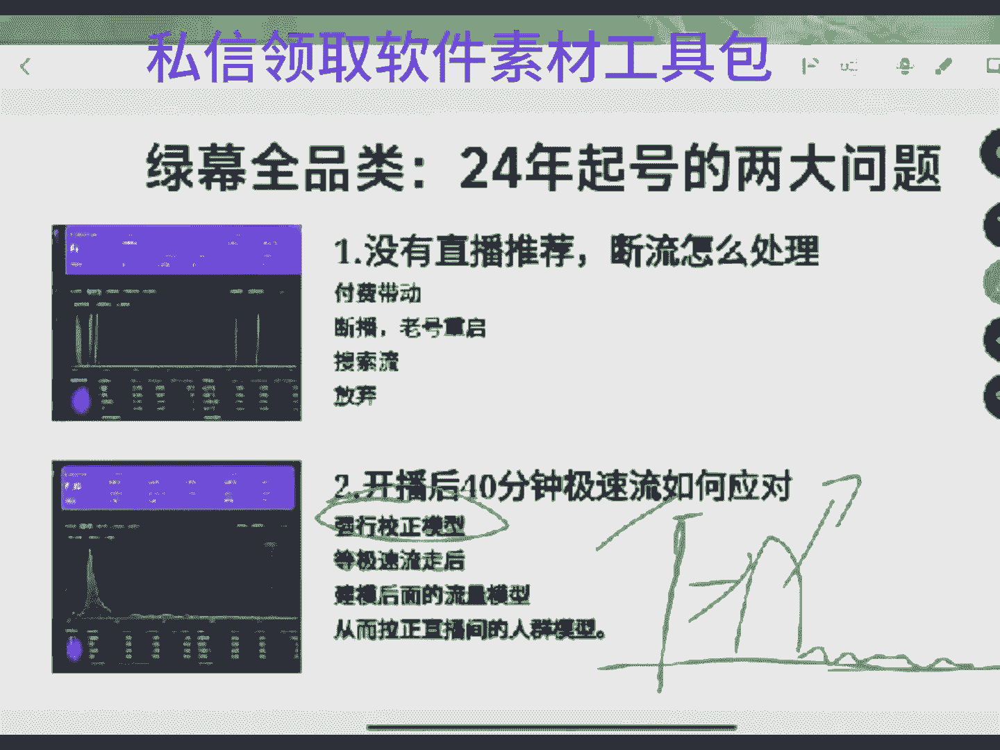

断了之后，通过付务费介入，然后慢慢把直播推荐打开了。所以说起号就两步。你直播间里面，如果说你现在新号开播，你没有直播推荐，那你一定要去拉的，一定要通过付费去打的付费上来都能投，直接去投。但是投完之后。

他需要你去转化，你不去转化不行，知道吗？兄弟。好吧，不转话不行。不转化的话，离得直播间们拉不起来，没有点红心家，能不能帮我点个红心啊？亲人们，家人们帮我亮个小小你吧，有问题在公屏上飘出来啊。

你都播了几个月了，播几个月了，账号还没播起来换号吧。实话播了几个月的账号你没播起来，你都已经这个账号我说难听点就是很难起了。那现在不拉时场吗？拉呀，打作品不拉时长不行啊，单品不拉时场。

作品是必须得拉时场的。多品不拉时那不行啊，知道吗？你多品不拉丝，让你怎么齐齐兄弟。Yeah吗。要多久啊？如果说你是投付费的话，星号开播第一场就播6个小时左右。如果说你是打不想投付费的话。

第一场拿3个小时左右，对吗？也是必然拿的。有问题在公屏上飘出来，没有给主播点红心，家人能不能帮我点个红心，把你们的问题打在公屏上，咱们聊一聊啊。啊，好吧，把你们问题打公程，咱们聊一聊。每天只有2小时。

每天只有俩小时，不要去做多品，做单品。每天只播2小时不要做多品，做单品啊，多品不适合你啊。多品是必须得拉市场的，你没有主播能力清主播那个状态，你拉你去拉多品，就算是一个能起的账号也给你干废了。

6个小时说话都累了。兄弟，你。专业兄弟啊，你没有刷到过多品的直播间，人家主播早上那播，中午在播，晚上那播吗？没有刷到吗？他们一天播的时间都很久啊，那你说人家累不累？对不对？他很累的，他没有不累的。

打毒品是必得拉市场的。你没有主播能力，你是亲主播的一个状态。你在素屏和过屏，对不对？录播现在平台查，现在平台查，知道吗？真正打长久的账号啊，你说真正打的长久的账号，大部分都是每天播一场，都是正常去拉着。

你像现在你们觉得他就现在我们学员里面再播的他们那些账号，一场直播播个十几个小时的，两个人替换着播，一个人播两个小时之后，换另外一个人，一场一个人播两个小时后，换另外个人休息休息再玩玩。

一般一个人你去拉10个6个小时，10个小时，确实累，真累。你自己在那坐着说话，你到最后都不想说，那是事实。但是你你后期账号一旦拉起来，你肯定是要找人和你一起播的。大部分都是两个人配合的，知道吧？

多品种这边是适合夫妻档去做的。两个人自己在家里，然后每天播一波，拉一个账号之后，一场直播可能卖个，你要知道咱正常去算百十的佣金吧。百十的佣金的话，我们去打的话，你卖一场直播，你卖一个W到2个W之间。

你一天是能拿到嗯一K到2K之间的一个佣金的，对不对？嗯。所以说一般都是夫妻档他们去做一个月的话，大概能打个。嗯，大部分现在很多账号，其实如果说你拉起来之后，你这边哪怕只有30个人在线一场直播。

你每天稳定那就播一个月也能打个3到5个W的一个佣金，知道吧？这是多多品的一个那个，他们大部分账号不报，他不会报的。你们自己去看。所以一般都是夫妻档去播，或者两个人一块去播吗？

单品你要是一天只有2小时的话，你就干嘛？你就去播单品，不要去播多品，播多品没意义的。我们是属于亲主播的一个状态。亲主播的一个状态的话，你们自己想想，你没有那么重的主播能力，你在直播里面想带节奏。

想拉人群，你想拉你的，你想破你的层级，想把这块做起来，那你是肯定需要时间的，对不对？你不去你不通过主播能力去带的话，你就只能通过时间去带了，明白吗？我也知道累啊。你不要说那么快啊，您看我现在跟你去说话。

对不对？我说话的节奏没有那么快，对不对？我不想去拉号，不想去那种重拉的话，我说话节奏没有那么快，没有那么快的话，那我在直播里面那不就可以多说一点吗？你在直播面也是这样。

你没发现很多你说多品直播间为什么要放音乐，你知道吗？就是因为我们可能就你是你都不用说我这么多，我这是一直嘴巴巴的不停在拉你们在和你们聊，但是真正的多品直播间，他们是没有那么频率的。

比如说他说完一句话之后，他可能会停个十几秒的吗？嗯，多品女装现在在线不高的棉麻高，还有单品，你现在只能去打棉麻，多品30多品那种女装啊，它一般是对应的是啥？是30加的人群到30家人群和50加人群。

你打30家人群现在已经是有点过去了，那么它已经有点过去了，这个这个时间段啊，从现在开始5月到7月啊，是棉麻的爆发点，那么？是棉麻爆发点。但是你去打单品不合适啊，单品退货率太高很的。单品除了数字好看。

它的退货率太高很了，懂吗？单品的退货，你多品的退货率，你知道吗？多品女装的退货率大概是在50%到70%，那么就是30加的女装最高退货率能干到70%，50加的女装最高退货率能干多少，60%。

就棉麻的退货率最高到60%。现在去打的话，现在是属于棉麻刚开始爆发时间点，它现在去打可能退货率在50%，那么？说这好看，就是打出来GMV好看，单品女装的退货率你知道多少吗？

单品女装的退货率最高能到90%，就说你卖一个W能退9K能退9K就是单品女装，它就是说这好看。那么。打单品女装的，你兄弟，你自己去打打就知道了。我跟你说，10千0遍1万遍，你可能不信，那么为啥？

因为你没有吃过这亏，我吃过啊，有我打过啊。所以说打单品女装的话，就是单场说这好看的嘛，一般是单品是通过这个商品的热度，再加上这个商品的素视频场景，然后把它拉起来的。他退货率太高了，没啥意义的嘛？打单品。

好吧。嗯。所以咱直边所有兄弟没有给我点红心，家，能不能帮我点个红心啊？家人们帮我亮个小红小心。好吧，牌子掉了，家，能帮我卡，把牌子重新卡一下吗？兄弟们能帮我把牌子重新卡一下吗？好久没有开过播了。

我也不知道该给你们讲啥，我就跟你我就框了几个大类，你们要有什么不清楚的，你们在直播里面和我聊一聊，咱们相互交流一下就可以了。单品还是吃主播呗，单品是比较吃主播的。

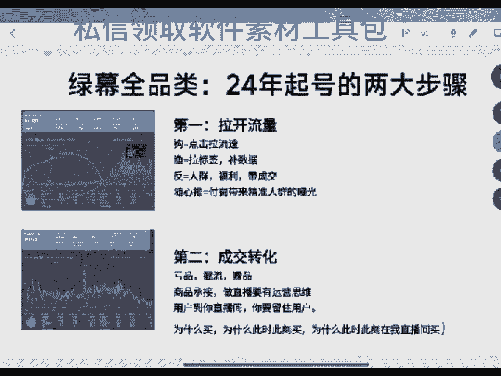

你话术要去绕啊，你话术不去绕不行啊，你不去带话术，他可你怎么就播啊，你自己想想不带话术怎么播啊？不带话树，你播不是播不动嘛，对不对？嗯。你就一个商品多品为什么说我们不重吃主播，你知道原因在哪里吗？

是因为多品我们在直播间里面有商品点击这个数据在支撑支撑着你的人群只要打正了，为什么说多品的话，主播能力一般主播能力不高，在直播里面一直播着那直播间里面还能拉住人还能拉开人，还能一直有推流。

你知道为什么吗？就是因为一个点，就是因为我们在直播的过程中啊，我们的商品点击一直在做着一个人进你直播间之后，只要是这个人他有他是相对精准的人群，他在你直边往下欢一欢你的商品中，他都不止于点开一个商品。

一个用户大概是给您做到3到5个点击的3到5个商品的点击的，懂吗？所以说我们直播间的商品点击的一个次数是很高的这也就商品点击次数高了，你直播间的浅层推流就会高懂吗？明白吗？真哎呀，兄弟。

他只是让你去省事的一个办法。这个盐兄弟。我都打了几年的真真人了，没有人，他只是让你省事一个办法。前段时间有一个有段时间千穿全域的一个风波很高，你去打打全域，然后结合了去，你能去拉搜索流。

能让你去把账号直接干起来。但是最近这几天的话，平台查这个东西很重，如果说平平台放松的话，你该去玩这个东西还是玩这个东西严，对吧？毕竟省主播嘛？省主播能力嘛，对不对？你主播你像我们自己的主播。

我一个主播的话，他们一个月你让他就播10个账号，他很那个。平台每一天都在变，对，平台每一天都在查，每天都在变。这两天，尤其是今天我感觉查的还重一点。主要是以真人为主啊，还是要去做真人啊，因为为啥？嗯。

如果有省事的时候，我也想去打打省事的。如果不省事的话，那没办法，你就还是得做不省事的，对不对？不省事的话，你还是得做不省事儿的，要不然不行啊。是新人，那没给主播点个红娘，能不能帮我点个红心啊？

家的把问题飘到公屏上，好吧。对他出去单独干活干，你认识老蒋吗？他单独出去拉不去了。他也是从真人出来的，到最后单独去做无具了。把你们的问题飘到姑娘，你在群里头是吧哦。没问题，你是缺人吗？你。您能学什么？

是。把问题飘在公屏上好吗，有问题在公屏上打出来，咱们相互聊一聊，相互交流吧。嗯，我说呢。老贾去年原来打针打单品的，打单品的，现在也不想做了，单品太费主播了，所以说他就他觉得这个东西简单。

所以说他前段时间就出去打无了，没想到平台又查了，平台又查了，现在又不好去做了。他准备打辣子了，他准备打破件了吗？准备去做个破件。你是啥时候的学生，你。哎呦我这账号推流流速太慢了，还都是虚员。

还都是原来的人进来，都没有新人进来。有问题在公屏上打出来，咱们聊一聊啊。今年去起泡啊，家人们。哎哟。有问题的在公屏上打出来，咱们聊聊啊，把你们现在想做的类目打在公屏上，咱们相互交流一下啊。

把正们想做的那么打个工，咱们交流交流。今年去起份啊，所以说啊他确实有点难。现在我们说我这个兄弟们，如果说你们现在想去取号，一定要先把流量口子打开啊，流量口子不打开的话，你们是不好起的。不好去拉的啊。

问题飘出来，咱们相互交流一下。有有没用有没用短视频旗号的磊雷呀。短视频。嗯，我算。你的素材如果说打不爆的话，你短视频是很难起的那类。你的素材，首先你看我们正常人去花一个播放量，我们去花了短视频。

我们的播放量在多少，可能是在几十或者说几百高的话可能是一两千，这都已经算是顶天了，这是正常一个视频的播放量，但是如果说你想通过短视频去引动你直播间的话，你的短视频这种播放量是带动不了的，对吗？

你这种短视频的播放量，它是没有办法进入的，这是没有办法进入的。那你告诉我你怎么去通过短视频打呢。你想去通过短视频代你直间，你首先第一点是要先把短视频的热度给打开，至少是让你的短视频能达到多少，能一达到。

至少是你的短视频，你的从你的拍摄来说吧，你的短视频要单独能跑到一两万的播放量，这代表着这个短视频有报的潜质。报了潜置之后，你去打这个短视频的，你去打抖加，你这个短视频打抖加，打抖加完之后。

如果说他能冲到10万以上的5万到10万以上的播放量，那你去肯你去开直播的话，你再去投抖加和纯推两方一块去投，他是能给你拉到短视频进入的，对吗？你的你的抖加是投你的短视频热度把它做持续增大。

你的短视你的随银推投什么投短视频，短视频进入直间，你能做到一个一加一等于2或者一加一大于2的方式，谁来拉一个转化。但是如果说你的你的短视频，你发了，就这样说吧，你前期先不短视频。

如果你每天短频都是几十的播放量，甚至一两百到几百的播放量，一两最高拉个一两千的播放量，像这种短视频的话，你想让他们进你直边是很难的。就算是你投抖加，他也不会有太高的一个播放量。你投了很多抖浆的费用。

可能都是浪费，懂吗？短视频的文案，还有你的完播率，还有等等很多东西，它都是。所以难听点的，他是啥吧，它都是一个你需要去专攻的一个点儿，你知道吗？你一个普通人，你去花这东西，你是很难很难把它给弄出来的。

如果说你去听别人，如果说你选择直播带货的一条路是三频去做的。我就说难听点的，你选择三屏去做直播带货啊，你没有团队，你自己真做不动，你你去打这种方式，你到最后你怎么去打的，怎么去回来。

那么你怎么打你怎么回来，没事，因为这条路，一个人太累很了。나마 봐。点啊啊你你。所以说。嗯，最好的做直播的货，最好的路其实就是付费，加上直播间付费，加上直播间进入，付费加上那个暂留啊。

这是最好的一条路了。为啥？因为你至少要先明白一个点，就是我通过付费带来相对精准的人群，然后它本身就行了，你只需要去转化这波人群就可以了。但是你如果说你去做三品付费，短视频加直播间，这三频去做的话。

你光前面一个短视频这个铺设这一块问题都够你受的了。懂吗？你有没有拍摄的，你就算是跟别人的短视频，咱就说难听点，你最简单一个问题吧，你去跟别人的短视频，就是说跟爆品，跟短视频，或者说你去捡人家的。

然后通过这种方式去做，你通过这种方式带的话，对于你来说你都不见得能打出来。并且短视频如果说你搬运，你对去重何处理，不是做的不好的话，你搬运的话，他是会分进你直播间分进你的账号的，一旦分进你的账号。

你的直播间都被你的直播间都分进了，懂吗？我跟你说，去年我有一个学员跟我模块，当时跟我模块做的是什么做花费。他的账号原来也是做短视频的账号，他打了花，他跟我模块打的花卉。他打到话费的时候，知道么？

他的直播间呢，我跟你说，他的账号播的是有个半个月了，当时他是在65月份的时候跟我们还在做话费，账号播了半个月了。当时他的直播免一场直播也能卖6K了，每一天这个花费账号已经产生一个正向的转产出了。

账号打了有一个月了，佣金当时都已经打了1万多了，那么？但是最后账号出问题，被抬走的，原因是什么？就是因为短视频分禁，因为他的短视频当时做的什么？做的是那个他直边免他的短视频是搬运，那么就是他通过。

别人的短视频去做个去重，然后，但是有人举报他就举报他短视频搬运平台审核过了，直接给他判了。判了之后，平台当时都分禁他30天，所以说账号30天之后已经废了，知道吗？已经废了。

所以如果说你是做短视频音这一块的去起号，你最后要承担的后果是很重的。平台这个平台的当下的内容的同质化是非常严重的。那明我不知道这面跟你讲，能不能听明白，它的同质化是非常严重的，那么？同质化很严重的话。

就代表着很多人花的这个素材啊都大部分相同，知道吗？嗯，我给你举个最简单的例子，就是原来我自己我自己经历过一个事儿，你知道吗？就说我知道的不是我一个拍原创短视频的，就是说他每他拍的什么作幻。

他准备去花一个他准备去做一个人设型的账号，就是每天去分享作幻，知道吗？他每天都做，就自己拍，自己去剪，自己写文案，这是原创嘛，对不对？账号发了有个一二十条吧，然后账号被封禁了，分禁的原因就是搬运。

就是判的搬运，懂吧？但是他发的是原创，他怎么判呢？其实核心点就在一个了，就是因为它的同质化的内容太严重，懂吗？同质化内容太严重。所以说兄那个雷雷啊，咱们这边说过兄弟，如果说你上来去做直播待务。

你走这一条路不是特别好做，懂吗？不是特别好做。有那有这心思，你还不如直接去玩玩付费，把付费搞明白了，你也别他好奇，好吧。怎么打开直播间？兄弟？嗯，24年我们就做直播带货啊，一定要注意小办法去拉开流量。

要一定要把我们的流量口的小办给拉开。直播带货不拿流量不行啊。嗯，今年平台去做数，今年我们去做直播带货，一定要先去做数据反馈。当你直边有了数据，有了反馈，平台才会给你推流。

原来平台先把流量给你的时代已经过去了，从现在开始到以后大概率都是这种情况了，甚至以后会越来越严谨，所以说想做直播带货的兄弟们，如果说你们现在想做一定要多点细节。打开流量口子的方式是什么？一定要先去拉嗯。

所以反馈是互动关注啊，关注不算互动算啊，互动算，那么明白吗？互动算。因为关注是属于什么？关注是属于你直播间的层级了。我跟你说啊，决定流速的数据是什么？是商品的点击停留，商品的点击互动嗯。

这一类的算是包括商品的成交密度，都是他算是决定流速的。嗯，你的你的关注跟灯牌是决定你直播间的层级的，懂吗？你的关注跟灯牌是决定你直播边层级的。就是说你的多少人做了多少关注，做了多少灯牌。

它决定的是你的一个层级的稳定，好吧。啊，他是这。所以说我们前期上面去做数据，你要先去拉什么？如果说你是以带货为主，那么你前期做数据，你就要先去拉什么，你就要先去拉流速，打开你的流量口子。

那你最好就先去做点击数据，就是点击数据怎么去做？其实点击数据上去做的是很简单的，一定要以好的商品去来拉我们的点击好的商品去来拉我们的点击的嘛？因为只有这样你才能做起来，商品是什么意思呢？

打比方说嗯以一个小时一个小时平台给你300的场关嘛，300的场关，其中搜索流量搜索的钩子可以用。如果说你有钩子是可以用的，并且我跟你说啊，并不是你现在理解的意义的钩子可能是那种超低价格，对于我们来说。

钩子的商品是什么？性价比高的商品都叫钩子，相比高的商品都叫钩子，懂吗？好吧。每多频每天最多拉几个小最少拉几个小时啊。你拉号阶段的多频啊，只要是流速正常的，你的流速正常有转化的方式候啊，累ly啊。

流速正常有转化的时候，你一天最少是要播10个小时左右的。如果说你的账号是处于正在拉号的阶段，你没有转化，那要去看你的直边流速了，看你流速去决定你要拉多长时间了，懂吗？没有点红心的家人。

能不能帮我点个小红小心啊，是新人的，帮我点个红心好吧，点个红心家们进粉团的助理给你们备注一套话术啊，再给你们安排一个三场起号的一个流程，三场起号流程。好吧，就是说我们星号开播第一场该做什么授益。

第二场做什么，第三场做什么授据啊，给你们安排了，不要你们一毛米啊，有问题的可以在公屏跟主播说，把你的问题飘到公屏上啊。把你们的问题飘到公屏上，好吧。钩子是其中的一个方式。兄弟，你可以用钩子去拉，知道吗？

可以用钩子去拉。系嘛。嗯。好嘛。嗯，因为兄弟，你要知道为什么说钩子可以把我们这边流速打开呢？我正好跟你说啊，你先听我一个跟你说，用的最多的，现在我们觉得用的最多的几个方式，第一个是就打比方说就是钩子。

他在直播里面给你起到的商品点击的作用。那么他在这边给你起到商品点击，因为我们这边打比方说兄弟，你看好，我们直边里面进来一个小时进来200多人吧，咱都不说300人呢，进来200多人，你三个小时的话。

大概进你你新号开播第一场，你3个小时大概进多少，三个小时大概是能进入到嗯。700到800之间吧，对不对？3个小时，如果说你一个小时推流是在200多，你3个小时大概是能进入700到800之间，对不对？

700到800之间，你的直播推荐占比在10%的话，你的你的直播间里面也有70到80个人进入，对不对？如果说你直播推荐占比在20%的话，你直播推荐应该是有个有多少有个那一个100多的人进入，对不对？

那么钩置在你直边我们新号开播第一场我勾置起道做什，他是给我拉点击那点击点击什么意思？就是每一个从不管是你是搜索流量进来人，还其他流量进来人还是费得进来的人，或者说付费进来的人，不管是哪一个渠道进来的人。

我这个钩置的商品在直播间一直是谈着讲解了。每一个进来的人都能去看到我的商品，包括每一个点开我小黄车的人，这个商品就在一号链接，他都能看到。那么这个商品被点击的概率就是52分之1，他就是2分之1，对不对？

那就是一半一半如果说我单向流量渠道，单向流量渠道直播推荐进来的流量渠道里面一定一定一但是。出来的数据比例啊，比如说现在你有80个人直播推荐进来80个人，80个人。

一旦有40个人到50个人去给你都做了数据。兄弟，你的直播推荐口头都打开了。平台就会以把你的直播推荐流量口子放开了，懂吗？这是第一种方式钩着啊，因为先有数据后来流量，这是平台当下的一个方式。

所以说一定要有明白啊，一定要明白，这是第一。第二什么？第二就是河里面游的金鱼。在你前期没有直播推荐的原因是什么？是因为你直播推荐，没有人给你做数据，没有人给我做数据的话，兄弟，你想破开直播推荐。

你那一定要先产生数据，我如何才能让先产生数据呢？我要去准备几条我们自己经常养的这个河里面有的金鱼，不要多3到5条就够了。3到5条进让他们通过推荐页刷到你的直播间，刷到你这边之后，然后在你这边产生数据。

不要同时进入分批次的进入，然后一直给你拉着数据，基本上3到5条做后，你的直里面自然就自然打开了。因为你有数据产生了，这是第二种方式，那么？第三个方式，那你就需要去通过话术了？

一般第三种方式话术结合商品去拉的懂吗？比如说我前期我这边不是没有人么，我要放大在我这边给我做数据的比例，那你又不能用马扁，那吗？你要是用的话，它能一组合种所有的套路，知道吗？我跟你说实话啊。

咱们这边说一下嘛？在你去起号的时候，不要纠结是用一种套路，还是用多种套路。我给你个建议，同时你能不是说四种套路中用你多种套路结合在一起去用你结合在一起去用，明白他意思吗？你一种套路对应的是一种流量啊。

懂吗？比如说钩子只是给你拉点击，但是如果说你有话术去带钩子呢，带产品呢，带福利品呢，带亏品呢，对吧？它是起到了两行这种一加一大于2的，对不对？比如说我用河里面游去你用河里面游的金鱼先给你打流速。

把你人群和流速打开，你后面进来的人是什么？是根据你前面的这个呃你的水军去做出来的数据，对不对？水军做出来的人群，那人群相对精准的话，你想找的话，你是不是得需要通过话术和产品去洗。

那我这时候能不能用高反的话术先去拉入第二波平台的推流一般是三波，你能把三波流量圈吃下来，你这边面打的嗷嗷叫哪三波呢？第一波通过。通过河里面游的金鱼，先把流量图打开，打开之后，第二波干嘛？通过高反的话。

通过反的话出，我就是说我给你安排福利，我让你给我做数据，把第二波流量进来的人均福利数据给我做出来。做出来之后，你的流速会稳定的往上升，那么第三波再去找一个好的商品去承接，对不对？

最好的方式就是组合套路嘛，你单套路去拉，多多少少有一些薄多多少少有一些薄的成分啊，懂吗？面吗。最近的话不要去做了啊，蕾蕾啊最近不要去做了，雷玲能嗯那个专业兄弟能帮我卡牌子吗？蕾蕾能帮我卡牌子吗？

没有卡牌子，能不能帮我卡牌子，没有点红家人，能不能帮我点个小红小心啊，是新人刚来直边的能帮我做个作品吗？兄弟们好懂。好久没有开过播了，账号流速太低很了，我播的都有点累的慌，咱们相互支持一下我可不可以啊。

相互支持一下我可不可以？好嘛。没点红心的，你帮我点点红心，帮我把这个账号点点红心，好吧。哎呀。所以说对不对？这是不是你现在必须得先把你的数据模型给打开，然后才能让平台给你推流。

平台不会说先去把流量给你了。平台不会先把流量给你了，现在就是这懂吗？所以还有一点是啥？还有一点就是最后一点是啥？兄弟们就是付费了。你通过付费先带来金准人群的曝光，它也能一把你的流速打开，懂吗？

所以但是套路要结合重啊，一定要组合。组合是最好的，前段时间不太还最近这几年平台在查呀，琳玲。最近这几天平台在查查的是比较重的啊，他查的话就没有办法了。嗯，这几天的话可能就是你刚开始做无的话。

直接直播间里面直接被平台给抬走了，直播间里面直接被抬了，那么？所以说尽量不要去做啊，等工程端平台降下去之后再做，好吧。回头我们再研究一个简单的方式，能允去带的，能一去拉号的。好不好？兄弟们。

不会起号的兄弟啊，咱们直边所有兄弟，你们不能等啊，做直播间货不能等的，一定要想办你起号，不起号不行啊。你什么时候都得起号，不会起号的兄弟，我给你个建议啊，找我的助理去报1个499的陪跑答疑课好吗？

就这一个找我助理去报一个陪跑答疑课。嗯，我们是一对一的啊，陪跑答疑一个月，我给你一套全套的课程。

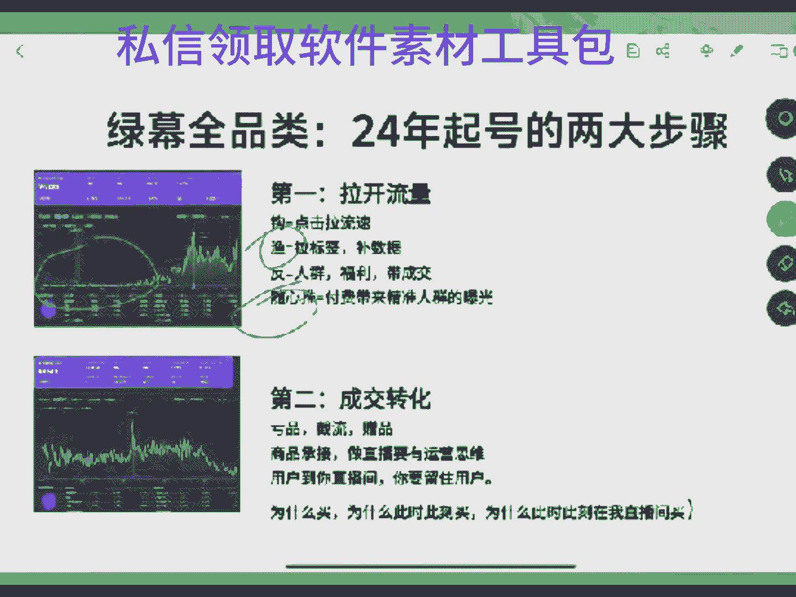

2十大节708十小节吧，应该是有几千分钟，里面各种打法玩法，包括呃直播间的一个实操案，包括案例，还有分析，都给你们进还有一些遇到的问题都会跟你们说。还有就是你们做直播间或，如果说是没有方向，没有思路的。

直播间里面遇到各种问题的，可以跟我说，我亲自带你们。陪我答疑课现在是我自己带啊，没有别人的啊，我自己带你们好吧。

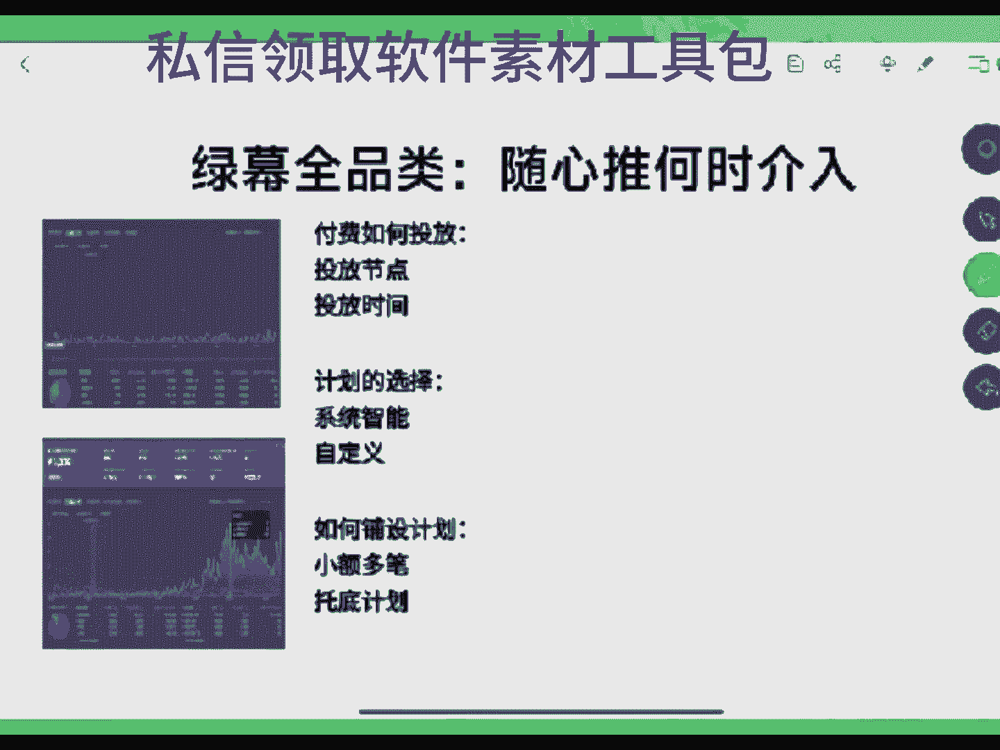

可以跟我说啊，然后呢，我亲实带你们，我会按照我的经验给你们说如何处理这个问题，让你们的直播过程少走弯路啊，好吧。

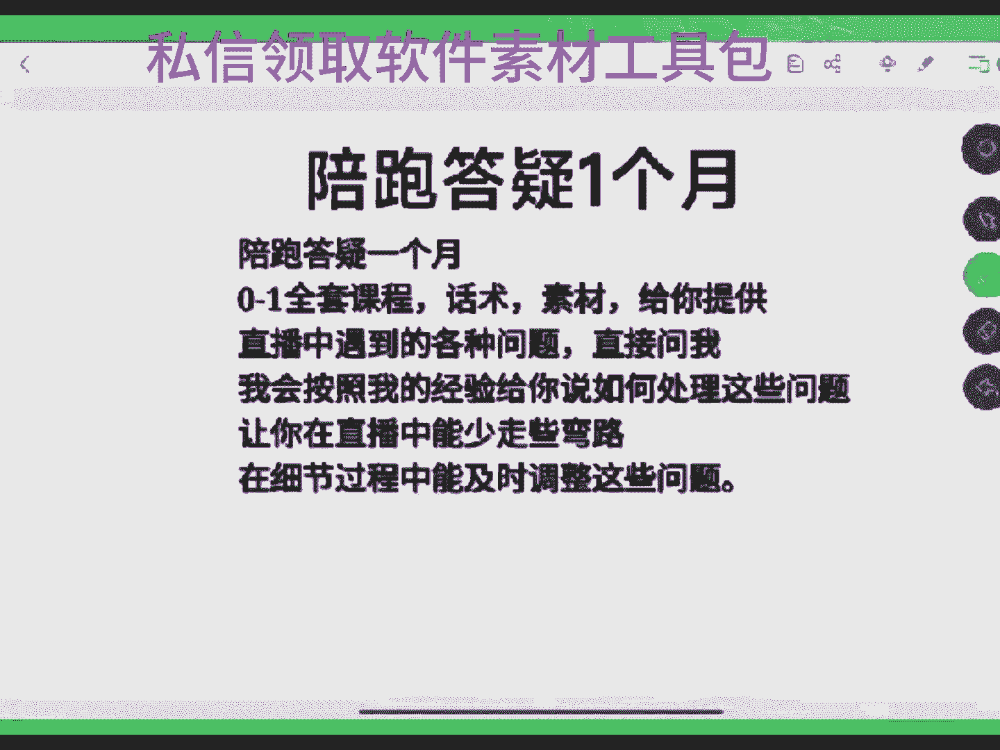

有咩。所以说咱们直边所有兄弟啊，现在起号两大步，第一步就是拉流量，拉流量的方式就这几种，你知道吗？就这几种，你要么就是话术去转，要么就是你用你下一点东西，要么你就河里面游的金鱼，但是你不去要么付费。

他这几种方式都能把你的直边流量口子给打开，你都能带动你直边流量。但是如果说你不去带动，那么你们的账号就是你就是播了10天播了半个月，可能还是啥可能还是没有直播推荐，还是搜索比较大。

像这种账号你要么去转成搜索流去试一试，要么就是放弃。那么换号，他没有别的路，好吧，所以说如果直播推荐拉不开的账号，你播了半个月也好，播了一个月也好，这种账号都没有意义没有意义了。

那么第一步就是拉开流量口子。当我们的流量口子打开了之后，第二步你要去做成交转化。其实直播间会就两步。第一步拉流量口子，第二步去做成交的一个转化，懂吗？你明白吗？因为说我你如果说你单独去拉流量口子。

你不去做成交的话，你最后就会出现一个点，就是说你的流速会下降，你的人均会流失，懂吗？因为平台不会把如果说你带动不了商业模型的话，平台不会把流量放在你身上，他最后会把你的流量流失掉，懂吗？

咱们这兄要清楚啊，所以说第二步一定要去做什么做你的成交转化了。那成交转化前期你要记住，当你的流速大时候，后期你不怎么说话，你就是不吭声你这面都一直出单。但是难就是难在0到1的一个成交了。

难就难在0到1的成交了，0到1的成交为什么说难呢？就是因为前期我们很多很多人啊上来去去拉成交时候，他不理你用户不理你，所以说你拉不动啊，对不对？你拉不动你咋办？兄弟，你有没有想过？所以说前期去做成交。

一定要多给一定要想办法去让用户在你这边去做成，人给你做成交。那你一定要放一些好的东西在怎么面，让用户在怎么样给你拉成交。那亏品啊，节流啊，买正的商品啊，它都是我们可以去种的。其实通过这几种方式。

你去带动你这边成交就可以了。如果说现在兄弟们，如果说你的话术好啊，你的主播能力稍微有，你的话术好的话，你可以去种亏品和节流的商品，节流的商品，你们知道是什么吗？就是说你们在嗯节流商品是什么？嗯。

就是类似于像那种一个9。9块的商品，我把它做成2。9块，但是我有一个5块钱的运费，它合在一起就是。就是7。9块，但是这个商品呢，我佣金不要了，对吗？但我在直播间里面我就不能去说它不包邮。

我就只能去说什么。我说姐姐，咱们这个3号链接给大家安排的福利，你们平时在商场超市看到的多米，你就在别人直播面看到还有多米。今天在我直播间里面，知道吧？我们直播面只需要0。9米，对不对？

再加上抖音现在出来一个东西叫什么叫比价系统，对不对？那优价率和比价系统对不对？你的你去做节流的话，你2。9块的这个商品客单。如果说别人在别人直播里面拍它是9。9块，你在这面面换2。9块。

虽然说你是包邮的。兄弟，但是平台绝对会把它把你的把你这个把你这个商品往你直播边面推。那么这就是你拿流量的方式，你去做流量转化的方式，懂吗？你一定要有方式方法做直播间话不能盲目去做，盲目去做的话。

你播到最后你也起不来，明白吗？兄弟们。盲目去做你不到最后你也起不来。所以说你最后承接商品的流量是什么？一定是根据什么去产生的，一定是根据商品去产生的这是节流买这的商品就不用说了。

它是什么要你优价率肯定是有影响的。我们兄弟，你现在但我跟你说，你现在全部去上高价，你看你这里面退不推流，你去上高价，你同款你去上个低价，你看推低价低价是百分百推流了啊，平台今年就是在弄。

他就是在说他就是让商他就是在让商家转商家的吗？他就让商家转转商家，原来那时候没有优价率，没有比价系统的时候，你知道这个东西针对的中对的是中间商啊，中间商就是做抖店的那一批二道贩子对道吗？

中间是这比如说咱们的一个就比如说我的这个上衣，这个衬衣，源头是卖。59。中间商卖8999，对不对？就这他要提价的，但是你你没有比价系统的话，他是没有办法拿着的。低口温说啊。

口碑分低的商品一定是它出单量高的商品。客单低价钱低，价钱低，价钱低，然后口碑分低，一定是它出单高。兄弟，你要知道多品类的直播边间大部分的直播间知道吗？多品类的直播边。

你前期成交商品都是以那种低客单为主的。既然说你是以低客单为主的，你这边面成交的商品是这样的话，那兄弟，你觉得它的质量能有保证吗？没办法，那么？所以说这也就是很多账号可能被无缘故断流的一个原因啊。

无缘无故断流的一个原因知嘛？所以咱们直播边所有兄弟一定要明白啊，好吧，没有点红家的帮我点个红心啊，是新人刚来直播间的啊。帮我点个小红小心啊，有问题在公屏上飘出来啊，把你们的问题打在公屏上啊。是新人的。

刚来直播间的啊，一定要帮我点一个小红小心，好吧，兄弟们。所以说你打到最后，你还是要有一个好的商品成绩的。赠品是什么呢？正品其实就现在你们很其实很多商品都可以去给你们做福利品，只是你们看到这个商品的之后。

你不知道该怎么介绍，你大了没有这个意思。因为你现在还是处于什么，你现在还处于是抖音的一个小白阶段，对不对？那没有条件要创造条件，那没有人上来都有那么多条件的，你要明白一个点儿。任何用户到你直播边来之后。

你的商品是要能承接用户的。我们所有人去做直播带货，记住我下面这几句话，直播带货要有运营思维，用户到你直播间里面来，你要留住用户，这是一个最核心的运营有三问，兄弟们在这里跟你们说一下哪三问？第一。

为什么买？第二，为什么此呃此时此刻买。第三，为什么此时此刻要在你直边买。兄弟，你能把这三份搞明白，你的账号就起来了啊，你能把这三份搞明白，你的账号就起来了，懂吗？为什么买为什么此时此刻买。

为什么此时此刻在你这边买，这是你必须要明白的一个点儿？好吧，如果说你连这一个点都不明白的话，就你告诉我你怎么播一个钟头到底怎么样来的，就你就你就看他走嘛，对不对？所以说前期0到1的时候。

你把流量口打开之后，你一定要去做商品的承接，你要放商品，买赠的商品是什么？就比如说你去找一些就是说那个那个拍一赠营，咱们这边有没有做母婴的，做儿童呃母母婴用品的或者儿童衣服的，有很多包括我们去渔具。

刚才谁说那个谁谁做渔具啊。那做渔具的时候，那我们当时那个拍一圣衣的鱼竿，包括有很百货里面有很多种拍肾衣的，对不对？这是。有条件的，你可以去用这个当福利品去数。兄弟，你前面你我问你个事，咱们直接说兄弟。

你去做直播带货的时候，你前期拉号时候，你起号的时候，你新号开播前面第一场第二场，第三场当你这边进人的时候，你在这边竖品是竖的什么品，你素品数的什么品你给我说说啊。难道你就去速什。

难道你就在这面去素什么就素嘛？来我的3号链接，我的4号链接，我的5号链接这样去过吗？那不能扯吗？兄弟们，你这样能请二的出轨了，对吗？😡，兄弟，你素品是要去竖几个有价值的品，性价比高的商品。

让用户觉得你直边这个产品它就是福利，你就给用户带来能让他占到便什么意义的这个东西懂吗？那么买正的商品是你能去瘦的一个，你找一个好的，比如说那个拍一赠一的T恤，男装里面有一个T恤，拍一赠一，到手2件。

19。9块，对不对？那你在直播间面直接跟他说嘛，是16。9块还是9。9块啊，那姐姐咱们的3号链接对不对？哥哥老板哥哥帅哥哎，咱直播间的8号链接，你看一下，今年新上这新款的个款式啊，我们这个T恤啊。

你平时纯棉的，你平时在别人直播间买的多少？你今天我们这个你今然在老弟直播里面，我们拍一个，你给多帮你排一个拍一赠一。只要不给你多安排个谁是狗，这个品他就是福利，你话术只要轻轻一带，他都能干。对不对？

他是能让你去拉流树的。他本身就能让直播边说的，你我刚才说了，你们在直播间不需要找太多的商品，你去受品过品，不需要找太多的，你只需要准备3到5件性价比高的商品，能在直播面带起来就可以了。

这才是你们做直播的节奏啊。但如果说你没有3到5件在直边买能带节奏的品，你只是单独的去过品？兄弟，你的产品和别人直播里面都是一样的价钱，你又没有你的话术又很憋脚。你在直播里面播的又很死板。你告诉我。

如果说你是这个用户，我你进到自己的直播间，你会不会下单。😡，换个思考一下。兄弟，你估计也不会想的，对对？明白他意思吗？啊，如找到一个赠品，咱们再去用节流的品。那如果说我在直播间里面。

你们再去找一些什么品，就是。1%佣金的品。咱们这边有没有人做零食的，1%佣斤的品零食，对不对？我跟你说嗯，有一个。火腿肠。火腿肠还有一个方便面，就是桶装的方便面。兄弟，你直接面去找。

你去把这些品全部都结合在一起。你把这些品结合在一起，在直播面去放素品就塑藏品，它就是性价比高，它就性价比高。我就打比方说做临时的直播面那个品康师傅桶装方面。

你们正常在商次超你们楼下的超市小区或者说商场里面去弄他一包的一桶得多少钱，4块55块，对不对？最低也得4块，是不是4块钱都很少了。抖音里面。一箱子。29。9块，你自己算算29块91箱子。

它划在一包多少钱？一箱子12盒，12桶。但是佣金是百亿，佣金是百亿，你自己算算，他一一桶花多少。兄弟，你没有吃过猪肉，你吃过猪跑吧，这个品在抖音里面太多了，对不对？那你能不能在直边面用上说出来。

能不能通过你的话术，你写出来啊，他能不能说你说的话，他能不能留人，对不对？这是一个。还有火腿肠做零食的都知道有一个玉米肠也好，或者说是有1个19。9块两包那种火腿肠，你知道平体，你知道那1个AB货吗？

兄弟们，你去你去从你当地商场超市去买一包那种火腿肠，但是客分量客户大一点的，抖音里面去卖的那个客数他是要低一点的。他是要低一点的那他那个14。9块还是12。9块那一个火腿肠两包的，他是要低一点的。

还是王中王的，对不对？他客数他是比较细，但是你去买一包，相对来说中号的从超市里面拿两包，后你再直便去介绍，你去拿这个款式去说，但是你要去说客数，你我们这是多少客。

你知道你拿这个款去说用户他是直观视觉感觉，吗？就他只看到你这边展示的东西，他不会想着那客户，但他买回去之后，这就是AB懂吗？你这样但是这种商品兄弟，你前期起号这种商品才能留住人啊，你话术才能留住人。

难道。我一直在这边有没讲货品，兄弟，我一直在这边有你讲货品，我就问你个事儿。你真的在直播面去说那个8号链接给你安排到新界面里，嗯，这是过，你这是过品吗？8号链接，你这你放的和所有人直播间里面都是一样。

你告诉我，你这叫你这叫素屏吗？找到3到5件性价比高，然后这种品能给你带，能在直播里面画出去转，说的让人觉得他真的是福利。用户是盲目的，懂吗？消费者他是盲目的。他对这东西他是没有认知的，明白吗？

所以说这这最后一步就是什么？如果说你真的没有条件，我可以去创造条件，嗯什么？我可以去做一个亏品。同你。对不对？真的没有条件，我创不造条件吗？打一个亏本不可以吗？拿一个亏本，亏本是他弄能拿到的吧。

一个商品我不要佣金了，我再把它给贴出去，对不对？比如说一个。😡，9。99。9块或者说这之类的商品或29。9块之类的商品，咱不要佣金了，我一单再贴点，我贴个3块3米5米，贴个十几米，它都可以。

就像你们去做家居家居，原来我们打临时用的亏品很多，但是去年打家居亏品，我教学员的时候，亏品大概是从我这边出来的。万家居百货和厨房用品里面做的那个万向能的椅子，3。9块6。9块。

我们当时我们去年至少放了有几千单，那道吗？我们学儿贷就这几天就这几天，还有人用这个品去拉拉家居百货直播间账号直间他又准备了他拉了500单库存，就这万向能的椅子。那做了500单，兄弟，你告诉我。

你说你起不来号，你为啥起不来号，懂吗？人家评播，你也评播，你看不懂人家的套路，对不对？你们现在有没有人去扒过别人这边的品？你你扒别人直播间的品的时候，你没有发现一个点吗？就是说人家直播里面有一些品。

你是扒不过来的，对不对？他200个品，你可能只能上195个，剩下的5个，你拉不动，为什么你去找找原因嘛，有很多亏品，我们打的是定向，所有的亏品都定向，这个商品客单很低，你是我在直播间也卖。

你是卖不了为啥？因为是商家跟我做的专属链接，定向链接懂吗？所以说你做到最后你这直播里面去做到最后一定要明白一句话，你一定要有成交的转化，成交的转化，它只能是通过品据做的。品质王道。

你的直边面所有的直边面到最后，你直边面能拉出来流量，品质王道。那么品质王道了，兄弟，你如何去带动你的直边商品成交？0到1最难的不是一，等你到一的时候，你的直边就已经起来了。0到1最难的是从0到1的过程。

你直边能出第一单，你才能出第二单，能出第二单，你才出第三单，这是难的。你前期不给用户拉福利，不给用户拉商品，你怎么去拉成交兄弟。嗯。对不对？所以说运营三问的兄弟们一定要明白为什么买为什么此时此刻买。

为什么此时此刻要在我直播间买。你一定要这三句话，兄弟，我希望你能记住记到你们这边，记到你们的本上。没事，想一想一个钟户到你直边来了，他为什么要你这边买？难道是因为你长得帅还是你长得漂亮？😡，那不现实的。

你要啊，兄弟们。起号的逻辑其实不难。难就难在一个点，你们在你们的运营思维没有打开，你没有思路，你不知道该如何去留住用户。你不因为啥，你觉得你我你知道我听到最小白的一句话是什么吗？兄弟们。

我听过最小白一句话，就是我这边上的品，他这边我和他直边上的品质一样的，这是我直播间听过最小白的话，你兄弟。为什么呢？虽然说你们这边上的品是一样，但是第一你的牌品是不一样的，那么？你的主品是不一样的。

第二，你的这边的话术引导是不一样的。第三，你的商品架构是有问题的，好吧。没有点红心的家人，能不能帮我点个红心啊，帮我亮个红心啊。😡，啊，是新人刚来直播间的，帮我点个小红小心。好吧。

有问题的公屏上飘出来啊，把问题飘出来。聊一聊聊一聊聊一聊，不要让我们一直讲啊。能听明白吧？兄弟们能听明白吧？不要让我一直讲，好吧，把你们的问题打在公屏上啊。黄清楚吧。是新手的，没有点红心。

让帮我点点红心啊。老二冲启第三场，我都自己都我自己播的都累。我说实话，我以后再也不没事断播了啊，你这哎这拉货太厉狠了哎。家人们帮我晾一晾，好吧，点完红间有问题在公屏上说啊，所以说起号就两步。第一步。

先把你的云装口子打开，第二步什么去拉你的成交转化。这两步，你把数据做出来了就可以了。流量进来了之后，你如果不去做转化，你的账号还是起不来。没有流量，你那是所有的东西都干干干看啊，你这么不进人。

你终于空有天大的本事，你也没用，好吧，所以说一定要小小办没有数据拉数据，没有转化，拉转化，这边缺什么补什么，懂吗？这才是最核心的，好吧，兄弟们。有问题没讲到现在有问题没？咱直播间的家人们。

我发现你们是真的是不爱互动啊，大家我现在流存流速低，流存低，你们连互动都不带互动的，我真累。有问题没？嗯。没点红心加，帮我点点红心啊，点过红心将有问题在公屏上飘出来啊。大哥们，你们不互动。

我的流速打不开啊，兄弟们。我流速打不开，我这我这拉了这几天，你知道我这几天拉的号拉的多累吗？我的账号从才开始1个一场直播播将近2小时才推100多人，到现在我播俩小时能推将近300人，知道吗？嗯。

能推300人，我这几天我拉号都快累坏了，知道吗？我快累死了。兄弟都像啊。斗仙兄弟啊，我跟你说啊，你做直播带货做到最后，你也在想话嗯，直播带货其实没有什么特别难的。你无非要做的什么？

你无非就要做的就是一定要去通过一些方式去带动你这边的带动你这边数据跟转化，这才最主要的，好吧？所以说起号就那两步，第一步拉开流量。第二步什么？第二步就是去做你的成交转化，懂吗？

但是我们的我们的账号该怎么去起啊，兄弟们来给你们讲讲内容，这慢讲内容？我们的账号该怎么去起。兄弟们知不知道？就是我们如何去起一个账号。

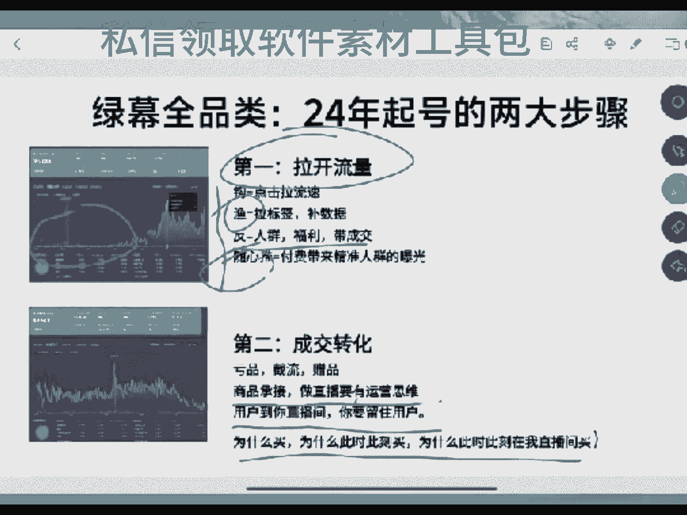

好吧，在这里所有的家们，如果说你们想去做一个账号的话，想去起一个账号一定要注意啊。我给你们说说我们的直播公式啊，就是说我们自己啊说起来容易赚难。所以说你要去实践嘛。抖音里面去所有的东西都是要去。

我跟你说啊，嗯所有的家人们，我跟你们说一个点啊，嗯在这里大家一定要有一个认知什么认知呢？就是直播带货这个东西它不是搬砖，不是说我去啊每天定时定点去上班，然后把这个东西搬起来，不是这直播带货不是搬砖。

他所有的东西都是有思路的懂吗？他都是有思路的，如果说你们去做直播带货，你们都想着跟干苦力一，我今天早上我只需要我只是每天我这个定到点我去开个播，然后到点到到下播间我下个播，我每天周而复始的去做兄弟。

那你不要去做直播带货，你这个思想思路都是错的懂吗？直播带货他不是搬砖，懂吗？兄弟们，这点咱们直边家人要明白啊，他不是搬砖，他不是说啊我只要去这样去做，他就可以了。他不是这个意思，你一定要想办法去干嘛。

想办法去。把你流量破开。做直播的其实一个核心前提是什么？它就跟着我们是在什么？我们在我们在开了一个门店一样，是吗？嗯，兴趣电商的一个核心含义就是我们开了个门店，然后有很多人能路过你的门店。

天南地北的全国的人，他能路过你的门店。但是你要通过从从这么多人里面去知道吗？找到你的目标人群去拉住你的目标人群，这个是难的懂吗？所以说一定要打开你的认知啊，不是说啊我比我比我咱们比刻苦，比努力。

你能把账号做起来了，没有方向没有方法的，你不要说努力，你搏的都是运气，就算是让你把一个账号拉起来了，你的账号也不你也稳不住账号，其实就这种绿木作品的直播间，很多新手上门去做直标播的时候。

他们都稀里糊涂做出来过账号，他们都稀里糊涂做出来过账号。但是他就是因为一个点，他稳不住。比如他一场直播卖了个几K，但是他最后账号废掉了，他连自己为什么会为什么出问题的原因，他都找不到，懂吗？

这是最难受的一个点儿。所以说咱们直播间所有兄弟一定要明白啊。你们想去做直播带货的家人们，在我们想去打直播，我们想把直播间播播起来。兄弟们啊，咱们想把直播间货播起来，兄弟们，你一定要清楚这个点啊，好吧。

好吧，没有给我点红，家的能不能帮我点个红心啊，帮我点个嘴鼻子都磨破了，能不能帮我亮亮红心，没有点卡灯牌的家人帮我卡盘子，好吧嗯。没有卡牌子的，家们帮我卡个牌子。아。啊。连麦聊的。等等过几天连麦聊聊。

过几天我肯定要连麦聊聊的。我过几天我先把内容讲完，等我讲完内容了之后，我到时候跟你们连麦。但是为啥现在不连呢？又换号了，兄弟最近没有播，都播这俩号，你看我不爽，可以帮我弄吗？嗯，帮看帮我点个红心好吧。

我没有换号，只是前段时间没有播，我断了有个一个多星期吧，没播播，然后这几天又播了，那么这几天又播了。感谢你啊，兄弟。😊，兄弟们给你们说一下起号啊，咱们来说一下起号。刚才跟你们讲的是打法玩法。

给你们讲讲起号啊，兄弟不套路你们啊，今天在直播里面真的给你们讲一讲东西啊。嗯，我们去起号的时候，我自己做起号的一个核心是什么？就是我要去做两项分配，分配就是时间和。和数据这两个分配我要去做。

然后通过时间和数据的分配，我要去做三项递增。就是说时长的递增，就是我每一场直播间的时长递增，还有每一场直播的场关递增，还有每一场直播间的数据递增。其实兄弟们起号，如果说你们直边的流量口是打开了。

你但凡是有一点点方式去带你的直播里面很好起。那么自然流去起号，你是必须得去做递增的。怎么去做呢？兄弟们，我跟你说我们的两项分配和三项递增的含义是什么？我来我来以这个参考数据值来跟你们说好吧。

兄弟们如果说咱们打比方说你一个星号开播，你一场直播一个小时，咱们以一个小时去计算啊，一个小时我们能有100到300的场关平均场关200多的话，对不？流都没有自然流我刚才说要拉，你不拉自流肯定没有啊。

今年平台做直播开播，他必须得先拉自流的，先拉先去拉转话先拉拉子的如果拉的话就行。如果你不拉的话是不行的好吧，如果不拉的话是不行的。所以说你。新号上来了，去做直播代货不拉，我们打不动啊，我们打不动，好吧。

没有吗？好吧。我也我不会去连等，回头吧，回头我告我问他们，我让我的运营，我让我的运营给我说一下这东西该咋咋嗯，这这这这麦克风咋去连麦啊，要不然我听不到你声音。所以说兄弟们星二开播，咱们来我跟你说说。

我我们跟我来跟你们说说我们是怎么播的。我们每一场如何去做数据分配的，如何去拉时长的，如何去做递增的，好吧，兄弟们。嗯，如果说我们一个小时，现在有100到300多多个场关新号绿布多品，咱们来说多品啊。

兄弟们多品直播每天要播几个小时。兄弟们记住啊，我多品类的直播间和单品不同。因为你没有主播能力，那你就一定要比单品播的长。如果你是单品的直播间，你一新号开播第一场，你只需要播一个小时。

但是如果说你是多品的直播间，兄弟们。如果说我们是一个多频的直间，那么我们星二开播第一场，我要播2到3个小时。其实我是以3个小时为计算，3个小时为计算的话，兄弟，如果说你一个小时推将近200人。

那你3个小时最少是600人。如果说你一个小时推100多人，那你3个小时是500人。所以说我们的综合场关的话，大概是500到500到1000。因为你一个小时如果推300多的话。

你你三个小时大概是拉到100人的，对不对？所以说我们星号开播第一场是播3个小时，3个小时的话，那么我们正常去拉3个小时的话，第一场我们该做什么数据，兄弟们知道吗？第一场是以拉停流和拉人群为主。

因为你要撤你的账号流速，我你不开播没有任何人知道一个星号的流速是多少如果说你的账号的天选号可能流速更好一点。但是大部分的账号现在流速都比较低的，所以说我们要先去测账号，先去测一测账号的流速有多大。

如果说账号的流速还可以的话，我播3个小时，我账号流速一般我要播3个小时，要去把时长拉长，那么越推越没人不会那么？越推越没人的核心原因只有一个就是你直播里面没有数据。兄弟，你直播间没有数据反馈。

有数据反馈的话，有依据的话，你的直播里面是会有人的，那么？如果你做不出来数据，你直播里面干那干播，你别说播3个小时，你就是播三天播7天，你的直播里面到最后都不会有人，明白吗？越推越没人的核心原因。

只有一个你拉不住你这边面带动不了。我刚才在前面讲的东西，不管是拉流量的东西，还是让你这种产品的东西，他都是能能可以让你去稳流速的，能稳你流速的。你只要正兄弟，我就给你讲的最笨的办法，好吧。

你能不能在你直播的过程中素屏的过程中穿插点对点，就比如说你去找亏品或截流或买正的商品，咱们去通过这种商品再去拉我们直播间里面素屏的时候，对不对？当我这边面只要是有人能在我直边停留3秒到5秒，这个时。

他只要不走，兄弟，你要明白啊，你这边只要是有人停留，他只要不走兄弟，他绝对不是去看你的，因为你不帅，你不漂亮。那么他不会去看你的，他只会去看商品。那你在直播免去诉品和货品的过程中，你去点他的名字。

能不能去。点他的名字，你3个小时的过程中，你一直去点，你通过这个过程中一直点对点，我不相信你3个小时一个人都点不住。如果说你3个小时一个人都点不住，兄弟，你太笨了，你可以放弃直播待会了，懂吗？

你都不出人，你不出人，跟你这边进不进人有半毛钱关系吗？你这边进人不进人，他跟你不出人，有半毛钱关系。你首播的，我咱就说难片，你我是首播的那种，我首播的，你这边该进人不还是进人吗？

我说的是你的点对点的话术啊。😡，对不对？无人哪点无人你不能点就点，无人，你点个毛线。😡，无论你都都都转入录播了，你点个魔线啊海嗯。短点对点的核心就是为了要互动，懂吗？就是为了要互动，因为有要互动啊。

兄弟，我跟你说，提名字就跑。我跟你说实话啊，提名字就跑了人，你在没有提名字的时候，他都跑了，懂吗？真正你的目标用户啊，我给你真正你的目标用户啊，说是难听点的，你只要在直播里面去聊。

你去喊他就算是他不理你，你点他名称，他不理你。比如说姗珊姐姐，咱们的8号链接，你看看今天老弟新号开播，我们是原通厂家给你安排的福利，你平时在别人商场超市看他得多米，30多米，40多米，对不对？

今天在老弟直播面8。9块啊，你任何你要不你去别人直播里面比一比，你错过，我这时没有这店了，他只要不走，兄弟，他不理你，他也可能去刷到8号链接，为啥，因为他要看看这个东西到底是啥，到底是不是这么便宜。

懂吗？他要看一下。你如果说这个人不是你的目标动数，我说句难听点的，你都不点他了都跑。😡，Me。抖音你去说，你要明白，你只要是真正去做主播的新号开播的时候，那么你的直播间里面只要是0到30人的。

所有的去教你去做直播的，他都会让你去点对点。0到30人就是点对点的过程，你就只能去拉拉点绿点的目的就什么？就是拉你的互动，拉互动是为了拉停互动加停流是放给你前期去放推流的原因。

只是多品的直边里面在你去拉互动和拉停流的时候，你过程还有一个什么拉点击，还有一个点叫拉点击，懂吗？因为我在书屏的过程中，我就通过这几个商品的过程，我是可以去带动直边的点击次数的，点击次数停留加互动。

这三项数据是能给你破开流速，给你拉伸流速的，懂吗？好嘛。明白了？兄弟。所以说你说人你说你一点都走不去你，那还是那句话，你直播面还是没有留灯的点儿，你的产品架构和你的直播面话术衔接都不行。说白。

我跟你说啊，你点3个小时，你10个人，9个半9个不理你，他总有一个人理你的。当有第一个人理你了，那么就会有第二个、第三个、第四个懂吗？0到1，我意思是说0到1的10到1的0是最难的。

一其实代表着你的账号已经起来了，一已经带着你的账号起来了，好吧。没有了。阿海兄弟阿海兄弟能帮我点个红心吗？阿海。😡，能不能帮我把这个上点个红心啊，兄弟。😡，唉。可以吗？不会素品不会素品学。这不会那不会。

让你做直播带活干嘛？你做直播间货有啥意义？那你有这心思，你不如放弃，咱没事打两把游戏，咱没事出去吃个小烧烤，咱不比这强吗？😡，😀哈呵。😊，感谢阿海兄弟的支持，对不对？咱没事儿，咱咱咱咱学不会了。

咱就咱就打个游戏放弃吧，你心常，因为带货者黄业不适合你。😊，好吧。😊，所以说新号开播第一场啊，那么就播3个小时，3个小时的过程中，第一，你知要测账号的流速，看你成面满流速有多大。第二个是什么？

第二个是什么？你要去干嘛？你要去嗯去拉你的那个什么拉你的人群去洗一下人群。所以说前面的时候一定是点对点去拉你的权重的是吗？还要过风控，因为账号前期的风控，权重是比较低的，所以说我要过风控的嘛，这这。

第一场播的很轻松，其实你没有必要去纠结转化。第一场你有转化就转化，不有转化就算了，但是一定要去拉流速。第一场的核心目的就是拉流速口子，懂吧？拉你了段口子，好吧。干不了放弃太难了，放弃吧。所以吃没事。

我说你有这你有这晚上在这直播间趴着纠结的心，还不如现在出去找个夜市，弄个哈皮吃个小烧烤，然后弄的半饮半醉的回到我家往床上一躺。一拉日子过的不比啥爽，对不对？比这强啊。所以咱直边所有兄弟啊。

第一场播2到3个小时就可以了，撤你的账号第二天的么播4到6个小时，4到6个小时的话，兄弟，如果说你们第一场只要是能按照我们的要求去来去打。那第二天你的流速是有的。

咱们的流速是一般是以第一场你的场关数一般是以你第一场啊，第一场的那一个就是说你的直播间场关总和，然后呢去往上升的。所以说如果说你第一场拉到了1000的场关。

那么你第二天你的流速应该是以你的场关是应该是1000起，然后最高他是能换两倍的，1000到3000懂吗？因为你第二天如果说你第一天播两个小时，你是拉300的场关，对不对？300到400的场关。

那么你第二天最少拉4个小时的话，你最少也是能干多场。你能干到800到1000的场还，这是一个翻倍，对不对？但是我不建议你这样去拉，因为你为了一个点为了破层级。为了破成级，好吧，所以说第二场的话。

我尽量是播6个小时，第一天播3个小时，第二天播6个小时，6个小时的话，我第一天3个小时。如果说我能拿出来100的场关的话。

我第二天是最少能拉到2000到000的场关的兄弟你要明白你第一天的成绩在多少在一级流量池里面，第一天你500到1000是在一级流量池里面，第二天你1000到000。

你是在D级流量首先这个你已经选择了你已经破的成级了，你的直边里面场关成绩是已经破了，咱们破不了在线成绩的。像这种直边你是破不了在线成绩的，你知道为什么？因为主播能力太弱你不是单数品单爆品的方式去打。

所以说我没有办法去破场关在线成绩，我只能去破场关成绩，场官成绩就是很多人跟你们说的SABCDE这种成绩吗？

咱只能通过这种时间去破好吧第二天我们去播播6个小时拉1000000的场关的话你还是按照昨天的节奏，但是随着你第一天如果说你第一天真的去做点点去拉你的数据的话。

你第一天的只要是有人理你那你第二天的人群进度是绝对。大于第一场的这也就是为什么说很多起号的时候，我们不能一场直播硬拉时长。是因为你这一场直播就算做出来再多的数据，你第二天平台会给你无限放大这个数据。

那么？你数据做的再少都没事。你只要有好比说你第一天拉出了三个给你互动的，给你去互动的人，给你去做关注的人，或者说给你去做一些别的东西的人，只要是有了你第二天平台会以这三个人会为基础会放大的，知道吗？

再给你们说一个点啊，你知道我们嗯你现在不是很多家们直播间里面没有留宿吗？我跟你说，我们学员里面有一个人去播怎么去做的时候，他第一场播3个小时的时候知吗？在他播3个小时。

他直边面在一个半小时到2个小时之后，他直边前期也是不怎么推溜，但是一直点绿点，前期在在一个半小时到2个小时的时候，你知道他直边怎么了吗？他的直播间里面有一个大姐进来了，跟他聊了半个多小时。

聊了半个多小时后非常开心啊，没有下单没有下单，但是非常开心。在他聊了半个小时的过程中，这个大眼的聊半个小时过程中，他又带动了另外一个人跟他互动。他直播面单场做出来的互动互动的人啊。

除了这两个好像还有两个，一共4个人，但是这场直播直播边流上口子没有开，第二天开不直播直接开流量口子了。所以说一定是通过数据反馈，先先去把数据做出来，平台才会给你获取推流的，好吧，你第二天你播6个小时。

你晒数据赛过第一天呢，你的成绩也破了，成绩也破了吧。兄弟，那么你在直播的过程中，平台第三天的时候，你去播10个小时，你的直播才能往上打，对不对？第三天的话，我们去我们的直播最少要达到C级流量池。

那么你拉10个小时的话，你的直播面最少是3000到5000的场关。你的人群只要一出来，你是绝对有转化的，你的转化数据肯定是有的。你不要相信他没有你就是亏品给买正的商品，或者说你用那种低佣的商品。

在直播面一直放，你都不止出一单，这我说的。😊，好吧。但是你要是图懒，你不去说，你不去带不行。所以说这三项我这三天的一个数据模型，是不是我通过通过时长，对不对？通过时长去带动了场关的一个递增。

通过场关去带动的一个数据递增。你第一天500到1000可能给你做数据的人很少。你第二天能有100000兄弟，绝对有人给你做数据，并且还不止一个人，你第三330005000兄弟。

你是最少最少能干出来数据的。对不对。所以说你们从开播的第一天起，兄弟，你要大大大脑里过一个什么东西啊？就是说我要自己要播多长时间，我自己根据自己的时间先去决定第一场播多长时间。

然后根据第一场播的多长时间去决定第二场第三场播多长时间，这是你要去做了一个核心点，懂吗？这你要去做了一个核心点，你必须得把这条路走了，要不然后你播不起来，懂吗？兄弟们，要不然你不起来。

所以说时长时间的分配和顺序的分配，是从你起号的第一天起，你都要在大脑里面已经把它给预分配好了，除非就是账号出问题，要不然你要按照这个模型去打，好吧。这就是我们三场去起号的一个核心。

通过三场去带动直边的流量。还有啊一定要结合我刚才跟你们说的那些东西啊，就比如说拉流量的东西和那一个做成交的东西，只有结合这你们在直播里面才能去把这三场做。如果这三场你只是拉个市长，只是拉个市长，兄弟。

你该起不来号还是起不来号，为啥？因为你没有数据，懂吗？因为你没有数据，好吧，但是要跟你们说一下一个点，就是绿木这种直边的，我们绿木这种直边兄弟，咱们这种直播带货的核心是什么？

你要明白绿木和多品类的直边和那个单品类的直边是不同的。就是说我们这种直边兄弟，你是不看签次的啊，不看签字的，因为签字决定的是人群的质量，人群的质量。就说你的签字越高，你的人群能购买的力度越大。

它能消费100块钱到200万商品，这是签字的作用，好吧。但是绿木这种直边我们是属于多品类，也叫全品类的直边。我们这种直边不看签次，让我们看什么呢？怎么去你们要明白啊。

绿木这种直边我们是看停留互动商品的曝光商品的点击，包括商品的成交密度签次像这种直边里面大概做出来说，你的直边签次都是300多都是300多左右，正常直边的签次，你搭的高的话也一般是在多少。

一般也是在了一个500多都算是顶分的。为什么说这么低呢？是因为我们这种直边成交的大部分商品啊是以几块钱和4亿块为主的，我们是靠商品密度去拉开的直边？你的直边里面分钟成交率是一直有的，你的分钟成交率越高。

你的直边流速越快，明白吗？你可能一分钟你卡了壳，但你下分钟去看你像成交的三单5单兄那你直边面流速绝对是大的。所以说绿木这种直边我们要考核的数据和单品是不同的，你不要看签次，你不要去看什么UV价值。

你看不了没有意义的。我们这种直边看了什么就是停留。绿木的直面停留的时间能干多少，你知道吗？绿木的直边停留的时间是能干到一分1分到两分半的，就是基础停留时间是一分到2分半，那么2分30。

我见过最高的一个停留时长是多少是2分56秒还是5几秒，这是我见过最高的那么？吧，还有这然后第二就是商品的点击，咱不要去看商品的点击率，看它是没有用的，看商品的点击啊。

兄弟们点击什么就是你有一万的场关有8000的点击到1万的点击或1万多点你的人群转化比是非常好的。你一万场关能干到8000到1万点击，你是最少能卖70007K的，吗？这是真的不信你试一试。

如果说你一万的场关，你现在只有说只有3000的点击，那直面是没有转化的。如果低于3000你的直面人犯了一批都不会推流你的流量都是很次的那吗？如果说你是有500点击的话，你可能刚出的话，刚出人群。

所以说咱们这边所有群弟要明白啊，绿木这种直边我们考核的东西是不同的好吧，所以说一定要分。听好你们做直播的数据啊，以这5项数据为主，拉停流，拉商品的点击，拉互动，然后去做商品成交密度，互动不用去拉。

当你的直边流速上去之后，跟你互动的人会很多，为什么呢？因为你问你问你问题的人会很多，明白吗？问你问题的人会很多，好吧。所以说这就是绿木啊，绿木这种指标我们所有人所有人去做的一个核心啊，对吧？

这是绿木这指标我们所有人去做的一个核心啊，这样的一定要明白啊。好吧。是。明有吗，现们。有问题的可以在公屏上把你的问题飘在公屏上啊。😡，有问题的可以把你们问题屏在公屏上。

根据前面这一场流量的分配去来做去来做这什么呃，去来做这后面的这个三场的一个螺旋。通过这两种方式去带就O可了。家人们好吧，通过这两种方式去带。你能把你的指标做起来就可以了。嗯。好以了吗。

把问题飘到公屏上啊，有问题在公屏上聊一聊。兄弟们有把问题飘到公，有问题在公屏上聊一聊，咱们把你们。好吧。啊，兄弟们。有问题的公屏上说索，没有给主播点红心，家人点点红心啊。相互交流一下，好吧。累了是吧？

我也累了是吧讲的讲的讲到现在直播间里面不咋推牛，你知道我现在播了两个多小时，你知道我直播间闯关多少吗？兄弟看你不爽，你知道我直间闯关多少吗？饮料最近也不好打，我靠，饮料现在流量那么爆，就刚开始的时候。

兄弟，你都没有看过刚开始就现在在直播间里面还在趴着呢，去年可找了一个学员天涯，他打这两天打了几个饮料号了，昨天第一天打了9万的节目，没昨天打了4万，刚才我开播之后，来了直播间了之后。

直接说他直接说打了5万，今天打了5万，卖了5万了，现在还在直播间趴着呢，天涯，你说不好打饮料现在好打，饮料现在超好起的这个赛道好吗？嗯。我说饮料有一个爆款的场景啊，兄弟，你知道吗？你知道那个爆款场景吗？

你找一找那爆款场景嘛，你把那爆款场景找到了之后，然后你去跟那个场景吧，那场景热度很大。好吧。那你就打呗。好奇。没点红心，家帮我点个红心啊，是新人的啊，老人的刚刷了我的也帮我点一点啊。

我这老号重启第三场啊，账号不推流啊，我现在播了两个多小时了，在直播间里面才多少才200多个场关都给我播崩都给我播崩溃了，你知道吗？对对对对对，你有是吧？那你打呗。可以啊。嗯，你的问题是啥？没有直播推荐。

怎么减？我刚才说的，没有直播间，先拉流速啊，先先把数据做出来才会有直播推荐。现在平台想要直播推荐，一定要先有流速。今年所有人对企号都是这样，今年所有人都起号都这样。

你要么就是通过数据去先把数据打出来之后，然后平台会给你推流，对吗？平台现在不会先把流量给你了，以后平台也可能不会了，平台经历了6年的直播发展，你知道吗？6年直播发展，现在流量是越来越近的。

都不推人没法互动啊。

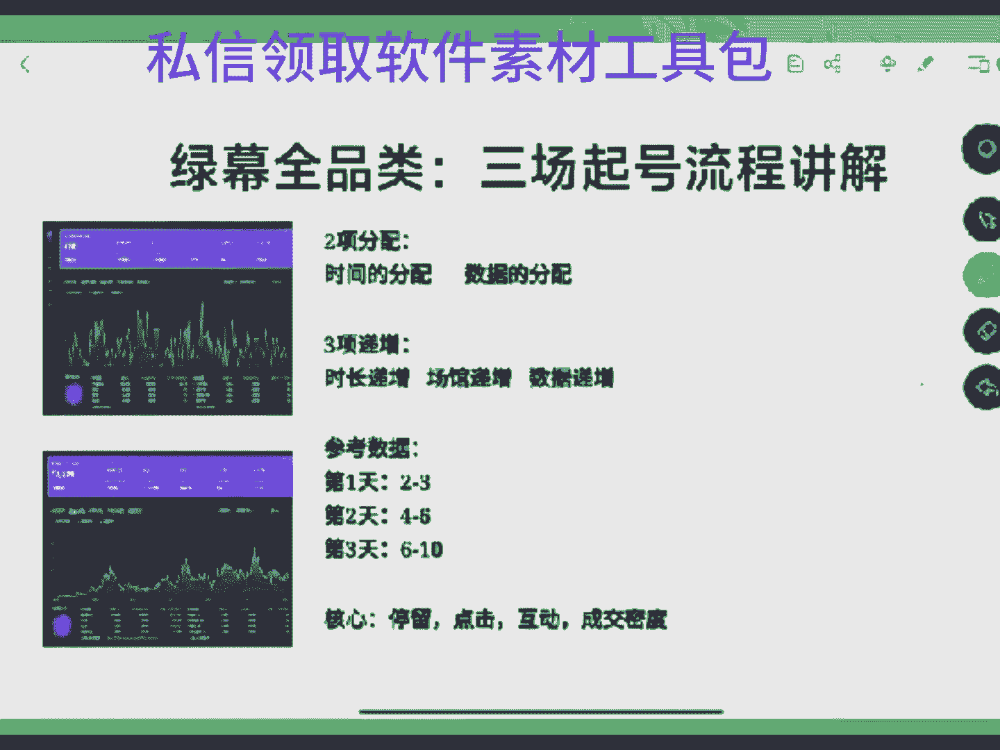

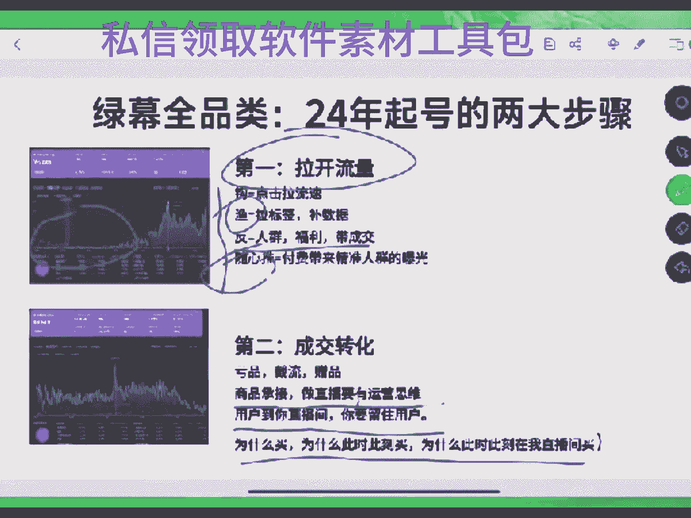

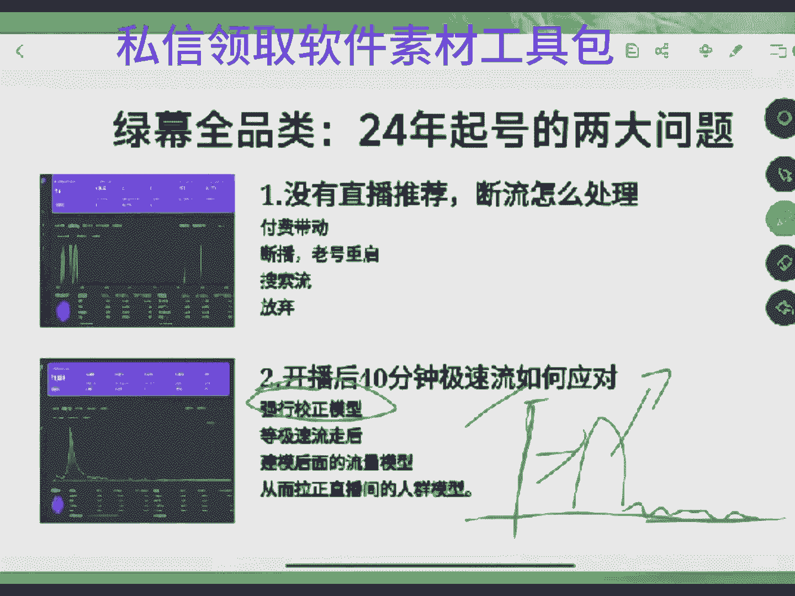

你一我跟你说你我不知道你一个我不知道你的场关是多少，兄弟，我跟你这样说吧，当下平台如果说一个小时给你100到300的场关，哪怕就是直播推荐只有百0到百20之间，你的账号就是正常的，你账号都正常。

你要去拉好吧，你要去拉啊。如果说俩小时50人俩小时，52小时不行，账号风控了啊，你去查一下那个阿海，你去查一下什么，你去查一下你的曝光，看下人的看先看一下你的曝光，你的曝光。

如果说是有个500到1000，那么你两小时再进501个小时才进25个人，那么你的直播里面就是场景有问题。你场景不吸引人，场景不留人，平台把你的直播间展现在别人面前，但是别人不进，你要去先去看看这。

如果说你现在一个小时只有2小时100多的曝光，兄弟账号风控换号，这是账号风控，这真是账号风控啊。

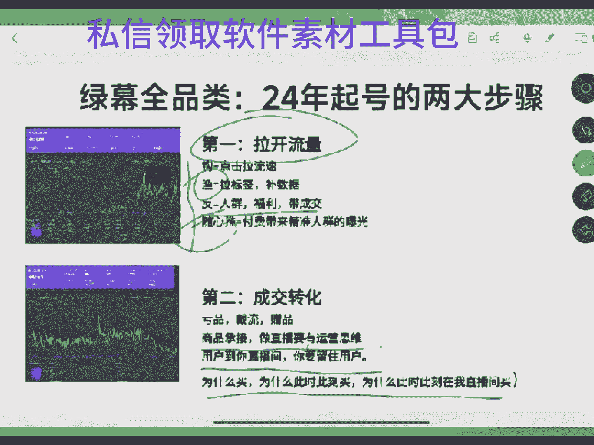

换号吧换号吧啊。我们正常现在正常现在去播一个小时，不说300多场关吧，但现在一个小时弄个200左右的场关是没问题的那么？你这账号流速太低了，真拿不动啊真拿不懂。是新不管是新人老人了，没有给主播点红心。

帮我点个红心啊。我这老二重启第三场，帮我做坐去好吧，兄弟们。流速太低了，我拉不动了。100多的曝光不行啊。100多的曝光，说实话，你真播不了。嗯。基本上这个号是。嗯，我我给你个建议啊。

要是还没有嗯断一段时间吧，断完之后好好去养号，认真去养一养，养的深一点。养完了之后，然后再再半个月一个月之后去拿真拉三场了，拉三场不行，这号废了啊，号废了，好吧。你星号开播第一场多少的多少多少的曝光。

😡，你向日发播第一场多少报告？去年。嗯。下日开播第一场你都要曝光已经多多场了都有曝光，查一查知道吗？嗯。老二重启了吗？是老二重启的是吧？老二重启了这种账号正常啊。

老二重启现在平台如果说你原来你原来养号不行了，或者说你活跃不行的话，平台对这这种账号是直接会给你限流的，他不会给你太多流量的。怎么？换个吧换个吧。换一个吧。换号。起一个重新号，认真这个号重新去养一养。

认真养一拧，然后起一个重新号就可以了，明白吗？这是你要去做的。如果说你不这样就你你像这种账号一个小时25个闯关，说实话。播他的意义是他给我说一下。那还你都跟我现在去拉一样。

那我现在还能坚持去拉的动力是啥？就是因为我责任里面至少还推一点牛。我一个小时，现在多少，还有多少，还有个一个小时，还有个100多的场关。我现在播了两个小时，21分钟了，我现在是285个场关，我都在看着。

知道吗？我都在看着兄弟，你知道我播的多累吗？😡，这场官都是一个一个的蹦的。我但凡我说实话，我但凡直播里面能拉到能拉到500的场关，我直播里面也能拉到30个人了。哎呦，太累狠了，不往外扩流。

我我都不知道该咋拉了，我都给我干懵逼了，你知道吗？我不就最近的人间起起断断七几断断嘛，你也不能这样给我推流啊，这给我推流推的是啥了也。诶。他但凡是能给我来个500500多500多的场关。

我也能干到30人在事了。你都累啊。是。没有点红心家帮我点个红心啊。好吧，没有听到前面内容的，明天来我这边听我前面内容啊。Yeah。这直播推流都是咋推的，这都是个位数的推的，这慢慢的哎，我的乖乖。

起买推荐我的流量推荐还是还是什么直播推荐的进度才多少？才鸡才鸡巴百分才60%多。哎，我的我的账号直播推荐才进入60%多，你说我咋拉拉不动，真咋的账号不推流，不放牛，那都我都不知道他咋玩。好吧。

再所以说咱们直边所有兄弟啊，拉号吧拉号吧，谁都在拉号，不拉号不行啊。不拉号不行，好吧。有问题在公屏上跟我说一说啊。😡，护卫投六能讲吗？可以讲啊，那有啥不能讲呢？Ning。星号开播第一场能投兄弟。

星号开播第一场都能投阿海。但是你投的话要去看两样东西啊，一个是投放时间，一个是投放节点啊，一个是你的投放时间，一个是你的投放节点。这两个东西决定你的付费会不被压制，会不会稀释，你知道吗？

如果说现在你们的直播间流速特别低的话，没有自然流的话，你现在去投的话，你要去投12个小时，听我的12个小时啊，不要投太短啊，一定要投12个小时。如果说你有自然流自然流流速太低的话，你要投6个小时。

你可以去投6个小时，切记记住，不要去投一个小时2个小时的，你知道为什么吗？因为一个小时两个小时。如果说你们这种投放时间的话，你的直播间里面可能你的转化，你的你没有好的商品去承接你的主播转化在一般的话。

他容易直接把你的直播间的流量干废掉，彻底断掉，吗？他会把你干成一个重付费的直播，你不付费了平台就不会给你放流量，明白他意思吗？所以咱们这边说我兄弟一定要注意啊，好吧？前期选择计划时是自定义。

在你们投完之后投完投到后面就是选择自能，在你的计划模型跑金种之后。

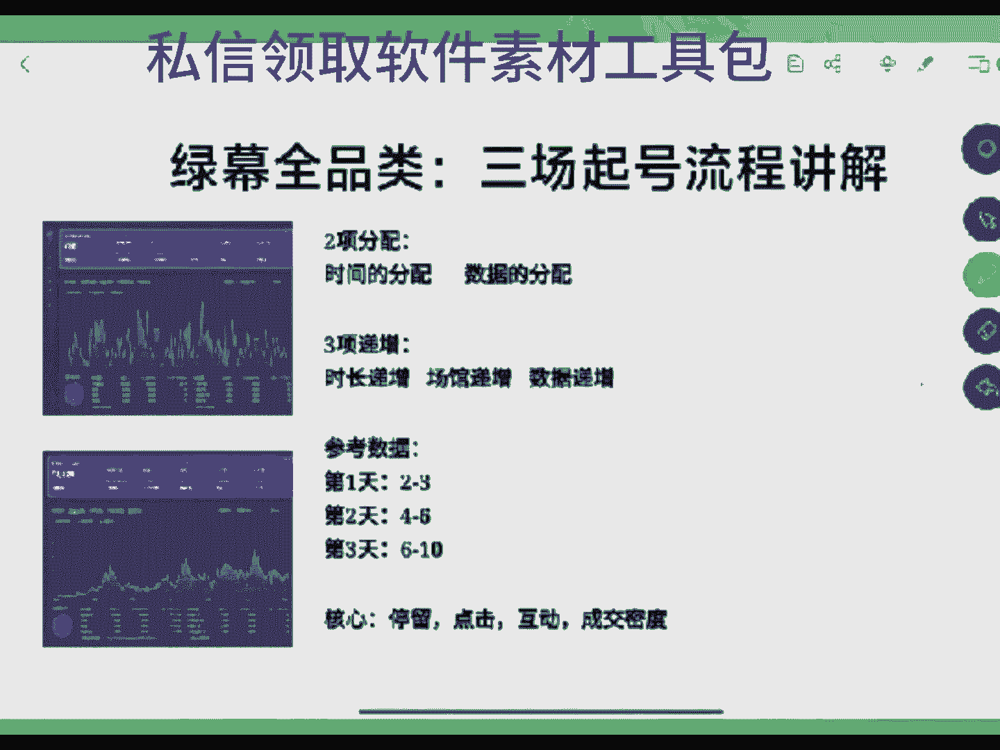

再选智能就可以了，它是有区别的，好吧，啊明白吗？前期选择自定义，后期选智能，好吧。如何铺设计划，就是跟先先去前期铺一笔，先铺一笔去拉稳定，拉完一稳定之后，然后再可以在第二场第三场之后补第二笔第三笔计划。

那么啊前期先去制做一笔。但是我们所有的计划模型是托底去打的，托底去打的啊，兄弟。好吧。计划其实简单，很多人投计划投失败的原因是什么？

就是因为你直播里面你的直播里面那个投放时间和投放投放时间和那个投放节点不对，导致你们随银堆变成了随银亏啊。好吧，你不是有我助理的方式吗？有助理的方式，让助理给你们发一份这个随心推的投放方式啊。

文档版的资料啊，课件啊，自己去看一看，好吧，自己去看一看。他能给你安排一不？没有点红心的家人帮我点点红心啊，点过红心家人，让助理给你备注一套话术啊，话术素材打法玩法那么？这一套我给你们安排了，好吧。

就是一套文档版的课件，有三长起号的一个流程，包括随心推的投放方式，还有十几个类目的话术，包括十几个类目的素材，就场景图片，都给你安排了。好吧，兄弟们有需要的点点这里点个小红，小红心点一下。

然后申请加入粉团，我的助理费跟你们说怎么去带走啊，不要你们一毛米啊，兄弟们直接去找我的助理去拿就可以了。啊，兄弟们。不要你们一毛一米，直接去找我的助理去了啊。是新人刚来直播的。

可以直接找我的助理带走这一套话术啊。话术素材打火玩法供应链，一对一的给你们安排了，一对一的给你们安排了，好吧。有问题的可以在公屏打出来。有问题的公屏打出来啊。两个小。两个小时播了两个小时两个半小时的。

直播间里面还是才推了两还不到300人，不过快到300人了，还差5个人都到300人了。希我推流速度慢慢，兄弟们。嗯。流速太慢了。哎呀，啥时候能我不要求高，什么时候能让我推500闯关就OK了。推500闯关。

我都有动力，能拿到多少，能拿到能拉到那个嗯三小三四人在线，然后慢慢慢往上破层机，我都有动力了，这流速太低了，你看播了两个半小时再给我推了将近才300个人，平均滑下来一个小时才推了100多人。

你看这数据做的这数据咋做，兄弟们。我自己都头疼，他咋做，对不对？有问题的公屏上飘出来啊，把你们的问题飘出来，咱们聊一聊。好吧，把你问题飘出来，咱聊一聊。付费。付费一定要注意注意节点。这没有人问问题。

我也感觉累得慌。难道是我直边长景不留人，还是我这张老脸不留人呢嗯。查查抖音连接。兄弟们。还有人有问题没？有问题在公屏上飘出来，把你们的问题打在公屏上啊，咱们交流交流啊，把你们的问题打在公屏上。

咱们交流交流啊，我来跟你们说一说。😡，What。是。零食还能做吗？零食能做啊，零食也零食他怎么可能不能做呢？他能做，但是你起零食的话，你要你要用的方式会多一点，小奶瓶儿。嗯么你起零食的话。

你要需要用到的方式费多一点，你不能说是干起啊，临食一定要有套路的，亏品是临时必须要去打的。好吧，因为临时这个赛道的话，它它的付费原量占比在40%，你要抢量，知道吗？你要抢亮的奶瓶的帮点个红心吧。

奶瓶的猫把这招号点个红心吧，奶瓶。啊。能不能帮我把这个账号点个红心？兄弟没有听到我前面内容，那明天来我这边听我前面内容，好吧。感谢小奶皮的红心啊。我看人家临时没有人1000多人，没有人1000多人。

您是干的家具是不是家具也需要付费啊？因为家具是属于四季品啊，像现在四季型的商品的话，不付费是很难强调的。所以说像这种这边是必须要付费的，好吧。临时1000多人还没有人，临时1000多人。

临时1000多人不会许打没有人的。1000多人去打，没有人的，他就是废号了。他这种账他就是自己去搬起石头砸自己的脚了。兄弟，我跟你说实话，做临时的直间里面能干到1000多人的账号啊。

能干到1000多人在线账号，他只会一天打一场吻化去打了。因为他这个账号可以给他给他展现的价值，知吗？是无限大的是无限大的。像这种账号只要是不出意外的话，跑个半年，跑个半年到一年是没问题的，懂吗？

半年到一年的话，它的GMV和它的一个结果，他能拿到的结果是非常重的。明白吗？兄弟，虽然做临时已经达了那么多了，你去打个没有人，1000多人那还打没有人的，他我这个人肯定是脑袋有坑的，那都不能去做，懂吗？

明吗。是。再加上当你的直位里面破千人的时候，平台是会加重对你的审核的。我跟你说啊，如果说你真的拉到你的上千人在线的直播间了，兄弟，你都不可能再去做歪歪门邪道了。当你的直播间不说拉到上千人。

你能拉到不能破260，你的账号能破260，那么这个账号你就要小心小心再小心的供着去打。你要你要把这个账号的流量吃到底，你每天播一场稳稳当当的要让这个账号给你拉出来最大的转化，才是你最核心的。

你再打那些歪门邪道的，说实话，兄弟，你真是得不偿失，懂吗？他真是得不偿失。因为他可以你这个当然你但凡能播一个月，兄弟，你能播一个月，那这一个月你能得到的结果就是你今年一年的结果，懂吗？明吗。正常情况下。

一个能拿到300能破260的账号嗯。前几名挂的都是交嗯那正常你所有的账号，我跟你说阿凯啊，你所有的账号只要拉起来了，都会有一些都是有一些就是说那种我说难听点吧，就是割韭菜的，他们不去做辣子。

他们就是挂头像挂教学的。但是你又不能踢，你踢的话，他可能会举报你，他可能会批量找人找账号来举报你。所以说你还不能踢，他们挂这种啊，说实话他就是。基本上都是哥的，因为他没有去，他不是像我这种。

我们这种叫见人设的嘛，所以说我会去把我的人设打出来。然后呢，通过一个我因为会嗯这做这种的话，你像我做我这种，他得天天播，我天天播的话，我要去见我的人设。我不可能把我的人设能崩他。

但是那一种他是没有人设的。人他就是挂直播间里面去拉引流的，他既然挂直播间面去拉引流的。兄弟，你要明白啊，他在直播间里拉引流，你要你要懂一个点。如果说你去找他们的话，找他去学的话。送先说一笔米。

那么李会觉得你那道为什么李米李会觉得他这个这边拉起来是是他的那吗？还没休息，拿了号兄明，豆总没休息，豆总没休息啊。啊，到是没休息啊，所以说咱这边这样呢。没有。刚破300的场关，所以我才拉一拉。

有问题在公屏上说一说，咱们聊一聊。好嘛。嗯。预埋现在很强，预埋是啥？密埋是啥，我不知道，我没有看明白，兄弟。没有点红心家的帮我点个红心吗？家人们没有点红心的帮我点个红心吗？

点个红心的家人有问题跟主播说一说。好嘛。你们看有个03200多人在这一个小姑娘就卖不了万，除了。嗯，这个除了付费之后，还有一个小时就卖了两付费多少。你要看它付费比例多少，小奶瓶。你要看他付费比例多少。

如果他付费比例占比不高的话，它有定的。临时的话是我给你算一下啊。临时是10%的佣金。白色的有你。百0的佣金的话，付费40啊。付费40的话，他大概会投10001000左右了。

他投的100他投的有500到100的，他有佣金，但是佣金没有那么高了。他卖两个W，他能挣2K，2个W是2K2K的话，你自己算一下嘛。如果说他是500。500到1000的一个付费比例的话，它有利有利种啊。

预埋的方法。兄弟，你这个可能是新的东西，我真的不懂这个东西我真不懂。要不咱不在这里说，你你私底下跟我说，好吧，咱咱在别的地方说好吧。开播之前兄弟们开播之前不要投啊。如果说你是一个那个新号啊。

新号不要在开播之前投，因为你不确定你这边留速，开播之后就投可以了。开播之前投没有意义啊。真人在播10002000人这种被举报是不是？你说他不会他不能扛揍，他能扛揍你知道吗？像100多人在这的直播里员。

你至少是能扛住。看你的账号权重。如果说你拉出来很长时间了，拉了有10天半个月了，你能扛100个人举报，就是说你能扛住100个人，甚至100多个人举报，懂吗？但是如果你像我们这你就这样跟你说吧。

你100个人在线啊，你一场直播10个到30个举报，10个到30举报，你都能扛住。星号的话他不行，星号的话它只能扛他只能扛几十，他只能扛10个8个举报是没问题的。一二十个举报也是没问题的。

但是多的话估计不行，多的话估计会有会被提示。超过30个以上可能会被提示了。星号，如果是老号的话，他不会他不会被他不会认一两千人在这直播间证权重很高的，你认你去举报他，你单独一个账号。

两个账号剩18个账号就点，他们都点不动的。那么？你都点不动的。他一般不会被举报掉，他不会被抬。如果说你你知道你知道如果说你1000多人1000人在线，如果有人举报你的话，你这边会出现个什么结果吗？

就算是你没有被你没有你不出违规，但是你的成绩会下降，你成绩会下降。比如说你现在直边员是1000多人，你被有一有100到200人举报你，你可能会从1000多人掉到300掉到500掉到300嗯。

一场五十几个举报，五十几个举报不多，我们昨天就开播，哎，前天就开播的时候，我们拉的账号播了一个小时，我们应该账号播了一个小时，还有50多个举报呢，并且还没那么多人就只有三0多人最还干50多人举报啊。

有人蹲我们了。懂吗有人动我吗？好吧，兄弟们。什么内幕那么多举我说很多类目都有人举报，你，不是什么类目，很多类目都有人举报，你知道吗？为什么会举报呢？其实就是一个点，因为现在你知道吗？

抖音现在其实今年它的流量机制是发生了变化，很多人现在都遇到问题，他做不起来，很多人都遇到问题，他做不起来在他做不起来的时候，那么他他都觉得我做不起来的原因，可能是因为别人的举号，同行的恶搞。

可能是因为这或者说有些账号他今天有流量，他明天后天没有流量了，他就会首先想到是不是有人举报我。如果说这时候他发现有一个人举报他都会放大。那么啊举报多种保镖有用有用啊，兄弟啊。就像是我们那个学员嗯那吗？

刘文兆报了是吧，刘文照报了跟了，单品就跟嘛。就像我们那个学员，他的账号，他的账号都已经播一年了，但是最近让人举报掉了，让人举报坏了，让举报坏了之后，然后他就用了保镖，保镖是他啥吧。

他是说是昨天的时候还有4个人举报，他今天播到现在没有看到人举报，保镖能挡。我们党에不 하지吧 응。对，换号就行。你要做矩证的话，就换号就行。兄弟啊，不用他了。好嘛。控制不住的东西。

像这种东西都是控制不住的，没有办法控的，明道吗？兄弟，我跟你说实话，我播我这一场播到这，咱们直播间的家人都是都是兄弟了。我跟你说，跟你们聊一聊，我播到现在，我刚才查了一下，我今天都还有一个人举报我。

知道吗？我今天就还有一个人举报了。你说恶心不恶心？你知道我被人举报的核心原因是啥吧？我被人举报核心原因就一个，你知道吗？就是有很多是啥吧，有很多是嗯一些小白。然后呢。嗯，一些小白打了吧。

他们做直播带货什么？他们有些人报名，跟别人去学的，跟别人学了之后，他他被人割了一刀。割了一刀之后呢，他呢觉得全网里面所有人做的都是在割。现在基本上全网里面所有人去干这的啊，基本上都会被举报。

没有被举报了，并且也违规都违规，你知道吗？所以说现在就男人这一点。嗯，做直播带货的人多了，平台的流量架构不好了，你需要提升的东西太多了，懂吗？像原来那时候你可能稀里糊涂就能把账号做起来。现在的话。

你要提升的东西太多了，你怎或上抠的东西要细太多了。平台以后会越来越严越来越完善。那么我们说难点就是平台会越来越完善。那么我们再去想去做直播带货的话，想从直播上去建立点东西啊。

你要你要去了解的东西或抠的东西是要比原来要你原来可能稀里糊涂都能拿到结果。现在你先走的话，门槛要提高很多了。所以这就导致了我们现在去做直播的话，咱们直边所有兄弟啊。我们现在去做直播的话，就说难听点的。

可能我们要了解的那对于新人来说，他是不友善的那既然说对于新人来说，他不友善的话，你们能想想，那很多新手他觉得直播带货简单，他看他别人能说出来做出来了，他跟着这个人，他也是说出来做出来。然后呢。

但是他没有拿到结果，他首先不去想想自己该怎么去提升自己他想到的是什么，就觉得我被套路了，我被割了。所以做直来货一定要有一个认知啊，抖音已经越来越完善了。你真的其实说白了你嗯与其让人后悔。

你为啥不想想你早几年来做呢？你如果说21年你去做的话，你闭着眼睛都能起，对不对？什么时候宣传？你现在这个点就做了，你肯定要承担现在这个点的现在这个点的那一个平台的一个点啊。是不是兄弟们？没点红心。

的帮我点个红心啊，家人们啊都亮红心了吧，都亮红心了是吧？都点过去。那就。举报让他举报。对，无所谓。对。其实很多账号都最做不起来，它何炫因，你知道吧？咱们直边说过句你很多账号就做不起来了。

我们账号播不动了，没有办法播了。核心原因就在一个点就在什么就在于同行直播了。你辛辛苦苦播了一个账号，播了半半年，播了一年，对不对？你辛苦拉个账号，你扛不住同行啊，同行一下给你干的多了，你咋弄，对不对？

你一天你你的账号现在防举报的一个原因，只有一个就是账号存就是你的你的账号权重，但是账号权重它是拉出来的。但是你你一天能扛住，两天能扛住，你扛不了3天5天啊。

你如就算是刚才说那个兄弟说一秒一秒一秒才能在线的，一秒在线。如果第一天的话，你有100多人举报你，你没事，我能扛住。但是第二天第三天连续三五天就100多人都是100多人举报。兄弟，他账号都废了。

他账号都绝对毁了，知道吗？说没办法，你这东西。好吧，抖音里面现在各个类目举报的人都炒作的是吧？我跟你说实话，我们前几年做那小类目，其实我们最近那么打了一个小类目赛道，我感觉还可以的，挺香的。举猫真厉害。

现在。开不了播，真的开不了播，他妈的。好吧，来，家人们啊没有领到我们的话术的啊，话术的一套的话术的、家居的、厨房的临时的车品的等等一套的话术的啊。嗯，没有领到我们的那个素材的，还有就是呃三床起号的流程。

包括随堆的投放方式，文档版的这种课件的，家人们啊，没有领到的，点头像进粉团，让我的助理给你安排一份，怎么领取我的助理会在粉团里面发个小小小息，然后里面直接带走就可。按照这个消息的方式直接带走就可以了。

不要你们一毛米啊。兄弟们是新人的，好吧。同行好不容易起个号不容易，我们不我们是不举报知道吗？我也希望同行报同行报的话，我们才知道该打什么品。你个人的运营思不运营思想是局势局限的，对不对？

那同行做起来之后我们看他都起来，说明这个品质有热度，咱们都能跟本，这是好的。但是现在哎。难啊，对不对？好啦。还有问题没？兄弟们，有问题在公屏上跟组说说，把你们的问题飘到公屏上啊。没有问题的话。

我就我没有兄弟要没有问题，我就下播了啊，我播了2个小时，40多分钟到现在才300的闯关，总算拉到300的闯关了啊，兄弟们。今年今天还可以但支持啊。没有听到前面东西的啊，明天来我直播边听我前面内容啊。

到时候来直播间的家人们7号家们可以互盘啊，明天跟你们互盘啊，到时候聊聊。好吧，今天就先到这里了，家们好吧，你们都早点休息吧，咱们明天聊好吧，兄弟们。

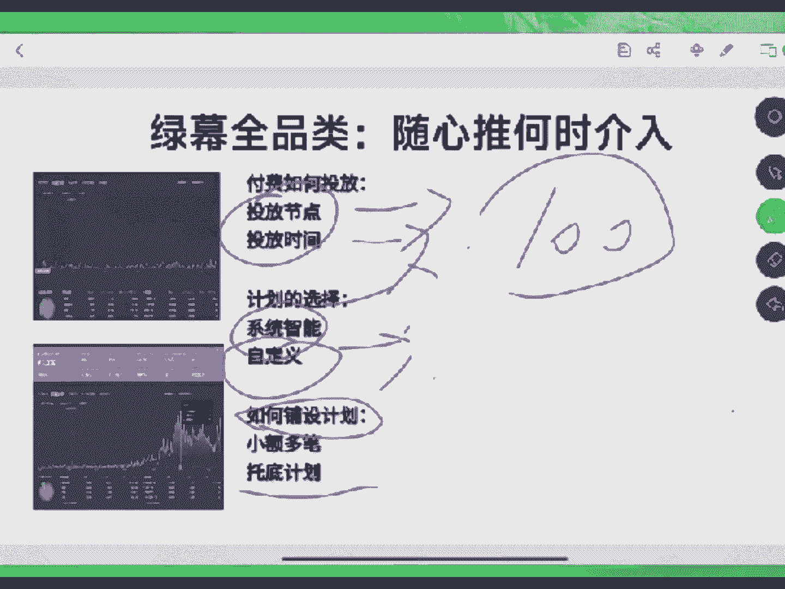

拜拜了啊拜拜了拜拜了拜拜了。😔。