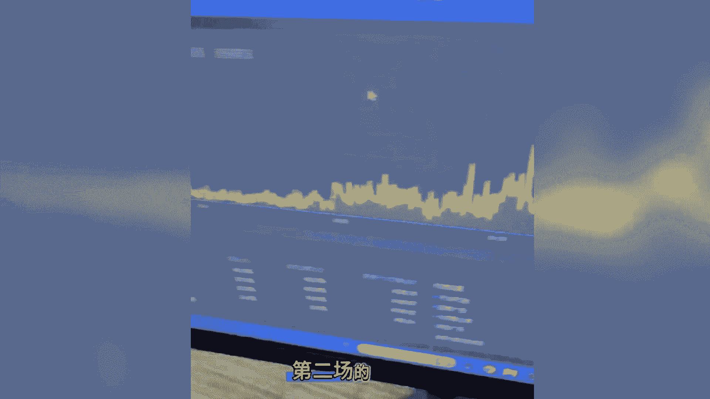
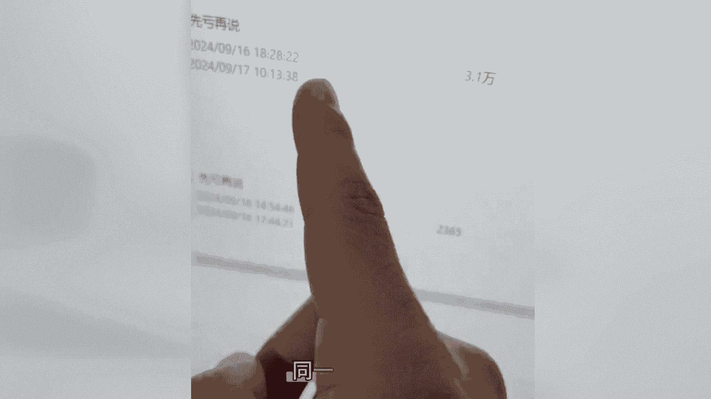

# 无人直播的起号节奏控制 - P1 - 云顶联盟-无人直播 - BV1CPtYe4E2E

兄弟们闭体的方式测出来了，给你们分享一下哈，要播两场也是跟以前的逻辑一样，做叠加，第一场是14：54分开播的呃，17：44分下播的两个半小时，我们目前测的是第一场呃，播3~4个小时，让搜索流量。

就是我们直播间的人货场不会太差的情况下，搜索流量会出单好，第一场3~4个小时，如果能出个卖个三四百，我这里呢两个半小时卖了680啊，卖680，然后呢这第一场的时候给你们看一下数据。

第一场是打了一点点随意推，但不纯随意推哈，有一点点啊，随意推推流速度特别少好吧，打了一点点微付费的，然后卖了680呃，直播推荐也出单了哈，直播推荐也出单了，搜索也出单了好，然后开第二场，隔31分钟啊。

兄弟们31分钟一定要31，不要只用30分，30分，31分钟过后开第二场，第二场看一下，打开是大屏二，第二场卖1万1哈，卖1万1，然后呢流量来源看一下纯自然流，第二场不投了，纯自然流卖1万1。

然后好看一下这个违规记录，违规记录目前呢是零哈零，然后信用分还有十分，还有十分啊，我给你们反过来镜头给你们看一下，这个视频有可能会涉及这个呃，宣传高收益有可能被下掉哦，给你们看一下，你们记得点赞。

收藏起来，31分钟开第二场啊，那这个是第二场的啊，第二场的纯自然啊。

额成交成交占比可以看一下，成交占比呢是零付费，直播推荐占比40%，搜索占比40%，然后呢随心推付费全部都是零好，全部都是零时间看一下好，点开这个时间给你们看一下，时间是呃，9月16号啊，就刚下播。

现在是9月17号啊，记住哈，31分钟来看一下这个数据，看一下数据，第一场第一场，第二场看时间哈，看时间第一场是播两个半小时，同一天播。

第二场好，第一场先做叠加，第二场很好播，我们测出来目前是这样啊。

不要一下子全全程拉十场，所以哈如果说你新号开播，第一场直接拉时长的话呢，起号周期比较长，先播个三小时下播再播，第二场起号速度会很快，第二场的话一开播就能维持二三十人在线，然后我们做的是低空飞行的直播间。

没有高在线，我们直播间一直是维持30~50人在线的，是这样的，相对来说会比较稳啊，所以呢也没那么容易被抬走12分啊，你们如果想了解更多这种玩法的话呢。

