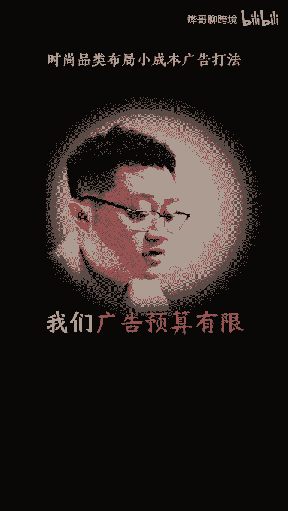
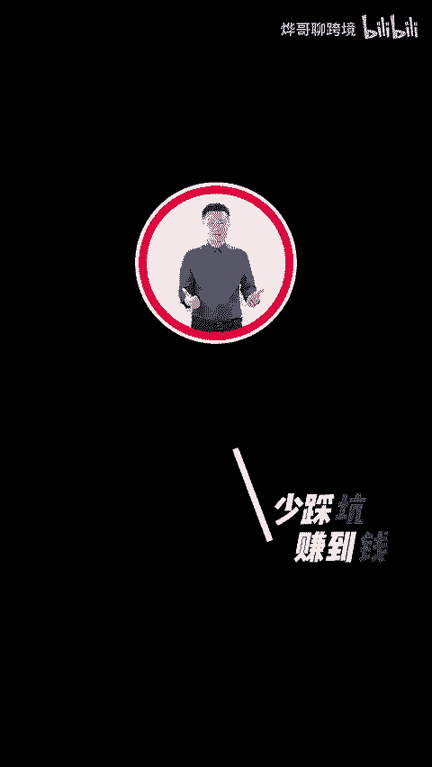

# 时尚品类布局小成本广告打法 - P1 - 烨哥聊跨境 - BV1afy3YMEWJ

🎼你要的是更多的曝光机会和点及进入的可能性。你不靠高价里面去做竞争。如果产品布局的时候，这个品类适合F对于进营做这种打法的时候，一定是把你的广告向低，你的广告预算是有限的。为什么这么说呢？

你基本上靠的是更多产品的曝光机会，不货打法的核心的东西是产品的。每一个产品都有曝光机，进入到你的旗舰店以后，你是通过不同的产品引来流量进销到旗舰店去选择了所有产品。

核心爆款的打法呢是通过一个流量进入以后成交在这一个产品。但是你是要成交在100甚至200个产，这是你应该去做的事情。这是的一个布局的问题。你如果每一个产品都开0。58的广告是承受得住的。

如果你是广告预算非常足，一定没错，高开高打一定是拿机果达的最快。但是我们想要小成本进入广告砍一半，由0。58砍成0。290。3砍一半，它还是有曝光的，你不要去打首页曝光位，那你的产品放在三亿。

🎼足够时尚品类打首页，那是非常有钱的一种打法。但是时尚品类你自己分析你的购物习惯。你去买一个服装，买一个视品，你会不会返至少5个页以上。你不可能只看了一页你购买它跟其他的产品的属性不一样。

我买必需品的时候，那可能我一页两页有做决策。我买服装的时候，是不是至少要返5到1页左。但是你的时尚品类，大家更多的是愿意给看多翻，你可以把价格放在0。3居中价。然后你拿5到10页的广告页足力。

自己有足够产品的开品牌广告。那品牌广告所针对的核心是什么？是进入以后有选择，花高额广告费的目的是引流到流量进入旗舰店。但是旗舰店你得给顾客提供更多的可选性。你的品牌旗舰店的广告，它的价值程度最大。

又是一个能帮助你提升亚马逊销量的一个好内容啊。我找官方给大家要到了详细的广告品牌手册很全很详细，需要的伙伴评论区666。我是叶哥，带你在亚马逊上少采。

