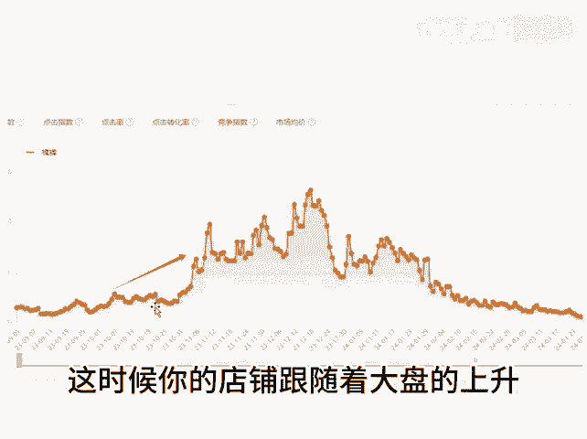

# 旺季到来前的店铺操作 - P1 - 千优电商教育 - BV11v4FePE81

从10月份开始，很多行业将进入销售的旺季啊，其实你可以看一下大盘，很多行业都是从10月份开始起流量，在11月呃进入正宗的旺季。那么在旺季到来之前我们应该怎么做给到大家这样的两句话啊。

如果你录局的早批量测试，录局的晚批量跟款。那什么叫批量测试呢？如果你是非标品需要大量上新，上新后呢，统一操作，怎么统一操作，比如说报活动21365啊，9。9块的日常上新。

然后其他的一些杂七杂八的大促活动，总之你上新的链接啊，要同时这样的操作，你可以每天上5个啊，你也可以每天上一个或者两个。然后呢把这些链接批量的开车测试，每个限额100保本或者利润出价啊。

目的是找出数据好的链接，其实这种就是测试。数据好的链接，我们在做进一步的拉升。如果是标品倒也简单。那么你把你的同一个产品。😊。

一个类变，五个链接啊，五个链接呢，然后和非标品一样测试所谓裂变就是标题尽量不一样。SKU不一样，价格不一样。主图尽量不一样。然后呢你测试测试找出数据好的链接把它拉升啊，在旺记到来之前，行动越早。

其实越容易爆单。为什么你行动的早，那么在前期积累权重，当有流量进来的时候，有句话叫大盒有水，小盒买吗。这时候你的店铺并随着大盘的上升也会上升。我是讲师大牙，欢迎大家扫码添加我的微信。

不方便扫码的朋友可以添加我的微信号，80221430。在这里给大家准备到了一套新手运营入门的大礼包，希望能够帮助大家。😊。

