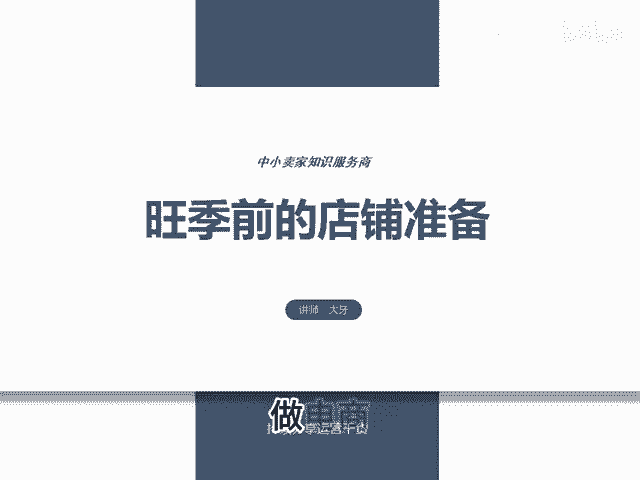
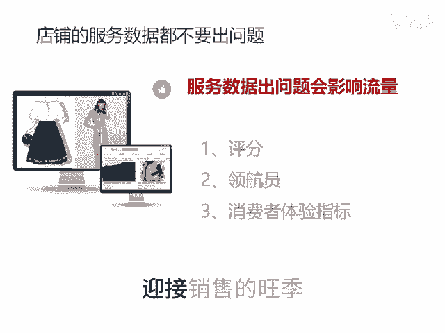

# 旺季前的店铺准备 - P1 - 千优电商教育 - BV18y2mY3E69

做电商其实我们知道下半年是旺季，下半年呢还有三波这样的销售高峰，双十一双十二年货节，下半年可谓是一步错步步错，一步好步步好。那么如何让我们自己的店铺在巅峰状态迎接销售的旺季呢。其是我想说呢。

现在呢准备呢还不算太晚，它有两种模式，第一种是单品打包模式，这种呢比较适合工厂店，再一个是全店小爆款群模式，它比较适合你没有自己的货源，你就往自己店铺里面上货，那这个货该怎么上，其实现在你需要做的是呢？

就是批量的测试，多上链接，从一个链接呢裂变出10个。原来和大家说嘛，裂变出5个，你现在呢需要裂变出10个多裂变，以便迅速的找出有爆款属性的链接，裂变出来之后报上活动，像什么213659。

9块日常上新或者其他杂七杂八的一些活动。如果呢你有明显的价格优势可以报百万爆款。当然如果你的产。😊。

没有明显价格优势，并且走强付费模式就别报活动了。那直接裂变，然后就开车测试。车子的出价呢，现在可以保本出价，你看哪个跑得快，再晚几天到20号左右或者11月份，那么一律按照利润出价。

因为在11月份我们要盈利。那时候就不要再再这样测了就卖一单，我们要赚一单的钱。当我们测试出来之后怎么办呢？多开店以及裂变链接，那你测试出之后，它有一个销售好的链接，这时候呢，你再把它裂变5个链接。

因为你每裂变一个链接，它就多了一份获得流量的可能，然后呢再多开店，再是重样以上的动作，然后就多开店多开店呢，你把它也是多上链接。不过呢就是把原来店铺里面的爆款链接拿过来裂变或者直接上在整个销售旺季之前。

我们要做的是尽可能的多上链接，以便获得更多的流量。还有一个注意事项，就你的店铺的服务数据不要出现问题，叫什么评分领航员消费者体验指标这些数据。😊，只要低于同行的30%，那你流量呃腰斩再低呢限流。

在这时候呢，你一定要维护好服务数据，让自己的店铺在巅峰状态迎接销售的旺季。我是讲师大牙，欢迎大家扫码添加我的微信，不方便扫码的朋友可以添加我的微信号，80221430。

在这里给大家准备到了一套新手运营入门的大礼包，希望能够帮助大家。

