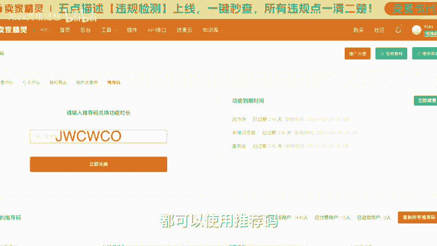

# 旺季前设置亚马逊Prime折扣和优惠券 - P1 - Alex跨境随想 - BV1gDsoeYE9X

大家好，欢迎回到爱丽丝跨境所讲。今天是2024年的9月27号星期五，在中国的朋友，还有明天、后天两个工作日就进入7天假期了。😊，呃，亚马逊秋促呢会在太平洋夏季时间的10月8号凌晨12点开启。

所以大家开班当天下午开始的就是为期两天的prom秋促。那同时10月份呢是Q4的第一个月，呃，也算是正式进入旺季了。那亚马逊的广告竞价呀，销量这些都会开始同比的上升。很多人会说熬了一年终于等到旺季到来了。

可算是能赚点小钱了。那还有很多卖家本身就是做季节性产品的，他只做这几个月。那背后提醒呢，咱们前一阵子说过，那这时候再反过来讲已经没有任何意义了。所以这期视频呢我们来呃针对于新卖家。

小卖家去聊一下prom折扣，还有优惠券。当然还有呃很多新卖家遇到的折扣叠加，像折扣叠加超出目标设定这种事情，在新卖家里其实出现过很多很多。呃，我相信大家很多人都见过一夜之间，所有产品被秒光。

亏个底掉的情况。所以说说这些可能针对新卖家更实用，更接地气。那首先说prom折扣价。那这个价格呢是亚马逊面向自己的prom会员显示的prom会员查看卖家设置了会员价格的产品。

那不管你是在搜索页还是在详情页都可以看到，至少低于原价10%，最高打到产品两折，也就是能优惠到80%的那么一个prom价格。😊，嗯，消费者可以直接用这个价格购买商品，不单独收取卖家的费用。

那这个prom价格呢，我其实建议所有卖家设置起来折扣要求在特殊的节日期间会有变化。你比如10月份亚马逊的秋促开始首次收取提报prom day折扣50美金的费用。

那同时他要求你最少优惠15%以上你才能提报。但是平台呢肯定是可以分给你一些prom会员流量的，有专属的标识等等这些隐形的福利。那至于必须是新品，不能是成人用品，要三星以上的评价，或者你压根就没有评价。

那这些条件我相信呃99%甚至以上的卖家都能满足。那唯一的缺点呢，就是prom价格必须低于这个最近30天的最低价格。同时呢它也会影响秒杀价格。那如果是常规的产品没有大幅调价的空间。

我觉得这个缺陷呢我们可以忽略不计。那否则呢就应该使用优惠券进行相应的促销了。那接着呢我们说一下优惠券。😊，优惠券呢允许最低5%的折扣，最高折扣50%玩法其实要比prem折扣要多。

你比如可以直接投放给某一个asen打多大的折扣或者是多少钱的折扣。那也可以为订购省的买家提供折扣，还可以设置重新下单优惠券为老顾客提供购买的折扣。那最大的缺点呢就是需要每次都付60美分的兑换费。

优惠券最低预算呢可以设置到100美金，那算法跟大家举一个例子，因为这个有点绕，那平台会把优惠给消费者的这一部分视为你的促销预算。那比如我售卖一个产品，产品原价20美金，我投放了5美金的优惠券。

那么消费者兑换购买以后呢，平台就会按照5块钱优惠，再加6毛钱的兑换费用去计算整体的优惠券预算。所以100美金优惠券的预算，大概可以销售17个，而不是我们正常理解的100美金除以0。6。

大家知道算法设置正确就好了。那简单说完prom折扣和优惠券。那我们来说一下呃，叠加优惠。那这些内容其实很重要。如果设置错误，很可能会让消费者0元购1元购。那咱先一句话总结。

那就是优惠券是可以跟任何的促销活动叠加的，包括但不限于秒杀7天秒杀prom折扣啊，企业价格占外促销等等。比如秒杀价格优惠30%，优惠券呢优惠50%，那就会在秒杀的价格基础上再去打一个5折。

比如你一个产品原价100美金，你秒杀优惠30%以后呢，就算作70美金了，那优惠券再打一个5折，所以最终消费者可以用35美金买走你这个产品。所有计算其实都是在原有折扣基础上再去叠加优惠券的各种折扣的。

所以大家在使用优惠券促销的时候呢，呃要格外的留心算出最终的成交价格。那很多卖家最立竿见影的省心方法就是优惠券避免和其他大。😊，服的优惠共同使用。比如呃我在做7天秒杀的时候，我就直接暂停掉我的优惠券了。

那需要注意的是呢，优惠券的停用并不是及时生效的。当我们点击了停用按钮以后，已经领取优惠券的消费者仍然会有半个小时左右的时间去使用这些优惠券。那同样优惠券的生效呢也不是及时的。

创建完成以后的几个小时才能生效。官方说法最快是6个小时。😊，上期视频呢更新以后，有朋友跟我私信问视频里介绍的功能是否可以免费的试用，当然可以。大家免费注册卖家精灵以后呢，点击右上角的头像，点击推荐码。

把相应的推荐码兑换一下就可以了。卖家精灵的绝大部分功能都可以使用推荐码，免费使用30天。我常说先尝后买不上当嘛。付费买效率还是免费用经历都没有错。仁者见仁吧。

我把一些卖家精灵的功能试用码放在屏幕上和视频的描述区，大家可以按照自己的需要自行的去用。😊。

视频最后呢，欢迎您关注爱丽丝话庭随小，我也会经常性的跟大家分享一些针对亚马逊新卖家的经验和知识，期待您的点赞、收藏、转发。如果觉得这个视频对你有帮助呢，也反请您把它转发给更多需要相关内容的朋友。

您的关注和支持，就是对这个视频和做视频的我最大的鼓励和肯定。😊，谢谢大家。😊。

