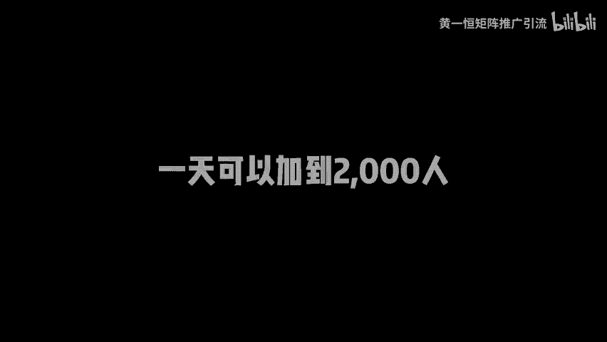
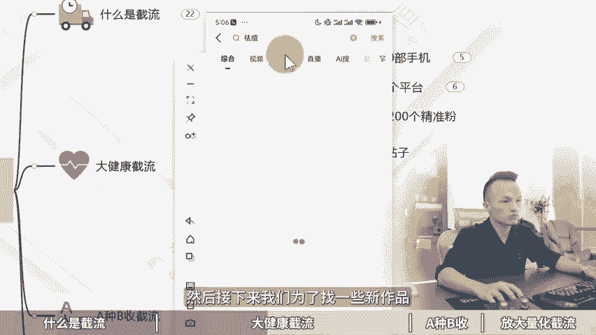

# 最不要脸的截流引流方法，一天可以加到2,000人！截流是什么，同行截流玩法，怎么引流截，流截流获客工具，引流方法有哪些，获客截流系统，截流获客软件！ - P1 - 黄一恒矩阵推广引流 - BV18S411c7o9

🎼最不要脸的失意流方法一天可以加到2000人，甚至更加的狂暴。我说一下，但绝对不鼓励。第一点呢是真的不要脸，不去好好生产内容，别人种下一个大树，他去做蛀虫，这个牛派叫做截流树。

就是在别人的评论区咔咔咔的下钩子，在别人的底牌上面吸血不。第二点呢，威力极大，有公司啊，你00多号截流团队，每人每天截流50到200人不等，一个月导流到失亿30多万。牛真的是非常恐怖。千里之地回忆一下。

季节废话，一个视频给你裁剪，最不要脸的截流引流方法，一天可以加到2000人。视频有点长，记得先收藏，一起来看我给你分享什么是截流，大健康如何搞截牛，A中B收的解流玩法，如何放大量化解流打法。

现在看第一个什么是截流。有的小伙伴对解牛不太了解。这里给大家解释一下什么是截流，用数人账号。

去别的博主评论区放钩子，就称之为截流。这里咱们来看几个实际案例。比如说在我的视频，大家如果多刷几个，看看评论区就能看到很多人在搞截流。比如说卖流量卡的IP流量卡，为什么要买纯流量上网卡。

养号还得是一级卡，这样的话就可以把自己产品推广出来。因为刚好我这个视频呢就是讲到这个流量的，结果下面就有很多匹配的这种截流入口，再来看一个案例，比如这里面有一个做黄金项链的，评论区就有人搞了个数人账号。

这个怎么买，放了张图片，下方就有个小号立马配上，你搜什么里面有的，这就是截流，所以截流，我们是吸引目标客户，然后把目标客户导流到自己实营里面来，玩的比较好的，特别像这个珠宝行业做的是非常的棒。

比如说咱们来看一下，这里面有个熟人账号，我第一个不好看退的，但还好第二个超好看。那么链接的部。报大家看一下下方有多少条评论，有440条评论，是不是非常恐怖？而且呢有56个人进行点赞。

你打开之后可以看到每个人都在求链接，求链接求链接。然后呢啊这个高筒真好看。那么光靠这一个评论就截留上百个人，而且这上百个人全部都是对相当感兴趣，都是什么？精准粉，那截流这么好，到底有哪些优势。

我们一起来看一下。首先截流他适合于所有团队，只要有同行发作品，我们就可以去搞截流，就可以到评论区去放钩子。门槛呢比较低。毕竟发评论的话，你看大家都会没有人说不会在评论区发评论吧，技术含量也比较低。

每天只需要搞个8个小时，然后找到对标作品去发评论就可以了。他主要是依靠人效来稳定。只要有人呢就可以操作，但是做起来相对来说比较辛苦一点，他就像搬砖一样啊，每天得搬评论从早上干到晚上相对来说会比较辛苦。

但是截流有的伙伴呢也有些误解。比如说大部分人做截流，都是基于模糊概念再进行操作，真正理解任何人呢其实并不多。有的伙伴担心说啊搞截流放号严重，账号搞不到，那怎么办？很多伙伴啊信科技花钱去买熟有的黑科技。

结果你会发现买了黑科技之后啊，成本几千块钱，账号呢方号更严重了，平均10个流量就放一个号，而且现在账号特别难搞，像有的平台要跳1名，跳实名你根本就搞不了账号。那这理上怎么去做。接下来给大家分享我们一个。

他做大健康行业是如何做解流的。首先来看一下这个同学，他给团队里面设了操作目标，每个人呢都配了10台手机，所以手机上面我们还得有点成本。毕竟1台手机的话，你得花不少钱。那手机呢还得配手机卡。

手机卡呢一般做解流的人都是配的死卡。死卡也就是我们去办卡的时候都有号段，比如说像什么18151319号段的这种号段的卡呢注作下来账号质量比较高，而且不会跳死名。像比如说抖音的话，如果你是虚拟号段的卡。

像什么17161注册立马去跳死名，你要搞几个账号都让你投的。那实卡这一块，大家可以通过去办听卡，也可以在平台上面搜索儿童手表卡，在操作时候一定要问一下号段是怎么开头的，避免不要搞错了。那有的平台呢。

信号也可以注册，而且没什么限制。那这时候咱们也可以去搞这种虚拟后段，买点营业出助的卡也是可以的。然后每个手机的话至少是操作6个平台，否则啊一个手机太浪费了。

比如说咱们去把这个抖音快手视频号小红书B站西瓜，只要有咱们目标群体的平台都可以给它下载下来。这里咱们每个人配的10台手机，每个手机配的6个平台，相当于一个人搞到60个账号，60个账号提前赶8个小时。

能接到多少流量来，大概每天能搞到50到200个精准态，前期搞起来会比较慢一点。当我们累积一些数据之后，基本上就能做到这个结果好，接下来第二步找目标，目标是什么？比如说我们这个伙伴，它主要是做气痘产品的。

这时候他就会打开平台去搜索气痘，然后找到一些气痘的帖子，气动的内容，尽量来找一些新作品，这块给大家用投屏手机示范一下，我们打开投屏手机在右上角这里面。搜索关键词气痘搜索完成之后，点击搜索。

然后接下来我们为了找一些新作品，可以直接点击视频。在视频这里面呢，咱们找到右上角的这个筛选按钮，在筛选里面可以点击这个叫做最新发布。你也可以选择一天内的啊，这种筛选也是可以的。

这时候你看到作品啊都是在一天之内哎发布的。你想找一些更新的，直接点击上方的这个最新发布啊，筛选一周之内太久的作品呢，咱们就不去截了。因为它的流量已经开始下滑。好，这时候就能够找到很多跟气痘相关的。

这就是我们的目标帖子，接下来第三步发评论，发评论呢，我们要发布有意图的评论，就比如说可以这样发，我也是这么做的，一个多月才好，但有点肿不怎么消肿，特别担心复发。好。

这时候啊我们再发表评论的时候需要做几个信息透露。第一个呢就是我做好了，但是呢有点小毛病啊，不能说的特别完美啊。你说的特别完美。

就觉得你这个啊水分太大了，太假了。所以咱们在做的时候尽量的什么要做真实一点。同时这里面还有一个非常重要的细节，就是我们需要用小号来进行互动。如果你发完之后就不管了，这种人发现效果非常差。

因为当你有小号在下面互动的时候，你知道评论上会得到刷新。同时我们点个赞呢，他在盘名还会靠前，说咱们需要用几个小号在评论区下方进行互动。比如说问一下美女，你是怎么弄好的呀，求助，然后呢再回复一下，好的。

我发你好，这时候相当于我们需要完成个动作，解决问题，并且提供问题的一个方法。这样的话，当其他人看评论区的时候看到哎，这里面我们告诉他。我们做好了，但是有点小毛病，又告诉他我能解决问题怎么解决呢？

你可以来找我。这时候别人看到自然就会到你的主页，然后去联系你。这就是我们做结论的步骤来看一下效果。咱们这个伙伴啊就通过这个方法，流量来比较持续，源源不断的有人失信，全部导致失忆。

一天能做到50到500条。有的时候啊突然某一条评论爆了啊，其实很多人在下面啊求求求求链接，然后呢我也想解决，或者在下面跟你互动，这时候你会发现啊，流量是非常夸张，有的时候一天就能搞几百条。

而且这种方式呢，博主是不会察觉的。因为它是这种比较软的，并不是一上来就直接给对方干一个硬性钩子。这种硬性钩子的话是很容易被有的博主比较反感，有的呢他不管你啊，有的他会直接给你隐藏调。好来看一下。

在我们解奏的时候啊，一定要学会这个A中B收的解决玩法。也就是我们用A账号去解奏的时候呢，这个账号啊，如果流量比较好，就不要去导流失意了。因为导流失。这时候很容易违规，一旦违规，你这个账号挂了。

你前期发的所有评论都等于失效了。比如说你可能做了一个月，这一个月加起来，累计发了200条评论，这200条评评论。那如果你的账号挂掉了，是不是等于这200个都清零了，都要重新开始。所以咱们在做的时候呢。

我们用A账号做流量专门用B账号来接流量，这个啥意思？相当于当我们在做这个导流失意的时候，记住啊是导流失意。这个时候呢。我们尽量的单独用一个号来来接流量，这个号就相当于是个小号，它就是背锅想出问题。

也是B账号出问题。B账号我们可以随时进行更换。所以A账号呀，你要做到不连播。不管你怎么引导，最后呢给你的A账号都没有关系。所以大家可以看到很多人呢在这个什么简介里面艾特小号。

或者在粉丝群里面单独搞个小号引导，就是为了什么做这个不不连播，跟自己没有关系，就是A中B说的玩法。好，接下来看一下怎么去放大量化截流打法。如果咱们想放大来看一下超纵目标。首先我们做几录的时候。

有的伙伴搞一台手机，那肯定是没办法去做很大的量的。一个人呢最少你得配个10台手机。那手机上面我们搞个10个账号，相当于一个人至少有100个账号啊，那这种账号打起来，肯定是比较猛了。然后呢评论方法。

那么每个小时来评论一条，一定要模拟真的评论。有的伙伴是咔咔咔的搞了一个一模一样的评论，一分钟就发了5六条。那这时候比如说系统不删除你，就算是博主看到你都给你删除掉，说以每个小时的一般我们是频论一条。

一定要模拟智能操作，避免啊封号。那10个账号每小时10个评论啊，不断的进行完。相当于我先操作A平台第一个账号再搞B平台C平台D平台搞完之后我再换一台手机啊这再搞当你把10台手机行完之后。

再轮到第一台手机的时候，说实话已经隔了一个小时了啊，那相当于你每天工作8个小时，你的每台手机呢也就是什么最多最多啊轮8次也就搞定了。来看一下打到的结果，这时候咱们如果能够用10个账号。

10台手机配合来玩的话，相当于合计所有平台加在一起100个账号了。这时候我们就可以持续的说到视线添加到我们自己实里面来那么像规模放大来，最好就是用人效来放大。比如说每人啊十部手机每个手机的6个账号。

如果你有的伙伴打的比较宽泛的。比如说还打这种什么社交粉啊或者一些交友粉的那你也可。可以到这种平台去结也是比较不错的那就可以搞10个账号，那每人每天50到200个人。

那10个人的团队一天就能够搞到500到2000个人。那这就上线。好，各位同学，我是黄一涵，只做落地推广方法。刚才给大家分享的节流打法。如果我们想去布局多流量管道怎么办呢？

这里面我给大家准备了18个平台的详细打法，教大家如何布局多流量管道，这些呢都是我原创的，可以通过主页来连体进行学习。如果觉得今天视频不错的，请大家一键三连，感谢大家支持。咱们下个视频呢再会。

