# 最强暴力截流引流玩法，模拟人工自动私信，无限私信，无限关注，每天引流200+精准粉！ - P1 - 古圣科技王 - BV1zDppe2EXH

今天呢给大家分享一下B站的和引流。今天呢有四节要讲，我们先看一下从平台过来的一些进口用户，这些呢都是从平台过来的，还有一些其他平台的。所以呢我们在B站上研究款是有一定的效果的。

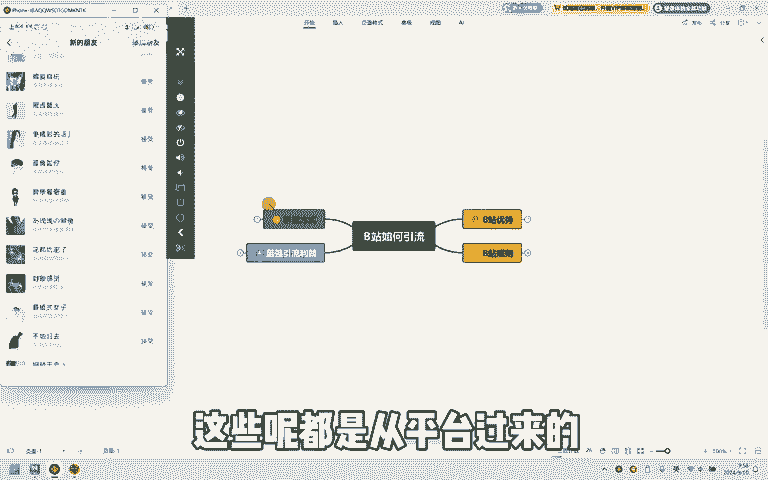

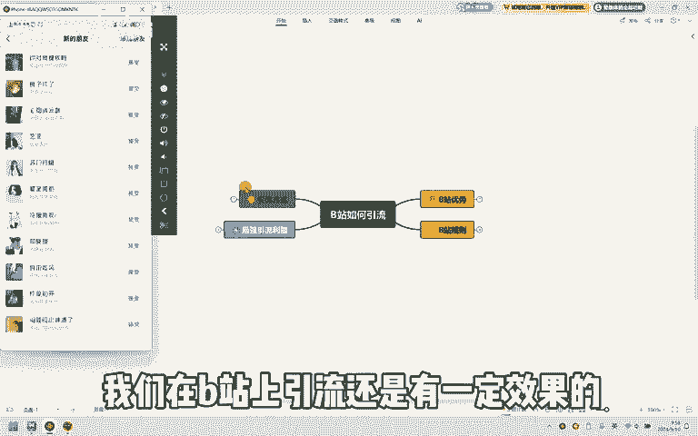

怎么。我们要先知道B站的优势是什么。第一个呢就是排名极高，然后在周率也是比较快的。在百度上搜索的时候也会出现。B站的视频，然后流量也是持续会有的。最后第四个。它也是不排除第三方引流的。然后只要有内容。

你就可以放心大胆的去做引流，就是什么都可以。只要你有内容去发，你就可以把这个内容去引流。然后是不不需要去实名认证的。然后想要学习更多靠谱副业的，可以关注股上学生。这个阶段都是B站的优势。那么我们做B站。

我还要了解一些B站的规则，有4个。

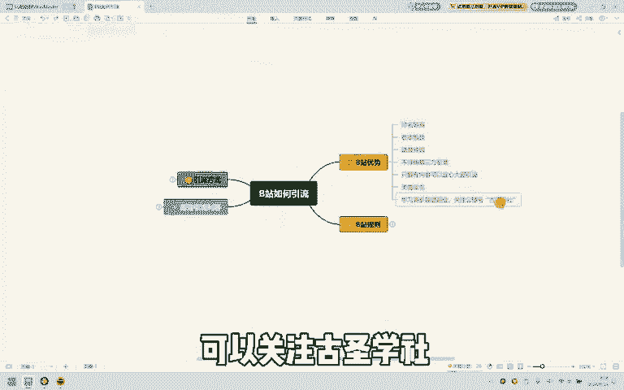

先要摇号1到3天去发布正常内容，去正常互动，然后让教师在模拟真人刷B站操作行为，就是我们要正常的去刷视频，点赞互动等等。那就是输出意思呢就是发不下视频或者是写文章，让平台知道你是在给平台呢做贡献。

然后平台呢就可以睁一只眼，闭一只眼。然后文章跟视频大概在10个以上。

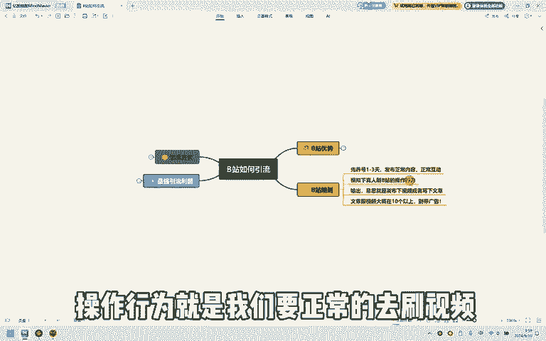

别带广告，就是我们一开始呢先不要去再有广告的去发视频或者是文章。这些呢就是B站的位置。这两个行为做好，然后我们就可以。开始我们的引流方式。那么引流方式怎么做呢？有7个。

第一个可以在个人简介中直接放下影广告，然后。

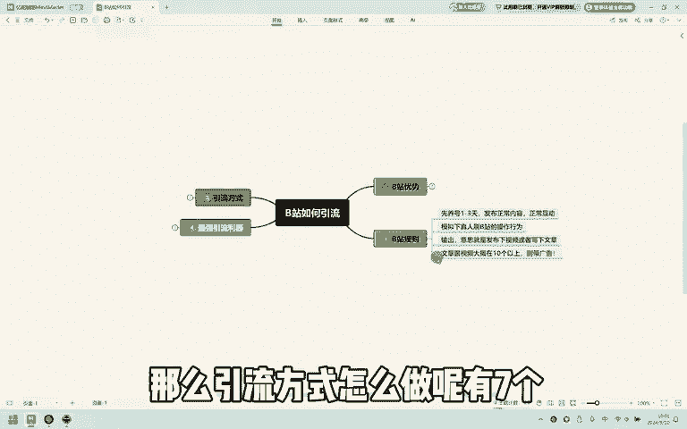

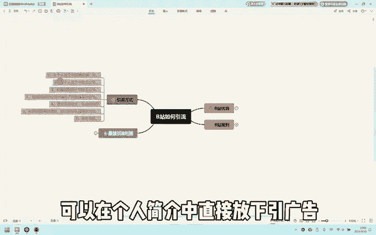

在个人简介中去放下公众号，比如说就是在公众号什么什么可以找到。然后在视频的简介中可以放。然后在视频的评论当中放下钩子或者是某注信号，也就是在视频的评论下方留下勾子。第五个，通过引稿留留言，私信放勾子。

就是比如说发个视频告诉他们在评论区留下666，然后你就可以在评论区告诉他找你了或者是什么的，然后去私信里面留下勾子。

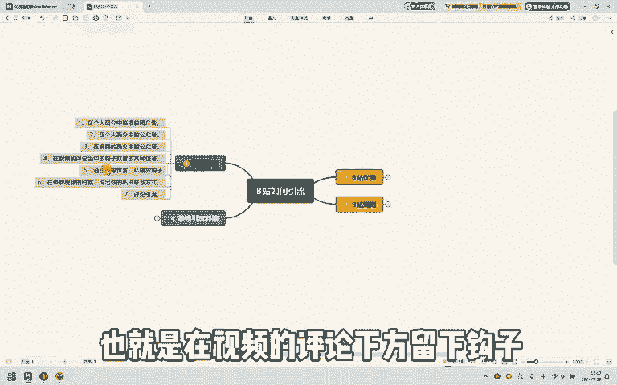

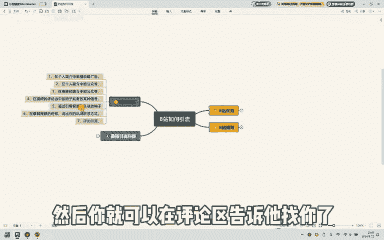

第六个也可以在录视频的时候说出你的私语联系方式。就像刚刚这边就说可以关注什么，然后可以找到我就可以。第七个呢就是评论引留，就是在发布了一个多月的视频，底下也有广告的那种，你就可以去评论它。

然后那些博主呢不会很及时的看到去删你的评论，可以去维持一段时间。但是你要评论里面的时候，不要发布的评论都是每一条都是一样的。然后我们最后呢有一个最强的引流利器，可以看一下，有粉丝关注，粉丝私信。

还有评论区私信，这些呢都是可以自己选择的，还有时间内容，这些呢都是可以自己设置的。然后我上给大家第依一次展示一下。

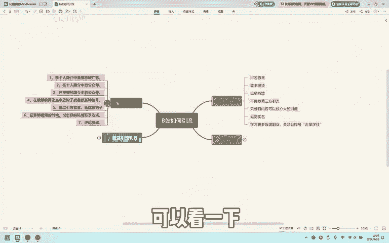

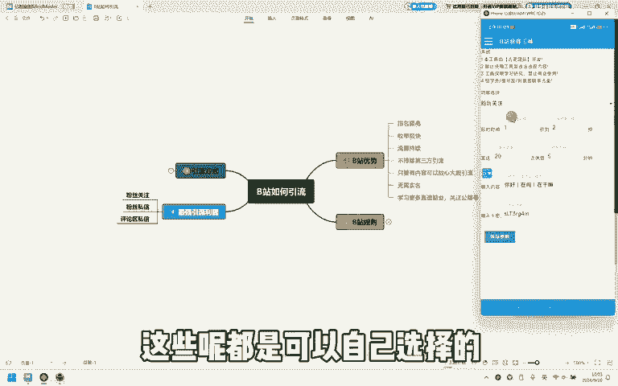

粉丝关注。比如说我们就选择粉丝关注之后，我们去平台。

搜索。相关的关键词，比如说思域找到之后点进主页。

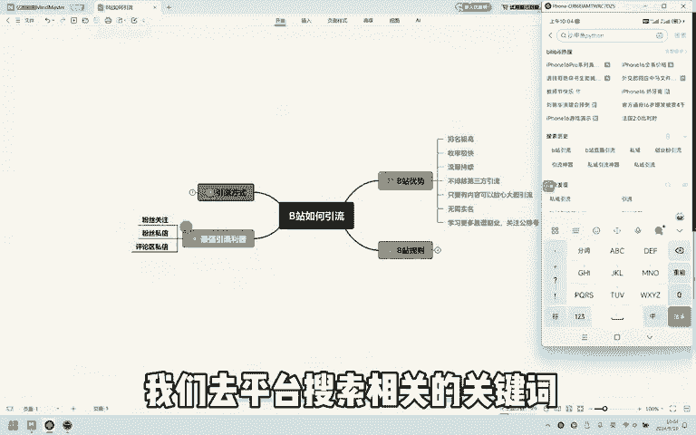

一定要打开它的粉丝列表，它的粉丝列表里面只要不是信号的，就是匿名的那种就可以。然后呢就可以启用的工具，嗯，它就会自动的去点关注。

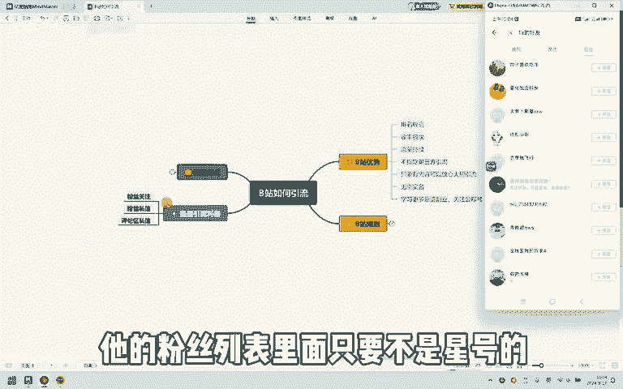

都是模拟人工具操作的，然后这边就会显示你关注的几个用户，这个呢就是转丝关注，还有粉丝私信。

然后你想要哪个功能呢，你就可以把它。

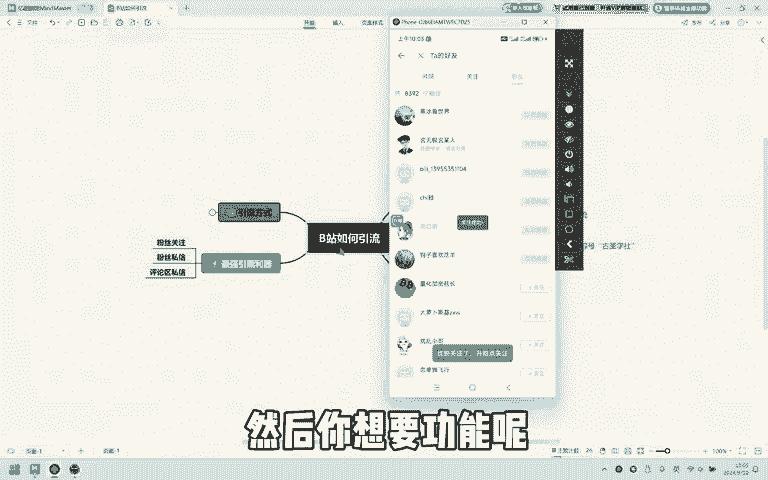

切换成一个功能，比如说是粉丝私信。

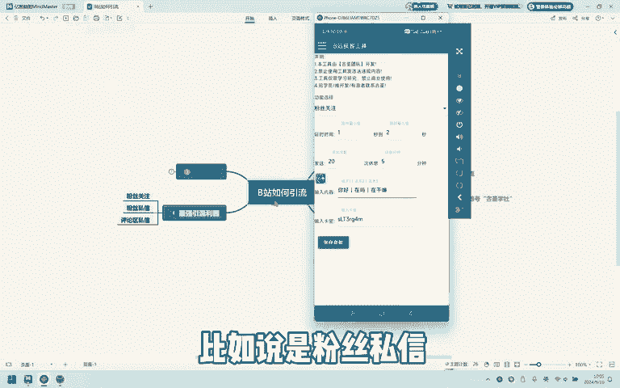

然后我们就可以点开始点开粉丝列表，然后启动的工具。

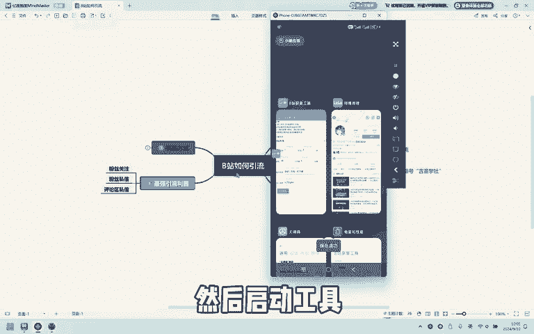

他就会去主动的点击头像，开始私信。就会把内容自动的发过去，然后我发送完之后，它就会返回。接着下一个开始发送，然后看一下评论区私信去找到视频。

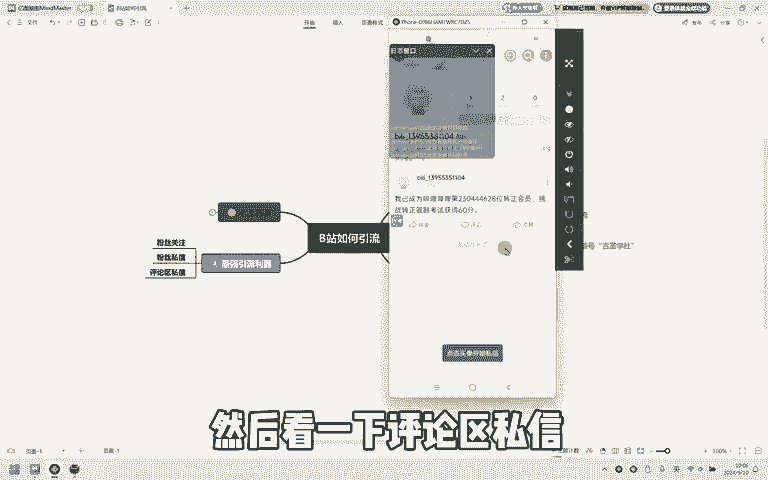

点开评论。然后就可以启动。

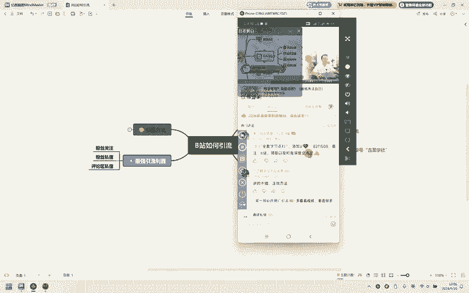

あた。

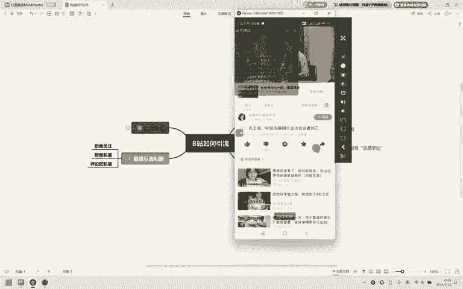

他。

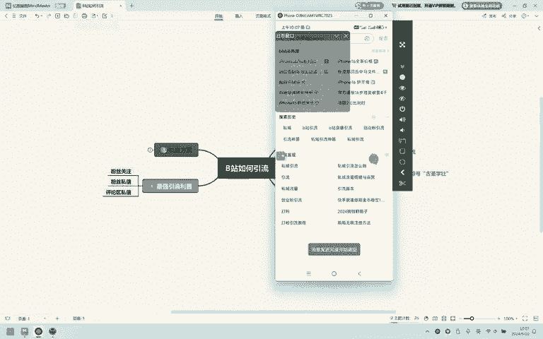

发送完之后，它就会自动的去返回，然后给下一个用户发私信。这个呢就是我们的小工具，然后想要了解的可以在评论区评论666，或者是关注武上学车都是可以的。

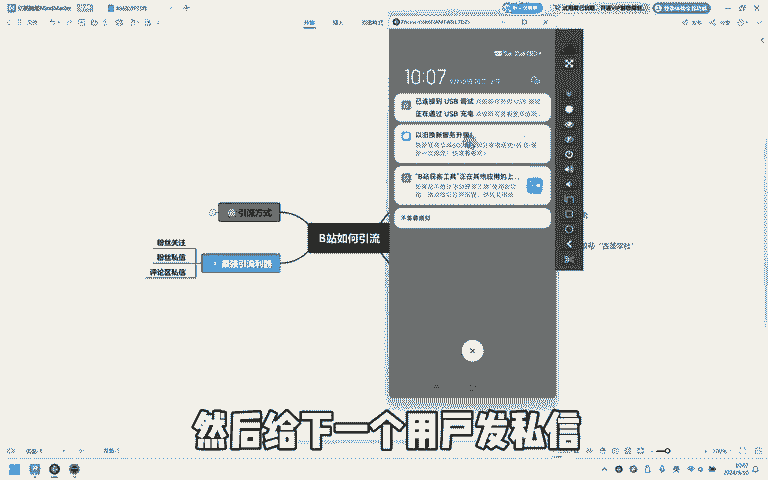

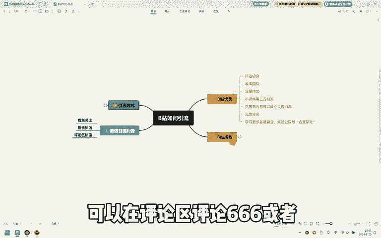