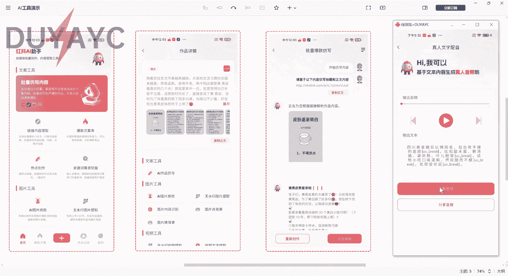
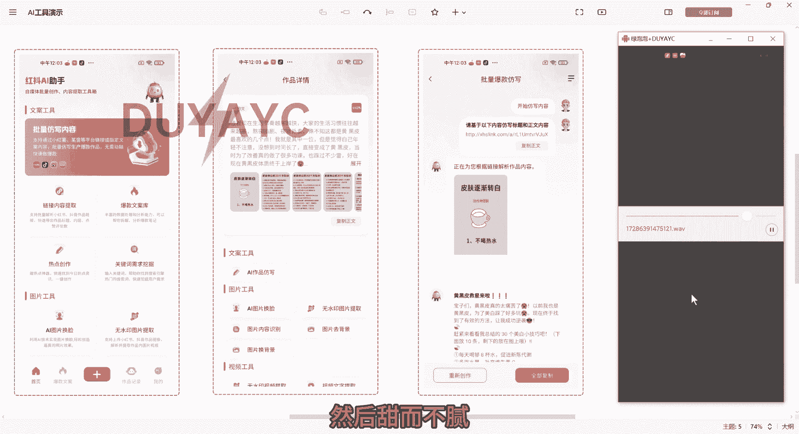
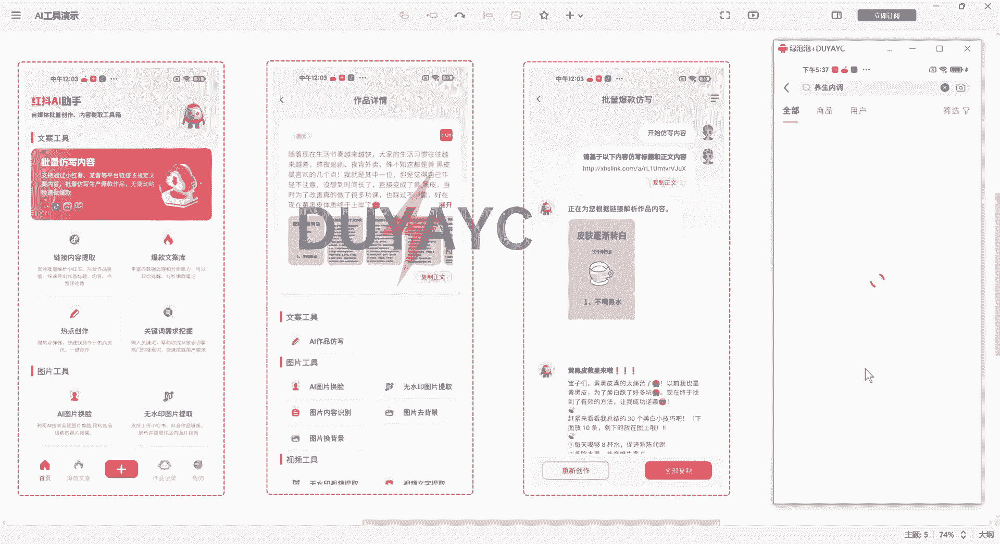
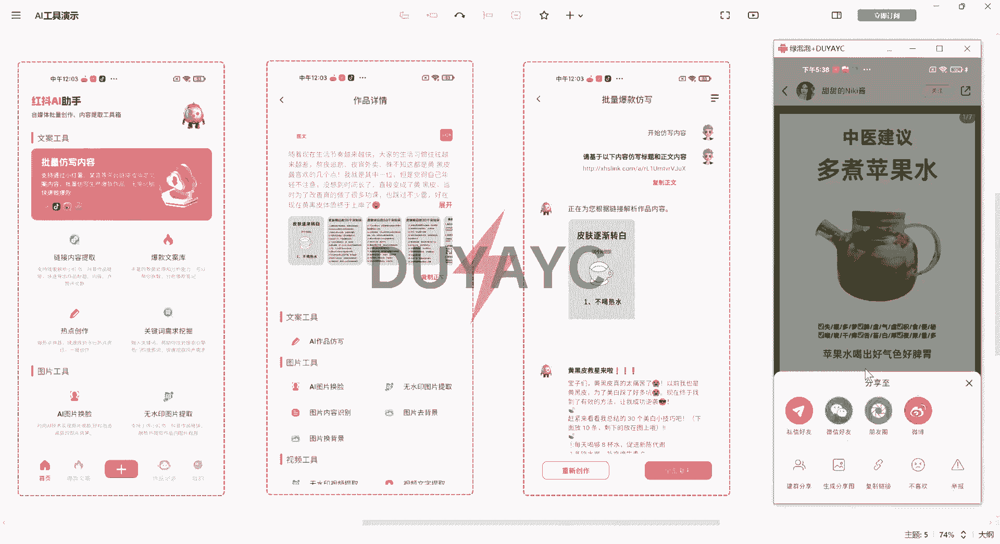
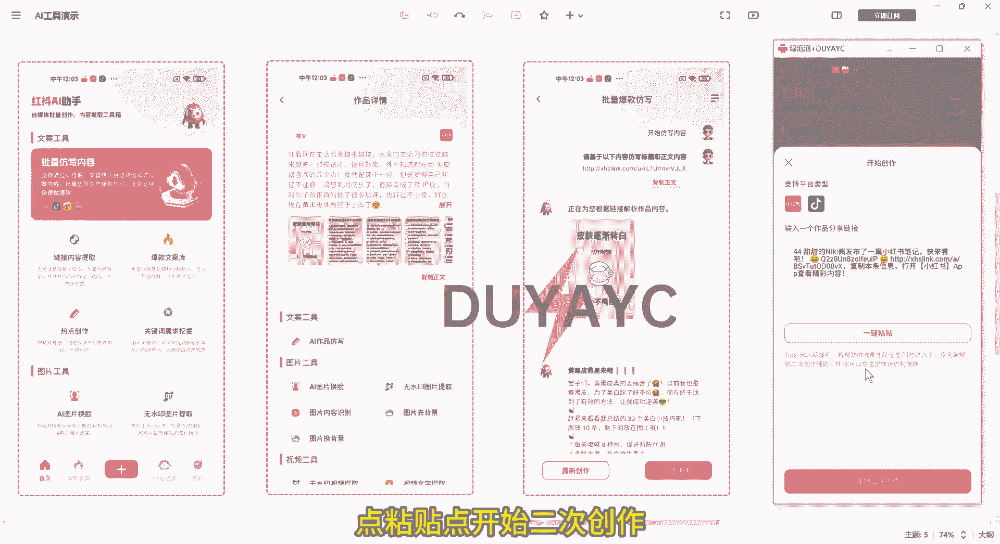
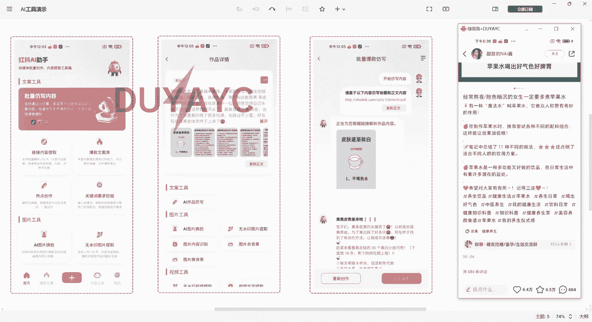

# 最新小红书抖音AI矩阵克隆爆款笔记，自动原创！AI换脸、文生图、视频提取、真人配音！引流获客必备！ - P1 - 小小de可爱y - BV1Pj2SYuE9L

今天每个人都可以免费领取一个AI仿写助手，分享一个非常厉害的小红书抖音，这些平台的AI防线助手，下面简单说一下功能，就是你复制小红书抖音这些平台的链接放进来，然后它会自动根据作品的内容仿写几篇文案。

虽然这个功能普通的AI也能做到，但是这个软件内置了专属指令，完全模拟小红书抖音的博主来写一次，可以生成几篇笔记，不满意的话可以随时重新创作，我们来看一下右边这个界面。

首先是这里可以直接把你想要的链接放进来，然后这里有个爆款文案库，然后这里有关于热点的一个创作，还有这个关键词的需求挖掘，我们可以看一下，我们可以自己来搜一个词，比如说，就搜一个小红书引流。

它就会出来所有这个引流相关的这些词，这个就是用户经常搜索的词，这个就是关键词挖掘，然后还有这个AI图片，换脸以及无水印提取图片，包括这个内容识别纹身图都是可以的，看是不是非常智能。

包括这个视频的一个无水印提取，还有视频文字提取，视频转音频，真人配音等等，我们来听一下。

四川美食确实以辣闻名，但也有不辣的选择，比如甜水面，赖汤圆，蛋烘糕，叶儿八等，这些小吃口味温和，然后甜而不腻也很受欢迎。

怎么样，声音是不是非常真实，咱们找一个作品来试一下。

我们复制链接。

然后打开红豆助手，点中间的加号点，粘贴点。

开始二次创作，可以看到这个是他的原文，那我们点AI仿写，看到没有，两篇文章就已经仿写出来了，那咱们需要使用的话，直接点这个复制就可以，可以点那个全部复制，然后我们可以在这个自己的便签。

或者哪些地方可以直接发布，也可以，我为了给你们展示一下，好这个是两篇文案，我们来看一下原文。

看到没有，是不是很高效，咱们这个软件是一个破解版本，不需要收费，永久免费使用这些功能，需要这个软件的话，可以一键三连支持一下博主，然后在主页找到我，或者在这里找到我，都是可以的，免费领取。

