# 最新抖音暴力涨粉起号技术、每日连怼100条，1天2万粉，无需剪辑 - P1 - 沫尘创业-羽你 - BV1BT42127ND

Hello，牧城社群的兄弟们，大家好，今天给大家更新一期，抖音暴力起号连队的一个教程，一天涨粉2。4万，纯手法搬运，我们看一下这个目标账号啊，就是每个视频连怼个一到200条，一天可以发75条。

两天大概可以涨个三到4万的粉，运气好的话可以涨个10万粉啊，那我们废话不多说，直接开始实操啊，首先我们打开剪映。

点开始创作，这里的话我们找到这个素材库啊，这个素材的话你们也可以自己去实拍一个啊，嗯然后这个这个实拍的这个视频的话，必须跟你要搬运的那个视频，要是时长要是一样的啊。

然后我们这里调一下他的这个比例九比16啊。

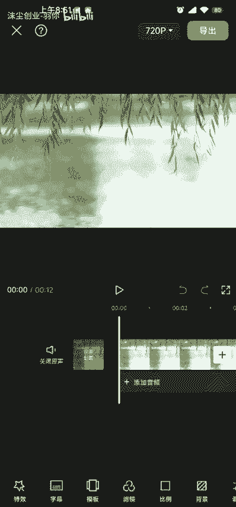

然后把它拉大好，这个拉大一点啊，能拉多大就拉多大。

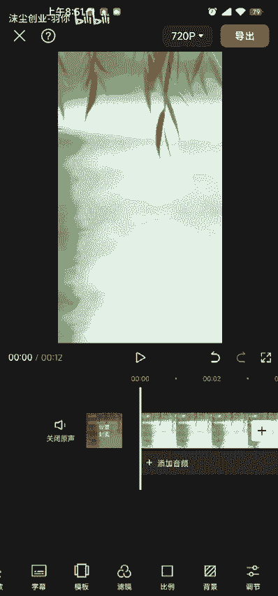

拉大之后我们选择这个画中画，新建画中画，这里的话我们选择我们要搬运的那个视频啊，给它添加进来，添加进来之后把它拉大啊，好拉大之后呢，我们把它复制一个复制，然后把他拉下来对齐。

好对齐之后我们选择第一个画中画啊，把它拉到后面，选择这里有一个蒙版啊，选择线性反转，好打对勾，然后再选择第二个蒙版，然后选择第二个画中画点蒙版，线性反转再反转啊，然后我们调整这个蒙版的一个参数啊。

我们调这个Y轴啊，这个Y轴四五都可以啊，好调好之后点对勾啊，好这里我们的一个呃蒙版就调好了啊，调好蒙版之后呢，我们可以清楚的看到啊，这里有一条线啊，然后我们去给它添加一个特效啊。

这个特效的话我们选择这个夏日泡泡好，夏日泡泡好，这里的话它就出来了一些泡泡啊，然后我们调整一下它的这个参数啊，这个参数这个氛围的话给他调调小一点啊，调好之后呢打对勾，然后我们这个把它拉，把他往后拉啊。

跟我们的视频对齐啊，对齐之后点这个作用对象啊，然后全局这样的话，我们整个视频都会用到这个特效啊，好了我们这个特效就已经调好了，然后我们再设置一下它的这个封面，封面保存一下就可以了，好保存好之后呢。

我们就把它导出，导出的时候我们调一下这个分辨率，分辨率720P108P都可以啊，这个帧率的话我们把它拉到最低啊。

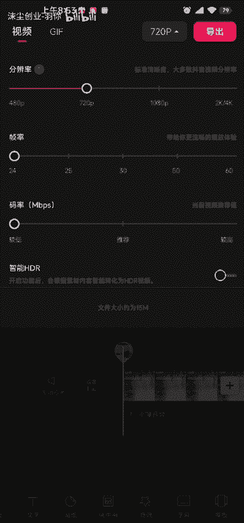

好拉好之后我们直接导出。

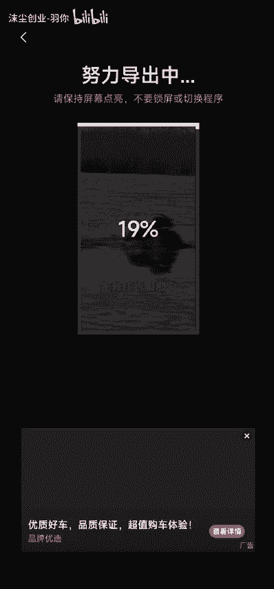

好导出之后我们先不要去去发布啊。

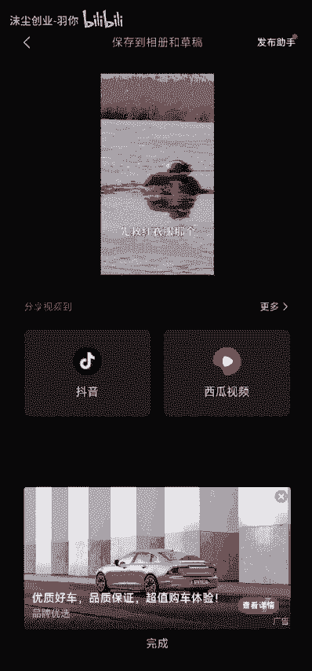

先不要去发抖音啊，我们再点开始创作，再点我们的素材库，然后就刚刚的操作我们再重复一遍啊，好这里选择这个素材添加，添加之后调整一下它的这个比例九比16好。

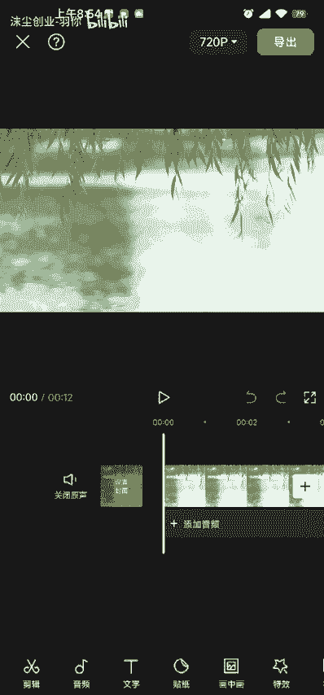

把它拉大好，拉大之后对勾，然后选择画中画。

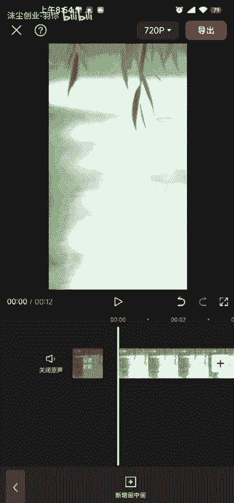

新增画中画哦，这里的话我们选择我们刚刚导出的那个视频啊，给它添加进去，然后把它拉大一点，好拉大一点之后我们再复制一个，把它拉下来，好拉下来之后呢，我们选择第一个画中画啊，选择蒙版蒙版线性反转对勾。

再选第二个画的画蒙版线性反转再反转，好调整一下它的这个参数，Y轴调到四五都可以啊，好这里调好之后，我们再选第一个蒙版，调整它的这个旋转啊，旋转调到，这里的话你自己看着调哦，你想怎么调怎么调，确定好。

在选择第二个画中画蒙版好，也是调这个旋转啊，这个旋转的话要跟你第一个调的那个，第一个画中画的那个度数要是一样的啊，这样我们就调好了，好调好之后呢，这里中间就多出了一条斜线哦，这里就我们就有两条线了。

是不是好，这样的话我们的一个呃一个视频就已经做好了，这个视频就已经做好了，然后这个封面的话我们还可以去保存一下，好保存好之后，我们把这个分辨率啊，什么帧率什么的分辨率，你可以调720P108P哈。

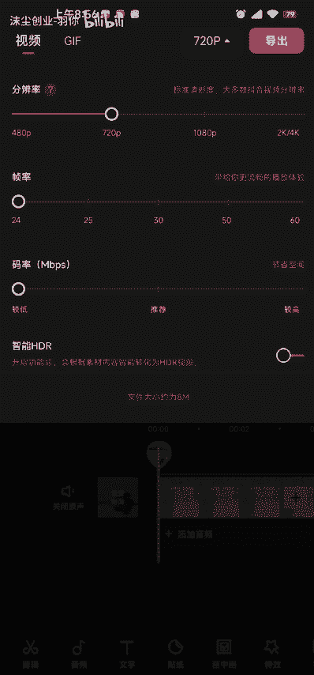

然后点导出。

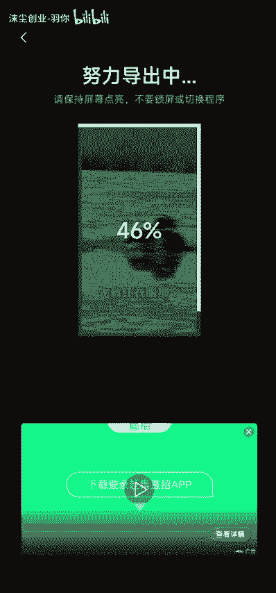

好导出之后我们打开我们内部的一个小工具，就这个小工具。

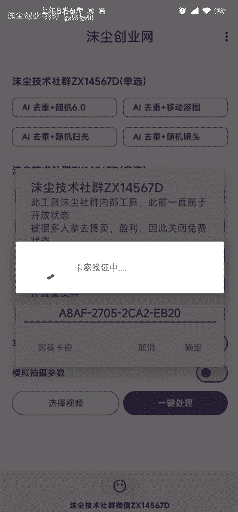

有点卡，我重新打开一下好，打开之后我们添加我们刚刚做好的那个视频，把它添加进来啊，添加进来之后，我们去调整一下我们的这个参数就可以呃，这个这个参数的话，这上面必须得点一个哦，你可以自己去选择啊。

然后在下面的话，根据你的需求去选择这些参数啊，然后这里必须点上，点上之后我们点一键处理之后啊，我们我们就可以去发布我们的一个视频了啊，好了。

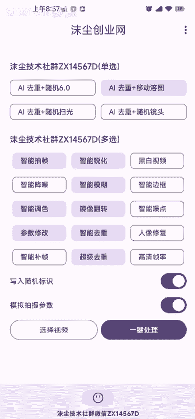