# 最系统的剪映电脑版教程 【2024】最新版 视频剪辑小白入门必学的一门剪映课程 - P10：【电脑版】音频功能应用和处理 - 视频号运营教程1 - BV1dM2vY7EpB

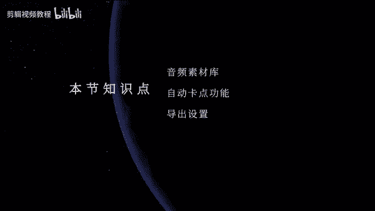

hello，大家好，欢迎来到我们剪映PC教程。那今天这一节课的话呢，我们就开始来学习菜当郎这边的音频效果。这个选项。那我们可以看到当我们选中音频以后呢，它这下面呢有5个模块。

那么我们一个一个模块来给大家去进行讲解。首先第一个模块的话就是我们的音乐素材。那这个音乐素材的话呢，有抖音就是目前比较火的一些音乐啊，那我们就不需要自己再去下载音乐了啊。

同时的话呢它的音乐做了一个比较详细的区分。那我们可以看到上面的话有我们的抖音比较火的，还有比较浪漫的，或者是旅行，经常会用到的一些音乐，还有vlog，然后最适合剪vlog影片的音乐。

还有呢最重要的一个就是我们的卡点音乐啊，这上面也有很多啊，那如果你需要去下载的话，你可以直接在这里。点击下载，然后拖到我们的时间线上呢就可以了。那还有纯音乐，还有摩登天空等等之类的环保搞笑。好。

甚至还有什么混剪，对吧？混剪的话应该是我们短视频平台上面最流行最燃炸的一种一种片子类型啊，好，它的一个分类呢非常非常的多啊，那你直接用就行了。O那这个就是我们的一个音乐素材，相当于是一个音乐库啊，好。

然后呢第二个的话呢就是我们的音效库，那音效的话呢就比较有意思啊。比如说我们的一些片子里面出现一些画面，那就需要加入一些音效，然后呢去包装好，我们可以看到比如说呃像这个对吧？

这个是不是最常用在我们的一些影片里面，那它不止在我们的正片里面在我们一些短视频啊，或者是比较简单的日常拍摄的视频里面啊，都比较常用啊，还有很多啊，甚至是一些这种what，对吧？这个也是比较常用的啊，嗯。

然后呢再配上那个黑人的那个一脸问号的那个表情，是不是就让画面就更加生动一些？那音效库的话，这上面也有很多的分类。比如说笑声啊、综艺啊、机械啊，还有BGM啊，人声转场、打斗啊，还有一些动物叫小猫的叫声啊。

对吧啊还有一些像布谷鸟的叫声啊等等之类的啊。那这个就是我们的音效库。那在我们的剪映里面去做片子的话呢，相当于呃素材音乐音效，然后呢，人家都已经全给你收集起来了。那呃我们要去用它的话呢。

其实只要你去花时间去找去方抗，然后去熟悉。那其实对我们以后的一个做片子的这个时效的话呢，是非常非常的快的啊，所以非常的便捷啊，O那这里面有一个叫做音频提取，我们可以看到这里音频提取的话。

其实就相当于呃像有一些片子啊，呃，我们想要呃把它的声音或者是把它的音乐提取起来。比如说我们现在这里有一个片子啊，我导入一个片子，对吧？然后呢你只要把片子导进来。

它会自动的就帮你把这个音乐就给它提取出来了啊，我们可以听一下。🎼I think。🎼結こ？🎼That you are dog。Like really， dope。OK那这个的话是我们的音频提取。

也是比较方便快捷的一个地方。还有一个的话就是我们这里有个抖音收藏。那这个抖音收藏的话呢，其实这个需要你登录你的抖音账号啊，比如说你登录抖音账号，你在刷抖音的过程当中。

然后呢你听到一些比较好听的音乐或者是一些比较火的音乐，你可以收藏起来。那这个时候呢，你在我们的简映PC版上面去登录你自己的抖音账号。那这个时候呢在抖音收藏这个地方，它就会自动的去更新。

在抖音上面收藏的这个音乐啊，那就可以也是一样可以直接引用啊，大家可以看到的，像这些就是我我以前收藏的一些音乐。O那还是蛮多的对吧？哎，就你可以啊你喜欢你直接收藏一下，点击一下收藏。然后呢就可以直接用了。

好，然后那我们再来看一下第五个第五个的话呢就比较的呃容易了。它这里的话呢是。需要去下载，可以看到这里张贴抖音分享的视频音乐下载链接。那么比如说你在抖音上面去看到一些音乐，你没有办法收藏。

你可以把它的链接张贴到这里面，它也会自动的帮你下载啊。那这里面下载的话，它会下载到你的这个就下载到我们的音乐库里面，然后直接调用了就可以了。O那这一块的话就是我们的一个音乐素材的学习啊。

那整体下来的话呢，其实也是比较的方便。我们之后的一个工作的一个操作。那今天我们还有一个重点，就是我们要去做一个案例啊，就是我们这一节课要做一个卡点案例。那我们现在一起来看一下我们的这个案例。

 know think。

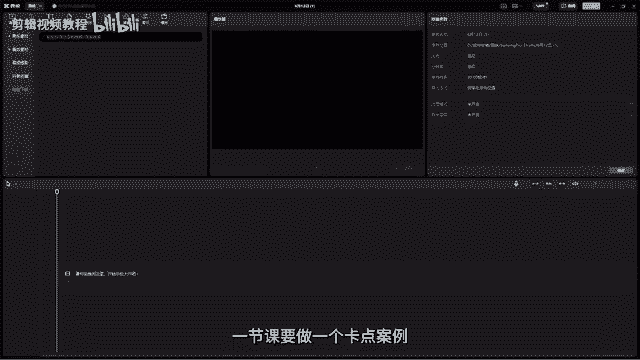

🎼I think。🎼That dus are do。Like really， dope。

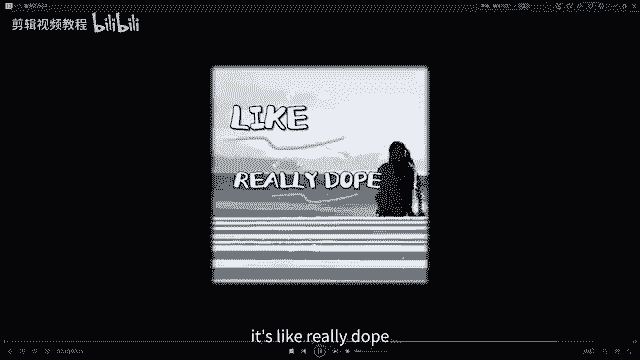

OK那么大家可以看到是一个比较简单的卡点的小视频啊，那我们可以看到啊，就是其实就是用一些图片加上我们抖音里面的一些效果包装。然后呢，再呃把它制作出来一些呃这样一个比较有意境。

然后比较呃卡点比较欢快的这么的一个视频啊，那我们现在啊就直接来开始操作。首先第一步我们需要把我们所要用到的素材，然后呢全选这些素材啊，我们全选我们这些素材直接给它先导入到我们的媒体池里面。

OK然后呢那我们这里还有几张啊，这里还有几张好呢倒进导入进来。好，然后呢我们再去把我们的音乐也导入进来。

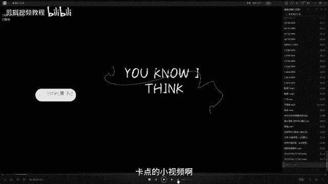

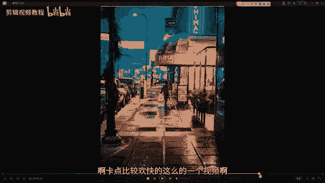

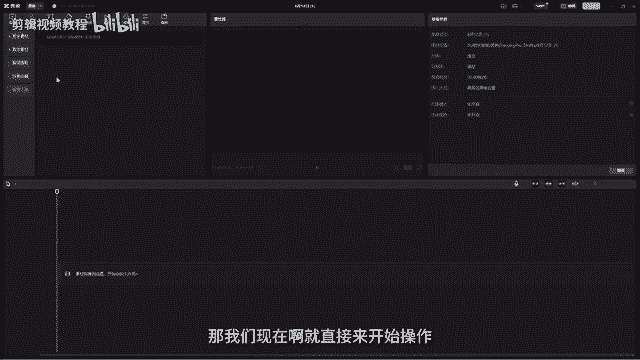

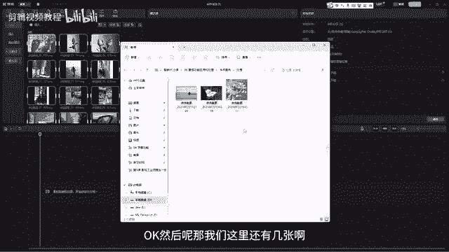

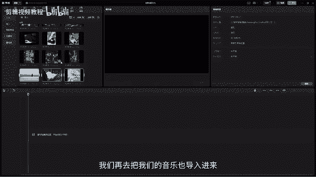

那这里面的音乐的话呢，我们可以直接用我已经做好了这个音乐啊。那我们可以在哪里呢？直接在我们的音频这里找到音频提取。刚刚我们前面不是已经把这个这个视频啊，就是我已经把这个我做好这个视频的音乐。

我是不是已经拖进来了，对吧？它已经提取出来了啊。那这样的话我们这个音乐直接就拖到我们的时间线上呢就可以了。好，现在拖到上来了以后，那这里面我要教大家一个非常神奇的工具，叫做自动的卡点自动卡点。

那我们都知道，我们要做卡点视频或者是叫卡点案例，那我们一定是要踩准我们的鼓点。这样的话呢才能把视频就是做出节奏感比较强的啊。那我们在自动卡点的时候，可能有一些同学会觉得就是节奏感可能相对比较差。

那就不知道应该卡在哪个点上会更好。那这个时候呢我们就可以直接用我们的自动卡点按钮。

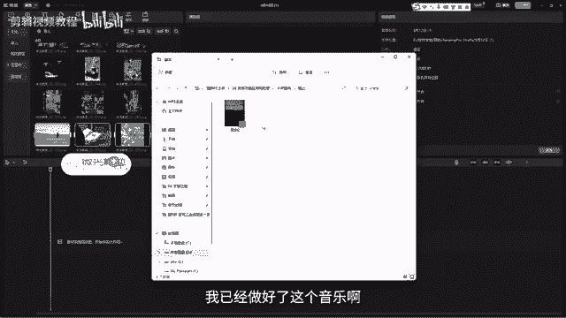

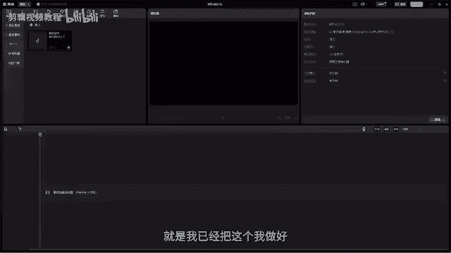

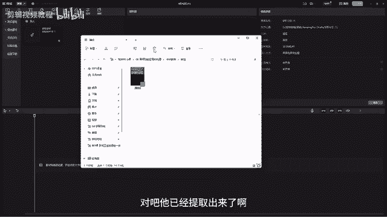

然后呢让它自动帮我们把一些鼓点的位置给它标出来。这个按钮在哪里呢？我们选中素材，大家注意要选中我们导入的音频素材。在我们的工具栏这里有一个像像一个小红旗一样。

旁边这里就有一个叫自动踩点OK然后呢我们把它选中。比如说这里有一个节拍一和节拍案啊，我们直接选每一个都看一下啊，好，选中了以后，我们需要去等待一下。

那这个时候我们可以看到在我们的音频上就会出现一些这样的点，看到没有？哎，就是一些点这样的点。那这个点的话呢，其实就是软件自动帮我们呃卡的点，我们可以来听一下，是不是啊。🎼I think。对不对？

然后这个里面鼓点这个地方刚好是我们的重音落下去的时候，它又在这里卡了一个点。那这个是节拍一，它的一个鼓点的话呢就是比较的分散啊。然后呢相当于把一首音乐分成几个大段落啊，然后是这样去踩的。

那显然这个分法的话呢不太适合我们今天的案例啊。所以我们在这里选哪一个呢？我们选节拍2，我们就可以看到它的鼓典是不是就会更加的密集一些。O那我们现在可以听一下啊，把整个音乐听一下。然后呢。

那其实它的这个大家可以注意看它这个滑快落到的每一个点上啊，那几乎都是在我们的鼓典上。好，我们来听一下。 know think。🎼I think。🎼That you are dog。🎼Like。

 really， dope。对吧是不是就很方便？那这样的话我们在做视频的时候，是不是我们可以直接就在这上面去卡就可以了，对不对？啊，就非常非常的方便。

就不需要我们啊花很长的时间然后自己在这里卡这个音乐啊。好，那么我们现在就开始来制作啊。首先我们先来做我们的第一个镜头，这个案例里的第一个镜头的话，它是一个这样的一个英文的效果啊。

那我们直接调用我们的文字模板呢就可以了。O那我们的这个文字模板的话呢，我们直接在我们的这边啊文本，然后呢找到我们的文字模板，然后呢往下去翻啊，那这个在这里面怦然心动，好，我们这接拖进来啊，对吧？😊。

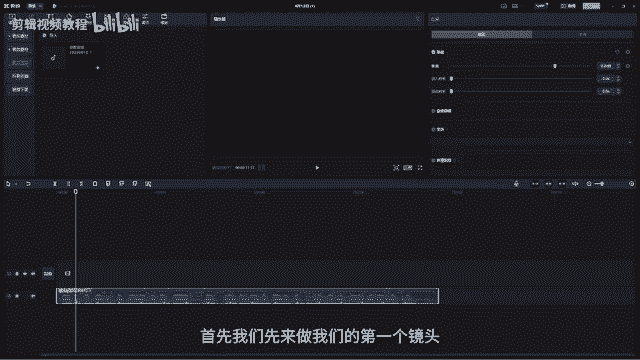

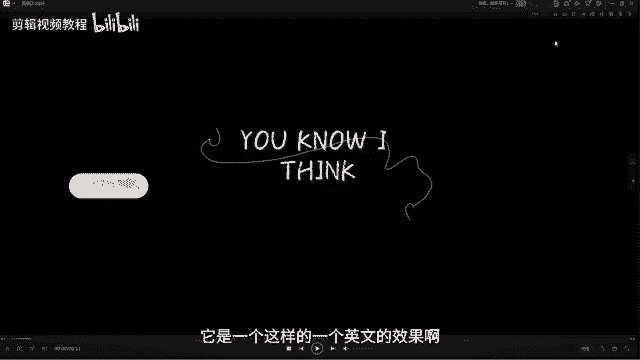

🎼OK然后呢那我们需要去调一下它的这个长度OK那像它的这个长度我看了比较长啊，我们来听一下，对吧？哎，我们差不多到我们的唉这个这个到这里面啊，到这里的时候，我们给它ok给它裁掉啊，裁掉，对吧？

让它跟我们这个地方啊。把我们的音乐啊音乐刚刚起来的这个地方，然后呢我们就起来好，然后呢这个文字的话，我们把它改成什么呢？点击输入就可以。用大写的U。呃no。怎么样呢？I think。

But you know， I think， okay。好， you know what I think？对不对？OK然后弄完了以后，那我们就可以把我们的哎第一张图片给它放进来。

那我们的第一个图片的话呢，用的是这张画面啊，那我们这里也会提供给大家很多的这个镜头，那你也可以选一个你喜欢的那比如说我们唉比如说我们就选这个吧，对吧？这朵花也挺好看的。其实。或者是我们选这个。

然后呢往后去移。好，来给它放在我们的这个地方哦，然后呢放大一点哈。好，这个可以往后一点点。对吧那我们现在这一张图片的话呢，它太小了啊，我们在这里面去给它怎么样裁剪一下啊，那我们裁剪到多少呢？

这里面我们直接选择个3比4。好，然后点击确定啊。OK那么我们给画面弄成3比4以后呢，其实我们这边还有黑边啊，就不好看。然后我们在在这里把我们的整个视频啊，整个项目它的一个比例我们都给它改成ok然后呢。

改成这里是4比3，选错了，应该是3比4，对吧？好，然后选完了以后，我们拉一下它的这个长度。现在的话它太长了，对不对？太长了，我们不需要弄那么长的一个呃效果啊，我们大概拉到我们的好4秒左右。

对吧哎跟他跟我们的这个点呢对下来就可以了。好，一下。🎼I think。🎼对吧然后呢我们现在的话呢就把我们的这个去做一些裁剪。首先我们先给它添加一个滤镜。好，在这里面找到我们的滤镜啊。

找到滤镜复古胶片里面有一个叫美高，对吧？哎就有一个这样的一个滤镜啊，好，直接拖到我们的视频上。OK那拖到我们的这个视频上以后，然后呢，那现在它的这个它是这样子的，我们要需要让它一节一节的出来啊。

所以我们把它在这里面啊，我们在这里给它添加一个模板。OK那这个模板的话呢，我们之前也给大家已经讲过了，对吧？好，我们添加模板O那模板添加好以后，然后我们哎把它拉长好。

然后呢给它然后我们把它的这个上下给它调一下，哎，比如说我们上面就让它哎怎么样呢？好哎然后放到上面来啊，上面来。对吧好，然后呢再再小一点，给他留一点点边，对不对？哎，留一点边，就没有必要让他做的那种。

好再拉一点OK然后再小一点。好后在上面。哎，让这个花露一点点啊漏一点点。好，做完这一个以后呢，然后呢再conttrol C controltl V，然后呢再粘贴一层，然后呢再把这一层给它哦往下去移。

那这个时候移到这儿时候，我们可以哎把它这再调整一下啊，就是做出它那种呃，非常好看的对吧？很好看的这种这种感觉。

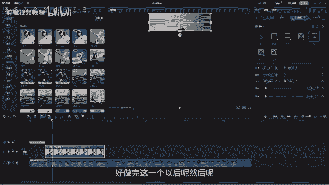

ok。好，然后大概调一下它的位置啊，那我们可以看一下，跟着音乐，大家注意我们第二个图层它出现是在我们的这个节奏点上啊，那我们可以看一下啊。I think。对吧好，然后呢那这个出来了以后。

然后呢那我们的第三层第三层我们在这个点上去出现，然后呢，我们给它往下去拉啊。Ocl Ccontl V然后呢右复这一层。好，我们给它往下拉。哎，我们让它在最下面这里面出现。对吧然后我们可以让它哎大一点。

好，我给他好拖到这里。OK拖到这里面啊，然后呢这里面的话呢，大家注意啊，我们这里面是会有一个呃这个I think，对不对？然后是有这个英文名字的啊。那这个英文名字的话呢，我们是放在我们画面的这个中间啊。

我们可以再来回顾一下啊。对吧哎，我们来看一下。好，然后呢它是呃文字先出来啊，我们这个文字啊。好，然后先出来了以后，okK而下面的这个第三层出来以后，我们的文字就出来。好，出来以后我们的最后一层啊。

OK文字出来。好。对吧文字出来了以后，然后呢呃我们的呃。这一层才出来，然后呢最下面这一层才出来啊。所以我们在做的时候呢，大家要注意它的一个就是的位置。那我们可以先把文字先放这里，因为文字要放到最中间嘛。

好，然后呢找到我们的文字模板，然后呢找到这里有个夏日。那夏日这里面我们看一下啊是哪一个呢？

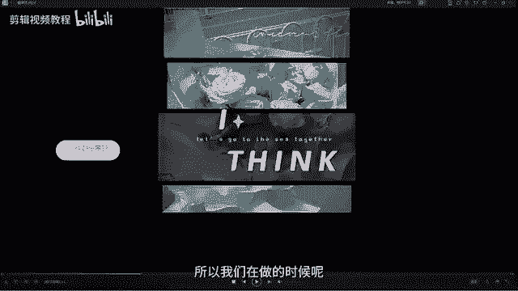

喂，然后是这个对不对？还，是这个，然后呢，我们直接给它拖进来。好，拖进来啊，拖进来，我们给它先放到这来。因为我们这个它是怎么样呢？啊，我们这里好。🎼对吧然后呢这里面出来以后。

在这里开始III就是开始出来了。好I think。对不对？好，那这个时候我们改一下啊，在你这里面我们把它改成爱。好，去海边，然后呢改成thinkk。好，我后弄成这个大写的。哎，这样的话就就比较好看了啊。

OK然后呢呢。对吧。🎼I think。🎼对不对？OK然后呢我们这个时候文字出来以后，我们来看一下，然后在中间啊。好，那我们第三层出现以后，我们中间这一层是不是要出现了？好，然后呢再好在这里面啊，好。

这出现。然后呢在这里面啊在这个点，然后cttrol Cctl B好，然后呢再把我们中间的这一层给大家好弄上去。好，这一层可以宽一点，对吧？好，注意我们上下的上下层它的一个这个间距啊要保持好看。

ok然后让我们把下面这一层唉给它往往下移一点。好，中间这一层。ok然后那下面的这一层的话，我们可以好细一点。哎，你可以在这里调它这个参数啊，给它调细一点。哎，我们可以这样去调对吧？调细一些啊。

然后呢哎注意，然后在那里调一下它的位置啊，注意我们上下的一个结构。ok中间的这一层啊，中间这一层好，下面这一层我们可以整体往下一点。okK然后呢，中间这一层我们可以拉宽一些。

因为中间这一层它是嗯比较重重点的一层。好，再来宽一点。好，因为它比较的实，所以我们可以给中间这一层啊，把它的这个基础回到基础这边，然后呢把它的透明度给它降一点。哎，这样点的话。

那这样我们的文字就比较明显了，对吧？好，然后呢那我们再OK然后再看到我们最下面这里。好，在我们的这个点的时候，然后呢，再control Cctl V再复制一层啊，那这一层的话就是我们最下面这一层了啊。

好，也是一样进入到模板这来给它拖下来，那这一层对吧？这一层我们就好调到这里来。OK然后那这一层的话呢，就不用去调它的。OK不用调它的不透明度了，把不透明度调回来100。O那这样的话我们的第一个就做完了。

我们来看一下。🎼I think。对吧？好，然后呢那到这里的时候，后面它已经开始到这里，我们要哎转镜头了。所以这些我们可以怎么样哎，都给它裁掉啊，直接把我们的鼠标放在画面的最后面这一节。

然后呢直接自动去裁。哎，材料让他们对齐，那到这里的时候，我们就要开始去啊换其他的镜头了啊。那这个我们哎给它好弄过来，对不对？OK然后这后面那这个就是我们的第一个画面啊，就做完了。

那我们后面的这个画面的话，其实就是跟着这个呃音乐卡点。对不对？OK然后那现在我们就把这些图片啊，一开始放一个小猫的图片进来啊，对吧？这个小猫的话呢也是一样啊。

进入到这里要改改成我们的3比4OK然后注意调一下它的画面啊，好确定，然后小猫的镜头哎给它缩进来，跟着这个鼓点来，我们这里可以听一下，它是这里大大大大大大，然后是这样子的一个走法啊。

所以我们这里跟着它这个鼓点来，对吧？好拖进来。哎，跟着这个鼓点来okK然后呢再放一个。呃，那这个放的话呢，就嗯就O然后比如再。是吧再放一个这个好，也是一样拖过来。OK然后把我们听一下。Okay。🎼。

Okay。对吧。好，然后呢再放一个啊，那这个的话就是一些城市的镜头啊，然后呢，你你想放多少个呢？都可以OC件给他裁一下。好，多余的给它弄回来。好，然后呢再看一下，看看有什么镜头呢，比如说像这种镜头。

对不对？这些镜头你都可以放啊。好，C键猜一下。

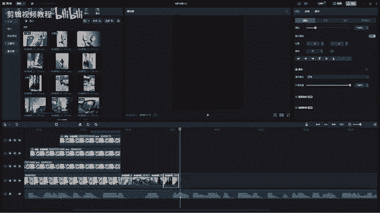

OK然后那我们就调一下啊，分别调一下，这里面这个也是要调成我们的。3比4。OK然后呢呢这个也是一样3比4。来大概注意一下它的构图呢就可以了。好，又是我们的3比4。🎼对吧那这样的话，我们这里看一下。

对不对？啊，就是跟着我们的音乐卡卡卡卡的这样子。ok那这一段的话呢，因为它我们前面这里都给它加了这个调色啊，这个是呃这个滤镜对不对？所以我们这里面啊每一个都加滤镜太麻烦了。

我们直接找到滤镜里面每高哈拖过来啊，拖过来，然后呢让它的一个长度跟我们下面的这些长度一样。那这样的话它就。对吧？就都有我们的这个效果了。okK然后呢完了以后，那后面的我们要怎么去做呢？

后面的话呢就开始进入到我们的这个镜头啊，我们来看一下。🎼you are go对不对？然后就是我们的这个镜头了啊，那这个镜头的做法的话呢，跟我们前面那个花是一样的啊。首先我们先进入到这边来。

然后呢找到我们的好这个脚的照片，然后给它拖进来。大家注意这个脚的这个照片的话呢，也也不需要太长。好，这么长呢就可以了。裁一下。好，不需要的多余的给它丢掉，对不对？

O然后呢进来以后也是一样要调整一下它的比例啊，调到我们的3比4。OK然后你可以哎大概构一下图啊。好，然后弄完了以后，那我们现在要干嘛呢？还是一样啊，找到模板，找到我们的矩形好，找到矩形。

然后呢哎给它拖长。好，那这个时候呢，刚刚我们是横着的那现在我们就竖着来，对吧？OK然后给它第一个在这里好，然后呢这个ctrolcttrol Cctl B对不对？OK然后对齐。好，下一个我们的放到旁边来。

OK对齐好，那现在它是不是就已经哎有了我们这个竖版的这种效果。好，然后呢它这个效果的话呢，我们先给它添加一个美高啊，就是先给它加一个滤镜，我们可以把这个美高的这个滤镜给它拉到后面来。

那这样的话是不是就有滤镜了。好，但是呢像在我们要去做的是它的这个效果，就是哎就五颜六色的。然后呢甚至有一个框框。那这个效果的话呢，其实就是给它添加这里面我们的这个特效滤镜这里面，然后呢，滤镜画面啊。

画面滤镜这里然后呢哎我们可以找一下啊，找一下叫做负片游移啊，那这里面的话我是收藏好了，就在这里面，如果大家这个你没有收藏的话呢，在热门这里面啊，热门这里，然后往下去翻好放放多一点啊，差不多是在比较靠后。

那就是这个看到没有？哎，就是这个效果啊。那我这里的话呢，我是收藏了，那我在。

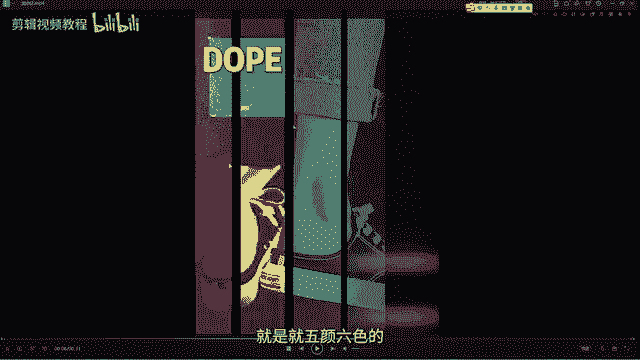

🎼面去去添加啊，那这个的话直接拖过来，给它每一个都加上，看到没有？每一层都都添加啊。OK然后呢每一层都这种去添加。好，那这样添加完了以后，我们要干嘛呢？我们添加上来以后。

我们进入到它的这个基础这里来选中这个副片啊，然后这里有一个小笔，就是可以去更更改它的这个颜色，然后呢，在这里面去更改啊，颜色我们可以哎这我去拉一下，看到没有？是不是就可以改它的颜色。

每一层都改一下颜色啊。OK然后呢，这边然又改一下。哎，大概你给它改成不太一样的就可以了，就它的颜色，你改成不一样的就行。好。O然后呢再改一个最后的。🎼对吧OK然后那这样我们的这个效果呢就做好了。

我们看一下you are对不对？OK然后呢这里面you are z，然后那我们直接好这里。😊，好看一下好。对不对？然后这里面它you，然后我们直接在这里文本添加一个文本，好，拖上来添加一个。

就直接用这种普通默认的这个文本呢就可以了。对吧好，这个文字好它放到框框里面来，这里叫什么呢？you。对吧哎就是一个这个文本okK然后呢，你可以给它加一个花字，让它明显一点，对不对？啊，这样的一个文字。

啊，可以调大一点。O好，第一个。you are对对？好，这下面又是二，这个地方是22。好，然后呢那我们再把这个ctrol Cctl V粘贴过来。OK然后呢给它移到上面来。OK这个是R。好。

要大写的才好看啊。对不对？好，然后呢再看一下。🎼you are对对，好，后面。行。OK然后呢，最后这里他。整体可以往后拉长一点。好，往长点，然后呢，这个ctrl CctrlE好。

粘贴过来OK给它移到这来。对吧那这个就是我们的。🎼DOPEO然后呢给它放到这儿，那我们可以看一下对不对？好，我用这个跟我们的视频一样长就可以了。OK然后弄现我们完了以后啊，那这个效果整体完了以后。

然后呢我们就开始制作下一个。那下一个的话呢就是放一些我们的一些镜头呢就可以了，找一些镜头，嗯，你喜欢的一些镜头，对吧？好，放进来。OK然后大概到这里面。裁掉后面的不需要，对吧？然后呢注意要调整啊。

每一个都要去调整它的比例啊，要不然的话我们整体比例是不好看的。好，调完以后，然后把这个每高继续往前拉，让它的色彩一致，保持一致啊。然后呢再找一个城市的。嗯。比如说像这个对吧？哎，这个也挺好看的。好。

然后这里面就放两张图片呢就可以了。对吧哦，也是一样，要调整一下它的比例。ok。看一下。我们可以整体来看一下啊，you know I think。🎼I think。🎼That you are do。

对不对，是不是是不是一下子就做完了？OK然后呢那我们现在就开始进入我们的最后啊，还有那个最后三个效果，然很快我们就做完了啊。好，然后我们再找一下下一张图，那这张图的话就是这一张对吧？

这个小姐姐啊也是一样啊，我们可以把这个拉长一点，就是我们的这个滤镜啊可以拉长一点。OK然后呢呢。😊。

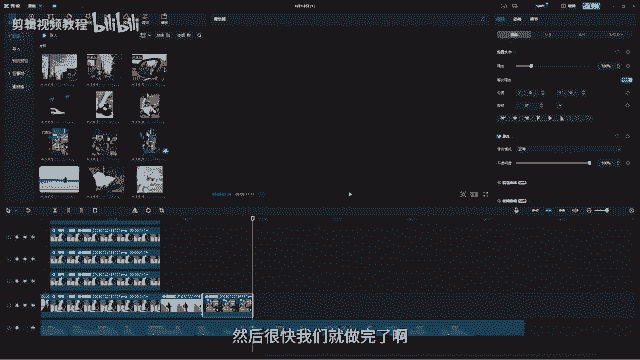

这个的话呢，我们唉把它。占用啊占用我们的两个节奏点呢就可以了。好，也是一样，调整一下比例，然后3比4。对不对？好，然后呢进来了以后，那我们现在啊。😊。

cttrorl Cctrl V给它再复制一层放上来啊，放上来我们现要做什么呢？我们要做这个效果啊，让它呃上面啊。对吧它正面这人物这里是有一个这个效果的，然后周边是其他的颜色啊。那这个的一个制作的话呢。

也是需要用到我们的蒙版。所以我们把呃这个上面的这一层啊，上面的这一层给它添加一个蒙版矩形。

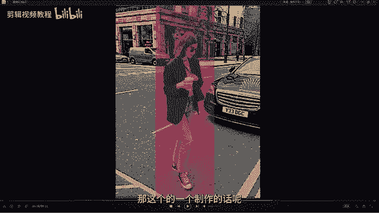

OK然后我们拉动，然后把这个小姐姐给它啊单独的框框选起来呢就可以了。然后呢给上面的这一层添加上我们的哎这个副片效果扔上来是不是就已经有我们的这个效果了。那你可以去调一下啊，你可以把这个好。

它的颜色给它调一下。是吧哎你觉得哪哪个颜色好看一点，你就调哪个颜色啊。好，然后呢大家概调一下嗯，它的这里还有个滤景。哎，你可以不用调，不用那么强OK然后呢我们的效果。🎼对不对？

是不是就已经有我们这个效果了？好，那我们这个圈框框它是速度啊，你不想要你给你拖拖慢一点，那这样的话就没有它的这个对吧？它就不会往上移了啊。好，然后呢，这个完了以后啊，又进入下一个镜头啊。

下一个镜头就是这个好小姐姐这个鞋好弄下来，那这个也是一样啊，它占用我们的一个节奏点。好，把后面多余的这一些给它裁剪掉啊。不需要。好，然后那现在我们给它怎么样呢？它的这个画面是这样子去呈现的。

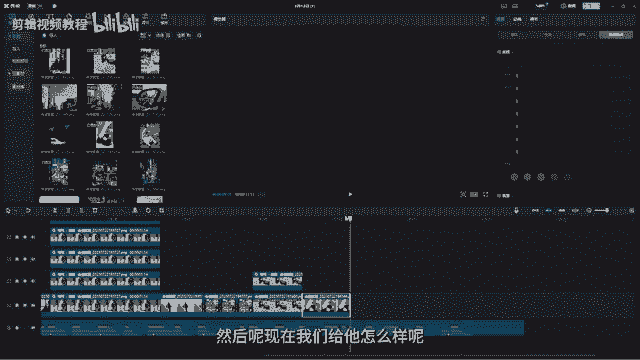

🎼。

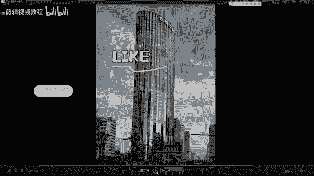

对吧哎。对吧它是这样上下去呈现啊，那这个的话呢也是一样，我们需要用用蒙板。所以我们ctrl Cctl V然后让它往上哎一样往上去弄啊，只不过是两个，我们都要给它添加上我们的蒙版，嗯。

或者是我们先加了蒙版，我们再啊加模板也是矩形啊，矩形。

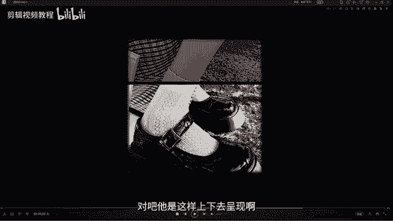

哦，等一下，我们刚刚忘记啊忘记调它的比例了。好，注意把它先把比例调了OK然后呢，最上面对吧？最上面到这里面好，可以小一点。Ocl C controltl V好，复制一层，然后呢再把这个好拉下来。

中间隔一点，让他们做一个比较大的一个区别。对吧哎，中间这种去调一下啊，调一下。好，然后呢那我们上面的这一层啊，我们给上面的这一层也是一样，添加上我们的复片效果。OK啊。上面上面的这一层。

对吧啊添加复片效果。同时我们还要给它去添加什么呢？去添加我们的这个黑白胶片啊，就给它添加一个黑白胶片。那这个的话呢是在我们的也是在这里面，大家可以看啊，你可以在这个复古这里面去找啊，复古转场这里面对吧？

然后这里有个黑白胶片啊，扔上来。哎，这样的话我们的画面就变成这样。所以我们把黑白胶片给它弄弄小一点。好，可以看一下。对不对？好，然后呢，那这上面又有这个框，然后我们可以把这个框给它处理掉。

把它的这个速度可以给它调慢一点。好，复偏有移啊，速度调慢一点。那这样的话它这个框就消失了就没有了啊。O然后那这个是我们的。对吧这个是我们的这个效果。O然后我们后面啊后面结尾的时候，我们的这个画面。

再放一个好，放一个这样子的镜头啊。好，查一下。啊，这个不需要好，然后呢再放一个女孩的背景，然后做一个结尾。对吧他们两个。好，贴上啊。Like really， dope。对不对？好，这个也是一样啊。

我们这个要去调一下它的比例。哎，把这个房子给套进去。好，下一个镜头，这个也是。🎼好，大概就留一个这样的一个背景，那我们可以看对不对？好，然后呢，这这个里面啊这里面弄好以后，然后呢。

我们需要在这个地方啊好，这这后面这里面这里还有一小节，那我们C件给它裁一下。好，再猜一下。好，后面这一部分的话，我们需要去给它添加我们的这个复古胶片。对吧到这到这的时候。

其实我们需要去添加一下这个把这个复古胶片。好，再添加一个过来滤镜。特效。这里黑白胶片好弄过来，对吧？🎼OK前面 like really dope。好，这里面。OK然后呢。

这个我们不需要那么长到这里就可以。🎼Like， really， dope。对吧然后把这个颜色给它拉长，因为全部都是一个颜色嘛。Like really， dope。🎼对不对？就这样的一个效果啊。

那结尾的时候还有一些呃字幕啊，这里面 really好，这里他说II歌 really do啊。😊，那我们直接给它添加上，就是我们的这个字幕就行了，对吧？这里好，like好吧，前面的这个可以直接复制这个。

那你也可以在这里重新再添加上我们的好字体给它弄进来。对吧好，然后我给他加上一个描边就可以了。这里是like。OK然后可以给他大一点。那，感觉不是很好看。O我们在花字这里面给他找一个 really。

ok然后呢我们可以把它的这个描边颜色给它改小一点，不要那么细，对不对？好，它的这个我们用中文的呃，用大写。哎，用大写会好看一点啊。好，我们看一下。🎼like really对吧？好，这里好。

like在后面才出来，跟着这个来就行了啊。一道。Really。O。🎼调一下细节啊。对吧？like克他是从这开始的。好，那往前移。Like really。OK在这里面。

然后呢再把这个cttrol Ccttrol B好复制一层，然后呢给它啊弄到下面。好，这个可以再小一点。OK这个字号可以小一点，来，就让它做弄弄成那种错乱的感觉啊。O调一下它的这个文字。

这个是really。对吧好，really。对吧哎，不要那么那么大那么太大了就不好看了。哎，然后注意跟后面这个小姐姐她的这个画面啊，然后呢放在一起。好，然后呢现在的这个颜色的话呢还是有一点点不是很好看。

呃，我们可以把它的这个描边。

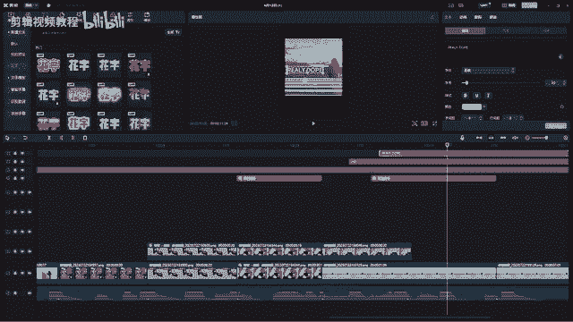

我们可以看到这里的描边，其实我们可以颜色，对吧？我们可以自己调哎，弄成这种。还，有点点这个黄色OK直接复制ctrl C复制它的这个色号啊。好，然后呢给这一层，那先在这里张贴色号。

对吧这样的话他们的呃这个描边的颜色呢就是一样的啦。Like really， dope。对吧ok那这样的话，我们的最后的这个效果制作呢就已经全部完成了。O然后呢我们现在整体来看一遍啊。You know。

 I think。🎼I think。🎼That you are do。Like really， dope。是吧是不是就做完了？OK那现在做完了以后，那我们直接导出呢就可以了。这里面导出的话呢。

我跟大家去去讲解一下啊，导出面板。首先我们先点击导出，然后呢，导出面板的话，这里面标题就是我们的今天比如说我们这个是卡点。

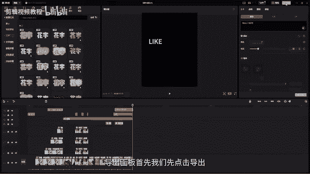

卡点视频。呃，案例。对不对？然后呢，下面这个导出到哪里？那这个的话呢是我们的，比如说导出路径，然后我们找到，比如说今天这个是这节OK我们直接新建一个文件夹，叫什么呢？叫做输出。好，选中这个文件夹进去。

那这个就是我们导出的路径啊。OK然后呢，下面这个什么分辨率啊，那我就用默认的1920就行了。那你也可以直接输出成720啊，但是呢这里面它是没办法自定义的，所以我们就选一个比较高清超清的就行了。

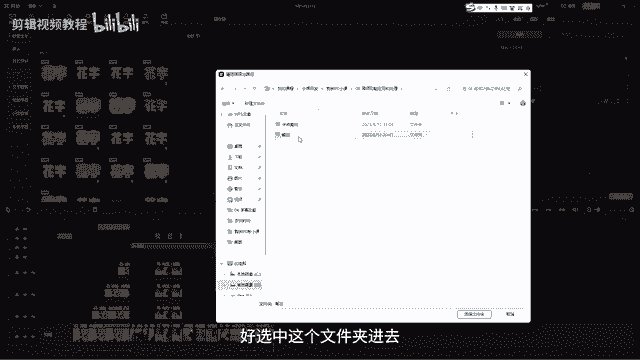

好，然后呢码率码率的话呢，我们愿用这个自定义的就可以啊，用自定义就行。然后呢，这个选VBR就是它这个码率的一个输出模式。好，编码选H。264格式MP4格式帧率帧率30帧或者是25帧都可以啊。

那这个你自己去选OK然后完了以后我们直接点击导出。那等会儿他自己就导出啊。

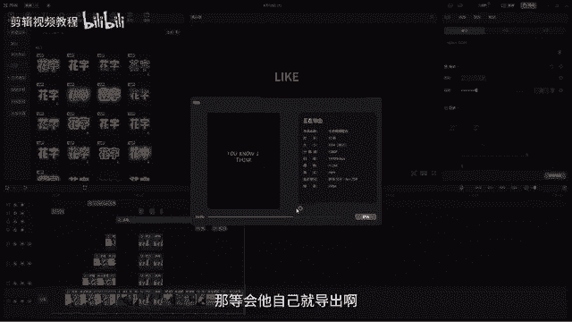

好，那我们现在可以看到它已经导出成功了。那我们找到刚刚我们输出的这个视频啊。对吧刚刚是不是在这里面我们点击了一个输出，然后呢，我们输出这个就是我们刚刚已经做好的视频，我们一起来看一下。

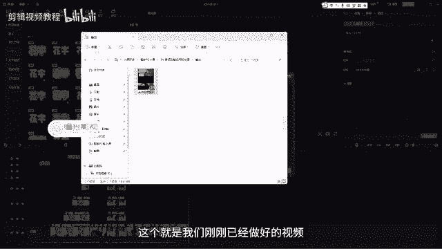

🎼I think。🎼That you are joke。

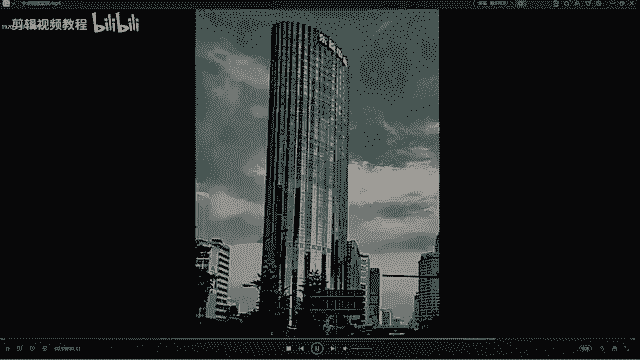

Like really， dope。对吧这个时就是我们做好的OK然后呢现在我们做好以后，那我们就可以发布到我们的一些平台上面呢就可以了。好，那今天这节课的话，我们就先到这里，我们下节课再见。

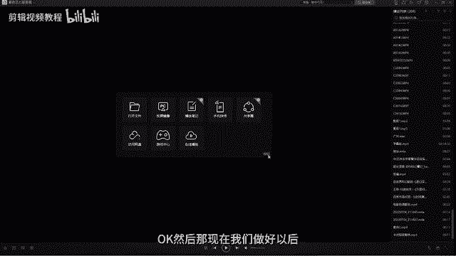

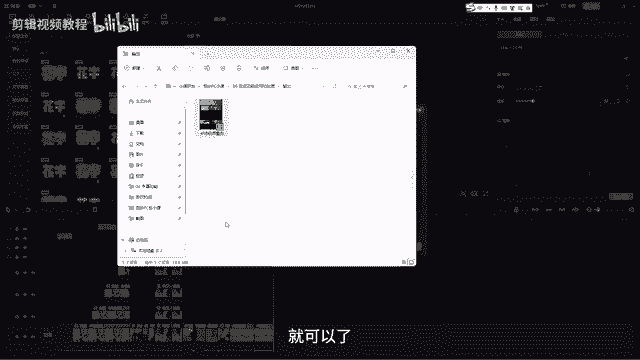

