# 最系统的剪映电脑版教程 【2024】最新版 视频剪辑小白入门必学的一门剪映课程 - P3：剪映初步认识和运用 - 视频号运营教程1 - BV1dM2vY7EpB

那我们双击这个图标呢就可以进入到我们的剪映里面，然后就可以去学习了。OK然后呢进来了以后，它长这样子的，打开了以后，它的窗口是这样子的啊。那我们大概来认识一下它的这个面板。呃，旁边这个的话呢。

这里面是你的账号。好，这个账号的话，你可以去呃就是你可以去啊登录你的抖音账号啊，登录抖音账号。然后呢呃你在抖音上面的一些比如说你的音乐收藏啊呃音乐收藏啊。

呃就可以在我们的这个地方就是你的这个呃云空间这里面，然后呢就可以在里调用啊，OK那这一面的话呢，相当于是你个人的啊个人的一个面板啊，个人主页的一个面板。好。

这里面主要跟大家讲的是我们这里有一个叫我的云空间。那这个云空间的话呢是检验它自己啊，自己给每一个账号，然后呢都有的一个相当于百度网盘一样啊，可以用来。啊。呃啊呃不是P2课程吗？

怎么是剪映啊我们有这个课程安排进去啊，现在剪映它已经啊呃这个P2我们能讲的都讲完了啊，剩下的到终极班，你们就做案例去啊。然后呢呃这个这个我们来学一节这个剪映课程啊。

OK然后呢这个云空间相当于是我们的一个空啊，就是线上的一个云盘，我们可以用来储存东西啊，好，这里面它默认每个人的话呢是有3G的一个内存，那你也可以去扩充啊，扩容扩容的话可能就要花钱了，对吧？

那我们不用去扩啊，那你可以把你的一些啊音乐或者是你平时比较喜欢的一些歌曲。然后呢可以放到这里面来。那这样的话呢，你下一次啊剪辑的时候，你就不用再去啊把你的硬盘插在电脑上啊，你可以直接调用。

那待会儿我会教大家怎么去调用啊。好，那这个是我们要讲的那其他的这些我们经常用不到，我们就不用去管它啊。好。😊，点击首页这个地方，我们再来看一下整个面板OK然后呢，这上面这个点击开始创作的话呢。

相比于P2来说，就相当于是新建项目一样啊，这个地方就相就相当于新建项目。然后呢，下面的这一堆的话呢，就是你的一些历史记录了。

就是你做的项目的历史记录啊啊O然后呢这里面的要这里面的话要跟大家讲一下关于剪映对于我们工程文件的一个储存。那么我们在我们的第二节课的时候已经讲过了我们P2它是什么P2它是一个工程啊，一个项目一个工程。

对不对？好，一对一的这样的一个呃工程呃，就是一个项目选择。但是呢在我们的简验里面，它是一整个工程，然后可以对应多个项目。那我们下面这些就都是我们项目的一些制作记录啊。检验的话呢。

不需要单独储存工程文件啊，你只需要制作就可以了。它会自动的在这个地方啊，把你的那些工程文件。全部都储存在这里。然后呢，你可以在这里去选择对应的，或者是你以前制作完的，然后点击进去啊。那大家可以看到啊。

我大部分都是用剪印来干嘛加字幕的啊。所以我的很多很多我的历史记录。然后呢，都是啊加字幕的一些这个这个就是这个制作啊。好，然后呢我们再来看一下它中间的这一堆啊，那这一堆里面的话呢。

主要跟大家讲的是这个还有我们的呃看一下啊。好，我主要跟大家讲这个对不对？讲文字文字成篇的这一个。然后还有我们的呃下面导入工程的这个选项。其他的这些的话呢，你你你感兴趣的话，你就去啊，你就点开来看一下啊。

反正全都是中文，只要会用P2，然后呢，对于剪映来说也是so easy啊。好，那么我们啊我们大概了解了它整个面板以后，那么我们又回到了我们啊之前上课的时候，我们说过啊，我们使用任何的一个软件啊。

我们打开软件的第一步，我们需要干嘛呀？还记得吗？😊，打开我们的软件啊，任何软件我们打开啊，就是我们要使用这个软件。第一步我们需要干嘛？有没有同学，我看谁最先反应过来哦，回乡同学设置啊，非常好设置对不对？

哎，那剪映它也是一样啊，我们点开这里啊，它旁边这里有一个叫什么全局设置好，然后呢这里面有个全局设置，点开OK点开了以后，它这里面有一个叫草稿，这个草稿是什么意思呢？这个草稿指的就是我们的这一些项目啊。

哎，在剪映里面它项目不叫项目，它叫草稿，对不对啊，叫草稿啊，所以它这里说你的草稿位置，素材下载位置，还有你的啊什么预设保存位置啊，那这些默认全部都是在C盘上面的。唉。

所以我们需要把它全部都给它改到我们的其他盘里面，那大家可以看到我现在已经全部都改到我们的D盘里，对吧？那你就可以在你的呃，比如说你你。😊，你的电脑上啊，你的电脑上，然后呢，你在哪个哪个盘里面。

然后呢动不到它，你就在这个盘里面。好，新建一个文件夹啊，像我一样就新建了一个文件夹，叫剪映缓存啊，那我所有的缓存文件。好，预设素材啊，预设文件，还有我们的素材文件，然后我就全部都放到这里面来啊。

那这样的话呢，哎我下次去找的时候，我就不容易去删它，同时呢我也比较容易找到，对吧？OK然后呢，这个地方啊全部设置完了以后，其他的不变。然后呢，找到我们的剪辑啊剪辑这个地方，OK然后呢。

这些地方都不用去啊都不用去设置。好，这里有一个叫性能看到没有？哎，打开性能。然后呢这这里面有一个叫渲染文件，哎，我的这个渲染文件啊，也没有设置。然后大家默认的也是在C盘啊，所以我们点击一下。好。

找到对吧？找到我们的这个OK找到。我们剪映缓存文件选择文件夹哦，OK改一下啊，改变一下。好，然后呢这里有一个叫代理的位置，这个也是啊它默认也是在C盘上的啊。

我们也是需要把它换成我们刚刚设置的这个简映缓存啊。那做完这些步骤以后，那这个时候就已经全部都啊全部都设置完了，点击保存啊，那这样的话呢，我们就可以直接用我们的剪映了啊，哎，大家千万不要去哎随便点。

因为剪映它里面很多素材是需要我们唉呃线上或者是联网去点的啊。那如果你是没有设置的话呢，你的电脑会很卡啊，越用越卡啊，所以这个是所有软件的一个通病啊，我们第一步要先设置一下。O然后呢做完了以后。

那么我们啊我们来看一下这里有一个叫什么教程，对不对？剪辑教程啊。那如果剪映里面它有很多的一些细节啊，然后呢，大家看了以后觉得不够熟悉的话，可以去点击这里面进入到它的官网里面去看一下它的教程啊。

这里面这个是官网出的剪映的一个基础教程，大家可以去看一下好，那我们现在来看一下这个地方叫做文字成篇啊，我们来看一下这个功能。那这个功能的话呢，是目前剪映，剪映它非常神奇很牛逼的一个地方啊。

就是呢它可以帮你写文章啊，帮你写文案，甚至呢写完文案以后，它帮你做片子啊，我们相当于啊只需要给它出一个啊出一个题，然后呢他就帮你创作了啊。那我们来啊来看一下，点击进入到我们这里面，它告诉你需要输入文案。

那这里面的话呢，我们啊现在我们还没有文案。所以我们可以让他帮我们写，对不对？点击。下面这里有个智能写文案OK然后呢，它有讲解类的，有营销类的。那么我们就选一个营销类的。好，比如说啊你要卖什么产品啊。

那比如说我们就卖个可乐，对不对？好呃，可口可乐。OK我们的产品是可口可乐。然后呢，你的这个可乐它的特点是什么？可乐的特点是什么？呃，好喝对不对啊？你就写一些关键词啊，好喝呃，然后呢这个呃什么运动，哎。

可乐还有这种汽水对不对？好，它的它的一些特点啊，汽水，然后呢呃爽啊喝喝可乐是不是有很很爽的这种感觉。😊，OK然后呢还有什么呢？还有还有这个嗯可乐，快点，大家啊，大家看一下啊啊，之前没有用过代理啊。

这个简易使用代理说实话啊很糟糕啊，我都不喜欢用啊，所以我觉得也没有必要用这个剪映啊，肥宅快乐水。😊，日本生可乐O爆炸好啊，非常好啊，这些词都可以啊，放到这里面。好，肥宅快乐水O那那这个对吧？

这个比如说像这些就是我们的呃这个可乐它的一个啊特殊的一些一些词语，然后呢弄完以后点击旁边这里升级点一下啊，那下他现在就开始创作了，对不对？好，我们稍等一下他创作啊，那现在他就已经创作好了啊。

大家可以看一下啊，呃他已经咚咚咚咚写了一堆，对不对？写了一堆啊，然后呢，把你帮就是他已经把你刚刚啊我们写到的一些文案，然后呢或者是一些关键词，它都放到这里面来了。然后写完以后你觉得这个可以的话。

你就点击确认，你觉得不行，他写的不好的话，我们再点击下一篇啊，然后呢再下一篇对不对？O然后呢再下一篇啊，比如说我们现在就看到这个比如说这一篇我们就觉得嗯还不错，然后我们点击。😊，确认对吧？

OK那这样的话，我们的文案是不是就写好了？好，那文案写好了以后，我们还可以给它加一个配音。那么配音在哪里呢？配音在我们的这里面对不对？好，这里面啊可以选配音，有很多啊，像这个是猴哥的。好。

我们可以听一下可口可乐。😊，好，然后还有这个可口可乐。好，那重可口可乐。😊，可口可乐。可口可乐OK比如说我们就用这个TVB女生，然后呢可口可乐好，就选她，对不对？家人们谁懂了？

O我比如说我们就用这个TVB女生啊，然后弄完以后我们点击这里生成视频啊，点击生成视频，然后呢它这里有几个选项，要让我们来选好，智能匹配素材还是使用本地素材，智能匹配表情包，那我们这里选的是什么？

我们选的是第一个智能匹配素材，就是说我们要剪映自动找到对应的素材来啊来剪我们这个片子啊，我们点击智能匹配素材。O那这个时候他已经在生成我们的视频了啊，我们拭目以待看看啊，待会儿啊。

待会儿然后它会帮我们剪成一个什么样的一个片子啊，大家稍等一下。😊，O我们稍等一下啊稍等一下。😊，🤧嗯。🎼好，他现在可能有点慢啊，有一些素材啊，它会自动联网到网上去找到对应的素材，然后呢。

他就呃就帮我们直接就剪啊，我们都不需要啊，不需要自己动手，那这种的话最适合去发那种就是就比如说你去到一些呃那种短视频公司。

它让你一天剪10个20个片子大部分大部分的一些片子其实它就是用这个AI自动生成的都不需要你去做，对吧？那甚至你让AI生成以后，个别镜头你替换一下就可以了啊。那我们可以看到自动做完了以后。

它就是这样子的对吧？好，背景音乐它给你选了，好，配音也有了，然后呢甚至字幕都给你做了，画面也有了。O那我们一起来看一下啊，它剪了1个50秒的视频，我们一起来看啊，可口可乐好喝到让你想嫁给它。

每一口都有清新的柠檬味，还有淡淡的甜味，让你一口接一口，喝到最后还想再来一口可口可乐，不仅仅是好。😊，🎼喝更是适合多种口味的人群，无论你是喜欢甜味的还是偏爱酸味的，都能找到自己喜欢的口味。

而且可口可乐不仅好喝，还含有丰富的维生素和糖分，能够给身体提供足够的能量和营养，无论是上班学习还是休闲娱乐，可口可乐都是你的最佳选择。所以如果你还没有喝过可口可乐，那么赶快来一瓶吧，好喝到让你想嫁给他。

😊。

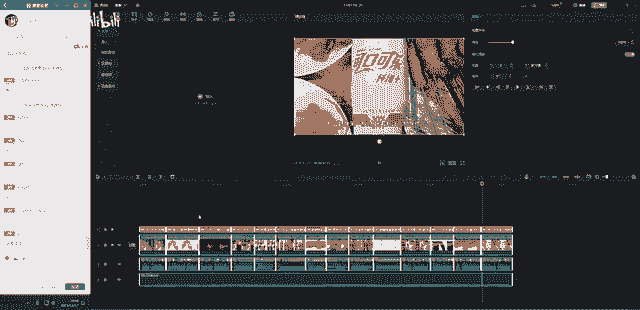

OK那这个的话呢就已经做好了，对吧？哎，这种。😊，是不是我们我们都不需要啊？如果这个片子哪怕真的只做成这种像呃PPT式的这种片子，让我们自己去做。那你把文案你要自己把文案写完。

那可能得是两三个小时之后了，对吧？然后呢再去再去配音啊，要去网上一些专业的配音软件，然后再去配一下音，那可能又要花又要花一两个小时的时间。O然后呢你再花你在配音的时候。

你还要去找对应的一些素材啊啊哐哐哐的再去找那可能你一天啊大概最快最快一天可能也最多得做两三个，对不对？两三个啊，但是用简易的话，是不是前后啊可能10分钟都不要，是不是它就全部都已经全部给你弄好了。

那比如说里面有一些像这里面啊，像这个镜头每一口都是柠檬味儿。那比如说这个镜头它放的是其他饮料，哎，你可以替换掉嘛，哎你可以换成一个柠檬啊，只是有柠檬的图片，然后放到这里面来。是不是就就可以生成出片了。

对吧？😊，然后这个就是我们啊剪映它非常神奇很牛逼的一个地方，就是什么呢？就是它的这个啊AI智能啊AI智能的这个地方。那针对于我们一些短视频信息流广告啊，或者是这种呃PPT式的讲解啊等等之类的。

非常适用啊。所以啊这个学好的话，真的可以大大的提高你今后的一个工作效率啊。OK那这个是我们的这个地方，对吧？这个是这个，然后呢，待会大家自己去试一下啊。好，那第二个我们要讲的是什么呢？

就是我们的这个地方叫导入工程。

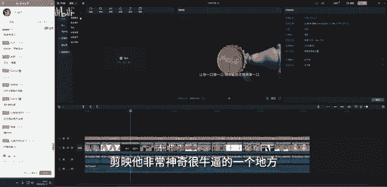

那我们可以看到啊，我们的剪映它是可以导入我们PR的工程的。哎，就比如说啊我们检验里面其实它有很多很多的一些效果呢非常的丰富，对不对？那么我们P啊PR里面的话呢，它是没有的。

很多效果都是需要我们去安装插件啊，甚至的话呢有一些插件哈全是英文的，我们看的时候可能看都看不懂，然后效果也不是很好啊。那比如说现在我剪的这个小片子，对不对？好，这个小片子我剪完了以后，然后呢。

我想把它放到剪验里面去加特效可不可以呢？哎可以啊，我们只需要把这个工程文件保存一下啊，保存一下，对吧？然后呢进入到这里面点击导入工程啊，O然后呢找一下啊，找一下我们的这个啊工程它的文件在哪里好。

放到这里面好，找一下O是不是这个然后选中它点击打开。那它就会自动的去读取我们PR的这个工程啊，然后呢它就会自动打开了就。

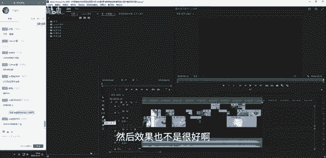

需要啊不需要我们再把视频导出一遍，然后呢再再进入到简易里去加特效啊，直接工程互换啊，工程互换非常的快捷啊。OK然后呢呃他现在这里跳出很多个啊，那么我们选第一个一般选第一个就行了，点击打开。好。

那现在的话它是不是就已经全部都进来了，对吧？然后呢，他现在告诉你这些素材啊出现了丢失啊，然后呢我们可以怎么样，你可以去链接一下，也可以点击取消啊，那我们现在来看一下啊，哎它它导入进来的。

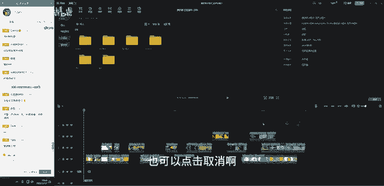

对吧那这个是就是我们在PR里面剪的一模一样，大家可以看到啊，它一模一样的把我们的这个工程直接搬过来了啊。那唯一丢失的是什么呢？丢失的是我们在PR里面加了一些交叉溶解的转换。

那那个剪映它识别不了PR的这一些效果，所以它这个效果丢失了，当时呢我们得素材音乐，然后都全部都进来了。看到没有？那我们是不是就可以在这个基础上，然后呢就直接去剪辑了。

那所以我们就不需要啊不需要再到PR里面啊苦苦兮兮的然后在这里面去下载拆插件，然后来做特效了，直接进入到剪映里面，然后呢去进行啊我们的一些特效的操作。那这个时候有同学就会问了，哎。

老师为什么我不直接在检验里剪呢？为什么我非得要在PR里面去剪。那这个的话呢就是我们剪映啊，它跟PR之间有一些就是不同的地方在于剪映它目前它的这个时间线，还有它里面的一些设置的话呢，更多针对的是什么？

针对。

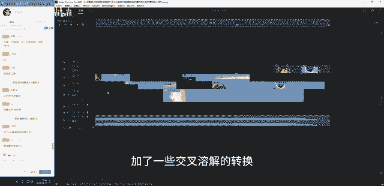

的是短视频，还有这种呃，比如说基础小白啊，或者是普通普通大众普通大众的这种视频的剪辑。哎，它只满足这些，就是满足我们所有人，然后对视频的一个基础的剪辑。那你要进入更加专业性的一些操作里面的话呢。

剪映你用下来就很痛苦。啊，所以我们剪映的话呢，它为什么啊为什么目前它虽然那么火，它还是没有替代我们这个PR的原因在于它如果你要去对视频进行更专业性的一些操作的话，剪映是不能实现的。

比如啊比如我们在这个PR里面，我们可以加蒙版，对不对？好，我们找到这边好，我们可以直接在这个地方去加蒙版，你可以去自定义你的任何画面啊，然后呢去调它的滤镜啊，甚至调它的预设啊，或者是等等之类的。

然后剪映它就没有这个操作啊，就没有这个功能的操作啊。它的蒙版里面基础非常少。我们。以看到模板它就只有这些，并且是非常被动的，只有他设定好的这些操作。相对于P2里面的自定义啊自定义模板来说。

它这里面就如果你要去抠抠笑的话，你就很痛苦啊。那这个是啊一点。还有的话剪映你检长视频的话，对吧？你检长视频的话，它是非常卡的啊，所以所以你做这种比较短的。

比如说5分钟以内的这种比较简单的视频的剪辑的话呢，是可以的那如果你要导入一些比如说4K啊8K啊，甚至是好更大的一些什么log模式呃，肉格式的一些素材，你导入进来的话，它可能整个就卡崩了啊。

所以就啊就不方便啊，那我们的这个剪映的话，如果它能把这些功能给它优化掉。就是它既满足于呃专业啊专业呃专业人群的一个工作需求又能满足零基础人群的的这个需求的话。

那剪映真的哎它直接可以把这个P2直接可以占领了占领市场了啊。P2。可能在就没有人在用了。但是呢目前他做不到啊，目前做不到。所以我们再怎么恨，我们还是要咬牙使用PR的原因啊。

OK那这个是关于啊我们这个呃检映它能读取我们P2的这个工程啊，那我们现在剪映跟P2的话呢，P2它也有一个功能在哪里呢？在这里面啊，在我们的呃窗口这里有一个扩展。那这里面的话呢。

我们是可以去读取我们检验里面的一些字幕文件的啊。那这个的话呢是需要用到23版本，好像呃23版本里面啊，啊，在扩展这里面可以直接读取剪映里面的这个SRT字幕文件啊，就是这个SRT啊字幕文件。

然后这个到到中级班，然后呢，大家学到字幕的时候呢，就就知道了啊。那这里面的话呢大家去做一个了解呢就可以。好，那我们就讲到这里继续回到我们的首页上啊，回到首页上OK那么我们现在看到这里面啊，看到这里面。

然后呢啊我们点击这个开始，我们直接进入到剪映它整个面板里面，然后呢去进行学习。好，今天的话呢主要就是学习剪映面板啊，剪映的整个面板的一个呃学习啊，然后呢里面的一些基础操作的话呢。

其实你只要会用PR对于剪映来说也是非常简单的啊。O那我们可以看到啊剪映的话呢，在它的这边有一个一个窗口，对不对？好，它它的窗口相比于PR来说，这个面板呢就是少很多啊，那中间这个呢可以看到就是播放器了。

好。然后下面这一大长条就是我们的时间线。好，旁边的这个啊，这个是我们的项目窗口素材啊，视频音频导入全部都放到这里面啊。然后呢，这面这一块的话我们可以看到现在的话呢它显示的是草稿参数。

那其实相对于PR来说，它就是我们的项目设置啊。所以你可以在这里看到哎你的这个草稿名称叫什么名字，然后呢哎保存的位置在哪里，然后甚至它的一些帧率是多少，然后呢，对吧？哎一些基本的好，基本的一些信息啊。

你也可以点击修改好呢，就可以直接进入到它这里面去修改啊，比如说我们想把它的名称修改一下，对吧？好，我们就叫简映学习。

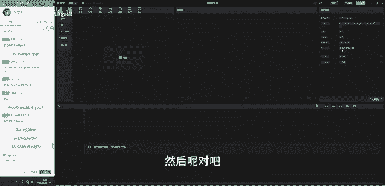

好，点击保存。那这样的话它的名称是不是就改了，对吧？OK然后呢，那这个面板的话呢，它除了是我们的参考参数啊，草稿参数它还是我们的效果控件。就是当你的时间线上有内容的时候。

这边它就显示的是我们的效果控件啊，就可以用来调整我们视频的一些基本参数参数啊，OK那么我们打开我们前面啊，刚刚我们导入的这个好一石流小短片。然后呢，我们在这个这个基础上。

然后给大家去讲我们里面的一些内容啊。首先。

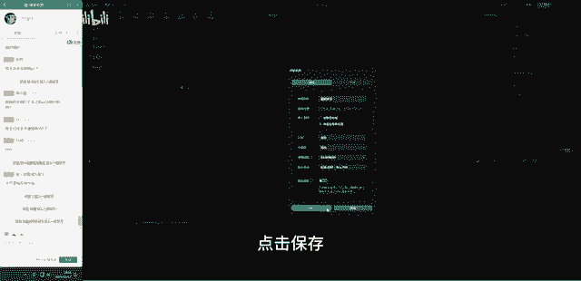

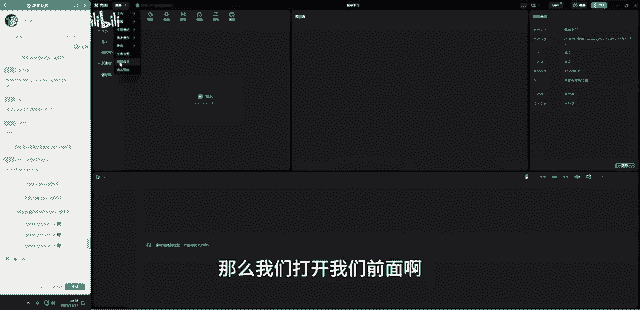

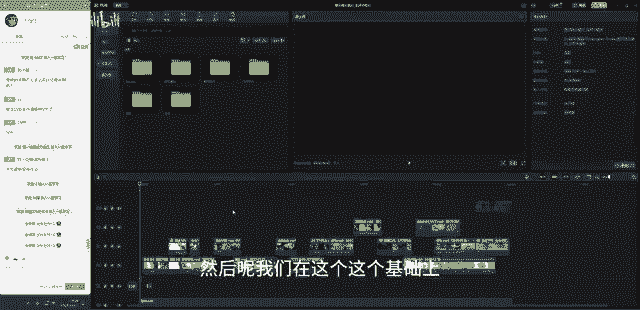

呃，首先我们来看一下啊，我们来看一下啊，我们可以看到刚刚我导入的一些素材，对吧？全部都在这里面，它也可以以文件型的呃文件的形式导入。那你也可以直接单个素材导入啊，导入素材的话呢，也是一样。

你可以直接拖进来，看到没有？直接拖，你也可以直接在这里右键，然后去啊这里面啊去呃这里面点击这里导入啊，它也是一样，可以去导入，对吧？OK然后双击导入我们的素材啊。

可以用这种方式去导入OK然后呢呃这个是它的项目窗口啊，音频啊什么的，全部都导入都会放到这里面啊。OK然后呢，这些的话就是它的一些排列方法啊，你要以这种方式去排列，还是要以这种九宫格的方式去排列啊。

那这个呃这个就是我们那个那个什么跟我们的PR的那个项目窗口其实是一样的啊。呃，什么呃，记得有作业没有啊，没有这节课没有作业啊。剪映的啊案例操作的话呢，在中级班啊。

我们初级班组只要做一个简单的学习呢就可以啊。OK然后呢，那旁边这一堆是什么呢？我们来看一下啊，旁边这一堆呢就是啊剪映它非常神奇，非常啊牛逼的一个存在了啊。首先第一个我们看到它是媒体，那媒体的话呢。

它分为本地的还有云素材，还有素材库，本地的话呢指的就是我们自己的素材，对吧？指的是我们自己导入的素材。好，这里的话呢，这个叫云素材。这个云素材的话呢，比如说你的抖呃抖音上面对不对？抖音啊。

抖音你储存了一些素材的话，你登录你的账号啊，比如说我现在我登录一下我的抖音账号，或者是谁的，可以登录一下啊。嗯，我看一下我的抖音，然后登录一下这个账号啊。12啊，这是扫描在这里。OK然后呢。

现在啊同意授权。对吧哎，你登录了以后，那么以前你这个抖音账号，比如说我在抖音上啊，我在抖音上刷抖音的时候，我听到一些好听的歌曲，然后呢，我就会怎么样收藏起来，然后呢，他就会把你的这些就会放到这里面啊。

就在你的这个云素材里面，你就可以啊就可以看到了啊。然后呢，还有什么呢？还有你自己你可以自己上传啊，你可以自己上上传一些素材到这里面，对不对？OK然后直接拖啊，把这些素材直接拖进去呢就可以了。

比如说比如说我们这边啊我们随便拖一个，对不对？OK我们直接啊随便拖。好，它还拖不了。那么我们啊点击一下如何上传素材，随时随地享用OK然后呢，我们其实这个上传素材的话，需要回到我们的呃首页面板这里啊。

在这里面去拖对吧？在这里面啊，在这里面你就可以直接拖进去了啊。比如说我们现在把这个旋转树叶给它拖进来松开，然后呢，它现在就已经在上传了，看到没有？那么我们这个树页就就进来了，OK那么我们啊进入到这里面。

我们好点击这个进来O然后呢在我们的云素材，这里面大家可以看到这个树叶是不是就就进来了，好，你点击下载，然后呢，是不是这个树叶的素材就下载了，我们就直接拖到我们的时间线上就可以直接用了，对吧？这个素材。

那这个是我们的云素材，就是你可以上传你自己喜欢的常用的一些素材啊。O然后呢最神奇的是它这里有一个叫素材库，那这个素材库的话，就是里面有大量的目前网络上非常。

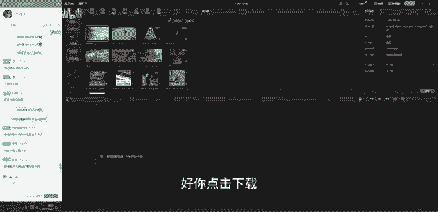

火的流行的潮流的很常用的一些素材。比如说比如说这些啊这是熟悉吧，这些熟悉啊，这种黑人问号，还有这些啊还有这种这个这个对吧？nice的这个是不是都也放眼望去都太常用了，对不对？好这哎呀真香这些啊啊。

这个这个我信你个鬼这些素材是不是都是我们在抖音上刷短视频的时候，都非常常见到的一些素材，对吧？那你可以直接点击一下啊，比如说像这个好我们点击一下，啊，等他下载完，我信你个鬼，你这个糟老头解坏的对吧？

然后呢现在弄完以后，我们可以点击这里加号或者是我们直接按着左键不动给它拖下来啊，那这样的话这个素材是不是就拖下来了，我信你个鬼对吧？我们就可以直接用啊，那当我们的时间线上有这个素材的时候。

我们这边它跳出来，就是我们的一些啊基本参数的一些调节啊，所以所以这个这个面板的话，它既是我。😊，我们的项目设置啊，也是我们的呃也是我们的这个呃效果控件OK然后呢，这项目还有很多啊。

这个素材它分热门的片头片尾、热梗啊，还有情绪萌宠背景，好，转场故障呃，科技空境氛为还有绿幕，对吧？哎，像一些这种绿幕素材。🎼好，比如说杰瑞的这个。对吧它还自带音频，那我们是不是就可以啊。

如果我们要用的话，我们直接调过来啊，把它这个绿幕用哎，用我们的这个抠一下像，然后是不是就可以啊就可以直接用了。OK上面还有个叫品牌啊品牌素材啊，啊像这一些的话呢，可能唉这个应该是它刚刚新增的吧。

新增的啊，新增的叫品牌素材。那像这些的话呢，就目前它还没有，对吧？还没有那么啊，我们就可以不用去弄它啊，OK然后呢那这个的话就是我们这边的一个云素材。好，我们再来看一下啊，这上面这些就是它的什么音频。

那音频这里面的话就是我们的一些音乐啊，音乐你也可以直接啊，比如说这里抖音，像我的话就储存了一些啊一些喜欢的音乐，对不对？然后呢好这里面它有一个收藏，看到没有啊，像我的话我就收藏的这两首歌啊，在抖音上。

那那如果你收藏很多的话，这里面就会显示很多啊，那还有一些就是抖音它自带的啊。

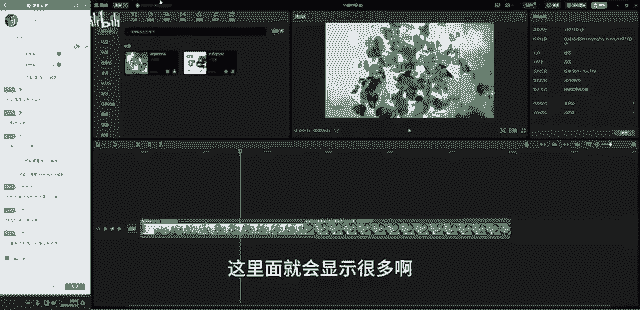

🎼他的这个音乐，比如说我们上一节课不是剪了那个卡点视频吗？那在这里面它也有，对不对？卡点呢我们随便点一首来听一下看看。呃，比如说这首。哎呦，这个声音太大了。😊，好，然后对吧？比如说我们现在啊选完以后。

我们可以直接拖过来，拖到我们的时间线上。😊，🎼对吧是不是我们剪辑啊，我们大概啊拖动这根线，它的这根线啊，大家注意它的这根线好，它的这根线跟我们的这个呃PR里面一样，这根线控制就是音量啊，我们放小一点。

我们来看一下啊，来把这个关掉。好，我们来听一下这个音。Start。🎼Oh。对不对？那我们去捡那种混剪类卡点类的话，是不是就可以直接调用它这些音乐啊，就不用我们自己去呃苦兮兮的去下载去找啊，非常的方便。

O然后还有什么vlog旅行啊，还有什么悬疑的浪漫的轻快美食儿歌动感的舒缓的可爱的国风的啊，就音乐类型非常非常多啊，甚至有音效啊，音效，比如说一些我们转场的时候，那种刷刷刷的音效啊，它也有，对不对？好。

笑声综艺悬疑BGM人声转场，像转场的这种护士，就是呼吸。然后听一下。对吧这种呼吸好揪对吧？这些树就非常常用。然后我们啊我们经常剪片的时候都非常常用这些这些音效啊。好，它下面还有非常多啊。那这里面的话呢。

这个关于音频这一块的话，我们就先讲到这里。😊，然后呢呃还有这里有一个叫音音频提取，对吧？音频提取。比如说我们有一些视频啊，我看一下，我看刚刚我我们剪的那个一石留小短篇啊。🎼哎，等一下啊，我把它好整过来。

OK比如说我们想要去提取它的音频，我们把刚刚的这个片子啊，这个片子我们给它扔进来。好扔进来。那这个时候啊这个时候对不对？这个时候它就自动的就把我们的音频提取出来了，看到没有？自动的就提取出来了啊。

都不用我们去操作啊，就是你只要放比如说我们在一些你在B站或者是呃抖音上面对吧？你下载了一些视频，你想直接把它视频去掉，只想要它的音频，你直接一丢到这里面啊，就有了，我们脱下来。好。

那这个的话音频是不是就已经弄啊，就已经全部都弄好了，对不对？我们来看一下啊。😊。

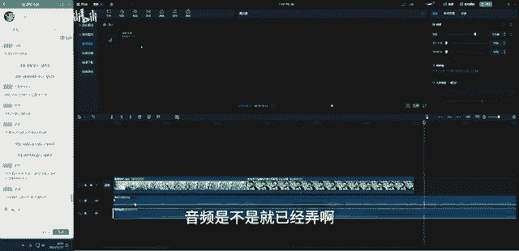

OK那这个是我们的好，这个地方啊，还有抖音收藏的一些音乐啊，链接下载啊，品牌音乐啊，这些啊这个不用去管它啊。OK那这个是我们的素材库。好，这里它的一个文字啊，文字的话呢呃主要的话呢我跟大家去讲一下啊。

讲一下这个它的这个文字。好，这里新建文本的话呢，其实就相当于新建文字啊，你点击默认，然后我们就可以在这里面去打字。那它打字的一个位置的话呢，是跟你的滑快的位置是一样的。比如说我们啊放到这里来对吧？好。

你放到这里来，那你就可以放一个啊，我就选一个回乡。对吧，回乡啊，两个名字啊就放到这里面来。那那这个文字的话，你想给它换一些预设。那这个预设的话呢，你可以直接啊直接在这里面哎，它这里面你你打文字的话。

这边它跳出来就是一些啊文本，它的一些基本预设啊，你在也可以去调它的字体，然后还有字号的大小，加粗啊，加粗啊，或者是给改一下颜色字间距啊，然后呢，这里面你还可以去给它添加字体的样式，对不对？

OK比如说啊添添加的这种好，这里面它还有很多啊，好，哎加上这种哎，加上你喜欢的啊，对吧？哎，你喜欢的，比如说加上这个这个还挺好看的，好，然后你现在还可以给它拉大一点，哎，放大一点。OK然后呢。

下面还有很多啊还有很多什么哎像这些什么旋转啊，然后呢混合啊，然这里面大家可以看到啊，它这里的这个位置的话呢，只要么就是啊字己去调啊，这个数值你是拉不了的，你只能去点它的。😊，上下左右啊这个来调。

那这一点的话呢啊我就觉得很很不很不合谐，很不合理，对不对不对？然后我们呃我们可以自己啊手动去拉的话呢，会更方便。但是呢它没有啊，然后呢，这个也是它的好它的这个旋转啊O然后给它归零O然后这上面它的居中啊。

位置居中，对不对？居中啊，O然后上面还有混合模式这不透明度好，不透明度，那它这个关键帧的话呢，也是可以去打关键帧的啊，比如说不透明度一开始的时候，好打一个关键帧啊，点击关键帧好，把它改为零啊。

然后呢O然后呢到这边啊到这边的时候，然后呢把它怎么样好，打过来O然后呢这个时候呢它也是可以做一个好，这种慢慢慢慢渐变的这种效果，对吧？那这个是打关键帧啊，打关键帧那检验里面这个关键帧的话呢。

呃你是移动不了啊，唉现在可以移动了啊，以前是不能移动的，好吧，我孤陋寡闻了啊。OK然后这是它的这是它的关键帧啊。那你不需要的话，我们就删除OK然后呢再选中这个删除，对吧？然后给它改回来啊。😊。

能K动画能啊哎能只要它后面看到没有？它后面有这个小方块，那这个就是我们的关键帧啊，只要有这个小方块的，你都可以K啊。看到没有？好，那这个你还可以给这个文字加个发光，对吧？好发光发光好。

这个颜色比如说换一个炸裂一点的颜色。黄色。啊，对吧哎你可以给它发这种光啊，或者是这种光啊，哎，现在可以做这种发光啊，好阴影，然后还有加什么弯曲，哎，给它做这种。哎，你看哎弯弯大一点，然后弯弯回来啊。

怎么弯都可以啊，就就调整的非常多，都不需要你去做动画，对吧？不需要这种插件啊，直接在它的这个面板里面去调，并且最神奇的是它的这个是软件自带的，它不会占用电脑内存啊，我们直接用就可以了啊。

所以这个是相比于PR来说非常香的一个地方啊，O然后后面还有这种什么气泡，比如说这两个字，你想让它以这种对话框的形式出来，对吧？然后它就有哎网上应该有很多啊，我们看那种模拟两个人在聊天的那种。

其实就是在这里面去用的啊，微信聊天记录，对不对？好，甚至如果你弄的是漫画的话，哎，可以弄成这种好，这个是气泡。好，旁边这个也是花字啊，除了我们刚刚这边基础款的这些花字，它这里还有更加漂亮的。好。

像这些对吧？花字好，花字好去选啊。那气泡如果你不需要的话，点击这里面无，那就可以了，对吧？OK然后呢呃这里还有动画，那动画的话就是这个你文字出现的动画啊，选中这个，比如说它就是有这种哎还有这些。

对吧O还有这种蹦出来，唉，这种是不是这个跟我们上一节课给大家讲那个转场插件就比较类似，对不对？转场插件在PR里面我们需要自己去安装，而且嗯它很占我们的电脑内存啊，一用的话，我们时间线就红。

那在这上面这些用的话就很快捷啊。所以我们很多很多做一些片子的时候，我们都会直接用我们的这个剪映来加这个文字就非常快。下面你可以直接调它的时长啊。比如说现在是0。5秒，你还可以加长一点啊，这根线啊。

它这里有一根。OK这里有一根这个箭头，这根线指的就是它动画的一个时长啊。🎼对吧那这个是我们的动画，还有这个是入场，这个是出场。OK比如说我们现在把它关掉啊，这是出场。然后呢。

这里是循环循环的意思就是出场加入场一起。然后呢，它有一个结束和结尾啊，好做这种是吧？这种文字呢常见过吧，比较常见的吧，这种文字啊，就是这个滚筒的文字，比如说我们可以加多一点。好。

把这两个文字啊在基本这边我们可以加多一点，茴香很漂亮。是吧哎，然后现在他就是他就是这样子的，看到没有？😊，🎼对吧这个效果是不是就非常的漂亮？OK然后呢呃在动画这里面啊，动画这里面你还可以换成其他的啊。

换成这种。🎼好，现在换成这些啊，那那这里面它这上面有这种MVP的话，你就需要充值MVP你才能用啊。如果你没有MVP的话，你只能用这些就没有MVP的啊这些基础的。但是的话呢也是已经很很满足了，对吧？哎。

已经有很多很多的效果了啊，那这是它的一个循环动画，还有跟踪啊，跟踪的话，目前这个呃反正我用下来我觉得没什么效果啊，还有朗读，你可以让它读出来啊。茴乡很漂亮，对吧？😡，回香很漂亮。好，TVB回香很漂亮。

😊，茴香很漂亮。😊，哦哦，对不起啊，游戏打多了啊，是VIP，不是MVP。😊，OK啊O我的错我的锅，还有这种回乡很漂亮，对吧？这些这些声音啊。😊，🎼OK啊，然后呢这个是这个是我们的呃他读啊朗读啊。

那你选一个喜欢的就行。好，这个数字人啊，甚至可以加一些数字人，对不对？啊，这种呃AI你好，很高兴遇见你。😊，🎼好啊，这种对不对？是不是就可以直接啊直接直接你好，加很高兴遇见你好，添加数字。哎。

这个时候它又生成进来了。😊，非常快啊，这个人数就进来了。好，这个文字我们可以给它弄小一点。调小一点。好后给他移到旁边，是不是做这种播报的时候，茴乡很漂亮。😡，对吧回乡很漂亮啊，呃，行不行？

可不可以香不香啊，非常好，对不对？OK啊，然后这个是剪映，它哎有很多哎很多帅气的小哥哥小姐姐啊，就随便你选嘛。那这个是OK这是剪映他的文本啊，默认文本，对吧？好，然后呢，这后面还有花字。

那这个花字跟我们的哎旁边这个花字他们是不一样的啊。这边这个花字。😊。

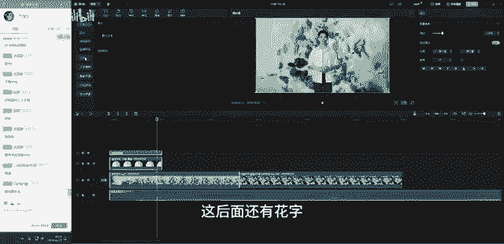

🎼哦，这个花字啊，这边这个花字的话呢是比如说我现在打的这个是回乡很漂亮。然后呢，我在这里选的话呢，我的文字这个呃花字是会直接作用在我们的文本上面的。但是这一边的话呢是新建啊，新建。

比如说我现在再点一个哎回香很漂亮，对吧？它是重新新建一个默认文本需要我们重新打字的啊，那这个是我们这边的花字，跟这边是不一样的啊，这边是相当于效果，直接作用在我们已经打好的文字上。

这边的话呢是呃相当于是模板，我们需要去更换里面的文字啊。O然后还有个文字模板啊，像这种啊，这这些文字模板。好，比如说我们点击一下，回香很漂亮。🎼是吧这些文字啊这些文字模板都非常的非常的漂亮啊。

然后做各种片子你都不用去都不用设计，直接用就行了啊。好，这里智能字幕是我们用的比较多的对吧？哎，用的比较多的，我们可以自己去识别我们的字幕啊，去识别。比如说我们刚刚这里回乡很漂亮啊。

我们想要把它弄成字幕出来，点击识别，好，那现在它就开始识别了啊，等一下啊，等一下开始识别对吧？然后呢它就自动的把我们这个字幕就识别出来了，看到没有？哎回乡很漂亮啊，回乡很漂亮，对不对？

然后这个字幕就弄出来啊，所以这个这个所以我在给大家呃我们的课程添加我们的字幕的时候，我就喜欢在这上面哎直接直接一键生成啊，非常快捷，都不需要动脑子啊，O然后呢识别歌词也一样啊，你把你喜欢的歌词。

然后把喜欢的歌，然后呢扔进来，它会自动的把歌词一句一句的把你给它罗列出来啊，O那这个的话就是我们。😊，的文本。那贴纸这些的话呢，就是呃比较常用了吧，就是大家都都知道的，加一些小感叹号啊，小动画很Q弹啊。

对吧？哎，像这些啊这些啊就非常快捷啊，还有特效，对吧？特效的话呢主要跟大家去讲一下关于我们特效的一个使用啊。特效添加的话呢，它有两种方法，一种是什么呢？一种是直接拖到我们的素材上，好。

比如说比如说比如说我就以这个小哥哥啊，小哥哥好，我们拖下来。好，要么你直接怎么样？好，把这个素材直接拖到我们的素材上。这样的话呢我们就是诊段素材啊，整段素材都有这个特效，回乡很漂亮，对不对？

OK然后你也可以把它删掉，把这个删掉哦，换一个啊换一个。好，这种夸张一点像很漂亮，对吧？好，直接拖到我们的画面上，回香很漂亮，对吧？那接样的话我们这个呃ok把这个给它一。😊，等一下啊，我把这个。好。

我们先给它移到后面来啊，它太影响我回香很漂亮，对吧？人物身上会有那种发光的效果啊，那这个是我们的特效啊，特效你可以选中它在这边啊，在我们的控效果控控制这边，然后呢，这里就会有一个特效，看到没有？哎。

他叫什么名字啊，叫声波攻击，你也可以给他删除啊，那加特效的话呢，还有一个方法是什么呢？直接拖到我们的时间线上。那拖到时间线上的话，它就会作用在他之下的所有素材，比如说啊比如说我的好这个这个小哥哥，对吧？

这个小哥哥还有我们后面这个素材，它都会去作用啊，所以加特效的方法的话呢，有两种，一种是呃拖到时间线上，一种是直接拖到素材上啊，哎，这个是它的一个添加方法，O然后呢，这下面还有非常多啊，你们就自己去试。

反正全都是中文的对吧？啊，中文的，然后呢去试。好，这里面转场的话啊，转场转场视频转场，对不对？好，比如说我们这两个素材啊给它。😊，一样啊，你要给视频进行转场，你也是需要给他留够空间啊，跟在PR里一样。

好，那比如说我们现在给它加一个这种转场，对不对？好，直接添加上来，我们来看一下。好，把这个删掉。好，来看一下。对不对？这个转场啊转场好，直接拖进来就可以啊。那他转场这里面也有非常多啊。

各种热门的VIP叠画的啊。好，然后这里滤镜这个滤镜的话，其实就相当于去套我们的调色的辣t一样啊，对吧？像这个小哥哥啊，我们可以给他去加一些呃加这种。呃，哦，他这个没什么效果。好，再再加一个。ok啊。

感觉这个感觉这个。透镜对吧？或者找一些复古的夸张一点的，像这种。对吧哎你不同的画面你可以添加啊添加不同的这种滤镜啊，就不用我们手动去调色啊。那这个是它的一个滤镜。那这个滤镜的话呢。

添加方法跟我们的特效是一样的两种，一种是直接拖到素材上，一种是直接拖到我们的时间线上啊，那我就不演示了。OK好，那这里调节是调色啊，这个我们没有讲到我们的调色面板啊，所以我就不讲了啊，不讲了。然后呢。

大家你们可以自己去试一下，去用一下啊，OK这里是模板，对不对？模板片头片尾的一个模板，然后直接调过来用啊，像这种好，像这种。对吧？好，我们直接扔进来啊。😊，OK然后呢，它在这里可以替换文字，对不对？

那我们在这里输入这个就是输入它的这个文字的话呢，就可以啊后双击好。哦吼。一。好，然后他现在就进来了啊啊，我们在这里输入文字啊，输入呃输入比如说。呃，第一个大片。等一下啊。哎，他还要还演示一下。

OK我知道了啊，然后我们。迪哥大片。OK对吧？弄完以后点击完成。好，然后他就进来了，看到没有？

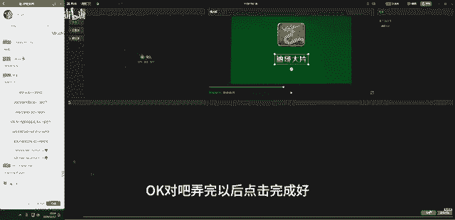

是吧你就是不是可以搞一个你自己的你自己的一个大片，是不是就很帅？OK然后呢这一些是我们的模板啊，模板直接调过来用了，直接就可以了啊。那这个就是我们的它的非常强大的一个素材特效库啊。

那呃那我们就先讲到这里啊，就先讲到这里OK然后呢我们主要要讲的呢，其实还是它的一些比较比较牛逼的地方。那首先就是我们啊进入到我们的画面基础面板这边主要跟大家讲一下它的这几项啊，这个第一个基础选项。

那刚刚我们已经啊我们已经这个什么我们已经讲了，对不对？就是调整它的基本属性的啊，这里边就不跟大家去再去啰嗦啊，主要跟大家讲一下它的这个抠像。😊，好，那抠像我把这些都嗯删掉啊删掉对吧？好，这里都删掉啊。

然后呢我们来讲一下这个抠像。这个抠像的话，这里面它还分为我们的这三个一个是色度自定义，还有一个是智能啊，那这个色度抠像的话呢，它的操作用法，给P2的超级键是一样的哦，约等于超级键啊，超级键。

比如说我们刚刚在素材库这边不是有一些绿木素材吗啊，对吧？好，素材库，然后我们找到绿木好，看我们把这个杰rry给它弄弄过来啊，对吧？这个是我们啊我们的绿木素材，那你就可以点击选中这个素材啊，选中这个素材。

点击色度抠图。好，这里有个取色器，看到没有？我们把这个吸管好，放到我们的画面上一吸。大家注意这个吸管放到画面上，它不会像P2一样，设个吸管的样子啊，它是一个圆环啊，那么我们去也是一样啊。

选我们的颜色最纯正。的地方，然后点击一下OK点完了以后，那它就颜色就吸过来了。我们需要调一下强度，哎，调强度调强度对不对？好，调强度好，阴影好，调一下强度。OK那这样去调以后呢。

我们的就就已经啊就已经扣好了，看到没有？就扣好了啊。那这个这个地方可能有同学说唉，到老老师它的边缘怎么会有一些绿色的啊，就有有点这种。哎，有有点点偏绿，对不对？有点点偏绿啊。

那这个的话呢就是啊就是我们剪映，它目前它它调不了我们PR里面那个什么阿尔法通道啊，就是它没有这个阿尔法通道的那个选项啊，就嗯我们调的时候，我们就只能在这里面去调它的强度。好。

如果你要把绿幕给它完全抠掉的话，那杰瑞的尾巴也会被扣进去，看到没有？哎就会被扣进去啊。没有超级键。对啊，所以这个这个就是我们为什么剪映到现在它还他虽然很火，但是它一直都不能替代PR的原因。

就在于它有一些东西还是不太适合我比较就是行业，就是影视行业的人去使用啊。然后那你如果你去做的话，那像我这种我这种这种什么这种片子有洁癖的。我看到这个我就觉得做很丑，对不对啊。

我可能就会一直想为什么不加一个阿尔法通道来调一下，把绿色。调一下啊，对吧？哎，那这个就是我们的啊就是我们啊检映里面啊，它不能达到的。OK比如说我们哎大概留一点点，对不对？不要弄得很狠。

那这个时候如果你非得要在检验里面去操作啊，如何去处理呢？我们可以点击啊，点击这里有一个调节，看到没有？点击这个调节这里啊，调节这里找到我们的HSL这里面好了，找到绿色。好，把绿色的饱和度降低。哎。

这样的话呢也是可以避免我们这个绿色很很突兀啊，很突兀的这种状态，亮度降低，对不对？哎也可以去处理啊，但是呢它的边缘抠的不干净，这个是真的没有办法啊。所以所以这个就是检验里面关于它的它的一个抠像啊。

色度抠像对不对？色度抠像，然后呢比较有问题的地方。好，那这个色度抠像我们就讲到这里。OK然后呢我们再来看一下下面这个叫自定义抠像，这个自定义抠像的话呢，哎它是用来抠这种比如说我们的画面比较复杂的。

上面色度抠像跟超级键一样，就是针对我们的背景比较纯的，并且是绿色和蓝色的这种素材啊。那如果我们的像这种啊像这种我们的背景很杂很乱，那我们要抠的话呢，怎么抠呢？那这个。

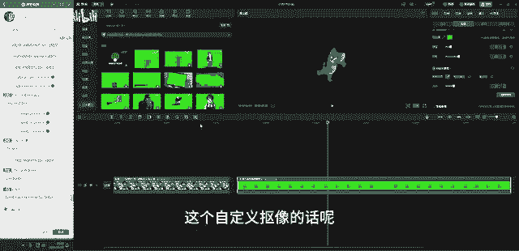

自定义抠像的话呢，它它就相当于是我们的呃PR里面的这个这个钢笔工具啊，钢笔工具添加蒙版啊，它抠像对吧？然后呢，它也相当于是我们呃那个什么A一里面有个叫roto笔刷啊。哎。

学A一已经学了A一的同学可能就比较清楚了啊。OK那么怎么去使用呢？我们点击它这里的自定义抠项，它这里有个画笔，看到没有？画笔橡皮擦啊，那比如说我们现在要抠这个人，那我们直接用这个画笔啊。

然后呢在这个上面把这个人物唉这种画一笔，它会自动的把这个主要人物抠出来，看到没有？那现在的话呢，就相当于他已经描出来的这一部分，就相当于已经抠好了。OK我们点击一下这个地方应用效果。

那现在我们这个人物是不是就抠出来了，对吧？抠出来了，然后我们可以给他去啊给他去加啊换一个背景。比如说啊在空镜这个地方哎，给他加一加一个好，加一个桃花啊，给桃加一个桃花的背景。O把这素材啊拖上去。

对吧背景是不是就换好了？OK然后呢这个是自定义啊，自定义抠像。那旁边橡皮擦的话就是你抠多掉的，你来擦一下啊，对吧？橡皮擦跟智能橡皮擦都是一样的啊。呃，这个是我们的自定义抠像。下面这里有一个叫智能抠像。

这个智智能抠像的话呢，更多针对的是我们有有人的这种视频啊，有人的啊，比如说我再找一个找这种。😊，nice对吧？好，我们拖进来啊拖进来。那像这种有人的这种视频，因为它会自动的识别人物的五官。

它是以人物的五官，然后去定义的。所以呢你用这这里去抠，它会自动的处理。看到没有？自动的去处理。那现在我们这个人物啊，其实它就已经抠好了，看到没有？已经抠好了啊。但是如果是物的话，比如说我放这个土拨鼠。

哎，吓一跳OK比如说我们啊放这个土拨鼠啊，我放这个土拨鼠，然后呢他去抠，哎，他可能他就他看到没有？他就把那个老鼠全部都抠进去了。看到没有？哎，因为它识别不了五官，对不对？然后像这个人他识别五官。

它就抠的很干净，然后像这种没有没有五官的啊，它就会怎么样，它就会把它全部都抠掉啊。所以下面这个智能抠像的话呢，它更多针对的是抠人啊，有人哎并且能够看清晰看得出来五官的。哎，如果你要抠抠像这种有老鼠啊。

像小老鼠啊，或者是我们刚刚这种土拨鼠啊，那种就用上面这个怎么样自定义抠像啊，用那个画笔去画它了就可以啊。那这个是呃简易里面的抠像啊，O然后呢那我们现在再来给大家讲一个，就是它的蒙版，对吧？好。

简易的蒙版啊简易的蒙版是我用下来至今为止，我觉得最难用的一个蒙版效果。好，比如说啊比如说我再放一个空镜啊，再搞一个空镜。或者是我把这个桃花啊，我把这个桃花给它删了。对吧我给大上一下。一。好嗯。

他还裁不了，真的是。O然后呢，我给他啊放一个。😊，呃，好，比如说这个镜头对吧？这个镜头。然后呢，给他换一个。好，拖到时间线上。OK然后呢我想把它啊把再再换一个镜头。好，比如说我想跟这个路给它放在一起。

或者是下面这个我觉得下面这个漂亮一点。啊，稍等一下啊，稍等一下，下载一下这些素材。🤧嗯。简映的素材能不能偷到PR里去用，可以啊，可以偷。但是呢你需要导出在这里导出啊，要导出才能用。哎。

你不能直接直接调啊，调用的话，调不了啊。好，比如说这两段素材，对不对？好，这两段素材O我现在要要什么呢？我要把这个这个素材啊，我要把这个素材作为我们这个素材啊，就作我们下面这个素材。

我我要把这部分给它换掉，然后呢换成我这边这个素材啊，这个部分啊，哎，其实相当于把两个素材放在一起，对不对？那这个时候我们要怎么去用呢？在简映里面啊，剪映里面那在PR里面的话。

我们只需要把上面的这个素材怎么样框框框的抠出来就可以了啊。但是呢在简验里不行啊，简验里面的话，我们需要啊需要首先先给这个加一个线性啊，看到没有线性，哎翻转一下。对吧冯总一下啊，OK哎应该是这样。哎。

我们刚刚我们要扣它下面的啊，给加一个渐变。ok加完了以后没用啊，我们要给上面这个又给他加一个，看到没有？好的翻过来。好，翻过来。一嗯OK然后呢可以给它好拖下来一点点，好，拉一下渐变。

对吧他要这样这样才能去换，就很麻烦。看到没有？就相当于我们已经给我们的这个哦，这个感觉有点多了啊，可以下来一点点。对吧像在两个素材是不就混合在一起了，两段素材就混合在一起了。

但是呢在P2里面这一步操作会更加简单一些啊。所以在检验里面，它的模板都是这种定性好的啊，有原形，有界面有什么有什么矩形啊，就是他都弄好了，那没有自定义抠像哎，就很不爽啊，这一点的话呢。

是他们比较大的一个区别啊。所以呢大家待会你们可以自己去试一下啊，就是这种换天，对不对？换天换地，像这种效果的话呢，就不是很好去嗯，怎么说呢？反正我用下来我就觉得不是很好很好用啊，OK然后这个是它的模板。

然后呢，就是这几项啊，好，这里有一个美颜媒体，对吧？美颜媒体。哎，这个美颜媒体呢就很好玩了啊，我这里边导入一些我这边准备好的。啊，这种美颜小姐姐啊，我们来给这个小姐姐化个妆。好。

比如说啊比如说我看一下这个。等一下啊，我先好进入到媒体。本地好拖进来。对吧比如说像这个小姐姐啊，这个小姐姐哎这个小姐姐她原来长得是这样，对不对？😊，那现在我们来给他化个妆，哎，给它首先把美颜打开啊。

打开。大家可以看到自动的识别人物的五官，这个是非常神奇的，对不对？非常神奇的啊。然后呢好皮肤均匀一点哎均匀调好，丰云一点好，磨皮加大一点，还有什么法令纹啊，法令纹淡调，黑眼圈淡调，美白调白啊。

女孩子来说调白，对不对？调到超级白。😊，OK然后呢好牙齿，因为它现在是没有效的啊，所以没有牙齿。O然后牙齿你可以把它调白啊。OK然后呢呃肤色你可以调冷白皮、黄皮、黑皮啊，都可以调。你喜欢哪个？

比如说我就喜欢这种冷白皮的。OK然后呢程度我你可以加一点点啊，调一下啊，怎么看怎么来，对不对？哎，大家啊朋这个什么直播间的那些有有女朋友的老铁啊，就好好的学啊。之后如何给你的女朋友去去美颜一下，对吧？

省得IP啊，OK然后呢还有这个美形啊，美形给他什么呢？给他瘦脸，对不对？瘦脸，OK比如说觉得他脸不够好看啊，哎瘦成舌尖脸。😊，下颌骨在瘦对吧？好，额骨也在瘦啊，瞬间变网红脸，下巴长度再长一点。好。

短脸哎短脸不行，啊，不好看，对吧？OK然后上庭中庭下庭啊，发际线还可以怎么样低一点哎，低一点，对吧？OK然后手动瘦脸的话，就是你要自己去捏，看到没有？啊，可以这么去捏。

但是呢这里面我不太建议你直接去捏啊。因为我们呃上面直接有的，我们直接用就行了，对吧？自己去捏啊，除非你是高手啊，OK然后呢还有美妆口红，哎，这里有各种色号，哎，我们给他换换颜色，哎，看了一下。

换了一个颜色好看。比如说我们就。😊，看一下哪个好看好，比如说就选选这个吧，对吧？选这个粉粉的好，然后呢还有啊还有这里面除了口红，还有腮红，对不对？好，腮红加腮红啊，还有修容啊，修容啊，修修五光。

修立体的好，眉毛哎，睫毛哎就选啊，比如说选这个选这个选这个。好，直接给他化妆了，直接就化妆了，对吧？好，这里还有眼影啊，眼影啊，这种去选，你选哪个都可以。OK然后选好套装套装啊，像这种裸妆啊。

裸妆一整套的啊，美体美体如果是全身像的话，比如说你拍的是全身像，你可以给他拉伸高啊，瘦腿瘦腰啊，可能180斤的给你弄到只剩80斤，对不对？啊，瞬间掉100斤的那种类型啊，所以这个啊像直角肩啊。

我们也可以调一下，调最大肩宽好调一下啊。因为我们知这个人他是一个半身像啊，他识别不了啊，手臂也识别不了，对吧？O啊，O然后呢还有这种瘦身长腿瘦腰小头好吧，头调小一点唉。好，还有丰胸美化、磨皮美白啊。

对吧？我们美颜功能OK弄完了以后，我们可以播放一下，播放一下啊，它一整段它会自动跟，而且跟的非常好，都不会出现这种脱妆的问题啊，对吧？这个就是这个就是这个什么剪映里面它很牛的地方。

就在于它你帮他化完妆了以后，它会自动的去哎跟你的画面啊，就跟那个PS有一个叫camera。肉的一个调色调色功能营样，它非常神奇啊非常神奇，也可也是可以直接帮人物去化妆，美妆美皮啊。那个呃这是PS的对吧？

那那检验里面的话就是美颜。这个功能的话呢，在在这个什么在P2里面的话只有一个叫美颜功能啊，那个插件叫什么beauty box，对吧？它就只有那个功能，可以美颜，但是呢不能化妆啊。

所以在在简映里面很多很多那些什么很多那些小姐姐拍摄的时候，可能她就也不化什么妆啊，呃，就素颜，然后结果拍完了以后哎后期加一点颜加一点，然后瞬间变成了大美女，对不对？好，我们可以对比一下嘛，对比。😊，呃。

比如说这里啊对吧？我们可以对比一下它的整体的这个效果啊。好，原片是这样子的。这个是原片，瞬间是不是觉得原片都不不香了？原片对不对？OK这是条王的原片条王原片，是不是瞬间晃了个人。

是不是有种瞬间晃了个人的感觉哎，都不是原来的自己了，对不对啊，那这个就是他的一个美颜美体啊，美颜媒体非常神奇和牛逼的地方。啊，所以这个功能啊，大家啊没事啊，没事，多去多去用一下啊，多去用啊，多去用一下。

然后呢，对今后的发展比较好。😊，对，抖音上的女孩子都这样。对呀，就大部分都是这样子的。所以所以那些比呃比如说你喜欢在群里给他们。给他们怎么样刷礼物的啊，注意了，也许你刷的是个大妈，对不对？嗯，OK啊。

当然这个开玩笑啊开玩笑，然后呢，你们可以啊可以自己去试一下啊。好，那除了啊除了以上这个呢，我们还需要再讲一个啊，就是关于我们这个视频里面它这里有一个叫变速的。看到没有？变速的那这个变速的话。

我们可以给视频去进行一个呃视频加速。😊，好，这边的话呢等我找一个素材啊，我们在这边我们直接调它的素材库啊，直接来用。

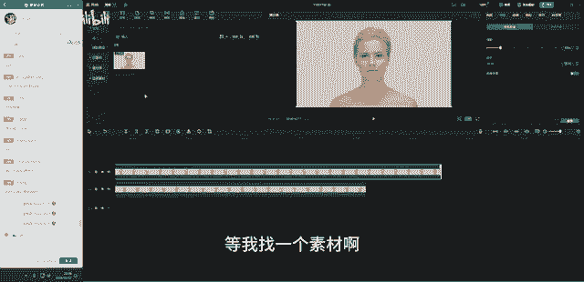

呃，比如说比如说空镜找一个空镜。好，就用这个海浪的吧。我们用这个海海浪的给大家讲一下它的这个变速啊。稍等一下，讲完这个的话，我们就下课啊，下节课我们来学时间线。然后呢呃学完时间线对吧？

时间线上面这些功能是什么意思啊？后面这些是什么意思？我们下节课来学啊，我们今天先把上面上半部分先给它学完，下半部分我们下一节课来学，好吧。😊，OK啊，我们稍等一下啊，稍等一下。好，那这个素材啊。😊，好。

这个素材我们拖过来。😊，🤧嗯。好，可以缩小一点啊缩小一点。对吧，我们可以看到这个是一个海浪的素材，然后它现在呈现的就是一个。对，下节课我们上完了以后，我们大大概花半节课的时间。

然后呢去把我们的简映的下半部分讲完。然后呢，我们就就就哎给大家讲一下关于升班的问题啊，还有我们交笔记，拿那个优秀毕业啊优秀学员奖的呃问题，然后我们就可以拜拜了。这一期就结束了啊。

OK然后呢我们现在可以看一下这个视频啊，这个视频它在画面中呈现它是一个慢动作，对不对？慢动作的啊，那如果我想给他加速呢，比如说他现在这段视频，它诊段是非常长的，有一分啊，我们来看一下啊，大概从这个地方。

好，可能有1分1分多啊1分多钟，对不对？啊，26秒26秒。然后呢，我觉得现在太长了，我们可以给他去进行一个变速。它这里变速的话呢分两个，一个是常规，一个是曲线。那这个常规变速的话呢。

其实相当于在PR里面给视频加速一样啊，比如说我们现在在PR里面。OK票里面呃，我给他重新啊新建一个。

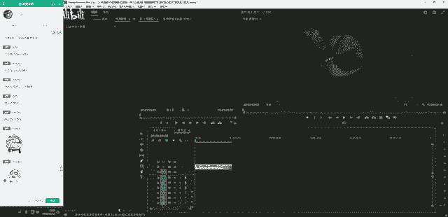

好嗯。OK然后在片R里面。票里面我们要给这张视频加速，我们可以看到像它的速度是这样子的，对不对？好，大概有4秒钟啊。然后这个我是已经加过速了，右键好，选中素材，右键这里有个速度与持续时间。好。

点开现在我已经加速了，是给它加到了200200，相当于把让它变快了啊，那它原来是什么样呢？原来的话呢，其实它是这么长的OK啊速度与持续时间，这里面我们改为100好，它原来速度是10秒，对不对？

速度10秒，然后呢，同时这么长。好，它的播放速度是这样子的，非常慢很慢，对不对？很慢慢慢的打开啊。然后呢，我给它加了一倍的速度以后，它就变得很快。哎，同时时间它的视频的时长就变短了。哎。

就相当于其实它的这个它的这个加速话，就相当于把我们的原来啊原来这个10秒的素材，把它变为啊变成更短，对不对？啊，我在不进行任何裁剪的情况下，让通过加速让它视频并变短啊，那在PR里面的话呢。

哎就这里面啊啊R呃或者是这里速度与持线呃速度与持续时间啊，然后呢，这里面你可以改这里面，比如说你改成200200的话，它就相当于给它加速啊，加到了两倍，然后就变成了5秒，对不对？OK然后呢。

300然后呢就只剩3秒了。那如果你把它变小呢，比如说它原来是十0秒呃就是它正常速度的时候，它是10秒，对不对？那如果你把它变。为5050的时候呢，它的速度就变长了。我们可以看到，当改为50的时候。

它由原来10秒，然后呢就变成了20秒，就相当于它的时长增加了一倍，时长增加了一倍。那么我们的视频就变得更慢了啊，我们来看一下是不是呢视频就变得更慢了，超级慢动作啊，在我们的B站上面进到的那种片子啊。

超级慢动作，超级慢。好，然后呢你可以再让它更更慢，比如说现在你再让它在在慢。比如说就1好，速度变为十的时候，它原有它由原来的10秒的视频，现在已经变成了怎么样，1分43秒。

然后我们来看一下它速度就一帧一帧的了。看到没有？它就是一帧一帧的，就非常非常慢了啊。那这个是在PR里面的这个速度功能。那在PR里面的话呢，有一个工具，其实就是我们的这边对不对？

啊后这边的这个比例拉伸工具啊，用R键就可以直接啊自定义去拉啊，比如说按R键，然后你就可以自定自定义去拉，然后呢，我们可以在后面这里它有一个括号，这里就够它会有提示你你给你的视频加速到百分之多少。

那这个是PR里面啊，那在简验里面的话呢，哎简验里面的话呢，它就比较的直观。好，它会以一个像这种就平像我平时给你们画的那种数啊，那种什么数轴对吧？哎这种这种这种这个叫什么这数轴还是叫叫叫什么。

反正我比较喜欢的对吧？然后呢，哎你把它往这边倒。比如说我现在啊它现在是正常速度是1。0啊，然后呢，总共时长是26。2秒，啊，这个是它的。正常速度的时候，它这段视频的长度啊是26秒。那你要把它变短。

比如说我变到好变到0。5，速度降到0。5，它同时就增加了，它的时长就增加了一倍，对不对？然，画面就更慢了。我们来看一下，看到没有？画面就变得更慢了。那如果我加快呢，比如说我就加到啊加加码，加到百分百。

那它由原来20秒的素材就变成了只剩3秒。然后我们的视频它就变成这么短，看到没有啊，就只有这么短。然后我们放一下，它就很快。看到吧？就非常快啊就非常快OK然后呢我把它呃降回来一点啊，不要让它那么快。好。

现在的话我们看一下由原来的20多秒现在变成5秒，是不是就变成我们这种看到的比较正常的这种速度。😊，OK然后呢那这个是这个就是它的关于速度的调整啊，呃，上面是调它的一个时间下呃，上面调的是它的倍速。

就是加速的倍数啊，这上面调的是时间啊，OK那这个是我们常规变速，对不对？那我们现看给它改为1。0正常速度啊，1。0。OK然后呢，曲线变速是干嘛？曲线变速的话呢。

我们可以呃做出那种比较有节奏感的好节奏感的这种变速啊呃。OK比如说我们现在一开始是很慢的。好，这里面有一个叫蒙太奇，看到没有？当我们点开蒙太奇的时候，我们来看一下它的这个曲线，这个自动曲线，哎。

它是这样子的那这个竖轴啊，这个这个竖轴怎么看啊，我给大家去讲一下啊，讲一下，哎，它是这样子的对吧？然后照着就画一下啊，画一下好，中间这个是1。0啊，这中间这条线是1。0，上面的话啊上面的话是十。

下面的话是0。1，对吧？那我们这根曲线啊，这根曲线，如果就是我们中间这个白色的线啊，如果它是这个就是它是直接就这种去走的话，它是直接这种沿着这个这一条，我们中间这条线走的话，那它就是播放正常的速度啊。

那如果它是往上走的话，比如说它往上去走，那它的速度就是加快啊，然后呢往下去走的话就是减慢啊。所以当这条曲线往上就是加速往下的话就是减速啊，减速，对不对？减速啊。所以这个我们可以通过改变它的这个运动速度。

让我们的画面忽快忽慢啊，有这种比较有节奏感的这种感觉啊。那我们可以看到现在蒙泰其他已经做好的这种预设啊，我们来看一下视频，它的运动方向是怎样的。好，开始慢慢慢慢的啊，一开始比较慢，对吧？好，开始加速。

哎，加速好，突然又开始变慢，哎，就变得很慢了，看到没有？变得很慢，然后呢又慢慢的回归它正常的速度啊，对吧？这个是蒙太奇啊。OK然后呢那我们再来看一下旁边这个英雄时刻也是一样啊，对吧？

英雄时刻就是这种人物打斗的时候飞起来有这种超级慢动作的效果啊。OK然后也是一样。好，这个走过来突然就变得很慢。哎，展现超级慢动作啊，英雄时刻，对不对？好，然后呢再加速，然后又回归啊，对吧？

这个是啊还有这个也是一样，让子弹飞也是一样。好，正常啊一开始它的这个速度是比较快的。好，突然哎变得很慢，然后呢又突然变得很快啊，呃，时间重映射这个其实这个速度曲线就相当于PR里面的时间重映射啊。

时间重映射呃，没有做笔记，但是天天上课有奖励吗？没有啊，我看笔记啊，还是要交笔记的啊，拿着笔记来领素材啊OK然后那这个曲线的话，我们也可以自己去啊，自己去拉啊，自己去拉，对不对？

比如说我们来找一个音乐吧。🎼找一首卡点音乐，好宝们。好，比如说就这首吧，哎，我们用这个音乐啊，用这首音乐好，用这首音乐，然后呢我们来哎剪一个这种来改变一下它的这个速度啊。

对吧比如说我现在就哎想让我的这个素材啊跟我们这个节奏走。对吧？好，一开始这里噔噔噔，我就想让它速度快一点OK然后选中它变速，然后在自定义这里面啊自定义对不对？好，这里面我们可以直接加这个点啊。

这里面看到没有？好，它这里有一个自动添加这个点OK然后比如说我们这个地方我们是想让它快一点啊，快一点，我们在这里加个加一个点。好，把把中间好，中间这一段中间这一段对吧？

在中间这里面然后呢又再加一个O拉长一点，对吧？中间这里啊，中间这里再加一个O然后我们把它我们是要加速，所以我们给它拉起来啊，拉起来。😊，对吧给它拉起来啊，拉起来，然后呢往后去演。好，盐。

然后我们来看一下啊。好，然后变得很慢。然后到中间这部分的时候啊，中间这部分这个应该拉上去啊。对吧哎，这部分。好，到到这里的时候，唉，这到这里的时候，我们想让它变得很慢，对不对？好，这一段啊。哎。

给他慢一点。好，慢速。好，我们来看一下啊。🎼。好，然后呢我们可以给它往前移一点。好，这一段我们可以唉给它移过来一点。好，再移过来。啊，这速度其实你就可以随便去以，主要是跟音乐卡在一起啊，卡点对不对？

卡点啊，那我们来看一下。🎼好，就变得很慢，然后再可以再慢一点。大家可以再慢一点啊。对吧到这儿的时候啊到这儿时候啊，我们给它往前移。OK然后这个就是要1。1点的这种预移啊，主要就是要让它怎么样。

让它的这个速度啊能跟我们的这个曲线能够哎怎么样还保持一致，对不对？OK到这儿的时候，那这部分我们又想让它怎么样，又想让它变速啊，给在这里再加一个。好，然后呢又给它啊加加快。对吧加快啊，然后我们来看一下。

好，又又慢。然后呢，这里又加快再加一个啊，再加一个，对不对？好，然后呢又又又在。可又给他怎么样这一小节啊。好，这个给他啊。好，往前一点点，这里再加一个。🎼好，主要是这里它已经啊它已经很慢了。对吧？好。

来给大家往前。🎼好，他已经非常快了啊非常快了。好，看一下。🎼我是。好，这里面啊这里面我们又可以让它起来啊，就是让他的速度，然后再起来好再弄一节啊，弄一节，然后把这段速度给它提起来。🎼哎，这种提起来啊。

提大家注意要超过我们中间这条线，它速度才是加速的，对不对啊，才是加速的啊。好，大家再看一下。🎼很么。对吧然后呢，这个地方又在加啊又在加哎，然后再往后一点。好，再加，然后呢，这个又给它提起来。哎，等一下。

呃，加错了，我看等一下这一段我看一下。对吧好，这一段。🎼这一段啊看一下。对吧然后呢可以再给它再怎么样加高一点啊，把它速度提起来。哎，提到我们这上面来啊，提到这上面来非常快。好，然后呢给他哎拉长一点。

O然后呢再给它往后一点。啊，这个就是非常考验你的这个耐心啊，要考调这个。对吧调这个好。🎼OK啊，我这个都调的有点劈叉，我们重置一下，重置一下，我们再来再来调啊。刚刚调的不是很好啊，好看一下。

OK然后这里面加一个点。好，提起来。好，这一段是加速的。OK然后这一段是加速的。🎼好，慢下来啊。好，从这个开始，然后呢又加一个点，对不对？加一个点，然后呢又提起来。嗯，我觉得我觉得等一下等一下。

我们在后面啊，在后面加吗？在后面加，然后把它提起来。提起来。提起来哎。对吧这一段啊这一段要给它提起来。好，我们来看一下啊。🎼好，速度。🎼不。对吧这里面又又加啊这里又加一个啊，又加一个。

然后呢又又给它提起来。是吧哎又又这种提起来啊。好，我们来看一下啊，再来看一下。😊，对吧哎这个素材太短了，就是我们可以根据音乐节奏做的是这种速度凸凸快凸慢凸快凸慢的这种效果啊。

其实就是我们俗称的这个什么啊音乐节奏速度节奏啊，在我们的终极班有一个案例专门的，然后来来来教这个速度曲线啊，那在检验里面就是调这个反正这个曲线的话，我呃用下来，我是觉得呃它的整体操作会更加简单一点。

但是呢呃相比于PR来说不是很好用，就用的不是那么的顺手啊，可能是我比较适应适合或者是比较习惯用PR的原因啊，我用这里我就觉得很不很不习惯，对吧？就像我刚刚一样呃，第一遍就操作就疲差了啊。

所以所以这个工具的话呢，就是用来改变视频的速度啊，改变视频的一个速度啊。那那剩下的你们可以自己去操作啊，呃，这里有很多种，你也可以直接用它自定义的这种啊，对吧？啊，你也可以在这里自己去拉。

那这个就根据你自己的呃，你自己来定就行了，找一个音乐，然后呢来自己去拉一下啊。O那这个的话呢就呃是我们今天啊今天这节课内容下一节课我们来学时间线啊，时间线，时间线上有很多的内容，还是需要我们去掌握的啊。

那我们上下节课再来再来讲啊，怎么裁剪，对吧？怎么裁剪，它这里有一个叫呃分割ctrol加K啊，要去分割，对不对？比如说到这里我要分割按快捷键trol加K，然后就可以把视频啊剪断了。

或者是你直接放到前面也可以直接拖动啊，它跟PR是一样的，对吧？哎直接这种去拖动你的这个视频O然后呢这个是好，然后这个是剪映里面的分割，这里面啊分割对不对？分割。那这些工具，我们下节课会来给大家。😊。

讲啊，下节课会讲的，然后每一个都给大家去演示啊。今天的话呢我们就把上部分讲完啊，上部分知识点相关的讲完，然后下节课我们再来学。OK然后大家看一下啊，有没有什么问题啊，嗯，下节课我们就毕业了哦。

然后呢大家笔记没有做好的，赶紧做哦。我们下节课啊下节课我们可能就需要去。就是我们可能就需要去啊去去去交那个笔记啊啥的那些啊，所以所以呢。啊，大家笔记没有做好的就可以啊，就可以去补一下啊。

到时候拿那个优秀学员啊素材的话，我是用笔记来换啊。呃，刚刚有同学说天天来上课有没有天天来上课的话呢，也也没有，对吧？我需要交笔记啊，我要看到你的笔记，你提交笔记上来，然后呢，我就发给你啊。

OK那我们今天就到这里啊，大家都送花了，那说明啊说明啊巴不得我走了是吧？好伤心啊，好吧，那么我们就下节课再见啊，谢谢大家的鲜花啊，那我们就下节课再见啊。第一次作业明天还是最后一天呃，是提交吧，对吧？呃。

最后一个作业最后一个作业是。呃，对，18号啊18号明天啊，明天还有一天的时间啊，赶紧做啊。会在素材里放这个软件的下载网址吗？会啊，我待会会放进去啊，你们到课时素材里面去去呃去下载就可以了。好。

再看一下啊，再看一下还有什么问题，没有问题，我们就我们就撤。好，那我们就下节课再见啦。