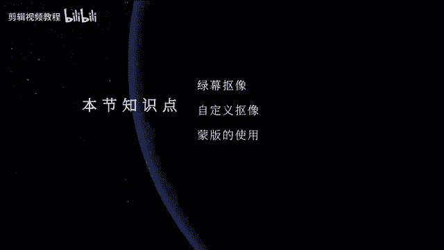
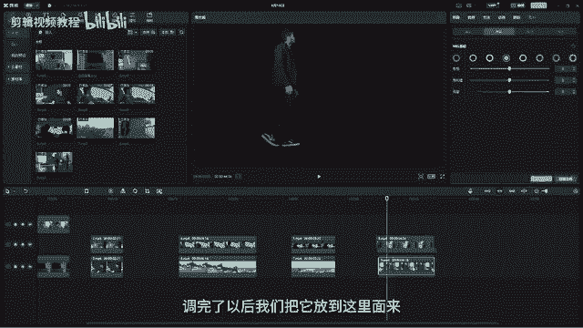

# 最系统的剪映电脑版教程 【2024】最新版 视频剪辑小白入门必学的一门剪映课程 - P5：【电脑版】抠像和蒙版 - 视频号运营教程1 - BV1dM2vY7EpB

嗨欢迎来到我们剪映PC教程。那今天这节课我们要来学习我们剪验里面非常有趣的两个工具。我们先来看一下今天要制作的效果。OK我们可以看到这个视频里面有很多不可思议的地方。首先第一个镜头。

这个人他直接从电视机里爬出来了，对不对？那我们在现实生活里面，我们能够做这样的一个行为吗？那肯定是不行的。这个我们人是没有办法从电视机里面爬出来的，对不对？

O那这是一个还有一个就是哎这个人他直接无实物托举，对不对？啊，就把我们的这个好这个锤子，然后呢播上去了。好，我们可以一起去思考一下，那我们要去做出这样的一些效果的话，我们需要怎么去操作，对不对？好。

我们可以看到就像呃这个人有个魔法，然后操控这把锤子一样啊，那我们所有的这些效果的话呢，哎看上去好像都充满了不可思议科技感，还有我们的魔法，那如果我们要去制作的话，其实他并没有那么难。

甚至是很简单很简单啊。那在剪映里面，我们只需要用两个工具，然后呢，我们就可以实现我们今天的这些效果，O那是哪两个工具呢？首先我们先打开剪映啊。打开剪映，我们先把素材先拖到我们的时间线上。

那这个时候呢我们直接选中素材在我们的控制面板这边。我们今天要学的就是我们的好基础面板旁边的这两个一个是抠像，一个是蒙板。那我们就先来看一下我们的这个抠像O那抠像的话呢，其实从字面上理解，顾名思义。

就是把人物把把像给抠出来，对不对？去抠人物的像，然后呢，那我们抠像的话呢，其实它有很多种方法啊，呃，用过PS的应该都知道，我们可以用干笔工具啊，套索工具去把人物给抠出来。那还有一种非常快速的抠像。

就是用我们的色块抠像，什么叫色块抠像，就是我们在拍摄的时候，我们只要把人物置身于一个纯色的背景当中。那我们在抠的时候，只需要吸取这个背景的颜色。那我们是不是就可以把人物给抠出来了。

比如说这个人物它要拍它。在电视机里爬出来的这一个动作。那它只需要去搭建一个类似于电视机的这样的一个场景。然后呢哎把它自己完全置身在我们的这个绿色的幕布当中，O然后呢，那我们直接用色块，或者是我们去吸色。

直接把这个绿色给它抠掉。那人物是不是就已经完美的抠出来了。O周边的这些的话呢，我们只需要把这个绿幕之外的内容给它删除了就行了啊。所以抠像的话呢会非常的简单。在我们的所有影影视里面是非常非常常用的。

O那我们的素材里面的话呢，这边也有一种叫做绿幕，大家可以看到这里面就有很多，对不对？哎，这些它就是利用我们的这种绿幕素材啊，O然后比如说这个恐龙啊，把这个恐龙拖下来，对吧？

然后呢那我们现在要把这个恐龙啊给它放到我们的这个电视机里面，刚刚我们不是在这里面有一个电视机吗？好，我们把这个恐龙我们先抠出来，O用第一个色。度抠像，把它前面的这里开启点开。好，点开以后。

我们用这个吸管去吸一下画面当中的颜色。大家注意我们的背景一般都是纯色啊，我们去吸，那我们去吸一下。好吸一下，然后呢我们调一下强度啊，那这个时候大家会发现没有？哎，我们是不是就已经把这个恐龙给它好。

调出来了，对不对？哎，大概给它抠出来了，OK然后呢再调一下阴影，有些地方没调干净的，我们再来调一下啊，对吧？是不是就调出来了。好，调出来以后，我们把这个这个电视机放到这里。好。

再去调这个恐龙的一个大小啊，好，我们给它缩小一点。对吧哎给它放到电视机上，对不对？电视机上，我们甚至可以给它做一个做一个运动啊。那我们上节课不是给大家讲了一个就是运动关键帧吗？我们已经讲了，对不对？

所以我们可以让恐龙在这个地方的时候，我们给它打一个关键针。好，然后呢等到这边的时候，哎让它做一个向前慢慢移动的一个过程。哎，还要走到这边来，对不对？那我们来看一下。😊。

是吧那现在这个恐龙是不是就已经在我们的电视机里面，然后并且从这边往这边走，对不对？OK那这个就是我们的一个绿木抠像啊，绿木抠像OK那比如说像这个可不可以把这个恐龙也放放进来呢？可以啊，我们用色度抠像。

好，吸取一下中间的这个绿色，然后呢哎来它抠出来，对不对？好，然后呢我们把这个恐龙给它放到最下面来。😊，对吧然后呢那这个时候我们再来调一下它的大小啊。对不对？OK然后我给它放到这来。好，然后呢。

现在这个恐龙它就怎么样？哎，它从这个里面是不是就开始走出来了，对不对？是不是就走出来了，是不是比较有意思啊？所以我们的第一个色度抠像抠的是我们的颜色。好。

然后呢我们现在再来看一下我们的第二个第二个的话呢叫自定义抠像。这个自定义抠像的话呢，其实跟我们的这个啊绿木抠像的话呢，它是差不多的O我们也是一样在我们的素材库，这绿木，然后我们随便找一个对吧？

比如说我们把这个。😊，OK杰瑞给它弄出来啊，然后呢把它啊音乐可以先给它关小一点。好，然后那我们现在在这里面啊，这里有个自定义抠像。那自定义抠像的话，我们点开它以后，它这里会有三个功能。

那这三个功能的话呢，第一个叫智能画笔。那这个抠像的话呢，跟我们色度抠像它是不一样的。色度抠像的话，我们去吸取它的背景颜色。那这个智能抠像的话呢，其实我们去吸什么呢？我们把我们的人物抠出来就可以了。

比如说我们可以看一下这个呃这个对吧？这个呃杰瑞它是这样子的那我们直接用我们的智能画笔，在我们这个杰瑞身上去画，那这个时候你画一笔以后呢，哎它就被选出来了啊。那这个时候呢我们杰瑞是不是就会画出来了。

对不对？好，画出来了以后，那这个时候你点击一下应用效果。那这个时候我们的杰瑞是不是就被抠出来了，它跟我们上面这个色度抠像的原理的话呢是一样的。但是呢下面这个自定义抠像它可以抠更复杂的一些画面啊。

比如说我们在这里再找一些素材。啊，好，比如说我们就用这个对吧？就用这个这个。OK那比如说像这个我们把它的这个声音给它调小一点，O啊后我们声音不需要啊，对吧？哎，那现在的的话呢。

它的背景已经不再是这种纯色的，比如说它的背景是这种比较杂乱的那我要去抠它。那我们用第一个啊，用第一个色度抠像，是不是就抠不了了，所以我们可以用自定义抠像，这个自定义抠像的话。

就是我们只需要把人物主要人物给它抠下来就可以了啊？比如说我们现在用这个自定义抠像，把这个人画画出来，对不对？好然后这种衣服对不对？好，这个时候它会自动的把人物给它描出来啊，像这些少一点点的。

O那完了以后它呃然后我们点击一下应用效果，那是不是现在我们这个人物是不是就抠出来了？好，然后呢我们给它加一个背景，比如说我们刚刚不是好有一个电视机嘛，依然把它放到我们的电视机里面，O然后放到上面来。

那现在我们再来调一下它的位置。好，缩放。OK把它放到我们的呃电视机上，对吧？那像时候我们这个人是不是就已经在我们的电视机呃电视机上面了。好，调一下，不要让他穿帮，对不对？

是不是就已经啊你可以任意的把它放在你想放的地方啊。好，然后呢那我们自定义抠项里面，它这里还有个什么智能橡皮擦，还有我们的这个什么呃橡皮擦等等。那这个的话呢。

其实就是相当于我们在抠的时候需要去做一些调整啊，那我们再找一个，比如说在在好再再找这个把这个比较火的这个what对吧？好，我们给它拖下来啊，也是一样拖下来。😊，好好，那像样脱下来以后。

我们也是一样用智能抠像。然后呢好我们先给它哎整个人给它描出来，对吧？好，先把它的整个人物好，先给它描出来。O那描出来以后，那有的时候比如说我们一个不小心手抖了，我们会把旁边的这些给它描掉，对不对？

那这个时候怎么办呢？我们就可以用这个智能橡皮擦去修好，把它把我们描多的地方给它去掉啊。比如说你在里画的时候，你不小心哎哎手抖，然后是不是把旁边的这些不需要抠的，你都给它画出来了。

这个时候你再用智能橡皮擦去给它擦掉。O画一下，它就自动的哎画一下，是不是画一下好，这个也是一样好，画一下，它是不是就自动的，然后呢就把它取消掉了。那这个橡皮擦也是一样啊，这个橡皮擦也是一样。

O然后呢去擦好这么去擦，那这个的话就是你需要呃擦多少，你就弄多少啊，那我们这边的话呢会更加智能一些，对吧？这里它的头发在这里啊，O弄完了以后也是一样啊，点击。😊，那我们这个人物是不是又抠出来了，对不对？

好，然后我们我们也是一样啊，我们给他呃找一个背景给它放进去啊。比如说看到呃这样的一个好呃，这个选一个对吧？哎要换一个这种这种背景。好，我给它放进来。😊。

对吧还像人物是不是就给他换了一个背景OK那这个就是我们的自定义抠像啊，那可以抠复杂的这种背景啊。那这下面这个的话呢叫智能抠像，智能抠像的话，大家可以看到它这里是有一个条件的。

就是说当前仅支持人物图像的智能识别，就说明它会它是自动去识别我们这种有人物的镜头，它才能去识别，那比如说像有一些镜头，它就是没有人物怎么办呀？哎，那哎像像像这些我抠这个小动物，对不对？哎。

那小动物它又不是人，哎，那要怎么去抠它呢？对不对？比如说抠这只熊好，我们拖过来啊，拖过来，那我们这个时候用智能抠像它就用不了了，那我们就只能用自定义抠像，对不对？自定义抠像，那用智能抠像的话。

我们可以哎比如说有人的好，有人然后我们找一个有人的啊，我们来试一下好，比如说这个有人。😊，对吧那我们来看一下他能不能把我们的人物给他抠出来啊。好，然后智能抠像。O这个时候它正在处理，哎，是可以的。

对不对？哎，只要有人就可以啊，那我们这只熊我们也可以看一下能不能抠啊。😊，对吧哎，大家可以看到我们这只熊是不是因为这个熊它有黑色，所以它会把它给抠掉，对不对？好啊，大部分保留下来。

但是这一地方就被抠掉了啊。比如说你给它换一个背景，你就会发现啊这个熊它的身上会被抠掉一些，看到没有？就被抠掉了，对不对？好，所以我们这个智能抠像，它只能去识别人物。它的一个工作原理的话。

其实就是去识别人物的五官，然后呢通过人物的五官，然后去识别整个人物的一个动作啊。那所以这是智能抠像，大家注意用智能抠像的话，仅限于有人物的镜头。如果没有人物的话，我们就只能用自定义抠像，你想保留哪个。

你自己用这个画笔去画了就可以了。O那这个就是我们抠像的三个功能啊，那都是非常常用的O那我们再来看一下蒙版。那蒙版的话呢也是非常非常用常用的一个功能，它可以用来做这种，比如说我们的两个镜头。

你想让它合在一起。那比如说我在这边啊，在这边我再找一些。这个素材啊，OK比如说这个对吧？这个这个镜头啊，好，然后呢，这个镜头如果我这个镜头我想跟这个给它啊就给它换在一起。比如说我想把这个镜头。

它的天空给它换成我这个镜头的天空，对吧？我想给它换成这种卡通的那怎么办呀？那我们这个时候我们就可以用这个呃我们的蒙版，然后呢给它抠出来，比如说我们可以看一下啊，下面这个我们是要干嘛，我们是要去掉天空。

对不对？那这个时候如果你再用我们的哎前面抠线的话，就不是很很好用了啊，因为它呃这个都是一些森林啊，然后又没有绝对的主体，然后就很难抠，这个时候你直接用蒙版的话就行了。比如说我们现在用蒙版。

我们直接用线性，那线性我话它就是这种啊，它就是这种啊竖着勾的，对不对？然后这里有两个功能，上面这个的话呢去拖它的羽化值，让它哎更加的柔和一些。好，这个的话呢就旋转，我们刚刚这个镜头是要怎么样。

我们要把天空给它去掉，对不对？好天空去掉。好再再。okK然后给它呃它旋转过来。是吧然后呢再给它拉一点羽化值OK然后呢弄完以后，我们把它放到上面来。好，把我们的呃这个月亮图给它放下面。

OK我们现在给下面这个也给它扣一下。好，我们扣扣什么呢？我们现在把它上面好扣一下啊，旋转让他们两个差不多对齐，对不对？啊给它对齐。O然后呢这种对齐，我看一下下面这个是旋转了多少度。好，175。

OK然后我们给它拉羽化纸，让它们过度自然一点啊。好，然后呢上面这个那现在我们可以看一下是不是两个镜头就合在一起了，对不对？哎，刚刚下面这个还是我们的这个蓝天白云，下一个镜头是不是就我就给大家放在一起。

那这种的话呢也属于抠像，对不对？用我们的蒙板来进行抠像啊，那这个是线性抠像。线性抠像啊，那还有一个是镜面抠像，镜面抠像的话，我们啊稍等。对吧？好，然后呢我们再换换一个其他的镜头。

比如说我们就换这个嗯呃比如说我们嗯用这个对吧？我们用这个这一张图啊，那我们用来做镜面抠像。好，镜面，那这个时候的话，它就是其实就是两边夹击的这种方式，然后去进行抠的OK然后呢，你可以给它拖拖远一点。好。

然后呢给它换一个背景，对不对？OK然后比如说我们就给它好。好哦，这里是一首歌啊，我们再来给他找一个其他的素材。好，比如说我们再找这个好，给它放在两个合在一起。好，下面的这个对吧？

下面这个镜头我们也给它和呃来一个镜面。哎，让他们两个这种合在一起，对不对？好，ok上面这个给它往上一。对吧是不是又把两个镜头又这种完美的合在一起了，对不对？O这个是线性啊，线性抠像。那还有一个是圆形。

那圆形的话其实就是哎给它啊弄成这种圆形啊，那旁边这里也是一样羽化值拉一下啊，拉一下，对不对？拉大一下，好，这个是矩形矩形啊，这是矩形，然后呢也是一样啊，去调它的对吧？调它的这个像一个正方形一样啊。

然后呢大家可以看到这里面矩形的话呢，它有一个比较特殊的一个地方在于好，这个是羽化，这个是旋转啊，那这个是什么东西呢？这个的话其实就像是圆角一样，那我们现在的这个矩形的话，它的边缘是比较的啊生硬的。

大家可以看到对吧？比较生硬的那如果你想让它圆一点，让它更好看一点，你去调这个那这个时候你调这个圆角的时候哎，它是不是就会更好看了，它的画面，对不对？好，所以我们的这个矩形里面它多出来了一个圆角功能啊。

圆角。😊，功能好，然后呢那这个叫我们的爱心，对不对？爱心啊，就可以抠出一个爱心的图片啊。好，然后这个是星心，对不对？星星啊，那都可以去调成你喜欢的那就行了啊。啊，我我们来看一下下面它这一参数啊。

那这些参数的话，其实就是去调蒙版的一个位置，对不对？好，调蒙版位置，你可以直接拖也可以直接在这里去调它的参数啊，那这个是旋转，对吧？啊，这是旋转，你可以调啊这种去旋转。那这个是它的大小哎。

可以让它变大啊，那你直接拖它这个边框呢也是一样啊。O下面是羽化值，对不对？羽化值，那其实也就是调这个啊，所以如果你在啊添加蒙板的时候，你要给它添加羽化值大小等等。那你想调参数也行。

你想直接在它的这个边框上去拉的话呢也行啊，O那这个就是我们的蒙版啊，那那我们现在啊现在回到我们的课程案例上，我们一起来把这个案例做一下啊，我们这个课程案例的话呢，它需要结合我们。的这个啊蒙版。

还有我们的抠像，然后呢一起来制作。首先我们先来看一下，像这个人他出来，对不对？他出来了以后，他周围是不是都是一些绿木，那我们直接先在抠像这个地方，我们先可以啊大家可以直接选自定义抠像啊。

比如说我们选自定义抠像。好，先把人物给它呃画出来。好，然后呢再把这个音响也要画出来啊，旁边的桌子，对吧？哎要保留啊？OK那完了以后点击应用，那是不是我们这个人是不是就已经抠好了。好。

然后那我们直接把它放在我们的电视机的上面。大要注意背景层是要放在下面的啊，背景层要放在下面。OK那么我们现在这个人物它出来以后，它有一点点窗帮，对不对？那我们把它的一个位置给调一下啊，O进入到基础这边。

然后呢哎把它位置调，大家注意把它把它的手啊拖到跟我们的电视机哎，刚好搭在我们电视机上面，这样的话就不穿帮了，对不对？那其实大家会发现一个问题，就是我们用这个自定义抠线的话呢，它会有一些绿色的窗帮，好。

所以这个地方我们不需要这个自定义的话，我们用什么呢？用色度O用色度，我们先来把它的这个先取下来啊，就是先把它的呃这个颜色取下来，然后然后呢给它先抠掉，对不对？先抠掉，那周边的这些房间怎么办呢？

我们用蒙板，这里面用一个这个矩形蒙板O然后呢哎把它拉上来。对不对？好，大概的那这种这种拉一下啊，拉一下。好，然后呢那大家注意这里面千万不要这种哎哎给它可以矩形这种圆一下好。哦，再再下来一点点。

对吧那这样的话我们这个人物是不是哎从画面当中好，然后呢这种好爬出来，对不对？OK然后呢这里面有点不太够啊。好，整体往下移一点点O那这样的话是不是就抠好了，对不对？好，人物啊出来。

然后呢哎它周边还有一点点这些啊绿色的不是很好看。那我们给它加一个调色啊，调色对不对？调色我们之前是不是就给大家去讲过了，那我们直接进入到我们的色相饱和度，还有亮度。

这里面选择绿色然后呢把绿色的饱和度降低啊，那这个我它它的背景是不是就没有了，好，亮度来降低。好，那这样的话刚刚绿色那些创帮的效果是不是就没有了？O然后人物是不是就哎从电视机里爬出来。

这个效果是不是就做完了。好，然后这个是我们的第一个镜头啊，那我们再来做第二个镜头就是啊这个锤子好，这个锤子的话呢，拍摄就用一根线啊，然后呢给它吊起来。然后同时把它的背景啊，换放在一个纯色的呃，这个。

狼布里面好，然后呢再拍一个镜头，就是一个人在那里哎装模作样的做了一个这样的动作，对不对？那我们现在先把我们这个锤子先给它抠出来啊，那这个的话呢呃我们直接进入到抠象这里面，我们可以试一下自定义抠象，好。

把锤子勾出来。好，这个这个地方啊，那你可以放大一点，对吧？好，把我们的呃画面放大一些。好，然后呢嗯智能抠像，那这多出来的啊，用这个橡皮擦好，橡皮擦给它擦掉，对吧？哎，多出来的这些啊擦掉这个也是。擦掉啊。

OK然后呢这个给它拉回来，对不对？好O然后呢，擦完了以后，我们点击应用，那我们锤子是不是就出来了？好，这里面还有一点点这个蓝色，我们再点击一下色度好，取色器，然后我们来取一下这个好取一下这个蓝色。😊。

对吧那现在是不是这个锤子是不是就已经弄好了，对不对？哎，就已经抠好了，并且抠的很干净啊。那我们现在把这个人给它放进来。OK然后这个人啊它已经放进来了啊。好，我给它拖到下面来。😊，OK那出来了以后。

那我们这个锤子它不会动啊，哎，用什么方法呢？我们之前的课程里面不是讲了关键帧嘛？我们这给它做一个关键帧动画就可以了。好，首先人物的手是从什么时候开始起来呢？O从这个地方开始起来。

那么我们在这个地方我们就给我们的锤子啊，给锤子，然后呢加一个位移的关键帧动画啊，首先我们先哎在这个好点击一下，然后呢，把我们的这个好哎这个往下移，对不对？O然后给它往下移。😊，好。

然后呢把我们这个人物的手起来到这个地方的时候，我们把这个好锤子给它啊拎上来。对吧那我们现在可以来看一下啊。哎，他这里面有点快，我们可以给它往前拖啊。对不对？然后呢。

他旁边这里还有一个他的手还是这种这种动画啊，那我们可以再动一下。比如说它这里面动一下。好，这里再加一个关键帧，点击一个关键帧。然后呢，这里面啊这个关键帧的话是用来定这一段距离啊，就是这一段内容的。好。

这里面它又往下一点点，看到没有？它要往下一点点，我们再把这个好，首先。ok然后呢它再往下，然后呢我们再把这个。哎，再往下一点。对不对？是不是就它它往上，然后再往上往下再往下，对不对？哎。

做一个就是锤子跟着他手部移动的这么一个动画啊。好，然后呢做完了以后，那这个颜色啊就是还是一样啊，我们这个锤子的颜色呢有点亮啊，画面其实整体是比较偏暗的。好，进入到我们这边好。

在我们的曲线这里面哎给锤子的亮度给它降低一点，让它跟我们的背景更加的哎贴合啊，对吧？更加贴合，那这样的话是不是就做完了？OK那我们的第二个动作呢就做完了。第三个动作是什么呢？第三个动作在车里面开车。😊。

是吧在车里面开车那也是一样啊，我们可以看到两段素材啊，一段的话就是在车里面啊，这个人在车里面然后外面弄成绿布啊，绿布。然后呢呃背景的话就是哎拍了一个这种单纯的对吧？好啊，单纯的这样一个向向上啊起飞。

然后摇晃的镜头OK那么我们现在先给这个人物啊，我们先把它的这个抠像，我们先给它抠出来。这个的话呢，你用我们的色度或者用我们自定义都可以啊。那我们很多时候呢会色度加自定义一起来用。

会让我们的画面抠的会更干净一些。比如说我们用自定义，好，先把整个人物给它哎画出来啊。啊，那这个就比较容易画了，包括车里面的内容，对不对？好，车车车车啊，这些全部都画出来啊，画出来。好。

专门把绿色给它抠出来。OK那现在好了以后啊，这里面多了一点点。好，用这个把这个。对吧哎，这里面有点点多啊有点多okK然后呢弄完以后好，哎这种去弄一下。好，然后呢，它还有一些绿色，对不对？

还有一点点这种绿色抠的不是很干净，在来色度里面取色气和取一下我们的绿色啊。取一下绿色对不对？好，然后呢再抠一下啊，抠一下。这里面大家注意抠的话，这边就会出现窗帮啊，所以呢我们就不用去不不去那样抠。

我们给它进行调色，还是一样啊，进来到我们的呃色相饱和度里面选择绿色色相，把它的饱和度降低。那这样的话是不是就哎刚刚窗帮那些内容是不是就没有了。好，亮度也降低啊。那再把我们的这个画面好，放进来。

那像两个画面是不是就重合在一起了？OK好，我们来看一下。对不对？哎，那该飞上来了啊。好，我们可以加快一点啊，让它怎么样。😊，OK好，上来了，对不对？好，已飞上来了。😊，好，飞上来了以后，它开始撞了。

对不对？那下一个镜头啊，下一个镜头是不是也是一样啊也是一样啊。那这些重复的那我就不去演示了啊，这个在里撞撞撞我们的呃方向盘是不是也一样啊啊，我再快速的给大家演示一下啊，好。

自定义给他先哎把人物先给它全部都画出来，这些车啊。😊，车。好然，这个地方可以画细一点。但要注意一定要画，把你要保留的内容给它画出来，对不对？好，这些不要让它穿帮啊。好，安全带好给它保留。

那它这一地方有一些绿木，它被选进去了啊，对吧？选进去了哈，我们扣一下。OK把这种对吧？把绿木给它抠出来好，应用。那现在是不是就扣好了，对不对？好，也是一样啊，调节把它的颜色给它调掉，OK调掉。

O然后调完了以后，我们再扔一个镜头啊，呃扔一个这个镜头。😊，ok然后呢，这里它开始怎么样，开始撞方向盘，我们把前面这一段给它弄掉。对不对？然后他开始撞方向盘，然后画面是不是就在抖动。

这个人就像在天空上一样啊，那这个就是我们的OK第三个镜头啊，第三个镜头好，那我们再最后再来做最后一个镜头，就是我们的这个好，那这一个的话呢哎也是一样，把两个画面给它先放进来啊。

一个就是一张这样的一个是图片。然后呢，一个就是我们的这个人物走过来啊，那像这个的话呢，它如果我们直接用这个蒙版的话呢，其实不是很好抠的。这里面我们可以直接用抠像，对不对？用抠像，然后呢。

直接用自定义抠像啊，然后呢，把人物给它先描出来。😊，哎，大概这种去描出来啊描出来啊，这个描描要好一点。OK描好了以后，然后呢等它处理完啊。等到处理完以后，点击应用，那我们的人物是不是就抠出来了，还一样。

然后再调一下色啊，也是一样绿色调一下。OK调完了以后，我们把它放到这里面来。

对不对？好，然后呢像它是比较大的啊，进入到基础这边给它缩小。还缩小一点，哎给他放了下来。对吧那我们的这个哎人物在桌子上，然后变得很小的，这个动作是不是就做完了？那我们这个做完了以后。

那今天这节课所有的知识点呢就已经全部结束了。呃，大家下去以后素材，我会分享给大家。然后呢大家一定要去勤加练习啊，一定要学会用我们的呃抠像，还有蒙版，然后去做我们这些呃合成的效果去创造出更多优秀的作品。

OK那今天就到这里，我们下一节课再见。

