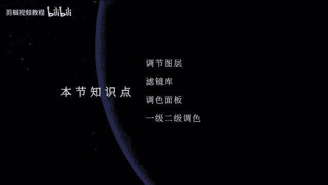
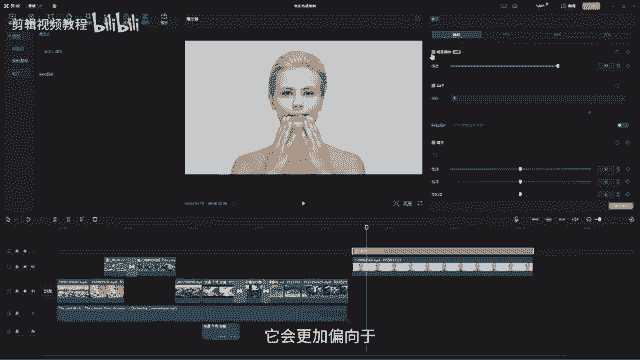
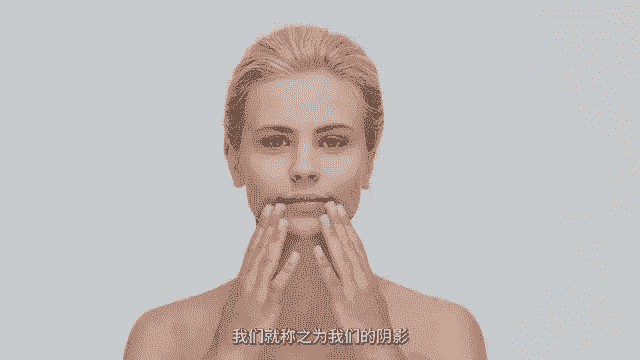
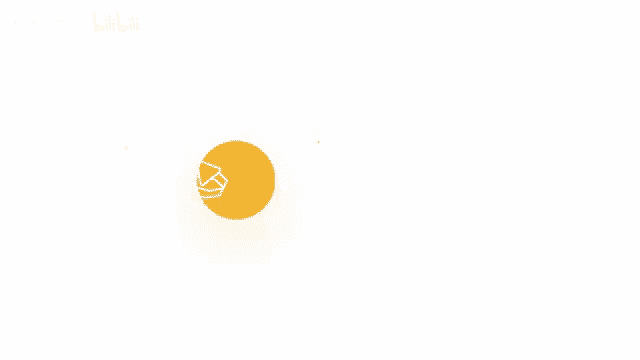

# 最系统的剪映电脑版教程 【2024】最新版 视频剪辑小白入门必学的一门剪映课程 - P6：【电脑版】滤镜和调节 - 视频号运营教程1 - BV1dM2vY7EpB

嗨大家好，那从今天这一节课开始，我们就开始来学习我们的调节和滤镜面板。那我们先来看一下今天我们要制作的这个案例。

好，那这个案例的话就是一个很简单的一个小视频，然后是一些城市，还有人来人往。那比较偏向于意识流泪的小短片。那这个片子的话，我们可以看到它里面的一些呃调色的话呢，是那一种电影感蓝灰的一种色调啊。

那这个色调的话呢会给人一种非常高级和这种比较偏冷的这种感觉啊。那今天的话呢，我们就来学习我们的这个电影感蓝灰色调的一个调节方法。那在我们开始学习我们的调色之前，我们先要对我们的调色面板来做一个认识。好。

首先我们先把这个先给它哎删除。O那删除完以后，那我们可以看到原片的话呢，它是这样子的啊，就是我们普通的这一种色调啊。好，那我们现在就开始来学习啊，首先第一个我们先来看一下这里面有一个叫滤镜。

那这个滤镜的话呢，其实。🎼就是我们调色的一些模板，或者是我们可以称之为我们的调色的预设。就是你在调色的时候，你你的一个色彩敏感度没有那么高的话，那我们可以直接套用它上面的这些模板。

然后呢直接来运用就行了，就不需要我们自己手动的去调，比如说我们可以看到你把鼠标放在我们的画面上一选。那这样的话对吧？呃，我们把音乐先关一下，这样的话你会发现啊，这个时候它就会给一个镜几个镜头的这个预览。

好，然后你可以多预览一些啊，对吧？哎，看一下，然后呢你喜欢哪一个O然后呢，它这里面也有非常多的啊，然后比如说VIP的，那就需要你冲这个VIP值，然后呢才来啊，比如说像这些对吧？

比较深的这种电影感O还有这种翻山越岭的这种效果啊，对吧？这个颜色比较类似于刚刚我们调的那个，那除了这个它还有还分我们的美食啊，还有我们的风景夜景风格画好，复古胶片，那像复古胶片的话呢，就比较常用啊。

比如说像这个对吧？像这一些它的一些噪点呢就会更加的多一些，然后影视级的话呢，就像比如说接近于我们好莱坞电影的一些色调啊，比如说青城色啊，蓝灰调啊，或者是我们的黑金调啊等等之类。

那这些都属于我们的电影级别的这。个颜色我们可以看一下，对吧？那在电影里面很多电影的调色就是这种O我们来看一下这些是不是好，那这是青城色啊，青城色好，像这种深褐色，对不对？

O那除了这个电影集呢下面还有人像。那人像的话呢，它更多的话会针对于我们的有人的镜头，哎，没有人的镜头的话呢，你可能呃用它这个颜色可能没有那么明显啊，那比如说我现在啊我找一个有人人物的一个镜头。

然后我们一起来看一下，它调下来会是什么样子，O我们可以看一下，比如说这个镜头我直接脱下来，对吧？比如说像这个镜头它就是一个有人脸的那像我们直接套用它的这个呃人物的这些预设，我们来看一下，对不对？

然后它就会可能它的皮肤会加一些磨皮啊啊，或者是会把眼睛啊，可以加一些呃这种锐化效果，像这种对不对？把让皮肤更加的光滑和细腻O那。这个是人像啊，专门针对有人物的那它还分男男人和女人，对不对？好。

分不同的人物，它的一个色调呢它是不一样的啊。O还有下面基础基础的话呢，它就适用于各种类型。嗯比如说像这种呃旷野蓝好，然后还有露营的啊，然后室内的那在室内的话，它的灯光可能就没有那么的强烈啊。

所以我们在调色的时候，对不对？那大家可以看到，我现在一加这个呃室内的它人物的肤色就会暗很多。因为我们室内的话没有太阳光，那么我们人物的肤色它可能就没有那么的白嫩啊，O然后还有这种黑白调。

那么电影级的这种黑白调啊，还有这种这种颜色啊就保留黑色和我们的红色啊，那这种颜色也是比较显得会有很高级的这种感觉啊。那这边的话呢是我们的滤镜，大家会发现，刚刚我把所有的这个滤镜套在人物身上以后会发。

发现有一些颜色并没有那么好看。那做完这一步以后，其实我们一般调色的话，它是会分为两步啊，一步就是我们所谓的一级调色。那呃那这个滤镜的话呢，它已经属于我们的二级调色了。相当于我们一级调色要做什么呢？

一级调色，我们要给人物进行一个颜色的还原或者是一个颜色的一个校正。那我们的有一些拍摄，就是机器在拍摄的时候，我们的人物可能或者是我们的视频它会比较偏灰或者是偏色啊那有一些可能饱和度过高了呀。

或者是偏红偏蓝偏绿等等之类，会出现色片。那当它出现色片在第一步里没有校正。对的时候，你直接套用它的这个lot或者是它的这些滤镜的话呢，对我们的这个颜色的影响是非常大的，就不好看。

那这个时候我们要怎么办呢？哎我们需要先给它进行我们的一级调色，然后。调完一级调色以后，那再套用lot的话，我们的颜色就会更加的美。OK那我们第一步一级调色我们要怎么去调呢？我们可以看到啊。

当我们选中这个调节的时候，这里面它会有一个叫自定义调节。那我们直接把这个自定义调节啊，直接拖到我们比如说拖到我刚刚这个人物身上，对吧？好，然后呢拖上来好，拖上来了以后，那这个时候在我们的效果面板。

这边的话呢就把它的调节面板呢就已经出来了。那这边的话呢就有哎今天我们主要学的就是我们的基础啊，HSL面板，还有曲线色轮。那我们调色的话呢大部分都是用到我们这四个板块来进行调节。

首先我们先来看我们的第一个板块，那第一个板块，这里面它有一个智能调色，那就是相当于它这个电脑自动的帮你去调色啊，我们可以点开。那这个时候我们发现人物的它的肤色会更亮一些啊。然后呢，你可以在这里。

去调它的强度。其实这里面的智能调色的话呢，它会更加偏向于像是这里软让软件自动的在这堆滤镜里面帮你去找一个滤镜套上去啊，那所以一般我们不会呃直接用这个智能调色啊，我们会自己手动去调。

那现在我们这个人物的话，它整体的一个色感呢是有一点点偏灰。然后呢，同时感觉好像就是没有那么的对吧？我们可以放大来看啊，这里面放大来看以后，我们就觉得好像整个画面没有那么的干净，对不对？

有一点模模糊糊的样子啊。那这个就是我们的原素材的一些比较明显的一些特点。那我们要去给它去进行一级调色的话，我们就需要在下面这一堆东西里面去调，首先我们可以看一下啊，这里面有个叫lot，这个lot的话呢。

它的原理跟这边是一样的啊，就是我们的一些预设啊，那目前我们是没有装什么预设，对不对？比如说这里有一个唯一有一个好，你选中它。

然后呢它就会有这个颜色啊，那这里是lot，我们可以先关掉它。那下面的调节的话呢，就是需要我们手动的去给人物进行一个调色。O这里面色温指的是什么呢？色温指的是我们的画面它是要偏蓝还是要偏黄。

在我们影视当中啊，画面它的一个颜色呢无非就有两种，就偏冷和偏暖，对吧？哎，然后呢那暖和暖和冷，它们的一个颜色用哪个来区分呢？就是用蓝和黄，那黄色给我们感觉就是温热热情温暖，对吧？的一个感觉。

那蓝色是给我们寒冷清晰，然后呢比较清冷啊，然后又有这种比较安静的这种感觉啊，所以我们的一个色调它就分分为两个，一个是我们的呃冷色调，一个就是我们的暖色调啊。

所以我们这里的色温指的是你的画面是要往让它偏蓝，还是要让它偏黄啊呢？那如果你的一个画面，像现在我们看到这个画面，它整体其实看上去是有点点偏黄的。那我们可以唉把它让它往这个什么哎往蓝这边走一点。

然后就可以让它的颜色给它校正回来啊，或者是我们哎在后期二级调色的时候，你可以给它加夸张一点。那这个时候它就变得很蓝。好，往这边就变得很黄是吧？好，那现在的话呢，我们先不用去调它啊。

那这里的色调色调的话呢，其实跟我们色温它们两个是要混合在用的。比如说我现在画面要偏蓝。然后偏蓝以后，人物肤色它就会变成有点蓝。那这个时候我就用这个色调啊，色调，然后呢去调它的肤色。哎。

我让它的肤色往红往紫色这边去走，那它的皮肤就会更加的润一些啊，可能就会更加的水嫩或者是白嫩或者白皙呃，粉嫩。啊这种感觉啊，那如果你往蓝色去走的话，我们的画面又会变蓝。看到没有？就会变蓝啊。

所以这个色调的话呢，它是用绿色和紫色。那这个色我们叫紫色，或者是我们叫品色啊，在我们的色调里面称之为品色。那我们会用品色和绿色来呃代替我们的色调其实是用来均衡我们的色温的。那下面的这个饱和度的话呢。

它指的是我们颜色的鲜艳纯度，或者是我们可以称之为颜色的浓度，那你的颜色的浓度越高，是不是颜色就会越亮，哎，给我们的感觉就会越鲜艳，对不对？那颜色越低，是我们的颜色就会越沉，所以我们的这个饱和度的话呢。

我们可以好往这边去调的话，大家可以看到我们的颜色就会越来越浓啊，很鲜艳。好，然后呢往左侧去调负数去调的话，我们的颜色就会越来越暗，对不对？大家要注意啊，我们的饱和度调到零的时候，我们的画面它是呈灰。

色而不是黑白而是灰色。所以这一点的话呢，大家要注意饱和度的一个用法。好，那我们再来看一下这里面亮度我们可以看到它这里其实有一个区分叫明度明度指的其实就是画面当中的亮比较亮的部分，那什么叫做比较亮的部分。

比如说白色对不对？白色啊有光的地方，然后呢就是比较亮的亮的地方。那这个时候你调亮度的话呢，画面就会变亮，看到没有？哎相当于给它开一盏灯一样，对不对？好，然后呢变亮。O然后呢对比度是怎么样？哎。

暗部和亮度的一个对比，那我们的对比度越低，然后我们的画面就会越偏灰，那现在我们的这个画面的话呢，其实它还好，但是呢还是有一点点灰，所以我们可以调节一下对比度，然后呢，让我们的画面会更清晰一些啊。

O那高光是什么呢？高光指的是画面当中比较亮的部分比较亮的部分，它跟亮度的话呢不太一。一样啊，高光我们现在去调高光。大家可以看到，当我调高光的时候，我们的我的背景的变化会更加大一点。

因为我的背景它就是这种纯白色，对不对？所以我在调高光的时候，我的背景啊会更亮一点。但是我调亮度的时候，哎，我是整个人都在亮。看到没有？哎，是整个人都在亮啊。哎，你可以理解为我们把这个人放到一间白色的。

就是这个墙面全部都是白色的这个房间里面，那亮度的话相当于给这个房间，然后开了一盏灯，所以我们的墙亮的地方会更亮，然后我们暗的地方，然后也会提起来，对不对？人物也会变亮啊，然后呢，高光的话呢。

它只针对于比如说它只调墙的亮度，然后它调了这个墙的亮度以后，因为我们人是在这个空间里面，那白光的话呢，其实我们的光线它是会反射的，对不对？然后呢通过这个反射和空气传播，然后会反射到我们的脸上。

所以就会给我们。感觉我人也有点点啊就有点点提亮的这种感觉啊。所以这个亮度和高光，他们针对的这个作用是不一样啊。亮度是开灯，高光的话呢是调亮我们的墙啊，O那我们再来看一下阴影，阴影的话就是调我们的亮部。

那阴影的话呢，更多针对的是我们画面当中暗部啊偏暗的一个部分，对不对？那我们可以看到现在画面当中没有很黑，然后呢又没有很亮的内容是哪一些？比如说我们人物的这一些肤色，对不对？啊？

然后还有它侧面这一些啊凹陷处，就是哎光没有直接照射到，但是呢它又没有完全的变黑的地方，我们就称之为我们的阴影，那我们在调阴影的时候，大家会发现好我当我去调的时候，就是是不是就是哎我其他的不变。

但是我的这个凹陷处这一地方，然后呢它会比较的明显，对不对？O然后往这边调好，还这么去调啊。所以这个是阴影。那光感的话是什么呢？

当我们调光感的时候，唉，大家会发现哈更多的是我们的人在变化，对不对？那刚刚我们说了，前面这个亮度它是开灯，高光是调强。那其实这个光感调的就是我们人啊调的是我们人身上的这个亮度啊，比如说你太暗了，对吧？

然后我就直接给你加一个光感好，直接在你身上加一个啊打粉啊，或者是打光啊，反正就是把你给照亮啊，所以这个光感调的是人，然后呢高光调的是我们的墙亮度调的是整体。O那就是我们的明度啊。好。

那我们再来看一下下面这里有个锐化，锐化的话呢，我们就是其实就是让画面会更加清晰。我们可以看到像这个人物啊，它的这种发丝其实已经可以看到是根根分明了。但是呢我要让它会更加的细致一点，或者是更加的明显一些。

然后我们就去调锐化，大家可以看到当我调锐化的时候，大家会发现什么？哎，我们人物的眼。好像会更加的明亮了，对不对？好，比如说我们可以看一下，大家可以看他的眼睛啊，那这个锐化我们在调节的时候呢。

也不能呃随意的去拉啊，你不能这种去拉，这种去拉的话，在画面当中就会失真啊，稍微拉一点点啊，提高画面的一个清晰度的话呢就可以拉。那下面的这个颗粒，这个颗粒的话，其实就是给片子增加这种颗粒感，哎。

让我们的画面回复出那种老电影的感觉啊，模拟啊那个七八十年代港片那种复古颜色，对吧？电视机上面就会有这种雪花啊，我们称之为雪花，那它的一个专业名词叫颗粒。好，你加上去呢就会有这种颗粒感。O然后这个褪色。

这个褪色其实就是把我们的画面的颜色全部都取消啊，现在它是有颜色的那我们还拉大哎越拉越拉越拉，对不对啊，褪色褪色，然后呢它就会整体就会变得有一点点颜色就会更加的复古啊，再加一点。

颗力感是不是就有这种复古或者是啊那种油画的感觉啊？好，然后呢我们再加一点其他的滤镜，是不是我们的这个颜色就会更加的真实。好，然后这个暗角暗角的话，我们从它的字面上理解的话呢，其实就能理解暗角。

那比如说我们的呃画面人物在这个中间这个区域啊，人物的这个区域是不是就是我们的视觉中心，那视觉中心，那我们这四个角有些时候尤其像我们这个画面四个角，因为背景它是纯色的，然后四个角，然后如果背景太亮的话。

我们就会比较影响我们的视线，然后就不能突出模特的这个美感，或者是我们要突出模特的一些啊什么它比如说它的眼睛啊等等之类的一些重点啊，我们的视线就会受干扰。那这个时候我们就会通过这样的四个角的亮度。

来突出我们的视觉中心啊，那我们可以看到啊加暗角，对吧？哎，当你这种去加的时候，是不是我们的四个角角。变暗以后，我们的人物会更加突出来啊，那往右边拉的话是变黑。好，往左边拉是变亮啊，看到没有？哎。

就是变亮。那不管你是变亮还是变暗，都是突出我们视觉中心的啊，所以这个是暗角O那么我们现在理解完我们的整个基础调节面板以后，那我们现在就哎我们就给人物来进行一级调色啊。刚刚我们说这个人物它的对比度。

然后呢是有一点点偏灰。然后呢在整体给它打亮一点点，现在有一点点暗。好，然后高光把人物怎么样，哎再提亮一点啊，要不要皮肤太暗沉了啊，好，光感对吧？哎，光感哎再提一点。好，哎，高光高光背景可以提亮一点。

O阴影部分可以打下去啊，让它的轮廓更加立体一些。O那我们可以对比一下来看一下我们调出来的。看到没有？哎，调好了我们这个颜色对不对？调好这个颜色啊，那我们下面的这一些的话呢，目前我们可以不用去加啊。

因为我们现在是给我们的颜色进行一个校正啊，去调整一下，让它更加的符合我们的眼睛看到的一个颜色啊。O那么我们再来看一下旁边这里有一个叫HSL那这个它是什么意思呢？关于HSL的话。

我们要知道这三个字母所代表的意思是什么？第一个H其实就是我们的色相啊，它这里其实都写出来了，对吧？色相色相什么是色相，哎，我们要偏哪个颜色，哪个颜色其实就是颜色的名称，那比如说我们的颜色啊。

这里面有红橙黄绿青蓝紫，哎，那每一种颜色它就是一个色相，所以这个色相指的是颜色的本身啊，有颜色，它自己O然后呢饱和度。刚刚我们说了饱和度是颜色的什么呀。鲜艳程度对不对？或者是颜色的浓度啊。

亮度的话呢指的是我们的什么？唉，这里面的亮度跟我们这边的亮度它是不一样的啊。大家注意啊，这里面的亮度指的是我们颜色的一个亮度，你可以试想一下，当我们的光亮越亮的时候，我们的颜色看上去就会怎么样。

会更加的浅一些，会更加明亮，对不对？但是呢当我们的光感越暗，然后呢，我们的颜色就会越深啊，给我们的感觉就越深啊，就是同一个颜色在不同的光的作用下，它的感觉给人的视觉感受是不一样的。

所以这里的亮度指的是颜色在光的作用下的一个亮度啊。那我们这里它分出来，就是我们的画面当中其实大部分的颜色组成，就是我们的这7个，对不对？颜色组成啊。那我们红色选中了色相红色，然后呢让它往紫色这边偏。

那我们画面中偏红的地方，它就开始偏紫了，对不对？把画面中红色的。部分啊红色的颜色呢就开始全部偏紫啊，然后呢往这边就偏黄，看到没有？哎，就偏黄啊，偏黄。好，然后这个是色相。那这里饱和度饱和度的话。

那我们直接就选中那红色的饱和度，比如说它的唇色，你觉得不够红，那你就把饱和度拉高。哎，那这个时候我们就发现大的嘴唇是不是就变红了，对不对？O然后呢好，这个是我们的饱和度ok比如说我们把它的红色拉高。

那这里面亮度那你要让它更亮一些，对吧？哎，那亮度更亮，是不是颜色就变浅了，对不对？那如果我想让这个红色，它的唇色更深，好，我就把颜色降低，是不是就相当于去调它的一个呃颜色啊。

那这里面大家注意这个红色不只是嘴唇，因为我们呃所有的画面里面都会有红色的存在，只不过是红色多和少的问题啊？那像我们现在这个画面当中红色其实像它的手上也是会有一点点红的，只不过它的嘴唇会比较的。凸显一些。

所以嘴唇它会更加明显啊，这样我们选的是橙黄色的色相。那在画面当中比较接近于这个颜色，是不是它的肤色，还有它的头发。好，现在我们选中了橙黄色，然后呢，我们要让它变得更加的偏红。那这个时候你往红色这边去偏。

哎，人物肤色是不是就开始变成这种这种比较红的，对吧？好往黄色就这边去变就变黄，因此我们只要偏一点点，哎，让它的肤色看上去怎么样会更加健康或者是红润那就可以了，对不对？好，然后呢它的饱和度，哎。

给大家饱和度提高，那就很夸张啊。那如果我们要让人物白皙的话，大家注意啊，我们再调人物颜色的时候想要人物的皮肤会更加的白皙，你可以去降低它的饱和度。那我们现在把饱和度降低。哎，不用降低很多啊。

唉降低一点点，然后就是让它的皮肤会更加的白皙一些啊。好，然后呢还有它的亮度，哎，亮度给提高，对不对？好，提高亮度，让它的肤色更加的白嫩啊，我们可以再对比一下啊。对比一下，对不对？

现在我们的人物的肤色是不是就更加的白亮啊，白亮透亮。同时嘴唇的颜色也更加鲜艳啊。好，那还有一个黄色，对吧？黄色我们可以看一下画面当中我们可以用每一个颜色的去拉啊，因为它都会存在这个颜色。

只不过是多和少的问题。就是比如说当画面当中某一个色相比较少的时候，你去调它，对于画面的一个影响就不是很大。那现在我们可以看到黄色其实是很少的那我们去调的时候就没有很大的一个变化，对不对？啊。

没有很大的变化啊，那你要调也行，不调也可以啊。好，饱和度还有饱和度也也是一样啊，没什么没什么变化啊。那绿色也是一样，绿色啊，现在看上去绿色也没有，对不对？绿色也没有啊，好，旁边这个蓝色。

那它的眼睛可能会更加接近这个蓝色。好，你这么去调。对吧是不是有发生改变了？好，比如说往这边就会更蓝一点。好，饱和度更高。好，同时呢让它的亮度会更亮啊，或者是更深一些啊。好，蓝色还有紫色对不对？紫色啊。

那我们整体来看啊。好，紫色啊紫色不是很多，可能调下来就不是很明显。其实就是它手部分啊，手部位这个地方有一点点紫，那我们可以唉适当的调一点点啊，哎多或多或少的去调一点点。那如果你不调的话也可以啊。

那这个的话呢就多了，对吧？这个它的手部分啊，手部分是这个颜色。好，那往这边去调，哎，让它更红或者是让它更加哎调一点点就行。好饱和度，我们不是要让它的手臂更加白皙吗，所以我们可以把饱和度降低啊，好。

亮度提高，是吧？哎亮度提高O那这个就是HSL，然后呢，这边是打基础，对不对？这这边的话呢就是基础这边的话就打基础就调我们的画面的亮度啊，暗部啊等等之类的啊。那么我们的唉这边HSL的话呢。

相当于我们就开始进入到我们更加细致的一些颜色的调节里面去了。那这步的话其实也就是我们二级调色里面，只不过现在我们放到一级调色里面一起去调了而。啊，那我们现在这种去调。

就是从画面中挑出某一个颜色来进行调整，对不对？OK然后曲线那曲线的话呢，它这里面主要分为这四个，只有4条。那亮度的话呢，其实跟我们这里的亮度是一样的啊，这个亮度对吧？曲线这里的亮度是一样的。

我们可以看到哎，可以是整体画面调它的一个亮度啊啊，那这个啊这个O然后我们一般调的时候会打哎会会这样对角给它打这个点，然后呢会调S型曲线，对不对？哎，这种去调，相当于我们这种去调啊。

那这里面的话大家要注意为什么我们会调一个S型曲线。好，首先我们要明白呀这条线，它的一个工作的原理。那我们的这个线的话呢，它其实是这样子的啊，这边的话呢就是变量，相当于往上提。

或者是我们说往左侧提就变量往下压就按啊，然后呢它两边有两个点，看到没有？那两边有两个点的话呢是什么？这边这个高的这边这个。点相当于是我们的亮部，这个点的话相当于是暗部。那画面中有明有暗，对不对？

所以啊一个是呃亮部，一个是暗部。那往这边你拖动暗部的这个小这个这个小圆圈，然后呢去拖的话呢，就是往上就是暗部提亮啊，然后呢往左就是我们的暗部加暗，对不对？所以画面然后你往这边暗部的地方就会更暗啊。好。

然后呢往这边暗部就会更亮，对不对？O那这边的话呢，就是我们的什么啊亮部亮部就是往这边提就是亮部提亮。好，这边呃往下压，就是亮部变暗，对不对？亮部变暗啊，所以我们可以总结一下这两个曲线。

OK然后呢这边这个是我们的亮部。好，这一边的话呢是我们的暗部。OK那么往我们这边去提的话，这边是亮。对吧好亮。然后呢这边是嗯，哎，所以我们的这个曲线啊，这个曲线你往上去提，它就整体变亮。

往下提它整体变暗啊，它这个曲线的一个作用是这样子的，对不对？好，然后呢，它两边都可以往上分别往上去提，或者是往这边去提，这边也是一样啊，往这边去提，或者是往下去提，哎，这个曲线的一个用法，是这样子的啊。

好，然后我们再来看一下下面还有一个红色绿色和蓝色的线，那这个曲线它的一个工作原理是什么呢？红绿蓝这里面我们要做一个简单的理解啊。红。绿。蓝对不对？红绿蓝。红绿蓝。

那我们的这三个颜色其实是我们的色彩的三原色啊，三原色。那我们的所有的颜色都可以通过这三个颜色混合相加，然后呢或者是重叠等等之类的。然后呢去得到的对吧？得到比如说我们红橙黄绿青蓝紫等等之类的。

都可以得到它们啊，所以这三个颜色是我们色彩的三原色啊，然后呢，那我们这里面对不对？那这里面我们要调色彩三原色。那画面中只要有人呢肯定是有有红色，因为我们的肤色它就偏红，对不对？哎。

所以我们的所有的这个就是如果你要调的一些比较夸张的一些地方的话，你就可以用三原色来进行调，让画面往某一个颜色去偏O那么我们这个红绿蓝，它们的一个调色的逻辑是什么呢？哎，跟上面这个亮度它不一样。好。

这个红色的话呢，它调的颜色是我们的色彩的互补色唉，什么叫互补色，两个颜色在色轮上的夹角呈180度，红色对吧？红色它的互补色。怎么样跟它成180度夹角，那是不就这一块颜色。好，就是我们的青色，对不对？好。

青色啊，这个是红啊，红是不是我们3原色的红色蓝色的互补色，这里是蓝啊蓝色。OK蓝色的互补色是什么呢？哎画过去嘛，画过去是不是就是我们的黄色，对不对？黄色啊，O绿色的互补色是什么色？绿色在这里面啊。

green对不对？好，绿色的互补色怎么样？哎，往这边去，就是我们俗称的品红或者是紫色，对不对？所以它这里面的话，大家去记一下它的互补色啊，红色的互补色是青色蓝色的互补色是黄色绿色的互补色是什么品红色啊。

因此曲线它的一个调色的原理就是根据它的互补色来调节的，我们刚刚已经看到了啊，这边依然是亮度，就是画面当中红色最亮地方，这边是啊暗部啊，红色暗部的地方。那么我们把这个线往上提，往上提的话。

那现在这边就不是亮度，这边就不是暗度啊，这边是它自己本来的颜色，红色本来的颜色是不是就是红色，对不对？那你往这边去调的时候，哎，画面就会变得很红。那你往反方向去调，调的是什么？调的是它。😊。

互补色红色的互补色是不是青色？好，你往这边去调，是不是画面就开始变绿了，对不对？会变青啊？这个其实不是绿，是青色啊，青色这边的话就是暗部的红色啊，往上去调就变红。暗部的红色往这边去调就变啊变绿啊。

现在可以看到眼睛都变绿了，对不对？O然后呢亮部的红色往这边去调就变红啊，亮部变红好，往下面去调是不是就开始变怎么样变青啊？O那我们来看一下绿色啊，那绿色的互补色是什么，是不是偏红色。

那么我们把绿色往下拉，画面是不是就变绿，对不对？哎，变得很绿啊，好，往下去拉是不变红变紫，对不对？哎，所以绿色的互补色是呃偏红蓝色互补色往上是它自己的颜色，好，往下是不是就开始变黄，对不对？好。

所以我们这个曲线啊，这个曲线大家如果不知道它的互补色的话，你是调不出来它的这个颜色的啊。O然后呢我们再来看一下这个色轮。那色轮的话呢，其实就是整体颜色。的一个调节啊，那它分为我们的暗部中灰，还有亮部。

这里一个偏移，同时这里还有一个什么强度，对不对？强度其实指的是我们颜色的一个调节。那这里暗部的话就指画面当中偏暗的部分，中灰就是中间调，就是我们刚刚调阴影的那个那些区域，对不对？亮部就是比较亮的地方。

这个偏移的话是整体调，就相当于你调偏移的话，那就整体把暗部中灰亮部都调了啊，那我给大家去做一个实验。比如说O我把这个调成啊复制成两个啊，复制成两个。然后呢，我分别调不同的颜色，大家可以看一下啊。

比如说我现在啊我把暗部好，暗部我可以把它往任何一个颜色去调。大家可以看到啊，哎，这里面这色轮上红橙黄绿青蓝紫，特别多的颜色，对不对？好，你可以任意的把这个小滑块啊，任意的去调。

那这是它的一个就是它的一个这个啊颜色啊去取它的颜色啊，好，然后取完以后旁边这里是饱和度，往上去拉，就是饱和度。增高往下去拉是什么饱和度就降低，对不对？好，所以我们可以往上去提一点，暗部颜色偏蓝。好。

然后呢这边是亮度啊，往上就变亮啊，往下就变啊，对不对？好，然后呢我们可以好。好，这里有一个重置然，我们可以重置一下啊，然后稍微再调一下，哎，暗部给它偏哎一点点就行了。大家可以看到这里面它有红绿蓝。

对不对？然后你可以通过这三个通道去啊，比如说你要调直接在输入数字，你要加多少也可以，你直接去调到这个点也可以好，亮部对不对？暗部我们去调了，O中灰啊，中灰我们比如说偏黄，哎，中灰偏黄。

是不是它颜色也起来了，好往上去调好，亮度往下往下去压，对吧？好，亮部啊亮部我让它偏什么偏红哎，亮部我让它偏红，对不对？偏红，然后呢怎么样饱和度降低。

O然后呢亮度怎么样亮度提高或者是亮度降低O是不是这样的话呢，现在就是我是分开调，相当于是调细节啊，暗部中灰亮度我是分开去调的那调出来的一个结果是这样子。那这样子以后你觉得如果不是很好看。

你可以把它的整体三个效果的一个强度给它拉小哎，这个强度其实就像。相当于是呃把它身上的这个颜色的整体的这个强度给它拉小一点，对吧？O我们就拉小一点。好，大概拉到这个程度啊。那这个是我们已经调节了。

是分开调的。那如我现在在用这后面的这个用后面这个我们来调它的什么呢？调它的偏移。好，整体偏好，要么就是整体偏偏红，要么就是整体偏偏蓝偏绿，对不对？偏紫啊，所以它的颜色的细节呢就没有那么多哈。

往上饱和度O往上亮度，对不对？哎，所以它的调出来的，给人的感觉，调出来就不一样，所以这个偏移指的是所有整体画面的一个颜色的偏移。然后呢，我们旁边这个暗部中灰亮部的话调的是细节，它分开来调的啊。

所以我们在调色的时候，很多时候我们很少会用这个偏移O现在我们已经调完了。好，然后呢调到像这个样子以后呢，然后呢，我们是不是就比如说这个颜色，我觉得不是。很好看，对不对？我们可以在滤镜这里给它加一个。

比如说刚刚人像里面好，找一个好看的颜色okK然后呢再把这个颜色给它拉上来。是不是现在的这个颜色就漂亮很多了，我们可以对比一下嘛，在我们没有做一级调色之前。好，然后这个颜色我再推一个。好，裸粉对不对？

我们可以对比一下啊，就在加了一级调色和没有加一级调色人物的肤色的变化啊，那这个是已经调了一级调色。O然后呢，加上我们的裸粉以后，人物的整体的感觉是这样子的，好，没有加是这样子的，是不是差别特别的大。

对不对？哎，所以我们在调色的时候，一定要去怎么样，还要做一级调色啊。好，那现在它的整个调色面板的话呢，我们已经学习完了，那学习完了以后，我们现在就开始来调我们的案例当中的这一种很有电影质感的颜色啊，好。

那现在我们直接进入到这边来，我们拿第一个画面来调第一步我们先在这里新建一个调节图层，对不对？好，添加到轨道当中啊，哎可以拉长一点啊，拉长一点。O然后呢，现在我们是不是要做一级调色，对不对？

那么我们现在进入到我们的一级调色面板啊，然后呢，大家跟着我来调啊，第一步O亮度给它降哎，降一点点啊，降到-15左右。好，对比。😊，度的话呢给它降40，通数要调对啊，然后呢把它的高光高光的话。

我们再加30，哎，给它让它原来再亮一点啊，加30。然后呢再把它的阴影的话呢，就不用去调了啊。光感的话呢，给它减10哎减10，对不对？OK那弄完这个以后呢，我们再来像画面就有点偏灰啊。

所以我们把它饱和度怎么样，饱和度给它提高15。对吧让饱和度更高一些。同时呢我们把下面的这个锐化呀给它提起来啊，锐化给它加40。刚刚我们说锐化，它调的什么画面的清晰度，对不对？好，加40。

不用加太多就可以了。那这个参数大家就照着我这个去调就可以了，对不对？好，然后整体可以直接怎么样，整体调啊，那调出来就是大概就是这样子的。OK现在看不出来有很大的一个变化啊。好，那现在我们调完了以后。

我们直接在滤镜这边。然后呢，在电影集这里面找到我们有一个颜色叫做蓝灰色。好，这里面啊这个蓝灰色，对不对？好，把这个蓝灰色给它拖下来。好，那现在大家可以看到我们的画面是不是比较接近了，只不过是这个颜色啊。

这个颜色现在其实它是不是很浓啊，让我们把这个蓝灰色再拖一层下来叠加是吧？那现在我们的颜色是不是就已经达到我们刚刚的这个颜色。对不对？看一下是不是非常的非常的帅气，很漂亮，对不对？好。

所以这个就是我们的这个颜色的调节啊，也是我们今天本节课的一个学习啊。好，那今天我们这节课呢就到这里，我们下一节课再见。

