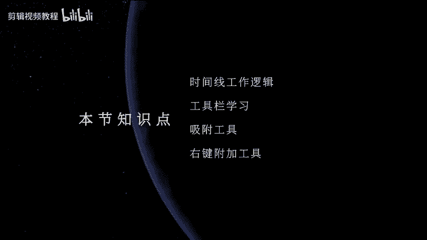
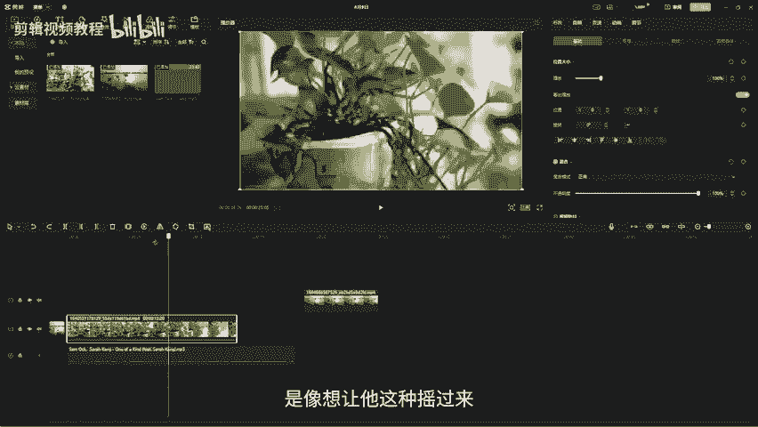
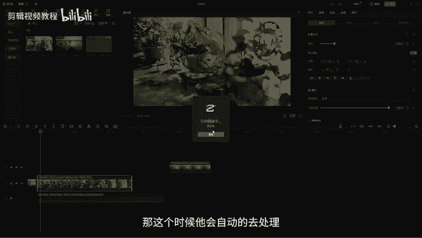
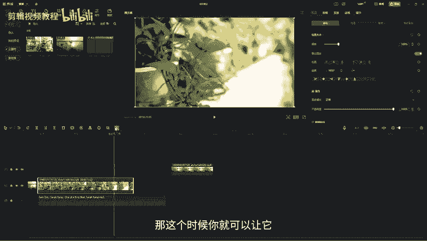
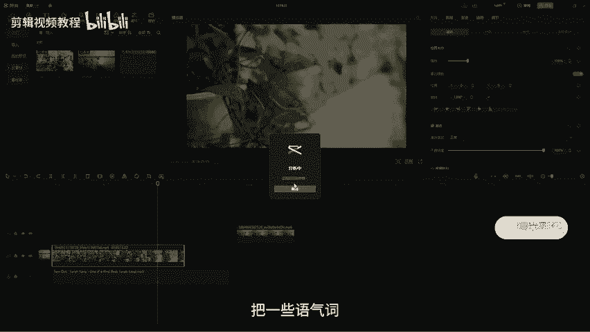
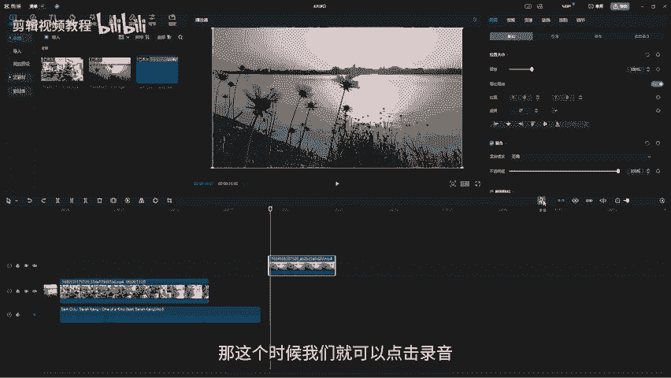
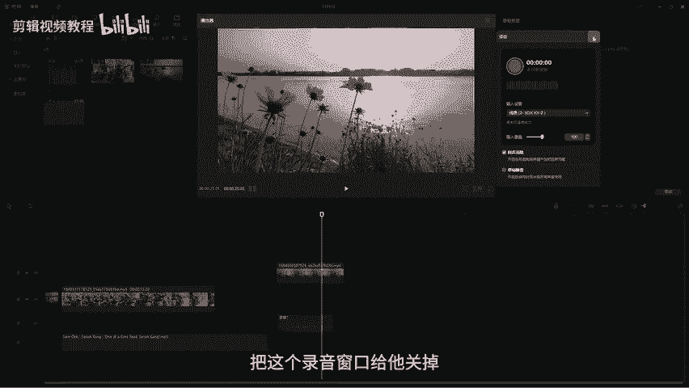
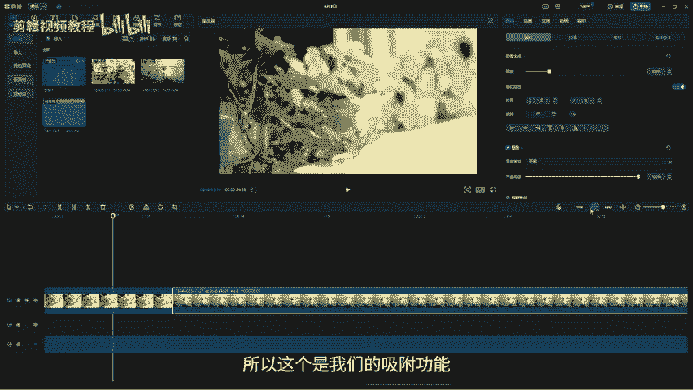
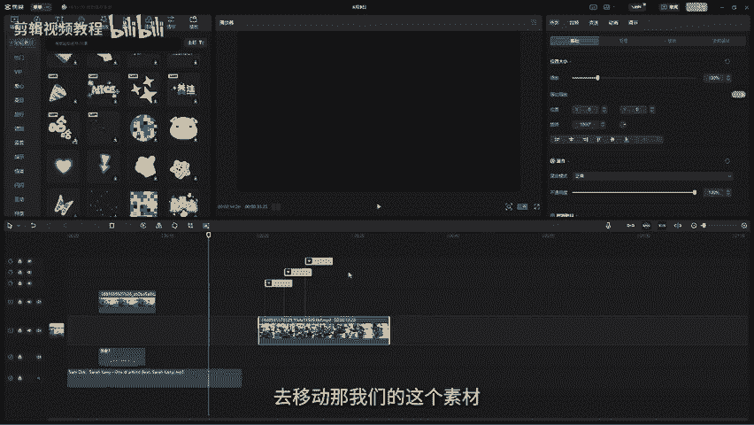
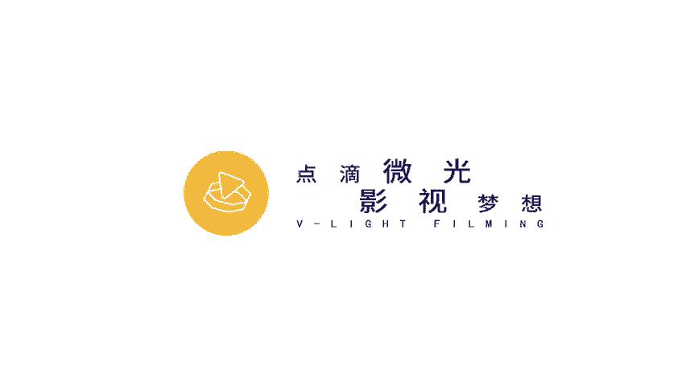

# 最系统的剪映电脑版教程 【2024】最新版 视频剪辑小白入门必学的一门剪映课程 - P8：【电脑版】时间线 - 视频号运营教程1 - BV1dM2vY7EpB

嗨大家好，欢迎来到我们PC把剪映教程。那上一节课我们已经学习了我们的素材库，还有我们的特效贴纸滤镜面板。那今天的话我们就来学习我们的时间线。那我们之前的课程就已经给大家讲过啊。

我们的时间线是我们剪辑的最重要的一个面板啊。呃，如果我们不用时间线的话，把素材导入到剪映里面，我们也是没有办法去剪辑视频的。好，那我们现在随便导入一个素材进入到我们的素材库里面。

那这个时候我们可以通过拖拽的方式，然后呢把我们的素材直接拖到我们的时间线上。那这个时候呢大家会发现我们的视频呢就已经拖到时间线上了。你可以通过拉动这个小滑块，然后呢来预览我们的视频。

你也可以通过按空格键，然后来播放我们的视频。O那么我们的时间线我们现在可以看到啊，它现在的话呢就是是这种只有。一个轨道啊，那如果你想导入多个素材，比如说我现在又有一个其他的素材。

那这种素材我也需要去导入到时间线上。那这个时候呢你可以把这个素材给它拖下来。好，直接放在我们的主轨道的后面，就是我们这个素材的后面。那你也可以把这个素材直接放在空白的地方。

那这个时候呢时间线它就会重新去给你创建一个新的轨道啊，那这个就是我们的副轨道。那我们副轨道和主轨道，它们的一个关系的话呢，就是我们的副轨道上面的内容是可以去覆盖我们主轨道上面的内容。哎。

大家可以看到它们的一个关系是这样这样去叠加啊。那如果你想让我们的主轨道的内容。然后呢哎先显示，那你可以调换它们两个的位置啊，只要你把你的素材往空白的地方去拖动，它就会自动的给你生成一个全新的轨道。

OK那这个的话呢就是我们的一个轨道的逻辑。O那我们现在视频素材已经拖进来了。那可能有同学就会问了，哎，那为什么没有看见我们的音频素材啊？那音频素材的话呢也是一样啊。

我们可以直接把音频拖入到我们的素材箱里面，然后呢再把这个音频直接拖下来。大家注意我们的视频轨道跟音频轨道，它们是分开的当你把这个音频轨道拖进来，哪怕你放在我们的空白上面。

它都会自动的在视频的下方去创建一个新的音频轨道。那啊你要导入多条轨道也是一样啊，把它放到空白地方，它就会自动的去创建我们新的这个音频轨道。好，那么我们现在来认识一下我们轨道右侧的这一些小按钮。

它们分别是什么？首先我们先来看一下啊，那这个的话呢，前面有一个小标志。那这个标志的话呢，其实就是告诉你这个是视频轨道还是音频轨道。我们可以看到视频轨道。话呢它就是一个正方形，然后呢中间有一个播放键。

然后就是TV的意思啊。然后下面音频轨道的话，它下面就是一个圈，里面有一个音乐的符号。OK那他们这里分别都有一个这个叫什么呢？有点像一把锁一样。那这个锁的话呢，其实就是锁定轨道。

那当我们去把这个轨道锁定以后，那我们就移动不了它上面的内容。那大家可以看到在我们有锁定的时候，我是可以去随意去移动的，就是当我去把它锁定以后，那我就哎移动不了了。所以这个是锁定轨道的一个作用。

那这个比较常用于我们在剪辑的时候，哎，有一些轨道，我们不想去移动它。比如说像我们的主轨道上面内容，我们不去移动它。但是我们在剪辑的时候，有些时候会因为呃这个不小心可能会对我们的素材去进行移动。

那这个时候我们就可以把它锁起来。那用来保护我们的轨道。OK那旁边的这个呢是一个眼睛。做隐藏轨道。那这个隐藏轨道的话呢，就是你可以去呃隐藏掉。比如说我现在这个阶段上面的一个内容。

然后我想看看它覆盖的下面的内容是什么。然后你就可以给它隐藏掉，那就可以去观察一下被它覆盖之下的这个画面的内容是什么样子。那这里面大家要注意，当你点击这个隐藏轨道以后，它是整个轨道隐藏的。

并不是说只会隐隐藏单个素材。比如说我现在这个轨道隐藏了。那我把这个素材拖到我们上面这个轨道，大家会发现它也依然被隐藏啊。所以只要你打开了这个隐藏轨道。那么在这个轨道上面的所有的素材都会被隐藏。

O那我先打开它啊。那如果你要去单独的去隐藏我们的素材，而不是隐藏轨道。那这个时候我们可以右键，然后呢这里面有一个叫停用片段，那我们直接点击填用。那这个时候呢，这一段素材就被隐。

然后你再把其他素材拖到我们这个轨道上面。哎，这个素材依然会显示啊，所以它们俩的作用是什么呢？就是一个是我们可以直接整个轨道的去隐藏。一个是我们只需要单独隐藏，我们不需要显示的这个素材呢就可以了啊。

那它的一个快捷键是shift加一。那这个的话呢建议大家还是习惯性的用shift加一，就是快捷键啊，那当然如果你要你只是想呃隐藏一下轨道的显示，你可以关闭。

这个就可以快速的去隐藏OK然后呢那旁边的这个的话呢是叫关闭原声。大家会发现我们的这个剪映里面我们的视频导入进来的时候，它会有一个音频。大家可以看到我们这段视频啊，下面它是有音频的啊。

所以啊当我们的音视频还没有进行分离的时候，它是不分音频，还有视频轨的，它不分，它们是一起都可以放在我们。视频轨上。但是呢如果你把它进行一个分离。比如说视频是视频音频式音频的话，他们就会分我们的音视频轨。

那像这种素材，他们俩没有进行分离的情况下呢，我们可以关闭这个轨道的原声。那这样的话，我们视频自带的声音就会被关闭掉。那你也可以这样右键这里面有一个叫分离音频。然后呢。

这样的话你就可以把我们的视频和音频进行一个分离。然后呢，把我们的音频直接删除。那这样的话呢也是一样可以去除我们原视频的声音。那具体是哪一种的话呢，大家根据自己的一个工作需求。

还有工作习惯呢去操作就可以了。OK那我们的这个视频轨和音频轨的话，它们的这个小按钮的话呢都是差不多。那我们可以来看一下，这里有一个叫封面。那我们可以看到就是在我们的一些视频素材。

他们都会在就是缩显示缩略图的时候呢，就会缩略一张图片。那这个图片就是我们俗称的封面。那我们如果你的这个视频，你想要让我们的就让我们的视频在显示缩略图的时候显示我们想要指定的画面。

那你就可以在这里面去点击编辑封面。那这个时候呢它会自动的跳到你的视频里面。那你就可以从你的视频上面选一个你认为比较好看的画面作为封面就可以了。那弄完以后，你可以点击编辑。OK那这个时候呢他就进来了。

你还可以给它去，比如说添加一些文字啊或者之类的那如果不需要，对吧？那你直接点击完成设置，那在这个时候大家可以看到我们的这个封面呢就已经设定好了啊。那你把放到这里的话呢，画面中就会去显示我们的这个封面。

那你导出的时候，在我们的文件夹里面，它的一个缩略图就会显示我们的这个封面。O那么我们现再来看一下我们时间线上的这个标尺。那这个标尺的话呢，指的是我们的时间。那你的这段素材的这个时间。

你滑快滚到了什么地方。然后呢，它这里面会有两个对应的时间轴。蓝色的这个的话呢称之为我们的实时时间轴。那就是你的这个滑块滑到什么地方，它就会告诉你此刻它的一个时间是多少。那白色的这个指的是我们时间线。

目前素材的一个长度。那大家可以看到我现在这首歌加上我的素材，整体的一个长度的话呢，是已经到达了我们差不多这么多，对不对？哎，就是当你把指针放到这里的时候呢，就是3分39。23，所以它这个白色的时间线。

它指的是我们时间线上素材的整体长度。那如果你把这个素材去进行一个剪辑啊，比如说我把它剪短了，那这个时候它的时间就会对应的就会减少啊，那这个素材如果你往后去拖啊。然后呢它就会增长，看到没有？哎。

它就会去增长啊。所以啊所以白色这个是我们的素材的时长。然后呢，我们呃绿色这个是我们滑快实时对应的地方，大家注意啊，我们这个滑块，它只会在我们的这个整体素材时长的区间内，然后呢才会游用。

比如说现在我的素材它只有18秒，那这个时候我想滑到后面去就滑不动了。会发现就滑不动了啊，它只能在这个18秒这里面来进行滑动。那如果我想到后面，那我只能去增强我这个呃素材的时长啊，就把它拉到这里面。

相当于去扩张它的领土。那扩张领土以后，你才能这么去移动。那超过这个时间以后你就移动不了了啊。所以这个是我们的这个时间轴，或者是我们可以称之为标尺。OK那认识完我们的时间线下面的内容以后。

那么我们现在来认识一下我们上面的这些小工具。首先我们先来看一下第一个，那第一个的话呢，就是我们的它的这里的话呢，有一个小工具箱。然后呢，第一个就是我们的选择工具。那选择工具的话呢。

当我们的鼠标变成选择工具时后，我们才能去拖动素材啊。O那么我们来看一下啊，来看一下，那这个就是我们的撤销键，比如说你操作错了，对吧？比如说我们现在就哎你不小心啊操作了，比如说这个我给它删了。

然后这个移这段我给它移到这边来了，我觉得这个操作失误了。那这个时候呢我们可以cttrorl加Z，然后呢去给它撤销，或者是你直接点击这个地方撤销，然后呢就可以了啊，撤销撤销，然后呢，它就完全可以啊。

那这个的话呢也是恢复对不对？恢复。那如果你撤销多了以后呢，你可以conttrol shift加Z，然后呢去恢复，看到没有？刚刚这个就被我撤销掉了啊，比如说我撤销。好，然后呢，我再恢复啊，它就出来了啊。

那。这个的话呢就是我们的分割工具，它就是用来分割我们的素材的啊。那这个工具的话呢，它的原理跟我们这边的这个分割是一样的。只不过这个分割的话呢，是没啊是需要按快捷键，或者是我们需要根据指针来。

比如说你想要把这段素材进行一个分割。那这个时候呢你就把你的这个滑块啊，拉到你对应想分割的这个时间点，然后呢点击一下分割。那这个时候你的素材就会被被分成了两个部分。那么我们这边的这个分割的话呢。

它是比较的自由一点。当你选中这个分割以后，那这个时候呢，你的鼠标就会变成一个像一把剃刀一样。然后呢你就不需要拉动这个滑块来，你可以随意的在你想剪的地方，然后呢去裁剪你的素材。

那这个他们俩的一个工作结果都一样。但是呢工作方式不同。那你可以根据自己喜欢的，然后呢去操作就可以了。那这个工具的话呢，就是你把你的滑块放在你指定的想要指定的位置。就是比如说你前面的这一整段你都不需要了。

你都想给它裁掉。那这个时候呢，你就把你的指针放在你想裁掉的这个时间点。然后呢，点击一下向左裁剪。那么你指针之外的这一个部分就会被裁剪掉，点击一下，那它就裁剪过去了。O让后面的话呢也一样。

比如说我撞到这里面以后，那么我这个时间点之后的这一部分我都不想要了。那么我就点击一下右裁剪好，点击一下，那后面这部分它就被裁剪掉了。那这个裁剪的话呢。

跟我们刚刚前面的这里的分割和我们的这个C键它们的一个原理，就是作用的结果的话呢，是一样的。但是呢我们分割的话呢，会更自由一点。但是呢你自由完以后，你需要手动去删除你分割的点。

比如说我现在C键在这里面去裁剪。裁剪完以后，我们前面不需要的这个部分，它并不会自动的消失，需要我们去选中它，然后呢再给它去进行一个删除。O后半部分也是一样啊，先给它裁剪。好，然后呢再选中它。

然后呢再去删除啊。所以就相当于多了几个步骤。那这两个按钮的话呢，就相当于帮你省掉了，你自己选择删除的这一个步骤。然后呢，那这个就是我们的删除工具啊，删除工具的话呢是比较简单的。呃。

比如说我们选中了以后就是你选中的区域它会变成白色有一个白框，那这个时候你点击一下删除它就会自动删除了。哎，其他没有选中的就没有被删除。哎，那如果你选中音频，点击删除，它也会去给你删除掉啊。

所以你需要删除哪一段，你一定要选中它，然后呢再去点删除O那么们我们的这个叫什么呢？叫定格啊，这个定格。那比如说我的这个画面啊，比如说我让它走。到这里的时候，我想在这个地方做一个定格。

就相当于把它放一张照片，然后呢加上我们的文字做包装，你就可以点击一下。那这个时候画面当中就会在我们刚刚时间线选中的这个地方，然后呢出现一张哎一张图片啊，就相当于截了一张图。OK然后放了一张图片。

大概的一个时长的话，应该是有5秒左右。好，然后呢这个时候我们再啊往后面去播放，它又开始在运动啊，所以这个是我们的定格啊，那你不需要的话，也可以给它删除。O然后呢，这个叫倒放倒放的话呢。

就是我们可以看到现在的这个我们的画面哎我们的镜头是从左边慢慢的往右边去摇。那如果你想这种你你想要的效果是想让它哎是像想让它这种摇过来。那这个时候你就可以点击一下倒放，那这个时候它会自动的去处理。

然后我们现在可以看到我们的视频播放的话，它就是这样哎倒过来的啊，就是从我们这边慢慢的对吧？哎摇过来啊，那这个那如果你不需要的话，你再给它怎么样好，再给它倒回来啊，啊倒放呢就取消掉了。好，然后呢。

这个是镜像。O那么我们可以看一下这个镜像镜像的话呢，其实我们可以理解为是水平方转，我们的画面，现在大家可以看到这个花是在我们的左侧啊，左侧。那如果我想把它放到右侧怎么放呢？你可以点击一下镜像。

那这个时候它就。

到右侧来了，然后呢它的镜头的运动啊依然不变，只不过是它的画面就是画面啊做了一个水平的颠倒。那这个是我们的镜像。O那这个是才呃旋转。那我们在做片子的时候，你可以直接就在这里去旋转你的画面啊，对吧？

现在是旋转了这个90度。好，你的左键点点击我们的这个小按钮，那你就可以去给它旋转任何一个你喜想要的一个角度啊，对吧180度，那它就回来了。OK然后那这个是我们的旋转裁剪啊，这个是裁剪工具。裁剪工具的话。

我们就可以在这里面去裁剪。比如说我只要这个画面，其他的不要。那这个时候裁剪完啊，直接去拖动上面的这一些小滑块，然后呢就可以了。好，点击确定。那这个时候你的视频呢就被裁剪了，对吧？哎就被裁剪了。

那如果你不需要的话，ctrlZ撤销一下呢，又回来了。好，那旁边的这个呢叫智能剪口播。那这个叫智能剪口播的话呢，是我们PC版它先出来了一个。比如说我们在剪一些课程的时候。

那会有一些比较就是比较呃个人讲话的时候会有一些习惯，比如说一些NR的这样的一些语气词啊，那这个时候你就可以让它自动的去剪辑啊，然后呢它会自动的去分析，把一些语气词，然后呢给你剪掉啊。

那因为我现在这里它是一首歌，所以它并没有。

识别到我们的语气词，所以它就失败了。大家可以自己去录一段文章，然后呢可以自己去试一下啊。那这个是软件帮你自己去剪的，你不需要自己去剪辑。OK然后那我们现在这个剪完以后，我们再来看一下我们这边这些工具。

那这个工具叫录音。这个录音的话呢，就是我们可以自己在我们的时间线上录音。比如说我现在这个画面，我觉得它太安静了，我想给它录一段文字。那这个时候我们就可以点击录音。那这个时候呢。

录音以后它会把我们的录音窗口呢就会掉出来啊。那呃这里面它输入设备，就你的麦，然后它会自动的去识别啊。O然后呢，如果有回声，你可以把回声消除，然后呢，草稿啊去给它静一下音，或者是你不需要点。

那这个时候点击一下开始录音就可以了。O那我们现在来试一下。

3秒之后我们开始录。好，一只蝴蝶飞在了我们花朵之上。OK然后呢点击一下结束。那这个时候你录完了以后啊，下面啊我们可以看一下啊，是不是就已经有我们的录音了。好，一只蝴蝶飞在了我们花朵之上，对不对？

那这个时候就是我们刚刚已经录好的声音。那录完以后你直接给它怎么样把这个录音窗口给它关掉。那这样我们的这个录音呢话就已经放到这里面来了。哎，那如果你需要剪击，你再去给它哎剪辑一下，或者是其他呢就行。好。

然后呢旁边的这个这个叫关闭主轨道吸附，那我们可以看到啊，我们可以看到现在我们的这个视频，你要你在我们的主轨道上面去拖动，比如说我想我我想把我这个画面给它拖到，就是在主轨道上面给它拖到后面来。

它家会发现我是拖不了的。哎，我一拖到后面一松手，它会自动的会吸附到最前面。那这个的话呢，就相当于是它会自动的识别我们的第一帧就是零帧，然后就让我们的画面都是从头开始啊。那如果你不。

需要的话，你把这个关闭，那这样你就可以怎么样，哎，就可以随意的去移动它的一个位置啊。那这个是我们的主轨道吸附OK然后呢，这个的话呢叫做打开自动吸附，打开自动吸附。大家会发现一个什么样的问题。

就当我们的这两段素材放在一起的时候。比如说我现在要让这两段素材给它接在一起。然后呢，很多时候我们会哎我们可能会没有把握。那如果我把它接多了以后，它就会跳上去，对不对？好，然后呢，我接少以后。

中间就会有一个黑色的夹针啊，那我想让他们俩刚好合在一起怎么办呢？我们可以把这个给它打开啊，直接打开。那这个时候打开完以后，你再去哎你再去吸的时候，就当你的两段素材头尾开始相接的时候。

它就会出现一条绿色的线，那就会告诉你说它已经吸附上了，那你松手呢就可以了啊。所以这个是我们的吸附功能。好，那现在我们来看一下旁边的这个叫做关闭联动，这个是什么意思呢？这个小功能的话呢。

其实就是当我们去给我们的画面添加了一些小贴纸啊，贴纸。比如说像这个怦然心动的这个小贴纸。那我们这个时候呢，我们可以看到啊，就是当我们添加了以后，那我们去移动画面的时候，我们就。

这贴纸是不会移动的那我们可以就比如说如果你想让这个贴纸啊哎跟我们的这个主轨道，然后有一个联系。那这个时候你可以就全选按住ctrl键，就可以选中你想要选中的素材，然后呢再点击一下我们的联动。

那这个时候呢大家可以看到我们的贴纸和我们的视频，它就会有一个有一条线，然后呢给它练起来。那这个时候你只需要选择我们的主轨道去移动。那我们的这个素材，哎，就是我们的贴纸就会跟着我们的主轨道这种去移动啊。

就是如果你不想要它们联动的话，你选中主轨道，然后呢点击一下联动，然后呢就啊它就没有联动了啊。

好，那么我们再来看一下旁边的这一个按钮。那这个小按钮的话呢，它叫做打开轴预览。这个打开轴预览的话，比如说我现在大家注意我的滑块是放到这个地方的那如果我们要去预览我们的视频的话。

我们是不是需要去拖动这个滑块，或者是去播放啊按住空格键去播放，那我们的这个滑块它移动到什么地方，画面当中就会呈现什么内容。那如果我不想移动这个滑块就去预览视频，那我们就可以用这个打开预览轴。

OK那这个时候滑块放到这个地方啊，我就点击预览轴。那这个时候呢它会出现一条黄色的线。这个黄色的线的话呢，你们就可以直接去预览了。大家可以看到啊，我的这个白色的滑块它并没有动啊。

但是我就可以哎整个通篇的去预览我的视频。好，比如说你预览到这个地方，你想停止，你就在这个地方点一下左键，那我们这个白色的滑块就自动的跳过来了啊。好，这个是叫关闭我们的预览轴。OK那么我们再来看一下旁边。

那旁边的话呢，这个就是我们的缩小放大我们的时间线。大家可以看到，现在我们的时间线它是非常的紧凑的，我想放大一下，怎么去放大啊？你可以按照这个滑块去拖。那这时候我们的这个时间轴它就越来越大越来越大啊。

越来越大。直至它现在这上面的一个时间就变成一针啊，就一帧一帧的对吧？一帧一帧的这么去移动啊，那如果你不想去调那么大，你就缩小一点。好，然后呢你就可以这么去拖动了。哎。

所以这个是我们缩放和缩小我们的时间线，它的快捷键的话呢，是我们的加减号啊，那加后就是去放大我们的时间线，然后减号是缩短我们的时间线啊，就是我们的加减后，大家可以记一下它的这个快捷键。好。

然后那现在的话呢我们的这个时间线上的这些小功能的话呢，都已经给大家去讲完了。O那么现在我们再来。来讲一个关于在我们时间线上没有的内容。比如说我们的右键工具。好，那么我们在唉选中素材的时候。

我们右键可以看到我们这里面有很多很多的一些这些小按钮。那这些按钮的话，我们挑一些常用的，并且重点的来给大家去讲一下啊，首先我们可以看到这里有个停用片段。那前面的时候已经讲了快捷键是shift加一啊。

那还有一个是什么呢？就比如说我们的这些素材啊，刚刚我们是可以给它去链接。比如说我们的贴纸和可以跟我们的主轨道去链接。但是呢我们的副轨道上面的内容，它是没有办法去链接的，还有我们的音频，它是没办法链接啊。

那这个时候我们需要干嘛呢？我们想要把它们打组的内容去给它进行一个哎进行一个编组，那我们就选中我们需要去打组的内容。然后呢右键这里面会有一个叫创建组合，然后我们点击一下，那这个时候呢我们会发现啊。

这个素材，你只需要选其中一个，那其他的就全部选中了，哎，就可以。整体这种去移动啊。那如果你不想让他们打组的话呢，也是一样呃，选中我们任何一个右键，然后呢解除组合，然后呢，他们就哎又变回独立的去了。好。

那这个的话呢是我们的编组，还有一个效果是什么呢？它跟我们的编组呢比较类似啊，比如说我们的主轨道上面的这些内容，我们是给它加了三个这个哎小心脏，对吧？这个小贴纸，那这个时候呢它就会很占用我们的时间线啊。

那如果你加了180多条，那可能我们的轨道直接拉嘛，对吧？哎，那这个时候我们在预览的时候，或者是在剪辑的时候就很不方便。那我们可以怎么办呢？全选我们的这些效果组，然后呢，右键这里面有一个叫新建复合片段。

然后呢，我们点击一下，这个时候大家会发现一个问题，哎，我的这个贴子效果依然存在。但是我的主轨道上面，哎，它就没不会显示那么多内容啊，那这个就是我们的。复合片段，它相当于啊我们把这一些把我们的素材。

还有我们的这一贴纸给它放到一个盒子里面，给它装起来，去进行一个打包啊。它看上去好像只是一个盒子。但是呢其实它的内容呢都不变啊。那我们如果不需要的话，在右键给它怎么样。好，这里面啊解除复合片段。然后呢。

那这样的话我们又可以解除我们的内容啊。好，然后呢还有一个非常重要的啊右键，就是我们要输出，比如说我这个视频我剪了这么长，但是呢其实我只想要我们后面的这一个部分，哎，我只想要输出我的这一段啊，导出的时候。

只想导出这一个部分内容。那我要怎么去就是这种去区域导出呢，我们可以把鼠标放到这个地方啊，放到我们哎需要去放这里面，或者是我们直接选择这一段素材右键它这里面会有一个叫做时间区域。然后呢。

以片段选定区域点击一下。哎，它会自动的哎帮你把这个区域给它选出来啊，其他地方就会灰色掉。看到没有？那我们在导出的时候啊，导出的时候，它就只会导出这个片段，不管其他有时间线上有没有内容啊，好，点击取消。

那这个的话呢，它的快捷键是I和O。比如说我们想要导出这一段。那么我们就把滑快放到它的这个开始的这个部分按下快捷键I，然后这个时候它会自动的哎自动的帮你在这个地方去打一个你的哎选择了你的这个对吧？

从这个地方开始好，结束好，结到这里O，然后呢这样的话就相当于这部分就自动的去给它给它选定了。那这个是快捷键啊，好了，那本节课的话呢，我们关于时间线的一个学习呢，就先到这里，那么我们下节课再见。

