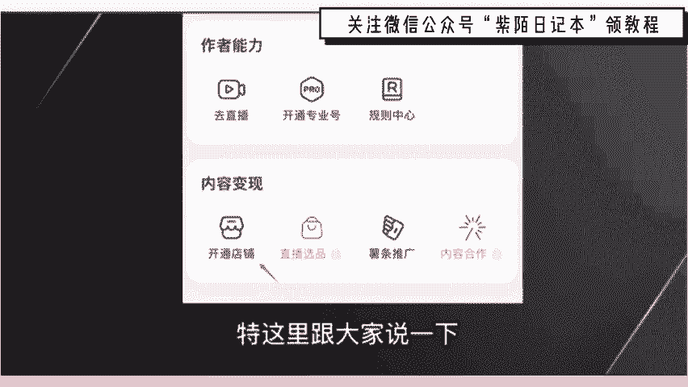
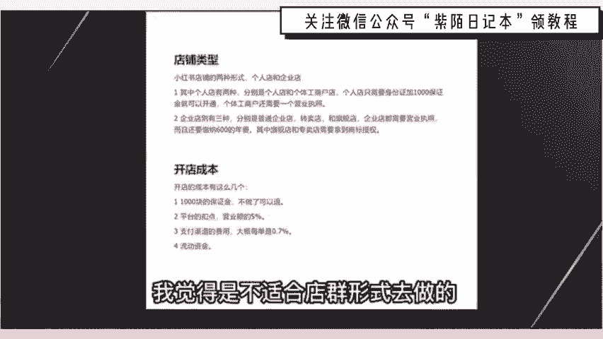
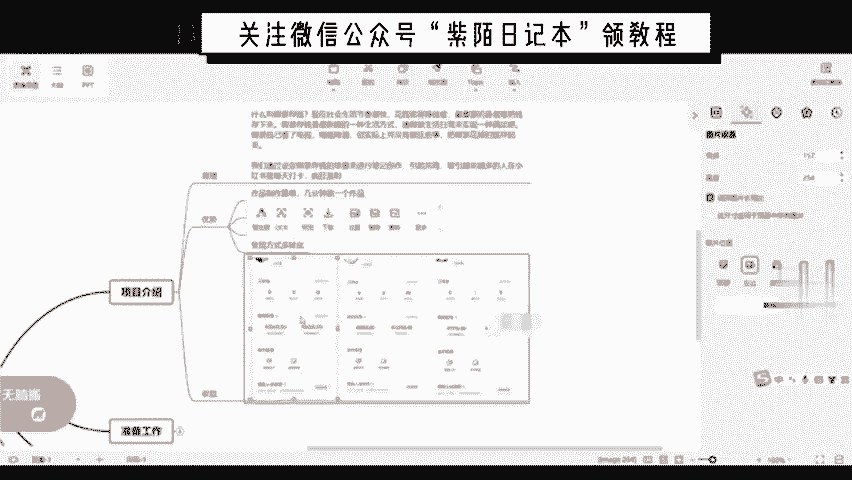
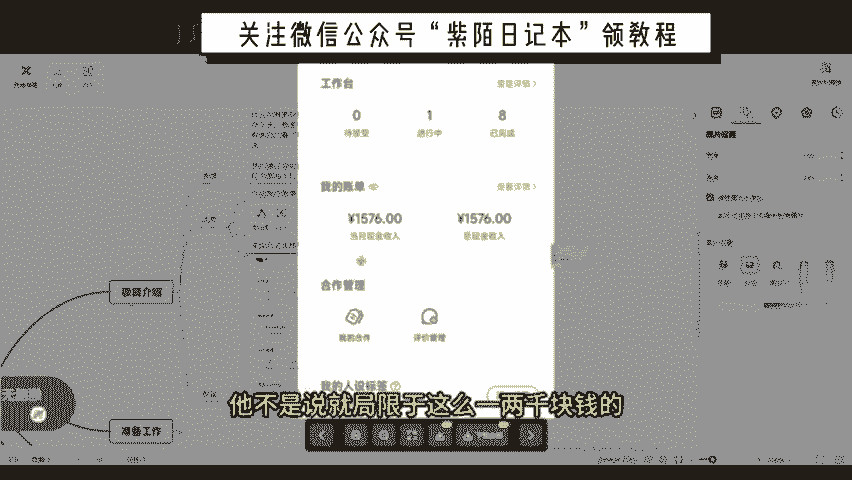
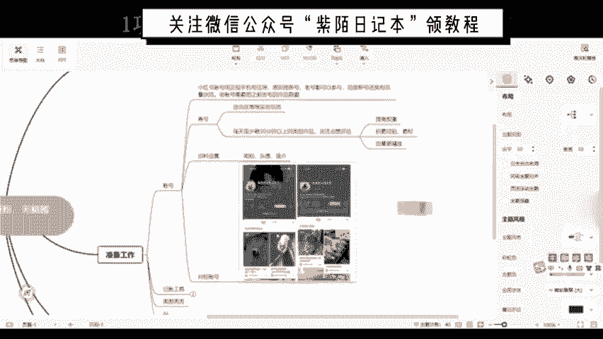
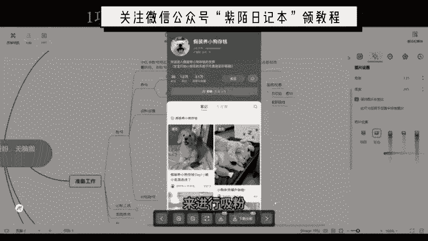
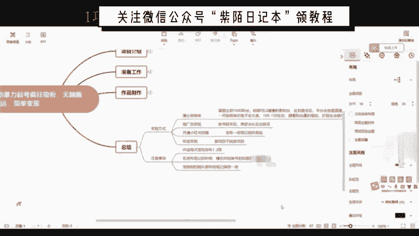

# 最系统的小红书无货源电商教程 【2024】最新版小红书运营起号 涨粉小白入门必学的一门新媒体专业版课程 - P1 - 三级盔八倍镜 - BV1Pm421p7WS

🎼进，但是一旦成功，那就叫会挡凌绝顶，依览众山强。你这不是钱的问题。要说最近什么项目最火啊，那就必须要提到小红书电商。最近几个月呢，几乎整个互联网都在讨论小红书电商。我关注的几个商业博主啊。

包括一些付费社群都在讨论它。我朋友圈月入5位数甚至6位数的比比皆是。这个项目在年初的时候，我其实就有让团队跟进测试。我还在市面上买了一些课程学习。到现在单人单店，一个月能做个一两万块吧。

今天我就用一个视频详细的给大家拆解一下，就是小红书电商到底怎么玩，我会把整个小红书电商的流程，包括一些注意点，比如怎么开店，怎么选品，怎么做流量，一次性给大家讲清楚。

你甚至都不用再去看别的相关视频和培训啊，你就跟着我的视频去按住佐骥，就足够你在这个事情上开始盈利了。视频的结尾呢，我还会给大家准备一份资料，里面有我找的课程啊，对你运营小红书电商呢会有很大的帮助。

有需要呢直接去拿就可以了。言归正传啊，整个项目的逻辑啊，其实也非常简单，它就三件事，第一个呢开店，第二个选品，第三个流量，我们一个一个来讲，先说开店。呃，开店其实没什么好说的。那，首先就是打开小红书。

然后点击左上角的菜单图标，再选择创作中心，然后点击更多服务这个选项，选择店铺，点击立即入驻就可以了。你就按他官方要求的提交资料入住就行了。我居然看到有人把小红书开店包装成一个项目拿出来卖。

居然还有不少人买，这也是很奇特。这里跟大家说一下，小红书店铺的两种形式，个人店和企业店，其中个人店有两种，分别是个人店和个体工商户店，个人店只需要身份证加1000保证金就可以开通了。

个体工商户呢还要多一个营业执照，企业店呢就多一点，企业店有三种呃，有包括那个普通的企业店，有专卖店和旗舰店，企业店都需要营业执照，而且还要缴纳600个年费。我们刚开始运营小红书电商的时候。

你直接选择个人店就可以了。我们实测下呀，企业店和个人店一样，平台并没有对企业店有什么流量倾斜。唯一的区别是个人店，你只能开一家，而一份营业执照，你可以开三个店，你一个店如果都没做好。

你开再多的店都是没有用的。而且小红书电商，我觉得是。

适合店群形式去做的。

这是因为小红书的流量机制，它的电商自然流占比非常低。那你铺再多的店，再多的货有什么用呢？所以只要你看到有博主跟你讲什么小红书店群，我都觉得是在扯淡。小红书是要做矩阵的啊，但不是店铺矩阵，而是账号矩阵。

这个后面在流量获取那里，我会跟大家细说，开店的成本呢有这么几个。第一个就是1000块钱的保证金啊，不做了可以退。第二个呢是平台的扣点营业额的5%。第三个呢是支付渠道的费用，大概呢每单是0。7。

第四个就是自己的流动资金啊，一开始大家做呢可以有无货源的方式去做，对资金要求也不高。你刚开始呢准备个2000块3000块完全够了。呃，开完店以后呢，我们下一步就是选品，我们应该在小红书上卖什么的？

选品其实也简单在其他平台上的爆款大概率在小红书上也能报。目前小红书呢我是推荐三个渠道进行选品的。第一个是通过某东某宝上面找那种小红书平台调性的爆款产品。呃，身边有做电商的朋友，他自己在某宝的店铺卖爆款。

搬到小红书上第一篇笔记就开。第二篇笔记单量就已经破百了。第二个呢是通过某音的那个精选联盟。你在某音的精选联盟排行榜，你可以看到现阶段哪些品卖的好，只要符合小红书用户调性的产品，直接搬运测试就可以了。

第三个就是某多多的这个销量排行榜，选择适合小红书的类目排行榜，从中选择相应的爆品搬运到小红书。整个选品的逻辑就是我们要利用市场来帮助我们选品，而不是自己在那瞎想。

我们要借助大卖家的选品能力来弥补自己选品上的不足。所以我们只要看断一个东西啊，就是这些排行榜上的爆品是否跟小红书的连群有匹配的可能，如果有我就搬过来测一下，对吧？

相当于是借助了别人的能力来帮我们自己选品，这样反而是最快，而且是最稳妥的选品方式，肯定比你瞎测成功率要高很多。然后等你这个产品上架以后呢，就到了最重要的环节了，我们应该如何获取流量。

小红书它是个种草平台。你店铺九成以上的流量啊，都是来自你发的发的笔记。这就是为什么我之想说小红书不要铺店群，而要做账号矩阵，尽可能多的发笔记耗流量。它的通路就是。

用户通过你的笔记然后对你推的产品产生兴趣，然后到达你的店铺完成购买，你堆一堆店铺，对吧？你铺一堆店铺一还不如多发笔记，多发几篇笔记的这个效果好。所以怎么在小红书上发笔记，对吧？

就是你小红书电商是否成功的关键。小红书这个平台，你直接发硬广，我觉得效果非常差，对吧？本来小红书的这个用户群体认知就比较高。你直接发广告没有办法获得信任的啊，更不要提转化了，你发笔记的时候。

一定要用一个素人的角度，你知道吧？就是用户的角度去切入，站在用户的角度去做种草内容，而不是官方视角，这才是真正有效的。呃，这种种草笔记怎么做，其实也很简单，就是去各大平台的商品评论里找。

比如某一某宝某东的商品买家秀找到好看的素材，你直接copy下来用嘛，对吧？文案呢在买家评价上去做修改。这些买家的评价呢就是商品用户的使用体验，天然的适合用来做这个中考笔记，而且可以说是取之不尽了啊。

然后呃当你单个账号的SOP跑通了是吧？我们就可以开始举阵引流了啊，通过批量上小红书账号批量发布笔记。给我们的店铺来引流来放大。那基本上整个小红书的电商的运营啊。

就是我上面分享的这些外面不管多少钱的培训啊，000块也好，600块、1万块也好，其实就是这些东西。有些培训可能还没有讲的清楚啊。根据上面几个点，我给大家准备了一份资料。

里面包括了小红书账号的起操运营的方法，以及一份小红书电商的视频课程。你如果打算经营小红书电商，你也不用看别的东西，就跟着这份资料走足够你开始盈利了。有需要的点赞加关注，在评论区回复红书电商，我分享给你。

😊，今天呢给大家带来一个小红书的蓝海计划暴力起号疯狂吸粉的一个项目。这个项目呢可以做到无脑搬运简单变现。大家都知道啊，小红书运营呢是一门很重要的一个学问。而且呢在小红书呢最快的一个变现方式。

就是我们达到1000粉丝之后呢，开通那个蒲公英来接商单。那很多人呢无论是运营小红书也好，或者说做小红书相关项目也好，都会被这个1000粉丝的这个门槛为难住。

那这节课呢就是给大家分享一个暴力起号疯狂涨粉的一个小红书的一个蓝海项目。这个项目是叫假装存钱法。具体什么叫假装存钱法呢？我们来看一下项目介绍。首先啊咱们先来看一下项目的原理。大家看一下哈。

这个蓝海的一个品就叫假装存钱。什么叫假装存钱呢？现代社会生活节奏都很快，大家也都知道，花钱容易挣钱难。最重要的是呢很难把这个钱存下来。那假装存钱呢，它是一种非常新颖的生活方式。

通过假装生活日常来实现一种满足感。假装咱们看了电视，假装咱自己喝了瓶啤酒，但实际上呢并没有发生这些事儿，也并没有做这件事儿。所以呢把这个假装的钱来存起来。这就叫假装存钱。然后呢。

我们通过设定假装存钱的场景来进行笔记的创作，引起大众的共鸣，吸引越来越多的小红书的人呢在里面打卡，来达到疯狂吸粉、疯狂转化的一个过程。所以说这个是一个非常好的一个涨粉一个运营方法哈。

咱们利用这么一个模式呢，粉丝量呢是蹭蹭的往上涨，没有任何问题。然后呢，咱们再来看一下项目的一个优势。咱运营小红书咱是有4个优势给大家总结了。首先咱们看一下啊。咱第一个咱发布假装存钱这一专题呢。

作品制作非常简单，几分钟就有一个作品，你也不需要杂七杂八的乱七八糟的剪辑拍摄啊，这个都没有。然后第二个优势呢就是现阶段知道的人很少，做的人更少，竞争呢非常小。这个赛道就不拥挤，是一个蓝海玩法。

这是第二点优势。第三点优势呢就是能够引发的用户的一些共鸣。所以呢才能做到一个疯狂吸粉。后面会给大家再具体讲一下啊，非常有趣的一个玩法。呃，最后一点优势就是变现方式多样化。之前前面给大家讲了。

咱们运营小红书呢达到1000粉丝是最直观的收入，就是一个蒲开通蒲公英。那后面呢还有很多的一些变现方式。之后呢，在后面那几节课呢再给大家具体介绍哈，是通过什么样的方式来变现的。这是一共总结了4点优势。

然后呢，咱们再来看一下这个收益这一块。这个收益这一块的话，我是觉得是那个蒲公英开通蒲公英这个橱窗来实现的一个收益，这是最直观的一个收益，对吧？也是大家最常见的。所以呢是截了这三张图。

这三张图的话是运营了我下面的人是运营了三个小号。首先咱们来看一下哈，首先看第一个号，第一个号的话已完成16个接这个商单。然后咱们看了一下收入啊，当月现金收入2568，总现金收入呢是3208。

这个做的时间不是很长啊。基本上的话一个月2000到3000左右的一个收入是没有任何问题的。😊。

这是第一章。咱们再来看一下第二张啊，这个的话完成的商单多一点，这个运营的时间长一点，这个是完成了43单，然后当月现金收入2500，总现金收入12706。这张的话就是新开的一个号，这个更好更小。嗯。

这个时间更短。还有一个在进行，这个到截止到目前呢，当月收入啊1576。这刚开始做起了一个号，所以呢就是这三个号哈是我下面同一个人做的，然后我就随便找了一个，就给截了个图。😊。

就是想带给大家看一下这三个号，其实你起号的话并不难，达到1000粉丝并不难。接这个商单呢也并不难。咱运营多个号也不难。难的是什么呢？主要就是一个你执行力的一个问题，经细化的一个问题。

这个啊因为咱运营小红书这个号可以咱们可以做一个非常好的一个副业。举个例子啊，比方说你就运营了这三个号。你看这个第一张2500，第二张2500，这就5000块钱了，第三张这个刚起来1576。

这就是小6500块钱了，基本上咱就相当于咱上班打工上班一个月的一个正常工资了吧。😊，基本的话平均工资也就在三四千五六千这个样子吧。正常的话，咱们就按副业来讲的话，相当于你就多了一份收入。

而且大家看一下啊，这三个号的话都是运营的时间不是说很长，尤其是后面这个号，这刚起来，所以说后面累积的粉丝量越多，你这个收益会持续持续上涨的。它不是说就局限于。

这么一两千块钱的。所以说咱做这个项目的话，稳定性是非常强的，非常好的。只要小红书这个平台，对吧？还有你这个你你这个粉丝量多了之后，你这个结商单就会有。😊，这是整体的一个项目介绍这一块。大家好啊。

今天给大家分享的这个小红书蓝海计划暴力旗号疯狂吸粉的一个项目。然后呢给大家讲一下准备工作。咱们做这个小红书运营的话，咱们就需要准备账号。小红书账号账号的话，咱们先来看一下啊，分这几个方面。😊。

首先第一个就是小红书账号，咱们必须得用正规手机号来注册啊。原则上呢是新号老号都可以参与，都能做。但是呢新号啊是有一定流量扶持的。老号的话就是需要把咱们之前发布的作品哈给隐藏掉，就是达到一个垂直度。

然后咱们再来看一下养号这一块，无论是新号和老号啊，咱们都必须要养号。2号的话就分为这几部分。首先第一个呢可以适当在小红书商城啊买一些东西，哪怕说一分一毛都可以，可以增加这个账号的一个权重。

第二点第二点的话就是每天至少刷30分钟以上同类型作品，关注点赞评论。这句话是什么意思呢？大家注意一下啊，每天至少刷30分钟以上，这个不是说让你一次性直接刷完，你今天就没事了，就不刷了。这个不是的。

咱们可以分多次来刷。比方说你今天上午你刷了10分钟是吧？中午或者说下午刷了10分钟，晚上再刷了10分钟以上。这样多次的来进行刷，可以增加你账号的一个垂直度，这样有什么好处呢？咱们再来咱们再来看一下哈。

首先第一点就是能够提高账号的一个权重。然后第二个就是积累经验素材，你看看别人的同行是吧，是怎么做的。咱们刷同类型作品的话，就是找同行，他是目前是怎么做的，有什么更好的一些方案，咱们可以借鉴一下。

然后最重要的一点呢就是能够使咱们的流量的。达到一个更加精准化，这是非常重要的一点。这是关于养号。关于小红书养号这一块呢，大家如果说想要知道更细节化的一个东西，可以联系我。

我这边是有一个7天养号法可以给大家参考。然后咱们再来看一下资料的一个设置哈。咱们资料设置的话就是最常见的就是昵称头像跟简介。这个咱们可以参考咱们的同行对标账号就可以。大家看一下哈。

下面的话就是我做的这个对标账号，找了几个同行的一些对标账号，大家首先看一下。假装存钱这个领域的话哈是多种多样的。就是如果你在在小红书直接搜的话哈，领域有很多。嗯，我给大家先看一下吧哈，大家看一下哈。

这是网页版的一个小红书。然后呢我们直接搜假装存钱。😊，然后搜出来之后呢，你大家看一下哈。他这些领域都很多，假装是樱桃小丸子存钱，假装是养这种宠物的哈。假装是跟着甄嬛传来进行存钱，这个都很多很多。

所以呢就是有很多赛道的话是比较拥挤的。所以呢我就给大家找了这个比较在这个领域比较蓝海比较热门的一种方法，就是假装养宠物的这种存钱法，这种养宠物的在小红书有什么草数呢？首先啊咱们要知道小红书这个平台的话。

大多都是女性用户为主，对吧？女性用户为主，那像女性的话，那就基本上很多人。都喜欢养宠物，尤其是小狗这一块。所以呢我们可以就是假装利用假装养这个小狗宠物。来进行存钱，来吸引这些比较感兴趣的这些用户。

来达到一个粉丝的一个年度。想首先咱这个领域假装存减法，对吧？吸引的其实也是一些比较感兴趣的一些嗯小女生啊，对吧？女性用户，假装存钱这种东这种东西呢其实很好很有趣。你会发现呃。

然后呢就很多人就随着这个博主呢在下面一块打卡，大家看一下啊。都是在里面打卡的。嗯，在这个打卡的同时呢，它这个假装存钱是吧，还能存钱还能吸粉。咱们再选择一个他比较热爱的这个宠物这一块。小狗这一块。

所以说这个效果的话是非常好的。啊，还有一个问题啊，就是大家如果说啊因为我给大家选的这个领域，就是假装养宠物这个领域这个赛道的话。呃，相当于咱这个领域的话，就是在这个假装存钱蓝海领域更蓝海的一种玩法。

可能后期的话，我发出这么一个作品之后呢，可能后面的也会很多人都会跟着做这个假装养小狗的一个分钱。这样赛道可能就会拥挤。嗯，那如果说后面大家想。做其他领域的话，可以联系我，可以帮你找一个合适的一个领域。

然后咱们再看一下这个给大家找的这个对标账号啊。😊。

假装想爷爷存钱。咱们姓名的话就可以模仿他的，假装养什么来进行分险。然后呢，这个就可以找到这个小狗的这个头像。然后看一下个人简介，这里是一个致力于从前的女大学生打卡搞钱。攒钱养小狗啊。

就相当于假装的一个系列。然后第二个就是它就比较直白了，就假装养小狗赚，假装养小狗存钱。这个的话粉丝量一人2万。欢迎进入假装养小狗存钱的一个世界。所以就利用这种东西呢来进行存钱来进行吸粉，非常有趣。

到时候大家可以看一下啊。

这是这个对标账号还是非常简单的。然后呢，需再需要准备的就是一个计算工具。计算工具是什么呢？你比方说。再打开小红书哈。因为咱们是假装存钱嘛，假装存钱的话，虽然是假装，但是你必须得需要真实一点记账工具。

大家看一下啊，就花钱你买的这些你就直接记账，直接转进去。要么是记账，要么是直接转进去。就是有一个记录，对吧？相当于你花了这个钱，就是你存的这个钱，起码你心里得有点数。记账工具的话。

这个是一个支付宝的一个小荷包。这个的话就可以我们就是可以备注一下。比方说假装存钱给小狗买点什么吃的喝的是吧，用的你直接在里面在支付宝里面搜索就行了。搜索支付宝小荷包，然后呢进去之后。

你就比方说假装把花了钱，比方说花了10块钱吧，你就存到这个转到小荷包里，相当就是存钱了嘛。第二种呢就是利用这个鲨鱼记账。😊，鲨鱼记账的是1个APP，你到那个应用商店里直接搜索就行。

这个的话就是相当于把你每天的一个支出给记上。比方说你花了多少钱，你直直接在那个鲨鱼机上来记上多少钱，就是有一个记录。如果你真想利用这个假装存钱这个方方法呢。真的想存钱的话啊。

你就可以额外用一个银行卡准备一个空卡啊。你直接把这个每天假装做的这些钱花的钱，直接转到这个银行卡里，用这个鲨鱼机上来记就行。这是两种方式，大家都可以选择。

然后就是美图秀秀跟AI的美图秀秀呢就是我们做图片来用的那AI呢就是咱们在美图秀秀上写文案来做的。写文案的话，就是直接用那个AI来直接换就行。大家看一下啊，就它这些文案，因为它也是。

因为这也是他们自己做的这个文案嘛，我们直接复制到那个AI进行生成，这样可以相当于就是咱自己的一个原创嘛，对吧？这是准备工作这一块。大家好啊，今天给大家带来的是小红书蓝海计划暴力几号疯狂吸粉的一个玩法。

然后这节课呢给大家分享一下那个作品制作啊。其他部分。这个作品制作的话，大家首先来看一下，分为这三个部分。首先第一点你必须需要这个图片。第二点的话就是作品的一个文案。第三点，作品笔记的一个发布。

这三点首先咱们先来看一下哈。😊，作品制作关于这个图片素材这一块。这个图片的话呢，就是这个图片的素关于图片的素材哈，这个已经给大家准备好了。在这个项目资料里，嗯，咱们直接在那里找就行。😊。

这是关于图片素材嗯，关于这个作品图片哈，在这里跟大家说一下，如果说你有自己的一个渠道，或者说有自己的真有自己一个宠物的话啊，你可以利用这个宠物或者说利用自己的一个渠道来拍摄。😊，那如果说没有的话。

这我这边是给大家打包了一些那个关于宠物狗的一些那个图片。在那个项目资料里已经整理好了，咱们直接就去拿就行啊。咱们先来看一下啊，咱们可以先找这个小红书里的对标账号。大家看一下，就是里面他们发了几张图片。

关于图片的个素材是怎么样的，然后可以模仿同行的，咱们来看一下。😊，我们打开那个手机版的一个小红书哈，直接搜索那个假装养直接搜索假装养狗存钱。然后就大家看一下哈，直接搜索假装养小狗存钱。

然后就会搜到很多这一系列的。先看这个啊。他这个的话第一天。就发了一张图片。大家看一下这个玩意啊，下班或放学的路上。就找到这么一个小狗嘛，然后你给他买东西，后面就开始养了。😊，嗯。

咱们再来看这个啊甲狗日记。😊，这个他是有那个啥的，他是用的这种漫画版的，它是用了三张图片吗？啊，就是那个转入的这个钱记账的钱。😊，对吧，评论的有很多都。我以为的养狗。😊，咱只要做图片的就行了。

图片呢就比较好做。这个发的比较多啊。这种的话这种发的这个图片啊，大家看一下。😊，去嗯，打开购狗APP跳了半天，最终买什么东西，他就把那个鸡胸肉啊、牛肉粒、牛肝都带上了。这整体的一个他们做的一些东西啊。

大家可以看一下这里面的一个一些元素啊。首先咱们可以用放一张宠物狗的一个图片。然后呢，第二个就是那个。记账的一个图片。第三个呢。就是咱们就把那个它是个选择的ABCD这些图片都加上。

我们就可以相当于就把它给细化一下了。对吧。然后呢，我们知道大体的一个东西之后，我们就开始做。首先呢咱们找到这个小狗的图片啊，我们打开美图秀秀，然后把打开美图打开美图秀秀之后呢，我们把这个图片给导入进去。

这个这个小狗的图片呢，就我是就是在那个给大家分享的这个网盘里找的。然后你就有需要的话就可以直接去拿就行。😊，然后呢，我们可以加一些东西哈，可以把它更变得好看一些。因为像女性用户的话。

都是比较喜喜欢好看的一件东西。可以加点贴纸。就这种贴纸啊，包括边框啊，咱们随便加就行。嗯，知道了。或者说你再加一些滤镜。都可以。嗯，做完这个图片之后，我们就保存。咱们图片做好之后呢。

我们就可以做这个文案了。文案我们再打开这个网页版了啊。再来看一下他们这个文案是怎么做的。因为咱是第一天做嘛，得以看第一天的。这个吧。这个点赞量挺高的。大家看一下啊，可以把这个。文下给复制下来。

咱们复制好文案之后呢，我们就打开那个AI来相当于给他做一些这个调整。AI的话，我是用的这个啊。如果说大家有这个大家有这个AI渠道的话，可以直接用。如果没有的话，可以联系我一下。

首先我们需要给AI输入一段指令啊，就是假如你是小红书。创作者。帮我修改。下面文案。然后我们就粘贴。直接发送。这是AI生成的一个文案哈。😊，嗯。然后呢，就是我们可以把这个ABC它不是这个选择嘛。

我们可以这个再修改一下，再自己再创一下，可以使这个原创度呢就更高。啊，他把那个。啊，他把那个这个话题都已经弄好了。大家看一下，如果说有想换这种再换这种角度的话，可以再给它再换一下。引人入胜的待次询问。

就是我们就根据这些文案来进行修改就行。我们就用这个文案吧啊，复制复制好之后呢，我们发布作品的时候啊，就把这个文案再稍微修改一下。我们就按那个在手机上来发吧啊，复制，然后发到手机上把这个文案。那。

咱们来看一下啊，然后把那个文案复制到备忘录。我们再稍微做一下修改，标题他都给咱弄好了。就在这一段啊，于是我跑到，于是我跑去旁边的便利店给他买了一根火腿肠。这个可以修改一下。给他买了。

然后选ABCDABC就跟它一样。诶。一根火腿肠，咱就再修改一下，咱就按2块。一个大包子，这个是B外行。一个大包的，咱正就按3块。一个大酒包的。然后咱们再来看一下那个小红书哈。

它那个咱们模仿的这个背标账号。这网有点卡。他C是那个补充能量的奶。来，咱们这样看啊，这样看就方便。C是那个补充能量的奶奶。咱说牛奶吧。3元。这样。然后把下面这段话删了。啊，然后大家再看一下哈。

就是文案的话，你做好之后，你必须得看一下，咱们是二创的这个对标同行的。你看一片小白毛。这个咱们看可以看一下啊。一只小狗可以改成，因为咱们做的它不一定是小白毛的这种小狗。一次。啊。

可以改成一只毛茸茸的东西。然后咱们再来看一下。给他取了个名字，对吧？因为他这个。咱们对标的这个账号是叫耶耶，假装养爷爷存钱。咱们可以比方说他名字叫假装养贝贝存钱不也行吗？给他取了个名字叫贝贝。

对吧这样修改就可以了。这样的话我们这个文案就做好了。做好之后啊，咱那个图片啊准备好了，这个文案准备好了，接下来就是发布作品了。嗯，但是有一点啊，先给大家再说一下，它是不是有那个ABC这个选项啊。

一个火腿肠一个大肉包子，还有牛种牛奶。如果说你想再增加。😊，再增加几张图片的话，可以根据这几个来开始增加。然后还有这个花掉的这个钱哈，这个花掉这个钱就给大家截图演示一下啊。😊，比方说咱花掉了这个牛呃。

花的，比方说咱们花掉了这个大肉包的3块啊，我们打开这个鲨鱼记账来进行计钱。打开之后呢，我们直接点这个中间计上。这边是有一个重复，对吧？备注。买了给贝贝买了。一个。打这方子。这大肉包子是3块钱。等这三块。

这样。截图。截图之后呢，我们就这个把它稍微截一下啊，稍微修修改一下。那张照片。然后有了这个宠物狗的一个图片，有了这个记账图片，我们就可以发布作品了。然后我们把这个文案给圈选。复制打开小红书。

打开小红书之后呢，我们就点这个加号发布作品。然后呢，我们就把这个咱们之前准备好的图片给放上去，就后面的选项图片哈，我就不给大家示范了，为了节省时间，这个大家直接在网上百度啊淘宝，直接搜截图就行了。

然后我们给它粘贴，粘贴的话，这个是标题啊。这样的话这个文件就做好了。做好之后大家看一下啊。这个话题咱们可以再加一下。假装。存钱。对吧可以添加几个这样这样的话题。然后呢，我们可以再细节一下啊。

就是这边不是有一个投票吗。投票组件添加。你跑进。便利店。买什么。也就选上A。火腿肠。B。大手包的。四。牛奶这样呢可以跟那个用户来进行互动啊。可以让他们投票，然后呢跟咱那个笔记一块进行打卡。

增加粉丝的一个粘性。然后都设置好之后，我们直接发布笔记就可以了。这是整体的一个实操部分，非常简单。大家好，最后一节课呢给大家讲一下这个项目的一个总结。总结的话哈，我是给大家找了两个部分。

第一是那个编线方式，第二是那个注意事项。咱们首先大来看一下这个编线方式。变现方式的话哈，大家看一下他那个咱们账号运营起来之后呢，这四种变现方式都可以。首先第一个蒲公英商单，这个是最常见的。

就是达到这个1000粉丝之后呢，前期咱们可以慢慢积累粉丝。达到要求之后，平台会直接给他发送这个邀请通知，咱们直接加入根据那个步骤操作就行，非常简单。😊，嗯，这一点还需要注意一下啊。

一开始的话它这个商单价格不不是特别高啊，就是100到150左右。随着粉丝量增加呢，价格会越来越高。😊，就慢慢去垒呗。对吧。然后第二点的话就是接广告的一个变现。账号起来之后呢。

也会有其他商家直接从后台或者说私信啊联系你接广告变现。比方说什么狗粮的是吧，这种相关的。因为咱做的这个账号就是这种相关类型的这种商家的话，可能后期会联系。😊，第三种变方式的话就是开通小红书的一个店铺。

店铺的话就是你可以发布一些关于这个咱们做的这些笔记相关笔记的一些相关商品。比方说什么咱讲小狗啊，狗粮的日常用的这些狗狗日常用的这些都可以。然后最后一点的话就是搜图的一个表现。这也是最直接的一个方式。

咱们把这个项目整体哈融汇贯通之后，熟悉之后呢，咱们可以卖这个课程来进行变现。你教给他们方法，他们给你这个收益知识付费。途卖项目基本上就是做项目，不如卖项目嘛，对吧？这个有需要相关了解的，可以联系我。

然后咱们再来看一下注意事项。🤧嗯嗯。注意事项的话，大家看一下哈，给大家总结了两点。😊，作品每天坚持发布1到2条作品，每天坚持发哈。这这种作品的话制作非常简单。你有哎呀，你有这个图片给你准备好了，对吧？

你直接做就行，几分钟一个，非常简单，也不浪费时间。😊，然后第二点的话就是在咱们笔记发布的时候，模仿对标账号这种相关的这些标题，还有话题来打这个标签。看看他们同行是怎么来做的。大家养号的时候可以都看一下。

然后还有一点的话哈，刚想起来给大家说明一点，就是因为咱做的是这个宠物狗这种领域的嘛。就是够。宠物狗的图片。诶。笔记给所有笔记。保持一致。这个是什么意思呢？比就是咱这个狗的这个图片啊。

你比方说你自己找素材也好，或者说是用我的素材也好，你找到一个狗之后，你别再换了。你比方说你今天你就咱做的，虽然是假装存钱嘛，是吧？咱必须跟客户产生这种共鸣嘛。你今天比方说你用个泰迪的，明天用个金毛的。

对吧，那就不好了。就是这么个意思啊，大家。大家自己那个体会就行了。😊，好，这就是整体的一个课程，到这里就结束了，感谢大家观看。😊。

ごよ。🎼那个破手是不点的？🎼ありあれとなら。他疯狂的追求我，说我很帅，侍问时不知道。😡，🎼拜拜。🎼ま你。🎼你呀多老师。🎼那 see。

