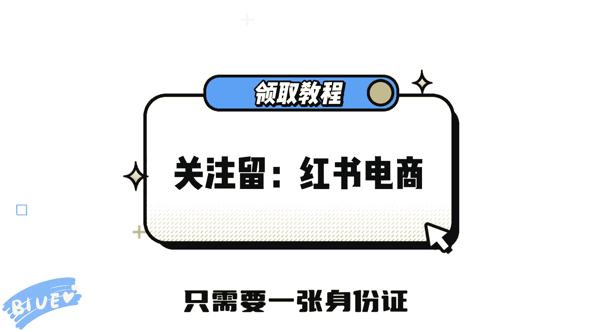
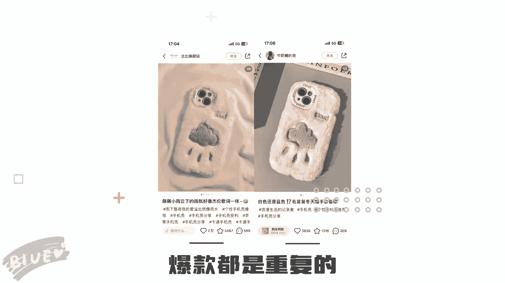

# 最系统的小红书无货源电商教程 【2024】最新版小红书运营起号 涨粉小白入门必学的一门新媒体专业版课程 - P1 - 不是那片天vyd - BV13xYCeDE1j

恭喜你，刷了这条视频，你将获得一份全网最全并且能落地的小红书。

开店实操流程，只要照着做，不仅能少走弯路，还能快速开店，即使你在小红书上领粉丝。

也可以直接开店尝试，第一步，开通薯店，只需要一张身份证。

不需要营业执照，打开创作中心，更多服务，点击开通店铺，按提示操作一分钟就能把店开起来，第二步，登录商家后台，后台会让你提示先交1000保证金，可以先忽略，等到店铺盈利以后再交，而且保证金是可以退的。

第三步学会选品，打开商家后台，在商品后台里可以看到热搜词，然后在热搜词上去发布商品，笔记能得到额外的流量扶持，第四步，商家商品我们可以利用一些电商工具，把选好的商品一键复制到自己的店铺。

第五步，模仿爆款，爆款都是重复的。

去模仿别人的表现形式，发布笔记时要带上自己的店铺的购买链接，做好这几步。

你店也就能开起来了，记得持续复盘优化，店铺会越来越稳定。

更多起店细节放在视频左下角。

