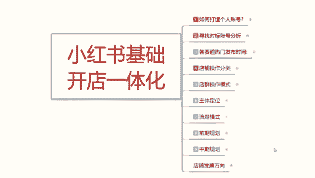
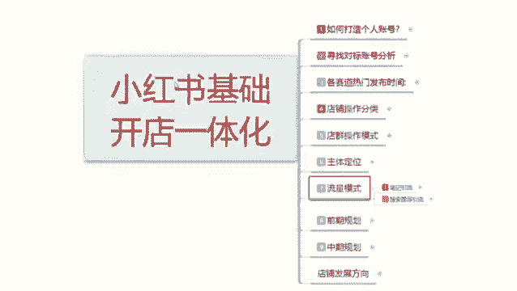
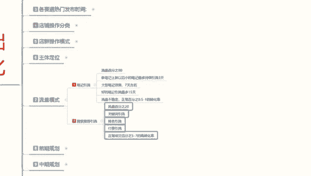

# 最系统的小红书无货源电商教程 【2024】最新版小红书运营起号 涨粉小白入门必学的一门新媒体专业版课程 - P11：10、小红书开店-搜索推荐引流方法详解 - 三级盔八倍镜 - BV1Pm421p7WS

大家好，今天给大家讲解小红书基础开店一体化的一个操作。呃，第七课是。

流量模式的第二个内容，搜索推荐引流。上节课呢给大家分享的是我们的一个笔记引流，就是我们基础的一个小红书系统推荐流量，它占比整个流量比例的80%。包括你笔记发送以后，每天能获得的一个大概流量比例。

还有笔记引流所持续的一个时间。第二个呢就是搜索今天主要给大家讲的就是说搜索推荐引流。它虽然说整体占比流量的话是小红书流量比例的20%啊，就是系统正常分配的话，搜索流量比例的话大概有20%左右。

而且这个数据的话，它还在持续增加。同样的，小红书这个20%搜索流量比例里面的话，它不是百分之百都是商品啊，它有65%以上都是正常的一个引流笔记。只是你搜索关键词以后的话。

它系统推荐把有同样关键词的一个笔记推荐给你了。因为。小红书据系统它不是纯卖货的一个平台，知道吧？所以说它这个里面的话，掺杂的所有流量的话，基本上都是推荐流量。我们如果说去做搜索的话，它里面只有35%。

接近35%还不到接近35%的一个商品流量。就是我们在正常的发布商品以后的话，它里面有一个商品笔记。我们发布这个笔记以后的话，只能争取20%里面的30%。之前也给大家算过。

可能的话就是800万到900万之间。这帮用户的话，他会去购买商品。在这800到900万之间，它是靠什么来进行排名的呢？就是关键词引流排名引流和付费引流。这三个点，这35这35%的流量的话。

就是按照这个比例去分配分配的35%里面付费流量占比15%。排名引流占比30%，关键词引流占比30%。排名引流是你的销量排名啊，交易排名。关键词引流是你的主关键词，就是你产品的别称名称。啊。

你比方说短袖T恤、化妆品、美容、美妆对吧？理发工具、汽车装饰等等这些主关键词边用户进行搜索的词汇，它占比。啊，付费引流是15，排名引流是接近30。其他的都是关键词引这35里面他还给你这么划分了啊。

关键词你留55，排名你留35。好，关键词排名50%。排名引流是35%。付费引流15%，这是占了百分这35%的概率率里面。也就是说我们做关键词的话，你只能在这个800万里面。截取50%的流量就是400万。

这是关键词排名。如果说你的商品销量比较好，成交金额比较高，那你可以占比35%。如果说你在小红车上面去付费。让小红书系统去给你啊抢排名，就类似于呃。怎么说呢？淘宝的、直通车转载等等之类的东西。他去做的话。

占比15%。当然这个是花钱的。你正常如果说你在小红书上面去做到一个付费引流的话，你只有做到中后期了才会去做这个前中期的话，你这个碰都不要碰，一碰就死。因为你把数据一停，你的店铺就。死掉了啊。

基本上是都是中后期中后期去操作。所以说我们正常抢抢单的话就是85%的一个流量。啊，就是800万里面85%的一个流量。你换算下来的话，基本上就就只有700万左右，700万左右关键词占多少呢，对不对？

占一半。一大半接近70%。你这个排名流占30%，也就是你的销量成交金额。关键词的话就是你的主关键词进行搜索以后，别人对在你这成交的一个数据反馈啊，收藏加购成交比例、转化比例。这都是由系统去分配的啊。

不是说某个人去确认的。我只能说是把大概的一个数据给你们进行分享，让你们了解我们自己在做小红书的时候，它的一个引流模式。你不能说小红书3亿用户进来以后的话，就每天就几个访客，有时候连访客都没有，对吧？

我笔记也发了，数据也做了，怎么都起不来，那是你自己的方向目标定位都没有找准。懂意思吧？所以说我们在做小红书的时候，你一定要先了解它的流量模式，了解我上面给大家讲的啊，确定自己的店铺定位，确定自己的主体。

确定自己做什么。你只有有思路了以后，你后续才能去做。你思路都没有的话，你盲目的去操作，你在小公上面做不起来。好吧。这个呢就是小红书整个流量模式的一个运行方式啊，当然了。

大家也会说它这里面还有一个关注页的一个流量。那个流量的话不计算在权重范围以内啊。关注页的流量跟你没有任何关系。然后现在的小红书上面还有一个商品渠道，那个商品渠道它是额外出来的一个排名系统。你在里面的话。

你自己虽然说那个排名系统出来了啊，但是它的一个整个数据的话，它还是按照排名引流去做的。那是都是卖的好的才能上去，你卖的不好，你根本上不去。我们前期开新店的时候，你就不要去考虑在那个里面去做了啊。

看在那个里面里面去做，你最少要把店铺做一个小爆款出来，你才能卖。不然的话你那里面的排名你抢不到，所以说那些都跟我们没有关系，我们把握现实一点，你就只能抢到那80%。和20%流量里面的一个数据。

80%是做引流的，而且它转化率特别低，基本上不到1%。高的话也就0。5，正常的话就0。3左右。就是1000个访客里面可能成交三单。还算多的。但是这个搜索引流20%的一个流量的话。

这个里面的一个转化率可以达到6%到10%。就是在小红书做搜索引擎，只要他是去搜商品的，它的转化率都很高。大家一定要把这个点弄清楚啊，所以说我们做的时候，你不光要做引流笔记，你也要做搜索推荐引流。

去抢占关键词排名的一个引流，去抢占排名啊，去请行关键词搜索付费暂时就不要管了。因为你在小红书上面前期做付费，你把握不住啊，你也操作不了。好吧，那这一节课呢就给大家分享到这儿。

下一节课的话给大家呃讲解一下我们店铺前期的一个规划，就是店铺你前期基础要怎么做，你的商品才能卖出去。你如果说没有这个规划的话，你前期的一个呃店铺，你就让小红书账号开了以后的话，你销量零，属性零。

账号没有权重，你产品都卖不出去的。那这节呢就给大家分享到这里。

