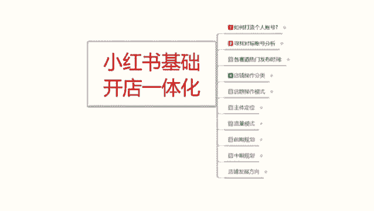
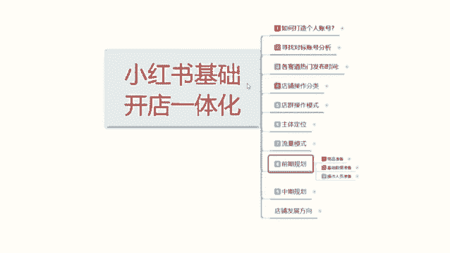
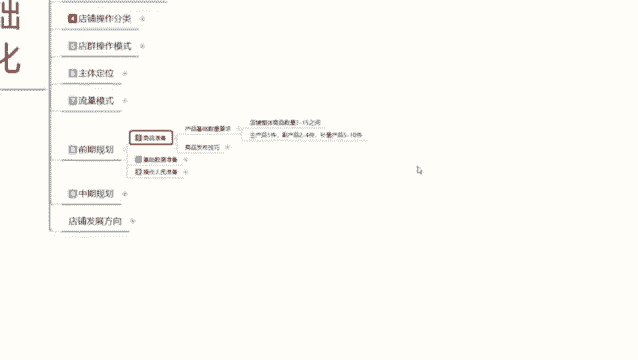
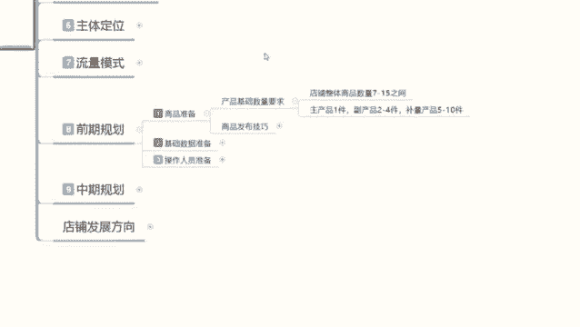
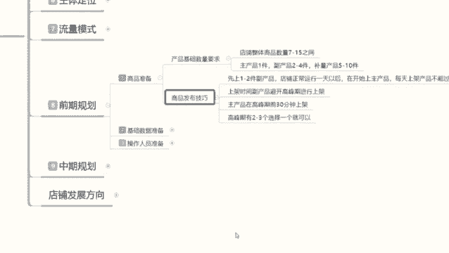
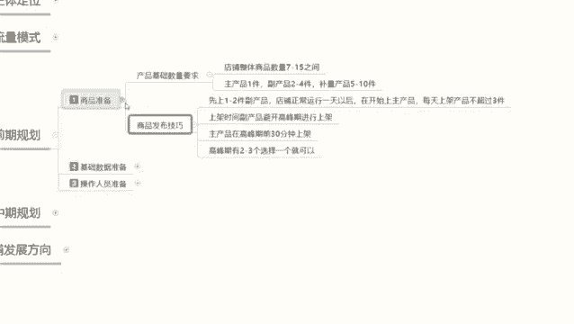

# 最系统的小红书无货源电商教程 【2024】最新版小红书运营起号 涨粉小白入门必学的一门新媒体专业版课程 - P13：12、小红书开店-商品发布技巧 - 三级盔八倍镜 - BV1Pm421p7WS

大家好，今天给大家分享的是小红书基础开店一体化流程的一个第八课时。前期规划第二个内容。

上节课呢给大家讲的是我们的一个商品的准备。

啊，店铺整体的一个数量。

这节课的话主要是给大家讲解一下啊，这个我们把数量准备好以后，它还有一个发布技巧啊，我们只有把这个数量你准备好了，你发布技巧掌握了，你去发送产品去组。呃，怎么说呢？就是说你去发布这些产品以后。

你才能获得更高的一个曝光和基础的一个权重。你如果说不把握这个技巧的话，你基本上就是基础曝光权重的话，大概会降低304%左右。啊，就是平白无故损失了30%的基础权重。虽然说。这个权权重的话。

前期它显示的不是特别高，你基住权重可能技术展示曝光量，你刚开店的话可能也就1000到2000。那你损失30%的话，你其实就本来只有2000的一个曝光量，获得个200个左右的一个点击。你再损失30%的话。

那你就1400140的话，你大概的话也就能获得10%左右的一个点击量。就140个小眼睛，140个小眼睛里面百分之。0。3。啊，就是百分比后面还不是1%0。3%的一个引流转化率和6%的一个搜索转化率。

而且你搜索的话是没排名的，你基本上前期就做不了排名啊。就是说你如果说按照这种技巧去操作的话，你店铺想把它做起来是很困难的。

我们先来了解一下什么是商品的一个发布技巧。

商品的发布技技巧的话，其实说就就是我们小红书开店以后的话，你的商品不要直接上传，它是有技巧性的。首先第一个就是先上传1到2年副产品，或者说是一件副产品，然后其他的上一件呃那个不量的产品。

主产品先不要上啊，店铺正常运行一天以后开始商家主产品，就是如说。在你的店铺被小红书系统录入以后，他知道你在小红书上面开店了，而且也开始上架铺货了，后续就是要开始做数据了。但是他不知道你哪一个数字组产品。

他暂时不会给你额外的去推流量。你只有开始有数据以后，他才会去给你推流。所以说我们第一天上架的产品的话，其实是给小红书系统做录入用的。他后续每天就会更新你店铺的一个数据。更新你店铺数据以后呢。

你再去上传主产品，那你的主产品上传上去直接就有排名，有排名，你就能去做它的一个基础权重属性。如果说你没有这些的话，你直接把主产品第一天发布上去。小红数字。现场录入，那你的排名不会太高的啊，有点偏低。

所以说我们要在这店铺正常运行一天以后。再开始上传主产品，然后呢，每天大家一定要记住啊，你的账号店铺每天上架产品不得超过30件，你不是做店群的。店群的话，每天50到100件无所谓。

你的店铺每天不能超过30件产品。就说这7件产品也好，十件产品也好，你要分三天、四天、5天、6天、7天在做。你一天上传一个产品都可以，但是绝对不能超过3件。啊。然后是上架时间，上架时间的话。

副产品避避开高峰期进行上架，就说任何时间段都可以发放啊，什么时候上都可以，但是绝对不能在高峰期去上。之前我也给大家说过了啊，那个每个产品，每个类目，每一个小红书的用户群体。

它都有一个产品的一个上架高峰期。你的副产品把这个高峰期避开就可以。然后呢，主产品在高峰期前30分钟钟上架。啊，记住了，主产品要在前30分钟上架，它和笔记不一样，笔记提前5分钟就可以。

但产品要提前半个小时。因为你要去抢排名。知道吧？你在半个小高峰期前半个小时里面只要成交一单。那你后续在半个小时以后，高峰期来临的时候，你会获得更多的曝光展示和点击。就是概率更大啊，概率学问题概率更大。

之前可能给你1%，你有转化以后的话，可能给你1。5%。不要小瞧这0。5%，这0。5%可能会让你的一个整体收益数据的话，就是基础展示报告量增加3分之1。就是主产品要在高峰期前3分钟上架。当然了。

前30分钟上架，还要看你有没有自己有没有转化，有转化的话，才有那个加成。如果说没有转化的话，说实话你就没有加成，你去高峰期上传的话，你就需要去跟别人做关键词排名的一个抢占，数据排名的一个抢占。

就看你的笔记优化做的到不到位。你笔记优化做的不到位的话，你这个数据量发出去以后也没什么太大的一个作用啊。然后呢，高峰期有2到3个选择一个就行了啊。就比方说你正常卖服装的话，我个人建议的话，呃。

你卖服装类的就是下午5点到7点。到8点钟，你在这个时间段前半个小时，4点半左右把商品上传，然后开始发放笔记。商品上传来以后的话，你花25分钟整理笔记绝对够。就是第一件组推产品上传以后。

花25分钟整理笔记。让系统多给你推荐一些自然流量，让你的第一篇笔记获得的流量曝光会更高一点。然后你再通过自己的方式去操作它的一个基础数据就可以。把这一套流程做下来的话。

那你前期可能给你1000的技术曝光话可能会到达1300。本来你只能获得50个小眼睛，80个小眼睛，你到后边做的话可以获得10110。那对于你后期的一个成长的话，它都是自的一个飞跃。

因为小红书的数据量的话，它都是根据你账号权重来定的。你其他前期账号权重，你每做完善一个点。你的账号权重越高，你每少做一个点，你权重越低。那大家可以想象一下，你本来就是一个竞争环境下面。

你只有越做的好的产品，小红书系统才会去越推荐你做的越差的产品，你资料越不完善。那么小红书它对你的一个呃推荐流量的话就会越少。所以说大家一定要明白这个点啊，就是说商品准备的时候。

你不光要准备基础数量的一个需求，你还要了解商品发布的一个技巧才可以。啊，那个不亮的产品就无所谓了，你高峰期高峰期也可以发，其他时间任何时间都可以发。因为你不指望他去给你做流量引流的，好吧。

主要的话是针对主产品。让大家了解一下，这个呢就是商品准备。那下一节课呢给大家讲解一下啊，商品准备完成以后，我们需要做的是。基础数据准备基础数据就是我们主产品所需要附带的一个基础数据。达到这个量以后。

系统给我们推荐进来访客以后，你的产品才可能成交，不然的话你连成交目的都达不到。好吧，那这节课呢就给大家分享到这里。

