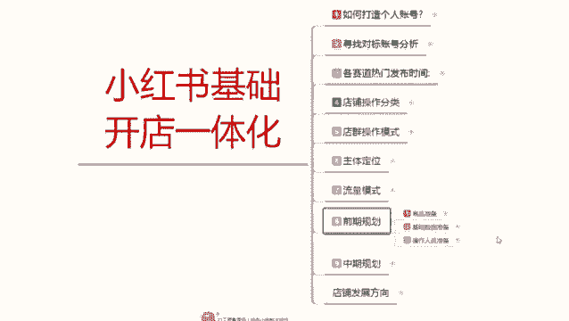
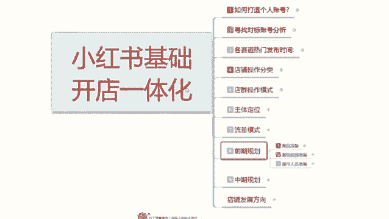
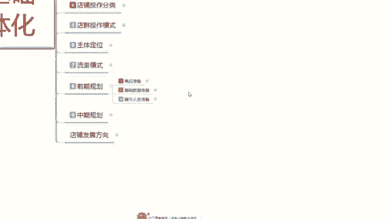

# 最系统的小红书无货源电商教程 【2024】最新版小红书运营起号 涨粉小白入门必学的一门新媒体专业版课程 - P14：13、小红书开店-新品发布后怎么做基础数据 - 三级盔八倍镜 - BV1Pm421p7WS

大家好，今天给大家分享的是小红书基础开店一体化的整套流程。第八课时。前期的一个店铺规划。

之前的一个分享呢已经给大家说过了啊。我们的一个商品准备，自己店铺所需要准备的一个商品数量和我们商品发布的时候一些技巧啊，可以避免我们前期很多的一些操作，而且提升我们的一个曝光和展示量。

这节课呢给大家分享的是基础数据的准备。这个基础数据的准备呢是做我们主产品啊，就是你在小红书上面开店做主产品，所需要准备的一个基础销量。因为你只有拥有了这些技术销量以后，呃。

小红书的用户进入小红书搜寻到你店铺进行观察的时候，你只。只能说是你有销量以后才能去卖。如果说你是零销量的话，别人在小红上面也不会去卖你的产品。不管你的产品做的再好啊，宣传的再多。

它也不会在小红书上面直接成交。他只会问你你的产品什么地方的价格怎么样啊，然后会去其他地方搜索，因为他不信任你。因为你的小红书上面一个评价没有一个销量都没有。别人是不会认可你在小红书上面做店的这种行为的。

也就是不会产生自然交易成交。所以说有些数据的话，我们在小红书前期的话，有些东西是我们必须自己去操作的。这里面呢就主要包括了我们的一个技术数据准备。那小红书主产品的个基础数据准备有哪些呢？

评价收藏、加购和销量。啊，这四个点。你主产品上架以后，我们需要保证在一周以内出现5个评价，收上加个50个以上销量啊大类目的话，就是说你的大类目比较广泛的话，销量是最少是20个往上走。

如果说你是小内部的话，就是1个往上走。那么内幕内就要看。怎么说呢？看你是做批发的，还是说做单卖的，单卖的话就销量少一点，破个十来个就行了。如果说你是做批发的那个销量的话，就得几十上百。啊。

因为冷门类目的话，他说实话它这个靠销量排名，靠数据的话，说说话的话比较严重。大类目和小类目的话反而相对会好一点。大类目的话，你只要基本上有20个以上的销量。

你在像我上面你的产品就能正常搜索就会有人咨询来购买。啊，只要你宣传的到位，笔记做的好，引流做的到位，账号没有降权。啊，很容易做成交。小类目的话，10个以上就行。这个就是小红书它的一个技础数据准备。

市藏架构50以上的话，这个是做你那个店铺展示的，也就是抢排名用的啊，越多越好。但是你低于50个以下也能做，只是说效果就没有那么多好了。评价呢是必须要有的。你的评价的话，前期有个两三个三五个。

其实就够用了。后续的话你我们都是在小红书上面去操作的话，基本上都是靠自然成交的啊，没有必要做太多的一个繁琐，只需要前期把基础数据做好以后的话，后续就是呃维护店铺的一个数据，然后发笔记。

优化自己的一个笔记内容。然后的话用小号进行评论，做反复的一个交互。啊，来优化我们这个店铺的一个属性。店铺属性优化以后的话，会增加你账号属性。你后续发小红书的一个笔记的话，它的权重就会累加往上面走就可以。

当然了，我这个基础数据准备的话，大家不用多想啊，它只做第一件产品。副产品的话，你把按照这个基础数据。如果说你想把副产品也附带一定的增值空间的话啊。按照他的3分之1操作就行了，就是有两个评价啊。

销量有个几个就够了，他就基本上都能正常的操作去售卖。啊，其他的那种呃不亮的一个产品，我们就不要去操作了，那个跟我们就没有什么太大关系，那只是放着好看的。你店铺里面一个主产品，两个副产品或者一个主产品。

一个副产品就够了。其实你整体的话评价做到个9个到10个，就是三件产品加起来产品，自己自己去操作，自己找人去弄的话，你的一个评价大概在9个到10个，基本上就差不多了。一个销量的话。

大概就是在30个到40个这些数据的话，你其实我们前期去操作小红书的话都是非常好解决的。为什么说小红书它的一个基础销量和基础数据评价的话，不需要像其他的那种呃直接做电脑，要这么高，每天要去维护数据。

因为小红书你的流量来源。不是主要靠啊商品的排名去争取的那个争取的排名转化率是高。但是我们前期的话，你去做这个排名的话，你肯定是抢不过别人已经开始动手做小红书的人。所以说你要抢的是什么呢？

是笔记正常引流的80%流量去博了0。3的一个数据量，把你的笔记引爆以后的话，你的销量慢慢的就起来了，你就有排名了啊，你后续的话，你这些数据你也不用去更新，也不用去做了嘛。

你一个月或者说有有个几天偶尔有那么一单两单三交四单成交，你的这个数据。它就自然上升了。当你的笔记做报以后的话，那你的单数的话基本上就是半个月。到一个月就突然间爆发，然后就卖一波。因为小红书的话。

它就是靠笔记去做引流的。你的笔记做的好，那你的销量产品销量就能跟他上去。你的笔记做不好，你的产品做的再好，规划做的再好。你能把它做上去，但是你需要投入大量的资金啊。对我们前期你不了解小红书来说的话。

你这么操作是。啊，必要性没有那么大啊，就是你直接去花自己的资金，然后去小红书上面抢排名，这个资金需求量是非常大的。所以说我们前期新手你鱼操作的话，你其实把基础数据做完以后的话，我们再正常去操作店铺的话。

他整个流程下的话就非常容易了。啊，就没有那么多复杂的一个模式，需要我们去跟进啊，包括店铺账号的一个数据整理啊，每天要保证多少转化，多少销量啊，那些其实的话嗯影响都不是太大。你只需要保证每天两篇笔记。

然后把数据做好就行。啊，它对于其他的平台来说是非常温和的。因为你每一篇数据的话，它都会给你引流。只是说你引流的一个人群群体啊是非常重要的。这个呢就是小红书前期的一个基础数据准备呃。

下节课呢给大家分享一下啊，就是操作人员准备。操作人员准备的话，它是为了做我们店铺，你想把自然流量做起来啊，你得想在小红书上面有自己的操作，那你就得把人群选定好人群选定好，那他对所对应的就需要我们。

操作人员的一个准备。操作人员准备是做什么呢？做基础数据的，技础数据就靠这帮操作人员去准备去操作。你把它操作好了，你的店铺后续洗来就怪。你如果说操作不好。

人群是杂乱的那你最少要多花一个星期到半个月的时间去把店铺的人群拉回来。新店啊，老店还不一定拉得回来。好吧，那这节分享呢就给大家分享到这里。下一节的话给大家讲解一下操作人员的一个准备。

