# 最系统的小红书无货源电商教程 【2024】最新版小红书运营起号 涨粉小白入门必学的一门新媒体专业版课程 - P15：14、小红书开店-账号店铺数据优化分析 - 三级盔八倍镜 - BV1Pm421p7WS

大家好，今天给大家分享的是小红书基础开店一体化流程的呃前期规划内容。这节的话主要是给大家讲解一下操作人员的一个准备。

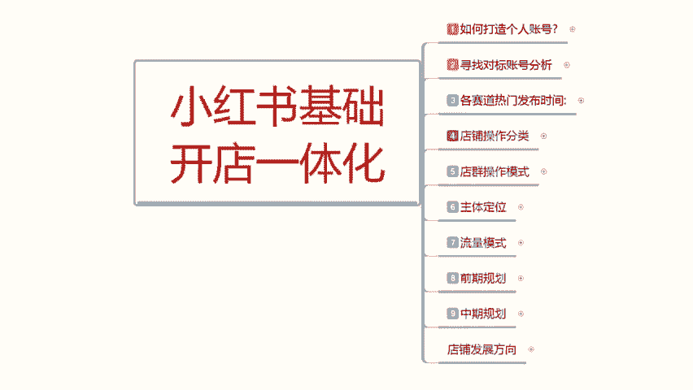

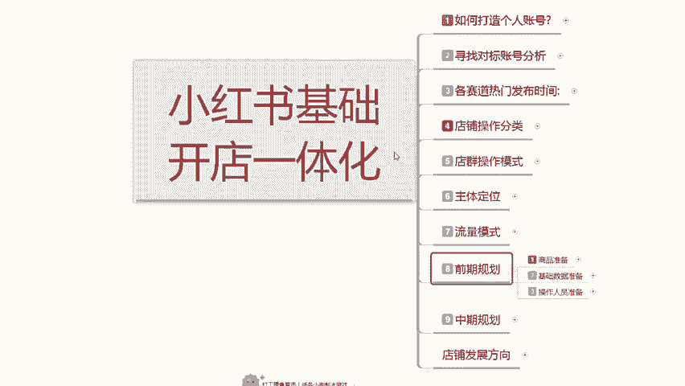

他说人员准备的话，其实就是招你自己心身边的亲朋好友，提前帮你做一下规划。如果说你自己有资源的话，那么你就是自己安排啊，自己多找几个手机做几个账号数据。然后的话就把这些操作准备准备一下就可以。呃。

如果说你的觉得资源找朋友很麻烦，他不愿意做。

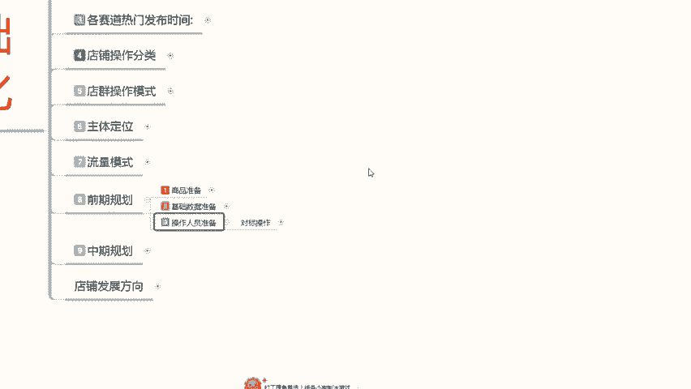

啊，你只需要找到人员，然后的话让他们稍微去做一下搜索，做一下对标就可以。就以说操作人员准备的话，其实就看我们个人自身的一个资源分配，你能不能做到位。如果说你能把资源分配做到位的话。

你可以节约半个月的时间，如果说你做不到位的话，那那你就需要多花半个月的时间去整理你的笔记，先把店铺和账号的人群拉回来，然后再去做，然的话，你这整个店铺的话，呃，说实话你操作起来的话，难度就比较大了。

好吧，这个操作人员准备的话，只是说降低你的难度，可有可无啊，就看你自己怎么去选，有最好没有的话，也是无可厚非。因为每些人的话，他的一个社交设计交往圈子本来就没有那么广。然后找这一些人来帮忙操作的话。

他们本来就不熟悉。你然后要一个一个去教他，你本来的话是吧？人一多人一杂别人也能帮你就不错了。然后你还有这么多要求的话，说实话。

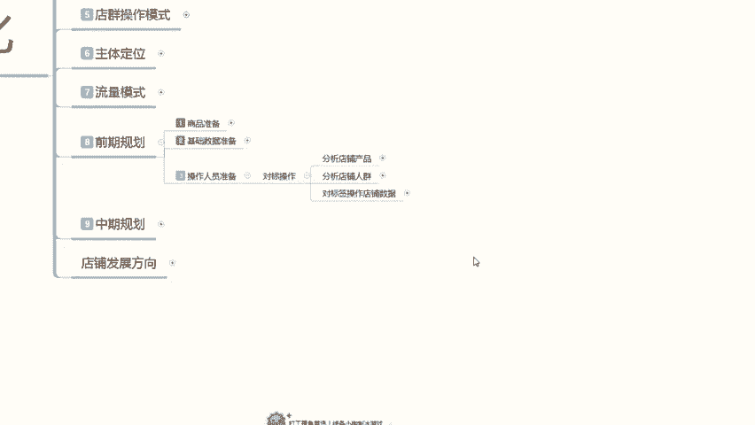

所以说对标操作的话，还是要看个人自身对周围啊人群的一个能力把控怎么样。如果说你对周围人群把控。比较差的话啊，能找到人就不错了啊，别人能帮你操作也就很不错了。当然了，如果说你个人有资源。

或者说有什么其他的渠道，或者自己有方式去弄的话，那就另当别论啊，那你就可以节约这个7天到15天的一个呃时间段。啊，让你的店铺快速报起。我们先来了解一下对标操作。我们首先需要了解三个点。

第一个是对分析店铺的一个产品。第二个是分析店铺人群。第三个呢是对边对标签操作我们的一个店铺数据。其实这几个点的话，其实就是我之前给大家分享的时候啊，也说过的，分析店铺产品就是我们自己的价格类型时效性。

你三个定点选择的一个属性内容。首先是价格你自己产品的一个价格范围，选定好，然后选择你自己的产品一个类型，然后选择你产品的一个时效性。提前半个月到一个月。

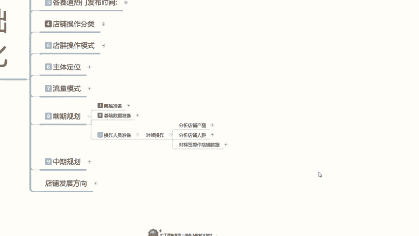

去准备这些账号，因为你的店铺开开始创作的时候，你的这些准备工作就已经要开始了。如果说时间你觉得比较长，那么你可以提前3天。就是提前三天去浏览你同类型的一个产品，同价格制定方位的一个产品。

时效性在同一时间段的一个产品。这个是对店铺的分析啊，浏览在这三个属性链，然后是对店铺的一个人群分析。

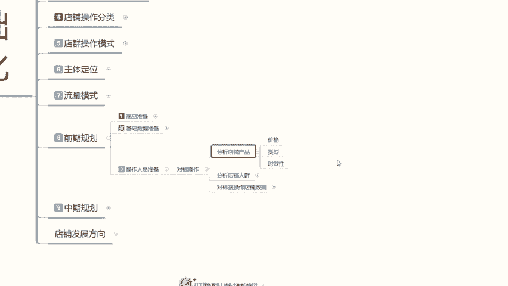

性别、年龄、购买习惯、性格和类呃价格和类型，性别是什么呢？男性女性。年龄是什么呢？14到45或者是55之间的女性，你从中截取了哪一个部分的年龄准备来做你自己的产品宣传？也取1到2个就可以了。

不要过多1到2个以4以4年就是4岁为划分，14到1818到22、22到26，26到3030到3030到38这么去划分，选两个年龄阶段，也就8年的一个范围来操作你的产品年龄。然后购买习惯的话。

我们暂时可以不用管。因为你所找的人员的话，他对小红书可能不熟悉，而且也没有购买习惯。那你这个操作的话，说实话可有可无。你只需要把前面几个点做好就可以。如果说你前面几个点做不好，那你一定要做购买习惯。

就是这个人经常逛小红书，他没有前面这几个类型，你可以把它单独划分购买习惯里面去。

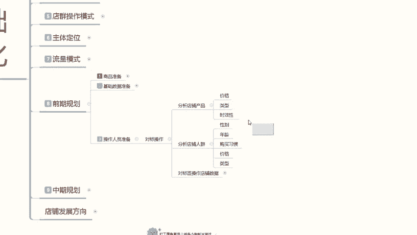

我把颜色给大家标个重点啊。因为这个的话说实话分类的话还是比比较呃准确的。就是说如果说你所找的人，他也经常自己在小红书上面逛，但不是你所商品所对应的一个属性，那你就把控他的消费习惯，懂我意思吧？

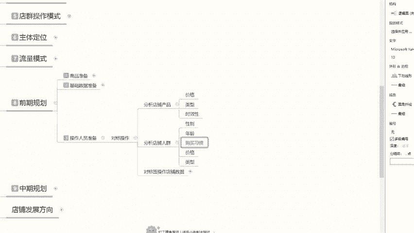

啊，就是你不需要跟他去看价格、类型、时效性、性别年龄，你只看他的消费习惯，他经常购买的是不是你同类型同消费层次的一个产品，或者说偶尔购买他消费习惯没有问题，那就可以直接做。啊。

有这个消费习惯的人就可以直接做，其他的就不用考虑。然后就是价格和类型，价格和类型，包括性别和年龄的话，其实都是在消费习惯里面的。他们四个综合起来，就是购买习惯行为。如果说你所找的老用户。

他已经有购买习惯行为，那你就不用去找限制他的性别年龄价格和类型。如果说他会嗯没有购买习习惯的一个行为，那你就需要限制他的性别年龄价格和购买的一个类型。就这几个点。

然后的话对应的啊分析店铺的一个产品适效性啊，把这几个属性点全部接综合起来，就是你所需要寻找的对标字账号。啊。

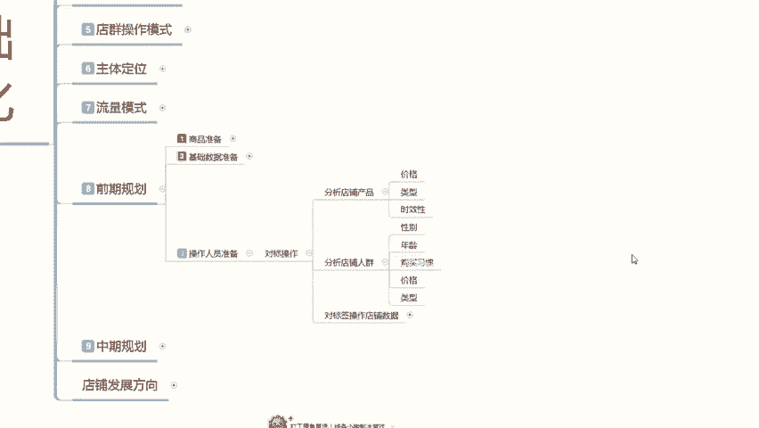

但是呢之前也说过，你实在是没有办法找的话，那你能找到这些人帮你去做一下基础的成交评价的话，其实后续的话我们自己也在想办法去操作也是可以的啊。

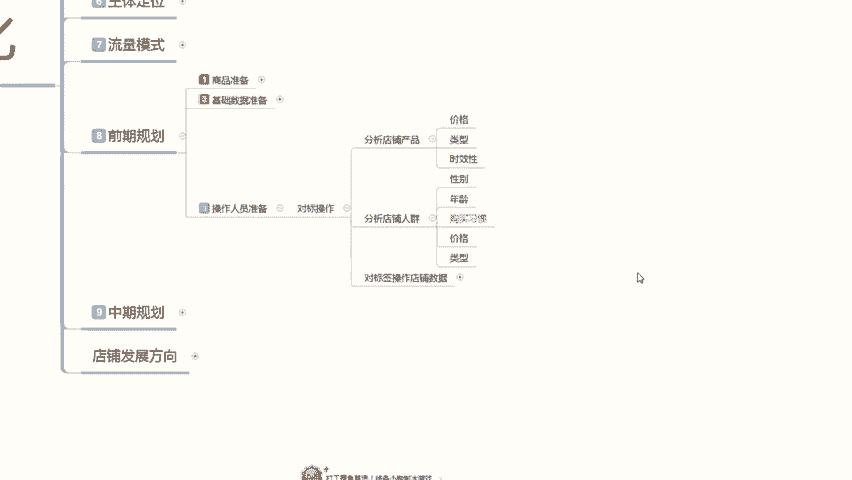

就是说结合分析的数据的话呃。对，怎么说呢？对店铺进行基础创作的同时啊，我们选择对应人群的一个特征来进行店铺优化啊。根据我们产品进行店铺的一个人群优化。这个的话主要是保证我们中后期小红书系统。

它所推荐的对应人群是准确的。提高我们整体的一个转化和喜爱啊，把自己打造成稍微有品的一个姿。一个卖家啊，稍微有品的一个卖家，而不是说无名小做，任何人的话，店铺都比我好，你要给自己树立信心，给自己做宣传。

就从小红书上面开始，这个才是小红书做店的一个核心。当你在小红书上面把自己宣传出去有沟通啊。你后续的所有操作都会比较好做一点啊，而不是说盲目的呃去操作，去整理我们综合这个数据啊之类的。好吧。

这个呢就是小红书的一个操作人员准备，让大家了解啊，你自己这个对标操作能做到的最好做不到的那我们就只能从笔记方面下手，花个7天到半个月把店铺人群拉过来，把自己账号全程做去了啊，然后再找人去做你的技术数据。

数据做完以后的话，你的店就已经开始正常运转。然后你每天要做的就是更新你的笔记，更新你店铺的一个数据。啊，随时观察店铺的一个动向，完成自己的一个任务，就能把自己的店铺做好。好吧。

那这节课呢就给大家分享到这里。下节课的话是本来呢是准备给大家讲解一下中期规划的。但是下节课的话，我会当最后一节课给大家进行分享。因为中期规划的话，它整体内容太大了。你们现在如果说是新手。

你去操作中期规划的话，你只需要了解一下它的大纲就可以。如果说你是在这个阶段卡着不好动弹的。说实话，你们了解一下数据，你们。

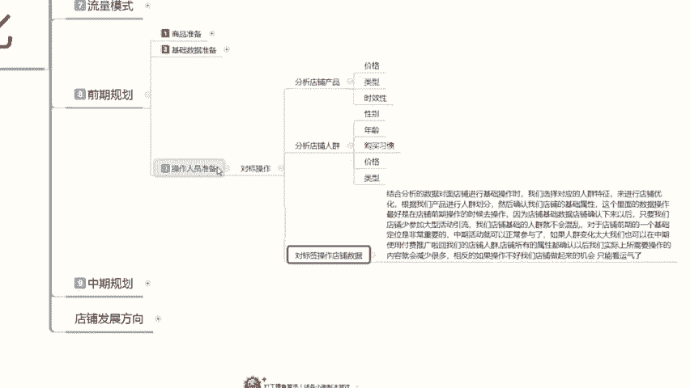

自己去做规划。因为中期规划的话，有些东西可以讲，有些东西不能讲，你明白的自然明白，不明白的啊，我也不是太好跟你们说好吧，那这节课呢分享就到这里。

