# 最系统的小红书无货源电商教程 【2024】最新版小红书运营起号 涨粉小白入门必学的一门新媒体专业版课程 - P16：15、小红书开店-店铺排名优化（销量排名+价格排名+搜索排名） - 三级盔八倍镜 - BV1Pm421p7WS

大家好，今天给大家分享的是小红书基础开店一体化的最后一课啊呃整个账号的话就是说呃开店流程的最后一期呃中期规划，包括后续的一个店铺发展。这个的话只是说给大家做个介绍，我就不详细的进行展开了。因为中期规划。

如果说你要展开的话，他所面临的话，就需要针对到个人店铺去进行讲解。就是说你需要我需要了解你的店铺的类型产品价格销量啊评价自己的店铺的一个走向和趋势，它所需要面临的种类是非常多的。

我不能说是因为根据呃某一个类型去讲，这样的话就和我给大家分享的一个内容的一个初衷啊。

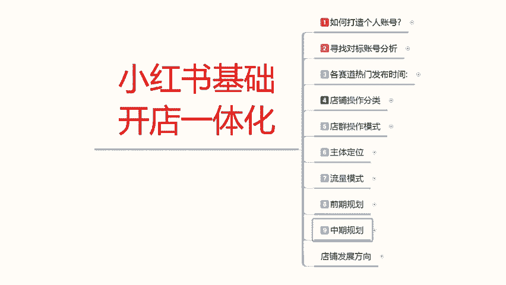

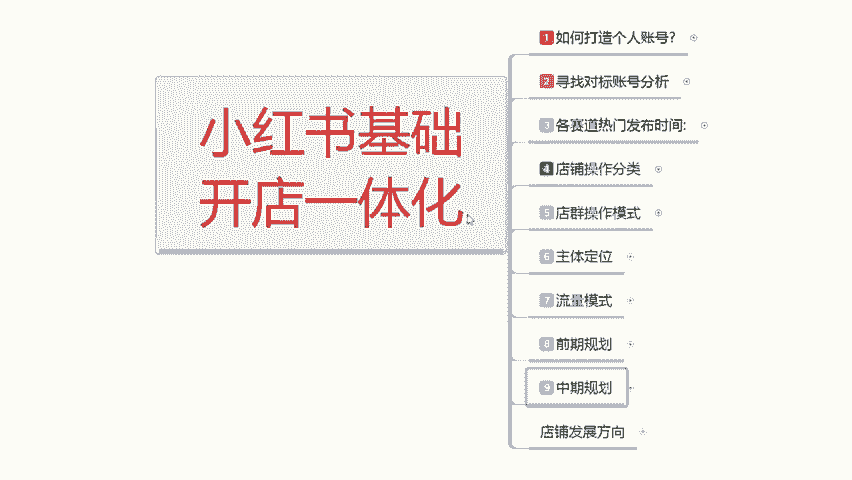

有矛盾了，因为我给大家讲课的时候，我不会针对某一个啊特定的产品去进行分享。我只是说啊把总纲给大家进行的一个分享。我不会针对某些特定的产品特定的内容啊，特定的一个网红引流等等其他模式去习针对的讲解啊。

我都是给大家讲的是你所适用的范围，你都能去操作，好吧。

这节课呢主要是让大家了解一下啊，中期规划我们所需要啊了解。

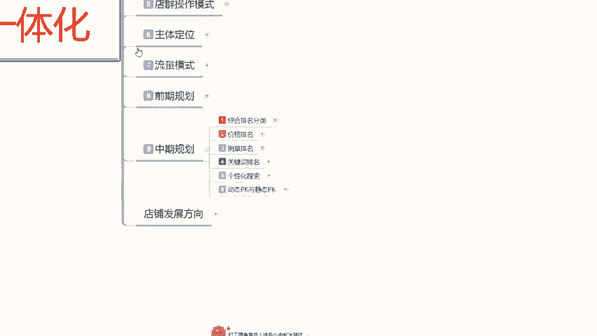

和自身情况对应的一个属性啊，你看看自己哪个方面没有做到位。啊，去参考一下，然后呢，你就知道自己需要去优化做什么地方。你前期的呃这帮朋友，你如果说真想了解小红书的话，中期优化嗯。中期的一个数据规划的话。

对你其实是没有帮助。因为你会越快越看越头大。如果说你做小红书有一段时间以后，你能看懂一部分的那代表你还有进步的空间。如果说你看不懂，那你好好的需要学习一下，好吧。呃，我先给大家讲解一下中期规划的话。

说实话你前期我们把基础做完以后的话，呃，你的技术销量有了，你的店铺排名已经定型了，对吧？你的账号权重也定型了，那你在中我们在操作小红书中期的时候，那你需要需要考虑这6个点。第一个综合排名分类。

第二个价格排名，综合排名分类包括价格排名和下面几个四个四角啊，价格销量关键词和个性发搜索。但是我把他们单独拉出来，是因为这四个点的话，它是比较重要的。综合排名分类的话。

其实这个里面的话可以把它分为12个12项排名。但是另外八项的话它不那么重要。所以说我只给大家列出来了啊，我也不会一步一步去讲。因为如果说一步一步去讲的话，他整体内容太大了，有些人他会听不懂。

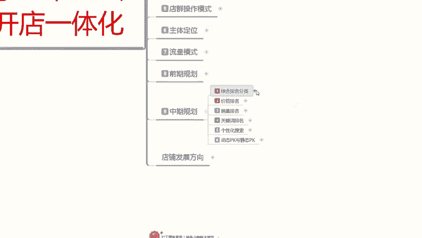

12项分类排名里面的话就是人气销量、信誉价格、下架时间、标题优化、转化率、收藏量、回头客比例、好评率和交易的一个整体比例。然后就是我们自己的一个物流体验和物流服务。这12项它包含你中期规划的所有操作。

都基本上在这个里面。额外还有两个在这个外面的，一个是呃动态PK，一个是个性化搜索。这两个是不包含在综合排名分类里面的啊，他们是针对店铺进行提升的一个操作。啊，这个里面的话主是说让大家看一下。

你们大家自己了解一下你哪个方向没做好啊，就可以。好吧，不做过多的一个讲解。

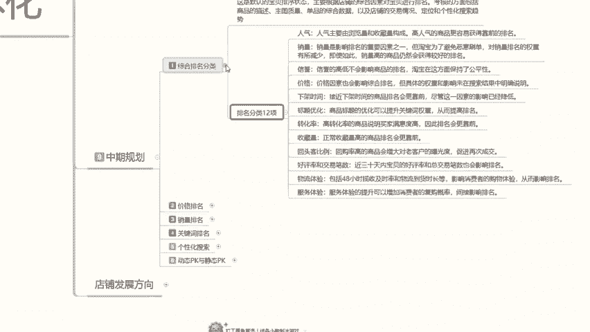

然后是价格排比。价格排名的话，你光讲这一个价格排名，你需要去看价格竞争力、价格真实性、价格稳定性。价格与销量的一个平衡。消费者心理促销活动、价格策略、产品价格设置，这几项综合归了才是价格排名。

而不是单独的啊。所以说我们在去操作小红书的时候，你做搜索做排名。为为什么我前期跟大家说的时候，现在小红书出的那个。购物啊我们不好去做，你光考虑价格排名，就有这么个选项，要你去做。你真要做起来的话。

说实话你不好做啊，你只能说是在小红书有一定基础以后，你自己了解一部分，我再去给你讲解或者针对性的分享，你才能明白其中我需要做怎么去优化。不然的话，你根本不好操作的。

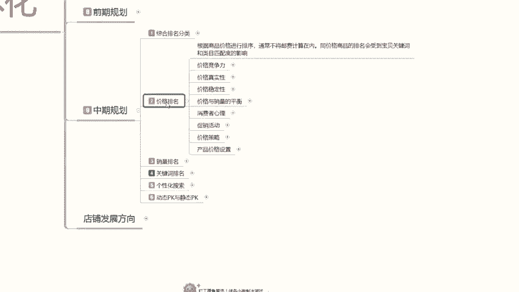

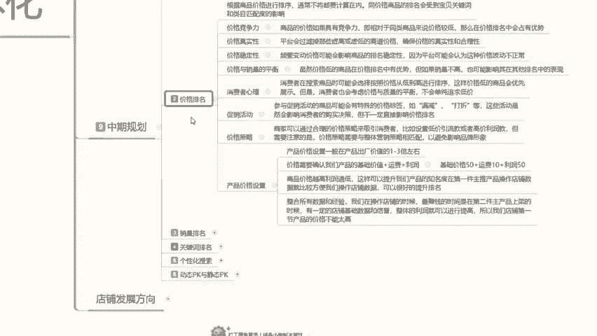

好吧，大家看一看就可以，因为我也不过多的一个展开进行分享。销量排名关键词排名和那个价格排名是一样的啊。

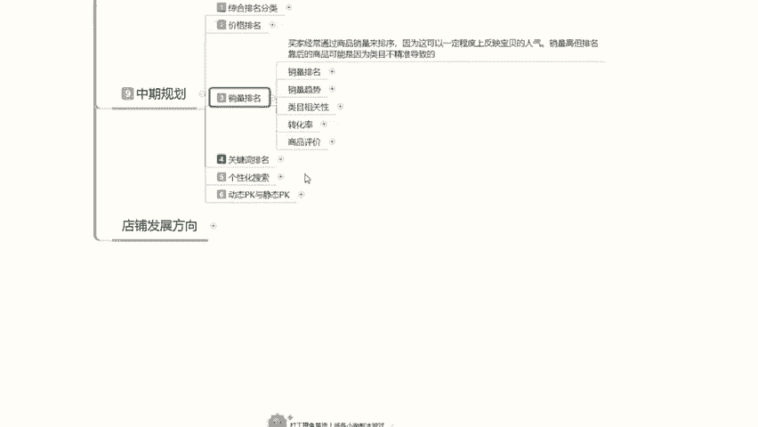

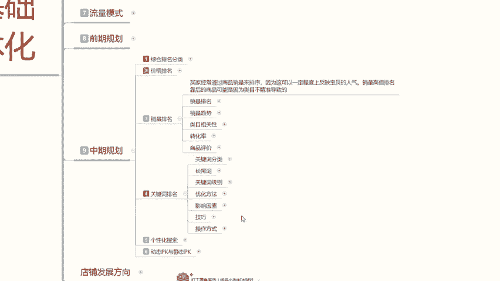

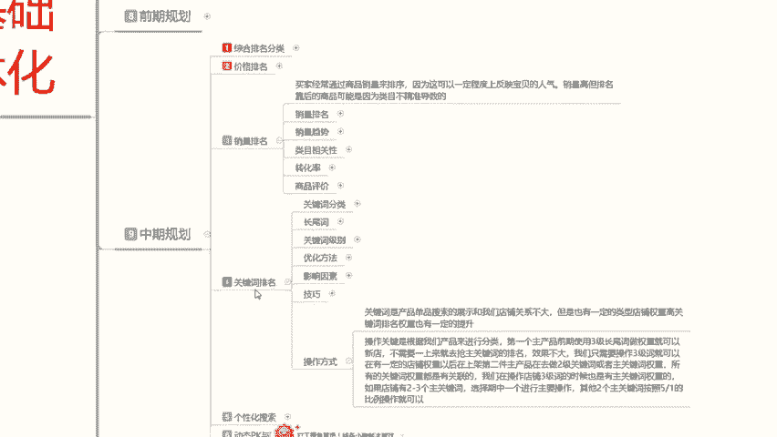

销量排名、销量趋势、内幕相关转化、商品评价关键词分类常为此刻、关键词优化、优化方法、影响因素绩效等等，这些基本上都是。就是说你不要小瞧小红书，它整体一个系统，前期看是非常简单。

但是中期的时候难度是倍增的啊，一个操作思误，那你的店铺数据它就会成反向发展方速。呃，后续呢是个性化搜索和动态PK与静态PK这个的话就不给大家讲了。因为这个的话涉及到对同行针对性的一个操作。呃。

属于算是违违违规的一种方式，但是他会不会被处罚。只是说属于恶意竞争的一种。我在这边的话就不给不做大呃过多的一个讲解给大家分享了。后续店铺的一个发展的话，方向的话其实也是比较简单的啊，就是两个方向。

第一个开心店。第二个加大投入力度。啊，大家不要误会啊，开新店什么意思呢？就说你在小红书里面，这个店铺已经到达中期了，然后后期碰到瓶颈了，不好不好提升。我个人建议的话是你直接去开新店。

按照这个步骤看第二个点，第三个点，第四个点第五个点就是多点操作啊，碰到瓶颈以后，直接这么去操作。因为说实话，你小红书除非说你的产品能全年都卖。啊，除非做你的产品能全年都买。

你可以压人投入其他产品记极性比较强的啊，你打同样类型的一个账号权重。把它做成分店，然后去卖效果会比多点要好哦。效果会比单店多品要好啊。如果说你是全年都可以卖的一个产品，那你就直接加大。投入第一度。

然后的话去做我们中期的一个排名。就可以了啊，数据分析、店铺分析、数据掌控、店铺优化数据维护啊，进行突破，了解这几个点就可以了。如果说。你觉得头太大的话，没有必要的话，那你就开心点。啊。

因为你第一套流程的话已经全部熟悉了。那你后续开新店的话，就是首到擒待。啊，自己知道怎么操作，自己知道怎么规划，就是投入的经率可能会稍微多一点。就是这两个方向的话，就看我们自己大家自己怎么去选，好吧。

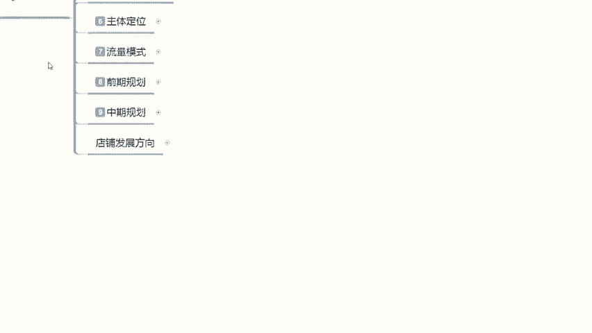

那本期的课程呢，小红书基础开店一体化的整套课程呢就给大家分享到这。呃，后续呢我再会出几个其他的一个内容选项，包括我们小红书一流，我会单独做一期小红书网红，我也会单独做一期。好吧。

那这期的课程呢就会分享到这里。

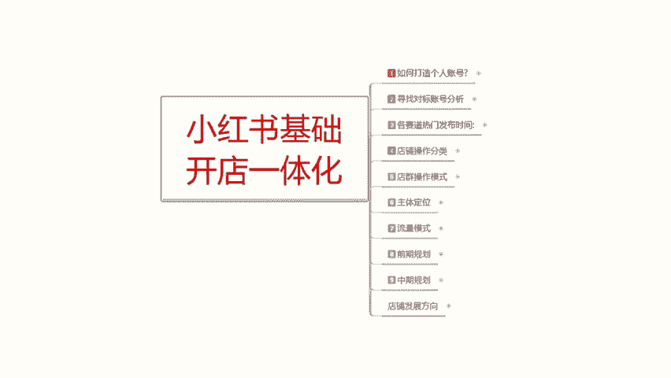