# 最系统的小红书无货源电商教程 【2024】最新版小红书运营起号 涨粉小白入门必学的一门新媒体专业版课程 - P1：6月25日1346 - 萝卜头不会整活 - BV17y411q76D

🎼，🎼说一个利润大道吓人的小生意啊，不是很体面，但是呢很赚钱啊。2024年的马上就要到了大家接下来几个月要多赚1到3万块钱的话，那一定要把我下面说的这个行业呢去做起来啊，好吧，而且呢都是风口啊。

就算做不好呢，你好好听一下，也可以养一下自己的商业嗅觉啊。大家呢要记住，就是所有的富人他跨越阶级，都是因为踩中了风口。所以说呢你只要顺着风口去干啊。

哪怕说你只干个几年都很有可能赚到普通人一辈子的工资的钱啊。那所以说接下来5年呢有哪些方向会成为风口呢？那跟大家说一个词啊叫做自由职业者，就是呢现在一个新的趋势啊。

意思就是说呢哪怕你在家里你都能够做到一个养家糊口的生意啊，只需要一部手机或者是说一台电脑，每天呢花上2到3个小时的碎片化。🎼间你就可以赚到钱，算是一个小成本的项目啊，它的市场需求性强，客户粘性高啊。

最重要的呢是一个零成本的运营模式啊，不需要店铺装修和人员工资。对这些高昂的硬性条件啊。那么我现在呢就把这个步骤一五1十的分享给大家。那么首先呢我们只需要打开我们的一个小红书。

然后点击我的选择右下角的一个三个杠。我们找到这个创作中心。然后呢，这里面有一个点击更多服务。我们点击什么呢？点击这个开通店铺，这里有个新人开店权益，咱们可以零粉就能开通，点击这个立即开店。然后呢。

咱们选择选择个人店，因为咱们只需要上传咱们的身份证就可以去开店了，而且不需要一个营业执照的，明白吗？点击下一步。然后呢这里面有很多选项，咱们选择电商商品，然后点击经营类目。这的话呢。

我个人建议你们选母婴用品了。因为呢小红书的用户群体呢，女性偏多，所以说咱们使用女母婴用品。然后呢咱们这边用这个家居确认。😊，OK这边是让我们咱们就先交1000块钱的保证金，咱们这边呢可以先先不交。

咱们可以后期赚到钱之后，再去交这个保证金，也是没有任何问题的，明白吗？好，紧接着下一步。😊，然后呢，只需要上传我们的一个身份证就可以了，明白吗？然后们点击点击提交就可以了。那提交完之后呢。

咱们还要去给他去上架一个产品，咱们点击这个卖手合作，咱们剪辑笔记选品。找到我们需要卖的一个商品，因为咱们用的是母婴母婴。在这里面呢找的这种佣金比例比较多的一个产品，咱们可以随便找一个。

比如说咱们这个纸巾。😊，然后点击选品就可以了。选完品之后呢，咱们去发布笔记头给它挂上就可以了。后续咱们去发布咱们母婴的一个视频之后呢，咱们点击这个轩添加商品，点击这个我们刚刚选的这个佣金为R的一个纸巾。

😊，🎼然后点击下一步，然后咱们点进去发布视频，这时候有播放，比如员下单，就容有一份收益，明白吗？呃，那实操呢到这里就结束了。那么只要有用户刷到我们这个视频，从我们所挂的链接里你去下单啊。

你在后台呢就有佣金赚了。那一单呢，你赚个三五块钱啊，10百单，你就赚个三五百块。那如果说一个月你每天都坚持去发的话，哪怕说你只要报一个视频报一万单，你一个月呢也能够有三五万的一个利润啊。

哪怕说你视频都不报啊。那么呢也会有几条数据还可以的，一个月呢搞个几千块钱的零花钱也是不难的。所以说呢大家一定要把视频保收藏保存下来啊，然后呢赶紧照着去行动起来。那么具体的一个操作流程呢。

我已经整理了一份详细的资料啊。那如果说有朋友需要的话呢，那就在评论区。🎼评论3个6或者是学习。Yeah。大家进入课堂啊，然后我们现在开始的话就进行我们今天这个课程，欢迎大家啊。然后据我了解啊。

我们今天课堂有来自于不同这个平台的这个同学，然后有了解小红书有不了解的，是不是啊，有在这个什么B站啊抖音啊啊知道听说小红书，现在有这个挣钱的项目，但是可能具体怎么来操作，不是很清楚啊。

大家现在有没有这个小红书的账号，或者说你们平时会不会用小红书会用吗？自己平时有没有用。😊，啊，有会使用，对不对？啊？我先跟大家讲一点啊，因为如果说我们现在要去选择一个互联网的这个行业去变现。

大部分人会想，哎，好像这个抖音比较挣钱，对不对啊好有用啊，但不知道怎么挣钱，没关系啊，很多人下意识会想说是这个抖音的这个平台啊，那事实上啊，抖音它现在已经处在一个饱和期了啊，就是因为做的人太多了啊。

在这个平台去变现，然后想要在这个平台赚钱人有点太多了市场是已经溢出来了啊，那么所以说小红说他其实也看看中了这个抖音这样的一个变现模式是吧？以前抖音哪有这个什么带货，哪有什么直播都没有啊。

以前我看到是美女在那PK呀，在那跳舞啊，是这这些内容，然后包括刷视频看到也是娱乐等等啊，但是自从抖音开了这个直播带货之后，开了这个橱窗带货以后啊，它相当于说把我们中国传统电商的啊。

这个市场已经做到了一个瓜分。就比如说呢之前我们习惯性在。😊，淘宝买东西啊，在什么京东买东西，现在更多我们会下意识觉得好像抖音上更便宜，对不对？好，那么呃小红书它的一个模式其实跟抖音有点类似。

它也是一个社交平台，也是一个分享作品的平台。但是小红书的区别在于它不是说那种大批量的视频，而是小红书更多是以图文的这个方式来进行。但是你想啊作为一个社交平台来讲，就是作为小红书来讲。

它如果说一直走这个图文的方式，它不挣钱。😊，对吧平台不赚钱啊，所以说他开始呢想要去借鉴啊这个抖音的一个代货模式，也想做出一个社交的带货平台，社交电商平台。那么所以说今天咱们才有这节课啊。

因为小红书给大家提供了一个这个创业的机会。我不知道大家有没有关注到这个在春节联欢晚会的时候啊，有第一个小品，当时上场的第一个小品。😊，在那里面出现了一个小红书的logo啊，我们以前看这个春晚。

基本上没什么广告吧，对不对？今年啊小红书直接把广告打到哪里去了，打到春晚去了啊，直接一个抱枕最显眼的红色的抱枕在这里，所以说它下血本了啊，那么我跟大家讲这个意味着什么啊，我们今天为什么会有这么一节课。

因为小红书即将迎来它的流量爆发期。第一，小红书自己花钱花巨资啊，再给自己的平台打广告，在疯狂的引流。那么同时如果说未来我们在小红书的平台去开店铺也好啊，还是说我们去做一个商业账号去打广告也好。

那么我们会直接获得平台给予我们的免费流量啊，就是你不用说像做抖音一样，我还要抖抖家，对吧？我还得花钱，在小红书我们去做账号的话，现在我们是可以完全封闭不掏，获得流量去挣取收益的。

然后今天我会详细跟大家讲几个玩法啊，来给大家看一下一个的是。😊，是我们怎么样来快速的去涨粉？因为目前我们是处在一个零粉丝的一个状态，对不对？😊，来这是第一个啊。第二个呢，怎么样去制作这个爆款的作品。

因为既然我们想要在小红书平台去赚钱？首先你的作品得有人看我得有粉丝是吧？有人能看到我的作品，那么才能达到引流的一个效果啊。那么第三个如何打造值钱的这个商业账号，就是我的这个号，如果说有粉丝了有播放量了。

我怎么把这些粉丝去变现变成钱啊，让他们来买我的产品，或者说呢我通过接广告我来挣钱啊，那以及呢我们今天也会讲到一个很重要的，我在不掏钱的情况下，对吧？不花钱啊，然后呢并且呢我没有产品啊，我没有货源。

在这种情况下，我们怎么样在不投资的这个情况下，我们去获得回报啊，这是小红书这个平台目前能够做到的。那今天这节课的话呢，就是由我全程来跟大家讲一下我们整个平台它的一个玩法啊。那么我叫小南。

我做互联网的这个时间算比较长啊，15年开始做过淘宝然后包括16年开始呢，我们又接触了很多跨境项目，像什么虾皮呀酷胖。😊，啊速卖通啊，然后包括呢像亚马逊啊等等啊。

18年我们也是最早一批在国内抖音做视频带货的商家。然后我今天主要跟大家讲的几个方向，也是我们不用去直播啊，就是你自己自己不用真人出镜后另外呢我们不用说去拍摄自己的生活呀。

然后不用说自己原创去做这个素材一样可以挣钱的一些玩法那现在我们先来介绍一下这个小书平台到底是什么啊来我们有很多同学可能一进来云里雾里的。咱们现在在讲的是什么呢。

讲的是这个小红书平台的变现玩法也许这个平台有点冷门。有同学可能进来之后，连这个平台是什么都没听过啊没关系我们先了解一下啊。

小红说现在它其实是一个集合了所有的年轻人的这样的一个平台啊我们现在已经有一个根深蒂固的感受，就是我如果说想买个什么东西，我会下意识打开小红书先搜一下。比如说我要买口红，对吧？

我不知道我这个白皮适么黄皮适么小红书搜索一下我要出去旅游，我也不是问一下当地人说哪里好玩什么东西好吃啊。😊，我这小说搜的吧，武汉啊这个哪个地方景点，江汉路怎么怎么样啊，对吧？什么东西好吃啊，然后去搜。

😊，在小红书能直接给你答案。包括我今天我想买一个什么筋膜枪啊，我想买个按摩仪，人家小红书里面能够很全面的给你把所有的这个品牌的介绍都给你写清楚。来，我们看一下啊，我直接打开这个小红书的界面来。

我们搜索一下这种，你看一下。😊，对吧我直接搜索一个什么美容仪。他的内容做的是很精细的啊。来，咱们可以看一下啊，在这里面的话，它有很多这种专业的产品的分析来看到没有？对不对？就这种啊。

很多个产品给你罗列在一块儿，然后给你做分析非常专业。那所以说这个平台做的一个流量背书，做的很好啊，它里面针对性的客群是有很多的就是想要购物的客户，它是居多的那所以说我们之后去做这个账号的机会也会比较大。

再一个跟大家讲一下小红书它的一个发展历程啊，就是在最早之前，小红书其实它是一个没有变现能力的平台，就是我们以前刷小红书，发现里面可多炫富的了。😊，有没有什么香奈儿的包啊，怎么去买啊，哪个款是当下的爆款。

什么情人节限定是吧？然后包括呢买这个爱马仕的铂金包，你需要配货10万还是20个W啊，以前讲的是这些东西，名媛的下午茶啊，这个星空顶的豪车，对吧？以前是刷的是这些东西啊。

但是这个大牌是不可能说在小红书去开旗舰店的啊，所以说慢慢转型，到后来呢这个卖点什么化妆品啊啊，卖点这个护肤品啊啊，然后再到呢后来跟各种服装品牌去合作啊，再到现在什么花西子啊，完美花西子啊完美日记啊。

这个几10块钱的产品也开始出现在这个平台。所以说现在小红书它其实主打的一个方向啊，就是去做带货那么所以说今天我们也会来教一下大家，我们怎么样来做这个模式啊。

我跟大家简单先说一下这个百万买手计划是什么意思。为什么我前面在开课的时候，我就跟大家强调，我说现在是做小红书的黄金时间，对不对？黄金三个月啊，就从现在起往后数三个月时间，现在。😊。

平台直接给咱们免费上流的一个时候，为什么来我们看一下啊，他们这个CEO发布了这个新闻发布会，讲到了这么一个玩法，叫百万买手计划。😊，就是他们现在在大力的招募，有创业能力的人，有开店能力的人啊。

有电商经验的人来到小红书去开店去卖产品。不管我们的货有没有品牌无所谓啊，就是能够开店能够去成交，那么就可以。为什么来现在小红书要靠这一个玩法去翻身。我举个很简单例子啊。

如果未来我们的店铺成交金额达到1万块钱，对不对？我卖了一万的货。😡，那么平台能不能从我们手里抽成呢？可以，他会获得5%的手续费服务费啊，相当于说你需要交钱给他是多少钱呢？500块直接从你手里扣走啊。

不会问你同不同意，看到没有？那如果说我们成交的是10万元，对不对？他直接能够从咱们手里啊获得5000元的分成，那同学们，这个钱是不是挺多的，是吧？这就是小红书啊，他未来走的一个方向？😡。

你开店卖货卖的越多，你给平台创造的价值越多。那么他从你身上捞到油水越多，他给你的支持就越多啊，这就是小红书现在跟我们所有的达人合作共赢的一个方式。😡，那么今天我们就算是个小白，我啥都不懂。

只要你把这个店开起来，我们把产品上上去，把作品发起来啊，赚钱是很容易的，基本上7到15天左右是没有问题的啊，这个是一个百万买手计划。你看之前我们在小红书，你要买个东西很麻烦的对吧？我还得去搜啊。

说这个你好链接有没有求个链接，这个群子很漂亮啊，你还得到淘宝上去下单，是不是作为商家来讲，作为卖家来讲很亏的。作为作为小红书来讲很亏的，明明是我自己平台引流的，我花钱来的，买来流量啊。

结果跑到淘宝去买东西，钱被淘宝挣走了，对不对？那现在不一样啊，现在那个玩法什么样的来我放这个大图给大家看一下啊。😊，很方便，它的模式跟抖音几乎没有区别。就好比说今天我们看了这样的一个作品。

一个卖手机壳的，但是小红书算很委婉啊，我们可以看一下，就这个卖手机壳的一个作品他怎么写的，他不会告诉你，像抖音一样，我告诉你，今天我这个产品9。9块包邮，买一个再送一个啊，赶紧进入直播间抢购。

没有这种他是什么嗯，来你看炫耀一下新买的，他们就是手机壳，对吧？呃，是不是他真的是他买的，不是我们通常会被这个标题引进来，对吧？好像哦你真的在给我推荐一个好用的一个东西，实际上人家自己就是老板。😡。

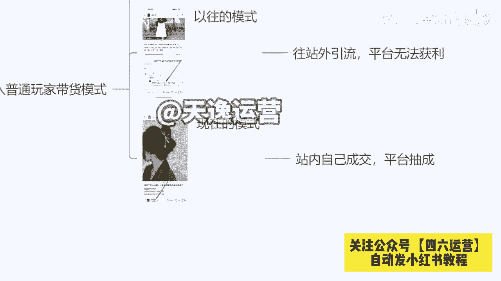

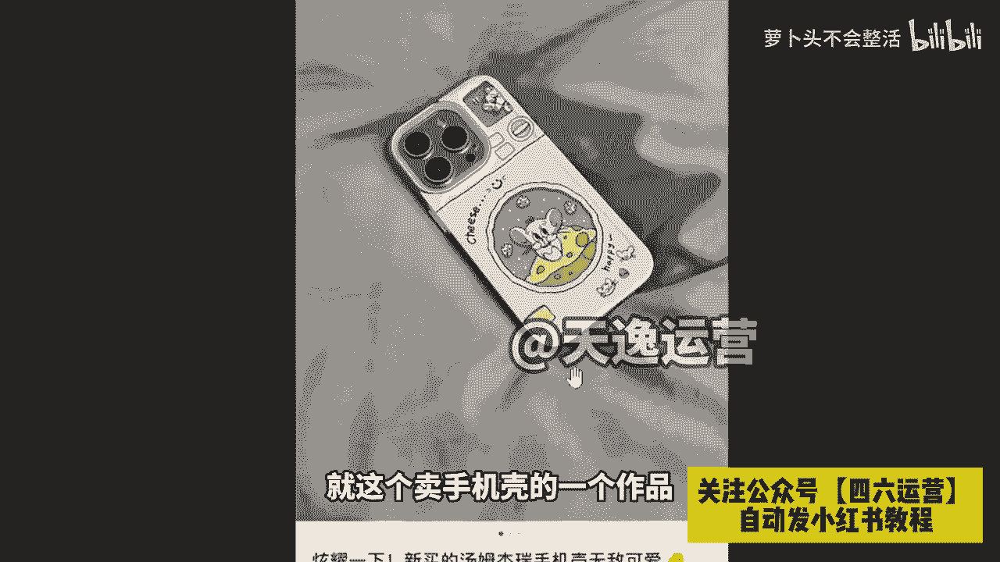

啊，他写文案，把你先圈进来这个小套路，对吧？然后在左下角告诉你啊，购买同款直接点这个通道可以进入，它就跟抖音的小黄车是一样的道理啊。然后进入到这个界面以后，来，你们自己看这个界面熟不熟悉。

小红书的购买通道是不是跟抖音它是一模一样的。😡，对吧没有任何区别，一模一样的啊。来这里已售出产品价格等等，对吧？下面加入购物车立即购买都是一样的。😡，那么用户呢就可以直接下单，直接购买了。

那么但是啊小红书的产品通常比其他平台其实要更贵一点啊，但是用户并不会有这个想法，并不会因为价格高，哎，他就不买了等等啊。😊。

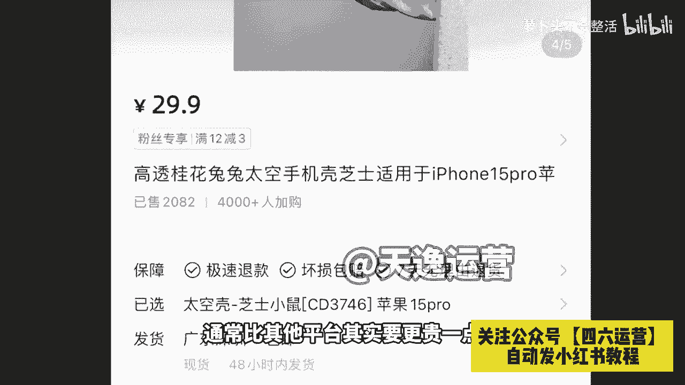

刚才其实我们也讲到了这个说到了一个抖音的这个玩法啊，抖音的这个方式。就是我其实说实话不太建议大家在做抖音。因为我们像自己团队来讲的话，我们去年做抖音200多号人，去年年初的时候还有200多号人。

然后我们缩减到80个左右啊，因为它投产比越来越低了，就是相当于说如果你去做抖音，你不投钱的情况下没有回报。而且抖音现在限流很重很严重啊。因为它的市场饱和的原因，太多人做橱窗带货了。

导致呢如果说你是个新号，或者说你的作品质量不是很高，不是原创内容。那么你挂了车就被限流。😊，挂了车就被限流，因为太多了啊，对吧？但是小红书恰恰相反，你不挂车反而没流量，你挂了车平台直接康给你上流量啊。

这就区别。因为平台要靠你给他挣钱啊，要靠你给他挣钱。现在小红书做人很少啊。你今天比如说是今天我们听课的很多同学都不了解小红书，在大街上随便拉个轮问一下自己亲戚朋友了不了解他，很多人不知道的对吧？

那一个平台知道人越少，机会越大，是不是另外啊小红书我们去做的话呢，要相当相较于来讲更简单一点点。我们可以看一下他的一个素材啊，呃，我们拿抖音那来对比一下，就说因为我们今天听课的时候。

有同学也讲说老师会不会很难呢，对吧？我做小红书这个作品当中我怎么去做呀，会不会很复杂呀等等啊。同样的一个产品，我们可以比较一下。啊，然后这个视频的话是一个卖完红的一个卧蚕比啊，一个美妆的一个产品。

如果今天我们在短视频平台去做一个账号，你也许要达到这个效果。😡。

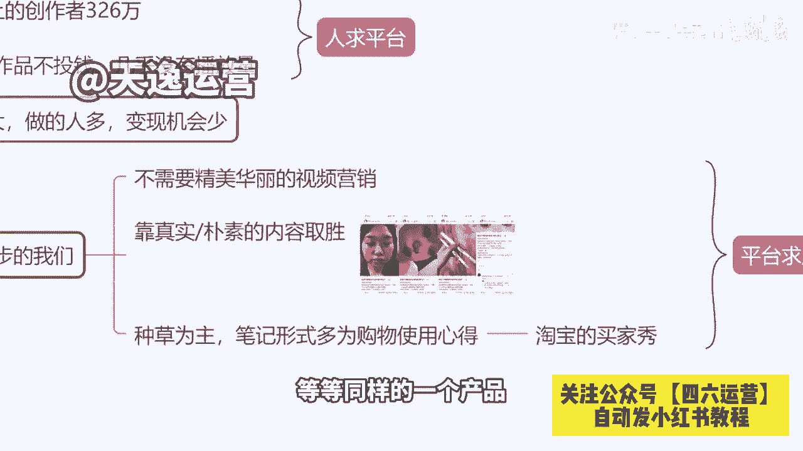

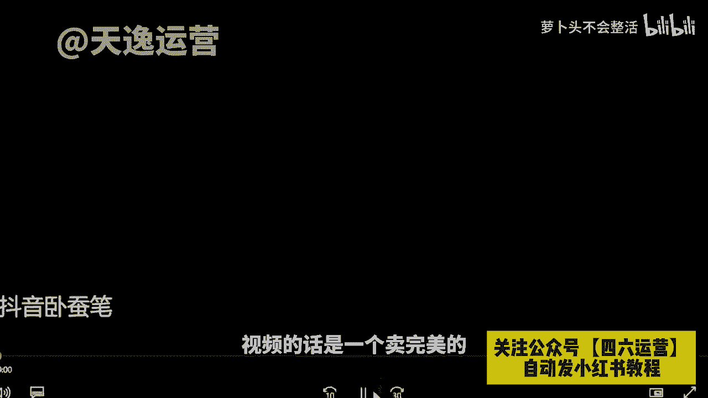

🎼才能把作品才能把产品卖的出去。来，我们看一下啊，哪，这哪里是在画卧蚕，简直是在徒手捏卧蚕一笔两笔，三笔4笔，无论多少笔都不会手中不会化脏，再用另一头的提量轻轻化几下卧蚕就起来了。大家看到没有？

这种是短视频平台，她的一个特点啊。因为人家要在两三秒之内，我必须拿个美女吸引到你如果说我第一秒我在抖音看到是个普通的女孩的这个脸可能我划走了对吧？我不感兴趣，因为美女太多了，就这个作品啊。

她实际上的一个带货能力不是很好，在抖音里面一个月才卖了500多个订单，卖了500多个订单，为什么呢？因为作为消费者来讲，如果说我看到一个这么漂亮的女孩啊，我会被你吸引，但是我可能不会有下单的一个冲动。

因为我觉得你本来就好看，对吧？你用完这个产品好看是应该的啊，但是我这么普通，我用完你的产品能有这个效果嘛，对吧？这是作为消费者的一个想法啊，所以说她在抖音虽然说播放量高，但是带货效果不是很强。

如果你们要做一个这样的作品，你最起码投入一个视频找模特。😊，找代拍800到1000块钱肯定是要的对吧？但是我们看一下啊，在小红书完全不一样。其实小红书平台它的一个性质是属于哪种呢？就是高端的。😊。

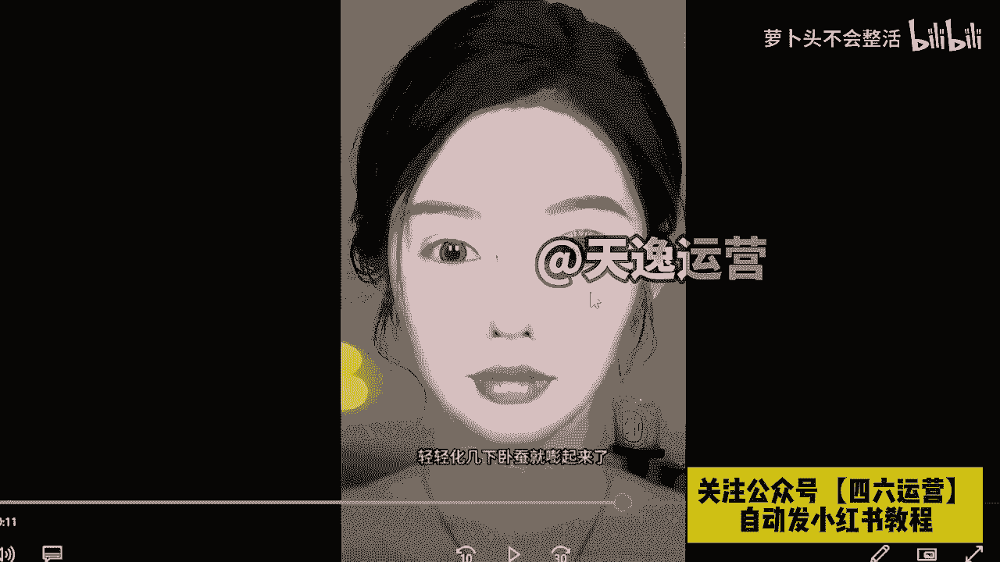

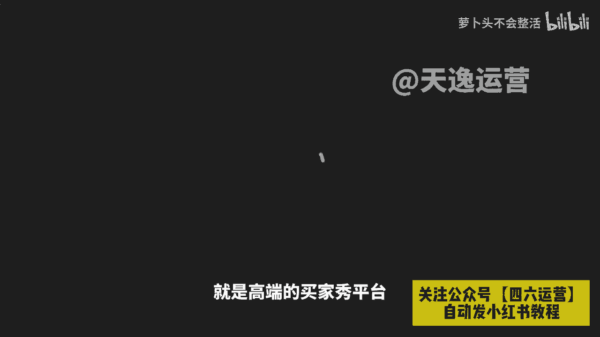

买家秀平台啊，更高端的买家秀平台。来，我们看一下啊，这个是在小红书平台一个月卖了3000多个订单的一个作品。有没有发现她的这个女孩其实很普通，是不是？😡，再想我说你要放一个特别美女的。

特别漂亮的一个美女啊，反而可能点击力还不如这个。😊，啊，因为大部分的这个女生是想要去变美的啊，想要去改变的。那么她看到这个图之后，对第一感觉很真实是吧？我们这个二建中心说了很真实的感觉。第二张图一看啊。

画完中之后变化确实很大。😊，那我对你这个产品有兴趣，我觉得可能我画完也有这个效果，是不是？那你看几张图片，加上一个标题，加上一小段文字，效果很好。😡。

小红书里面他没有说抖音那种几十万几千万这种点赞的一个效果啊，3000多赞1000多收藏算是非常非常理想的这样的一个作品效果了啊，那么我们未来去做小红书也是一样的。我们有图片的素材，加上取一个好的标题。

加上一段对产品真正的描述，那么我们就可以达到一个带货的效果。你即使说我不会视频剪辑，那也一样是可以的。另外小红书平台现在很缺人啊。所以说我们去做的话呢，相当于说你的第一个竞争比较小啊，竞争比较小。

另外呢我们的几会比较大。😡，当然在这里也给大家解释一下什么叫做接广告挣钱的对吧？我又不是网红，又不是明星。老师，你跟我讲这个接广告它现实吗？来，我们看这里啊，今天我们主要会讲的两个玩法。

一个叫做商业合作，一个叫做我们的这个开店带货。😡，那么第一个商业合作啥意思呢？我不需要你有10万20万啊，我不需要你有什么知名度，你只需要有1000个粉丝。好，来大家说我在零粉丝，我没粉丝啊。

待会上课我教大家怎么去涨粉啊，教你们怎么涨到1000粉来，当我们达到1000粉丝的时候，我们也能接广告，但是咱们接的广告不是10万20万的，我举个很简单例子啊。

你今天不是接什么海蓝之谜SKwo香奈儿的广告啊，好比说有一个牙膏的品牌叫蓝天牌牙膏，我从来没听过不知名的品牌小品牌，对吧？那现在他想要打开自己的知名度，想让更多人认识到自己的品品牌，他是花20万。

找一个网红给大家做宣传。还是说我这样我就我就找那些000来个粉丝的博主。😡，我每个人给你300块钱，我能找100个人给我发，每人我就给你300块啊，因为反正你粉丝不多，对吧？我就给你300，你也愿意发。

然后呢，你去帮我宣传一下我的牙膏，一人我给300100个人去发。那这个时候用户每天登录到小红书一打开兰天牌牙膏，一打开兰天牌牙膏，哪个更划算？😡，同学们哪个更划算。

但是我觉得三00是很低很低单价的一个价格啊。随着我们粉丝的增长，2000粉3000粉4000粉，不同的粉丝阶段价格是不一样的。305071000。😊，递增的啊。

跟我们的粉丝数量是有关系的那这个就是我们可以去接的广告，有好几个品牌是这么起来的。像那个呃这个来芬那个吹风机啊，现在抖音上很火，也是这么推起来的还有呢这个像那个叫什么WIS的一个面膜，对吧？

这些东西都是这么推来的啊，它实际上本身没有多少市场份额，都是靠推广的人越多，把这个知密度打起来了。来，这个就是我们今天可以去做的一个方向啊，我给你们看一下啊。

就这个东西我们实实在在拿这个后台给大家去瞧一下啊，你看一下像这个我看这个账号3000多粉丝来，这是我们一个，我看一下这个同学什么情况啊啊。

在物流公司上班的一个同学他是做了40多天的一个账号在小说现涨粉很快啊，然后你们看一下。😊，3000多的一个粉丝对不对？3345个粉丝数啊，素人是不是没有签约任何公司未签约啊。

江苏扬州的一个地区的一个同学啊，然后他的报价就是他这一条广告240。😡，240啊，然后因为他的这里面的这个作品的话，他是这么想的，本身我跟他讲报价，你报3300是完全可以的。他说想打价格战。

他就想自己报的便宜点啊。这个商家呢优先找他。所以说你看啊人家是一共接了就两个月以来，因为他没做多久，一共才做40多天，两个月以来接了44条，44乘以240块钱的话，大概是什么样的一个收益。

今天我讲的这个玩法是真正落地，就是你们也能做的是2041条，对吧？这个价格啊，1万块钱左右，两个月以来。😊，啊，如果说是之前做，不会说挣钱那么快啊，但是因为现在是流量风口，平台的单子多。

然后平台的广告多，所以说机会多。然后这个是一个，包括像这个你看1500多粉丝的啊，这个同学是才做一个多月时间。辽宁沈阳素人，你看也是现在黄金时期做号，对吧？

外签约任何公司都是普通人直接咱们这可以看得到的啊，报价是300，这个比较实在，想多挣一点的对吧？接了29条来29乘300。😊。

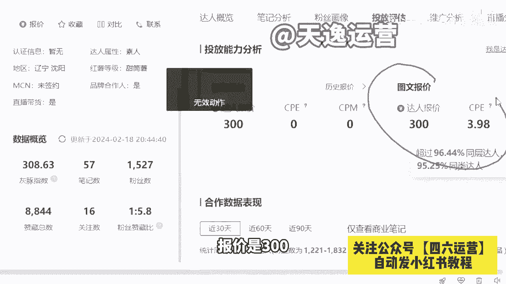

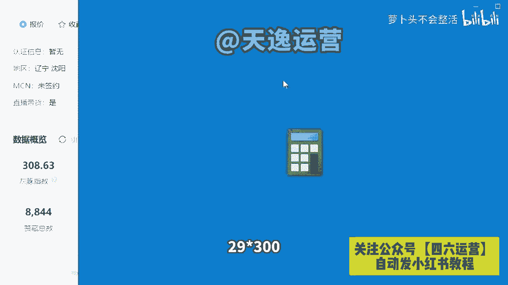

29乘300多少钱啊，差不多在8000块钱左右，是不是？那这个钱大家想不想挣这个钱想不想挣？对这个对这个项目感不感兴趣？感兴趣的话，一会儿我们在下面讲啊，我们在下个环节就来教大家怎么去做这个商单。

我们去讲这个玩法，这是一个啊，然后这是我们今天会讲的第一个，他是有门槛必须1000粉丝啊，然后怎么去涨粉，一会说第二个玩法的话，是我们去开店。刚才我们有个同学叫彩华，好像啊，他说老师我们有货怎么办。

我们今天要教大家这个玩法。第一个你说我们有粉丝啊，没关系啊，开店是不需要粉丝的。😊，开店是不需要粉丝领粉丝就可以啊，领粉丝就行。然后另外呢，因为现在平台它是有一个百万的一个买手扶持计划。

只要我们开了店铺，平台，自己会主动给咱们推流量。那么你先开店，然后再去发作品，你的作品直接流量，会比不开店的账号流量要更大，完全不用担心播放量的问题啊，这是第一个那么领粉丝我们就可以开店了，对不对？

另外啊，我没有钱去拿货，没有钱进货怎么办？不需要啊，我们可以做代发，可以做无货源项目。就是我们去合作找产品找到商家之后，由商家直接帮我们发货，你只需要把他的产品挂在你的店铺就行了。找人发货啊。

你把他的产品放到你的店铺，相当于说代发的形式。这个我们在后面也具体来讲啊，因为现在做店铺流量真的是非常夸张给大家看一下，这个是我们之前呃在这个中信银行做销售经理，就推销信用卡的。然后他当时在做的时候。

其实。😊，不算是最好的时机啊，因为这个是年前开始做的一个账号，他当时扶持不算多，他是在这几个月开始这个店铺才慢慢起来的啊。然后你们可以看一下，他那个时候的一个单日支付金额，4554元。

就是一天的这个不是一个月啊，这是一天然后呢昨日全天8000多的一个成交金额。我们算他50%利润来讲，最起码是2000块钱左右的一个利润，对不对啊，所以大家做三个月的话呢。

现在店铺单月的一个销销售额是10万左右了啊，达到10万级别的一个店铺了啊。你们到时候如果说去开店铺的话，因为有这个百万买手计划，达到10万销售额，平台直接给你发现金奖励。

达到20万30万50万一样的平台直接现金奖励给大家啊。那我们如果说对这些感兴趣的话，具体怎么来操作，我们现在来讲啊。好，我们有赵一慧同学说我发布的很少点击率几乎没人。一会我来给大家分析啊。

我们现在作为没有粉丝，纯小白什么都不会该怎么做。😊，🎼Yeah。我接下来把没有流量，没有播放量，包括像甚至有同学说老师我自己也去申请店铺了。但是我那个店铺开下来，我店铺连人都不进啊，一天几十个流量的。

特别可怕的啊，不知道该怎么办了，对吧？我一会儿跟你们来分析啊，一会儿来给大家解决，我们先讲第一个发布视频前的准备啊，我们先把这个注册账号的问题说了，我前面讲过了，小红书上春晚了。

他现在已经是让全国的人民在下载小红书去使用小红书再打这个广告了。那么我跟大家讲，不仅是你们啊，现在绝对有很多公司很多电商公司都瞄准了小红书这个风口了。想要去批量注册账号了。那么所以说我建议大家。

如果你想在这个平台多挣钱啊，你可以去联系你的父母，把父母的账号都拿来一起用，有亲戚的拿过来一起用。你不要说我只做一个号，做一个号收入有限啊，你多做号，收入是叠加的。所以说趁这个黄金时间。

赶紧把账号做起来，就跟抖音当时。😡，一样啊，做的早的呃，是吧，草根都挣钱了，做的晚的你再厉害，没有办法竞争太大了，蛋糕就那么多。😡，啊，不管你是男性还是女性，都是OK的啊。来，那么我建议大家。

我们如果说还没有注册账号的，先暂时不要实名。为什么？我跟大家说一下，有一点你们必须要接受。所以说我们在做小红书的时候，它的起号是有概率的。比如说你注册了5个账号，对不对？😡，嗯。我就我就不算他5个账号。

比如说我第一个账号啊，我就一个账号，然后你这个账号是不是百分百能挣钱，不不一定你这个作品也许发的很好很优质，但就是没有流量，那怎么办？这个号可以不要了。如果我们等了两天三天播放量没有起色，直接注销啊。

拿你这个手机号，隔天再注册一个新的账号。😡，你也许你不断的注销，再注册，不断注销再注册差不多最多啊就5个左右，你肯定是能测出一个有流量的一个账号的，明白吧？因为这个东西是有概率问题的。

现在注册小数人太多了，平台的审核很严格，然后他是随机去推流量的，他不可能说每一个这个发作品人，我都给你推送啊，所以说他会有概率啊，那么为什么我建议大家5个账号一起做，这也是概率问题啊。

5个账号里面最起码你起来两个三个，对不对？好，剩下时间我再去测新号，就是这样的啊，所以说呢最好不要实名啊，因为你实名的话，要隔天才能注册新号，但不实名呢？你当天注销当天又能注册新的账号。

直到我们测出一个有流量的账号为止。😡，啊，然后呃包括像我们之前有很多同学是已经发过作品的，有没有发过作品的啊，你不管是这个变现作品还是什么其他的自己的自拍呀、旅游啊，自己的小孩啊，通通隐藏掉啊。

我跟大家讲，你的账号千万不要删除任何一个作品，不要删任何一个作品，因为删了之后，你的账号健康会受到影响。那么我们账号它其实分为两个属性，一个叫生活号，一个叫做商业号啊。

今天我在课题图里面我也写了我们要做商业号，有价商业价值的，删过怎么办？先发几个作品，到时候撤下流量。如果流量不行，我们就注销啊，来跟大家讲一下生活号什么意思？就是你平时发的这个生活的内容比较多。

那平台会直接认为你是一个用户，就是你是一个客户，你是用户的这个角度，那么你的作品发出去，你发的再好，它只是给你推身边的人或者说同城的人，很难往外推啊，你的播放量是受限的。那么商业号不一样。

商业号的推送是整个平台。😊，普遍去推，直接推进页里面去推。所以说这个是不一样的。😡，那么我建议大家啊一定要去养号，一定要去养号。然后这个养号怎么去做。来，这样我我给大家总结一下吧。

你们为什么没有播放量啊，我把这几个跟大家说一下，你们就应该更清楚来播放量。😡，少的原因啊。第一个，首先你在注册账号的时候啊，就是我们在注册完账号的时候没有养号，然后直接去发作品。😡。

导致我们账样活跃度不够啊，平台认为你是机器号，或者说认为我们是营销号，认为我们是僵尸号，他不可能给你流量啊，这个活跃度是不够的。然后第二个这个情况的话呢，就是。😡，嗯，我们的账号属性没有转过来。

账号属性问题。啊，第三个作品内容啊，作品有违规。呃，这个东西的话，其实很多时候啊有同学说老师我作品没有违规呀，平台没有给我发违规提醒，他只是因为你的账号已经给你限流了，他压根就不提醒你了啊。

像这种账号没有接受到提醒，不代表你的作品就是好的那这个内容违规是一个第四个啊，内容不好啊，就是你的内容质量不高。然后还有一个你的品类，你要卖的这个东西，你要做的这个方向不是平台需要的。😡。

这些都可能导致我们没有播放量啊，都会导致没有播放量。来，我待会跟大家讲一下，就是我们播放量正常应该是多少啊。来，我先说一下这个养号的问题啊，养号的话其实就是等于说我们把账号活跃度提升上来。

让平台认为我们是优质账号，然后给我们变现的机会。就像我刚讲的，如果说你不去养号，你账号没有活跃度，平台觉得我们是营销号，对不对？那么他不会轻易的给咱们流量，那怎么做？现在有很多刷号的。我跟大家讲一下。

很多刷号怎么刷，人家有自己的机子啊，就每天会自动去浏览作品，浏览半个小时就提升活跃度。但是这种机子刷号它是不能去点橱窗，它就点不开购物车的。那如果我们之后想提升自己的活跃度。

想让平台认定为我们确实是个真人账户。那么你就需要这样，你随便去刷视频，每天刷够半个小时，明天起啊，然后呢看到喜欢的不管什么类目，跟我们做的没关系啊，就不管看到什么类目，你觉得还不错的。

都去点赞评论关注收藏。😡，特别作品最好是多刷一点带货的作品啊，然后到人家的店铺里面去浏览一下，到别人的产品那里去加点购物车，不用下单购买啊，就加购物车就可以了，记住没有？😡，加购物车就行了。

当我们有这个类似于真人的行为之后，那平台会判定为我们是健康账号啊。那这个时候即使说我的作品有违规行为，那么也没有关系。因为平台会给你发提醒，告诉你你的这个文章里面哪些文字或者说这个图片是违规的。

请下架修改后重新再上传。那如果收到这个通知代表我们的账号是OK的，是健康的是还有机会能挣钱的，但如果说违规了，平台连提醒都不提醒，说明这个号没有用了，你就算他用了两年用了三年无所谓，我不要这个号了啊。

我就直接注销了就算了。因为这个号他又不值钱，另外有一个很关键的点，因为咱们也知道啊，你要接商单，要接那种300500的广告，最少1000粉丝，那么很多人为了涨粉，快速涨粉，他会干嘛？😡。

发到别人评论区去啊，互关秒回这个东西千万别做，你做了一次，这个号费掉了啊。我跟大家讲，千万不能这么做啊。因为现在平台对这个识别非常严谨，它跟抖音不一样。你但凡到别的评论区去引流，这属于恶意引流行为。

那么你的流量，你的粉丝如果说是从评论区来的，这个是无效粉丝是没有用的。😡，啊，这个是不可以的。我们的粉丝有效粉丝是什么？必须是用户他在推荐页随缘刷到你的作品，点开你的作品，看了你的作品之后。

然后再点的关注，那么这个才叫有效粉丝啊，因为现在做的越来越多，平台慢慢的专业化了。他对这个考核越来越严谨了。所以说这个我们一定要去注意啊，一定要去注意。好，那这些我就说到这里啊。

那接下来我要也跟大家说一下，就是这种号如果说你没有养号，你的播放量，也许就这样的17个看到没有？同样作品这是我们自己测的号啊，我们自己学生测的号一模一样的作品换了一个号发。

你看养过号的2000多就完全不一样。同样的内容，文字图片改都没改，再发了一次，另一个号，000多的一个播放量。😡。

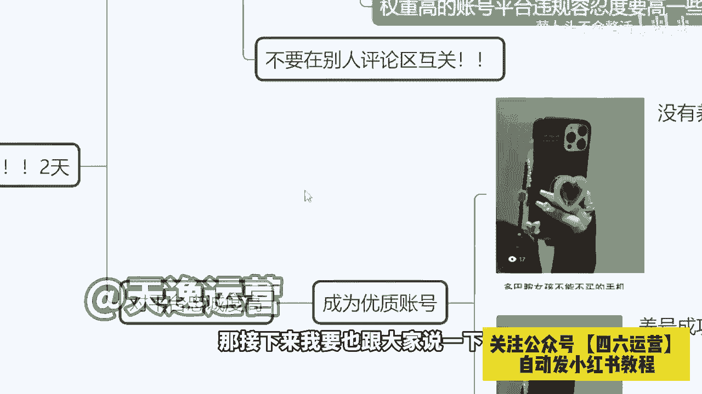

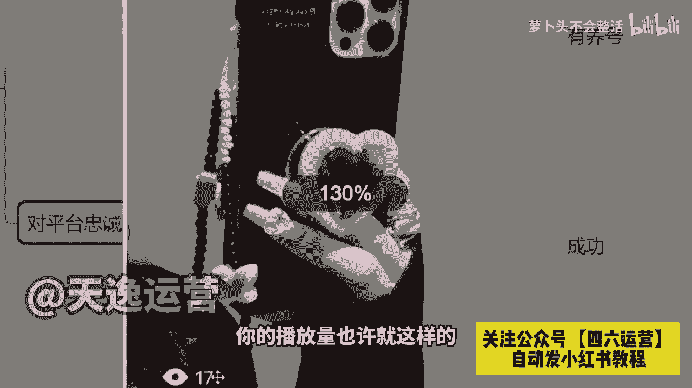

啊，2000多一个播放量。是吧是这样的啊，来，那么这个的话呢，就是属于我们一定要去做的这个一定要去做的这样的一个行为，必须要养号啊。😊，有学想说老师我这个没有作品的有粉丝，那属于平台。

有的时候估计别人刷粉啊，他那一个错乱东西关注到你那里去了。这个很正常啊，我们很多这个新号刚注册完，隔天啊这个连浏览作品都没浏览，直接上来十几个粉丝都有这种情况啊，但这个粉丝是没有用的。

就是我们的粉丝平台在后台识别你的粉丝的时候，他只会识别通过你作品关注你的粉丝，其他都是不做数的。就比如说你000个粉丝有效粉丝可能只有1700是这样的啊。好，那么我们怎么去测试这个账号来给大家看一下啊。

我们之后在养号完毕之后，对吧？养号完了以后啊，然后我们先发一篇作品，这个作品的话呢，文字编辑好啊，认真去写。然后图片呢我们真正准备好，然后去发不过在这里呢我要强调一点，不管我们之后做什么账号啊。

你上来的前两个作品，你不能直接表明自己是个卖家的身份，就像刚才我们看到那个卖手机壳的作品一样，你要写的文案是这个东西是你买的啊，我买来的。😊。

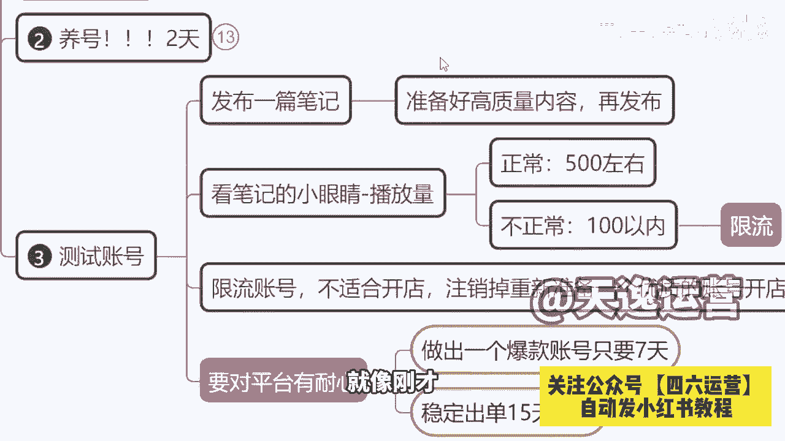

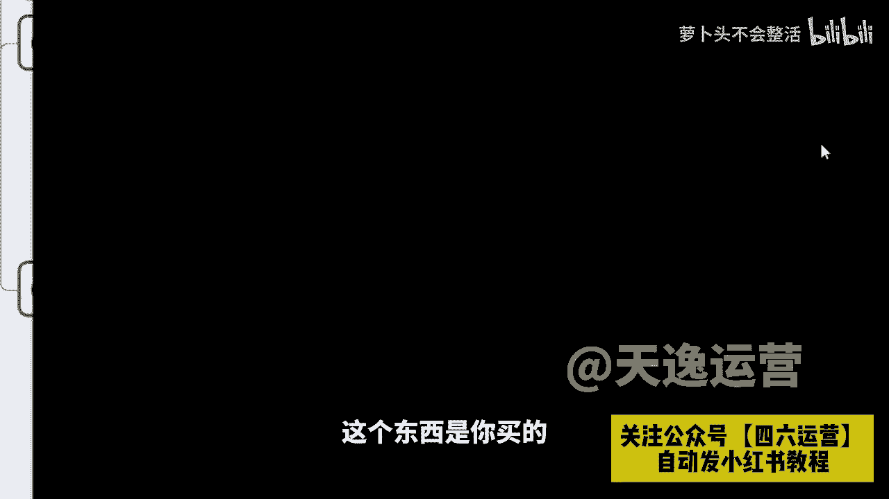

产品跟大家分享我用的好用的东西，我来跟大家分享。啊，你不能直接去发说啊，今天给大家分享一个手机壳啊，这个是我自己在卖的什么9。9块，这个不能去这样做啊。前两个作品不要挂小黄车。

前两个作品只从分享者的角度去分享东西，不挂车。然后测完流量之后，流量没问题，再开始挂车啊。来，那么在这里给大家看一下啊，就是当我们在发了这个测试的作品之后，你等两个小时时间两个小时过去了。

如果说你的播放量在500左右或者说更高10000，那很好，这个播放量又算很正常，说明你的账号是正常有推流的。但如果说两个小时过去了，我们的小眼睛啊，100来个70个80个呃。

1170180都属于限流状态，都属于平台没有给你推流啊，因为我们看到的这个100来个流量，它不是说真的有那么多人看了你的作品啊，很多时候是安慰性的一个数字。😊。

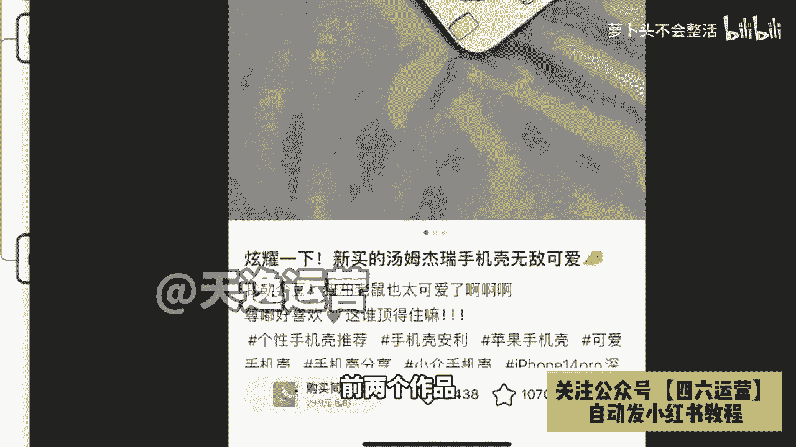

就是平台为了告诉你说啊，你这个作品是有人看的，安慰性给你镶了几个数字，不是真的有那么多人看。所以说这个时候我们的号都是属于限流的一个状态。就像我刚刚讲的，号又不要钱，注销了再重新注册就可以了啊。

这个东西因为小红书去测号的话，抖音的话可能你还得测两三个月的啊。但是小红书的话呢，它是属于说做一个爆款账号需要7天左右时间啊，稳定出单的话，最起码15天左右的时间15天左右的时间啊。来。

那么同时呢我们在测了这个账号以后啊，我们发现你发的两个三个作品的播放量都比较稳定的情况下，那你可以尝试去开店。😊，但是如果说我们发的两个三个作品都是在100来个播放量啊，那这个时候我们就可以直接注销。

然后再去注册新的这个账号了啊，然后呃因为是这样的，我们今天是两个直播间开课啊，所以说公屏评论区可能问题会有点多，我不能说一一去回答。

但是我拿个别也跟大家做个讲解像刚才有同学讲到说老师我有的是100多播放量，有的是一两千，这个什么情况呢？包括像有同学讲说老师我的播放量全部都在100多，但是我还在坚持发啊。这种情况的话，来这样啊。

同学们如果说对自己的账号不是很确定的，我们可以下了课，把你的账号主页以截图的方式，后发给你推课堂链接的那个助理老师，我们的老师都很专业，下了课给大家逐个去分析一下，好不好？

看看你们的这个账号到底适不适合做要不要注销，还是说可以继续做啊，你们可以下了课给助理老师发一下啊。但如果说你的播放量高，发的是生活类内容，就比如说是你自己的自拍，是你出去吃了一个好的餐厅。

那个播放量再高都不行啊。😊，再高都不行，因为那是属于生活流量。我们要的是商业流量。😡，好，OK这个我们就过掉了啊。然后我给大家看一个我们之前一个学生做的一个号吧，跟大家讲一下啊，为什么人家的号能起得来。

包括他之前为啥没流量啊，跟你们分析一下呃，我这个学生叫李继平，然后他是属于40多岁一个年纪，没有做过抖音，没有做过小红书，就任何短视频平台没有接触过的。😊，啊，但是他的这个号现在能稳定，就一个月。

变现最起码在1万以上啊，跟你们讲一下他的这个情况。他之前的这个作品，如果说有同学你现在发作品没有流量，你也可以考虑一下，就是跟你的发的内容其实也会有关系。他是什么？他内容实在是不好啊。

因为这个审美是有问题的。当时我跟他有讲过，我说小红说的用户其实更多是这种。😊，对生活品质有要求的啊，审美有一定要求的用户。所以说如果他去卖这个发卡是可以的。但是他去卖这种图案的发卡就不是很合适啊。

就是不怎么好看。另外他找的这个素材拍的很随意是吧？没有什么呃稍微好看点的这个配色呀，地上就是地板，你要知道啊，我跟大家说一点啊，就他这个图，他这个视频当时发的你看一个播放量是不是非常非常少，地上很脏啊。

地上还有那种掉的头发，没有拖地那种脏的。你说这种作品发出去之后，能有人看吗？没有。😡。

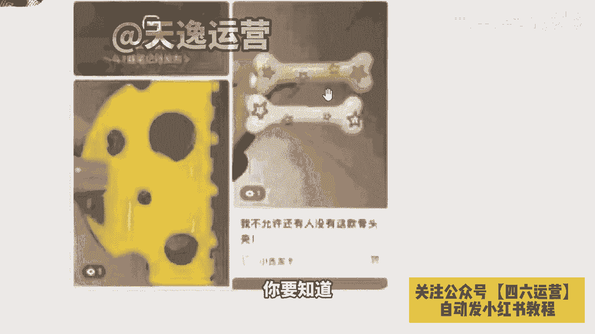

我就跟他讲了，我说啊，但是我安慰，我没有直说委婉一点啊，我说先养号吧啊，先养号，到时候再发换一个号再发这个作品。因为这个作品实在是限流，连人家连十几二十几都没有，他就是一的播放量。然后后来让他换了以后。

我跟他选了什么，我让他我说你去做那种Y twoK的风格。😊，就比如说这种很精致的发卡，来看一下这种风格是吧？银色的布灵不灵的带带点小钻的这种发卡。好，这些精致女孩她更喜欢。而且当时流行的一个元素。

将Y twoK的一个风格。我说你换这些产品。😡，好，效果立马不一样，是不是同样是手拿这个产品。然后但是呢因为这个产品的颜值更高，它的效果就更好。😡，啊，当然这个素材也不是他自己拍的啊。

都是找这个品牌方去拿的。来，你看一下，当时他13天时间换了产品，就后13天时间，立马100多单啊，100多单那个订单，这个里啊给大家看一下26。9块的一个价格。😊，是吧卖了102单十几天的一个时间啊。

那这个产品是怎么来的？然后包括这个产品拿货价多少钱，我也给你们看一下啊，像我们刚刚有同学说到说啊老师这个货啊怎么办啊等等的。我这里呢先简单给大家说一下。然后在后面我们讲带货的环节，我在详细说流程啊。

首先第一个我们的货源问题，我推荐大家两个平台，一个是1688，一个是拼多多。但是呢我更建议后者，就是我更建议大家未来去找拼多多去合作。因为1688，现在它的所有的产品呢是有点过时的，就它已经不更新了。

拼多多里面本身是一个打价格战的平台。所以说大家很多这个产品已经接近这个拿货价格了啊，所以说到时候我们可以在拼多多干嘛去找工厂店。😊。

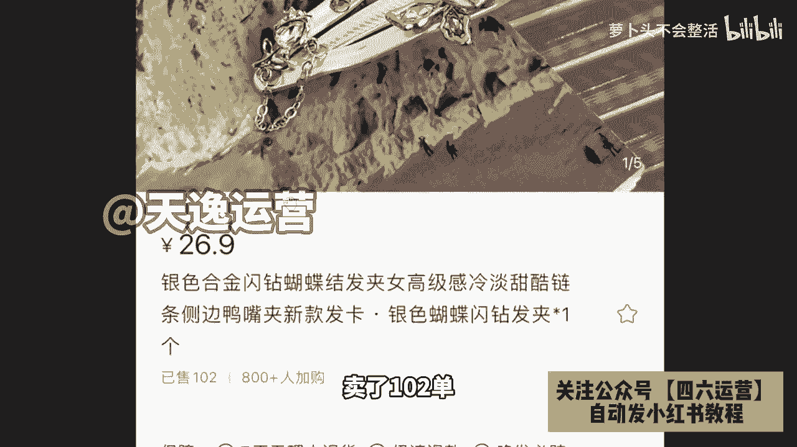

找工厂店，然后并不是说要你们在拼多多里面下单啊，我下单一个，然后联系那个小红书发货，不是而是你找到工厂店之后去加那个商家的微信，然后跟商家去说啊，说我这个呃想跟您合作，我想做代发。

然后我想卖你这边的货可不可以，一定是可以的啊，工厂店本身他们就是做代发的，然后给大家看一下啊，就是我们之后先确定好自己要做的一个类型。后面我详细说啊，现在我不想不讲那么细，我先把大概的跟你们先讲一下。

让大家心里有数，然后那么我没有钱拿货怎么办，对不对？你不要去跟商家说啊，你说啊，老板我没钱拿货怎么怎么地，你不能这么抢，人家一听都不敢把货拿给你，你怎么说你说因为我这边开店开的比较多啊，我是做矩证的。

我是做批量的。😡，所以说我们现金流啊没有那么多。😡，先跟您签个协议吧啊，签个什么协议，先采后付的协议。这个拼多多里面他都支持这个方式啊，这个叫先用后付。但是咱们签协议呢，叫先采后付。啥意思？

就是我跟你签订好多长时间来结款。比如说15天或20天，对吧？那么我先把你的产品挂到我店里上去卖。我卖了一单，你这边给我发货，让你们的财务记好，我的成本是多少钱，等15天到了20天时间一到。

我就把钱打给你。那这个时候你的客户也确认收货，你也收到钱了。😡。

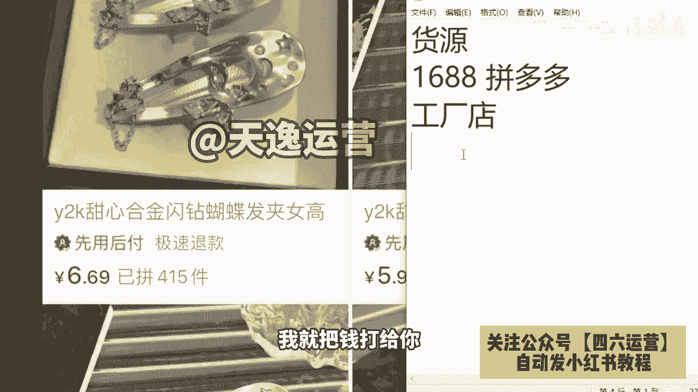

你就不会存在说我没钱去付货款的问题了。这个大家能不能听懂这个都直接是在线上签电子合同，直接电子协议有法律保障的啊，谁都逃不掉的那这样的话，我们前期就不需要去投资钱啊，这个对于新手来讲就比较友好了。

对不对啊？然后像我们当时这个同学的话，他就找到左边那个商家。😡，这里面卖的是6。69块，但他合作价格啊，私下沟通的价格是5。9块包邮啊，这个是包邮的啊。因为本身这个工厂价格很便宜。

那你看他一个的价格是多少钱，一个的利润多少钱，21块钱的利润啊，然后再乘以多少钱，再乘以这个102个订单，相当于说他这个是2000以上的一个收益，对不对？2000以上的收益啊。

就光这一个产品的收益就还不错了。然后他当时第一个月的时候就挣了8000多块钱，就是做带货啊，后面他因为他不止做做这一个项目啊，之前也跟我讲，你看他以前是在图书管里面做管理员。

后来因为他帮帮着他女儿带孙女啊，然后呢，他孙女经常生病，然后他老请假就被辞退了，本身收入其实也不高，就2000块钱一个月，他想的时干脆在家找点事情做啊，然后你看现在人家卖的啊。

这不是现在啊也之前的你看这个发卡不同款式都在卖嘛，对不对？😊。

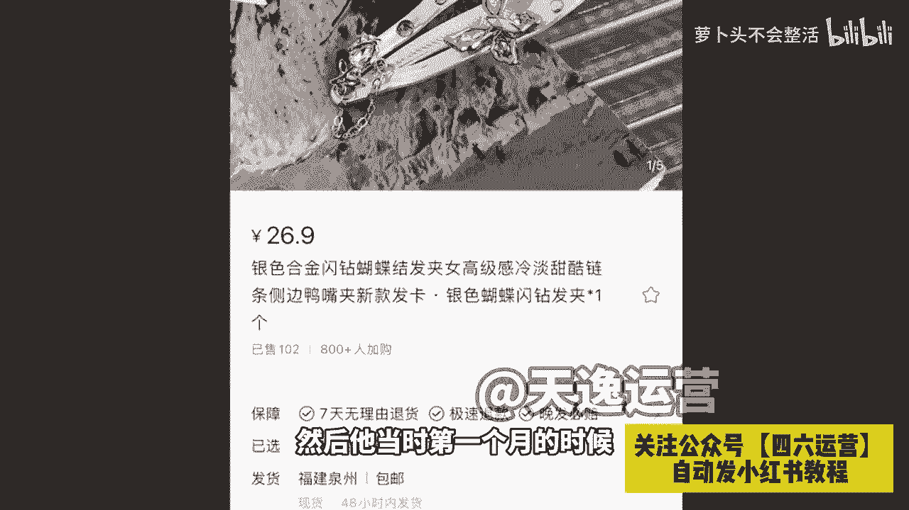

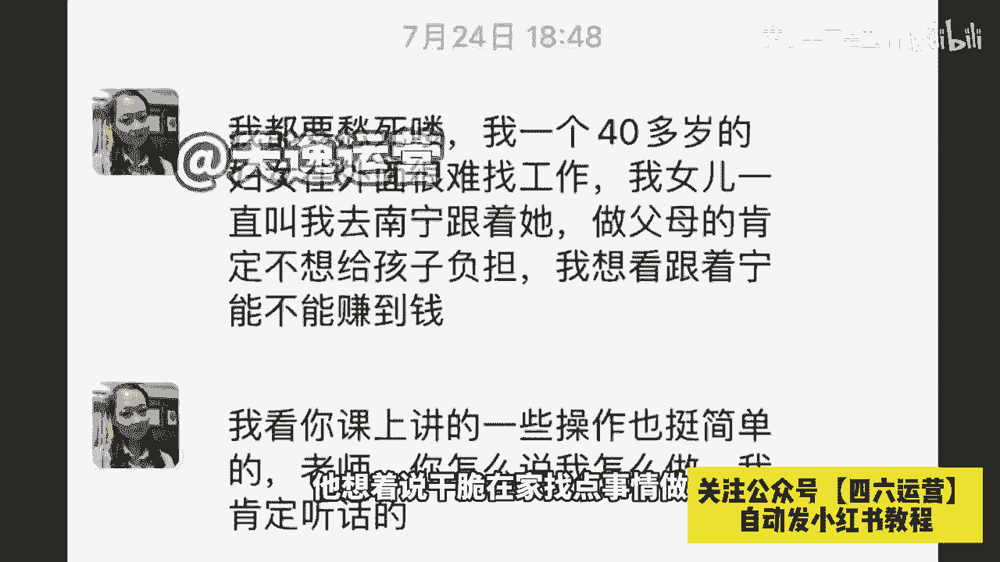

19块989单嗯，28。8135单。24。5是吧，25单就这种几十单几十单，其实它的一个利润加在一块也不低了。然后他在第二个月的时候就已经上了1400的一个收入啊，现在还做了一套在卖袜子的。😡。

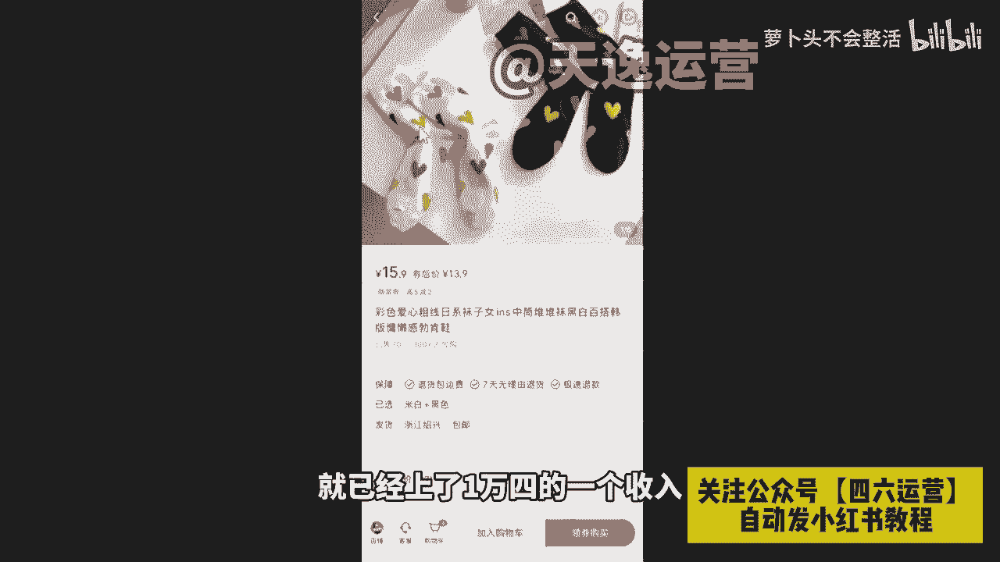

啊，就这种，然后你们之后都是可以去走这个方向。因为开店铺，我说实话它是最挣钱的这个玩法。😊，Yeah。然后现在我们也先讲这个带货啊，先讲完带货，再讲商单变现。因为商单呃我讲一下商单的优势啊。

来钱快很简单。所以我们放在后面说复杂一点的，我们先拿到前面来讲啊，属店带货就是开一个店铺我们去卖货。这个对大家时间有要求啊，你最少一天拿两个小时出来做，有没有问题。

一天最少两个小时没有固定说几点到几点啊，但是你中比如说中一小时，晚上一小时那是必然的，肯定要的。😊，啊，没问题那就行啊。呃，我先讲一下。如果说我们做带货类的这个账号。因为带货类。

为什么我们要重点讲它是符合目前平台的一个叫做百万扶持计划的，你们可以看一下，这里啊，我直接打开这个小红书官网给你们看。因为这个东西我光我嘴上讲没有用啊，我们要看平台的。你看这是小红书签翻商城。

就是他们的官方商城的后台，然后在这个登录界面就直接写了买手时代以来，1000亿流量，助力买手和商家共同成长，就是平台是实打实真的给咱们退流量的，对不对？这个东西不能做假，作假。

人家不可能写在自己的这个官网首页啊，那罚款都得罚死啊。所以说这个是实实在在真的给流量的。那么只要开了店铺啊，一定是能出单的。那么有句话叫七分选品，三分运营。就是说我们卖的这个产品的类型，他得是符合平台。

目前有的一个需求的。我上课以前有个同学问过我啊，说老师我是宝妈，我能不能卖小孩的衣服啊，我不建议。😊，来，我给你们看一下这个图我不细讲啊，这个图你们需要的公屏扣要字。然后助理老师后台拿那个数据统计一下。

打了要字的，我们下了课，自己对照那个网名去微信里面给大家去发一下这张图啊，打了要字的，我们下了课去给大家发一下。呃，我教大家怎么看我这个列表啊，教你们怎么看这个思维导图，这是我自己写的。

比如说像同行7600，那可以做，不算说特别大的竞争，但如果这种你看T恤2万多个，是不是？你说老师好多人卖T恤啊，我也卖，那就大错特错了，不是这个思维啊，而是卖T恤人太多了，我不掏这个浑水了，做的少的。

你去做啊，选择少的你去做。比如说睡衣可以。😡，家居服可以，对不对？然后呢啊像这种3C数码的，虽然说做的人多，但是你也可以做什么充电器呀、无线充啊，对不对？快充的那个数据线呢啊，OK都可以啊。

然后像这个项链的同行也比较多，然后爆款的这个概率又很低，我们就没有必要了。在这里我自己写了三个啊，就是目前我们测流量特别爆的，一个是这个母婴用品。

一个是百货用品一和车载用品给你们举几个例子给大家看一下啊，我拿几个产品举例给大家看一下。呃，其实我们有句话叫做这个小孩的钱是最好挣的啊。其次是这个女性。😊，对吧，然后所以说我们其实就可以从这些角度啊。

我们去考虑这些问题来给大家看一下，就这些啊，比如说像这个你看粘毛器，狗狗的。😡，这个东西成本多少钱？卖价36。9块啊，对吧？你们看不清楚，可以横屏一下啊，因为我们这个图放大不呃，这个图放大不了啊。

你们就可就得这个稍微咱们这个呃斜一下看一下啊，然后这个36。9块的一个价格，对吧？我们真正它的一个成本价格才3块多钱，3块多钱，所以说这个也是可以去变现的一个方式，然后包括这种手套啊，然后这个除毛器。

😊，这个成本才1块钱。啊，然后包括这边你看这个掏耳勺，对吧？29。8块成本多少钱，也3块钱。😊，也是3块钱包邮啊。对，这个是包邮，就3块钱包邮的成本。😡，3。9块包邮的成本，23。9块的一个杯刷。

这个东西1块多块钱的一个成本。😡，啊，因为像这种东西呢，它其实我们会觉得说好像快递很贵呀，我去菜鸟驿站寄个快递12块钱啊。你要知道，其实我们真正去合作了这个物流之后啊，很多小的不占面积。

不占体积的这个产品，它几乎我它几乎运费是跟我们直接省掉的，就是5毛钱1块钱的这个运费都有啊。然后包括像这边你看9。9块的这样的一个盒子，对吧？包括这个建麻的一个这个猫扎板，它那个价格49。9块。

成本十来块钱。😊，啊，成本十来块钱，还有像这个啊像这种产品啊，有他也想说老师，那我那边运费高，这个怎么去处理啊，我们之后去卖货的话，是不需要我们自己发货的啊。就是我不建议大家把货囤到自己家里。

然后你自己再发，这个是没有必要的，就相当于说我去卖别人的货，对吧？我卖他的产品，我今天把所有的产品的订单导出来之后啊，有这么20个单，那么他会有一个数据统计，每个订单，他的收货地址等等。

导出一个表格直接甩给那个商家，让他安排发货就行了啊，发完货之后，订单号发给你，你去填就行了啊，就是这样的。然后那么我建议大家去做的产品，除了我刚刚讲的这些就是类型之外啊，就是我们得去考虑一个点。

就是他的颜值高不高我们不用管他这个东西有没有用，你就看他颜值高不高。因为像小说里面卖了很多，像之前有个很火的叫loy的一个那个呃。😊，摆件啊那个玩偶是不是就那样的一个东西，我说实话就韩国流行过来的啊。

我觉得不是很好看。但是小红书里面很多人喜欢。😡，啊，然后还有各种带钻的呀，布灵不灵亮的呀啊，即使说它成本很低，都是可以卖高价的。然后像这种水杯也是一样的，你看一下啊，就这样一个小眼睛的这样的一个保温杯。

对不对？拼多多17块17。6块啊，这边227。8块的一个价格。包括在过年的时候卖的很好的这样的一个车载挂件啊，拼多多里面的就16。8块的一个价格，小红书卖49。8块。所以说在小红书普遍普遍来讲。

它那个价格更高，另外包括像我们看到那种手机壳什么的啊，这个在淘宝啊，拼多多有这个2毛钱的啊，有2块多钱的是吧？有这个3块钱的小红书都29。9块39。9块，就这样的。😊。

就这种包括像我们其实很多时候在卖母婴产品的时候，发现很暴力一个东西啊，耐拼。😡，对吧我这个成本我去拿货的时候，这个成本才18块钱。再想我说我甚至可以卖到160180的一个价格啊。

这个就是我们挣的就是这个平台里面有收入，有收入，有这个高收入或者说有消费力，有购买力的这一群人的这个钱啊，那这是我们要做的来，那么我们现在看一下开店是否要投资的这个问题啊，就是我开店要不要花钱呢？

开店其实是不用花钱的啊。但是因为你想要把这个店开下来，想拿开店资格，有人会花钱。😊，有人会花钱。呃，我跟你们讲一下，就是目前开店的话是这样的一个情况啊。呃，像有同学来有没有开过店的，有没有有开店的？😊。

有没有已经在小树开了店的，有没有流量啊？长腿同学说有啊，有流量没有？😡，没看的，咱们先不用打字啊，没看的，不用说老师啊，我上课你积极，我就一直配合你。😡，很少流量，对不对？有一点，但是不多啊。好。

那就对了。来，我跟大家讲啊，我跟你们说一下，就是小红书，我们不说其他平台啊，我就讲小红书现在这个平台，它的一个这个流量的一个问题。首先我们刚说了小红书有千亿流量扶持。我讲过一个点，我说只要你开了店铺。

对吧？那么平台就会给咱们推流，但是这个是有条件的，因为店铺它分两种，一种叫做普通的个人店铺，😊，普通个人店铺呢，他不需要你有经验。😡，不需要。经验谁都能开，但是它是概率性问题，就是可能10个人申请。

只有8个人下店，10个人申请6个人下店啊，他不会给所有人下店啊，但是大大概率会通过你只需要上传身份证，那隔天就能下店，对不对？有开店的，是不是你只上传身份证了？😡，然后你也没有客户经理，没有客服经理。

对不对？没有店铺经理。😡，就是你没有一个专门的助理，是平台给你配的助理，是没有的，对不对？那么这种店铺啊，你开了之后，你发现没有流量正常。因为第一个平台现在要做口碑，他不确定你卖的货是不是好产品。

有没有质量保证，不知道你到底有没有店铺运营能力，他不会轻易给流量给到你，因为他根本不认识你也不信任你这是很正常的。那么还有一种店铺叫什么呢？叫做内邀店铺跟大家来说一下啊，内邀店铺。😡，是哪种呢？

他要求你必须有电商店铺经验，销售额单月流水是要突破10万的，单月流水要破10万。你可以是在抖音开过店，可以是在淘宝开过店，你需要向平台提交你的流水证明，并且店铺的存活时间是在半年以上。

就是近半年每个月都有这样的流水，有稍微一两万的偏差没有关系，但是存活是半年以上的时间，证明你是有店铺经历的，有店铺经验的，那么就相当于说是平台吸纳人才的这个方式把你邀请进来啊。

那这个时候你会获得流量扶持的店铺，你的店铺呢它不属于普通个人店铺了，就像内邀个人店铺一样的，不用营业执照啊，同学们不用去注册营业执照，小红书好就好在你只要有身份证就能开店。你就算是在政府机关单位上班的。

你说我不方便搞副业的。小红书店铺你都能开。我们有很多在消防局，在政府这个在纪委单位上班的都是。😡，一样的啊，都是有在做这个店铺的啊，赚一份附业收入。因为他不用营业执照，你有身份证就能开店了啊。

这个是他非常非常方便的一点。你在抖音上都要都要营业执照的啊，那么好一样的，上传身份证，那么就可以下店了，像这种店铺的话，才是有平台流量的一个推送的那其实今天我们大部分人是达不到的，对不对？有说老师。

那我根本没有这个经验怎么办？现在市面上的有卖那个假资料的。😊，就跟你买房一样，流水不够，贷款办不下来，对吧？做个假流水是一个道理啊，这个店铺也能做假流水啊，然后呢给你去申请店铺，但这个封店的风险比较大。

不建议你们花这个冤枉钱啊，2000块钱也不少了啊那么所以说我跟大家讲，其实开店的话，因为小红书它不像抖音那种啊，就是我谁来都来啊这个谁来都行，对吧？我不在乎这个你的到底有没有能力，但小红书不一样。

因为小红书本身它的格调啊，它的调性跟抖音就不同，它走的是高端路线。所以说他会他会审核这个电商经验。那么我跟大家讲一个就是我能解决的一个方法，这个也是我个人啊，今天跟咱们这个公司无关。

就是我个人的一个想法。因为我现在作为我们这个企业来讲，我是去承接了这个。😡，小红书它的一个达人孵化的那等于说我是有资格带大家来参加平台的一个百万的一个店铺计划。我跟你们讲一下这个东西啊，百万店铺计划。

😊，那么这个计划就是我前面讲到的，你只要参加了，那么你的店铺销售额达到10万，有奖励，现金奖是1000块钱，达到20万，有奖励，达到50万，有奖励。他每个跨度有不同的现金奖励。那么在这种情况下。

他是需要有带教人的啊，就是你是有人去带进来的，有人。😡，有人来帮你申请的。那么如果说我作为你代价人，其实我们是合作关系啊，就是你挣多少钱，你挣100万，挣100万跟我们一分钱关系没有。

就是我不会分我不会分走你的任何利润。但是如果说你的店铺是我这边申请，我们以内邀的方式把你申请过来。然后我向平台提交资料，对不对？好，那么你能有钱我也有钱，就是你有奖金，我也有奖金，是这个方式。

那如果说大家觉得O这个我还挺挺喜欢的，我能接受，对吧？我想要有一个这个有流量扶持的店铺，那到时候我可以帮大家搞定，是这样的，我会以我公司的名义，我跟平台讲，这个是我们公司运营的店运营要申请的店铺。

然后让他去给我内邀名单，给我内邀名额，然后我把你报上去之后，你一样的会拥有一个平台的店铺经理。然后但是呢他们一定会给你打回访电话，就是给你确定说你这个。😡，是从哪里了解到我们，你要跟他讲，我是小文的呃。

比如说是我团队的人啊，或者说你是我的员工都OK啊，你要这么去讲，你不要说接了电话说我是小白，我什么都不懂，对不对？这个就不行啊。因为平台他的要求是必须是有经验的，才能参加这个活动，明白了吗？

有多少同学是想开这个店铺的，咱们可以打个开字啊，到时候如果你们需要的话，咱们可以合作一下。😊，我们可以合作一下。那这种开店铺的话，是不用去掏钱买资料的，也不需要说用什么假资料，有封店的风险啊。

就相当于说我们直接会向平台证明你就是一个专业的运营。然后呢，给你这个开店的资格，我们是以这个方式去申请的啊。嗯，那么好O这个我就说到这儿啊，这是关于一个店铺的问题。那么这种店铺的话就有流量。

像我们自己员工给你们看一下，多夸张。过年回来以后啊，过年在家里找了七八个亲戚啊，借手机号来用。因为他们不刷小红书嘛，也不用小红书干脆把手机号借过来说啊，借你手机号开个店，借你手机号开个账号。

拿他们的实名一用，挣的钱呢，打你自己卡里就这样的，看到没有？15台手机直接摆桌上一起做的。😊，啊，手机买了好多2222手的那个手机啊，304010台就这样做的，是不是？为什么啊？因为现在黄金时间嘛。

流量是扶持期啊，然后一个身份证的话，可以帮大家开一个专业号，一个店铺啊，一个个人店铺呃，在海外能不能做，在海外一样可以的啊，在海外一样可以的。😊，嗯，来，我们OK我们再来看第三个啊。

就是那如果说我们确实是去开这个店铺的话，我们的作品怎么去发，是不是内容我怎么来去处理啊？来，首先我们在小红书去发一个作品的话呢，它无非是这么几个组成部分来我们看一下。😊，给大家找一个啊。

就这种你看我们随机点开一个这个啊这个内容，你看它就是这些图片啊，图片啊加上一个标题对吧？加一个标题，加上一大段文字啊，加上对这个产品的介绍。好，OK这就是这样的一个这个作品的一个组成，不需要去剪视频。

不需要去做那个很长的那个作品啊。好，那这些图片怎么来，咱们自己拍还是怎么回事啊。这个文章又怎么去写这么长，我都不了解这些什么美容仪，我怎么来写。来，现在我来告诉大家，我们具体一个操作方式。

第一个图片问题。其实更多的啊，我们如果说去卖货的话，你的图片组成，一个是产品的实拍图。😊，产品实拍。就真实的拍摄的，手拿的也好，那个产品放在一张床上，一个好的背景，拍一张也好，产品实拍图。😡。

然后再一个真人的。😡，体验图。对吧比如说我是一个卖化妆品的上脸的效果，我卖假睫毛的，贴上之后的效果，对吧？然后我卖等等这个其他产品在使用过程的效果，卖个沐浴露，你得去拍那个手上有泡泡的啊。好，来。

这个是真人体验图，加起来的话呢，最起码有个4张左右的图片是最好的啊，4张左右图片。如果我们追求这个产品的。😡，追求这个作品的一个效果。来，最好呢是有对比图。有对比图是最好的，就是我使用产品前。

使用产品后的这个效果，那是不是需要我们自己拍呢？不用。首先产品实拍图从哪里来啊，你找商家，因为像我们有的时候卖的一些货啊，他没有品牌，他也没有任何知名度，甚至说我在淘宝我都找不到这款货啊。

那你就要联系商家，因为他们有自己的美工，你让他们的。😡，商家给你提供实拍图，你说我要别人没发过的，或者说您这边能不能安排美国现场给我拍一下啊。因为我这边是呃要做这个账号，我是做自媒体的。

帮您宣传你的产品，他一定会给你啊，这是第一种方式。那如果这个产品刚好它是其他平台也有在卖的那就更好了。有现成的素材，我们可以拿去用啊。好，这个是一个那真人体验图从哪里来。

既然我们讲小红书是一个升级版的高端的买家秀平台，那图片我们不妨就从淘宝买家秀来，对不对？来给大家看一下啊，我们直接在手机也好，在电脑也好，你到淘宝的这个界面去，我们直接去搜这个。比如说我今天要卖假睫毛。

😡。

对吧我直接去搜假睫毛，来，我登录一下我账号啊，稍等一下。😡，给大家来看一下。

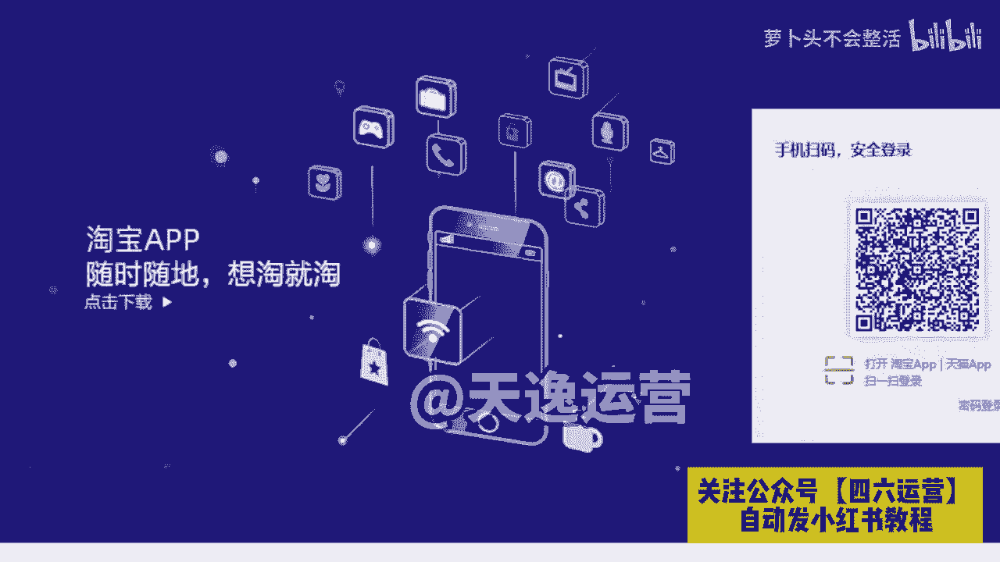

好，登录上去之后啊，到时候我们直接在小嗯来稍等啊，这个还要再加载一下。😊，好，就这样的，比如说我们搜了假睫毛以后，然后你们尽可能去看那个销量高的，看销量的那个排行榜，我们去找销量高的那个产品啊。

比如说这样你看我选这个销量对吧？第一个的这个6万多人收货的这个9。9块的啊，我不管这个产品跟我卖的款式是不是一样的啊。像这种假睫毛啊、沐浴露啊、香水呀那些啊，然后包括啊像什么粉底液呀，对不对？

然后包括像什么身体乳啊，啊，就这些东西用在身上是看不见牌子的啊，你找其他品牌的都是可以放心用的，你找其他品牌买家秀都可以用。我卖的这个牌子，蓝天牌身体乳，但是我用的买家秀是这个多芬的身体乳的。

买家秀都没有关系啊。来，那么我们直接进入到它这里面有个宝贝评价是吧？有宝贝评价这里面有很多人是上传了自己的买家秀的那我们就去里面找一找有没有稍微高质量一点的这个图片啊，比如说这个你看一下。😊。

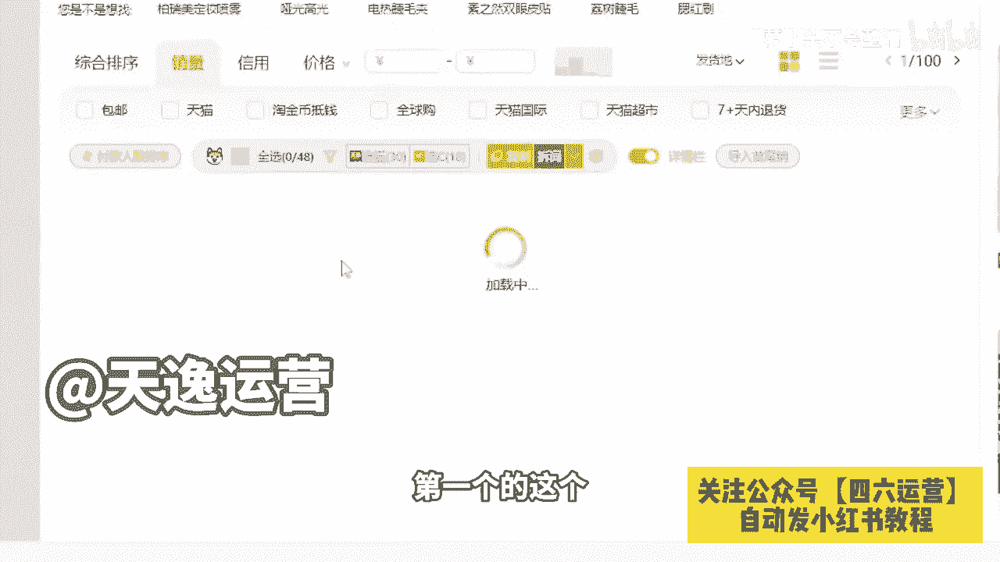

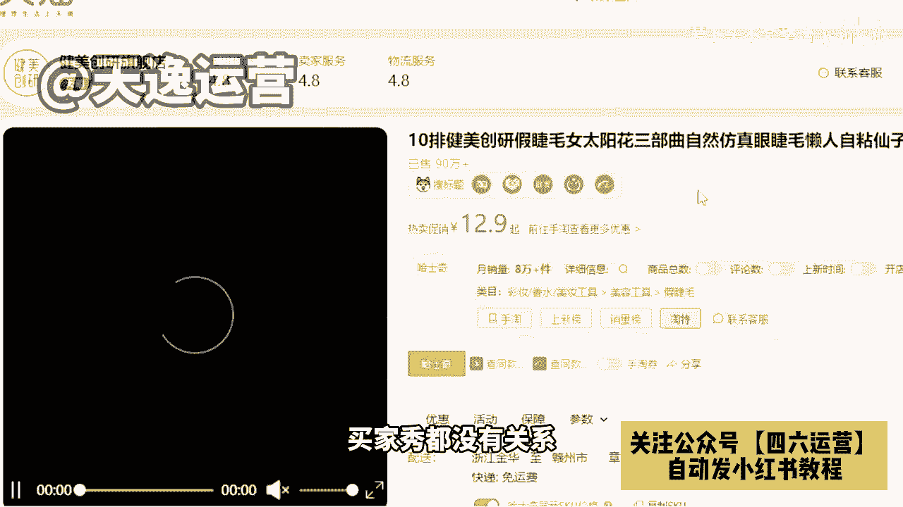

这个好不好看，能不能作为我们的这个买家秀来用啊？我们要注意点啊，就如果说这个美女有点美的太过头了，就是一看就是像个网红，像个大明星似的那种太美的，咱们也不要啊，不真实，稍微有种邻家女孩的感觉。

像是我们身边真实存在的那种颜值啊。这种图我们可以拿来用，对不对？我们可以拿来用，包括底下再看一下，像这里。😡，是不是这些啊再往下。你看这个还有对比图的那更好了，是不是还有对比图的那更好了。

我们都可以拿来使用。但是为了避免啊，因为我跟大家说一下，为了避免重复，比如说你去买这个产品，你用了这个买家秀，别人也用的是跟你同样的一个图片就很尴尬了，是吧？我们最好是往底下多翻一翻啊，往底下多翻一翻。

只要越往后啊，用的人越少的，那我们可以拿来使用，是不是？然后像这样的图我们是不是就可以直接直接拿来发了，对不对？但是我跟大家讲一点啊，因为这种图片，如果你直接去点击下载。

那么它的一个图片代码是淘宝的代码是不可以直接发的啊，因为这个代码的问题会导致我们的作品是违规的，那么怎么办？手机截图会不会。😡，手机截图会吧，你把这个图片点开，不要直接保存。

我们用截图的方式把这个图截下来，然后再用。😡。

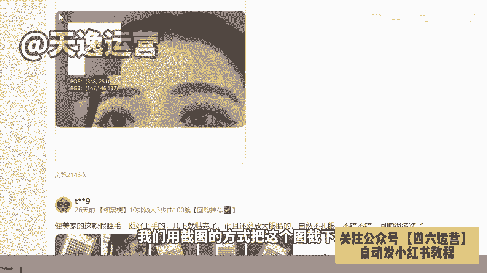

然后再用。那么这个时候大家会面临一个问题，我如果说拿别人的买家秀，别人上传图片去发作品，我不会造成违规的现象吗？是不是我不会侵犯他人的一个肖像权吗？我跟大家讲，小红书本身我们走的就是一个买家秀的路线。

那么我们在发布了这个作品之后，你不能讲这是你本人你要在我们的文字当中去描述，比如说图几图几是试戴效果，你讲清楚，这是产品的试戴效果。你不用说这不是我啊，你就说这是产品试戴效果，明白了吗啊。

我们这样去讲就可以了。我们这样去说就可以了。如果遇到本尊要求你下架，那咱们就下架换成图片就可以了，这个是可以去操作的啊，这个是可以操作的。我们目前在小红书看到很多这种真人露脸的都并不是这个账号本人啊。

并不是这个博主本人好，这是第一个方式。在淘宝买家秀直接去获取这个图片，是不是真的很方便，对吧？这里面还有好多啊，你看每一个是吧你为了好评返现啊，给他回一个这个图片。😡。

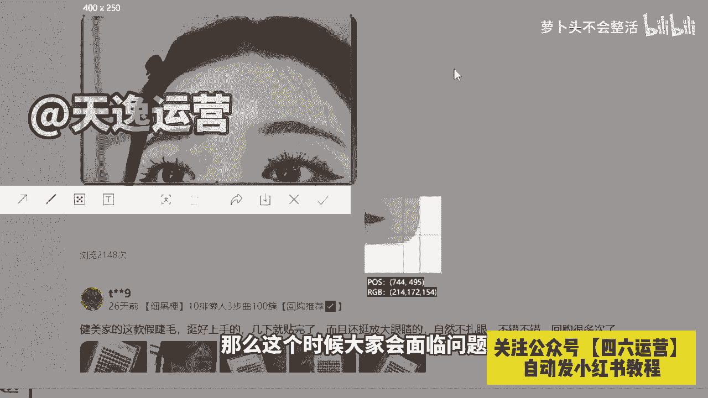

那这个咱咱们是可以拿来使用的啊，这个还有清纯的啊，对不对？好，OK那除了这个以外呢，还有一个方式在抖音。😊。

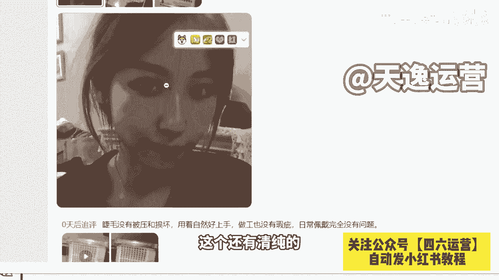

啊，因为抖音现在电商做的很成熟，在抖音里面带货答人是很多的那这个时候来我给大家。😡。

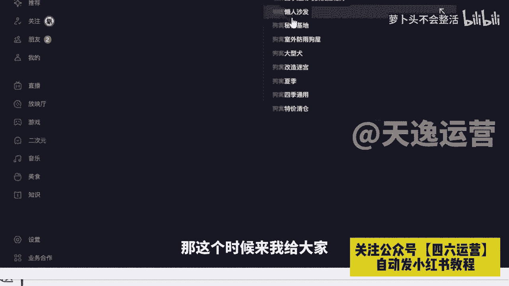

🎼来，比如说这种啊像在抖音平台里面也有这些带货的一些作品。那么但是呢我们要注意一点，如果你用的是抖音已经签约公司的达人的素材啊，就好比说这个博主，他是签了公司有M森的，对不对？

那么你是不能只用直接使用人家的全脸的素材的。比如说你看他在他在卖的这一款假睫毛啊，他是有一个什么，他是有一个试戴过程的。唉，那这种素材就很好。因为你看他有这样的一个对比，是不是普通睫毛啊。

然后带上这个款式之后啊，对不对？有这样的一个效果，那么我们在使用他的素材的时候，一样使用截图一个方式，但是你不能够把他的整个脸部的所有五官都截下来，你只能去截部分，比如说我截他单只眼睛，光是这样一张图。

其实也很好看了，对不对？普通睫毛是这个效果，带上我们的产品之后是另一个效果，这个使用前使用后的对比图，他是不是也有了。😊，🎼对不对？是不是也有了，像这种视频里面去截图使用的素材，重复率反而还会低一点。

就是没有人跟你撞款，没有人跟你撞型啊，发出去之后效果可能会更好。这个是我要教大家的几个这个方式啊。然后当然呢我们会遇到一个问题，因为我是电脑打开，你看这个点赞啥的，在边上不会遮挡，对不对？

你们正常在抖音里面呢，这边有个头像有个点赞，有评论什么的，把这个视频遮挡掉了。那如果你直接下载呢，它又会带一个这个抖音的logo在上面就很尴尬。如果之后我们想要使用这样的一些素材的话啊。

到时候呢我去给到大家一个工具来给你们看一下，咱们不要去点下载视频啊，我们一定要去复制这些视频的链接，在手机也是一样的操作。然后呢，我会给大家去送一个工具，这个工具是可以免费去水印的。

在咱在咱们的这个微信小程序里可以直接用啊，点击粘贴链接就好了。😊。

直接人家的整个视频给人家copy下来了啊，水印什么的完全没有。我们再到这个原视频里面去做截图就可以了。来，这个大家听懂记住了没有？听懂来，咱们扣个一啊，记住了明白了，公屏扣1。😡，嗯，好。

OK这素材问题啊。呃当有同学说老师，那我能不能去找人拍呢？当然可以，我为什么不建议大家前期做原创？因为你的试错成本很高，我们并不能确保说我请的这个模特给我拍的视频就一定能火，那每条视频都是一个成本。

在这个时候你前期投入资金过高的情况下，你很难获利。但如果说我们前期以这种搬运的方式来进行，对不对？那么效果会更快一点，会更显著一点，等你的收入上，你说像我们现在有同学能做1万店铺的，你到达人家那个水平。

你再花钱找模特做原创，因为你之后那个账号想长久引流嘛，对吧？我想长期做，我想做的更大一点，你再去什么找模特去拍呀，拍这个照片什么的，拍这个图也就100块钱一张。请模特拍就100块1张。

但是现在没有必要去投这个钱。说实话啊，来O这个是简单的素材，我们去呃找这个素材的一个方式。😊，啊，然后再来讲第二个啊，我们要说到的一个标题的这个问题。然后这个关于标题的话，如果说我们有原创精神的同学啊。

你说老师我文采还不错，我愿意自己去写。然后我今天呢也给大家送个小福利，这个咱们下了课可以找助理老师去领啊，记住我找助理老师领啊。你们看一下，就这里面呢我给大家去总结了一些关键词就不同类目的一些关键词。

就是在我们的呃标题里面可以去体现的，因为我们现在如果说你的标题里面，比如说别人在搜索的时候啊，搜这个。😊，淡斑对吧？搜美白，那刚好你卖的这个产品是有美白功效的，你就得在那个标题里去写上美白两个字啊。

就是你得带有这个关键词，对吧？什么修复啊、精华呀、护肤品啊，人家搜的时候是可以通过这个关键词搜到你的。那所以说我们在标题的时候就要注意去加上这些关键词啊。然后这个关键词的话呢，在这里我就给大家总结好了。

到时候你们可以下了课找助理老师去领。然后另外一个就是做爆款标题的这个点，然后这个标题呢是给大家总结了一些目前带货效果还不错的啊，然后把这个标题给大家拿出来了，把这个词啊给大扣掉了，你们也可以去带入进去。

然后呢去形成一个新的标题，但是不能直接用啊，就好比说人家这个是这可能是全网最清楚的美白教程，对吧？但是你不能完全照样的把这个去写进去啊，因为这个跟别人是重复的。

所以说你只能说去模仿他这句话再写个类似的写个类似的啊，这个是我们适合有原创想法的同学。😊。

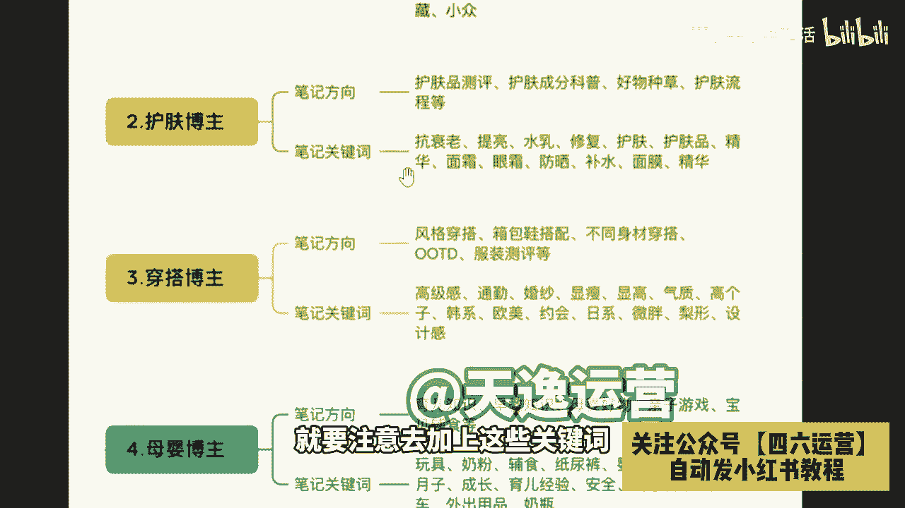

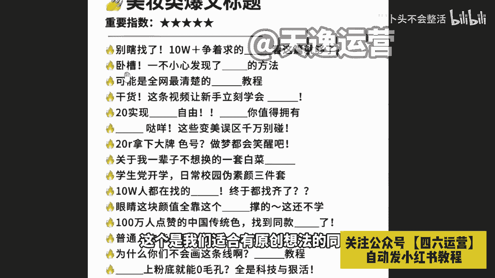

但是实际上其实我们自己在做内容的时候，一般来讲我们不会做原创。😊，我们是怎么做，不会说自己去写啊。呃，我想问一下大家，知不知道什么叫做chGPT我现在跟大家讲个黑科技啊。😊，讲厉害的一个东西。

然后这个软件的话呢呃是我自己团队做的，我们自己研发的。然后但是说句实在的，我们本是它的一个本体啊，我们是借鉴了一下海外的chaGPT啊，我们是把他们的核心技术拿过来了啊，copy了一下啊。

然后做了一个升级迭代。😊，知道哈人工智能能帮你高考，能帮你写论文，能帮你写周报写月报，写工作总结，啥都会啊。嗯对，然后但是呢我们现在国内它其实是没有一个针对于小红书的一个版本的。

然后当时我们在跟小红书去讲这个合作的时候，他他们他他们当时就跟我们讲了，说现在做小红书的时候，其实很考验写稿能力啊，就是说小红书确实挣钱机会多，但是很少有人能够在小红书有这样的一个机会，他不像抖音啊。

你能剪个视频出来，你各种素材去拼接，你就能做一个能够做爆款的一个作品。小红书不需要有那么复杂的视频，但是它对于你的文笔有要求，就是你写的内容能不能吸引人，能不能抓人，更多人在刷小红书的时候。

是看除了看你的几张图片，那几张图片有什么好看的，对不对？更多是看你的文字，对于这个产品的描述，你对于这个产品的心得体会，他觉得话真的很真实啊，写的很好，对吧？有吸引到他他才会下单才会去消费啊。

所以说这个文字是很重要的那怎么办？咱不会写，我也不知道我写的东西，到底能不能做到爆款，能不能吸引人。那你。😊，不妨交给AI来做啊，我先给大家看一下啊，这个工具我不是拿来卖的啊，我就是今天给大家做个分享。

到时候如果说你们做小红书，能把这个工具用上也是事半功倍的。啊，来给大家看一下，比如说我今天要做一个标题，对不对？那么我要写这样的一个内容。如果自己去写，它不一定是爆款。但是如果用工具的话。

它的素材的呃采集呢是来自于小红书本身已经有的这些爆款标题，然后呢，它通过模仿的形式啊，达到80%的原创度给你写个新的出来。😊，你们看一下，比如说我今天要卖一个这个我想个产品啊，比如说我们做一个什么好呢？

😊，墨镜吧。是吧比如说墨镜啊，然后呢我的要求是吸引眼球，大家想做一个什么标题，你们也可以说一下啊，想做一个什么产品，然后我给我给他我给大家去示范一下啊，吸引眼球。😡，不要说大范围啊。

什么女装那些不要讲了，你要讲产品的名字啊。😡，新眼琼。来语气我怎么选？如果说你想更亲切的口吻，我们可以选友好的啊。然后如果说是奢华来这样吧，我们有一个小葛同学收到了一个珍珠项链。来。

我跟大家讲珍珠项链好了啊，我跟大家讲为什么？因为它还有一个好的用处来珍珠项链。😊，我们用这个的情况下，你看它是可以做区分的。如果我卖的珍珠项链价格很贵，对吧？它是1000多块钱一条的，真正的高端的产品。

那么我们不能很随意去写，我选奢华的，我点击生成它的词藻就会比较华丽。你看一下啊，奢华的象征。😡，一块珍珠项链的奢华魅力，揭秘顶级珍珠项链的奢置风范等等。哎，他写个这样的一个内容出来啊，你们能看清楚吗？

在底下，如果我对这个内容我不满意，我点换一换，然后他立刻又会给咱们写新的。😊，看到没有？又会写新的。😊，啊，以这样的一个方式给到你。如果这个我还不满意，再点换一换，它永远不会重复。

但如果说今天我卖的这个珍珠珍珠项链，它是属于什么？它属于那种low货啊，就是50块钱的人造珍珠是塑料的，那我们就不要选奢华，你选什么，亲民一点的，咱们选个友好的啊，我再点生成来看一下。

这个时候就不一样了。😡，啊，他就不会说有那么辞早的话，那么华丽的一个词藻了啊。你看如何挑选你的完美珍珠项链，小红书精选指南珍珠项链搭配数，让你轻松成为优雅焦点，对不对？来这个标题写的好不好？

大家觉得这样的一个标题好不好？😡，能不能用？😡，来看啊，好是吧？还不错，珍珠控必看如何选购与保养你的珍珠项链，每颗珍珠都有故事。珍珠项链的时尚演绎之旅，小表情都给你带上了，小表情都带上了。

这种就是便宜的啊，它一定会有的这个小表情，贵的，人家就不带表情，因为要严肃是吧？要庄重啊，这个就不一样来这个标题咱们就搞定了。无论是哪种品类，哪种类型，包括甚至说哎我做个沐浴露，对吧？

我做一个沐浴露也是一样的，我选个友好，或者说我就选个常规的吧。来，咱们选个常规的再点生成。😊，你看宠爱自己从沐浴露开始，对吧？让肌肤喝饱水的秘密啊，来，我们重新再加载啊，刚刚跟那个融合了沐浴沐浴小确幸。

发现一款让人心情愉悦的沐浴露，对不对？这些都OK啊，这些都OK啊。然后鼠标垫做什么高级感，鼠标垫就做常规就可以了啊。鼠标垫不要高级感，你高级感的话就卖不掉了。人家一看你的标题就觉得这个鼠标垫太贵了。

人家点都不点开啊，这个标题我们取得这个呃效果的话是跟人家能不能点进来看是有关系的啊，临时也是OK的。来这个标题我就不多说了。之后，AI咱们直接生成就可以了啊，你不用说自己动脑筋去想。😊。

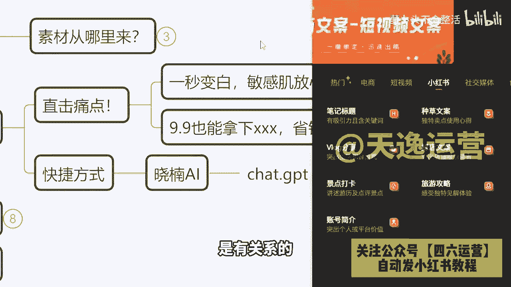

然后包括我们再回归到刚才讲的这个带货啊，我们这个带货还没有说完，对吧？我们既然有这样的一个工具之后，我们就可以直接生成文章。无论是卖产品，还是说接商单，非常简单，非常容易啊，没有什么难度。

那么同时在这个工具里面，如果之后还有一个方式啊，就是我们还有一个可以去获得流量的方式，在这里也交大一点，比如说我在小红书刷视频，我刚好刷到了某一个达人，他的这个作品呢是两个月以前的。但是他依然在推荐页。

😊，我们再推荐看到吧有个作品啊，3000多点赞。你看那个发布时间。😡，去年的。😡，前年的甚至更久的啊，半年了是吧？几个月了。好，那这个时候告诉你，这是个商机的。😡，你去模仿他的文章，写一篇类似的。

包括你的图片的排版等等，都跟它做类似的。因为平台始终要新的东西，它不可能说一直推以前的老的这个东西啊，那是因为没有可以替代的。所以说只能推之前的旧作品。

那如果你写一个类似的出来平台会选择把流量划分到你的这个账号这里来。好，那这个时候我们怎么去模仿，对吧？我不知道怎么去写这个东西，你把这个东西一样的交给咱们刚才的AI工具啊，在这个位置。

它有1个AI聊天来有个AI聊天，它会模拟啊，这个就是你它会满足你的所有的要求，然后在这个位置的话呢，比如说我把这个文章，我复制过来，对不对？我把这个文章复制过来之后，我下面带上一句仿写这段文字。😊，好。

那么他就会给你反仿写。你看本身我们第一句话是肿眼抛天菜，对不对？好，它改成什么了？改成这款隐形双眼皮贴真的太赞了，对不对？它意思没有变，但是它的文字，它的语言，它的语气是会有变化的啊，这就叫仿写。

然后包括你如果说重复再给大家发，还会有新的东西，这个AI软件叫什么，目前没有名字啊，因为这个是我们自己做的，毕竟我跟大家说一个这个说一个这个事情啊，为什么他没有名字，因为这个技术是从国外来的。

它原版的这个工具叫GPT但是它没有小红书的这个试用版本，我们相当于说是等于说我们用了人家的技术，然后做了小红书的版本，所以说我们没有办法在正规平台上线，这个工具是我们自己私下在用的。

就是我们公司自己的员工在用的。如果到时候你们确定做小红书，比如说你从明天说老师我下定决心我要开始做这个做这个项目了，你到时候找我来要。😊，🎼你到时候再来找我要好不好？如果说你真的要做小红数再要。

因为今天我们也也担心会有同行在听课，我不可能说把这个东西直接啊，我说每人一份，那这个东西不值钱，也是增加竞争对手啊。然后到时候如果你们真的要做的话，我们再考虑这个问题，你再要就找我要就行了啊。

这个东西我不会说收大家钱啊。因为我们这个东西不会拿去卖，拿去卖的话，相当于说别人如果说再来抄我们的这个技术，对不对？那我们这个东西就很难搞啊。所以说如果你们真的是自己要做的，我们再说啊，自己要做的再说。

😡，🎼Yeah。另外就话题的话，到时候我们会有包括我给大家讲啊，你们到时候如果说在文章里面不知道带什么话题，对吧？有更大的一个热度。😡，然后包括你不知道要卖什么产品的。

我们现在是直接拿到了小红书后台的所有的统计权限。我给你们看一下，我们是有这种比如说呃品类的一个品类搜索给大家看啊，就是我们有比如说我要做箱包鞋靴，对不对？我要做这个箱包鞋靴女鞋男鞋等等。

都O那么我们在后台是可以直接看到，比如说这个笔记有多少篇，一共有多少篇，然后呢，这些所有的笔记里面爆款当中用的关键词最多的是什么，达人分析品牌分析，它的关键词分析高频的评论词，我们都有。

就是我们可以直接看到整个平台，包括它每天新的作品发的这些内容是什么，然后包括他是怎么样去做的引流，就是我们这边可以直接看到后台所有达人发的作品。

然后到时候如果说你们需要说老师我不知道我应该怎么去发这个内容，对吧？我不知道我当下卖哪个款式。比如说同样是之前卖一个这个长筒靴，我是卖这个V型的还是圆形的这个鞋统的。😊，🎼包括我卖棕色还是黑色的。

这个其实都有讲究的。然后到时候我如果你们需要的话，我们直接导出数据给你们，就是我们会导出后台数据，告诉你哪个款式是当下适合去卖的，然后你卖就可以了。有这个专业数据来做扶持的话，比你去测评，不断试错。

效率要高很多啊。然后这个的话我们到时会给大家去操作啊，我们直接是有后台给你们导出的。😡，然后现在我们讲一下关于我们到时候店铺的时候上品的一个问题。因为店铺对于大家来讲，我们到时候上品会有一个。😊。

要注意的事项。来，同学们仔细听一下啊。关键词的话，之后我给你们去获取啊，关键词我们这边都有，就是我们有后台关键词，我告诉你们用哪个关键词像这个流量会大，然后你们就直接呃拿到这个关键词之后。

比如说像这个卖服装，对不对？婚纱风韩系欧美约会微胖美眉显瘦穿搭梨形身材设计感对吧？通勤穿搭。好，你拿到关键词之后，你干嘛呢？你到淘宝里面去搜啊，到淘宝去搜。因为淘宝的审美跟小红数是偏类似的偏贴近的。

我不可能说我看那个小红说，别人卖啥，我卖啥，对不对？那这个你没有优势，我们也得自己去选个同样类似款式的出来啊。好，那么我上淘宝去搜这个关键词搜了以后，我们去看那个销量榜单。你找那个销量比较高的。

价格又适中的，不是说特别贵的啊，就是价格适中一两百块钱啊，这种这种的一个价格就可以了。😡。

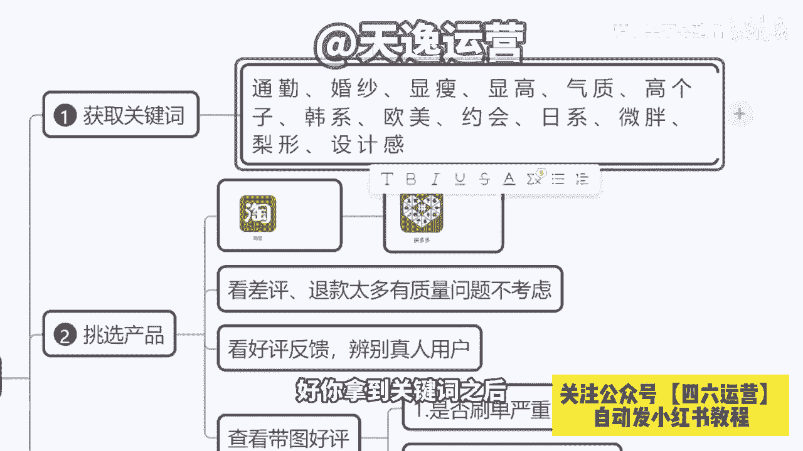

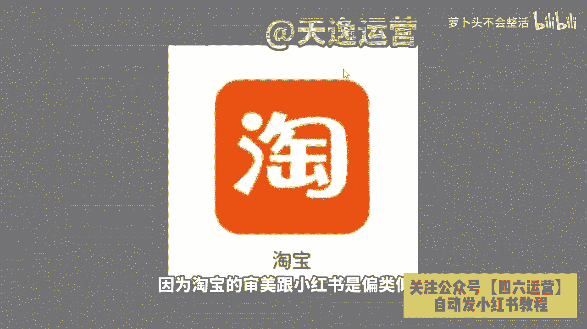

好，找到以后记住不用多多停留。你把那个图片保存下来，把那个款式的图多保存几个产品的图片上拼多多去搜同款。那么这个时候在拼多多它就有同款式，价格更低的产品了啊？那这个时候不能说我单纯看这个价格低。

我就跟他合作，是不是你要看评论那个买家秀是不是真的，还是说请的模特拍的假图。😡，或者说他差评多不多？因为我们新店有一个致命问题，你一旦退货率很高，会影响到你账号的流量。😡，啊，那退货率的原因是什么呢？

就质量你卖东西质量太差了啊，人家这个真的实在是受不了啊，给你退掉了。所以说我们得去看那个评论啊，你看一下人家的退货率怎么样，包括评论说这个东西质量到底好不好？如果说确实是OK的，就算价格稍微高一点。

没关系，我们就跟他先去合作，我们先把前期店铺评分拉起来。你的销量包退货率不高的情况下，后面我们的流量也会更大啊。好，那这个时候找到合适的产品，跟商家去联系，跟商家沟通呃，不要直接在拼多多下单，为什么？

因为你直接拼多多下单的话，人家那个商家帮你发货，那里面还有拼多多宣传单页，还有什么好评返现那些的，很尴尬的。人家用户一看啊，我在小说买的东西，原来是拼多多进来的。😡，肯定会退货，是不是？

所以说你要联系到商家，跟他发微信，跟他讲清楚。😡，你好，我这个产品要做转卖，我要做自己的品牌，麻烦您把发货人改成我店铺的名字。比如说你店铺叫小明之家，对吧？发货人就叫小明之家，地址无所谓。

地址是他们的就可以了啊。发货人改你的名字，然后包装和要求是没logo的，素的包装，里面不能放任何宣传单也跟他一切讲清楚了，商家是明白这个的啊，人家是知道人家做工厂都知道这个转卖的。好，O讲清楚了。

有的商家好说话，就直接你安排了不好说话，就说啊我们要收包装费，一个产品1块钱，那你就给就是了。对不对？好，O了，这就叫代发模式。那么代发的话，比如说一个产品，你代发的一个价格，找人这个帮你发货的价格。

可能那个产品的拿货价20，你进价的话，可能你去进货，囤货的话，可能拿货价才15啊，我就建议大家前期你就先做代发。因为你本身没有多少的一个启动资金，当我们收入高了，你的利润高了，你再去拿底价。

像我们那些同学卖袜子的啊，你自己去。😡，找别人代发一双袜子，5块钱拿货一双袜子，1块钱，这种你就可以进货啊。但是如果说这个价格差的不是很多，没必要进货啊，你就找人代发就行了。还更方便啊。

当你产产生订单之后，后台直接导出一个表格，对吧？啊，多少多少的这个多少双袜子啊，多少双这个产品多少多少件产品，然后地址是什么啊，你一次性把这个表格直接发给商家，让他跟跟他讲说您这边安排好发货之后。

帮我把那个呃就对应的订单号填到那个表格里面去，然后到时候你再挨个对吧？你往你那个店铺里面去输送，挨个去填就可以了。然后有一个问题啊，就是我们之后再。😊，传产品的时候会出现这个情况来给大家看一下。

就是比如说我刚有提到的一个货，像这个你看一下像这种东西，拼多多里我们找的商家，人家那个图确实因为人家成成本低嘛，对吧？人家不会说费心思做美工，把那个图片搞得很漂亮，他就个白底一个杯子，看到没？😊。

但是那些卖的好的啊，通常这个你看这个手啊，这个白衬衫啊，这个背景啊，这个光影啊，这个图就很好看，很美观是吧？那怎么办呢？我又想跟他合作，我又没有好的图片那这个时候可以这么操作货，我就卖他的货，图。

我从别人那拿那这个图你既然没卖别的商家，那个好看的图片的商家的货，人家不可能给你，但是我们可以用一些技术手段，对吧？我把他图拿过来啊，比如说我到淘宝我去找一下，哎，我看一下有没有卖这个产品的对吧？

有没有卖这个同款产品的啊，这个时候比如说我看你这样的一个床上四件套哇，好好看。😊，颜值好高是吧？啊，颜值好高。唉，刚好我在拼多多找到了同款的货，那么我是不是就可以用他的这个素材上传到我的店铺去呢？是的。

但是啊如果说有一点同学们，如果这个图你是这么复制粘贴的，是那么下载保存再上传的，还是那句话，你的代码是淘宝的代码。你传到小红书店铺之后，直接就违规了啊，直接就违规了。这个东西是啊这是给自己判死刑啊。

不行，对吧？它不是原图，是不可以这样复制粘贴的那怎么办？😡，啊，拿工具啊，拿我们的一个插件，到时候给你们啊，拿这个插件。你看我们直接在手机安装，或者说在你的电脑里安装上这个插件。

手机电脑都能用PC端就电脑移动端就手机直接有一个你看这个啊下载以上全部信息的按键。我点击下载以上全部它就会把当初商家在上传这些图片的时候采用的原图，没有淘宝代码的图片一次性给你下载下来。就这样的。😡。

你看几个文件夹给你罗列好，对吧？SKU图片呢详情图片呢123456给你排序好。😊，啊，都你排好，我给你们看这个图是不是真的原图啊，你在淘宝这里你都没办法放到那么大那么高清。我给你们看我这图。

这东西又不是我在卖的，这店也不是我的啊，就是咱们这个实实在在下载下来的。你看我放大。😡。

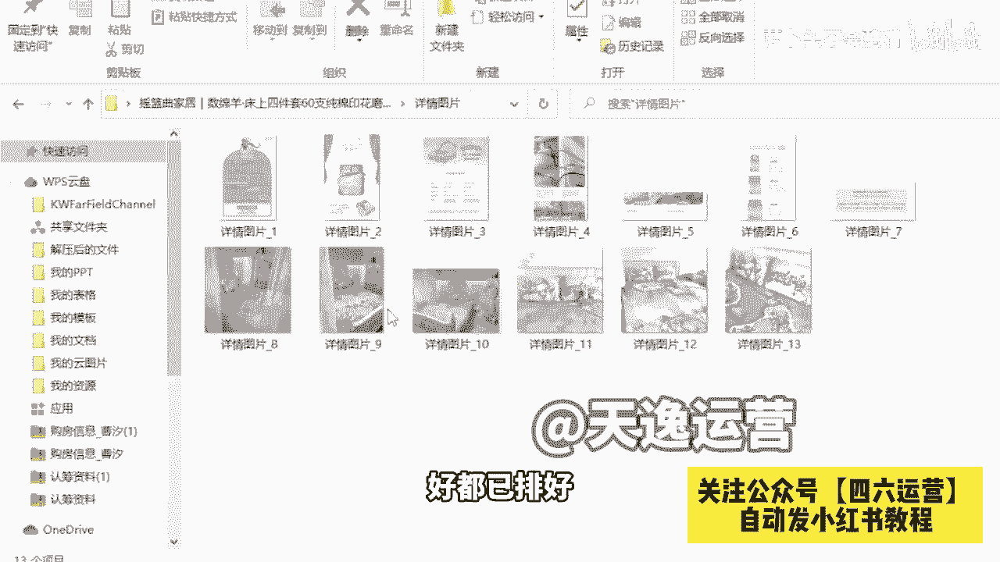

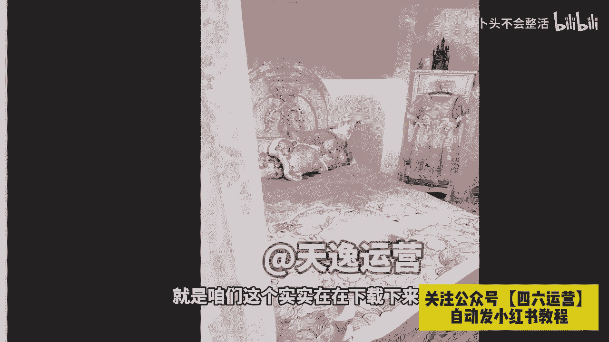

啊，我这还有电脑啊，你们在手机看的会更清晰。来，你看我放大，我再放大清楚吧。😡，为什么？这是人家真正的相机拍的原图，我们采集下来的啊，看到没？我还放大这个羊眼睛还这么清楚，这个抱枕还这么清晰。

这就个原图啊，就等于说我们拿下来的这个素材的话，它是没有任何代码的，是原创图片。那么你在小红书里面去上传的话，你的这个产品也会被判定为是原创产品的，是不会有任何流量限制风险的，明白了吧？啊。

我们就用这个AI我们用这个工具去识别，用这个工具采集就行了。无论是拼多多还是说这个淘宝还是说其他任何店铺的，你去找那个高颜值的图片来用啊。小红书对于这个审美要求是有要求的，尽可能找好看一点。

你看像这种拍的就很好看，很有意境，对吧？啊，我再放大，包括换一张图片，你看这也是一样的。我再放大一样是高清的。😡，我再放它一样是高清的，对不对？可以放到这么大来缩小这个图。

其实这个小羊抱枕才这么小一个看到没有？这就采集的是原图啊，采集是原图。那我们就可以做到第一个货我拿的又是便宜的是吧？图片我用的又是最好的啊，这个时候销量就不会有问题了，对吧？包括呢我采集下来，唉。

这个文件夹以后，那我到时候上品呢，我是一张一张图上吗？一张张传，那不是也很累吗，对吧？那也很累，你不需要一张张传，直接把这个我们会有商品工具啊，直接把这个文件夹直接传到那个网页就可以了，手机也可以操作。

电脑也可以操作，直接传文件夹上去，它会自己帮你匹配好啊，会自己帮你去匹配好，就是这样的一个方式啊，来O这个我们就解决了，对不对？然后店铺真的还是那句话啊，声音卡了吗？同学们其他同学卡了没有。

没卡扣数字8啊，没卡扣个8给我回复一下。😊，我这没卡呀。😡，嗯，好，卡了的，我们刷新一下啊，因为我是没有卡的。啊，我我实实在在讲啊，因为确实是挣钱的这个项目，我建议你们做，你们到时候做的越好。

我前面也说了，你店铺达到一定的销售额，我是有奖金的，我是巴不得你们多赚点钱的啊。所以说我给大家看一下，这实实在在我们一个宝妈啊，自己的一个心得体会，他什么情况呢？他是过年的时候直接辞职回家。

原原来人家是在要企上班的啊，他过年是直接辞职回家，现在全职在做小红书的，因为孩子在家里上学，你们可以听一下他的分享啊，这是他年前的时候给我拍了一个视频。他说老师我分享一下自己的心得。

当时在我们的学习群里发的，我就保存下来给你们看一下啊，你们可以听一下他的一个分享。😊，老师好，大家好，我先给大家汇报一下我的账号情况。我是跟小南老师呢做小红书快4个月了。那我呢最开始是做车载摆件的。

大概测了两个屏左右就直接出单了。这个呢是属于出单比较多。但是呢利润其实是比较一般的。我做了第一个月呢大概是赚了7000多的样子。后面呢又同时在做抓夹跟厨房用品的这种号。

一天呢基本上在稳定2000左右的利润。那我刚开始觉得做号的话呢，真的是要有耐心，赚钱呢不能想着说我不劳而获。那我每天呢基本上是做四个视频加两个图文这样子就能够稳定到这样子的一个收入。

我之前呢是在医药公司去做销售。大概一个月的话呢，到手也就才7000多块钱。但是在深圳生活的话呢，我感觉真的是不够的。平时买一个东西哦都是精打细算的。那我呢是准备年后回家直接全职做小红书风口。

有钱还是比较好赚的，所以大家一起加油吧。😊，啊，我觉得他这句话其实说的很好，这也是我当时我跟我的很多，就是之前我们大学生我在讲啊，我说这个市场它是瞬息万变的。不管是抖音还是小红书。

现在知道小红书越来越多，你看都上春晚了，对吧？知道人越来越多，未来做人越来越多，就果跟抖音一样，刚开始好做，很好挣钱，后面越来越难。😡，🎼这个东西是无法改变的，因为跟你竞争人越来越多了。

但是如果说我们前期储备好了。比如说你的店铺我已经有销量在这了，那那些后面听说这个平台好再来做的，人家是零销量，他是没有办法跟你去比的对吧？因为我们已经有储备了。所以说现在我们尽快的去把这个店铺做起来。

我们在有限的时间，我们去尽可能多赚点钱，这个是我给大家的一个建议啊。然后这个是我们的一个店铺的这个玩法，一定要做，必须要做，一定一定要做。因为做店铺的话，到时候我给你们开的这个店铺的。

咱们是有平台的一个流量推送流量扶持的。流量是要比正常别人开的店铺更大，人家开的普通个人店铺，那是完全流量，他都进不来，平台压根不推流的。😡，既然我们说到这个工具，我把商单也跟大家介绍一下。😡。

商单的话是开店是这样的，开店是属于细水长流。你第一个月下来，可能一天我就四五个订单，四五个订单。后面随着我的粉丝的增加，看到我作品的人越多了。然后我的订单慢慢的增加了啊，51万2万我的收入这样去叠加。

它是有一个过程的。但是如果说接单他跟你的粉丝数真的有什么几万呢，你的浏览率啊，你的这个播放量没啥关系。就是只要有1000粉就能开始挣钱，每天都是有单子的。然后像这种的话呢，如果说你们去做第一个月啊。

收入不会低于5000块钱，有多少人想了解商单，想了解的我们扣1，想了解的多，我就拿到前面来跟大家讲，跟这个AI工具我结合在一块去跟大家讲掉啊。😊，想了解吗？OK想了解是吧？好，那我来说一下啊。

商单是这样的，来，我们看一下啊，这个商单到底是个什么东西。我们带货其实大家大纲也知道了啊，商单呢就是一个广告。😊，你发作品给别人的品牌打广告，就不是说卖自己的产品了，而是帮别人的产品打广告是吧？

那这个时候呢，它是有，比如说我是蓝天牌牙膏。那么我作为商家来讲，我就先到小红书的官方平台，叫做这个蒲公英商单，叫蒲公英的平台。然后呢，我去平台发布任务。😡，这个时候你的任务是有价格的。

比如说它的一个价格是600，你不是说可以拿到600的啊。小红书人家分走的钱很高的。比如说他人家拿600块钱，对不对？小红书要分走300元，作为平台的费用。你用我的平台宣传，我要收平台费300元。

然后你的费用呢也是300元啊，你的费用也是300元，这个就是蒲公英商单里面它的一个模式，那如果我们成为了蒲公英的认证的接单，就是认证的写手，这个叫做一个写手的一个身份啊，给大家看一下。😡，写手也叫编辑。

你叫编辑，其实这个模式它并不是对所有人公开去招标，公开去招募的。就比如说我今天我啥也不是，对不对？我有1000粉丝了，我是不是就一定能够开通这个普通易商单了，并不是的。他作一个写手和编辑来讲。

相当于说是小红书平台对外招募的写手，你是来帮小红书写文章的那他对你的要求就跟你去找工作面试是一样的要求你是某公司。😡，在职在职或者说曾经任职过的。😡，编辑。你是某个传媒公司的编辑，或者说是品牌的运营。

😡，运营你是有这个工作经验的啊，然后以面试的方式，他不是不用跟你面谈啊，就微信上聊啊，觉得说okK你有这个资质，他就给你开通这个权限。😡，啊，但对于大家来讲，现在其实也没有，对不对啊？但没关系。

这个到时候我们可以给大家去处理啊，一样的，以我公司员工身份直接给他报上去就可以了。那么达到1000粉之后，你就可以在这个平台看到大量的订单，我们就可以去里面选择你想合作的商家啊，他们会对外去招募。

或者说当我们在平台有携手的身份，有认证标志以后，商家会主动来找你，他会直接私聊你跟你去达成合作，这个都是有的，是这样的一个方式啊，大家应该也知道了哈，对不对？那么我们看一下他的体验呃。

他的展现形式是咋样的。我们其实今天在小红书看到的很多这样的一些达人，就好比如说这种同学们看一下啊，这个曝光黑名单，热门美容仪别踩坑了。你看他跟你介绍了一大堆美容仪。然后呢，告诉你该怎么选，是不是？

然后跟你讲了很多牌子，大家能看出来这是哪个品牌的广告吗？😊，能看出来吗？😡，是不是好像看不出来哪个看不出来，对不对？是这个啊，第一个赔持。😊，啊，因为大家不了解美容仪啊，就是其他都是品牌。

你们呃你们可以这么理解。😡，啊，其他都是品牌，只有第一个是杂牌。只有第一张图是杂牌，他这个广告写的很好啊，就是他把一个杂牌跟其他品牌货全部放在一块儿。😊，然后让你误以为这也是个品牌啊。

评论区他这个互动下单了赔驰飞驰，是不是？😡，这个就是他的广告啊，我跟大家讲一下，你们在小红书看到的所有的盘点，不管是什么品牌，是个美容仪也好，是个剃须刀也好，是个香水也好啊。来，我们看一下香水。

是个香水也好，是个狗粮也好，没有人会闲的没事干，给你做测评。来，我们再打开小红书这一个界面。你看这么多品牌，难道说真的是这个博主，他自己自费掏腰包，买了这么多香水回家去闻嘛，然后给你写总结吗？没有的。

😊，没有的这就叫商单，这就是商单。来，我们看一下，就好比说这个账号啊，看过这种类型的没有情商账号就是他的所有作品呢是在跟你互动啊，问你说啊，这个呃比如说桌上有5个领导，你手里呢有4支烟。

请问怎么发烟才能让让5位领导满意，对吧？好，这时候评论区就开始互动了。因为大家看到这个问题开始集思广益，还是回复了啊，好，你的账户活跃度不就起来了吗？对吧？浏览率不就起来了吗？好。

那这个时候你粉丝上来了，你就能接广告了。你看啊，就这样的一个情商号中间夹杂了各种广告。来这个烫发护理的。😊，这是一个商单是吧，他是不是真的自己去烫发，跟着跟他分享，没有跟他没有关系的，是不是？

然后还有呢防晒的。😡，定妆喷雾等。啊，面膜的看到没有是吧？然后呢，这种药的。😡，🎼以及狗粮的啊，狗粮的这都叫商单，他不是说闲的没事干，做了这么多测评，这个测评都不是他自己做的啊，这就叫商单。

大家理解了没有？这个就叫做商单啊，这个叫商单。😡，🎼Yeah。那么这个单是什么样的一个情况呢？单子分两种，一种呢叫做。直发订单。直发订单就是你不用写文案，不用找图片，商家全部提供。😡，全部提供。

就像这个一样来，我们之前有很多新手刚开始做的时候都接这种单啊，因为这个单虽然很便宜啊，我跟大家讲，这种单不怎么挣钱，一个单100150100块钱，150块钱那种。😊，嗯，给大家看一个，诶。

我找一个之前有做商单的同学啊，找一个给大家瞧一下。

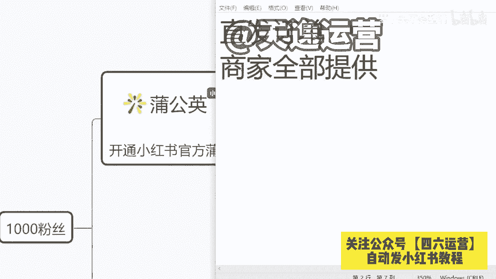

来这个曾林慧的，我给你们看一下，我这个学生给我发了啊，好多图片，这是最早在接单的时候，我都有记啊，就他每个单我都会记记录。然后你们看一下，这个是之前你看这个有没有档期合作，他这个是怎么讲的。

你看下午写好图文发给你保子啊，这种我就很便宜，然后商家会直接给你安排好一切，因为他们有自己的这个品牌，有自己的品牌圈发，他会写好给你，你负责发就行了。但这个很便宜啊。

因为你只是个工具人都要帮他发一下就行。100块150块钱，钱不是很多，然后这个叫直发单，你什么都不用干啊，但是由于现在订单竞争人数肯定是越来越多了，未来做这个行业人越来越多，你如果说没有写作能力。

没有创作能力，只会做直发的话，你未来是没有市场的，因为他找谁发都行，对不对？但如果说未来我们的账号，你的认证里面认证的身份是原创达人。😊。

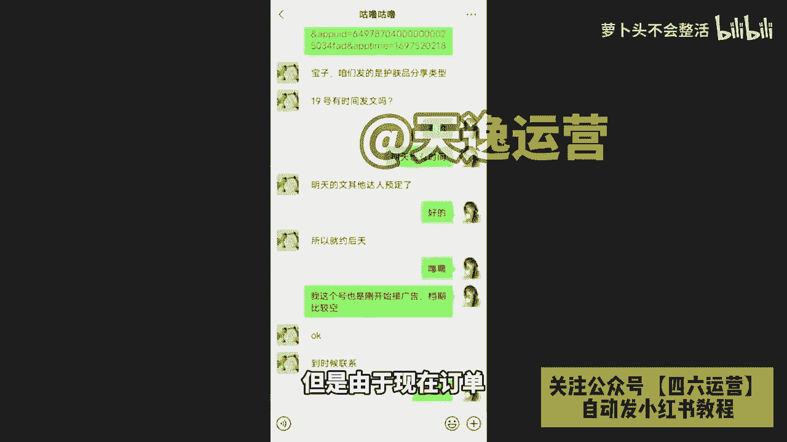

原创达人，那么你的价格就不一样了，你的价格就不一样了。如果咱们是1000粉丝数啊，那么你的单价最起码是310条，310条就是原创单是310条啊，你个别想打价格战的，你设个250、260240的也有啊。

但是通常300块钱是均价。那如果说粉丝越高，价格也是越高的。你们可以看一下他后面啊，他后面价格完全不是这个数了然这么多广告啊，当时跟我讲的，你看他说我跟韩数运营说了，晚上给大家发，他同意了。

现在是接到韩束的一个订单，一个订单是2000多块钱。😊。

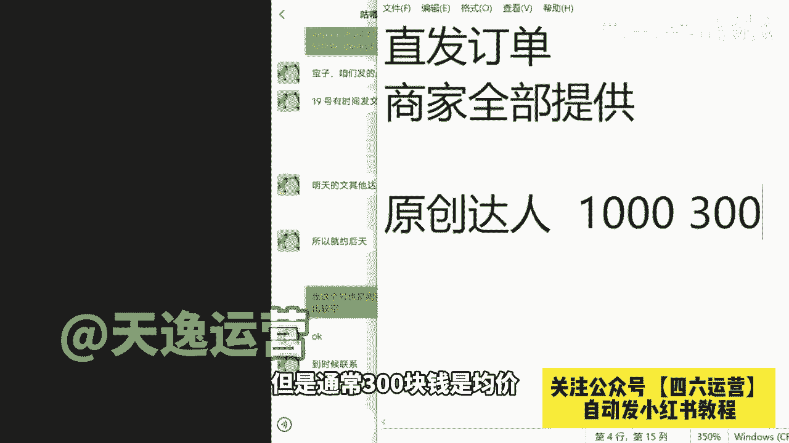

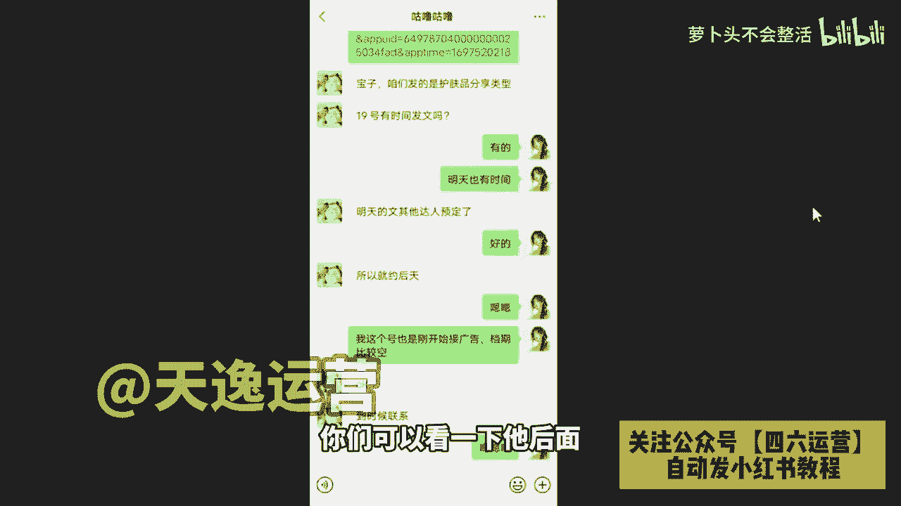

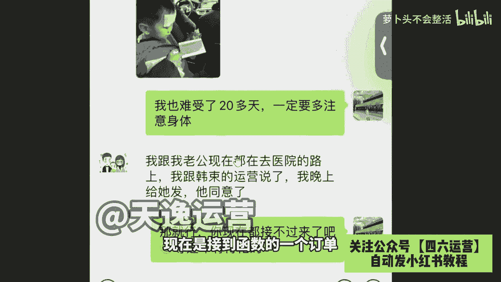

我给你们看他从过年啊，这个图是过年前截给我的。然后到目前我估计他单子应该还在叠加。他当时跟我讲说，过年不出去串串亲戚了，不去任何地方玩，就在家里。😡。

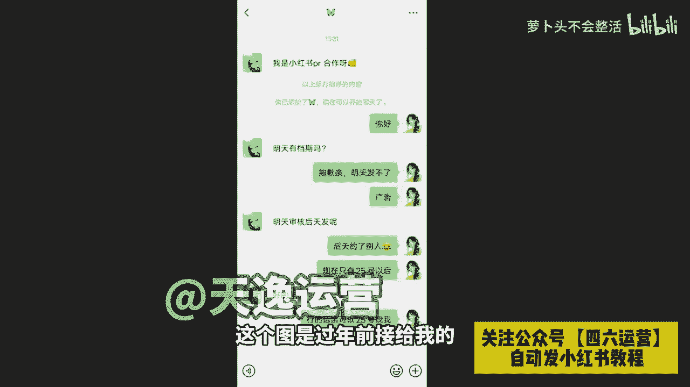

发作品。看到没有？待接受79条，他那个时候啊才月初的时候，当月收入已经累计到7650了，就接都接不完的状态啊，这个就是蒲公英商单后台，看到没有？蒲公英商单后台79个待接受进行中8个。

就是我算他一条400500来讲，5001条来讲，你们自己算一下这是多少钱。😊，啊，因为现在小红数平台广告越来越多啊，我们现在手里头囤了好多，就是我们得完成，不完成的话，有个违约金什么的。

或者说这个单子就派到别的公司去了啊，所以说我巴不得让你们去接。😊，巴不得你们来接啊，巴不得大家来接，巴不得你们来去承接这个东西。然后如果说价格高的来，我举几个例子啊？如果说做原创啥意思呢？

就是图片可以找商家要，但是文章我们自己来写啊，因为商家写文章很费时间，或者说图片我们也可以自己去找，自己去做，你们看一下啊，我拿一个那个这个是其他公司的，我来跟大家讲一下啊。

这个其他公司的一个号都注销掉的，我当时看到这个号的时候，我特别我就得特别心疼。我当时我在想，我跟我们团队想要不要咱们花钱去收一些那个不挣钱的账号过来啊，你看一下啊，这个粉丝数初级达人啊。

为新约这个号注销掉了，因为不挣钱，别的公司的啊6000啊不算因为不能说是别的公司的可能就是一个小白座号啊，突然报号了，但是不知道怎么挣钱。你看啊6898个粉丝数，截止到2月18号啊。

这个18号过去很久了，但这个数据因为他他是呃半个月更新一次啊，然后现在还没有更新来6898看到没有？那么他的一个接单情。😊，况什么样的？近30天来我们看他投放评估啊，就他那个单价多少钱，150。

我记得你看到没有？150，因为他没有原创能力，他只会直发。然后他是一个单都没有的。近一个月啊，一个单都没接到是吧？你没有原创能力，别人凭什么拿单子给你啊，我凭什么送钱给你，我找别人不行吗？对吧？

别人还有100块的那近60天我们来看一下，就等于说两个月以来，他注销号之前接了单没有，就接了4个。😊，还没就借了4个，对不对？就借了4个150，接了4个多少钱，800块钱吧，还600块钱，600块钱啊。

是不是这个很少的？但是我们看一下同样的差不多那一个粉丝数啊，来这个啊来我们之前一个学生这个号的话，粉丝数会稍微多一些，7000多啊，这个不是啊，来，稍等这个。😊，来这个5177个粉丝数，看到没有？

5000多粉丝数，粉丝数没有别人多啊，但是它单价完全不一样。5000多粉丝数做原创。因为它这个是有原创认证的。你看样式素人，湖南长沙未签任何公司都是普通人是吧？

自己有自己的本职工作就副业做一下这个小红书的700元的一个报价，同文报价700块钱一条，然后他的单子是多少个单月就这个就这个月的这个统计啊，不是说这个月啊，是从今天起，从今天往前面数30天。

它是近30天数据，从今天起往前数30天37个订单，37个订单，然后呢，是700元的报价，来我们看一下37个订单，700元报价是多少钱啊，这是他这一个月的一个收益是2万多块钱。看到没有？

这完全是两个极端的这个效果，所以说原创很重要，那我怎么样去写这个原创内容呢，我们拿这个AI刚刚我们讲的这个AI来写，对吧？你直接点开种草文案，我们就说刚才的那个。😡。

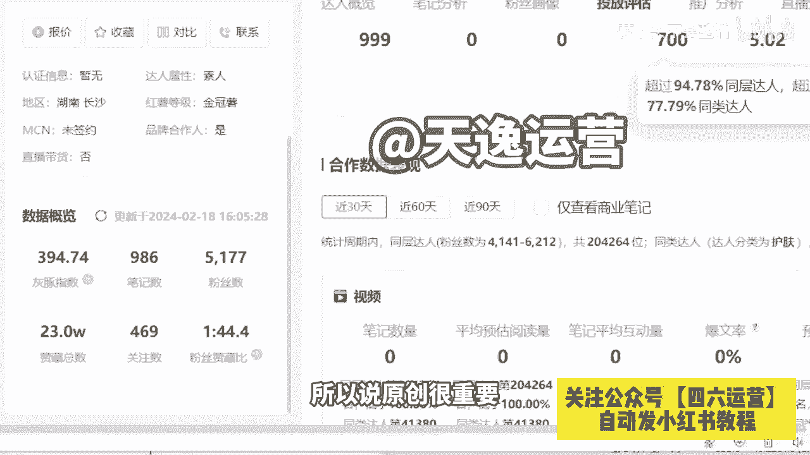

美容仪。因为很多同学说老师我是男的啊，我是包括我是女生，我都不用美容仪，我根本不懂这个东西怎么办？我怎么写，人家要求我写250个字的产品描述出来，我不会。😡，来平，那我们就选美容护肤，对吧？

我产品我选什么啊？我选来美容仪。😡，对吧当然啊关于产品描述这一点，你要找商家给你连卖点出来。就是你要问他这个产品的功能是什么，让他把功能告诉你，你把功能填在后面，我们时间原因我就不写那些东西啊。

然后我们来点生成，对不对？这个时候语气也是一样的，你要去根据自己的需求来选，我是道友好了还是怎么地的啊，一般我选友耗比较多。那么同样的，我们点生成，这个文章它会在几秒钟的时间立刻给你写出来。😡，来。

你看就算他就算你不懂美容仪，没事儿啊。你看这里亲爱的护肤达人们给大家种草一款超级神奇的美容仪，你是否在为肌肤暗沉、细纹、痘痘烦恼？这款美容仪可是你的啊肌肤救星，看到没有？功能直接给你拓展出来了。😡。

首先其次最后来你看啊首先呢提拉紧致，深层清洁，美白亮肤以及搞定是吧？什么导导入导出技术啊，能帮你吸黑头，吸毛孔啊，还能帮你把这个好的乳液给你导入到皮肤里面去，是不是来你看我对这个不满意，我再点换一换。

它这个很细节，表情那些都给你选好了，对吧？卖点给你罗列好了，这个第一个好的点是什么？第二个好的点是什么，对不对？还告诉你啊，这个采用先进的声波振动技术红光模式啊等等。来，这个东西好不好用，好用。

咱们扣3个6，我看一下啊，好用，我们去扣3个6。😊，是吧你不需要你说我我不懂这个东西啊，怎么怎么地的是吧？我不懂这个产品，那没有关系啊，他会帮你写是不是他会帮你写啊，来包括像这个产品除外的话。

我们之后去做其他类型也是一样的。比如说我要做的是一个这个沐浴露啊。我要卖的是一个多芬沐浴露，你把牌子写上去都行，来沐浴露是吧？一样的，我直接让他给我去生成这个文章，同样的帮你来写。

而且每一次我们再点击换一换的时候，他生成的内容都是新的啊，都是完全不一样的。如果说你怕错过好的文章，那我每次生成之后，你把这个文章呢先复制保存到自己的那个手机里面，保存到一个文件里面啊。

保存到一个这个文档里面，然后呢再点换一换再生成新的，到时候生成好几天之后，我们选一个合适的啊，然后呢再去发给商家去审核就行了。然后但是这个东西呢，我们不能去跟商家讲说老板你让我来接你的单吧，我有工具。

你不能这么说啊，你要接单时候怎么说，你拿到人家的。😊，任务之后，你等那么一个小时，一个半小时，你再把你选好的文章发给他啊，表现出一个真是咱们自己写的感觉。他如果说哪里有问题，咱们再做适当修改就行了。

那如果这一篇他说不行，换一篇，我再过一小时，我再拿篇新的，立马又发给他。😡，是不是我可以说到最最起码一点，这种水平，这个文章写出来的一个效果肯定是要比咱们自己去写的效果要好很多的。😡。

你这个东西写出来是要超过很多这个素人小白自己写的文章的，而且人家效率很低，对不对？那这样的话，我们接单是不是就不会担心了啊？那这个老师那既然接单的话，我要1000粉丝涨这1000粉丝难不难？😊，啊。

我涨这1000粉丝难不难？呃？首先我跟大家说啊，我们到时候去做这个接商单的账号的话，我不用说我指定就做一个类目。比如说我这个号只发沐浴露，我这个号我就只发什么这个狗窝呀什么的，这个不是这样的啊。

你发啥都行，你发像刚才的那种情商也可以。😡，是吧然后你去发一个什么科普的那个作品也行，你去发一个这个影视解说都行等等啊。你去发一些这个语录合集啊，或者说搞笑段子合集都可以。就是只要我的作品是能有人看的。

不管是发啥类型，只要你的粉丝达到了1000，你的账号没有限流状态，我们的播放量是O的，那么你就能够去达到这个平台的审核要求。然后这个认证的话，我会帮你们开啊。因为像相当于说我前面也说了。

我是属于你的代教人，那么如果说这个单因为我们手里我们手里是有很多资源的，如果这个平牌方的一个单子是我们派给你的对吧？那么你该拿的那300会不会分给我一分钱不会分给我。

因为本身你跟平台的平分的这个单价就是300跟300，你300平台300。那么如果说这个资源，这个单子是我给你提供的对吧？你这位达人是我介绍到平台的，那么平台的300元里面会分给我50。😊。

分给我们公司50，这个钱跟你没有关系啊，就我们不会从你的获利里面去抽成。这个钱是由平台去分给我们的啊。所以说其实我们也相当于一个合作共赢的方式，你来帮我消化资源，你来帮我完成这个任务，完成这个呃订单。

那这个时候你能挣钱，我们也能获利，对吧？我们是走量，那你靠多接多赚钱就可以了。😡，是这样的，一0粉的话挺好涨的啊。一000粉的话，基本上我们到时候会给大家去做定位。一000粉的话。

7天10天左右是完全OK的啊。我们基本上其实三四天左右的时间是可以的。我给你们看一个吧啊，我们之前有学生做健身教练的。😊。

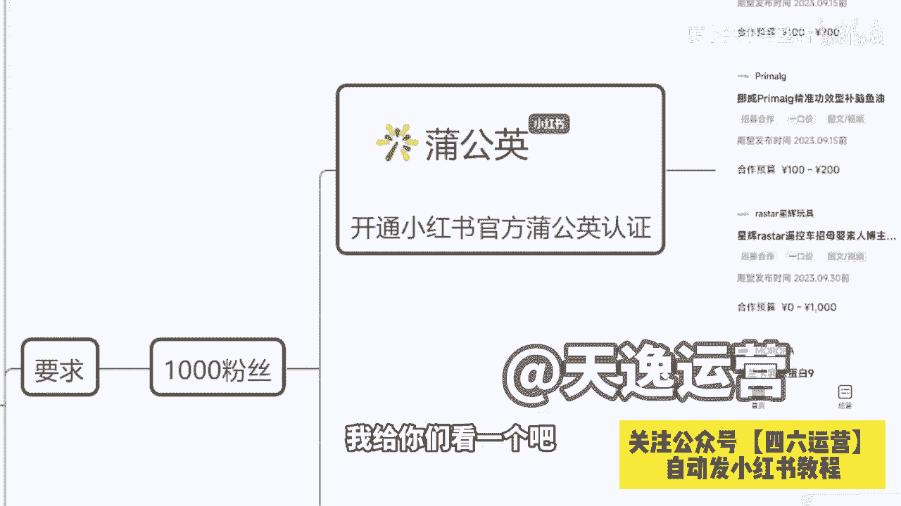

他是这样的，他是做了影视解说，但是说实在的，我不建议你们做影视解说了啊，因为他是去年的你们现在做影视解说已经市场太做太多了。但是我今天不会在课堂里面去给你们建议说你一定要做哪个类型啊。我但凡说了。

咱们今天课堂几百号人啪啪全是做一个类型，你再做也不可能了。所以说这个我们以后私下再做定位，我们一定会把好做的类型，我们私下里给你一个人，每个人的类型是不一样的。所以说这个不要在课堂问我说老师。

你推荐做什么啊，我不会回答的啊，这个东西不回答啊，然后但是呢这个视频视频解说影视解说确实不建议做了，因为做人太多了，来，你看一下啊，他之前是做过抖音，做视频号没有效果的。

因为他只是做给他们自己健身房引流嘛，对吧？拍一些自己的那个健身视频啊，腹肌啊，这个胸肌什么的啊，然后但是呢他。😡。

呃，其实这个大环境的原因啊，办健身房办健身卡的其实越来越少了，就大家很很难说再愿意去花一些额外的这个消费，去提升自己的生活品质了，对吧？更多愿意啊还不如在家多买2块排骨。所以说其实他们生意不好做。

就跟我讲说想转行啊，做一下试一下别的这个项目。然后后来你看啊他的涨粉是怎么的，你看下午昨天下午开始发视频，下午到晚上发了3个，今天早上涨了几十个粉丝，今天又发5个作品，现在是1200个粉丝了。

所以说其实我们只要去抓住流量密码，我们是知道流量密码，这个东西很隐晦啊，我不能跟大家直说，就我们知道是发什么可以的，因为像我们作为平台的这个账号孵化来讲，风化的运营商来讲，平台比如说他需要什么内容。😊。

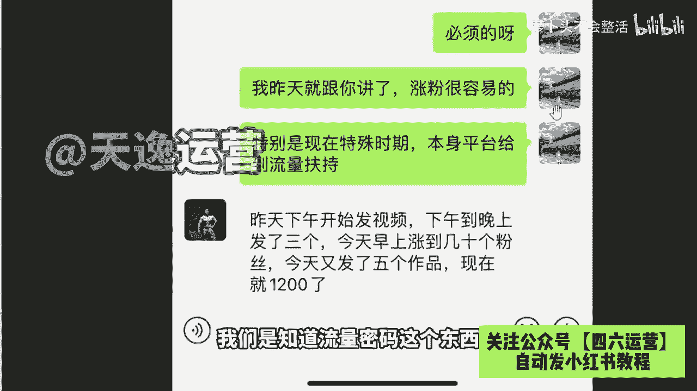

啊，哪个板块是缺的，他会给我们发微信的，他会跟我们讲说啊，你这边这个月或这个季度给我们提供几个什么什么品类的一个账号。OK他给我发了这个信息之后，我就跟我们自己底下学生讲，说你们去做这个类型。

是这样的啊，我们会直接给大家去安排啊。然后这个就是属于一个商单的形式。来，我给你们看，就刚才这个人啊，就刚才这个同学他现在接单价格很高的啊，你们一定要你们可以向他看齐人家也是在过年的时候没少赚啊。

没在过年的时候没少赚7681个粉丝，笔记数量33个啊，然后单价来你们看一下1800。😊，你们不要觉得说他挣的多或者怎么样啊，人家都是AI做的，都是AI工具做的，没有说他能力有多强，全部是AI生成的。

然后另外还有一个就是你们之后做商单想多挣钱的一个玩法啊，一个小的这个建议给你们，就是我们刚才那个宝妈她在做的。你们会发现我给大家看的几个聊天记录，她的聊天记录的头像不一样啊，对她头像不一样。

人家好几个微信，他怎么操作呢？首先他自己的那个小红书号啊是有4个。😊，那么他今天拿这个微信跟这个商家聊完之后，签下了这个订单以后，拿到钱之后，他换一个微信再去加那个商家说你好，我这边有个千粉号。

你需不需要合作？😊，啊，拿AI反正生成又不一样的文章，对不对？又是一篇不一样的，又找这个商家再合作一遍，再收一次钱。😡，啊，直到没耗了为止。😡，就这个方式说实在的啊，你们也能干。因为本身我们确实有耗。

他就是能够挣钱的。有这个资源，有这个商家的一个资源之后，把它物尽其用啊，用到最大化。😡，🎼用到最大化就可以了啊。然后这个的话就是我们之后可以去做的一个方式啊，所以说人家为什么能挣钱，对不对？

为为什么人家挣的多，一个月最起码两三万的一个收入号多啊，人家是直接是一个订单接到，一直接到接不接不了为止的啊。😊，然后包括还有一些玩法啊，这个我就简单跟大家说一下。因为今天时间原因。

包括后期呢可能我们做这个的会比较少，就是做商单和做店铺的话会聚多呃，给大家讲一下什么叫思域。比如说你自己有产品，家里有茶叶的。😊，是吧有这个在莆田的啊，在深圳南邮的对吧？有点什么假冒假鞋的啊，可以去卖。

对吧？做微商，这是一方面。另一方面呢，我相信大家其实也在呃我跟你们讲一个叫空手套白狼的玩法啊，这个简单跟大家说一下。😊，什么意思呢？有没有在小红书看到那种卖学习资料的？😊，看过没？

考研资料啊、英语四6级资料啊，小升初、初升高的学习资料啊，现在K12不是取缔了吗？不能办补习班，对吧？很多这个呃孩子家长啊就是在网上搜各种资料，各种考试题啊啊网届历届考试题给这个孩子去看。好，这些都有。

那么这个东西他要不要花钱肯定是要花钱的。你就看这种东西啊，给大家看一下，我找一个类似这种的账号给你们瞧一下。😊，比如说他又有这个资料啊，来这里。卖考研资料啊，或者说这种你看考研英语资料分享。

我就拿这个来说啊，我们就拿这个作品来讲，你们觉得它是免费的吗？同学们，他这个分享是免费分享吗？😡，不可能免费啊，对吧？有句话叫知识不付费，永远学不会啊，天下没有免费的午餐都这样的。现在是知识付费的时代。

就是你加到他的微信之后，真正他直接告诉你说哎，你要什么资料啊，好，你说了之后594939收款码发给你付钱吧，是吧？或者说有更贵的啊，更贵也有，因为这个资料其实他们那种正版资料买过来。

估计23000块钱左右。我们这边也有，然后他们在卖的话，就几10块钱往外去卖啊，我们现在有好几个学生在做这个东西，因为如果说你要做这个私域的话，对于你的时间要求很高，就是比如说你动不动要回微信消息吧。

是不是啊，有人加你微信，你得去回复，人家要买，你得给人家发收款啊等等。啊，所以说这个适合时间多的，比如说你在家全职干的呀，或者说是学生的呀，可以啊，我觉得有学生叫廖勇，然后他是在那个汉口学院。😊。

武汉上学的啊，学的是那个土木工程专业啊，然后他就是属于每天呢就卖卖这个学习资料啊，做他之前做的小升初初升高的。然后后来现在是呃改了，跟我讲说想卖一些那个英语考研英语资料什么的啊。

你要之前搞一个月搞7000多块钱呢啊，这个东西是零成本去变现的，是不是这个资料的话，我们现有你们到时候要的话，直接发给大家去做就可以了啊，这是一个方式。然后还有几个我讲一下这个本地市场引流。

大家知不知道什么叫做团购套餐啊，知道吗？团购套餐，美团里面有对吧？这个抖音里面也有，比如说我出去吃饭啊，我吃个火锅正常我直接付款的话，380，但是如果我再买个那个团购套餐，同样是这么多道菜200多块钱。

😊，有吧，是不是买个奶茶喜茶啊，19。9块啊，然后呢，我买那个团购套餐券的话呢，只要12。9块，就是它会有这种折扣。😡，那为什么会有这么多人在宣传这个东西的？

而且你点进去他的账号发现他跟这个品牌也没啥关系。这种呢就是推广号，那我们也是可以做这个类型的。😡，我们也可以做这个类型。因为小红书它是要向抖音看齐的，任何抖音有的玩法。

小红书必然要一模一样的照搬都来一遍啊，所以说因为我们现在已经接到通知了啊，我们是今年接到通知的，给大家看一下，包括现在已经有这样的一个信息，小红书美团来势汹汹啊，要要做本地生活趋势啊。

就是要做这种无论是餐饮、娱乐、美妆等等啊，要做到这个线上平台来了，把这个折扣券优惠券做起来，所以说我们接到通知，所以说我们的这个工具呢也更新了这个方式。😊。

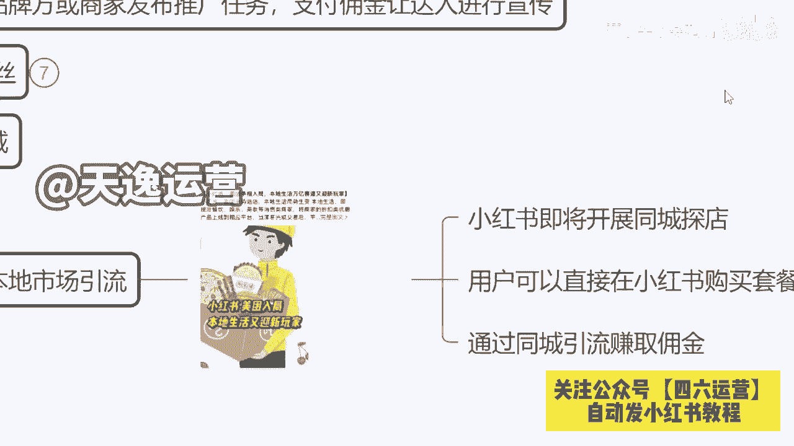

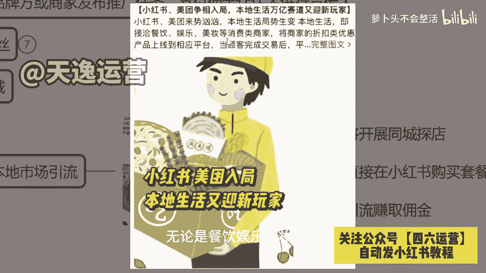

啊，来给大家看一下啊，就是这个。😊，种草文案之外对吧？有探店文案，我们之后无论是做哪个城市店铺啊，就是你不用说哎我在呃这个长沙，但是呢我在那个街道的一个任务呢，它是什么呃，这个郑州的，没关系。

你的定位是可以随意选的，是可以随意改，到时教教大家怎么去改这个定位啊，你直接定位到那个城市，那家店铺的定位就可以了。然后信息把那个店铺名称写好，营业时间等等，填进去感受评价，大众点评里面到处可以复制啊。

然后探店环境等等一写，对不对？好，点击生成，它会自己帮你写一篇探店文案出来。😊，然后像这个图片的话，第一也是很好找啊，像这个大众点评啊，美团里面可以去找这个图片是吧？

或者说呢可以找商家给你提供都是可以的啊，都是OK的。然后这种价格的话呢，它是他是没有写做的一个费用，就是他不会说因为你写的这个文章给你钱，而是你有佣金。比如说我卖的套餐是200块套餐。

你能拿10%的佣金，就比如说你能分到20块钱，是这样的啊，是这个意思啊，现在做这个东西的人，你们到时候去做，也是第一批是螃蟹的人，最早一批在做的。因为没啥没事知道这个玩法，没事知道啊。

小红书毕竟它现在还没有上线，到时候一上线，我第一时间通知你们，你赶紧做就行了啊。还有一个呢是旅游攻略。包括现在你们在过年期间看到的这个哈尔滨很火，对吧？哇那么多人在推广哈尔滨，我跟你们讲啊。

放大你们血量的双眼。😊，去找一下那些推广光发景，没有人的自拍的光发景，没有一个人站那拍照的啊，那很有可能，包括那个文章写的天花乱坠，写的可好了，跟你一顿夸的那绝对就是收了钱的，绝对是收了钱的啊。

因为现在这个单子可多了。😡，张家界呀啊这个什么武功山哪啊北京的这个环球影城啊，是不是我们街道太多太多了啊，就是我们现在很多就人在发，它跟地区有关系，有的这个当地旅游旅游局啊，给的这个钱多的。

有一条500的，给的少的一条就三四百块钱左右，然后一样是可以直接生成的啊，这个旅游攻略可以写景点打卡可以写对景点的点评。比如说我我这就给大家写哈尔滨啊。😊，哈尔滨，我填进来对吧？游玩感受啊呃游玩感受。

咱们这个就随便写一下啊。😊，有趣。😡，好玩，你当然不能这么敷衍啊，到时候咱们还是要多写一点来点生成。那么他会把这个比如说这个地方啊，它的住宿怎么住宿，交通怎么交通，对吧？我吃东西哪些东西好吃？

你看索菲亚教堂不可错过的，还有中央大街啊，夜幕降临，我在松花江畔等待一场震撼的冰灯秀，来看到没有？这东西厉不厉害。😊，就这样的，他能直接帮你写。包括如果我对这个我不喜欢一样的，我再去生成一个新的。😡。

🎼是不是我再上上上新的，这个是目前啊我们都可以去做的。但是由于呢他肯定是没有我们前面说的那些那么赚钱。所以说我就简单跟大家介绍一下啊，玩法还是有很多。😡。

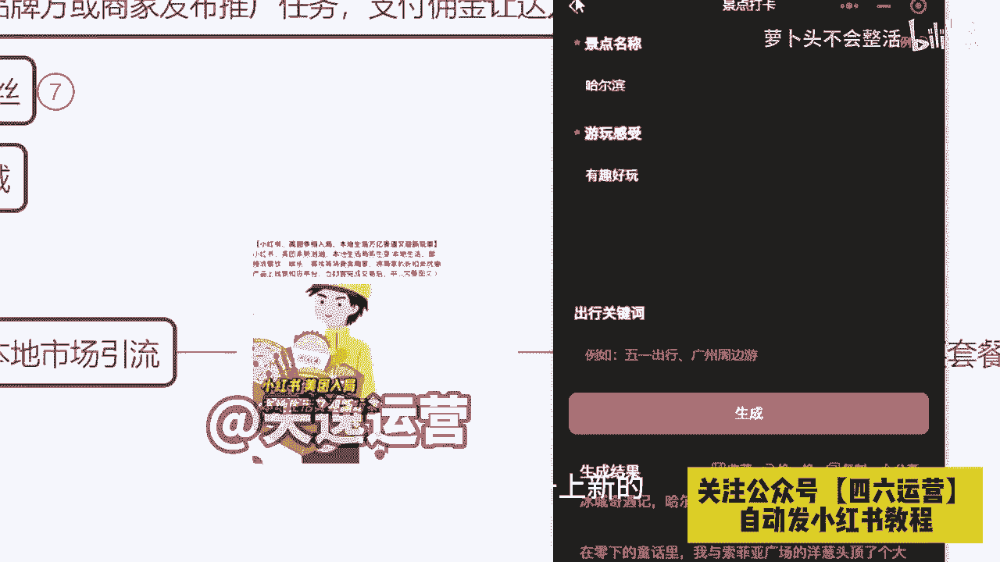

🎼Yeah。来跟大家做的一个这个分享。因为是这样的。其实我我讲句实在的，时间不就是成本嘛，对不对？现在小红书上这个上春晚还不够明显嘛？这是流量的一个大爆发时期啊，就是如果说你们是自己去摸索的话。

你简直是等这个平台爆发期过了我会了，我明白了，我懂了，市场跟你也没关系了啊，对不对？所以说我们如果不会方法的话，第一个效率很低。第二没有工具的话呢，你也不可能说做出这么好的作品也不可能去赚到钱。

包括没有资源，店铺你开不下来，没有流量推送，然后包括你想去接那个商单，你连平台的那个审核都过不了，就是都没有人去帮你交资料啊，你连这个门槛入门的这个门，你都不知道在哪走，别说敲门了。

你连那个门在哪咱们都不知道，对不对？所以说相当于说我是带大家上高速，因为我的想法是这样的啊，我知道我听过一些同行的课，他们有人讲完之这个老师确实挺厉害。有这个两把刷子啊，但是他后面跟你卖课。

他说啊你来买我的这个课，我一套课1万块钱，2万块钱，你来买。然后跟着我来学跟着我来听课。就这个东西我们之前考虑做。😡，这个事情我这个我们这个教务们跟我说过这个事情，我说我不要开课。

我说我不去我不喜去讲课。我为什么不直接把这个计划给你规划好？因为是这样的，你跟着我来学这个东西，咱们是来学挣钱的啊，不是说我来学语文数学的。所以说我的计划是这样的，你钱就未来从今天从明天起啊。

你未来的1到2个月时间，我不希望你有太多自己的想法，就是如果没有货的情况下，你没有产品的情况下，我让你卖啥你就卖啥可以接受吗？我让你做什么类目就做什么类目。因为我们是自己测品测了之后，确实可以卖。

我才让你去做这个东西，如果说你在测一个新的品，时间太长了。😡，啊，我可能等不了。所以说做什么领域，我到时候挑大概4到5个，我给你选啊，我肯定会尊重你的想法。我说这四个当中你觉得哪个你更喜欢更感兴趣。

我们就做其中的，或者说你说这四个我都做，对吧？我做好几个号可以啊，然后发什么内容素材带你去找。😡，包括你到时候所的作品文案标题图片找完之后，你必须先发到我微信，我先看了，没有问题，我说可以允许你发。

你才可以发，不要贸然发布。包括你在接商单的时候，如果说啊你把这个文章发给商家，那个商家说不行，这个不通过，你直接不要说自己在那乱改，你把你的文章发过来，你告诉我商家，你的反馈是什么？我教你怎么改。

改到可以通过审核了，O再去做。因为你能够接到这个单，你能拿到这300块，假设是300，那我有50啊，你能拿500，我们大概有80左右，我也想挣这个钱呢啊，所以说我帮你改，我教你怎么去改。

直到可以通过为止啊。然后另外呢我们的这个发布的黄金时间。😡，对不对？我给你定啊，还有产品标题等等，黑科技直接去搞。就是我们直接来相当于说我在上面写标准答案，你在下面抄就行了。

我们在前期先把这个账号做起来。不然如果说第一个月第二月全在那学，光是学东西，人是有惰性的啊，现在这个社会很现实的，你一个月不挣钱，你第二月坚持了了不可能你天天上班那么累下了班在那听课啊。

我觉得这个是没有意义的啊，所以说我到时候是这样，我们是以主要的辅导为主，就是我们的孵化为主，我带你去运营这个账号为主，那么我是你的指导老师，我全程我本人来带啊。

不会说今天老师你我很喜欢你报名发现不是你带是吧？偷梁换柱，这个不存在啊，然后另外我们还会有专门的简答老师，到时候我直接拉个小群，我在里面简答老师在里面，你在里面随时发信息，两个老师第一时间给你回复啊。

好，那么同时呢我们到时候也会有一些课作为辅佐。因为有的内容没有必要说一个一个同学去通知，我们就会派一个老师专门去讲一下平台规则那这种这种课的话，一个礼拜就三节课左右不会不会耽误你太多时间，一节课。😊。

个小时的样子。如果你晚上8点没空看，你就在下午的时候吃饭的时候，对吧？边吃饭边打开那个看一下，我们会把重点给大家列清楚。然后另外呢你会加我的私人微信，后期每天你要保证拿两个小时的时间空余时间出来。

我不需要你固定多久多久，就大概两个小时。因为我会要求你今天得发作品啊，啊，要求你去看同行，对吧？得去看同类型的作品。然后包括呢我们要去挑产品，什么颜色啊、款式啊，功能啊，这些你都要去了解的。

因为我们作为新手来讲，你要知道东西太多了，我们最起码两个小时时间是要花出来，你中午一小时晚上一小时或者晚上2小时都可以，你告诉我你几点有空，然后我是下午一点到晚上的11点我都在线，你们随时来找我就行。

上晚班都没关系啊。上午有这个问题的话，你给我留言，我看到就回你好不好？然后另外我跟大家说一下，就是我们之后也会给大家去制定好这个。😊，报单计划。啊，我算是很好说话的老师啊，我跟你们讲，真的是这样的。

我不是说我自己做出点成绩，我在那高高在上。你说你问个问题，我懒得理你，我不不会是这样的人。因为首先我自己是普通家庭出来的啊，我不是富二代，我爸当兵当了十几年，我妈以前也是在工厂里面上班的。

我14年的时候，我大学不是学的电商专业，我大学学的什么，我大学学的是市场营销。然后我当时在14年一毕业的时候，我在水利局上班啊，我一直考事业便进去的。😡，然后我跟你们讲，我说个题外话啊。

就是我觉得我也想找到志同道合的人，跟我的想法是一样的。就你有这个动力的。我当时遇到一个什么事情，我以前觉得其实我一个月拿3000多工资挺好的，我够花，真的够花。我就骑个电动车，我又不用说加油什么的啊。

之前没有什么高消费，直到有一天啊呃跟我同样的一个岗位。在我隔壁办公室的一个女生啊，跟我一样的年龄进到进到我们单位之后，人家是开奥迪6上班的。😡，给我的感觉是什么？不是说虚荣攀比什么的啊。

我真的是想了一个问题，我在想，我如果要挣了他这辆车，我要多少年？😡，我算了一下，我觉得有点绝望。😡，啊，我就真的是有很绝望的感觉啊，就真的很绝望的感觉。所以我就跟我家里人讲，我说我手里有点存款。

6000块钱也不多啊。当时我说我想去出去创业试一下，我说我去出去干一年，实在不挣钱，然后我再回来再考因为我当时觉得我还能考上啊，我就这么跟家里人讲的，我就依然觉出去做了那确实做了半年时间。

当做淘宝挣到钱了啊，所以说我觉得其实很多时候不是说缺那个赚钱的认知或怎么样，给自己一个机会吧，有好的风口，赶紧去试一下，对不对？趁现在还有机会，因为我们没有说到什么很差，我欠了几十万100万。

我无法翻身的这样的一个干这样的一个境界，也不是说让你去投资做生意有风险，我们做小我说本身它就是一个零零投资的一个事情，对不对？我们正常你达到1000粉丝了，你接商单就是有回报。

因为我们已经就是这个东西的话，给大家看一下，至让商单经理给我发的信息啊，我不能说人家的名字，所以说我把他这个备注改了，你们看一下，他怎么讲的，二创报价低的一个月也能有五六千块钱。😡。

这是他跟我讲的，我才能在课上，我这么自信跟大家讲。我说你们介绍的最起码一个一母留千，因为人家给了我这么多资源，只要你有时间，这个单我拿给你接，你完成了就是有这个钱的啊。那另外呢我们就会直接给大家定位好。

就是每天你一个计划。😊。

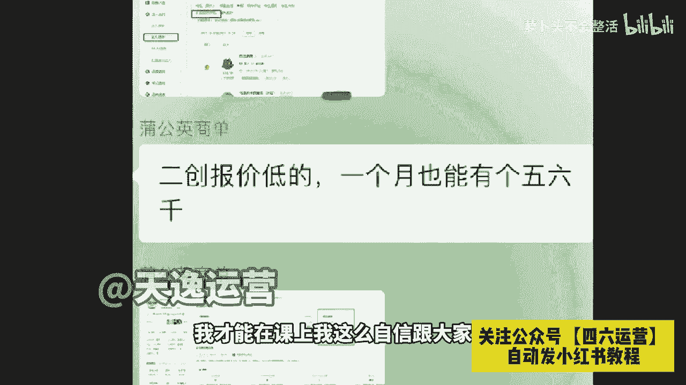

每天一个计划新手进来最最这个担心的不就是说跟无头仓一样吗？你说老师我想问问题，我都不知道问啥，对不对？所以说我们直接定好，第一天你要干嘛，第二天要干嘛，对吧？注册小数账号，设置好账号相关信息。

学会打标签，学会文案设置话题设置等等。就每一步我们给大家规划好了，你照租就可以了啊，就这样的。然后另外呢因为这一回我们不会说带特别多学生啊，我自己本人来带的话，我也考虑到一个效率问题。

所以说只带8个人跟大家先说一下，到时候你们看有多少同学是想跟着我来做，我们到时候直接报名就可以啊，我带8个同学，那么这8个人呢，蒲公英商单给你们开通。然后呢，小红书官方商城给大家开通。

但是你们必须做到一点，就这个必须要承诺的啊，必须每日更新作品，不能断更。因为如果说超过3天断更，我是要罚钱的，另外呢店铺不能空货，必须上架20件产品以上的这个货。而且呢不能说放虚假库存，比如说没有货了。

你填了有货，对吧？结果人家下单你发不了货，这个也是要罚款，罚的不是你是我。😊。

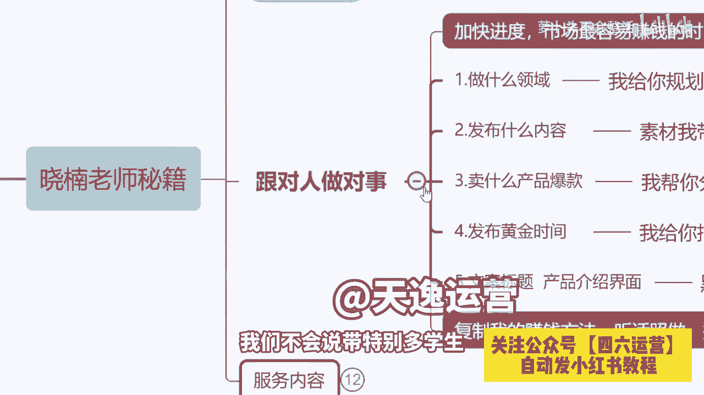

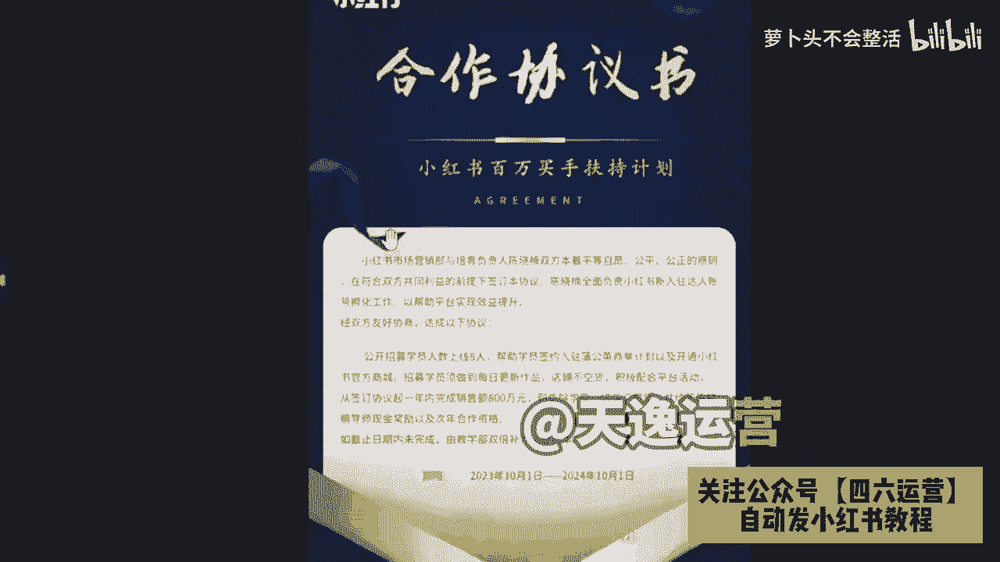

🎼啊，另外呢呃我们之后给大家的一个规划，就是我们在半年之内必须要做到10万销售额店铺。如果你觉得OK这个目标我还挺满意的对吧？想跟着我来做啊，确实是想跟我来学的。😊，🎼Yeah。

然后我就把我们的礼包福利和价格跟大家说完，说完咱们这节课也差不多结束了。😊，嗯，10万销售额是什么概念啊？就是我们刨去利润的话，刨去成本的话大概在四五万左右的一个效果啊。因为你做的可是扶持店铺。

人家流量都推给你了，一个月，你搞不到四五万的利润啊，你做一两万的那不是跟普通开个店铺差不多嘛，对不对？而且是半年时间啊，要对自己有信心，这个是可以达到的啊。😊，嗯，好，O来。

那么我跟大家讲一下这个助学礼包的问题。第一个我们是不限数量的一个账号规划。你不用说老师我做一个账号，你给我知道，那其他我在做账号呢，一年后再做账号呢，我不管你几年我都给你指导，因为只要我是你的代教人。

咱们的利益就是牵扯的啊，我不会把你拱手浪人拱手浪人啊，以后所有的交给我我给你的指导不限时间，不限次数啊，不限时间，不限次数，不限账号数量，然后第二个呢会给大家送一套原创的视频剪辑课，如果你之后有能力了。

你说老师我自己能拍摄了，对吧？我自己能够把产品买回来自己拍了，那我会给大家送一套剪辑课，教你怎么去剪视频，教你怎么拍视频，第三个呢是图片视频科技。像我前面讲过的去水印的呀，对吧？

还有一键破解5让平台识别不到。比如说我想把这个抖音里面的一些带货视频搬运到小红书去发偶尔发一两个可以不能经场发，偶尔发一两个啊，到时候给到你们这个破解工具。😊，啊，这也是其中之一。然后呢。

第四个就是我在课堂上面讲到的啊，我们的这个爆款文案哪、爆款标题呀、一键生成啊，包括洗稿的这个方式，对吧？二创别人已经现有的文章，我们去做模仿的啊，都是用工具可以一次性搞定的。

还有我今天因为我们课堂里面讲的这个内容不算特别多，所以说还有很多工具，我没有提到，就是只要之后我们在实操的过程里会用到的啊，你直接找我要就行了。到时候我直接发你就可以了啊。

因为我们很多都是自己公司自己做的工具，到时候你们要的话，直接给大家发就可以了啊。另外呢我们还会有一个这个是更新出来的啊，然后现在目前没有上线，就是在近期一定会有叫什么呢？叫做AI做图。

就是你如果说啊老师我不知道去找那个呃产品的那些图片等等。就比如说我要卖个沐浴露，是不是然后你在那个淘宝，你可以找到那种白底的产品图，白底产品图。😊，有白色的底，然后有那个产品的实拍图片。

你拿AI做图工具，它会给你生成一个背景背景，把那个产品融入到背景里面，跟真的一样啊，这个技术马上就有了，我们到时候过了审核就能上线了，给你们免费去用啊。AI做图工具对，免费的，直接AI就能生成图片。

是绝对跟别人不会重复的，绝对跟别人不会重复的啊，来这个也是一个，然后还有呢一些我们的这个图片模板就是你到时候小红书不是我们可以做一些比较好看的封面吗？让更多人可以点进来啊，封面模板我们也有。

然后这个封面模板的是这样的。😊，你要做什么类型？那个模板里面有文字框，然后有图片，你要改这个图片就可以上传新的。然后那里面的文字，每个字，你要改内容，对吧？比如说我这个图模板呢是个卖衣服的，你要卖鞋。

就把那个衣服改成鞋子，那个字都是可以改的啊，直接改完之后，这个模板下载下来就可以直接用这个东西都有啊，然后因为今天确实时间原因，很多东西我们讲不全啊，但到时候一定是很多惊喜的。

因为我们是所有的每个方方面面给大家考虑清楚的啊然后第五个呢是店铺问题讲过了啊，是有流量付持的这样的一个店铺，第六个对接高佣件的这样的一些商单资源，我们达到千粉之后就可以直接变现啊。

那么我之后给大家的规划是这样的啊，因为前期我们的时间原因，可能大家时间不能说一下子投入四五个小时啊，吧？都是循序渐进过来的。那么第一个月我们先去做商单，商单来钱快，并且百分百能赚钱。

第一个月呢基本上是5000左右的收入是不会低于这个金额的。所以说先做这个我们先把收入增加上来，后面你有信心。😊，了对吧有收入了，自己也没什么压力了。好，第二个月一定要去做店铺。时间多了。

最好第一个月就把店铺做起来啊，最好就把第一个店铺做起来啊。千粉可以送吗？小红书不能送千粉啊。小红书里面就是但凡有人跟你们讲有千粉的都是假的，我跟大家先说一下，我们这个是收到通知的。

当时我们也想了一个问题，干脆给你们刷个一000粉丝，直接开人家平台直接告诉我不能搞这个啊，因为这个会限流。我到时候带你们涨千粉，我教你们上千粉，就是7天左右的时间一定能上得到，上不到千粉，你来找我啊。

上不到千粉，你来找我，我说了我有流量密码，我知道发什么可以不要去买粉，不要去刷粉，听我的好吗？我们实实在在发作品去涨粉，因为你这个号是要长期赚钱的，你不要说这个这个白费时间，然后号封掉了啊。然后呢。

第三个月之后，我们最好是批量去运营。因为我讲了黄金3月嘛，黄金三个月周期，然后呢你们找些亲戚的呀，父母的账号拿过来一块去做啊。这样的话我们号做的越多，收益肯定是越高的。另外呢前面讲过了，每天两个小时。

我们之前最。😊，下个月都6000多。所以说你可以放心把自金交给我啊，我讲了，我说我能做5百文店铺，我贷得出5万，带的出十0万的对吧？我的这个方案我怎么做，大家怎么做？我们这么多账号的一个测试经验，对吧？

我们是怎么挣钱，你们怎么挣钱，如果说时间更多，那么我们做的项目更多的情况下，收入是是会翻倍的啊，跟大家投入的时间有关系啊，你时间多的话，店铺又能做商单又能做其他那个思域啊，对吧？

线下引流啊都能做很多方式，包括今天如果说我们是自己有产品，自己有这个呃产品的同学，到时候你们也可以把自己的产品告诉我，我给你们做账号定位都可以啊。然后再讲一下，因为今天我前面也说了。

大家是如果说确定要跟着我来做。😊，你需要付费，那这个付费有没有保障，对吧？我交了钱，我能学到东西吗？首先包教包会啊呃并且呢是要一定带大家出效果出结果的。为什么我就带这8个人。

因为我得让这8个人每个人都能稳定去变现，稳定去赚钱啊，所以说学费给公司账户都是有凭证的啊，我们会给大家签订有法律保障的协议，签订有法律保障的合同啊，保障双方权益。那么同时呢未来不再以任何借口再去收费。

就是我们一次收费之后不会再收一年两年三季不会再找你要钱啊，如果你跟我做一个月做两个运。说老师我挣到这个钱嘛，你说之前学生一个月6000块钱，我没达到这个标准，我一个月就四五千达不到，对吧？怎么办？

我对你负责啊，免费付训，我一直交到你达标为止，总之我们必须要完成。如果你一个月挣6000，我都达不到平台给我的要求啊，我们都是没有办法去过利的所以说我一定会帮助大家做出好的这个效果。😡。

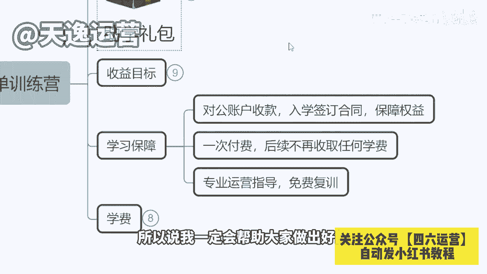

要说最近什么项目最火啊，那就必须要提到小红书电商。最近几个月呢，几乎整个互联网都在讨论小红书电商。我关注的几个商业博主啊，包括一些付费社群都在讨论它。我朋友圈月入5位数甚至6位数的比比皆是。

这个项目在年初的时候，我其实就有让团队跟进测试，我还在市面上买了一些课程学习。到现在单人单店一个月能做个一两万块吧。今天我就用一个视频详细的给大家拆解一下，就是小红书电商到底怎么玩。

我会把整个小红书电商的流程，包括一些注意点，比如怎么开店，怎么选品，怎么做流量，一次性给大家讲清楚，你甚至都不用再去看别的相关视频和培训了啊，你就跟着我的视频去按读佐骥，就足够你在这个事情上开始盈利了。

视频的结尾呢，我还会给大家准备一份资料，里面有我找的课程啊，对你运营小红书电商呢会有很大的帮助。有需要呢直接去拿就可以了。言归正传啊，整个项目的逻辑啊，其实也非常简单，它就三件事，第一个呢开店。

第二个选品，第三个流量，我们一个一个来讲，先说开店。呃，开店其实没什么好说的。那，首先就是打开小红书，然后点击左上角的菜单图标，再选择创作中心，然后点击更多服务这个选项，选择店铺，点击立即入住就可以了。

你就按它官方要求的提交资料入住就行了。我居然看到有人把小红书开店包装成一个项目拿出来卖。居然还有不少人买，这也是很奇特。这里跟大家说一下小红书店铺的两种形式，个人店和企业店。其中个人店有两种。

分别是个人店和个体工商户店，个人店只需要身份证加1000保证金就可以开通了。个体工商户呢还要多一个营业执照。企业店呢就多一点，企业店有三种呃，有包括那个普通的企业店，有专卖店和旗舰店。

企业店都需要营业执照，而且还要缴纳600个年费。我们刚开始运营小红书电商的时候，你直接选择个人店就可以了。我们实测下呀，企业店和个人店一样，平台并没有对企业店有什么流量倾斜，唯一的区别是个人店。

你只能开一家，而一份营业执照呢，你可以开三个店，你一个店如果都没做好，你开再多的店都是没有用的。而且小红书电商啊，我觉得是。

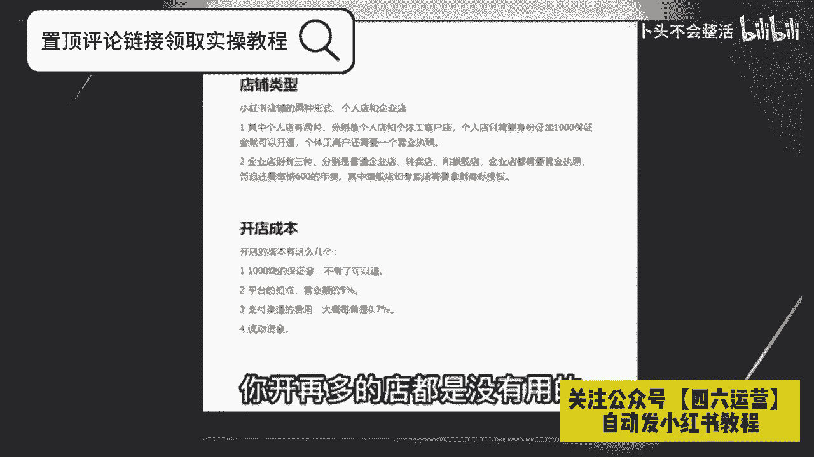

适合店群形式去做的。这是因为小红书的流量机制，它的电商自然流占比非常低。那你铺再多的店，再多的货有什么用呢？所以只要你看到有博主跟你讲什么小红书店群，我都觉得是在扯淡。小红书是要做矩阵的啊。

但不是店铺矩阵，而是账号矩阵。这个后面在流量获取那里我会跟大家细说，开店的成本呢有这么几个。第一个就是1000块钱的保证金啊，不做了可以退。第二个呢是平台的扣点营业额的5%。第三个呢是支付渠道的费用。

大概呢每单是0。7，第四个就是自己的流动资金啊，一开始大家做呢可以有无货源的方式去做，对资金要求也不高。你刚开始呢准备个2000块3000块完全够了。呃，开完店以后呢，我们下一步就是选品。

我们应该在小红书上卖什么的？选品其实也简单在其他平台上的爆款大概率在小红书上也能报。目前小红书呢我是推荐三个渠道进行选品的。第一个是通过某东某宝上面找那种小红书平台调性的爆款产品。呃。

身边有做电商的朋友，他自己在某宝的店铺卖爆款，搬到小红书上第一篇笔记就开。第二篇笔记单量就已经破百了。第二个呢是通过某音的那个精选联盟。你在某音的精选联盟排行榜，你可以看到现阶段哪些品卖的好。

只要符合小红书用户调性的产品，直接搬运测试就可以了。第三个就是某多多的这个销量排行榜，选择适合小红书的类幕排行榜，从中选择相应的爆品搬运到小红书，整个选品的逻辑，就是我们要利用市场来帮助我们选品。

而不是自己在那瞎想，我们要借助大卖家的选品能力来弥补自己选品上的不足。所以我们只要判断一个东西啊，就是这些排行榜上的爆品是否跟小红书的连群有匹配的可能，如果有我就搬过来测一下，对吧？

相当于是借助了别人的能力来帮我们自己选品，这样反而是最快捷，而且是最稳妥的选品方式，肯定比你瞎测成功率要高很多。然后等你这个产品上架以后呢，就到了最重要的环节了，我们应该如何获取流量。

小红书它是个种草平台。你店铺九成以上的流量啊，都是来自你发发的笔记。这就是为什么我之前说小红书不要铺出店群，而要做账号矩阵，尽可能多的发笔记耗流量。它的通路就是。

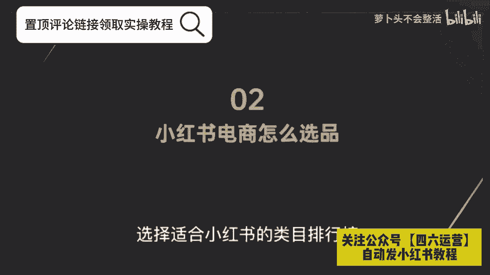

用户通过你的笔记然后对你推的产品产生兴趣，然后到达你的店铺完成购买，你堆一堆店铺，对吧？你铺一堆店铺一还不如多发笔记，多发几篇笔记的这个效果好。所以怎么在小红书上发笔记，对吧？

就是你小红书电商是否成功的关键。小红书这个平台，你直接发硬广，我觉得效果非常差，对吧？本来小红书的这个用户群体认知就比较高。你直接发广告没有办法获得信任的啊，更不要提转化了。你发笔记的时候。

一定要用一个素人的角度，你知道吧？就是用户的角度去切入，站在用户的角度去做重草内容，而不是官方视角，这才是真正有效的。呃，这种种草笔记怎么做，其实也很简单，就是去各大平台的商品评论里找。

比如某一某宝某东的商品买家秀找到好看的素材，你直接copy下来用嘛，对吧？文案呢在买家评价上去做修改。这些买家的评价呢就是商品用户的使用体验，天然的适合用来做这个中考笔记，而且可以说是取之不尽了啊。

然后呃当你单个账号的SOP跑通了是吧？我们就可以开始举阵引流了啊，通过批量上小红书账号批量发布笔记。给我们的店铺来引流来放大。那基本上整个小红书的电商的运营啊。

就是我上面分享的这些外面不管多少钱的培训啊，000块也好6000块、1万块也好，其实就是这些东西。有些培训可能还没有讲的清楚啊。根据上面几个点，我给大家准备了一份资料。

里面包括了小红书账号的起号运营的方法，以及一份小红书电商的视频课程。你如果打算经营小红书电商，你也不用看别的东西，就跟着这份资料做，足够你开始盈利了，有需要的点赞加关注，在评论区回复红书电商。

我分享给你。😊，🎼要有自信啊，你是最好的，知道吗？😊。