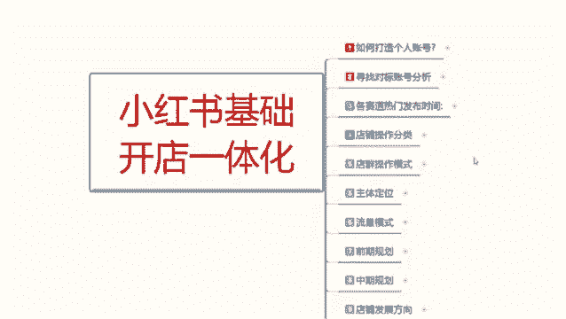
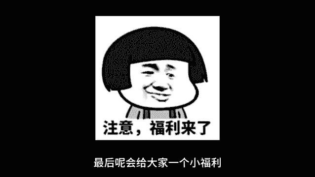
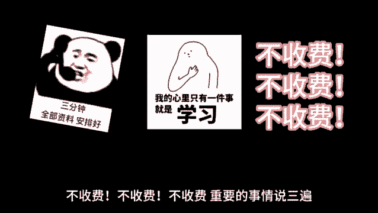

# 最系统的小红书无货源电商教程 【2024】最新版小红书运营起号 涨粉小白入门必学的一门新媒体专业版课程 - P4：03、小红书开店-各赛道热门发布时间 - 三级盔八倍镜 - BV1Pm421p7WS

大呀，这一节呢给大家分享一下小红书基础开店的一体化操作。这一节课呢是第三课时给大家分享一下各赛道的一个热门发布时间，让大家了解一下你自己对应产品呃，选择什么样的一个时间段去发放，它是最好的一个。

可以获得最好的一个曝光的一个数据量。这里面的话两个发布时间其实是一样的，只是说介绍不通。就是说你们知道那个不同的发布时间，发布作品，它会有一个不同的效果。啊，今天的话就是跟你们分享一下。

怎么能根据我们的一个不同时间段发布合适的一个内容。比如说你只我们只要记住这五个大的一个原则的话，其实都是差不多的。第一个呢就是。7点到9点啊。早上这个时间段7点到9点，这个时间段的话。

基本上都是怎么说呢？刚起床吃早饭上班，所以的话它比较适合发一些碎片化的内容。比如每日分享咨询等，让大家在忙碌之余也能学习到一些有用的东西。其他的话你其实没有必要发了啊。7点到9点，这这个的话。

你逛小红书基本上。人不多，在这个里面你去发的话，你就只能发发日常。你自己如果说想做博主之类的，可以在这个时间去发。你正常做商品的话，在这个时间段的话，你不用去发了，没有什么用。除非说你是卖食品之类的。

卖早餐之类的，可以往这个时间段去考虑一下。第二个就是9点到12点。这是一个大典的一个时间啊。这个时间的话基本上都是都在工作。然后呢，工作的时候有些摸鱼的，或者说闲的无聊的啊，他会去玩一会玩一会小红书。

所以说的话它适合发布一些教育类的一个内容。比如美妆教程工作技巧。然后11点以后的话就可以发布一些关于美食类的一些厨房推荐。为什么说11点以后的话可以发布美食呢？要吃饭啊，大家把这个点点了解清楚。

12点到2点，他是休息时间。这个时间段的话说适合发布一些轻松的搞笑的娱乐的。或者说可爱类型的。都可以去发啊，影视类的。电影类的，但是这种类型的话，你也只能适合博主去做。你正常卖货的话。

你在这个时间段去发的话，效果不会太好。然后呢。是3点到6点这个时间段，这个时间段的话基本上都在工作。也是和9点到12点是一样的啊，他们两个都时间点，一个是上午，一个是下午，只是说下午的一个数据量更好。

然后是7点到12点之前。这个时间短啊，大幅部分的话就是说属于自己的一个。独立时光这个时间段可以发送任何内容。因为这个时间段的话就是说我们的一个活跃度的话，小红书尤尤其是小红书啊，夜生活开始。

这个时间段人们的活跃度远远高于前几个时间段。你了解这5个时间段分布以后啊，再对应自己产品去做一个大概的。规划就可以。第二个发布时间呢是明确的。各个赛道每个类型产品所对应的一个时间。

美妆类的美食类家居穿搭、健身学习、护肤、萌宠、探店、职场摄影、娱乐、情感、养生旅游。这几个点它每个点的话就是说它都有自己独属的时间段。你把这些时间段了解以后的话，对号入座，你自己是做什么商品呢？啊。

去寻找对应的一个发布时间，去发放你自己的一个商品笔记就可以。你比方说美妆类的，你就比方比较适合在11点到1点，然后就晚上的7点到10点之间。因为这个时候的话，中午是女性出门时间啊，这个你们要弄清楚。

如果说不是上班族的女性，她基本上出门时间的话，基本上就是在11点到1点，要不就是晚上，而且绝大多数都是晚上7点到8点这个时间段。8点以后到10点以后的话，基本上都是已经化妆完了出去玩的。

你包括美食类的也是差不多的，家居穿搭。啊，这个我就一一不给你们讲解了，你们自己了解一下你自己做什么产品，做什么类目。我这个给大家划分的一个美妆也好，美食也好，它的一个商品也是这么发的。你要做引流。

也是这么发，你要做网红，做博主，他也是这么发。知道吧？就是把这个时间段把握好，提前不用发放你的商品笔记，发放你的产品内容啊，你会获得30%左右的一个曝光加成。因为他这个时候人群流量是最高的。

这个呢就是今天给大家分享的一个各赛道的一个热门。发布时间大家了解一下就可以。好吧，那这节分享呢就给大家分享到这，下一节课咱开始。店铺操作。

最后呢会给大家一个小福利，整理了小红书运营实操资料，可以评论区私信的方式领取。通过之后会第一时间发给大家，注意领取资料，不收费不收费不收费。重要的事情说三遍。😊。

