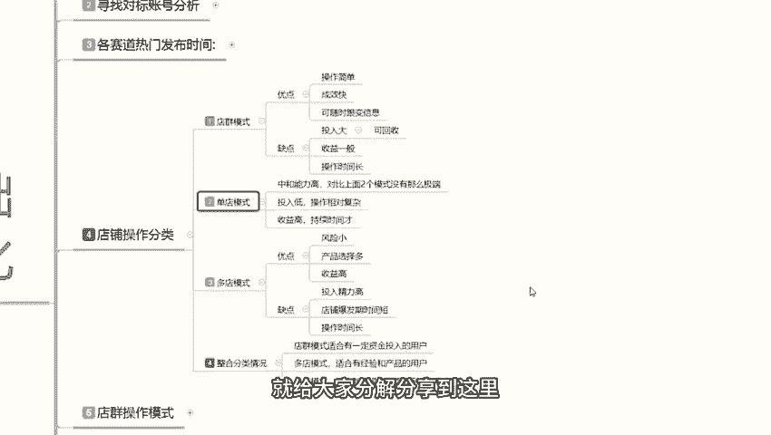
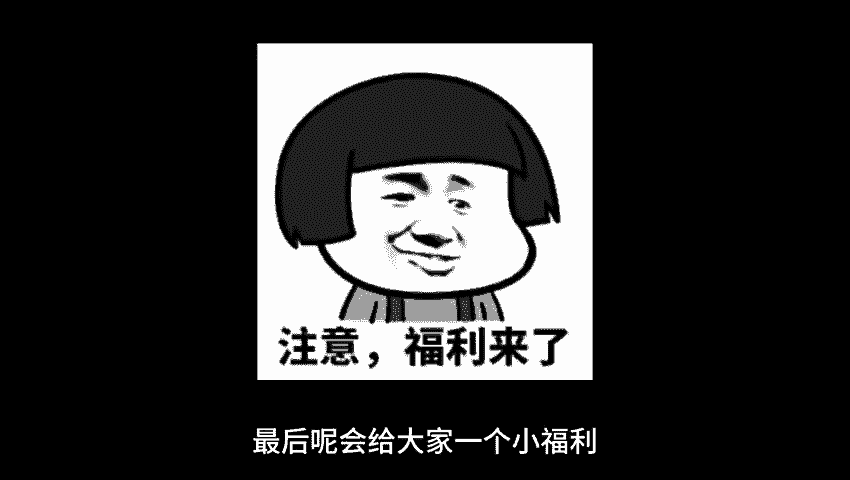
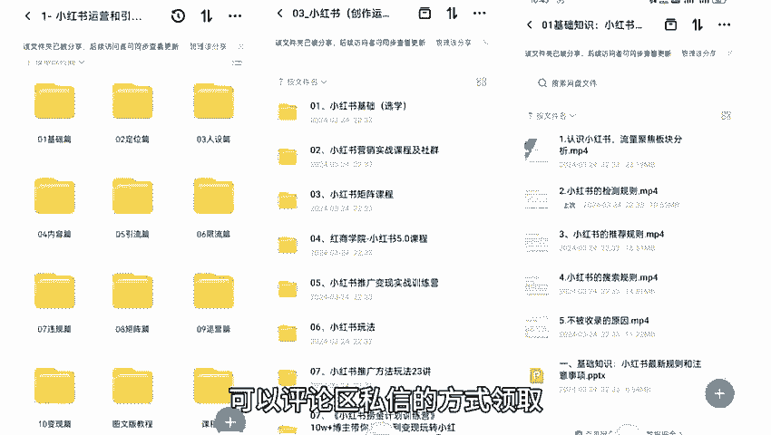
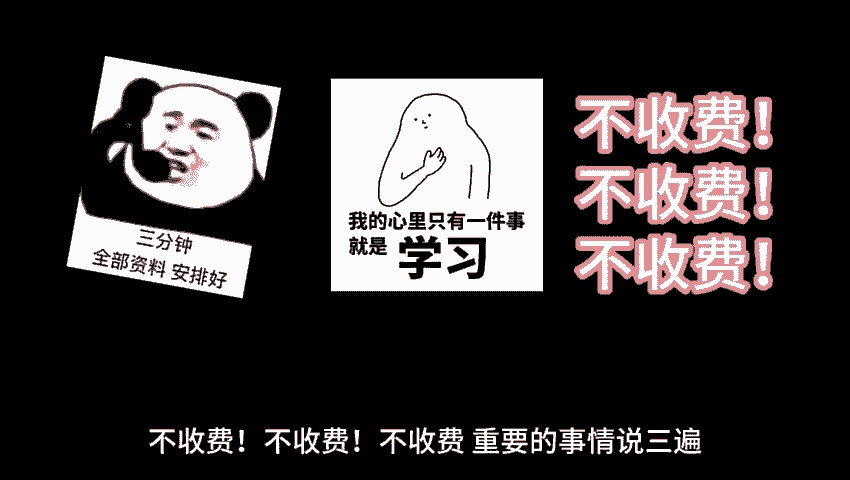

# 最系统的小红书无货源电商教程 【2024】最新版小红书运营起号 涨粉小白入门必学的一门新媒体专业版课程 - P5：04、小红书开店-店铺操作分类 - 三级盔八倍镜 - BV1Pm421p7WS

大家好，今天给大家分享的是小小红书基础开店一体化的第四课店铺操作的一个分类。我们首先了解一下什么是店铺操作的一个分类。我们在开店之前，你不要着急去开店啊，你把店铺的个人账号打好以后，标签做好以后。

然后了解发布时间，再去了解店铺操作的一个分类。店铺操作分类的话，其实我们在小红书上面，你去做店的话，你其实可以把它分为店群多店单店啊，这三个模式三个模式它是不一样的啊。店群的话。

它的一个店铺数量是越多越好。多店模式的话就是每个店铺你自己准备只做一个单品爆款的单店模式的话，你就说你只准备在小红书上面开一个店的。他每个模式所面对的一个操作方式和方向，它都是不一样的。

这节课的话主要是让你们大家自己确认一下你在小红书上面，你到底想去做哪个模式。啊，哪个模式比较适合你？因人而异，分类不同啊。我们先了解一下电锯模式啊。优点就是说操作比较简单，成效快啊。

可以随时变更的一个信息量。呃，缺点的话就是投入比较大，但是它这个投入的话是可以回收的。缺点就是然后呢就是收益一般。最后呢就是操作时间比较长。他这个如果说你真想在小红上面去做店群的话，说实话啊。

缺点和不优点和缺点都是非常明确。优点就是小红书，你做店群不需要动什么脑子。啊，成效快是什么意思呢？就说你。店铺成型以后的话，他基本上每天就保持这个数金量。你想让它变多，他也不可能。

而且你自己的话不好操作过来。因为他的一个店铺数量开多了以后，你每个店重复操作的。这一个步足下来的话。怎么说呢？就是说你就没有其他时间做其他东西了。啊，就是你整个人就绑在这一些这些店铺里面。然后呢。

它的一个可垂时变更信息是什么意思呢？就是说你前面做店群，然后把数据粉丝累积一定的数量以后的话，你可以更变信息，然后去往多点或单店模式去靠。但是你这种更变信息的话，呃，时间会稍微长一点。

只是说你随时能更换而已。然后呢。他的投入比较大，因为你做店群的话，你的店铺是越多越好，你10个以下你都不叫店群。啊，你10个以上才叫店群，那10个以上你光。一个保证金，你就要需要一两万块钱准备。

然后的话你的一个店铺里面，你需要营业执照，不然的话你就需要去找10个身份证。每个身份证开一个个人店，那样的话太麻烦。如果说你不开个人店，你想开企业店，或者说是有资质有店铺的那种的话。

一个身份证可以开三个店，开三个店的话那还需要额外600块钱的一个。也不认真费用。一个店开下来的话，大概成本就在2000块钱左右。所以说他的一个投入还是比较大的。但是它这个里面的话。

有一点就是你如果说是用10个身份证的话，他的一个身份证保证金是可以回收的。如果说你是用企业的话，用身份证开三个店的话。这个里面除了600块钱不回不能回收以外啊，就是你开店时候用的一个资金不能回收以外。

你的保证金也是可以回收，就是一个电的还能回收接近3000块钱。但是你的一个投入的话还是比较大的。缺点就是说，然后他这个收益比较一般。因为你如果说在小红书上面去做店群的话。

你的收益其实和你打工比打工强不了多少，只是说自己的话，可能人生人生心里面自由一点。一个月收益的话也有几千块钱。想破万很难。最后一个呢就是操作时间长啊，只只是说他比打工强一点，强在什么地方呢？

没有老板逼逼你。哈就这一个点，然后是多电模式，优点的话就是说风险小。然后呢，产品选择的话就比较多。收益比较高，这种多店模式就是什么呢？我这个店铺的话，我把它开起来以后，我在小红双上面。

我准备只做一个这个产这一个店铺，我只准备只做一个爆款起来。或者说我有几个店铺里面能报一款到两款就可以了。懂意思吧。就是优化后的电曲模式。但它不是电池模式，它也是单电操作，只是它的一个操作模式不一样而已。

缺点的话就是说投入精力的话要高一点，因为它整体的话需要精细化操作，你只能先开1到2个店起来以后再去开第三个第四个第五个店。然后呢，它的一个店铺爆发期时间比较短，就是这种多电模式的话。

它一般的话产品爆发期。呃，你前期准备可能要花一个月，最后爆发的话，可能就半个月到一个月到两个月啊，不会超过3个月。这个时间段爆发的话，你能赚多少钱，就取决于你自己产品的一个定价和你自己商品的一个性价比。

你自己能做到什么程度了？啊，就是爆发期时间比较短，他没办法在小红书上面长久的一个运营。然后就是操作时间长，为什么说它的一个操作时间也长呢？因为你是多点操作，它不是单店单店操作，知道吧？你多点操作啊。

你第一个店铺操作完，你还操作第二个，第三个第四个呢。对不对？所以说它操作时间的话是非常长的，而且是精细化操作，比较费脑子啊，这个就是多电模式。当然了，如果说你把它的一个。

流程弄清楚以后的话还是比较简单的啊。然后呢，是单电模式。单电模式啊，它的一个综合能力的话，相对于上面两个的话，其实呃。就没那么极端了。他的一个投入比较低，操作相对复杂。嗯，收续收益的话也是比较高的。

而且持续时间长。你多电模式的话，你产品可能只能推广半个月、1个月2个月。但是多电的话，你基本上不单店模式的话，你基本上可以操作。两年左右。但是它的一个爆发收益的话就没有多电模式那么高啊。

只是说它更持久一点啊。就是说整合分类的话，就是说你不管是做店群也好，单店也好，多店也好，你这三个模式啊其实都差不多的，各有优点啊。电池模式的话就比较适合你资金雄厚一点。但是对网络的话。

不怎么熟悉的人去操作。你建议的话，现在你做小红书做店群的话，收益不是太高。但是这点收益的话，你说实话没有太大必要。第二个呢就是多店模式，它呢就比较适合那个有经验的。你之前如果说做过淘宝，做过拼多多。

或者做过京东，或者是在其他地方还在做的，想在小红书上面发展的啊，对这种运营模式了解的，你可以去做多店。单D模式的话就有。任何人都可以做了啊，推荐的话就是新手，你就从单点模式开始操作。啊。

他主要的就是需要你有耐心和。执行力就可以，其他的话没有那么过多的一个需求量。好吧，这个呢就是店铺操作的一个分类。你要先了解清楚你自己在小红书上面你到底是要做什么，你后续才好去操作。好吧。

那这节课呢就给大家分解分享到这里。

最后呢会给大家一个小福利，整理了小红书运营实操资料，可以评论区私信的方式领取。通过之后会第一时间发给大家，注意领取资料，不收费不收费不收费，重要的事情说三遍。😊。

