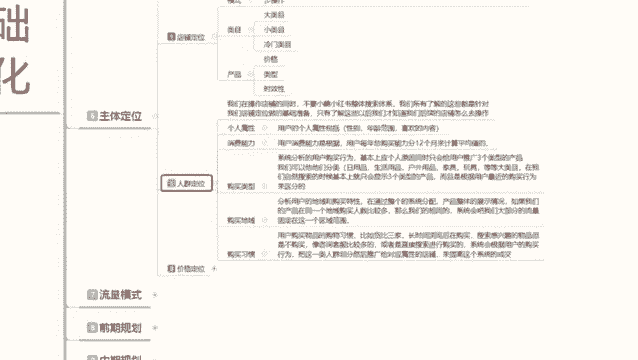
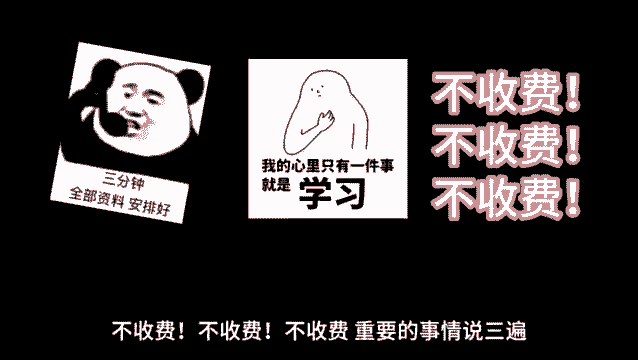

# 最系统的小红书无货源电商教程 【2024】最新版小红书运营起号 涨粉小白入门必学的一门新媒体专业版课程 - P8：07、小红书开店-店铺人群定位 - 三级盔八倍镜 - BV1Pm421p7WS

大家好，今天给大家分享的是小红书基础开店一体化操作的全套。第六大课是主体定位。这节课的话给大家讲解一下我们的一个人情定位。上节课呢给大家讲过了店铺定位，我们了解自己的模式，操作什么店铺模式。

选择什么样的一个产品类目，然后确定产品的一个价格类型和时效性以后，我们开始确定我们自己，因为我们已经把产品选择好了，那我们就开始选择人群，人群是什么呢？是选择我对应商品销售的一个人群。

我要把这些商品卖给什么样的人啊，他们有一个什么样的一个消费习惯，有什么样的一个消费能力，都是我们所需要考取的范围。你不是说是我们选完店铺定位以后，我的产品价格我把它定高一点。

然后的话我们卖给低端价格类方人。那样的话，你的产品是卖不出去的。因为别人对你的产品它是没有消费能力的。但是如果说你做低端产品，你卖给高端的人，别人是看不上你的产品的。所以说我们需要把人群定位做准确。

你才好知道自己的产品适合卖给什么样的一个人群范围。而这个人群范围的话是由我们自己去选择，但是需要我们自己用账号啊，我们自己的账号要去筛选这部分人出来，你才能说是把它把你自己所做的产品。

推广推广给对应的人群，而不是由系统判定去给你推广。因为那样系统给你判定推广的话，它是只能把你固定在某一个分类里面，分类里面它也是有人群也是有消费习惯的。那你这个消费习惯就需要我们自己去操作的。

所以说我们在这里呢需要先确定自己的一个人群定位。然后再去。了解系统的一个分类，再把自己的账号做成类似的人群，那系统就会给我们推广对应的一个人群，你才能做起来。不然的话，你盲目的选择。像我刚刚说的。

你低端价格的一个产品卖给高端价格的一个人，别人不会接受你的产品，因为觉得你质量不行，产品不行，不值这个价。对吧你高端产品的一个价格，你去卖给低端产品的一个人，别人消费不起。对不对？

所以说你要把这些东西数据全部要考虑进去，你才能把人群定位做准，你才能把这个小红树的店铺做好。我们来了解一下人群定位啊，人群定位的话就是说我们在操作店铺的同时，不要小红书，它整体的一个搜索体系啊。

我们所了所有了解这些的话都是针对我们店铺做定位基础的准类。所以了解这些以后呢，我们才知道我们后续店铺怎么去操作。你不了解的话，你后续店铺你是没办法操作的。这里面呢我是给大家分成了6个。5个点，第一个是。

个人属性、消费能力、购买类型、购买地位和购买习惯。这5个点。个人属性是什么呢？用户的个人属性包括性别、年龄范围和喜欢的一个内容，就是我们小红小红书对应的系统给我们分辨的性别年龄。

喜欢的内容就是我们刚创建账号支出的时候所选择的一个内容。第二个是消费能力。用户的消费能力的话是根据用户每年总购买能力，分12个月来计算平均值的。当然，这个是小红书后台系统，它自己判定的。

我们是没办法看它的数据的。但是我们可以自己给自己的店铺账号设定数据啊。第三个呢是购买类型，系统分析用户的一个购买行为。基本上的话就是应用个人的原因，同时会给用户推广三个类型的一个产品。

我们可以把它分类为日用品、生活品、户外用品、家居、玩具等等大类目，或者说小类目，或者说是冷门类目产品。啊，每一个产品的类目不同，它所分配的属性不同。但是我们去过逛想无说啊，或者说是你去找产品做搜索啊。

他给你推的基本上都是你经常观看的三个属性范围之内啊，不会有第四个。你比方说你看食品，对吧？看化妆品，然后看服装。他不会给你出现家剧。啊，不会给你出现儿童玩具。不会给你出小说呃等等之类的。

其他的它基本上就是三个类型的一个产品给你进行定位啊，你要了解这些东西，就是用户的一个购买类型。第三个呢就是购买地域。呃，购买地域的话就是说分析用户的一个购买地域和特性，再通过整体的一个系统分配。

产品整体的一个展示情况。如果说我们产品在同一个地域购买地域人数过多的话，那么我们相同的系统会把我们大部分的流量固定在这一个范围之内，这就是小红书系统。你比方说我在四川，你在湖北。

我四川的产品经常往你湖北那边去卖。那它会把我的地域，我的产品属性划分为湖北那边喜欢的一个类型。那在四川本地反而推广的比较少了。啊，北京上海广州深圳那边也就比较少了。而湖北购买的人群比较多。

它的主要推广地度就是我所发的笔记也好，发发到商品也好，主推广的目的地就是湖北。啊，他通过这种方式啊，提高他小红书的一个成交比例。当然这种的话，你们大家自己要去了解一下啊。最后呢就是购买习惯。

用户的购买物品的一个购物习惯的话，比如比如说呃货币商家长时间浏览以后再购买，搜索新感兴趣的物品，但是不购买。像咨询客服啊啊比较多的，或者说是直接搜索进行购买的系统会根据用户购买的一个行为。

把这一类人群进行划分，然后推广给对应属性的店铺来提高这个系统的一个成交。就是小红书他通过这种行为方式的话，来提高他自己小红书的一个知名度和存在感。同时呢给对应的商户的话也提供了一。

些便利属于三以内一个局面，就是用户他知道系统知道我喜欢什么，给我推荐的什么产品，系统用户喜欢购买的一个产品，我推荐给他购买的一个商品以后，他对我小红书的信任度进一步提高。小红书我们卖货的就是。

通过操作这个渠道，系统会推荐给我对应的一个人群，提高我店铺的一个转化率。餐饮的一个方式。所以说小红书它就会有这种一个购买习惯，购买地域购买类型消费能力和个人属性的一个划分和区分。因为它不这么做的话。

它的一个人群属性。我本来是想买包包的对吧？他没事就喜欢给我推服装，一个包子都给我，你觉得我对小红书还有兴趣吗？对小红书购物还有兴趣吗？我没太大的兴趣了。我在这个上面我看到这同类的一个产品的话。

我可能会选择去淘宝去买。拼多多去买京东去买啊，我去买赠品，我也不会去小红书上面去话。虽然说你写的天花乱坠，但是我找不到产品啊。所以说系统小红书的话，它整个系统会为了避免这种情况发生。

它就出现了这个个人属性、消费能力、购买习惯、购买地域。这几个。属性的一个划分啊，所以说我们在操作小红书整体店店铺定位确认完成以后，就确定人群定位。人群定位以后，确认完就最后的价格定位。这三个点缺一不可。

好吧，这一节呢就给大家把人群定位分享了一下。下节课呢给大家分享一下我们的一个价格定位，就是我们店铺定完自己的发展思路。选定完自己所卖的一个人群，最后选我们的一个价格。价格对应的话就是我们产品的一个价格。

所对应人群选择它有没有消费能力。那这节呢就给大家分享到这里。

最后呢会给大家一个小福利，整理了小红书运营实操资料，可以评论区私信的方式领取。通过之后会第一时间发给大家，注意领取资料，不收费不收费不收费，重要的事情说三遍。😊。

