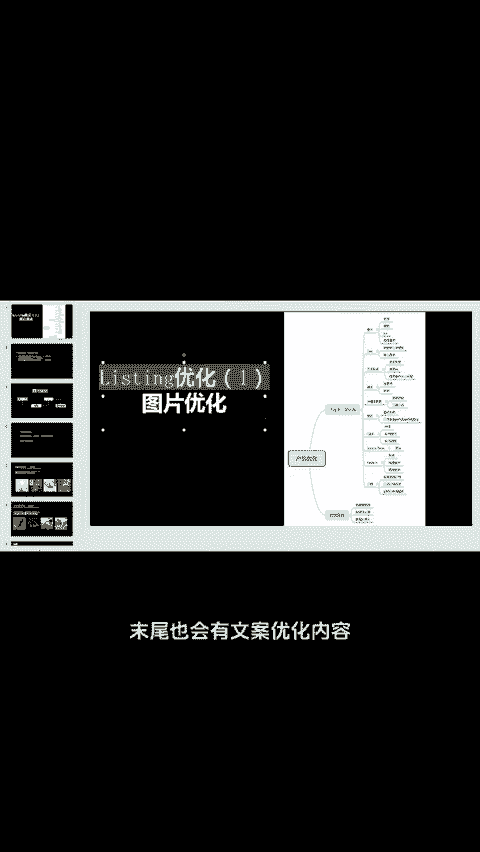
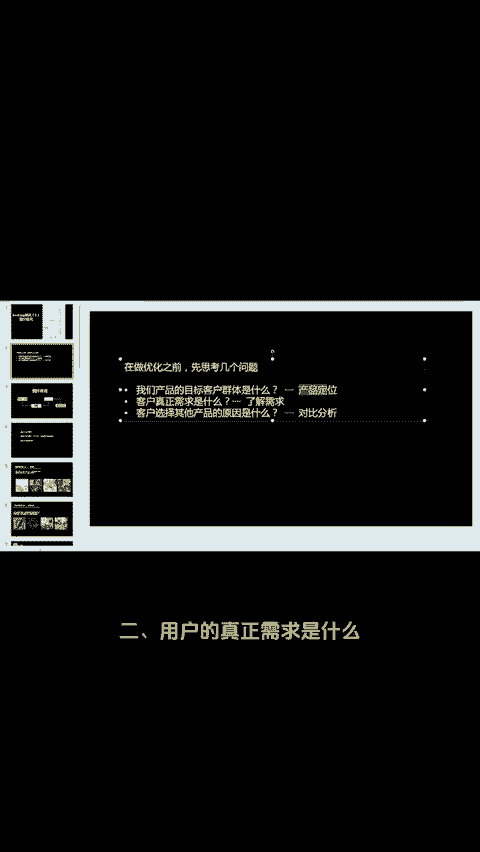
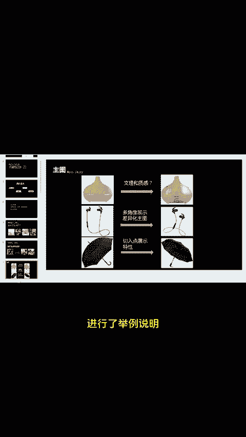
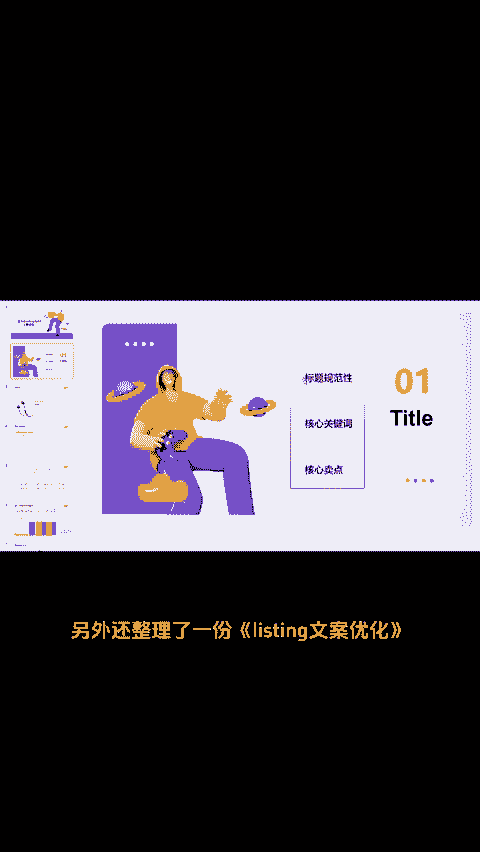
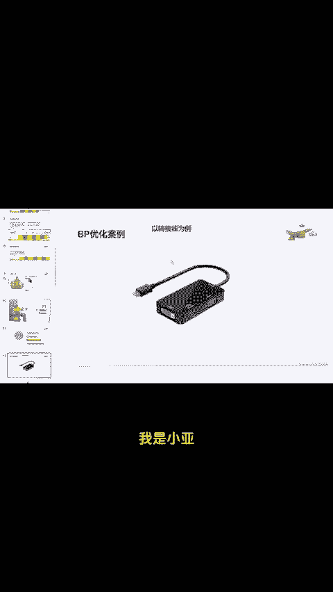

# 月60w亚马逊运营！写优质listing秘诀 - P1 - 小A在学习 - BV1mXtCeeEd7

亚马逊一条好的listing不仅能提高点击率，对我们的转化率也有帮助。listing无非就有两部分组成。图片和文案。小亚今天就来跟大家聊一聊listing图片优化，末尾也会有文案优化内容。

在对listing进行优化之前，我们需要知道产品的目标客户是哪些群体。用户的真正需求是什么，以及与竞品进行对比。我们的缺点在哪想清楚之后就可以从主图附图A加和视频需求等四方面优化了。

这里分别拿不同产品类目进行了举例说明，共23页需要的后台TT挨个发，另外还整理了一份listing文案优化，从标题核心关键词以及核心卖点等三方面详细阐述了。我是小亚，又有一点点亚马逊干货。😊。

