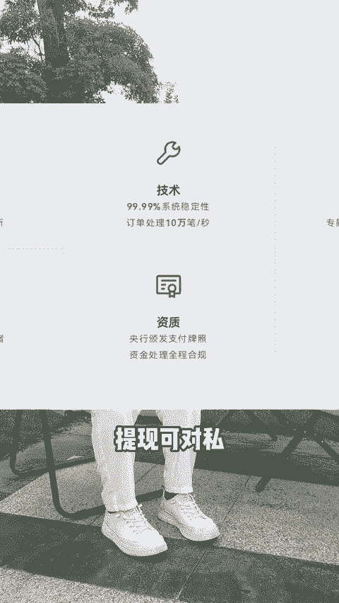

# 有赞是什么？怎么收费？一条视频讲清楚🔥 - P1 - 阿德聊运营 - BV1zQHjeZE88

🎼有赞是什么？有赞有什么用，适合哪些商家怎么收费？我是阿德，记得先点赞加关注啊。有赞赋能商家数字化经营，助力企业高效营销，提供全面的电商解决方案，以用户为中心，融合，创新技术与卓越服务。有赞。

让商家轻松搭建个性化商城，实现商品订单、会员分销等一站式管理，为商家搭建自己的私域流量池，提供帮助。用一句话概括，就是在微信生态，给商家开店，让每个商家拥有自己独立的小程序售卖自己的产品。🎼第一。

商品上架售卖、订单发货个性化店铺展示。第二，会员管理组织活动，积分运营做客户精细化标签人群运营。第三，分销可实现二级分销加多提裂变。4、打通外部平台。

小红书、视频号、快手、抖音团购转、美团、饿了么订单、支付宝、虎牙、陌陌定客、酷狗、微博、知乎、斗鱼。第五，打通商家自有APP系统，实现积分优惠券、会员等信息互通。第六。

分销市场提供上万个商品SPU可以供唯有货员的流量商家一键采购，实现流量变现。第七，笔记众草，实现小程序内消费者内容无文交流社区打造类似小红书的一个社区。第八。

拥有第二件半价支付有礼拼团幸运大抽奖、秒杀等几十种营销玩法来提高店铺的一个转化率。第九，支持线上。🎼预约线下收银、同城备送、常识点单等功能。第十。

拥有自己的支付牌照、提现和对私打通海关支付系统以及海关ERP支持商家海淘商品跟一般贸易一起售卖。

🎼商城是怎么收费的呢？有赞商城分为微商城跟零售两个版本。微商城有4个套餐。🎼零售门店也有4个套餐。🎼有站式做思域、小程序的为美妆、女装、食品等行业提供一站式私域解决方案。

主要适合需要在思域做客户管理、成交转化、分销裂变的商家，只要是在思域变现，小程序是你的不爱选择，仪是做哪个行业的呢？思域有遇到哪些问题呢？我是阿德爱迎交融。

