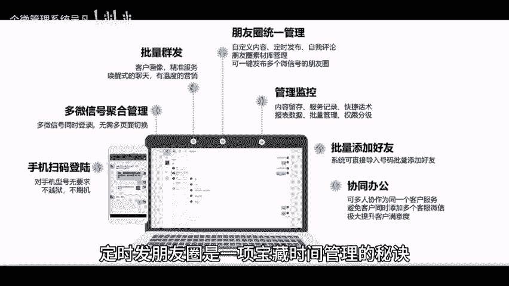
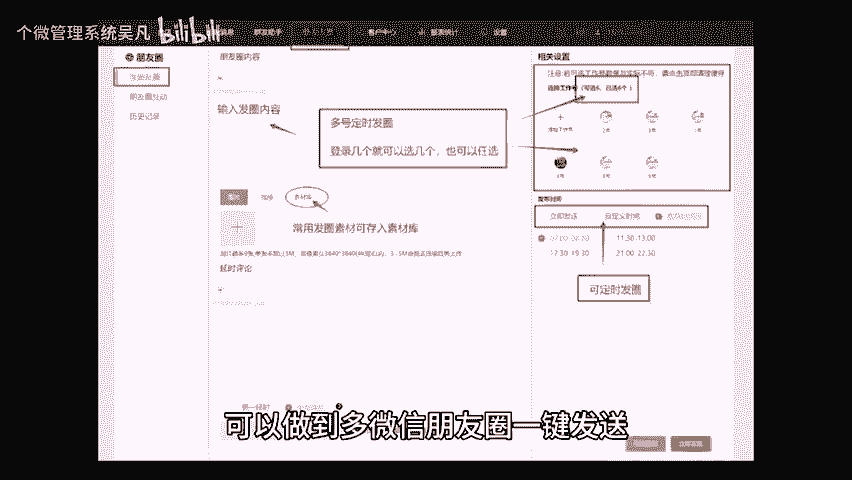

# 朋友圈定时发送？一定要学会的宝藏功能 - P1 - 个微管理系统吴凡 - BV1VaHaeZEa3

🎼作为社交时代的一部分朋友圈已经成为了我们日常生活中必不可少的交流方式之一。但你是否曾经遇到过这样的问题？朋友圈发布的内容很难吸引到目标受众。那么不妨试试定时发朋友圈这个神奇的方法。

让你轻松拥有高质量的人脉和影响力，定时发朋友圈是一项宝藏时间管理的秘诀，通过规律的设定发布时间。你可以选择合适的时间向合适的人传递合适的信息，而且这些信息可以提前规划，让传递的信息关联起来，相互影响。

想象一下，某店周六有长活动，老板手上有几个微信号，几万私域人群。此刻，老板就可以规划周一至周五的朋友圈了。周一至周五发什么，什么时候发，从活动预热到活动提醒等等，都可以提前安排好，而且不需要每天操作。

下面我和大家分享一个可以定时发朋友的宝藏系统。😊。

🎼这个系统不仅可以做到朋友圈定时发送，而且还可以做到多微信朋友圈一键发送。好了，这个宝藏方法你收藏了吗？最后祝各位老板发财。😊。

