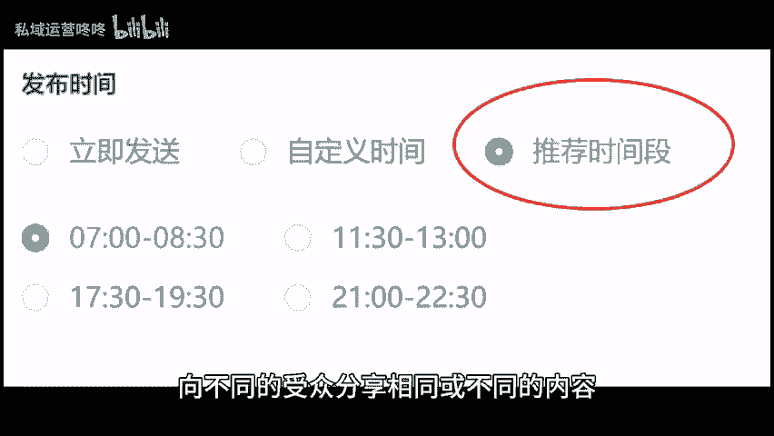
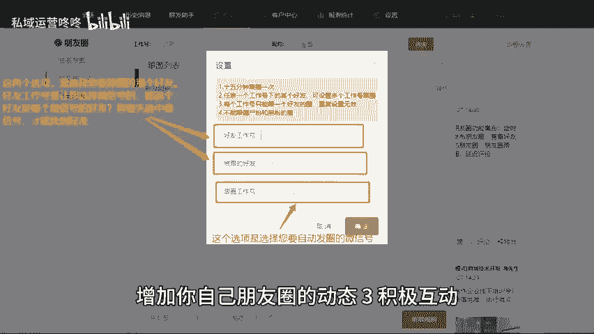

# 朋友圈运营秘籍：3个技巧让你的社交圈活跃起来 - P1 - 私域运营咚咚 - BV1z2421Z7b7

🎼想要让你的朋友圈更加活跃，吸引更多朋友的关注和互动吗？下面我将分享三个简单实用的技巧，帮助你提升朋友圈的参与感与活跃度，让你的社交圈焕发生机，以内容规划和定位，在开始运营你的朋友圈之前。

你需要考虑一下你希望分享的内容类型。这可以是个人生活的点击分享专业知识的普及，或者是产品的推广等，同时在确定了内容主题后，制定一个合理的内容发布计划也非常重要，保持适当的发布频率。

能够提高你的朋友圈活跃度，但避免过于频繁，以避免造成信息疲劳。2、定时发布朋友圈，如果你有多个微信号可以利用个微管理系统，来同时定时发圈，这意味着你可以在适合的时机，向不同的受众分享相同或不同的内容。

提高信息的覆盖面，除了定时发布外，系统还提供了跟圈设置功能。当你设置好后，可以自动转发好友的朋友圈内容，增加你自己朋友圈的动态。3、积极互动。无论是在何种场合，互动都是。😊。

🎼建立良好社交关系的关键，在你的好友发圈后，及时给予点赞和评论，表达你的关心与支持。如果有人评论了你的内容，尽量在第一时间回复他们，这种快速的互动，不仅会增强你与朋友之间的关系。

也能够让你的朋友圈变得更加活跃。以上这三个技巧，将帮助你打造一个充满生机的社交圈，快来尝试这些方法，开启你的朋友圈新篇章吧。😊。

